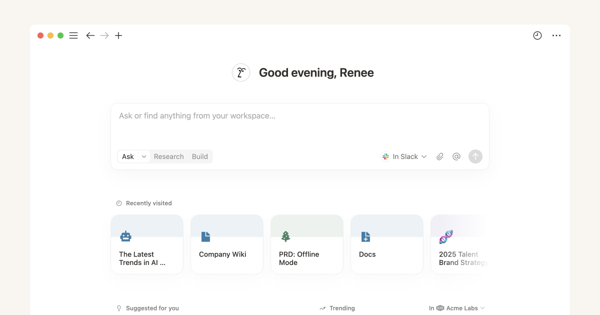
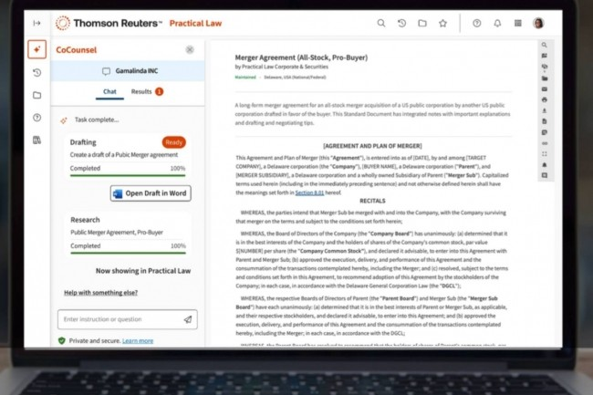
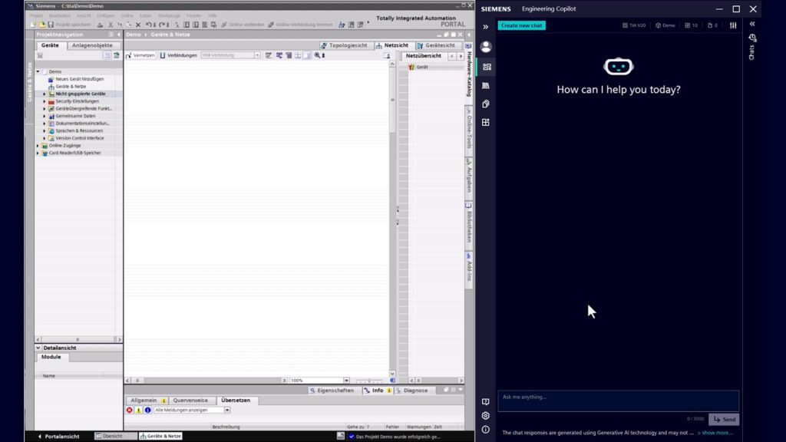
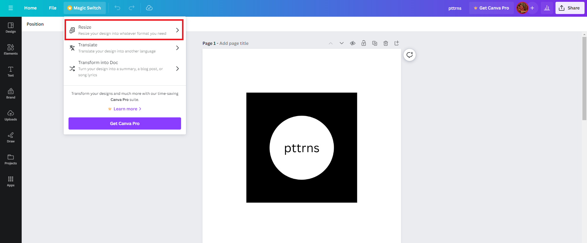
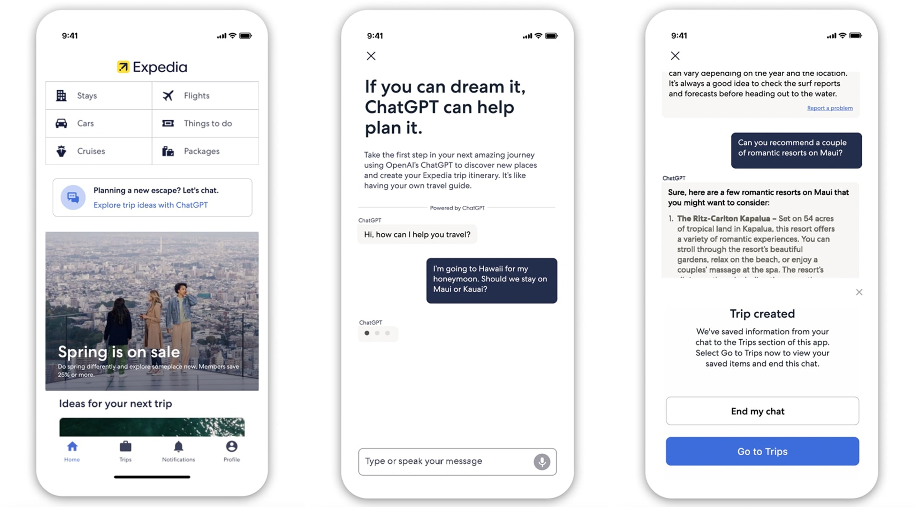
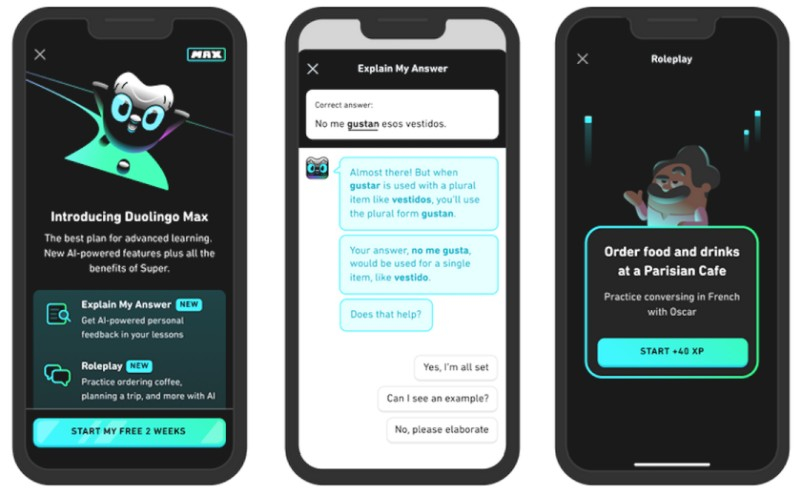
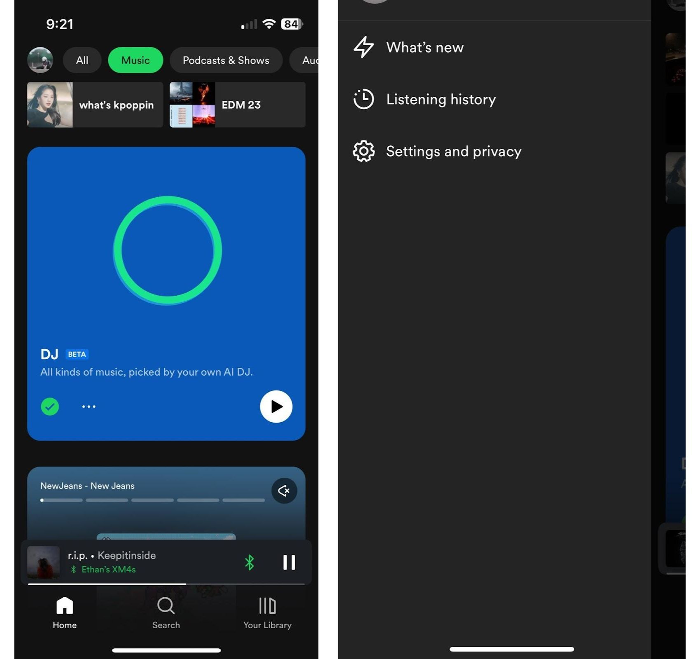

# العثور على فرص الذكاء الاصطناعي في سير العمل الحقيقي

تبدو قوائم «الذكاء الاصطناعي حسب القطاع» غنية: مال وصحة وتعليم وتصنيع، ثم أفكار كثيرة تحت كل عنوان. لكنها لا تخبرك بمن تقابله، وما البيانات التي تربطها، وأي خطوة تغيرها، ومن سيدفع مقابل النتيجة.

المشكلة أن **القطاع ليس حالة استخدام**. «الذكاء الاصطناعي + الصحة» نطاق فقط. أما «بعد الزيارة يقضي الطبيب عشر دقائق في إكمال السجل، فيكتب النظام مسودة من الحوار ويؤكدها الطبيب» فهو سير عمل يمكن بحثه وتصميمه واختباره.

راجع هذا الملحق أكثر من ستين تقريرًا استشاريًا ودراسة قطاعية وحالة منتج مباشرة. لا يحاول حصر كل القطاعات، بل يختار أعمالًا مؤسسية ولحظات استهلاكية مستخدمة بالفعل ويمكن رؤية موضع قيمتها. اعتبره خريطة لأسئلة المقابلات لا فكرة شركة جاهزة.

  

    تذكر هذه الجملة
    <strong>في المؤسسة ابحث عن انسداد في سير العمل، ولدى المستهلك ابحث عن لحظة تتكرر خلال اليوم.</strong>
  

  
الأولى تحتاج إلى دور وأنظمة وتسليم ومسؤول. والثانية تحتاج إلى سبب للعودة وخطوة يختصرها الذكاء الاصطناعي مقارنة بالبحث أو القالب أو الخدمة البشرية.

## ميّز أولًا بين المؤسسة والمستهلك

### المؤسسة: تدفع مقابل نتيجة

نادراً ما تشتري الشركة «القدرة على المحادثة» وحدها. إنها تشتري وقت معالجة أقصر وإعادة عمل أقل وامتثالًا أكثر ثباتًا أو مبيعات أكثر. يجب أن توضح الحالة القابلة للبحث من يعمل يوميًا، ومن أين تأتي المواد، وفي أي نظام تُكتب النتيجة، ومن يتحمل الخطأ.

وجد استطلاع Deloitte لـ 2,773 مديرًا أن تجارب قليلة فقط وصلت إلى النطاق الواسع. كما وجدت Accenture بعد مراجعة أكثر من 2,000 مشروع أن المؤسسات التي حققت قيمة شاملة قليلة. الصعوبة غالبًا في دخول سير العمل الكامل لا في قدرة النموذج على الإجابة. [Deloitte: State of Generative AI in the Enterprise](https://www2.deloitte.com/us/en/pages/about-deloitte/articles/press-releases/state-of-generative-ai.html) · [Accenture: Making Reinvention Real with Gen AI](https://www.accenture.com/us-en/insights/consulting/making-reinvention-real-with-gen-ai)

### المستهلك: يدفع مقابل لحظة أسهل

لا يحتاج منتج المستهلك إلى ربط عشرة أنظمة داخلية، لكن المستخدم يستطيع إغلاق التطبيق فورًا. تظهر الحالات الجيدة عند إعداد رحلة أو مقارنة سلعة أو تمرين النطق أو صنع ملصق أو ترتيب الفواتير. تنهي مهمة أولًا ثم تتعلم التفضيلات مع الوقت.

في استطلاع Capgemini لـ 12,000 مستهلك دخل الذكاء الاصطناعي في اكتشاف المنتجات ومقارنتها. وتظهر بيانات QuestMobile في الصين انتقاله من محادثة مستقلة إلى البحث والعمل والصورة والموسيقى. الفرصة هي وصل الحوار بالفعل التالي. [Capgemini: What Matters to Today's Consumer 2025](https://www.capgemini.com/insights/research-library/top-consumer-trends-in-2025/) · [QuestMobile: تقرير الإنترنت المحمول لربيع 2025](https://www.questmobile.cn/research/report/1919961024158601218/)

## المؤسسة: ثمانية أعمال تحدث الآن

يبدأ كل قسم بوظيفة محددة. قبل نسخ اسم المنتج، انظر لماذا كان العمل بطيئًا، وأي خطوة أخذها الذكاء الاصطناعي، وما الذي بقي للإنسان.

### 1. خدمة العملاء لا تجيب فقط، بل تنهي الحالة

<figure class="product-shot">
  
  <figcaption><strong>Klarna AI Assistant:</strong> لا يقول «اتصل بموظف» فقط؛ بل يفتح إجراء تأجيل الدفع ويفصل مبلغ الاسترداد. الخدمة المفيدة تجد الطلب وتكمل الإجراء.</figcaption>
</figure>

**من يعمل:** موظفو الخط الأول وقادة الفرق وتشغيل ما بعد البيع.

عند سؤال «لماذا لم يصل الاسترداد؟» يتحقق الموظف من الهوية والطلب والدفع والشحن، ويشرح القاعدة وقد ينشئ تذكرة. الوقت لا يضيع في جملة مهذبة، بل في جمع السياق بين الأنظمة.

تتعامل Klarna مع الاسترداد والمرتجعات واللغات؛ وتربط ResultsCX توجيه الصوت والحساب وواجهات الخلفية. تأتي القيمة من **معرفة الحالة ← تطبيق القاعدة ← تسجيل الإجراء ← التصعيد عند الحاجة** لا من FAQ. [حالة Klarna](https://openai.com/index/klarna/) · [حالة ResultsCX](https://aws.amazon.com/solutions/case-studies/resultscx/) · [Salesforce: State of Service 2025](https://www.salesforce.com/news/stories/state-of-service-report-announcement-2025/)

يمكن أن تبدأ النسخة الأولى بعد الحوار البشري: ملخص ونية وقاعدة وخطوة تالية، يراجعها الموظف قبل كتابة التذكرة. هكذا تقيس الوقت من دون إعطاء النموذج صلاحية الاسترداد.

  أسئلة تستحق المتابعة
  
بين أي صفحات ينتقل الموظف أكثر؟ ما الأسئلة المتكررة التي تختلف مع حالة الطلب؟ هل يعيد العميل كل شيء بعد التحويل؟

### 2. المبيعات لا ينقصها النص، بل المحادثة التالية المناسبة

<figure class="product-shot">
  
  <figcaption><strong>Morgan Stanley AI@MS Assistant:</strong> يبحث المستشار في الوثائق وحالة القضايا، مع عبارة «للاستخدام الداخلي» والتحقق البشري. إنه مدخل بحث في مكان العمل لا محادثة تتخذ القرار.</figcaption>
</figure>

**من يعمل:** مبيعات B2B ومديرو الحسابات وما قبل البيع وقادة المبيعات.

بعد الاجتماع يجب تحديث CRM، وترتيب أصحاب القرار والاعتراضات، والعثور على حالة، وكتابة المتابعة، وتحديد موعد التواصل. الأدلة موزعة بين التسجيل والمحادثة والبريد والملاحظات، فيصبح CRM قديمًا.

يغطي McKinsey العملاء المحتملين والتحضير والتواصل والعرض والإغلاق والتجديد. ولا تتخذ أداة Morgan Stanley قرار الاستثمار؛ بل تبحث في المعرفة وتحول الاجتماعات إلى ملاحظات ومهام. [McKinsey: Unlocking Gen AI in B2B Sales](https://www.mckinsey.com/capabilities/growth-marketing-and-sales/our-insights/unlocking-profitable-b2b-growth-through-gen-ai) · [حالة Morgan Stanley](https://openai.com/index/morgan-stanley/)

يمكن للنسخة الأولى معالجة الدقائق الخمس عشرة التالية: استخراج الأهداف والاعتراضات والالتزامات والخطوة المقبلة، وصياغة بريد قابل للتعديل وحقول CRM. قس الاكتمال والسرعة لا عدد الكلمات.

### 3. معرفة الشركة يجب أن تقول أي قاعدة تنطبق هذه المرة

<figure class="product-shot">
  
  <figcaption><strong>Notion Enterprise Search:</strong> يبحث السؤال في Notion وSlack ويمكن الانتقال بين Ask وResearch وBuild. المهم هو ربط المصادر والصلاحيات، لا رفع PDF واحد.</figcaption>
</figure>

**من يعمل:** الاستشارات والتشغيل والموارد البشرية والمال ودعم IT والموظفون الجدد.

الإجابات موجودة لكنها موزعة بين السياسات والأدلة والبريد والفيديو والمشروعات. سؤال «هل يستحق هذا العميل استردادًا؟» يحتاج القاعدة الحالية وشروطها ومصدرها، لا أي ملف يحوي كلمة استرداد.

يعالج مساعد Sun Life أكثر من عشرة آلاف سؤال أسبوعيًا، ووسعت Morgan Stanley البحث إلى نحو مئة ألف وثيقة. وتجمع Notion البحث والاجتماعات والتنفيذ. الجوهر هو الصلاحية والإصدار والاستشهاد والتغذية الراجعة. [Sun Life Asks](https://aws.amazon.com/solutions/case-studies/sun-life-case-study/) · [شرح Notion AI](https://www.notion.com/help/notion-ai-faqs)

لا تربط الشركة كلها أولًا. اختر سياسة المرتجعات أو دعم IT بحدود واضحة. يجب أن تستشهد الإجابة بالأصل، وإن لم تجد تقول ذلك وتضيف السؤال إلى قائمة المواد الناقصة.

### 4. المال والقانون والامتثال: اقرأ واكتب مسودة، ولا توقّع

<figure class="product-shot">
  
  <figcaption><strong>Thomson Reuters CoCounsel:</strong> يعرض تقدم الصياغة والبحث ثم يفتح Word. يقرأ الذكاء الاصطناعي ويجد الأساس ويكتب، ويراجع المختص في وثيقته المعتادة.</figcaption>
</figure>

**من يعمل:** التحليل المالي والضرائب والقانون والمشتريات والامتثال.

تتشابه العقود والفواتير والتقارير والسياسات والتدقيق والعناية الواجبة شكلًا وتختلف مضمونًا. يصلح الذكاء الاصطناعي للاستخراج والمقارنة والتصنيف والبحث والمسودة، لكن القرار يعود إلى الأصل وشخص مسؤول.

يشير استطلاع Thomson Reuters لعام 2025 إلى زيادة البحث والتلخيص والعقود وإعداد الإقرارات. تلخص Moderna العقود، وتناقش OpenAI وPwC المطابقة والتنبيهات ووكلاء المال عبر الأنظمة. [Thomson Reuters: 2025 Generative AI in Professional Services](https://www.thomsonreuters.com/en-us/posts/technology/genai-professional-services-report-2025/) · [حالة Moderna](https://openai.com/index/moderna/) · [OpenAI × PwC: أعمال CFO](https://openai.com/index/openai-pwc-finance-collaboration/)

يمكن لفريق صغير فحص الدفع والتجديد والتعويض والبيانات في عقود الموردين مع النص والخطر. أثبت معدل الإغفال ووقت المراجعة ودقة الاستشهاد قبل وعد «قسم قانوني بالذكاء الاصطناعي».

### 5. تطوير البرمجيات: تظهر القيمة داخل المستودع

<figure class="product-shot">
  
  <figcaption><strong>GitHub Copilot Code Review:</strong> يعلق على السطر وقد يقترح تعديلًا قابلًا للتطبيق. يقرأ المطور الفرق ويجمعه أو يرفضه. القيمة في Pull Request لا في محادثة أخرى.</figcaption>
</figure>

**من يعمل:** التطوير والاختبار والتشغيل والأمن.

يذهب الوقت إلى فهم الكود القديم وإضافة الاختبارات وقراءة السجلات ومراجعة التغييرات وتعلم مشروع جديد. أسرع Copilot مهمة في تجربة GitHub المضبوطة، لكن سياق المستودع والقواعد والاختبارات أهم في الفريق الحقيقي. [دراسة إنتاجية GitHub Copilot](https://github.blog/news-insights/research/research-quantifying-github-copilots-impact-on-developer-productivity-and-happiness/) · [تقرير GitHub اللاحق](https://github.blog/wp-content/uploads/2023/06/Sea-Change-in-Software-Dev.pdf)

يمكن أن تبدأ أداة داخلية من CI فاشل: تقرأ الخطأ والتغيير، وتحدد السبب وتقترح إصلاحًا وتجهز رقعة للمراجعة. تشغل الاختبارات وتعرض الفرق وتقبل المراجعة، ولا تدفع إلى الإنتاج مباشرة.

### 6. التصنيع والخدمة الميدانية: اجمع الآلة والدليل وأمر العمل

<figure class="product-shot">
  
  <figcaption><strong>Siemens Engineering Copilot:</strong> يعمل بجانب TIA Portal ويرى المشروع وبنية المعدات والوثائق الحالية بدل جواب عام عن تعطل الآلة.</figcaption>
</figure>

**من يعمل:** مشغلو المعدات ومهندسو الصيانة والخدمة والعمليات.

عندما تتوقف آلة قد يظهر رمز خطأ فقط. الجواب في مئات الصفحات وقوائم القطع وسجل الإصلاح، والخسارة بالدقيقة. وبعد الإصلاح يجب كتابة تقرير مفهوم للعميل وقابل للأرشفة.

يشرح Siemens Industrial Copilot المعدات ويبحث عن أساس الصيانة ويساعد البرمجة. وتحول تجربة أخرى ملاحظات أكثر من 1.4 مليون أمر سنوي إلى تقارير متسقة. وتعد Deloitte جودة البيانات وسياق المعدات عائقين. [Siemens Industrial Copilot](https://news.microsoft.com/source/emea/features/how-ai-is-helping-siemens-and-thyssenkrupp-bridge-skilling-gaps-in-manufacturing/) · [حالة تقارير Siemens](https://www.microsoft.com/en/customers/story/19736-siemens-ag-germany-dynamics-365-field-service) · [Deloitte: 2025 Smart Manufacturing Survey](https://www2.deloitte.com/us/en/insights/industry/manufacturing/2025-smart-manufacturing-survey.html)

ابدأ بنوع آلة لا «المصنع كله»: تعرف على الرمز، وابحث في الدليل والأوامر السابقة، واقترح ترتيب الفحص، ثم نظم التقرير. تعرض كل توصية مصدرها ويمكن للمهندس رفضها.

### 7. في الصحة ابدأ بالوثائق والتنسيق، لا بعرض تشخيصي

<figure class="product-shot">
  
  <figcaption><strong>Abridge:</strong> تعود الملاحظة الناتجة إلى الحوار الموافق. المهم ليس سرعة الكتابة بل قدرة الطبيب على التتبع والتعديل والتأكيد.</figcaption>
</figure>

**من يعمل:** الأطباء والتمريض والسجلات والتأمين وخدمة المرضى.

يقع عبء كبير خارج التشخيص: السجل والإحالة والموافقة والمطالبة والتواصل. وتركز حالات McKinsey القريبة على التلخيص والمزايا والرفض والخروج والإدارة، لا التشخيص المستقل. [McKinsey: Tackling Healthcare's Biggest Burdens with Generative AI](https://www.mckinsey.com/industries/healthcare/our-insights/tackling-healthcares-biggest-burdens-with-generative-ai)

ينشئ Abridge مسودة منظمة من الحوار ويؤكدها الطبيب. حد «مسودة ← مراجعة ← سجل» يقلل الكتابة ولا يغير المسؤولية السريرية. [حالة Abridge](https://www.abridge.com/press-release/abridge-hartford-healthcare) · [McKinsey: Generative AI in Healthcare](https://www.mckinsey.com/industries/healthcare/our-insights/generative-ai-in-healthcare-current-trends-and-future-outlook)

من دون شريك سريري وبيانات وامتثال لا تبدأ بالتشخيص. ابحث خدمة أقل خطرًا، مثل تحويل تعليمات الزيارة إلى خطوات أو تنظيم المكالمات، مع مراجعة المؤسسة.

### 8. البيع والمحتوى: على مادة واحدة المرور في قنوات كثيرة

<figure class="product-shot">
  
  <figcaption><strong>Canva Magic Switch:</strong> يغير تصميمًا مؤكدًا إلى أحجام ولغات ووثائق. إنه العمل المتكرر لصنع نسخ كثيرة من مادة واحدة.</figcaption>
</figure>

**من يعمل:** التجارة الإلكترونية والعلامة والتصميم والمنتج والتوطين.

إطلاق منتج يعني فهم البيانات والكتابة للقنوات ومعالجة الصور والأحجام والترجمة وفحص العبارات والتحديث. يضيع وقت كبير في النقل والاتساق.

تذكر Deloitte التخصيص وتشغيل المنتج وسلسلة الإمداد والتسويق. تغير Canva الحجم واللغة، وتجمع Firefly التوليد والتحرير والمواد. لا تستبدل AI حكم العلامة؛ بل تقلل صنع النسخ. [Deloitte: 2025 Retail Industry Outlook](https://www.deloitte.com/us/en/insights/industry/retail-distribution/retail-distribution-industry-outlook-2025.html) · [Canva Magic Studio](https://www.canva.com/newsroom/news/magic-studio/) · [Adobe Firefly](https://news.adobe.com/news/2025/04/adobe-revolutionizes-ai-assisted-creativity-firefly)

تخدم النسخة الأولى قناة ونوع منتج: تكتب صفحة من بيانات منظمة، وتفحص الحقول والحجم والعبارات، وينشر المشغل. هذا أوضح من «مساعد تسويق شامل».

## المستهلك: سبع لحظات يفتح فيها المنتج بنفسه

الخطأ السهل هو وضع سبع تعليمات في مربع المحادثة نفسه. تنجح المنتجات التالية لأن وراء الحوار سلعًا ودروسًا ورحلات ولوحة وموسيقى وبيانات مالية، فيكمل المستخدم المهمة.

### 1. «قلّل خياراتي»: البحث والمقارنة والشراء

<figure class="product-shot product-shot--mobile">
  
  <figcaption><strong>Amazon Rufus:</strong> يقع تحت البحث ويتناول المقارنة وPrime Day وساعات النوم. يصل الجواب إلى سلع حقيقية بدل نصيحة عامة.</figcaption>
</figure>

لا ينقص مشتري الكاميرا أو عربة الطفل أو حذاء المطر صفحات منتجات، بل تحويل الشروط الغامضة إلى خيارات قابلة للمقارنة. يجمع Rufus الكتالوج والتقييم والأسئلة، ويرى Capgemini وAdobe استخدام AI للاكتشاف والاستشارة. [Amazon Rufus](https://www.aboutamazon.com/news/retail/amazon-rufus) · [Adobe: 2025 AI and Digital Trends](https://business.adobe.com/content/dam/dx/us/en/resources/digital-trends-report-2025/2025_Digital_Trends_Report.pdf)

ابحث فئة صعبة لا عبارة «تسوق AI». مستأجر يشتري جهاز عرض يحتاج إلى المسافة وسطوع النهار والضجيج والميزانية. اعرض أساس المقارنة والمعلومات الناقصة والسلع الفعلية بدل نتيجة خبيرة مختلقة.

### 2. «لا أريد عشرين صفحة»: الرحلة والتغيرات أثناءها

<figure class="product-shot">
  
  <figcaption><strong>تخطيط Expedia:</strong> يقارن المستخدم Maui وKauai لشهر العسل ثم يحفظ الفنادق في Trips. تكتمل الحلقة عندما يصل الحوار إلى الحفظ والخطة والحجز.</figcaption>
</figure>

تجمع الرحلة الوجهة والتاريخ والنقل والساعات والميزانية والرفاق. تربط Expedia الحوار بالفنادق والأسعار والحجز. القيمة ليست مقالة جميلة، بل خطة قابلة للحفظ والفحص والشراء. [تخطيط Expedia](https://www.expedia.com/newsroom/expedia-launches-conversational-trip-planning-powered-by-chatgpt-to-inspire-members-to-dream-about-travel-in-new-ways/) · [حالة خدمة Expedia](https://www.expedia.com/newsroom/expedia-group-sets-the-standard-with-ai-powered-service-agent/)

ابدأ بـ«نصف يوم مع أطفال» أو «طريق ليلي بعد عرض». يحتاج الطقس والسعر والساعات إلى واجهات موثوقة ووقت تحديث.

### 3. «أريد أن أتدرب لا أن أستمع فقط»: التعلم والتغذية الراجعة

<figure class="product-shot product-shot--portrait">
  
  <figcaption><strong>Duolingo Max Roleplay:</strong> ليست «تحدث الفرنسية»، بل مهمة طلب في مقهى. المشهد والدور والهدف والمكافأة جاهزة، فيبدأ التدريب فورًا.</figcaption>
</figure>

تتيح AI خطوة كانت مكلفة: التدريب في أي وقت والحصول على تعليق لهذا الأداء. تستخدم Duolingo الأدوار والفيديو، ويوجه Khanmigo بالأسئلة والتلميحات بدل إعطاء الجواب. [Duolingo Max](https://blog.duolingo.com/duolingo-max/) · [Khan Academy: Khanmigo](https://2023-2024.annualreport.khanacademy.org/khanmigo)

قد يخدم المنتج حركة واحدة: مقابلة أو نطق أو اعتراض مبيعات أو مناقشة. يجب أن يقتبس التعليق الجملة ويقترح تحسينًا قابلًا للتنفيذ في المحاولة التالية.

### 4. «أعطني مسودة أستطيع تعديلها»: الإبداع الشخصي

<figure class="product-shot">
  
  <figcaption><strong>Adobe Firefly:</strong> يحوي نموذجًا ونسبة ونوعًا وشدة وصورة مرجعية ونتائج متعددة، لا مربع تعليمات فقط. يحتاج المنتج الإبداعي إلى أدوات متابعة التعديل.</figcaption>
</figure>

تواجه دعوة الميلاد وصورة المستعمل وغلاف الفيديو والملصق لوحة فارغة وبرنامجًا معقدًا. تجمع Canva التوليد والقص والتوسيع والحجم والترجمة؛ وتتابع Firefly بين الصورة والفيديو والصوت والمتجه. [Canva Magic Studio](https://www.canva.com/newsroom/news/magic-studio/) · [إطلاق Adobe Firefly](https://news.adobe.com/news/2025/04/adobe-revolutionizes-ai-assisted-creativity-firefly)

امنح تحكمًا لا «توليد مرة أخرى». حدد الناتج: صور عقار أو غلاف بودكاست أو ملصق بثلاثة أحجام، واسمح بتثبيت النص والأشخاص والألوان.

### 5. «ما الخطأ هذه المرة؟»: شرح شخصي

<figure class="product-shot">
  
  <figcaption><strong>Explain My Answer:</strong> يقتبس الجواب ويشرح لماذا ترافق gustan كلمة vestidos ويسمح بمثال آخر. يمسك لحظة «لماذا أخطأت؟» بدل درس عام جديد.</figcaption>
</figure>

يحتاج الجواب نفسه إلى شرح مختلف للمبتدئ والخبير. يبدأ Explain My Answer من الخطأ السابق ويعرف السؤال والجواب والتقدم. [Duolingo: Explain My Answer](https://blog.duolingo.com/explain-my-answer-now-free/)

ينطبق ذلك على وضعية الرياضة وإعداد الكاميرا والشطرنج والآلة الموسيقية: خذ أداء حقيقيًا وحدد أهم تحسين. «نصيحة شخصية» بلا مدخلات شخصية محتوى عام.

### 6. «لا توصِ فقط، بل تذكّر»: الموسيقى والتجربة المستمرة

<figure class="product-shot product-shot--mobile">
  
  <figcaption><strong>Spotify AI DJ:</strong> مدخل دائم في الصفحة يصل إلى الأغاني والتحكم. يعتمد على سجل الاستماع والكتالوج وفعل التشغيل، لا صوت المذيع فقط.</figcaption>
</figure>

يختار AI DJ من السجل الطويل ويربط التجربة بصوت مستمر. بيانات التفضيل والحقوق والتشغيل أصعب نسخًا من النبرة. [Spotify AI DJ](https://newsroom.spotify.com/2023-02-22/spotify-debuts-a-new-ai-dj-right-in-your-pocket/) · [Deloitte: 2025 Digital Media Trends](https://www.deloitte.com/us/en/insights/industry/technology/digital-media-trends-consumption-habits-survey/2025.html)

الجري والطبخ وقراءة الليل تجارب مستمرة أيضًا. عدل المرة التالية وفق الاختيارات السابقة واجعل التصحيح سهلًا من دون ادعاء معرفة المستخدم أكثر منه.

### 7. «حوّل القاعدة المعقدة إلى خطوتي التالية»: المال وشؤون الحياة

<figure class="product-shot product-shot--portrait">
  
  <figcaption><strong>Intuit Assist في TurboTax:</strong> يقارن إعفاء هذا العام بالسابق ثم يسأل عن إعفاءات أخرى. الأساس هو بيانات الشخص ومهمته الحالية.</figcaption>
</figure>

تشترك الضرائب والائتمان والتأمين والفواتير في قواعد معقدة ووثائق متفرقة وخطوات شخصية. يربط Intuit Assist بيانات TurboTax وCredit Karma وQuickBooks بالشرح والفعل. [Intuit Assist](https://www.intuit.com/intuitassist/)

الخطر أعلى. تناسب النسخة الأولى قوائم المواد وشرح المفاهيم وتصنيف الفواتير والتذكير، مع فصل الحقيقة والتقدير والاقتراح. تتطلب الضرائب والاستثمار والتأمين تأكيد المستخدم ومدخلًا لمختص.

## أين تجد اتجاهك المؤسسي أو الاستهلاكي؟

تعلم الحالات شكل الاستخدام، ولا تطلب تغيير اسم القطاع. يوجد اتجاهك غالبًا لدى الأشخاص والمواد والعادات التي تستطيع الوصول إليها. يبدأ البحث المؤسسي والاستهلاكي بشكل مختلف.

### المؤسسة: اتبع وظيفة واحدة حتى النهاية

لا تقول وثيقة شركة «هذه فرصة». تظهر في الوظائف والمشتريات والأدلة وتقييمات البرامج والمشروعات. اختر منسق تجارة أو موظف عقار أو استقبال عيادة أو فني صيانة واتبع عمله.

  

    أين تجد سير العمل المؤسسي؟
    <ul>
      <li><strong>مواقع التوظيف:</strong> المسؤوليات والأنظمة والجداول والتقارير اليومية.</li>
      <li><strong>المناقصات والمشتريات:</strong> المشكلات المدفوعة ومعايير القبول وحدود النظام.</li>
      <li><strong>تقييمات البرامج:</strong> ابحث في G2 وCapterra والمتاجر والمنتديات عن «تصدير إلى Excel» و«ملء يدوي كل مرة».</li>
      <li><strong>الحالات والتقارير السنوية:</strong> ابحث باسم الشركة مع التحول أو الكفاءة أو الخدمة.</li>
      <li><strong>مواد العمل الحقيقية:</strong> التذاكر والعروض والقوائم والرسائل والتدريب أقرب إلى مدخل المنتج.</li>
    </ul>
  

  

    عبارات بحث مباشرة
    
<code>سير العمل اليومي لفني الصيانة</code>

    
<code>خدمة عقارات مناقصة أتمتة filetype:pdf</code>

    
<code>site:g2.com field service software reviews</code>

    
<code>customer support workflow pain points report</code>

    
<code>قطاع تحول رقمي حالة تقرير سنوي</code>

  

إن اهتممت بالتجارة فلا تبحث «AI + تجارة» فقط. اقرأ وظيفة المنسق وسجل الرد والعرض والمواصفات والتسليم والجمارك، ثم راجع عرضًا حقيقيًا وتقييمات سيئة. قد تكون «مسودة عرض للتأكيد من الأسعار والمعاملات بعد استفسار إنجليزي» أقوى من مساعد شامل.

### المستهلك: اتبع يومًا وابحث عن احتكاك متكرر

يبدأ البحث عندما يخرج شخص هاتفه. أي البحث والمقارنة والتسجيل والتدريب والانتظار والمشاركة يحدث كل أسبوع؟ ماذا ينجز بصعوبة عبر لقطات وملاحظات ومفضلة ومجموعة؟

  

    أين تجد لحظات المستهلك؟
    <ul>
      <li><strong>App Store وAndroid:</strong> تقييمات نجمة إلى ثلاث، الوظائف الناقصة، نقطة الدفع، سبب الترك.</li>
      <li><strong>الشبكات وReddit:</strong> ابحث «كيف» و«هل توجد أداة» و«توصية»؛ التعليقات تعطي القيود.</li>
      <li><strong>Product Hunt والقوائم:</strong> الفعل الصغير الذي حله المنتج وما يريده الناس بعده.</li>
      <li><strong>الاتجاهات والزيارات:</strong> Google Trends وQuestMobile وiResearch والتقارير تؤكد عادة طويلة.</li>
      <li><strong>صورك ومفضلتك:</strong> اللقطات المتكررة والأدلة غير المفتوحة والنص المنسوخ سير غير مكتمل.</li>
    </ul>
  

  

    عبارات بحث مباشرة
    
<code>site:reddit.com "I wish there was an app"</code>

    
<code>السفر مع الأطفال التخطيط صعب</code>

    
<code>تطبيق ميزانية صعب تقييمات</code>

    
<code>Product Hunt AI language learning</code>

    
<code>نمو مستخدمي تطبيقات AI تقرير</code>

  

إن كنت تسافر فلا تبن «خطة AI» فورًا. اعرف لماذا يحفظ الناس عشرة أدلة: إغلاق مفاجئ أو مشي أقل لكبير سن أو عودة آمنة بعد حفلة. اختر لحظة متكررة لينتج أداة تُفتح لا مقالة مولدة.

### لا تكتب الكود فور العثور على المواد

احتفظ بثلاثة أدلة: وثيقة توضح السير، المشكلة نفسها من ثلاثة أشخاص، وبديل يدفع له شخص وقتًا أو مالًا. ثم اقض ستين دقيقة في التحديد.

  
<b>01</b>حدد شخصًا
في المؤسسة اكتب وظيفة، وفي المستهلك حالة حياة. «مستخدم شركة» و«شاب» واسعان.

  
<b>02</b>شاهد حدوثًا واحدًا
احصل على جدول أو تسجيل أو تقييم سيئ أو عملية حقيقية وحدد موضع التوقف.

  
<b>03</b>اعثر عليه ثلاث مرات
يجب أن تأتي المشكلة من ثلاثة أشخاص أو مصادر، لا شكوى ممتعة واحدة.

  
<b>04</b>خذ خطوة واحدة
حدد المدخل والخرج والمراجع والمقياس قبل اختيار AI.

أخيرًا اكتب جملة يستطيع غيرك تخيلها:

> عندما يواجه **من** **أي لحظة**، يستخدم الآن **أي مواد أو حيلة** لإنهاء **أي مهمة**. سأجعل AI يتولى **خطوة واحدة**، ويؤكدها **من**، وأقيس **أي تغير** للحكم على القيمة.

مثال مؤسسي:

> عندما يرى مشغل التغليف الخطأ E37 يبحث في دليل ورقي وأوامر قديمة. يجد النظام القسم وثلاث خطوات للموديل ويؤكدها فني الصيانة. يقيس الاختبار متوسط وقت التوقف.

مثال استهلاكي:

> عندما يزور والد متحفًا مع طفل يجمع منشورات وخريطة وتقييمات. يصنع المنتج خطة ثلاث ساعات وفق العمر والوقت ويستشهد بالساعات والأسعار ويضيفها إلى التقويم بعد التأكيد.

عند هذا المستوى تصبح الفكرة قابلة للمقابلة والنموذج والتجربة الصغيرة.

## المصادر

تضم القائمة **67 مصدرًا**. يعطي النص الأولوية للمنهج الواضح والحالات المباشرة؛ وتستخدم تقارير شركات الأوراق الصينية لملاحظة الاتجاه التجاري لا لإثبات الطلب. يجب مقابلة حالات الموردين بالمقابلات والبيانات الحقيقية.

1. التبني العام وقيمة المؤسسة (15)

1. [McKinsey：The Economic Potential of Generative AI](https://www.mckinsey.com/capabilities/mckinsey-digital/our-insights/the-economic-potential-of-generative-ai-the-next-productivity-frontier)
2. [McKinsey：The State of AI 2025](https://www.mckinsey.com/capabilities/quantumblack/our-insights/the-state-of-ai)
3. [PwC：2025 Global AI Jobs Barometer](https://www.pwc.com/gx/en/issues/c-suite-insights/the-leadership-agenda/AI-jobs-barometer.html)
4. [PwC：Global Workforce Hopes and Fears Survey 2025](https://www.pwc.com/gr/en/publications/specific-to-all-industries-index/hopes-and-fears-2025.html)
5. [Deloitte：State of Generative AI in the Enterprise](https://www2.deloitte.com/us/en/pages/about-deloitte/articles/press-releases/state-of-generative-ai.html)
6. [Microsoft：2025 Work Trend Index](https://www.microsoft.com/en-us/worklab/work-trend-index/2025-the-year-the-frontier-firm-is-born)
7. [IBM：5 Trends for 2025](https://www.ibm.com/thought-leadership/institute-business-value/en-us/report/business-trends-2025)
8. [IBM：2025 CDO Study](https://www.ibm.com/thought-leadership/institute-business-value/en-us/report/2025-cdo)
9. [Cisco：2025 AI Readiness Index](https://www.cisco.com/c/m/en_us/solutions/ai/readiness-index/realizing-the-value-of-ai.html)
10. [EY：2025 AI Pulse Survey](https://www.ey.com/en_us/insights/emerging-technologies/pulse-ai-survey)
11. [Accenture：Reinventing Enterprise Models in the Age of Gen AI](https://www.accenture.com/us-en/insights/artificial-intelligence/ai-investments)
12. [Accenture：Making Reinvention Real with Gen AI](https://www.accenture.com/us-en/insights/consulting/making-reinvention-real-with-gen-ai)
13. [OpenAI：The State of Enterprise AI 2025](https://openai.com/business/guides-and-resources/the-state-of-enterprise-ai-2025-report/)
14. [中国信通院：《人工智能发展报告（2024 年）》](https://hrssit.cn/Uploads/file/20241217/1734400434600250.pdf)
15. [CNNIC：《生成式人工智能应用发展报告（2025）》](https://www3.cnnic.cn/n4/2025/1021/c88-11391.html)

2. القطاعات والأدوار وسير العمل المؤسسي (24)

16. [McKinsey：Unlocking Profitable B2B Growth Through Gen AI](https://www.mckinsey.com/capabilities/growth-marketing-and-sales/our-insights/unlocking-profitable-b2b-growth-through-gen-ai)
17. [McKinsey：Capturing the Full Value of Generative AI in Banking](https://www.mckinsey.com/industries/financial-services/our-insights/capturing-the-full-value-of-generative-ai-in-banking)
18. [McKinsey：The AI-powered Bank—Customer Care](https://www.mckinsey.com/industries/financial-services/our-insights/the-ai-powered-bank-rewiring-for-excellence-in-customer-care)
19. [McKinsey：The Future of AI in Insurance](https://www.mckinsey.com/industries/financial-services/our-insights/the-future-of-ai-in-the-insurance-industry)
20. [McKinsey：Tackling Healthcare’s Biggest Burdens with Generative AI](https://www.mckinsey.com/industries/healthcare/our-insights/tackling-healthcares-biggest-burdens-with-generative-ai)
21. [McKinsey：Generative AI in Healthcare](https://www.mckinsey.com/industries/healthcare/our-insights/generative-ai-in-healthcare-current-trends-and-future-outlook)
22. [Deloitte：2025 Manufacturing Industry Outlook](https://www.deloitte.com/us/en/insights/industry/manufacturing-industrial-products/manufacturing-industry-outlook/2025.html)
23. [Deloitte：2025 Smart Manufacturing Survey](https://www2.deloitte.com/us/en/insights/industry/manufacturing/2025-smart-manufacturing-survey.html)
24. [Deloitte：2025 Retail Industry Outlook](https://www.deloitte.com/us/en/insights/industry/retail-distribution/retail-distribution-industry-outlook-2025.html)
25. [Deloitte：2025 Global Health Care Outlook](https://www.deloitte.com/content/dam/assets-zone1/tw/en/docs/industries/life-sciences-health-care/2025/2025-healthcare-outlook-en.pdf)
26. [Accenture：Commercial Banking Trends 2024](https://www.accenture.com/content/dam/accenture/final/accenture-com/document-2/Accenture-Commercial-Banking-Trends-2024.pdf)
27. [Accenture：Banking Trends 2026](https://www.accenture.com/us-en/insights/banking/accenture-banking-trends-2026)
28. [Thomson Reuters：2025 Generative AI in Professional Services](https://www.thomsonreuters.com/en-us/posts/technology/genai-professional-services-report-2025/)
29. [Salesforce：State of Service 2025](https://www.salesforce.com/news/stories/state-of-service-report-announcement-2025/)
30. [Salesforce：State of Sales 2026](https://www.salesforce.com/en/wp-content/uploads/sites/4/documents/reports/sales/salesforce-state-of-sales-report-2026.pdf)
31. [Adobe：2025 AI and Digital Trends](https://business.adobe.com/content/dam/dx/us/en/resources/digital-trends-report-2025/2025_Digital_Trends_Report.pdf)
32. [Adobe：2025 Content Creation and Management](https://business.adobe.com/content/dam/dx/us/en/resources/reports/content-management-digital-trends/2025-ai-and-digital-trends-content-creation-and-management.pdf)
33. [艾瑞咨询：《2025 年中国企业级 AI 应用行业研究报告》](https://www.bsia.org.cn/site/content/31686.html)
34. [GitHub：Quantifying Copilot’s Impact on Developer Productivity](https://github.blog/news-insights/research/research-quantifying-github-copilots-impact-on-developer-productivity-and-happiness/)
35. [Siemens × Microsoft：Industrial Copilot](https://news.microsoft.com/source/2024/10/24/siemens-and-microsoft-scale-industrial-ai/)
36. [Abridge：Hartford HealthCare Ambient AI 案例](https://www.abridge.com/press-release/abridge-hartford-healthcare)
37. [AWS：Sun Life 内部知识助手](https://aws.amazon.com/solutions/case-studies/sun-life-case-study/)
38. [AWS：ResultsCX 客服自动化](https://aws.amazon.com/solutions/case-studies/resultscx/)
39. [AWS：Sanofi 企业 AI 助手](https://aws.amazon.com/solutions/case-studies/sanofi-bedrock-case-study/)

3. المنتجات المطبقة وحالات المؤسسات (10)

40. [OpenAI：Morgan Stanley](https://openai.com/index/morgan-stanley/)
41. [OpenAI：Klarna](https://openai.com/index/klarna/)
42. [OpenAI：Moderna](https://openai.com/index/moderna/)
43. [OpenAI：BBVA](https://openai.com/index/bbva-2025/)
44. [OpenAI × PwC：Reimagining the Office of the CFO](https://openai.com/index/openai-pwc-finance-collaboration/)
45. [Microsoft：Siemens 现场服务报告](https://www.microsoft.com/en/customers/story/19736-siemens-ag-germany-dynamics-365-field-service)
46. [AWS：Legal & General 文档处理](https://aws.amazon.com/solutions/case-studies/aws-innovator-legal-and-general/)
47. [AWS × Infosys：医疗保险客服助手](https://aws.amazon.com/blogs/apn/how-infosys-built-aws-generative-ai-based-assistant-for-a-healthcare-payer-company/)
48. [Notion：Notion AI 功能说明](https://www.notion.com/help/notion-ai-faqs)
49. [Canva：Magic Studio](https://www.canva.com/newsroom/news/magic-studio/)

4. المستهلكون والمنتجات (13)

50. [Capgemini：What Matters to Today’s Consumer 2025](https://www.capgemini.com/insights/research-library/top-consumer-trends-in-2025/)
51. [Accenture：Me, My Brand and AI](https://www.accenture.com/us-en/insights/consulting/me-my-brand-ai-new-world-consumer-engagement)
52. [Deloitte：2025 Digital Media Trends](https://www.deloitte.com/us/en/insights/industry/technology/digital-media-trends-consumption-habits-survey/2025.html)
53. [QuestMobile：2025 中国移动互联网春季报告](https://www.questmobile.cn/research/report/1919961024158601218/)
54. [QuestMobile：2025 年 8 月 AI 应用行业报告](https://www.questmobile.com.cn/research/report/1967853261412208641/)
55. [艾瑞咨询：《2025 年中国 AI 类 App 流量分析报告》](https://www.etc.org.cn/UserFiles/Article/file/6388341575962762472758248.pdf)
56. [Amazon：Rufus 购物助手](https://www.aboutamazon.com/news/retail/amazon-rufus)
57. [Expedia：对话式旅行规划](https://www.expedia.com/newsroom/expedia-launches-conversational-trip-planning-powered-by-chatgpt-to-inspire-members-to-dream-about-travel-in-new-ways/)
58. [Duolingo：Duolingo Max](https://blog.duolingo.com/duolingo-max/)
59. [Khan Academy：Khanmigo](https://2023-2024.annualreport.khanacademy.org/khanmigo)
60. [Spotify：AI DJ](https://newsroom.spotify.com/2023-02-22/spotify-debuts-a-new-ai-dj-right-in-your-pocket/)
61. [Intuit：Intuit Assist](https://www.intuit.com/intuitassist/)
62. [Adobe：Firefly](https://news.adobe.com/news/2025/04/adobe-revolutionizes-ai-assisted-creativity-firefly)

5. منظور شركات الأوراق المالية الصينية (5)

63. [华鑫证券：WAIC 大会强供给，AI 应用商业化如何解](https://pdf.dfcfw.com/pdf/H3_AP202507291717868704_1.pdf)
64. [国信证券：人工智能专题——AI Agent](https://pdf.dfcfw.com/pdf/H3_AP202503121644302597_1.pdf)
65. [东吴证券：2025 年 AI 应用渗透趋势](https://pdf.dfcfw.com/pdf/H301_AP202501021641518997_1.pdf)
66. [中银证券：“人工智能+”应用与平台](https://pdf.dfcfw.com/pdf/H3_AP202510201765533690_1.pdf)
67. [AIGC 行业深度：算力、模型与应用的创新融合](https://pdf.dfcfw.com/pdf/H3_AP202411151640914780_1.pdf)

جُمعت المصادر ونُظمت في أغسطس 2026. تتأثر النسب بالعينة والمنطقة وتعريف المورد، ولا تستبدل مقابلات المستخدمين المستهدفين وبيانات التجربة.

