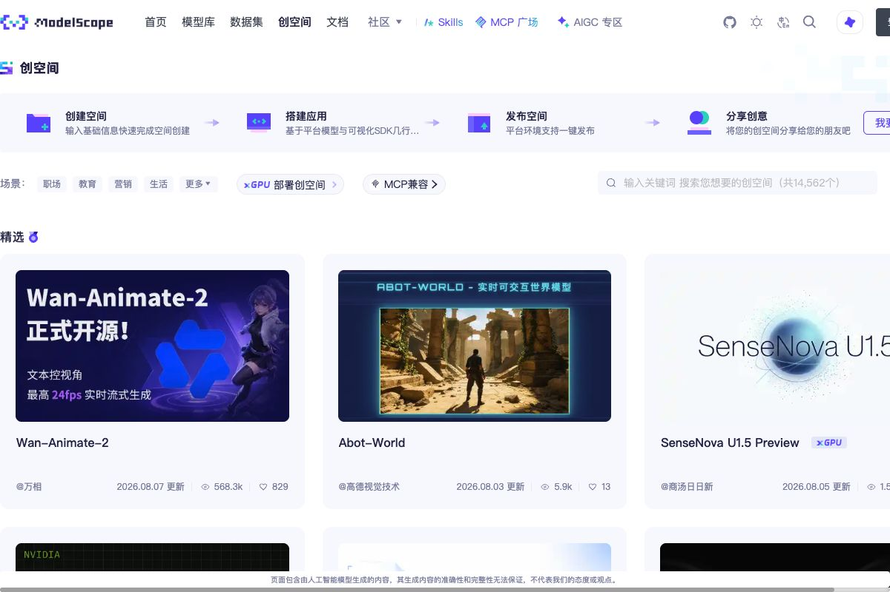
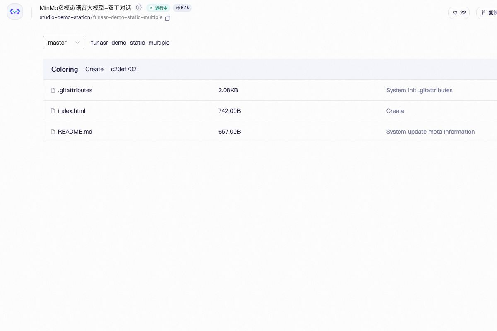

# نشر موقعك على ModelScope

بعد أن تعمل الصفحة على جهازك، تحتاج إلى رابط يستطيع الآخرون فتحه. في هذا الملحق سنستخدم **ModelScope Studio** بدل إعداد خادم كامل من الصفر.

## 1. حدد ما ستنشره

| المشروع | نوع Studio | ما يجب تجهيزه |
| --- | --- | --- |
| HTML وCSS وJavaScript | Static | ملفات الموقع و`index.html` في الجذر |
| Vue أو React أو Vite أو Svelte | Static | محتويات `dist` أو `build` بعد البناء |
| Gradio أو Streamlit | النوع الموافق | ملف بدء Python والاعتماديات |
| خلفية أو حزم نظام خاصة | Docker | Dockerfile وخدمة قابلة للتشغيل |

في مشاريع أطر الواجهة، انشر **ناتج البناء** لا مجلد الشيفرة المصدرية.

## 2. استخدم Skill النشر الرسمي

تتضمن [ModelScope Skills الرسمية](https://github.com/modelscope/modelscope-skills) الأداة `ms-studio-deploy` التي تتعرف على المشروع وتنشئ Studio وتزامن الملفات وتنشرها وتراجع السجلات.

```bash
python -m pip install -U modelscope
modelscope skills add @ModelScope/ms-hub @ModelScope/ms-studio-deploy
```

احصل على رمز من صفحة [Access Tokens](https://modelscope.cn/my/myaccesstoken) واحتفظ به محليًا فقط. لا تكتبه في الموقع أو README أو صورة مشتركة.

في مشروع Vite، ابنِ المشروع أولًا:

```bash
npm run build
cd dist
```

افتح مجلد الناتج في أداة الذكاء الاصطناعي وقل:

```text
استخدم Skill باسم ms-studio-deploy لنشر هذا المجلد في Static Studio على ModelScope. أرسل لي الرابط بعد نجاحه.
```

## 3. انشر يدويًا من الموقع

افتح [ModelScope Studio](https://modelscope.cn/studios) وسجّل الدخول.



في صفحة [إنشاء Studio](https://modelscope.cn/studios/create)، أدخل المالك والاسم والوصف ومستوى الظهور.


اختر **Static** لنوع SDK.


بعد الإنشاء افتح صفحة الملفات وارفع `index.html` وCSS وJavaScript والصور. يجب أن يوجد `index.html` مباشرة في الجذر، لا داخل مجلد `dist` إضافي.



احفظ وانتظر اكتمال النشر. افحص الرابط النهائي: الصفحة الرئيسية والأنماط والصور وعرض الهاتف ووحدة تحكم المتصفح. وإذا كان Studio عامًا فاختبره أيضًا بعد تسجيل الخروج.

## 4. التحديث وحل المشكلات

بعد تعديل المصدر، اختبر محليًا وابنِ من جديد واستبدل الملفات المنشورة ثم أعد النشر.

- اختفاء الأنماط أو الصور: راجع المسارات وإعداد `base` في Vite؛
- ظهور 404 عند تحديث مسار: فكّر في موجه يعتمد على Hash؛
- ظهور قائمة ملفات فقط: تحقق من `index.html` في الجذر؛
- الحاجة إلى مفتاح سري: لا تضعه في الواجهة، بل استخدم خدمة خلفية.

المراجع الرسمية: [ModelScope Studio](https://modelscope.cn/studios)، و[ModelScope Skills](https://github.com/modelscope/modelscope-skills)، و[`ms-studio-deploy`](https://github.com/modelscope/modelscope-skills/blob/main/skills/ms-studio-deploy/SKILL.md).
