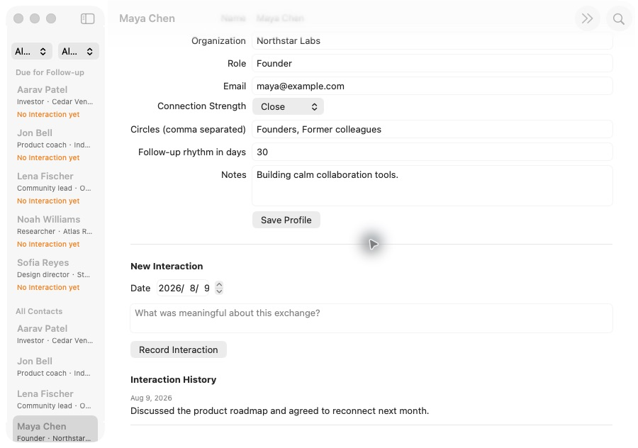

# تطوير البرمجيات بالذكاء الاصطناعي عبر GitHub Issues: من مناقشة المتطلبات إلى تطبيق macOS مكتمل

يتتبع هذا الدليل دورة كاملة للتطوير الموجّه بالمواصفات: توضيح فكرة أولية مع الذكاء الاصطناعي، وتثبيت الاتفاق في Spec، وإنشاء GitHub Issues ذات أولويات واعتماديات، ثم التنفيذ والاختبار والمراجعة.

::: info ما الفرق عن الفصل السابق؟

يشرح [من Vibe Coding إلى Spec Coding](/ar-sa/stage-3/core-skills/spec-coding/) لماذا أصبحت المواصفات محور تطوير البرمجيات بالذكاء الاصطناعي. أما هذا الفصل فهو التطبيق العملي: مستودع عام حقيقي يوضح كيف تتحول Spec إلى Issues وcommits واختبارات ومنتج يعمل.

:::

بدأ المشروع بجملة واحدة:

> أريد إنشاء CRM على macOS لإدارة جهات الاتصال التي أستوردها ومساعدتي على تنظيم علاقاتي. يمكننا البدء ببيانات تجريبية.

كانت النتيجة **Relationship Compass**، وهو تطبيق macOS أصلي يبحث في جهات الاتصال ويصفيها، ويحرر ملفات العلاقات، ويستورد CSV، ويسجل التفاعلات، ويحسب موعد المتابعة التالي.


يحتوي [مستودع المثال العام](https://github.com/sanbuphy/relationship-compass-macos) على بيانات وهمية فقط، ويحفظ المواصفة وIssues وسجل commits والكود والاختبارات.

## 1. ما هو التطوير الموجّه بالمواصفات؟

تبدو دورة البرمجة المعتادة بالذكاء الاصطناعي هكذا:

```text
وصف الفكرة → يكتب الذكاء الاصطناعي الكود → اكتشاف خطأ → إضافة تعليمات → تعديل جديد
```

قد تنجح هذه الطريقة في صفحة صغيرة. لكن مع نمو المشروع تضيع المتطلبات القديمة في المحادثة، ويصعب تتبع التقدم، وقد تعمل الميزة من دون أن تحقق النية الأصلية.

تمنح Skills الخاصة بـ Matt Pocock الذكاء الاصطناعي مسار عمل قابلاً للتكرار. تحدد Skill ما الذي يجب توضيحه، وما الناتج المطلوب، ومتى يجب انتظار تأكيد المستخدم، لا مجرد الكود المطلوب.

| تنفيذ يبدأ من المحادثة | تنفيذ موجّه بالمواصفة |
| --- | --- |
| المحادثة الحالية هي المصدر الأساسي | Spec محفوظة بالإصدارات هي المرجع |
| تضاف المتطلبات بشكل مؤقت | تُحدّث Spec والمهام أولاً |
| التقدم موجود في ملخصات الذكاء الاصطناعي | التقدم موجود في Issues وcommits |
| التشغيل يعني الاكتمال | يُفحص كل معيار قبول |

### 1.1 أدوار GitHub الثلاثة

1. **أرشيف المشروع** لحفظ Spec والمصطلحات وقرارات البنية.
2. **لوحة العمل** لعرض Issues والأولوية والاعتماديات.
3. **سجل الإنجاز** عبر commits ونتائج الاختبارات وIssues المغلقة.

| عنصر GitHub | المعنى | مثال |
| --- | --- | --- |
| Spec | ما الذي يجب أن يفعله البرنامج النهائي | `specs/relationship-compass-mvp.md` |
| Issue | مهمة يمكن إنجازها مستقلة | `#2 Browse sample Contacts` |
| Dependency | المهمة التي يجب أن تنتهي أولاً | `#3` محجوبة بواسطة `#2` |
| Commit | ما تغير في خطوة واحدة | `feat: browse sample contacts` |
| Tests | دليل أن السلوك ما زال صحيحاً | `swift test` |
| ADR | سبب قرار تقني مهم | `docs/adr/0002-native-swiftui-macos.md` |


### 1.2 المسار الرئيسي

```text
grill-with-docs → to-spec → to-tickets → implement → code-review
```

- `grill-with-docs`: يوضح نطاق المنتج والحدود التقنية.
- `to-spec`: يحول الاتفاق إلى مواصفة رسمية.
- `to-tickets`: ينشئ Issues ذات أولوية واعتماديات.
- `implement`: ينفذ Issue متاحة واحدة في كل مرة.
- `code-review`: يفحص صحة الكود وتغطية المتطلبات بشكل منفصل.

## 2. الاستعداد

تحتاج إلى حساب GitHub وGitHub CLI مسجّل الدخول وNode.js 18 أو أحدث وأداة برمجة بالذكاء الاصطناعي تقرأ Skills المشروع. لتشغيل التطبيق تحتاج أيضاً إلى Mac وXcode.

```bash
npx skills@latest add mattpocock/skills -y
gh auth status
gh repo create relationship-compass-macos \
  --public \
  --source . \
  --remote origin \
  --push
```

المثال عام لأن كل البيانات وهمية. عند استخدام جهات اتصال حقيقية استعمل `--private` وافحص العينات والسجلات وتاريخ Git قبل الدفع. أهم التصنيفات هي `ready-for-agent` و`priority:P0/P1/P2` و`completed-by-agent`.

## 3. المنتج وحدود MVP

تقدم النسخة الأولى:

- ست جهات اتصال وهمية ثابتة؛
- البحث بالاسم والمؤسسة والدور والبريد والدائرة؛
- تصفية مركبة بقوة العلاقة والدائرة؛
- تحرير الملف والملاحظات ودورية المتابعة؛
- استيراد CSV بترميز UTF-8 مع التحقق وإزالة التكرار بأمان؛
- سجل التفاعلات وحساب موعد المتابعة التالي؛
- حفظ JSON محلي واستعادته عند التشغيل.

لا تشمل النسخة مزامنة سحابية أو تقييماً للعلاقات بالذكاء الاصطناعي أو حسابات أو خلفية أو الوصول إلى Contacts في macOS.

## 4. توضيح المتطلبات باستخدام `grill-with-docs`

<div class="workflow-chat">
  <div class="workflow-message workflow-message--user">
    <div class="workflow-message__speaker">🙋 أنت</div>
    <div class="workflow-message__command">/grill-with-docs</div>
    <p>أريد إنشاء CRM على macOS لإدارة جهات الاتصال المستوردة وتنظيم علاقاتي. يمكن أن نبدأ ببيانات وهمية.</p>
  </div>
  <div class="workflow-message workflow-message--agent">
    <div class="workflow-message__speaker">✨ Agent</div>
    <p>قبل كتابة الكود سنتفق على ما تتضمنه النسخة الأولى وما تستبعده، ومكان البيانات، والتقنية، وكيفية إثبات الاكتمال. عند وجود خيار سأشرح الفروق وأوصي بحل.</p>
  </div>
</div>

أكدت المناقشة استخدام SwiftUI الأصلي على macOS 14+ وJSON المحلي وCSV بترميز UTF-8 وست عينات، ومنع الشبكة وصلاحية Contacts. يثبت `CONTEXT.md` معنى `Contact` و`Interaction` و`Follow-up`، وتسجل وثيقتا ADR سبب اختيار local-first وSwiftUI.

::: info دور GitHub في هذه المرحلة

يُحفظ السياق المؤكد في commits لملفي `CONTEXT.md` و`docs/adr/*`. لا تُنشأ Issues التنفيذ بعد.

:::

## 5. كتابة المواصفة باستخدام `to-spec`

<div class="workflow-chat">
  <div class="workflow-message workflow-message--user">
    <div class="workflow-message__speaker">🙋 أنت</div>
    <div class="workflow-message__command">/to-spec</div>
    <p>حوّل مناقشتنا المؤكدة إلى Spec كاملة، واحفظها في المستودع، وانشرها كـ GitHub Issue رئيسية تحمل تصنيف ready-for-agent.</p>
  </div>
</div>

يحتوي [`specs/relationship-compass-mvp.md`](https://github.com/sanbuphy/relationship-compass-macos/blob/main/specs/relationship-compass-mvp.md) على المشكلة وMVP و24 قصة مستخدم والقرارات التقنية واستراتيجية التحقق والاستبعادات الصريحة. تمثل [Issue #1](https://github.com/sanbuphy/relationship-compass-macos/issues/1) مدخل المشروع الظاهر.

تصف Spec الجيدة السلوك لا أسماء الملفات. فمتطلب «تظهر جهات الاتصال بلا تفاعل سابق في Follow-ups» يظل صالحاً بعد إعادة هيكلة الكود.

## 6. إنشاء Issues مرتبة باستخدام `to-tickets`

<div class="workflow-chat">
  <div class="workflow-message workflow-message--user">
    <div class="workflow-message__speaker">🙋 أنت</div>
    <div class="workflow-message__command">/to-tickets</div>
    <p>قسّم Spec إلى GitHub Issues، بحيث تسلم كل بطاقة شريحة عمودية قابلة للعرض وتوضح الأولوية ومعايير الاكتمال والمتطلبات السابقة. اعرض القائمة والاعتماديات قبل النشر.</p>
  </div>
</div>

| Issue | الأولوية | النتيجة المرئية | محجوبة بواسطة |
| --- | --- | --- | --- |
| [#2 Browse sample Contacts](https://github.com/sanbuphy/relationship-compass-macos/issues/2) | P0 | التشغيل والعينات والبحث والتفاصيل | لا شيء |
| [#3 Import and persist](https://github.com/sanbuphy/relationship-compass-macos/issues/3) | P0 | إزالة تكرار CSV وحفظ JSON | #2 |
| [#4 Organize Profiles](https://github.com/sanbuphy/relationship-compass-macos/issues/4) | P1 | الملفات وقوة العلاقة والدوائر | #2 |
| [#5 Interactions and Follow-ups](https://github.com/sanbuphy/relationship-compass-macos/issues/5) | P1 | السجل والمتابعات | #4 |
| [#6 Polish and verify](https://github.com/sanbuphy/relationship-compass-macos/issues/6) | P2 | الأخطاء والتوثيق والحزمة والتحقق | #3 و#5 |

لا نفصل النماذج وStore والواجهة والاختبارات أفقياً. تربط كل **شريحة عمودية** الحد الأدنى من الطبقات لكي يظهر للمستخدم ناتج جديد عند إغلاق Issue.

## 7. تنفيذ Issue متاحة واحدة باستخدام `implement`

<div class="workflow-chat">
  <div class="workflow-message workflow-message--user">
    <div class="workflow-message__speaker">🙋 أنت</div>
    <div class="workflow-message__command">/implement</div>
    <p>نفّذ كل Issues ذات ready-for-agent حسب الأولوية والاعتماديات. اعمل على بطاقة غير محجوبة واحدة، واكتب أولاً اختبار سلوك يفشل، ثم شغّل البناء والاختبارات وأنشئ commit منفصلاً لكل بطاقة.</p>
  </div>
</div>

في مهمة CSV يثبت اختبار فاشل أولاً أن استيراد الملف نفسه مرتين يجب ألا يكرر جهات الاتصال. وبعد التنفيذ يضمن اختبار آخر أن العنوان غير الصحيح لا يفسد البيانات الموجودة.

```bash
swift test --filter RelationshipStoreTests
swift build
swift test
```

يجتاز المشروع النهائي اختبارات السلوك العام الثلاثة عشر كلها.


عند الاكتمال يكتب Agent الـ commit ونتيجة الاختبار في Issue، ويزيل `ready-for-agent` ويضيف `completed-by-agent` ثم يغلقها.

## 8. مراجعتان باستخدام `code-review`

تفحص المراجعة الأولى الأسماء والتكرار والواجهات الضخمة والترابط وقواعد `AGENTS.md`. وتعيد الثانية قراءة Spec وكل Issues للتحقق من السلوك المطلوب.

كشفت المراجعة الفعلية عناوين CSV المكررة، وتحديد تكرار جهة اتصال بلا بريد، ومرشحات Follow-ups، والاستعادة التلقائية عند التشغيل، وعرض موعد المتابعة التالي. أضيفت الاختبارات أولاً، ثم الإصلاحات، ثم أُعيدت المراجعتان.

الاختبارات الناجحة تثبت السلوك المكتوب فيها فقط؛ ولا تثبت تلقائياً أن كل متطلبات Spec الأصلية اختُبرت.

## 9. التطبيق النهائي

| الناتج | النتيجة |
| --- | --- |
| إدارة GitHub | Issue رئيسية وخمس Issues تنفيذ مغلقة كلها |
| سجل التنفيذ | تسعة commits صغيرة حسب ترتيب الاعتماديات |
| التحقق الآلي | نجاح 13/13 اختباراً والبناء الكامل |
| المراجعة النهائية | نجاح صحة الكود وتغطية Spec |
| منتج قابل للتشغيل | يمكن إنشاء `Relationship Compass.app` |
| الخصوصية | بيانات محلية فقط، بلا Contacts أو رفع العلاقات |

### 9.1 البحث والمرشحات المركبة

يعرض البحث عن `Founder` Maya Chen وحدها، ويمكن جمع قوة العلاقة والدائرة.


### 9.2 تحرير ملف العلاقة

يمكن تعديل المؤسسة والدور والبريد وقوة العلاقة والدوائر والدورية والملاحظات.


### 9.3 تسجيل تفاعل وحساب المتابعة التالية

ينتج عن تفاعل في 9 أغسطس 2026 ودورية 30 يوماً موعد 8 سبتمبر 2026.




```bash
git clone https://github.com/sanbuphy/relationship-compass-macos.git
cd relationship-compass-macos
swift build
swift test
./scripts/package-app.sh
open "dist/Relationship Compass.app"
```

## 10. مسار جاهز للنسخ

```text
/grill-with-docs
وضّح معي النطاق والاستبعادات والبيانات والتقنية والتحقق. لا تكتب الكود قبل تأكيدي الصريح.

/to-spec
حوّل الاتفاق إلى Spec فيها سلوك المستخدم ومعايير القبول والاستبعادات، وأنشئ GitHub Issue رئيسية.

/to-tickets
قسّم Spec إلى Issues عمودية ذات أولوية ومعايير اكتمال واعتماديات.

/implement
نفّذ كل Issue غير محجوبة حسب الأولوية باستخدام TDD والتحقق وcommit مستقل.
ثم راجع صحة الكود وتغطية Spec، وأصلح كل النتائج وأعد الاختبارات.
```

## 11. متى يناسب التنفيذ المتواصل بالذكاء الاصطناعي؟

يناسب هذا المسار MVP محدد النطاق والمواقع والتطبيقات والخلفيات ذات السلوك القابل للملاحظة وأوامر الاختبار أو البناء الموثوقة. ولا يناسب المتطلبات المتغيرة كل ساعة أو النتائج غير القابلة للتحقق أو التعديل المباشر لبيانات الإنتاج.

يظل الإنسان مسؤولاً عن تأكيد النطاق وتغطية Issues وترتيبها، وعمليات الدفع والنشر والحذف والصلاحيات والخصوصية، والواجهة والمنتج النهائي. يملك الإنسان الهدف والحدود والقبول، وينفذ الذكاء الاصطناعي العمل المتفق عليه بثبات.

## الخلاصة

```text
فكرة أولية
  ↓ grill-with-docs
نطاق ومصطلحات وقرارات تقنية متفق عليها
  ↓ to-spec
متطلبات محفوظة بالإصدارات وقابلة للتحقق
  ↓ to-tickets
GitHub Issues ذات أولوية واعتماديات
  ↓ implement
اختبار وتنفيذ وcommit لكل بطاقة
  ↓ code-review
صحة الكود + تغطية Spec
  ↓
برنامج قابل للبناء والتحقق
```

بعد انتهاء المحادثة تبقى Spec وIssues والاعتماديات وcommits وأدلة الاختبار في GitHub. تبدأ الجلسة التالية من حالة المشروع المسجلة بدلاً من تخمين النية من جديد.

## المراجع

- [Skills to Spec](https://www.aihero.dev/skills-to-spec)
- [AI Skills for Real Engineers](https://www.aihero.dev/skills)
- [تغييرات Skills v1.1](https://www.aihero.dev/skills/skills-changelog-v1-1-wayfinder-to-spec-to-tickets-grilling-improvements)
- [OpenAI: حفظ مسارات العمل المتكررة كـ Skills](https://learn.chatgpt.com/codex/use-cases/reusable-codex-skills)
- [مثال Relationship Compass العام](https://github.com/sanbuphy/relationship-compass-macos)
