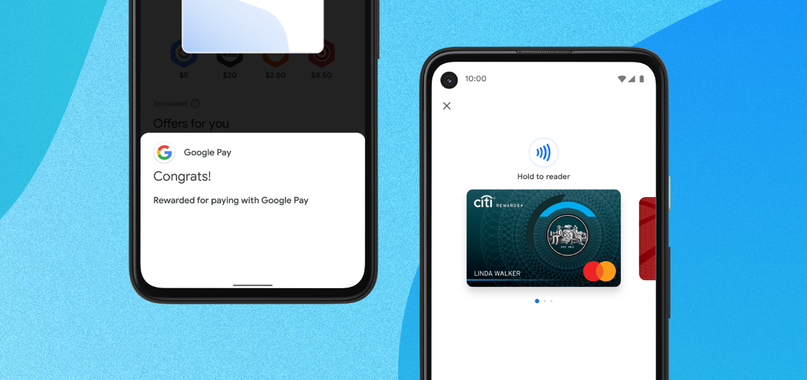
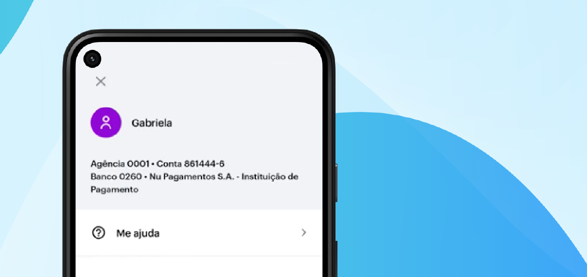
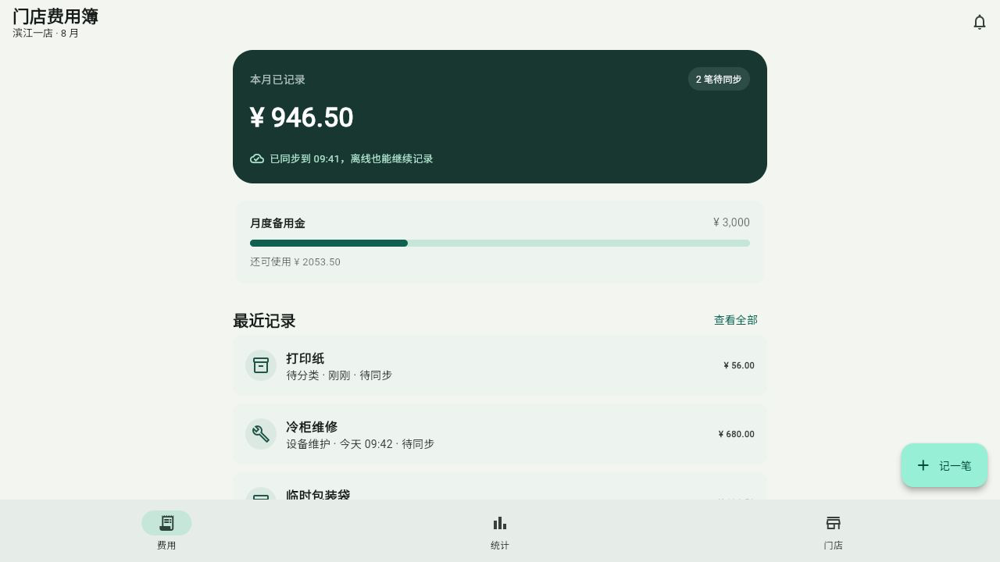
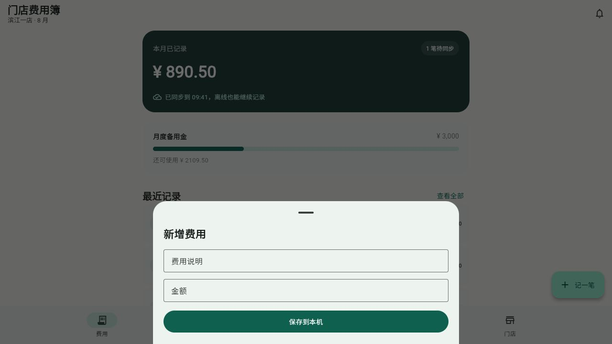
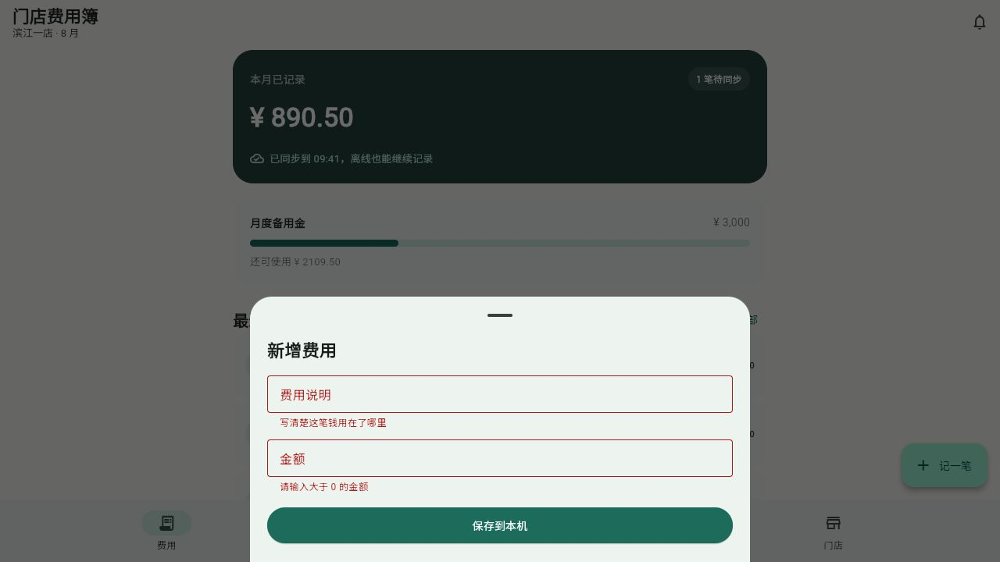
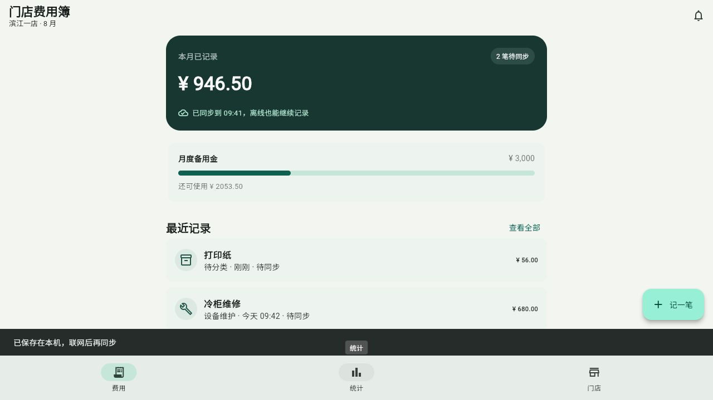

# تطوير تطبيق متعدد المنصات باستخدام Flutter

يناسب Flutter المنتجات التي تحتاج تجربة متقاربة على Android وiOS. يستخدم لغة Dart. سنبني سجل مصروفات يحدّث إجمالي اليوم ويحتفظ بالسجلات بعد إعادة الفتح.

## 1. تعلّم من منتجات حقيقية

يعرض My BMW حالة السيارة أولًا، ويؤكد Google Pay النتيجة فورًا، وينظم Nubank الحساب والمساعدة بهدوء.






## 2. شغّل المشروع

```bash
flutter doctor
flutter create store_expense_ledger
cd store_expense_ledger
flutter run -d chrome
```

## 3. الشاشة والنموذج

> استبدل مثال العداد بصفحة مصروفات تعرض إجمالي اليوم والقائمة وزر الإضافة.



> أضف الفئة والوصف والمبلغ والحفظ والإلغاء.



## 4. التحقق والحفظ

> اعرض خطأ تحت الحقل الفارغ أو المبلغ الأصغر من أو المساوي للصفر ولا تحفظه.



> بعد الحفظ أغلق النموذج وأضف السجل في الأعلى وحدّث الإجمالي ورسالة النجاح.



## 5. احتفظ بالبيانات

> احفظ المصروفات على الجهاز واستعدها عند البدء. لا تضف حسابًا أو خادمًا بعد.

احفظ سجلين ثم أعد التحميل والفتح. بعد ذلك أضف التعديل وتأكيد الحذف والمعرفات الثابتة والخلفية خطوة خطوة.

## 6. الاختبار والبناء

```bash
flutter analyze
flutter test
flutter build web
```

تم التحقق من Flutter 3.44.9 وDart 3.12.2 والتحليل وWidget Test وبناء الويب والتحقق والحفظ. لعدم توفر Android SDK وruntime صالح لمحاكي iOS، لا نعرض بناء الهاتف على أنه مكتمل.
