

# Grundlagen des Produktdenkens

## Einführung

<ChapterIntroduction :duration="duration" :tags="['Produktdenken', 'Bedarfsanalyse', 'Lösungsdesign', 'Nutzerverständnis']" coreOutput="1 vollständiger Produktentwurf" expectedOutput="Eine prüfbare Produktidee">

In den vorherigen Kapiteln haben Sie kleine Werkzeuge in z.ai und einer lokalen AI IDE gebaut. Sie können eine Idee also bereits vom Browser in ein echtes Projekt bringen.

Nun wechseln wir von <strong>„Kann ich es bauen?“</strong> zu <strong>„Was lohnt sich überhaupt zu bauen?“</strong>. Sie lernen, eine Produktidee zu beurteilen, in eine umsetzbare Anwendung zu zerlegen, mit Nutzern zu verbessern und AI nur dort einzusetzen, wo sie echten Wert schafft.

</ChapterIntroduction>

  <ClientOnly>
    <StepBar :active="0" :items="[
      { title: 'Ideenquelle', description: 'Eine belastbare Richtung finden' },
      { title: 'Zerlegung', description: 'Aus der Idee eine Anwendung machen' },
      { title: 'Verbesserung', description: 'Von nutzbar zu nützlich' },
      { title: 'AI-Verstärkung', description: 'AI gezielt einsetzen' }
    ]" />
  </ClientOnly>

## Das lernen Sie

Der Weg lautet: Idee finden → in eine Anwendung übersetzen → mit Nutzern verbessern → AI sinnvoll einbauen → die ersten echten Nutzer erreichen.

1. Woher kommen verlässliche Ideen?
2. Wie wird eine Idee klein genug, um sie zu bauen?
3. Woran erkennt man eine gute Anwendung?
4. Wo verstärkt AI den Wert?
5. Wie findet man die ersten Nutzer?

# 1. Woher kommt eine verlässliche Idee?

Viele Menschen warten auf einen genialen Einfall und beobachten Rankings oder Erfolgsgeschichten. Dauerhafte Produkte wachsen jedoch meist aus einer konkreten Alltagssituation und einem wiederkehrenden Problem. Entscheidend ist nicht, wie originell eine Idee klingt, sondern ob sie Zeit und Arbeit verdient.

## 1.1 Was ist eine Produktidee?

Ein spontaner Gedanke wird zu einer Idee, wenn vier Teile erkennbar sind:

1. **Eine bestimmte Nutzergruppe** statt „alle“.
2. **Eine konkrete Situation**, etwa der Arbeitsweg, kurz vor einem Meeting oder beim Sortieren am Wochenende.
3. **Eine klare Aufgabe**, zum Beispiel ein Dokument zusammenfassen oder ein Protokoll erstellen.
4. **Ein besserer Weg als heute**: weniger Schritte, Fehler, Sorgen oder Aufwand.

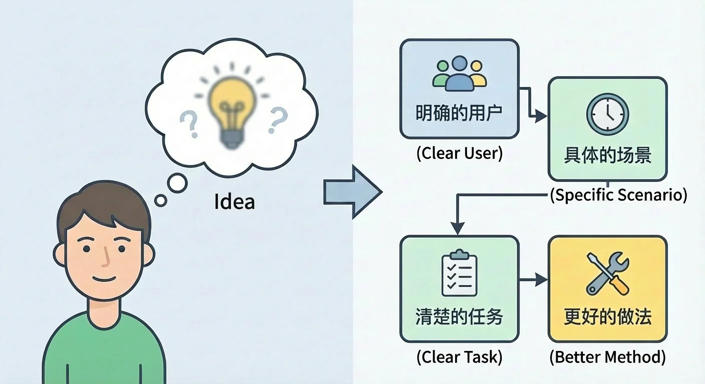

Wenn ein Teil noch fehlt, schildern Sie AI die bisherigen Annahmen und lassen Sie Lücken benennen. AI ist dabei Gesprächspartnerin, nicht Entscheiderin.

## 1.2 Idee und Nutzerbedarf: die erste Verteidigung gegen Selbstbegeisterung

Selbstbegeisterung entsteht, wenn der Ersteller von seiner Idee fasziniert ist und der Nutzer nur höflich nickt. Ein Bedarf ist der Aufwand, den jemand in einer Situation senken will — Zeit, Geld, Kraft, Risiko oder sozialen Druck — oder der Wert, den er erhöhen möchte.

Eine auffällige Funktion genügt nicht. Bei einem echten Bedarf versucht die Person das Problem bereits ohne Ihr Produkt zu lösen: mit Tabellen, Kopieren zwischen Werkzeugen, einer bezahlten Alternative oder einem unbequemen manuellen Ablauf. Ein erfundener Bedarf erscheint erst in Ihrer Präsentation und ist danach sofort vergessen.

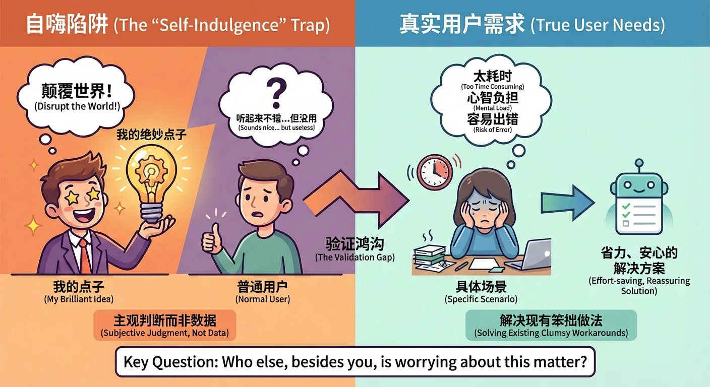

Fragen Sie: „Wer außer mir macht sich darüber ernsthaft Gedanken?“ Suchen Sie wiederkehrende Beschwerden, improvisierte Lösungen und konkrete Kosten.

## 1.3 Warum ist eine gute Idee gut?

Eine gute Idee kann mit einer einfachen ersten Version wachsen, wenn sie eine erkennbare Mühe beseitigt. Ein Sprach-zu-Text-Werkzeug mit zwei Schaltflächen wird weiterempfohlen, sobald es zuverlässig Zeit spart.

Eine schwache Idee braucht dauernd Werbung und Erklärungen; stoppt der Druck, stoppt die Nutzung. Oberfläche, Marke und Wettbewerb spielen später eine Rolle, ersetzen aber keinen Bedarf. **Die Wahl der Richtung kommt vor der Ausführung.**

## 1.4 Vier Quellen guter Ideen

Gute Ideen werden meist aus dem eigenen Leben, erreichbaren Gruppen, öffentlichen Gesprächen und vorhandenen Produkten gesammelt.

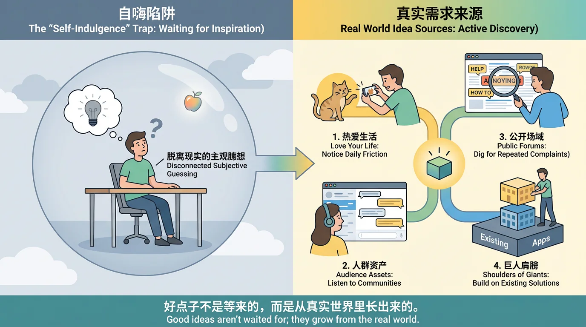

### Das eigene Leben aufmerksam leben

Wer ein Hobby wirklich ausübt, erkennt seine kleinen Reibungen. Katzenhalter wissen, wann das Tier der Kamera ausweicht. Daraus kann eine App entstehen, die neben der Kamera einen bewegten Punkt zeigt, eine Bildserie aufnimmt und lernt, welcher Reiz bei welcher Katze funktioniert.

Beim Schminken könnte ein Foto per Sprachsatz die verwendeten Produkte speichern und später nach „Bewerbung“, „warm“ oder „fünf Minuten“ gefunden werden. Beim Stadtspaziergang könnte eine Sprachnotiz Ort, Wetter und Atmosphäre markieren. Jede wiederholte Notlösung ist eine Spur.

### Aus einer bereits erreichbaren Gruppe schöpfen

Leser, Kolleginnen oder Mitglieder einer Community sind ein zugänglicher Anfang. In einer Designergruppe wiederholen sich Beschwerden über Korrekturschleifen und Formatgrößen; in einer Lerngruppe über Planung und Aufschieben.

Beobachten Sie, bündeln Sie wiederkehrende Probleme und testen Sie eine kleine Lösung mit dieser Gruppe, anstatt sofort ein Produkt für alle zu planen.

### Bedarf in öffentlichen Räumen finden

Auch ohne eigene Community finden Sie online Sätze wie „Das nervt“, „Kennt jemand eine Lösung?“ oder „Geht das nicht einfacher?“. Suchen Sie solche Formulierungen in einem Feld, das Sie verstehen.

Achten Sie auf Probleme, die monatelang wiederkehren, und auf umständliche Hilfskonstruktionen: fotografierte Papierlisten, Kopieren zwischen Anwendungen oder manuelle Datensammlung. Regelmäßiges Dokumentieren schärft den Blick für reale Probleme.

### Auf den Schultern anderer weitergehen

Hackathons, Demo Days, Wettbewerbe, Open-Source-Projekte und Produktrankings zeigen Lösungen unter knappen Bedingungen. Analysieren Sie Nutzer, Kernfunktion, überflüssige Teile und mögliche Übertragung in eine andere Gruppe oder Region.

Beobachten Sie auch Krankenhäuser, Restaurants oder Behörden: wiederholte Dateneingabe und unnötige Wartewege können systematisiert, digitalisiert oder automatisiert werden. Lernen aus Mustern ist etwas anderes als Kopieren von Marke und Text.

## 1.5 Eine gute Idee in einem Satz: die Kunst des Weglassens

„Eine App zum Englischlernen“ nennt weder Nutzer, Situation noch Ergebnis. „Eine App, mit der Pendler in zehn Minuten täglich innerhalb eines Monats hundert Kernwörter lernen“ lässt sich sofort beurteilen.

Beantworten Sie: Wem helfen Sie? In welcher Situation soll die Person an das Produkt denken? Welches sichtbare Ergebnis erreicht sie in welcher Zeit? Untersuchen Sie dafür Kurzbeschreibungen in App-Stores und Überschriften von Landing Pages.

## 1.6 Mit AI Möglichkeiten öffnen und Unterschiede finden

Beschreiben Sie die Idee und lassen Sie zwanzig Nutzergruppen, mehrere Situationen oder Einwände aus Produkt-, Markt-, Betriebs- und Techniksicht nennen. Wählen Sie danach den Bereich, den Sie verstehen und erreichen.

Eine verbreitete Richtung ist nicht automatisch wertlos. Aufgabenlisten, Vokabeltrainer und Haushaltsbücher existieren weiter, weil die Probleme bestehen. Die Differenz kann in einer kleinen Gruppe, einem festen Moment oder einem besonders gut teilbaren, druckbaren oder exportierbaren Ergebnis liegen.

AI erweitert die Landkarte. Welche Strecke Sie gehen, bestimmen Bedarf, Zugang und eigenes Interesse.

## Zusammenfassung

Eine belastbare Idee benennt Nutzer, Situation, Aufgabe und Verbesserung. Trennen Sie persönliche Begeisterung von beobachtetem Bedarf, sammeln Sie Hinweise aus vier Quellen und üben Sie die Ein-Satz-Erklärung. Sobald ein bis drei Richtungen verständlich sind, hören Sie auf, weitere Ideen zu sammeln, und zerlegen Sie eine davon.

Eine schlechte erste Fassung ist normal: **Etwas Prüfbares fertigzustellen ist wichtiger als etwas Perfektes zu erträumen.**

## 📚 Kapitelaufgabe

<StageAssignmentCard title="Drei Ideen finden, die weitere Untersuchung verdienen">
  <ol>
    <li>Notieren Sie Ideen aus Interessen, Erfahrungen und Problemen in Ihrem Umfeld.</li>
    <li>Lassen Sie AI weitere Gruppen und Situationen ergänzen, aber nicht entscheiden.</li>
    <li>Wählen Sie drei Richtungen, die Sie wirklich verstehen möchten.</li>
    <li>Beschreiben Sie jede in einem Satz: für wen, wann und mit welchem Ergebnis.</li>
  </ol>
</StageAssignmentCard>

# 2. Wie wird aus der Idee eine baubare Anwendung?

Viele scheitern an einer zu großen inneren Gesamtvision. Damit „irgendwann“ nicht zur Ausrede wird, folgen nun wiederholbare Schritte: Möglichkeiten öffnen, reduzieren, zerlegen, zeichnen, Vorbilder untersuchen und früh fragen.

## 2.1 Vom Gedanken zur Lösung: Öffnen und Schließen im Double Diamond

### Was ist das Double Diamond?

Der britische Design Council beschreibt zwei Diamanten. Im ersten wird breit geforscht und danach das Problem definiert. Im zweiten werden Lösungen geöffnet, geprüft und zu einer lieferbaren Variante verdichtet. Beide Seiten verhindern, dass man zu früh auf eine Lieblingslösung springt.

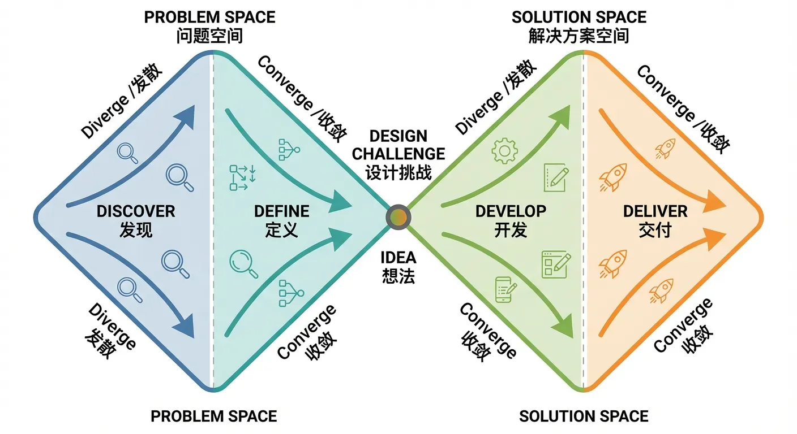

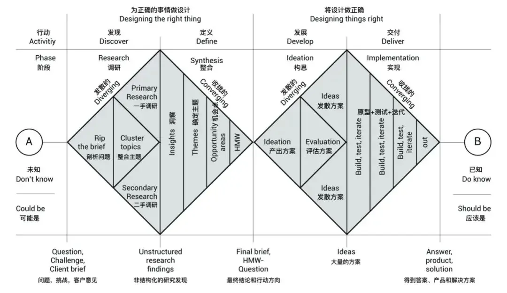

### Erster Diamant: vom Einzelproblem zum Gesamtbild und zurück

Listen Sie zunächst Situationen, Hindernisse und gewünschte Ergebnisse ohne Bewertung auf. Bei Dokumentarbeit können das ein langer Bericht vor einem Meeting, Angst vor ausgelassenen Details oder die Suche nach den eigenen Aufgaben sein.

Verdichten Sie danach auf ein oder zwei häufige, schmerzhafte Situationen. „In fünf Minuten den Kern eines langen Dokuments verstehen“ ist ein mögliches Ziel; „alle Dokumentprobleme lösen“ nicht.

### Zweiter Diamant: von groben Ansätzen zu einer ausführbaren Lösung

Erzeugen Sie mehrere Lösungen: verschiedene Zusammenfassungslängen, Audio, Markierungen oder Entscheidungsextraktion. Bewerten Sie Nutzerwert, Machbarkeit und Zeit. Textzusammenfassung kann ins MVP, aufwendige Sprachausgabe später.

Die erste Version muss nicht perfekt sein, sondern eine Aufgabe vollständig lösen. Setzen Sie etwa einen Monat als Grenze und verschieben Sie alles Größere sichtbar auf später.

## 2.2 Ausführbare Schritte gewinnen: vom Abstrakten zum Konkreten

„Effizienz verbessern“ verrät nicht, welche Seite morgen gezeichnet werden soll. Zerlegen heißt, ein breites Ziel in Entscheidungen und sofort mögliche Handlungen zu übersetzen.

### Alltagsbeispiel: Was bedeutet „Ich möchte einen Burger“?

Klären Sie zuerst das Motiv: schneller Hunger, Geschmack oder Treffen mit Freunden. Bestimmen Sie dann Art, Uhrzeit und Beilagen. Entscheiden Sie schließlich Restaurant, Lieferung oder Selbstkochen. Daraus entstehen konkrete Aktionen wie Ort suchen, Lieferzeit vergleichen oder Zutaten besorgen.

### Anwendungsbeispiel: Wo beginnt „Dokumentarbeit effizienter machen“?

#### Erste Zerlegungsebene

Definieren Sie „Dokument“: Text-PDF, Scan, Word, Tabelle oder Markdown. Definieren Sie „verarbeiten“: zusammenfassen, formatieren, übersetzen, verbessern oder Daten extrahieren. Definieren Sie „Anwendung“: persönliches Werkzeug, Team-Webseite oder Funktion in einem vorhandenen System.

Auch „Effizienz“ braucht eine Bedeutung: weniger Zeit, Fehler, Verständnisaufwand oder psychische Belastung? Die Antwort legt die Priorität fest.

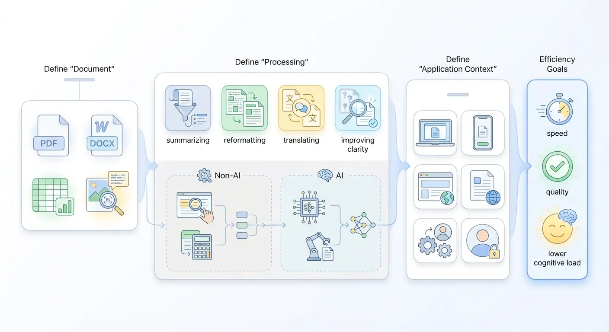

#### Zweite Zerlegungsebene

Aus „Dokumente effizienter bearbeiten“ könnte werden: „Eine Webseite, die PDF mit AI schneller und sauberer in Text überträgt.“ Nun fehlen noch Entscheidungen:

- Einfaches OCR, multimodales Modell oder LLM für Struktur?
- Nur auswählbarer Text oder auch Scans, Formeln und Spalten?
- Bedeutet Qualität korrekte Zeichen, erhaltene Überschriften oder leichte Weiterbearbeitung?
- Zwanzig Seiten in etwa zehn Sekunden oder sehr lange Dokumente mit Wartezeit?
- Zunächst ohne Konto oder gleich mit Verlauf und Rechten?

Eine sinnvolle erste Grenze könnte textlastige Berichte bis zwanzig Seiten, editierbaren Text und erhaltene Überschriftsebenen versprechen. Grenzen machen die Leistung messbar.

**Aus Entscheidungen Aufgaben machen**

Zeichnen Sie Upload und Ergebnis, wählen Sie einen Parser, testen Sie zehn typische PDF, definieren Sie akzeptable Fehler, zeigen Sie Fortschritt und erlauben Sie Kopieren sowie Herunterladen. Jeder Punkt lässt sich bauen und prüfen.

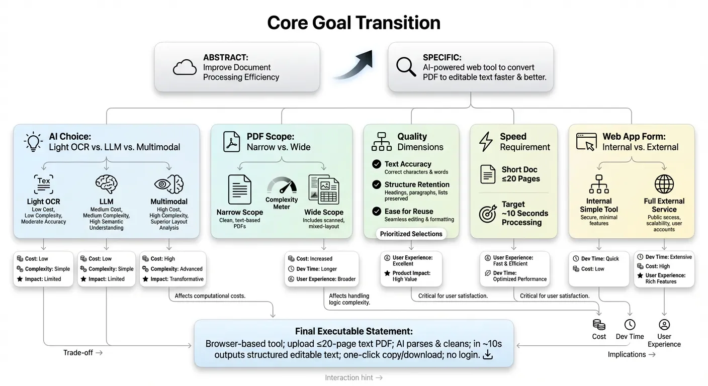

## 2.3 Die Anwendung auf dem Whiteboard entwerfen

Eine Skizze zeigt Lücken, bevor Code teuer wird. Zeichnen Sie den kleinsten Weg aus Einstieg, Bedienung und Ergebnis.

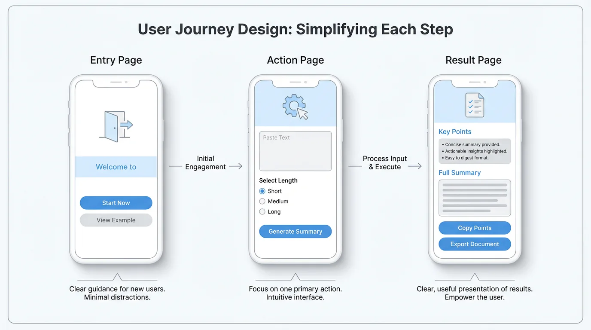

### Einstiegsseite: Wo kommt der Nutzer an und was sieht er zuerst?

Sie beantwortet in Sekunden, was das Produkt tut, für wen und welche erste Handlung zählt. Entfernen Sie Texte, die mit dieser Handlung konkurrieren.

### Bedienseite: Was muss der Nutzer eingeben, klicken oder wählen?

Notieren Sie notwendige Informationen, Reihenfolge und mögliche Fehler. Muss die Person erst viele Begriffe lernen, ist der Ablauf noch zu groß.

### Ergebnisseite: Was erhält der Nutzer und wie wird es gezeigt?

Das Ergebnis muss das Versprechen einlösen und eine natürliche Folgehandlung bieten: kopieren, korrigieren, teilen oder erneut versuchen.

## 2.4 Von anderen Anwendungen lernen: intelligent abschauen

Untersuchen Sie Produkte mit ähnlichen Aufgaben: Navigation, Formulare, Wartezustände, Ergebnisdarstellung und Einstiegshilfe. Kopieren Sie nicht Marke und Wortlaut, sondern verstehen Sie den Grund einer Entscheidung und übertragen Sie das Muster auf Ihren Nutzer.

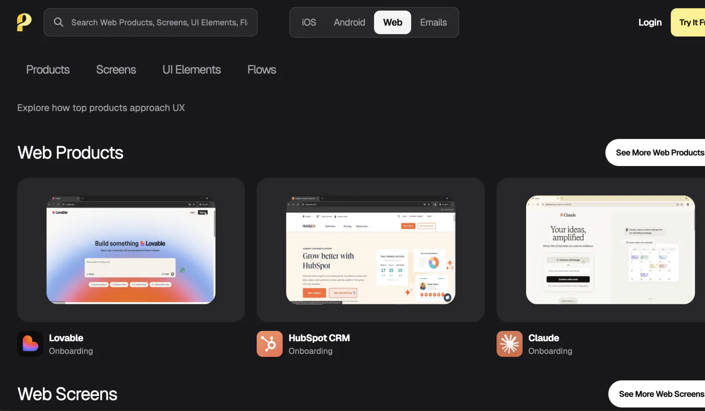

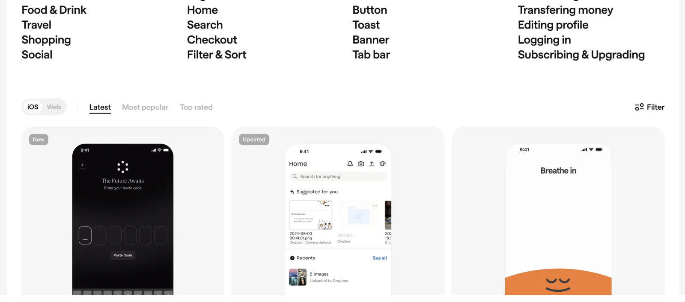

Eine Referenzsammlung aus Screenshots, Quellen und Notizen hilft auch, einem AI-Werkzeug genau zu zeigen, welches Muster Sie anpassen möchten.

Als Ausgangspunkt eignen sich diese Sammlungen von Interface-Screenshots:

- [https://www.uisources.com/](https://www.uisources.com/)
- [https://screenlane.com/](https://screenlane.com/)
- [https://pagecollective.com/](https://pagecollective.com/)
- [https://patttterns.net/](https://patttterns.net/)
- [https://mobbin.com/](https://mobbin.com/)
- [https://refero.design/](https://refero.design/)
- [https://scrnshts.club/](https://scrnshts.club/)
- [https://godly.website](https://godly.website/)

## 2.5 Nicht warten, bis alles fertig ist, bevor Sie Nutzer befragen

### Beim Zeichnen fragen

Zeigen Sie eine Skizze und lassen Sie die Person erklären, was nach einem Klick passieren wird. Erklären Sie die Lösung nicht vorher; beobachten Sie spontane Begriffe und Zweifel.

### Beim Bauen fragen

Mit einer halbfertigen Version soll jemand eine echte Aufgabe ohne Anleitung erledigen. Notieren Sie Stopps, Missverständnisse und welche Ergebnisse er speichern oder teilen möchte.

### Rauheit offen zeigen

Eine unfertige Oberfläche lädt zu Kritik ein; eine polierte macht Menschen oft höflich. Sagen Sie, dass Sie die Idee und nicht die Fähigkeit der Testperson prüfen. Verhalten ist wertvoller als Lob.

## 📚 Kapitelaufgabe

<StageAssignmentCard title="Den kleinsten Ablauf einer Idee zeichnen">
  <ol>
    <li>Wählen Sie eine der drei Ideen.</li>
    <li>Öffnen und schließen Sie den ersten Diamanten bis zu einem konkreten Problem.</li>
    <li>Vergleichen Sie Lösungen nach Wert, Machbarkeit und Zeit.</li>
    <li>Zeichnen Sie Einstieg, Bedienung und Ergebnis.</li>
    <li>Zeigen Sie die Skizze einer Person und protokollieren Sie Zweifel.</li>
  </ol>
</StageAssignmentCard>

# 3. Woran erkennt und verbessert man eine gute Anwendung?

## 3.1 Vier Merkmale einer guten Anwendung

### Sie schafft konkreten Wert

„Gefällt mir“ ist zu ungenau. Wert zeigt sich in gesparten Minuten, vermiedenen Fehlern, mehr Umsatz, schnelleren Entscheidungen oder weniger Sorge.

### Sie ist leicht zu beginnen und fast ohne Anleitung verständlich

Die Hauptaktion, der Systemzustand und der Weg aus einem Fehler sind sichtbar. Einfachheit bedeutet nicht wenig Leistung, sondern die richtige Leistung im richtigen Moment.

### In häufigen oder wichtigen Situationen erinnert man sich natürlich daran

Ein Produkt kann täglich oder nur vor kritischen Entscheidungen nötig sein. Entscheidend ist eine klare Auslösesituation: „Wenn ein langer PDF-Bericht kommt, nutze ich dieses Werkzeug.“

### Es handelt im Interesse des Nutzers

Produktdenken soll den Nutzer besser stellen und ihn nicht um jeden Preis festhalten. Vermeiden Sie täuschende Muster, erklären Sie Kosten und Grenzen und erlauben Sie Datenexport und Ausstieg.

## 3.2 Bedürfnisse verstehen: Maslows Bedürfnishierarchie

Die Hierarchie ist keine starre Formel, hilft aber, den tieferen Wert hinter einer Funktion zu erfragen.

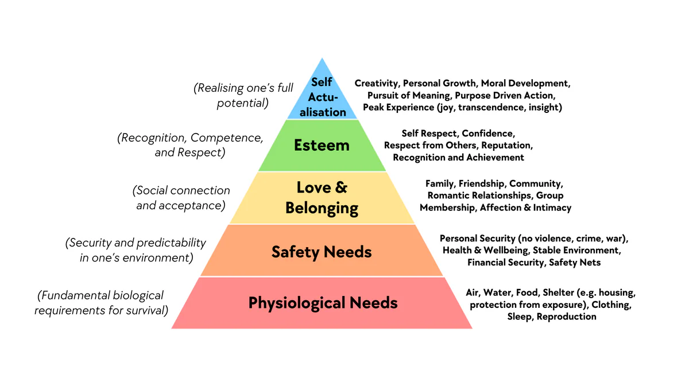

### Physiologische Bedürfnisse und Überleben

Essen, Schlaf, Gesundheit und Pflege verlangen besondere Zuverlässigkeit, weil Fehler Schaden auslösen können.

### Sicherheit und Gewissheit

Geld, Daten, Arbeit und Gesundheit brauchen Sicherung, Warnung, Nachvollziehbarkeit und klare Erklärungen.

### Zugehörigkeit, Verbindung und Gesehenwerden

Gemeinschaft und Zusammenarbeit schaffen Verbindung. Moderation und Privatsphäre gehören hier zum Kernprodukt.

### Respekt, Selbstwert und Leistung

Sichtbarer Fortschritt, Können und Anerkennung können motivieren. Kennzahlen sollen echte Erfolge zeigen und keine künstliche Angst erzeugen.

### Selbstverwirklichung und Transzendenz

Gestalten, lernen, lehren und beitragen. Gute Werkzeuge entfernen mechanische Arbeit, damit dafür mehr Energie bleibt.

## 3.3 Nach Nutzertyp unterscheiden: Consumer- und Unternehmensanwendungen

Dasselbe Problem verändert sich, wenn eine Person oder eine Organisation kauft.

### Consumer-Anwendung: Alltag, Gefühle und Gewohnheiten

Erster Eindruck, Einfachheit, individueller Preis, Privatsphäre und Empfehlung zählen. Der Nutzer kann nach Sekunden gehen und entscheidet meist selbst.

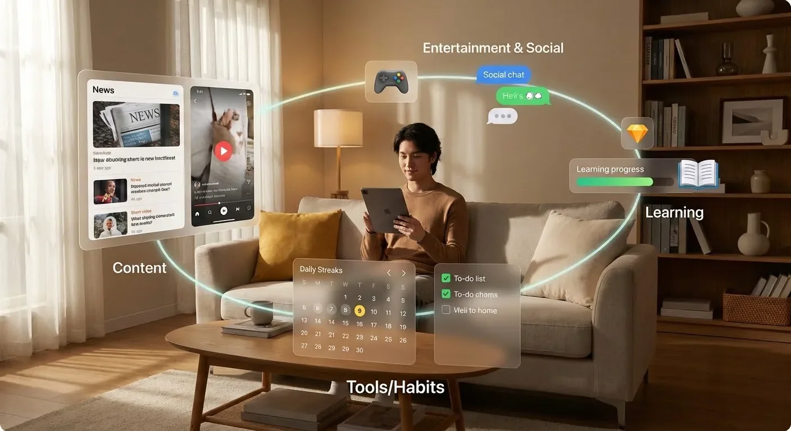

### Unternehmensanwendung: Effizienz, Kosten und Risikokontrolle

Nutzer, Leitung, Einkauf, Sicherheit und Management sind beteiligt. Wert wird in Arbeitsstunden, Fehlern, Compliance und Zusammenarbeit gemessen. Rollen, Audit, Integration und Support werden wichtig.

„Industrie“ meint hier reale Unternehmenspraxis, nicht zwingend Fabriken: Verträge freigeben, Kundenservice, Bestand koordinieren oder Berichte erstellen.

## 3.4 Mit Nutzerdaten verbessern: von „ich finde es gut“ zu „sie finden es gut“

### Einen einfachen Feedbackkanal gestalten

Stellen Sie nach dem Ergebnis eine kurze Frage bereit, bieten Sie einen Problemkanal und führen Sie gelegentlich Interviews. Feedback darf nicht selbst zur Arbeit werden.

### Drei Arten aus ungeordnetem Feedback herauslesen

Trennen Sie Blocker, Reibung und Funktionswünsche. Reparieren Sie zuerst, was die Kernaufgabe verhindert; prüfen Sie danach, ob ein Wunsch für mehrere Nutzer gilt.

### Mit drei einfachen Kennzahlen über weitere Investitionen entscheiden

Beobachten Sie **Rückkehr**, **wiederholte Aufgabenerledigung** und **Empfehlung oder Zahlung**. Keine Zahl erklärt alles, gemeinsam zeigen sie aber, ob das Produkt im Alltag ankommt.

# 4. Wo und wie verstärkt AI den Wert?

## 4.1 Nicht AI nur um der AI willen einsetzen

Fragen Sie, ob das Produkt ohne Modell bereits einen Wert besitzt. Wenn Regeln, Vorlagen oder Suche billiger und zuverlässiger sind, nutzen Sie diese. AI gehört dorthin, wo das Verstehen von Text, Bild, Stimme oder Varianten das Ergebnis klar verbessert.

## 4.2 Die Rolle der AI festlegen

AI kann klassifizieren, zusammenfassen, erzeugen, empfehlen, sprechen oder Schritte koordinieren. Definieren Sie ebenso die menschliche Rolle: Kontext liefern, Entscheidungen bestätigen, korrigieren und riskante Aktionen verantworten.

Notieren Sie für jede Funktion Eingabe, Ausgabe, mögliche Fehler, Prüfung und Ersatzweg. So wird „AI verwenden“ zu einem prüfbaren Entwurf.

## 4.3 Fähigkeiten und Grenzen von AI kennen

Modelle verarbeiten Text, Bild, Stimme, Video und Werkzeuge, können aber Fakten erfinden, Kontext verlieren und schwanken. Sensible Daten, medizinische, rechtliche oder finanzielle Entscheidungen und irreversible Aktionen benötigen Kontrollen.

Messen Sie kürzere Aufgabenzeit, bessere Qualität, häufigere Nutzung oder Zahlungsbereitschaft. Wird der Ablauf nur teurer und unberechenbarer, verstärkt AI keinen Wert.

# 5. Wie findet man die ersten echten Nutzer?

## 5.1 Zwei Phasen unterscheiden: 0–1 und 1–N

### 0–1: Kaltstart, solange noch niemand das Produkt nutzt

Finden Sie wenige passende Menschen, begleiten Sie eine echte Aufgabe und prüfen Sie, ob sie wiederkommen. Einladen, beobachten, antworten und schnell ändern geschieht zunächst manuell.

### 1–N: Auf einer funktionierenden Basis wachsen

Erst wenn eine Gruppe wiederholt Wert erhält, sind automatisierte Gewinnung, weitere Kanäle, Teamaufbau und Kostenoptimierung sinnvoll.

### Warum zuerst 0–1?

Eine fehlerhafte Erfahrung zu skalieren vervielfacht den Fehler. Zwanzig gut begleitete Nutzer lehren mehr als tausend anonyme Besuche.

## 5.2 Kaltstart-Objekte: Seed-Nutzer, Anbieter, Reichweite und Kanäle

### Erste Gruppe: Seed-Nutzer

Sie ähneln dem Zielbild und tolerieren eine frühe Version. Ihr Wert liegt darin, zu zeigen, wann sie das Produkt brauchen und warum sie zurückkehren.

### Zweite Gruppe: Anbieter

Marktplätze, Communities und Inhaltsprodukte benötigen Leistungen, Kurse, Vorlagen oder Beiträge. Ohne Angebot führt Werbung nur zu einer leeren Oberfläche.

### Dritte Gruppe: Reichweitenpartner

Creator, Lehrkräfte, Community-Verantwortliche und Medien erreichen bereits Ihre Zielgruppe. Eine kleine, genaue Überschneidung kann wertvoller sein als ein großes allgemeines Publikum.

### Vierte Gruppe: Kanäle

Schulen, Firmen, Verbände, Plattformen und Softwareanbieter bieten strukturierten Zugang. Beginnen Sie mit einer Klasse, einem Team oder einer lokalen Gruppe.

## 5.3 Drei Hauptwege für den Kaltstart

### Weg eins: Mit Seed-Nutzern und dem eigenen Netzwerk beginnen

Laden Sie passende Personen persönlich ein. Erklären Sie Nutzer, Problem, Testdauer und Umgang mit Feedback. Beobachten Sie die vollständige Aufgabe und machen Sie reale Fälle zu ersten Produktgeschichten.

### Weg zwei: Mit Inhalt oder Vorteil einen klaren ersten Grund geben

Eine kostenlose Probe, eine nützliche Vorlage oder sehr zielgerichteter Inhalt kann den ersten Versuch rechtfertigen. Entscheidend ist der Übergang vom Inhalt zu einer vollständigen Produkterfahrung.

### Weg drei: Eine bestehende Plattform nutzen

Ein Händler kann auf einer Plattform mit Zahlung und Bewertung anfangen; ein Werkzeug als Erweiterung oder Integration. Finden Sie die kleine Stelle, an der Ihre Nutzer bereits versammelt sind.

## 5.4 Mit knappen Ressourcen entscheiden: nur einen wichtigen Teil vertiefen

### Vom allgemeinen Ziel zur konkreten Aufgabe

Ersetzen Sie „Marktreaktion prüfen“ durch: „In vier Wochen erledigen zwanzig passende Nutzer mehrfach eine echte Aufgabe und geben konkrete Rückmeldung.“ Definieren Sie, was vollständig bedeutet.

### Nicht alles gleichzeitig ausprobieren

Wählen Sie den natürlichsten Weg: Inhalte, wenn Sie bereits schreiben; eine Community, wenn Sie Zugang haben; ein Team-Pilot, wenn Sie Verantwortliche kennen. Täglicher Kanalwechsel erzeugt Aktivität, aber kein Lernen.

### Nur den entscheidenden Teil verbessern

Konzentrieren Sie sich vier Wochen darauf, dass die zwanzig Nutzer von „kaum nutzbar“ zu „passt in meinen Ablauf“ gelangen. Verschieben Sie alles, was weder diese Erfahrung verbessert noch ähnliche Nutzer findet.

Der erste geschlossene Kreis lautet: **Nutzer finden → Nutzung begleiten → Feedback sammeln → verbessern → Rückkehr erreichen**.

# Fazit

Produktdenken verbindet die gesamte Strecke: eine Idee mit Nutzer, Situation, Aufgabe und Verbesserung; eine mit dem Double Diamond reduzierte Lösung; ein früh gezeichneter und getesteter Ablauf; Bewertung durch Verhalten; AI nur an wertschaffenden Stellen; und eine kleine, eng begleitete erste Nutzergruppe.

Ein rauer Anfang, wenige Funktionen und fehlende Zahlungen sind Prozessdaten, keine endgültige Niederlage. Beobachten, prüfen und verbessern Sie jeweils einen Teil.

Wie es in _To the Moon_ heißt: **„Das Ende ist nicht wichtiger als irgendeiner der Momente, die dorthin führen.“**

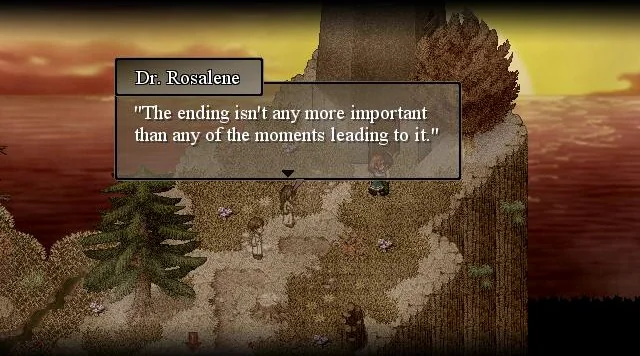
