## Mit AI aktiv lernen

::: tip 💡 Die wichtigste Lernregel: Bei einer Frage zuerst AI fragen
Betrachten Sie AI als erste Anlaufstelle. Wenn ein Begriff unklar ist, ein Werkzeug sich nicht installieren lässt, ein Befehl fehlt, ein Programm einen Fehler meldet oder der nächste Schritt unbekannt ist: **Fragen Sie AI und probieren Sie die Antwort danach selbst aus**.

Fragen, die früher an Lehrkräfte oder Mitschüler gingen, können zuerst an AI gehen. Sie antwortet schnell, erlaubt Rückfragen und kann Fehlermeldung und Projektkontext gemeinsam betrachten. Verwenden Sie sie nicht nur zum Schreiben von Code und warten Sie nicht, bis Sie lange feststecken.

**AI-natives Lernen bedeutet: Problem schildern, Antwort ausprobieren, Ergebnis prüfen und mit dem neuen Ergebnis weiterfragen.**
:::

### Der AI-native Lernkreislauf

AI soll die Suche nach Antworten verkürzen, damit mehr Zeit für **Ausprobieren, Prüfen und Verstehen** bleibt.

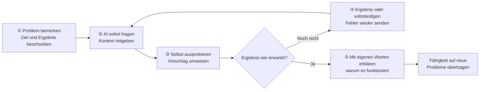
```mermaid
flowchart LR
  A["① Problem bemerken<br/>Ziel und Ergebnis beschreiben"] --> B["② AI sofort fragen<br/>Kontext mitgeben"]
  B --> C["③ Selbst ausprobieren<br/>Vorschlag umsetzen"]
  C --> D{"Ergebnis wie erwartet?"}
  D -- "Noch nicht" --> E["④ Ergebnis oder vollständigen<br/>Fehler wieder senden"]
  E --> B
  D -- "Ja" --> F["⑤ Mit eigenen Worten erklären<br/>warum es funktioniert"]
  F --> G["Fähigkeit auf neue<br/>Probleme übertragen"]
```

### Typische Fragen können Sie direkt so stellen

| Situation | Frage an AI |
| --- | --- |
| Begriff unklar | „Ich habe keine Programmiererfahrung. Erkläre eine API mit einem Alltagsvergleich und zeige ein kleinstes Beispiel.“ |
| Umgebung fehlt | „Ich nutze macOS. Prüfe die Voraussetzungen und führe mich jeweils nur durch einen Schritt.“ |
| Befehl scheitert | „Hier sind Befehl und vollständiger Fehler. Nenne die wahrscheinlichste Ursache und die kleinste Korrektur.“ |
| Nächster Schritt unklar | „Das Snake-Spielfeld wird angezeigt. Was ist der kleinste nächste Schritt und wann ist er fertig?“ |
| Code unverständlich | „Ändere noch nichts. Erkläre die letzte Änderung nach Modulen und Zweck.“ |
| Zwei Wege möglich | „Vergleiche A und B für einen Einsteiger, der schnell eine lauffähige Version braucht, und empfehle einen.“ |
| Ergebnis sieht anders aus | „Gewünscht ist …, tatsächlich ist …. Vergleiche beides und korrigiere zuerst nur den deutlichsten Unterschied.“ |

::: info Wiederverwendbare Vorlage
**Mein Ziel ist …; ich bin bei …; ich habe … versucht; Ergebnis oder vollständiger Fehler ist …; erkläre zuerst die Ursache und nenne danach die kleinste nächste Aktion.**
:::

# AI-Programmierwerkzeuge verstehen und verwenden

## Kapitelüberblick

<script setup>
import { relatedArticlesMap } from '@theme/data/relatedArticles'
import StageAssignmentCard from '@theme/components/StageAssignmentCard.vue'

const duration = 'Etwa <strong>1 Tag</strong>, auch in mehreren Sitzungen möglich'
const relatedArticles =
  relatedArticlesMap['de-de/stage-1/introduction-to-ai-ide'] ?? []
</script>

<ChapterIntroduction :duration="duration" :tags="['Lokale Entwicklungsumgebung', 'IDE und AI IDE', 'Entwicklungsablauf']" coreOutput="1 selbst entwickeltes Minispiel" expectedOutput="Mit Trae erstellt">

Bisher haben wir AI-Programmierung im Browser ausprobiert. Dort sind Dateiverwaltung, dauerhafte Speicherung und größere Projekte eingeschränkt. In diesem Kapitel kommt die Entwicklungsumgebung auf den eigenen Rechner.

Wir klären den Unterschied zwischen IDE und AI IDE, installieren Trae, erstellen lokal ein Snake-Spiel und lernen eine Arbeitsweise, bei der kleine Änderungen immer wieder ausgeführt und geprüft werden.

::: tip Für Fortgeschrittene
Wer bereits programmieren kann, kann zusätzlich [moderne CLI-Coding-Werkzeuge](../../stage-2/backend/modern-cli/) verwenden.
:::

</ChapterIntroduction>

<div style="margin: 50px 0;">
  <ClientOnly>
    <StepBar :active="0" :items="[
      { title: 'Umgebung', description: 'IDE und AI IDE verstehen' },
      { title: 'Praxis', description: 'Snake mit Trae bauen' },
      { title: 'Werkzeug', description: 'Oberfläche kennenlernen' },
      { title: 'Gespräch', description: 'AI klar anleiten' }
    ]" />
  </ClientOnly>
</div>

## 1. Welche Umgebung und Werkzeuge braucht man zum Programmieren?

### 1.1 Denkwechsel: Bei einem Problem zuerst AI fragen

Früher suchte man für jede Python-Installation, jeden Conda-Schritt und jeden npm-Fehler mehrere Anleitungen. Mit einer AI IDE können Sie zuerst Ziel und Problem schildern. AI kann Installation erklären, Befehle vorschlagen oder sie mit Ihrer Bestätigung ausführen.

- „Prüfe, ob Python installiert ist, und führe mich sonst durch die Installation.“
- „Der Download hängt. Prüfe, ob Netzwerk oder Paketquelle die Ursache sind.“
- „Erstelle eine virtuelle Umgebung mit dem Namen demo und erkläre den Zweck.“

Sie müssen nicht jeden Befehl auswendig kennen. Sie müssen Ziel, beobachtetes Ergebnis und Grenzen verständlich beschreiben.

### 1.2 Warum Umgebung und Werkzeuge nötig sind

Ein Texteditor kann Code speichern, aber bei mehreren Dateien entstehen schnell Probleme: keine Syntaxfarben, wenig Vervollständigung, keine Projektübersicht und schwierige Fehlersuche. Eine IDE organisiert Dateien, startet Programme und zeigt Fehler im Zusammenhang.

## 2. Was ist eine IDE und warum braucht man sie?

::: info Vorbereitung
Wenn die Oberfläche völlig neu ist, lesen Sie ergänzend die [IDE-Grundlagen](/de-de/appendix/2-development-tools/ide-basics).
:::

Frühe Programmierer arbeiteten in Terminal und einfachen Editoren.


Auf Servern werden Werkzeuge wie Vim bis heute verwendet.

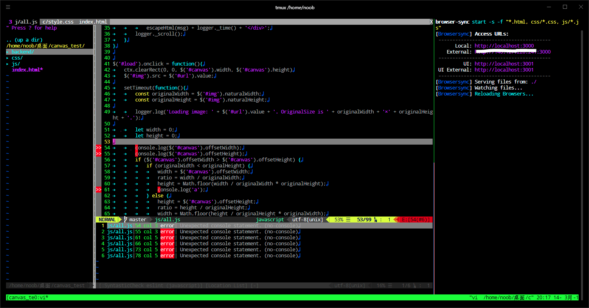

Moderne IDEs verbinden Editor, Dateibaum, Terminal, Ausführung, Debugging und Git. [Visual Studio Code](https://code.visualstudio.com/) ist leicht und erweiterbar.

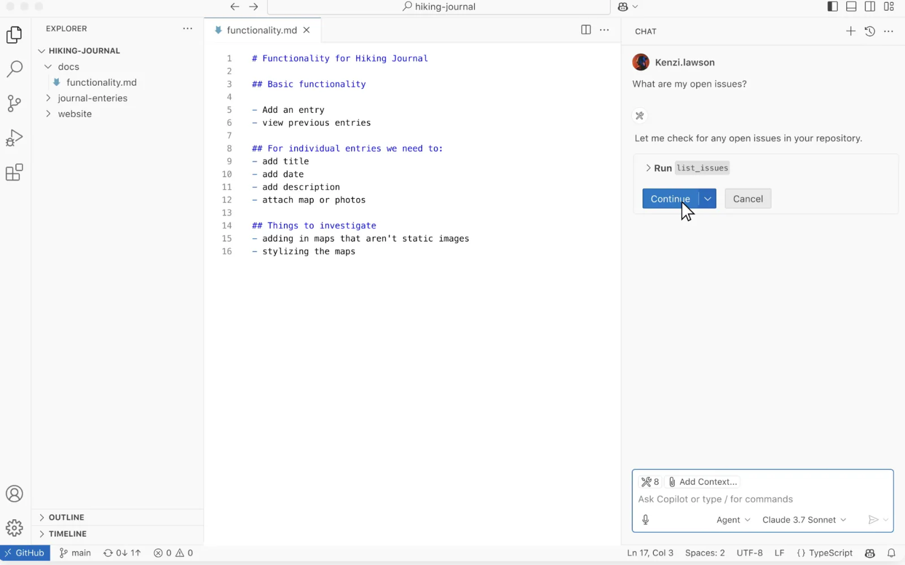

Der Editor färbt Code und ergänzt Namen.

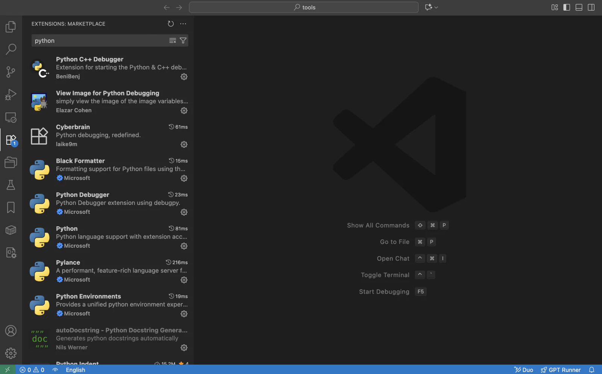

Debugger, Suche und Versionsverwaltung helfen bei größeren Projekten.

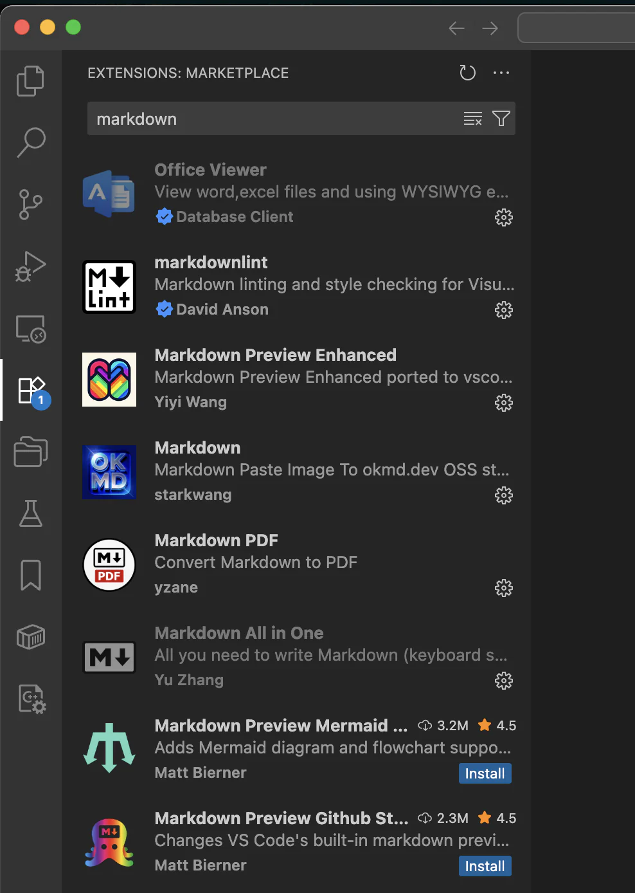

Mehr Details finden Sie in der [visuellen Erklärung der IDE](/de-de/appendix/2-development-tools/ide-basics).

## 3. Was unterscheidet eine AI IDE von einer normalen IDE?

Eine normale IDE führt Ihre Befehle aus. Eine AI IDE versteht zusätzlich natürliche Sprache, liest mehrere Projektdateien, schlägt einen Plan vor, ändert Dateien und kann Befehle ausführen. Sie bleibt trotzdem ein Werkzeug: Änderungen und Ergebnis müssen geprüft werden.


::: info Häufig verwendete AI-Entwicklungsumgebungen

### [Antigravity](https://antigravity.google/)

Antigravity verbindet einen agentischen Arbeitsbereich mit aktuellen Modellen und eignet sich für mehrschrittige Aufgaben. Prüfen Sie vor der Nutzung Verfügbarkeit und Abrechnung in Ihrer Region.

### [Trae](https://www.trae.ai/)

Trae basiert auf der VS-Code-Oberfläche und bietet Chat- sowie Agentenmodi. Dieses Kapitel nutzt Trae als Beispiel, die Arbeitsweise lässt sich aber auf andere Werkzeuge übertragen.


### [Cursor](https://cursor.com/)

Cursor kombiniert Editor, projektweite Suche, Chat und Agentenänderungen. Es ist verbreitet bei Teams, die eine VS-Code-nahe Oberfläche wünschen.

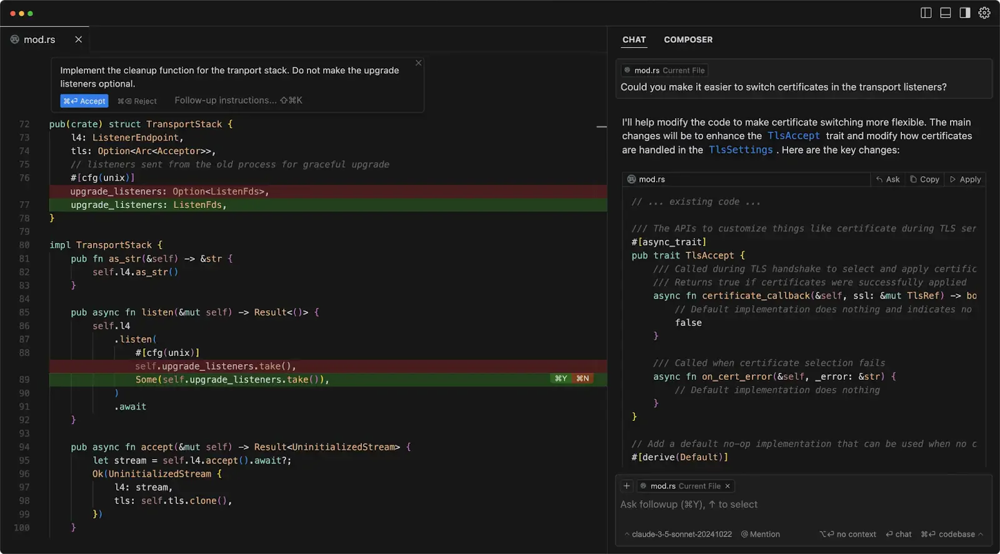

### [Qoder](https://qoder.com/)

Qoder bietet Codeverständnis, Aufgabenplanung und Agentenfunktionen. Modellangebot und Tarife können sich ändern.

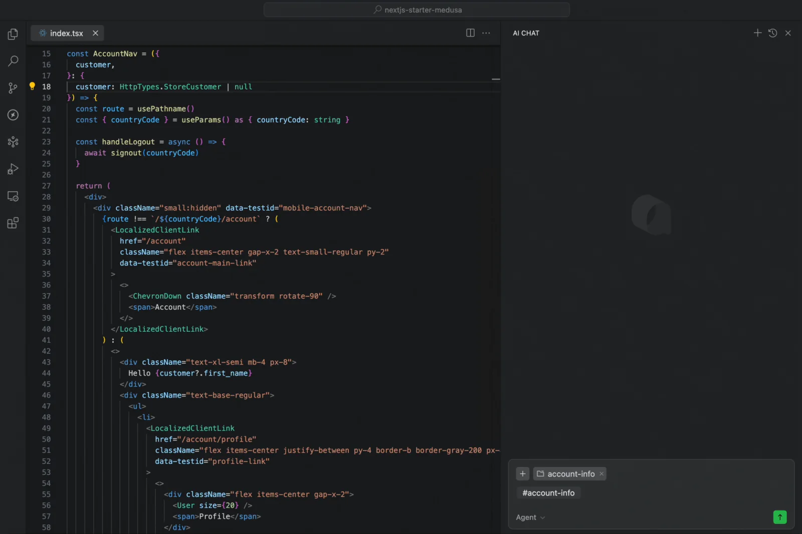

### [CodeBuddy](https://www.codebuddy.com/)

CodeBuddy richtet sich an Entwicklung mit integriertem Chat und Codeänderungen und bietet je nach Region unterschiedliche Modelle.

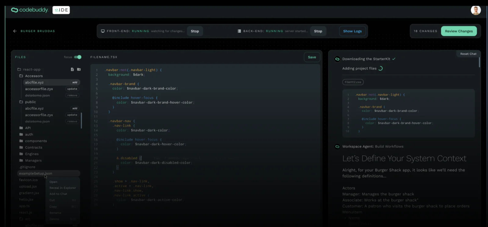

### VS Code + [Cline](https://cline.bot/)

Cline ist eine Erweiterung, die Agentenarbeit in VS Code bringt. Sie wählen Modellanbieter und Schlüssel selbst, behalten dafür aber auch Kosten und Berechtigungen im Blick.

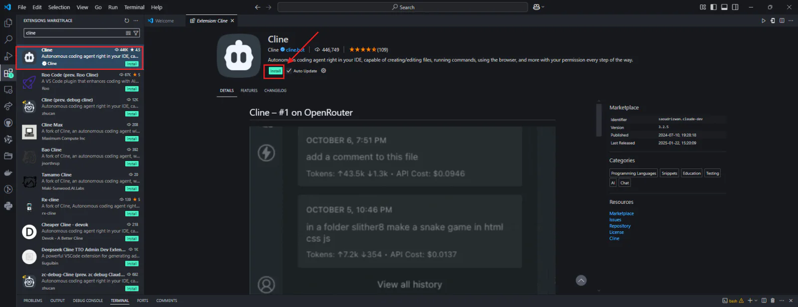

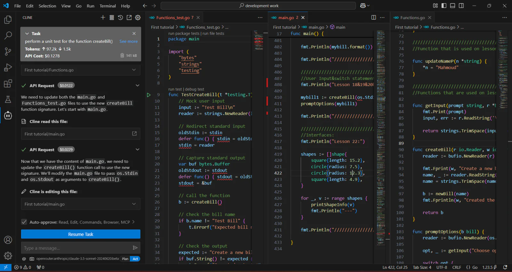

### [Kiro](https://kiro.dev/)

Kiro stammt von AWS und verbindet spezifikationsorientierte Entwicklung mit der AWS-Umgebung. Es ist besonders interessant, wenn eine Anwendung ohnehin AWS-Dienste verwendet.

:::

## 4. Praxis: Mit einer AI IDE lokal ein Snake-Spiel erstellen

Der kürzeste Ablauf lautet: **leeren Ordner erstellen → in der AI IDE öffnen → Ziel im Chat beschreiben → Änderungen prüfen → Projekt starten**.

### 4.1 Vorbereitung: Trae installieren und kennenlernen

#### Was ist Trae?

Trae ist eine auf VS Code aufbauende AI-Entwicklungsumgebung. Der Agent kann Dateien erstellen, Abhängigkeiten installieren, Fehler lesen und mehrere Schritte planen. Er ist mehr als Codevervollständigung, aber er darf nur in dem geöffneten Projekt und mit geprüften Berechtigungen arbeiten.

#### Trae installieren

Internationale Version: [trae.ai](https://www.trae.ai/) · chinesische Version: [trae.cn](https://www.trae.cn/). Modelle, kostenlose Kontingente und Preise ändern sich; beginnen Sie mit einer verfügbaren kostenlosen oder kleinen Variante und prüfen Sie die aktuelle Abrechnung direkt beim Anbieter.

API-Schlüssel sind geheime Zugangsdaten. Zeigen Sie sie nie in Screenshots, Repositories oder Chats. Ein „Coding Plan“ ist ein Abonnement für häufigere Modellaufrufe; für diese Übung ist kein bestimmter Plan vorgeschrieben.

#### Die Trae-Oberfläche

Links steht der Datei-Explorer, in der Mitte der Editor und rechts der AI-Bereich.


Die rechte Seitenleiste öffnet Chat oder Agent.


Im Agentenmodus kann Trae planen und Werkzeuge verwenden.


MCP kann zusätzliche externe Werkzeuge verfügbar machen. Für das erste lokale Spiel wird es nicht benötigt.

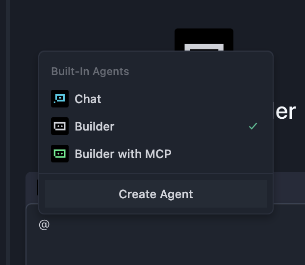

Wählen Sie ein Modell bewusst. Wenn eines eine Aufgabe nicht löst, probieren Sie nach dem Sichern des Projekts ein anderes und vergleichen Sie das Ergebnis.


### 4.2 Schritt eins: Einen leeren Ordner öffnen

Erstellen Sie einen Ordner `snake-game-react` und öffnen Sie ihn über **Open Folder**. Der Datei-Explorer sollte zunächst leer sein. Damit ist klar, welche Dateien der Agent neu anlegt.

Wenn Sie einen eigenen Modellanbieter hinzufügen, öffnen Sie die Modellverwaltung, tragen Anbieter, Modell-ID und Schlüssel ein und speichern. Die beiden folgenden Bilder zeigen den Weg; echte Schlüssel bleiben verdeckt.


### 4.3 Schritt zwei: Im Chat ein React-Snake-Spiel anfordern

Geben Sie ein klares Ziel ein:

> Erstelle in diesem leeren Ordner ein Snake-Spiel mit React. Die Pfeiltasten steuern die Schlange, Futter erhöht Länge und Punktzahl, Wand oder eigener Körper beenden das Spiel. Zeige danach einen Neustartknopf und starte das Projekt. Frage nach, bevor du Software außerhalb des Projektordners installierst.

Der Agent kann vor einem Befehl auf Bestätigung warten. Lesen Sie den Befehl und klicken Sie nur dann auf **Run**, wenn er zum Projekt gehört.

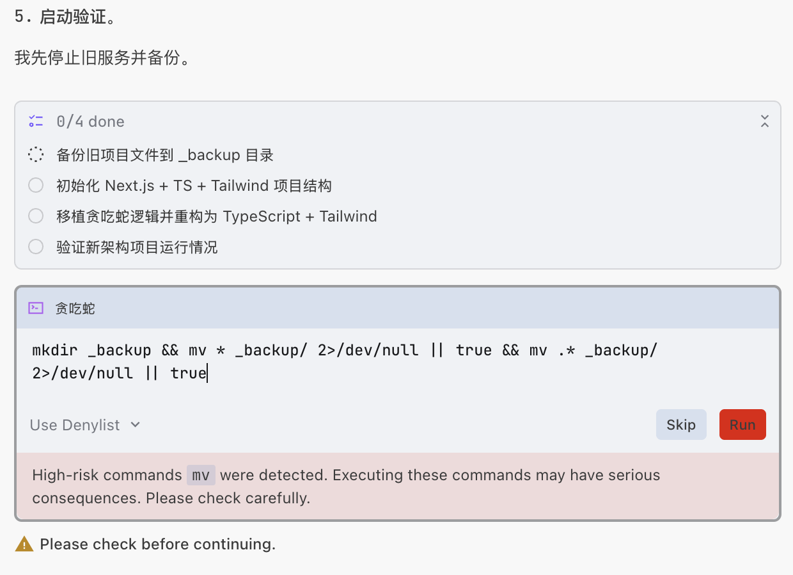

Manche Werkzeuge fragen im Terminal nach `y` oder einem Projektnamen.

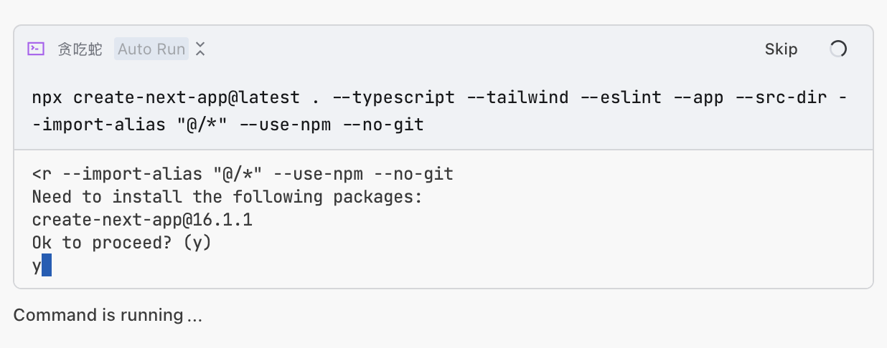


Wenn die Frage unklar ist, senden Sie einen Screenshot an AI und bitten nur um Erklärung der nächsten Eingabe.

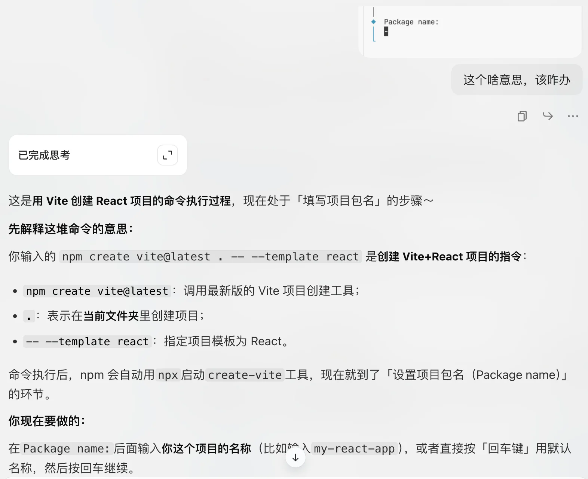

Ein laufender Entwicklungsserver beendet sich nicht von selbst. Öffnen Sie die angezeigte lokale Adresse im Browser; im Agentenfenster kann der laufende Schritt anschließend übersprungen werden.


Nach der ersten Runde sollte das Spiel im Browser laufen.

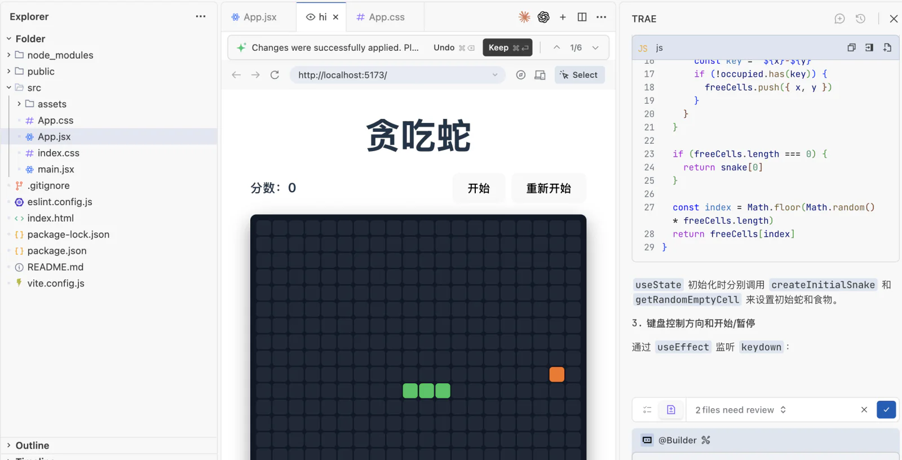

Prüfen Sie die geänderten Dateien. Bei einem schlechten Ergebnis verwenden Sie **Revert**, bevor Sie mit einer veränderten Anweisung neu beginnen.


### 4.4 Schritt drei (optional): Die Umsetzung erklären lassen

Bitten Sie AI zunächst um den Gesamtweg: „Erkläre von oben nach unten, wie das Spiel sich bewegt, möglichst ohne Fachsprache.“ Fragen Sie danach nach Daten für Schlange und Futter, Timer, Kollisionsprüfung und Spielzustand.

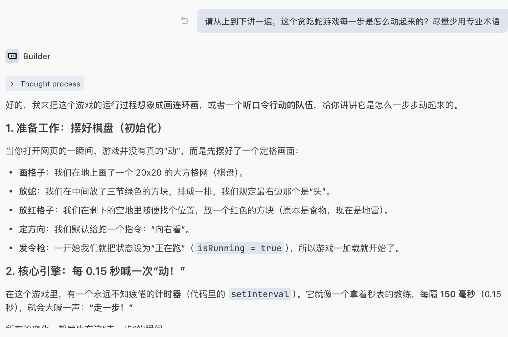

Das Ziel ist nicht, alles auswendig zu lernen. Erkennen Sie zuerst die wichtigsten Daten, wann sie sich verändern und in welcher Datei die Veränderung geschieht.

### 4.5 Schritt vier: Die Oberfläche gezielt verbessern

„Mach es schöner“ ist zu unbestimmt. Formulieren Sie einzelne sichtbare Änderungen:

> Zentriere das Spielfeld, verwende einen hellen Hintergrund, vergrößere die Punktzahl und gestalte Neustart und Spielende mit einer einheitlichen blauen Farbe. Ändere die Spielregeln nicht.

Starten und prüfen Sie nach jeder kleinen Änderung. Bei einem Fehler senden Sie vollständige Meldung und letzte Änderung zurück, statt eine komplette Neuentwicklung zu verlangen.

### 4.6 Optional: Eine vorhandene Projektstruktur als Referenz verwenden

Wenn ein früheres z.ai-Projekt eine README mit Architektur besitzt, lassen Sie AI erst Unterschiede zwischen dieser Struktur und dem lokalen Projekt erklären.

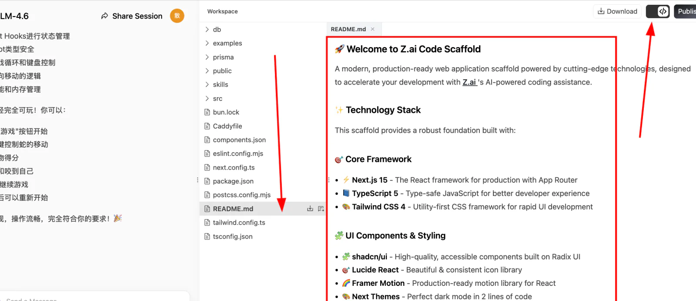

Bitten Sie danach um einen kleinen Umbauplan, nicht sofort um alle Änderungen.

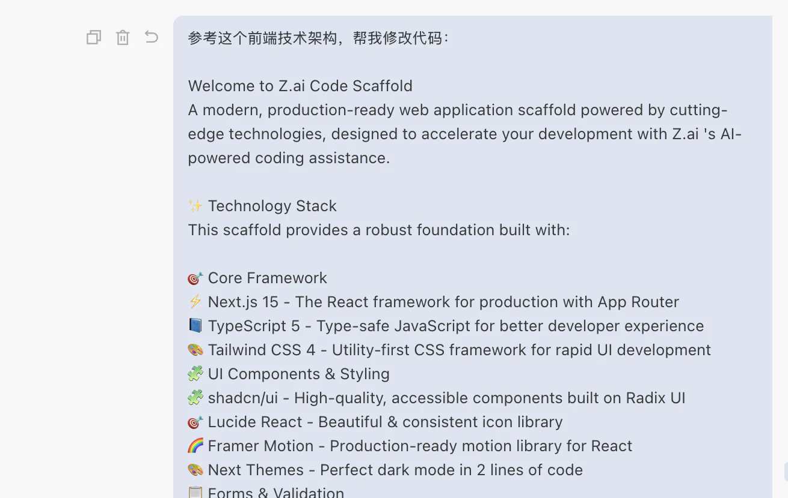

Prüfen Sie nach dem Umbau Spiel, Eingabe und Neustart erneut.

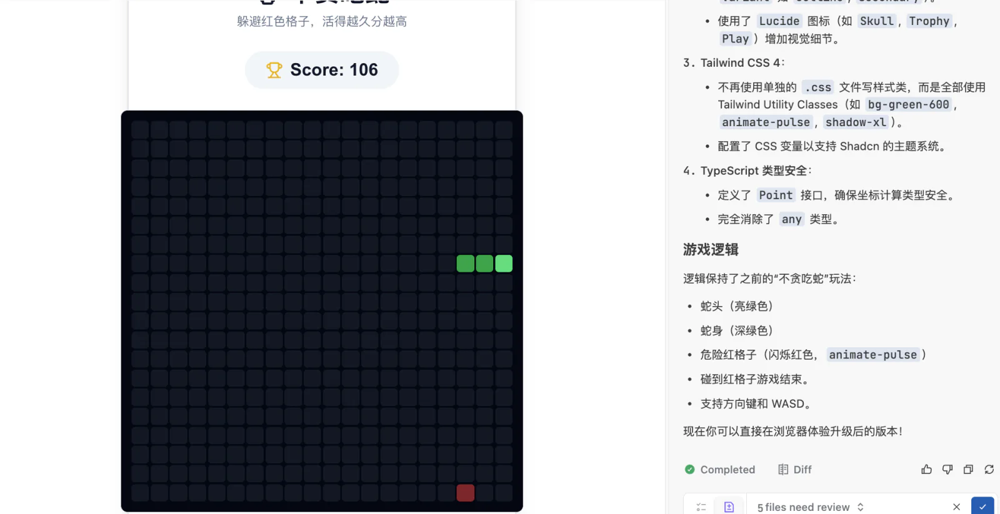

## 5. Was bedeuten die Bereiche und Schaltflächen der IDE?

Die meisten AI IDEs übernehmen das VS-Code-Layout: Aktivitätsleiste, Seitenleiste, Editor, unteres Panel, Statusleiste und AI-Seitenpanel.

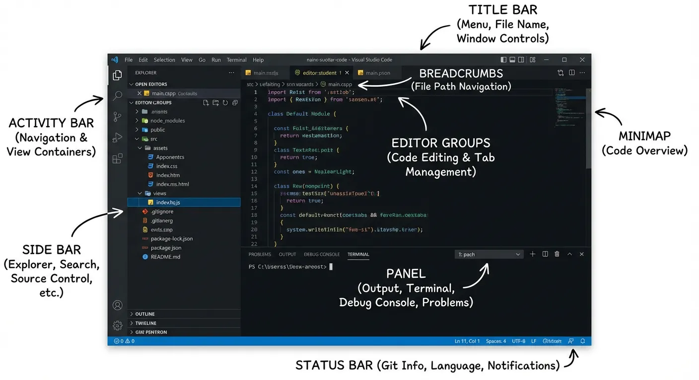

Der Datei-Explorer zeigt das Projekt; Terminal startet Befehle; Problems sammelt Fehler; Source Control zeigt Git-Änderungen; der Agent plant und bearbeitet. Eine ausführliche visuelle Erklärung steht in den [IDE-Grundlagen](/de-de/appendix/2-development-tools/ide-basics).

## 6. Wie spricht man wirksam mit AI?

### 6.1 Bedarf konkret machen: von einer vagen Idee zur klaren Beschreibung

Nennen Sie Nutzer, Aufgabe, sichtbares Ergebnis und Grenzen. Aus „Mach eine Website“ wird: „Erstelle eine Startseite mit Berufserfahrung; zuerst nur eine laufende Minimalversion, danach jeweils eine Änderung.“

### 6.2 Im richtigen Rhythmus arbeiten: zuerst lauffähig, dann komplexer

Lassen Sie zuerst einen kleinsten Ablauf laufen. Ergänzen Sie danach Daten, weitere Seiten und Aussehen einzeln. So bleibt sichtbar, welche Änderung einen Fehler ausgelöst hat.

### 6.3 Screenshots und Kopieren nutzen: zeigen, wenn die Beschreibung schwerfällt

Kopieren Sie rote Fehler vollständig oder schicken Sie einen zugeschnittenen Screenshot ohne Namen, Schlüssel und private Ordner. Beschreiben Sie zusätzlich Erwartung und tatsächliches Ergebnis.

### 6.4 Wenn AI-Code nicht funktioniert: eine feste Routine

1. Nicht sofort neu beginnen.
2. Letzte Änderung und vollständigen Fehler sichern.
3. Ursache erklären lassen.
4. Nur die nötige Stelle ändern lassen.
5. Projekt erneut starten und alte Funktionen testen.

Prüfen Sie außerdem den Diff. AI kann überzeugend klingen und trotzdem falschen Code schreiben. Revert und Git sind Sicherheitsnetze.

## 7. Zusammenfassung und nächster Schritt

Eine IDE verbindet Dateien, Editor, Terminal, Ausführung und Debugging. Eine AI IDE ergänzt Projektverständnis und Agentenaktionen. Sie haben einen leeren Ordner geöffnet, ein React-Spiel erzeugt, Befehle bestätigt, Änderungen geprüft und kleine Verbesserungen beschrieben.

Der wiederverwendbare Ablauf lautet: **Ziel erklären → kleinste Version erzeugen → ausführen → Ergebnis prüfen → konkrete Änderung anfordern → erneut prüfen**.

## 8. 📚 Kapitelaufgabe

<StageAssignmentCard title="Ein eigenes Minispiel mit einer lokalen AI IDE entwickeln">
  <ol>
    <li>Wählen Sie ein kleines Spiel, das nicht Snake ist.</li>
    <li>Öffnen Sie einen leeren Ordner und beschreiben Sie zuerst nur die spielbare Kernrunde.</li>
    <li>Prüfen Sie Start, laufendes Spiel, Ende, Eingabe und Punktestand.</li>
    <li>Führen Sie mindestens zwei weitere Runden mit jeweils einer konkreten Verbesserung durch.</li>
  </ol>
</StageAssignmentCard>

<RelatedArticlesSection title="Weiterlernen" description="Als Nächstes folgt die Prototyp-Praxis und danach die Einbindung von AI-Fähigkeiten." :items="relatedArticles" />

# Anhang

Die folgenden Begriffe müssen nicht auswendig gelernt werden. Verwenden Sie die Übersicht, wenn eine Meldung oder ein AI-Vorschlag ein neues Wort enthält.

# Anhang 1: Schnelles Glossar für Computerbegriffe

## <span id="term-tool-ui">[1. Begriffe der Werkzeugoberfläche](#appendix-1-map)</span>

### 1. IDE, Editor und Terminal

**IDE** ist die Werkbank: Editor, Ausführung, Debugging, Suche und Versionsverwaltung in einer Oberfläche. **Editor** ist der Bereich zum Schreiben mit Syntaxfarben und Vervollständigung. **Terminal** ist das Textfenster für Befehle wie `npm run dev` oder `python main.py`.

### 2. Häufige Bereiche einer IDE

**Activity Bar** wählt Datei, Suche, Git oder Debugging. **Side Bar** zeigt den Inhalt des gewählten Bereichs. **Editor** zeigt geöffnete Dateien. **Panel** enthält Terminal, Problems und Output. **Status Bar** zeigt Sprache, Einrückung, Fehler und Git-Zweig.

## <span id="term-network">[2. Begriffe zu Webseite, Netzwerk und Dienst](#appendix-1-map)</span>

### 1. URL, HTTP, Port und lokaler Dienst

Eine **URL** ist eine vollständige Adresse wie `http://localhost:3000`. **HTTP/HTTPS** beschreibt die Übertragung; HTTPS ist verschlüsselt. Ein **Port** ist die Türnummer eines Dienstes. **localhost** bezeichnet den eigenen Rechner. Ein **Server/Dienst** läuft weiter und beantwortet Anfragen.

## <span id="term-frontend-backend">[3. Begriffe zu Frontend, Backend und Daten](#appendix-1-map)</span>

### 1. Frontend und Backend

Das **Frontend** ist sichtbar und reagiert auf Klick, Eingabe und Ziehen. Das **Backend** läuft auf einem Server, speichert Daten und prüft Regeln wie Anmeldung und Berechtigungen.

### 2. API, Anfrage, Antwort und JSON

Eine **API** ist die vereinbarte Sprache zwischen Systemen. Eine **Request** geht zum Server; die **Response** bringt Status und Daten zurück. **JSON** stellt Daten als Schlüssel und Wert dar:

```json
{
  "name": "Alice",
  "score": 120
}
```

## <span id="term-code-basic">[4. Begriffe zum Code](#appendix-1-map)</span>

### 1. Variable, Bezeichner und Zustand

Eine **Variable** ist ein Name für einen Wert. Ein **Bezeichner** ist jeder selbst vergebene Name. **State** beschreibt die aktuelle Situation des Programms.

```js
let score = 0
score = score + 10
```

### 2. Funktion, Komponente und Modul

Eine **Funktion** packt eine wiederholbare Handlung unter einen Namen.

```js
function sayHello(name) {
  console.log('Hello, ' + name)
}
```

Eine **Komponente** ist ein wiederverwendbarer Teil von Oberfläche und Logik. Ein **Modul** ist eine Datei oder Gruppe zusammengehörigen Codes.

### 3. Syntax, Programmiersprache und Framework

**Syntax** sind Schreibregeln einer Sprache. **Programmiersprachen** wie JavaScript oder Python bieten unterschiedliche Werkzeuge. Ein **Framework** wie React oder Vue liefert eine vorbereitete Struktur.

## <span id="term-debug">[5. Begriffe zu Fehlersuche und Debugging](#appendix-1-map)</span>

### 1. Bug, Fehlermeldung und Log

Ein **Bug** ist Verhalten entgegen der Erwartung. Eine **Fehlermeldung** nennt häufig Datei und Zeile. Ein **Log** zeigt Werte während der Ausführung:

```js
console.log('Punktzahl', score)
```

### 2. Debugging, Breakpoint, Einzelschritt und Snapshot

Beim **Debugging** hält ein **Breakpoint** das Programm an. Mit **Step over/into** wird Zeile für Zeile geprüft. Ein **Snapshot** ist ein gespeichertes Bild des Zustands zu einem Zeitpunkt.

## <span id="term-project">[6. Begriffe zur Projektverwaltung](#appendix-1-map)</span>

### 1. Projekt, Workspace und Ordner

Ein **Projekt** umfasst Code, Konfiguration und Medien. Ein **Workspace** beschreibt, welche Ordner die IDE in dieser Sitzung geöffnet hat.

### 2. Git, Repository und Commit

**Git** ist die Zeitmaschine des Projekts. Ein **Repository** ist ein Projekt mit Versionsgeschichte. Ein **Commit** speichert einen benannten Zwischenstand.

## <span id="term-ai-tool">[7. Begriffe zu AI-Entwicklungswerkzeugen](#appendix-1-map)</span>

### 1. AI IDE, Agent und SOLO-Modus

Eine **AI IDE** versteht natürliche Sprache im Projekt. Ein **Agent** plant mehrere Schritte und verwendet Werkzeuge. Im **SOLO-Modus** wird das Ziel beschrieben; der Agent plant den Weg und fragt an wichtigen Stellen um Bestätigung.

### 2. Modell und API-Schlüssel

Das **Modell** ist die jeweilige AI, etwa GPT, Claude, Kimi oder GLM. Ein **API Key** ist eine geheime lange Zugangskombination. Er darf nie in öffentliche Dateien, Screenshots oder Chats gelangen.

## <span id="term-browser">[8. Begriffe zu Browser und Entwicklerwerkzeugen](#appendix-1-map)</span>

**Refresh** lädt die Seite neu. **DevTools** zeigen HTML, Stile, Console und Netzwerkanfragen; häufig öffnen sie sich mit F12. Die **Console** enthält Fehler und Ausgaben von `console.log`.

Wenn später ein neues Wort auftaucht, lassen Sie AI drei Dinge notieren: wozu es dient, einen Alltagsvergleich und ein kleinstes Beispiel. So wächst Ihr eigenes Glossar mit der Praxis.
