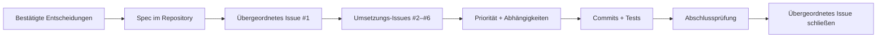

# KI-Softwareentwicklung mit GitHub Issues: vom Anforderungsgespräch zur fertigen macOS-App

Dieses Tutorial zeigt einen vollständigen Spec-getriebenen Entwicklungszyklus: Eine grobe Idee wird mit der KI geklärt, als Spezifikation festgehalten, in priorisierte GitHub Issues mit Abhängigkeiten zerlegt und anschließend implementiert, getestet und geprüft.

::: info Was ist anders als im vorherigen Kapitel?

[Vom Vibe Coding zum Spec Coding](/de-de/stage-3/core-skills/spec-coding/) erklärt, warum Spezifikationen für die KI-Entwicklung zentral werden. Dieses Kapitel ist die praktische Fortsetzung: Ein echtes öffentliches Repository zeigt, wie aus einem Spec Issues, Commits, Tests und ein fertiges Produkt werden.

:::

Der Ausgangspunkt war ein einziger Satz:

> Ich möchte ein CRM für macOS entwickeln, das importierte Kontakte verwaltet und mir hilft, meine Beziehungen zu ordnen. Zunächst können wir Beispieldaten verwenden.

Das Ergebnis ist **Relationship Compass**, eine native macOS-App zum Suchen und Filtern von Kontakten, Bearbeiten von Beziehungsprofilen, Importieren von CSV-Dateien, Erfassen von Interaktionen und Berechnen des nächsten Kontakttermins.


Das [öffentliche Beispiel-Repository](https://github.com/sanbuphy/relationship-compass-macos) enthält ausschließlich fiktive Daten sowie Spec, Issues, Commit-Verlauf, Quellcode und Tests.

## 1. Was bedeutet Spec-getriebene Entwicklung?

Ein typischer KI-Coding-Ablauf sieht so aus:

```text
Idee beschreiben → KI schreibt Code → Fehler entdecken → Anweisung ergänzen → erneut ändern
```

Für eine kleine Seite kann das genügen. Mit wachsendem Projekt gehen frühere Anforderungen im Chat verloren, der Fortschritt wird schwer nachvollziehbar und eine Funktion kann laufen, ohne die ursprüngliche Absicht zu erfüllen.

Matt Pococks Skills geben der KI einen wiederholbaren Arbeitsablauf. Ein Skill definiert, was geklärt wird, welches Artefakt entsteht und wann eine Bestätigung erforderlich ist – nicht nur, welcher Code geschrieben werden soll.

| Umsetzung direkt aus dem Chat | Spec-getriebene Umsetzung |
| --- | --- |
| Der aktuelle Chat ist die Hauptquelle | Ein versionierter Spec ist die verbindliche Quelle |
| Anforderungen werden spontan ergänzt | Spec und Aufgaben werden zuerst aktualisiert |
| Fortschritt steht in KI-Zusammenfassungen | Fortschritt steht in Issues und Commits |
| „Läuft“ gilt als fertig | Jedes Abnahmekriterium wird geprüft |

### 1.1 Die drei Rollen von GitHub

1. **Projektarchiv** für Spec, Begriffe und Architekturentscheidungen.
2. **Aufgabenboard** für Issues, Prioritäten und Abhängigkeiten.
3. **Fertigstellungsnachweis** durch Commits, Testergebnisse und geschlossene Issues.

| GitHub-Artefakt | Bedeutung | Beispiel |
| --- | --- | --- |
| Spec | Was die fertige Software leisten muss | `specs/relationship-compass-mvp.md` |
| Issue | Eine unabhängig abschließbare Aufgabe | `#2 Browse sample Contacts` |
| Abhängigkeit | Was vorher fertig sein muss | `#3` wird durch `#2` blockiert |
| Commit | Änderung eines Umsetzungsschritts | `feat: browse sample contacts` |
| Tests | Nachweis des erwarteten Verhaltens | `swift test` |
| ADR | Grund für eine wichtige Technikentscheidung | `docs/adr/0002-native-swiftui-macos.md` |



### 1.2 Der Hauptablauf

```text
grill-with-docs → to-spec → to-tickets → implement → code-review
```

- `grill-with-docs` klärt Produktumfang und technische Grenzen.
- `to-spec` schreibt die Vereinbarung als formale Spezifikation.
- `to-tickets` erzeugt priorisierte Issues mit Abhängigkeiten.
- `implement` bearbeitet jeweils das nächste freie Issue.
- `code-review` prüft Codegesundheit und Anforderungsabdeckung getrennt.

## 2. Vorbereitung

Benötigt werden ein GitHub-Konto, eine angemeldete GitHub CLI, Node.js 18 oder neuer und ein KI-Coding-Werkzeug, das Projekt-Skills lesen kann. Zum Ausführen der App braucht man außerdem einen Mac mit Xcode.

```bash
npx skills@latest add mattpocock/skills -y
gh auth status
gh repo create relationship-compass-macos \
  --public \
  --source . \
  --remote origin \
  --push
```

Das Beispiel ist öffentlich, weil alle Kontakte fiktiv sind. Für echte Kontaktdaten muss `--private` verwendet und vor dem Push geprüft werden, ob Beispiele, Logs oder Git-Historie persönliche Daten enthalten. Die wichtigsten Labels sind `ready-for-agent`, `priority:P0/P1/P2` und `completed-by-agent`.

## 3. Produkt und MVP-Grenzen

Die erste Version bietet:

- sechs feste Beispielkontakte;
- Suche nach Name, Organisation, Rolle, E-Mail und Kreis;
- kombinierte Filter nach Beziehungsstärke und Kreis;
- Bearbeitung von Profil, Notizen und Kontaktintervall;
- sicheren UTF-8-CSV-Import mit Validierung und Deduplizierung;
- Interaktionsverlauf und Berechnung des nächsten Kontaktdatums;
- lokale JSON-Speicherung und Wiederherstellung beim Start.

Cloud-Synchronisierung, KI-Beziehungsbewertung, Konten, Backend und Zugriff auf macOS Kontakte gehören nicht zum MVP.

## 4. Anforderungen mit `grill-with-docs` klären

<div class="workflow-chat">
  <div class="workflow-message workflow-message--user">
    <div class="workflow-message__speaker">🙋 Du</div>
    <div class="workflow-message__command">/grill-with-docs</div>
    <p>Ich möchte ein CRM für macOS entwickeln, das importierte Kontakte verwaltet und mir hilft, meine Beziehungen zu ordnen. Zunächst genügen Beispieldaten.</p>
  </div>
  <div class="workflow-message workflow-message--agent">
    <div class="workflow-message__speaker">✨ Agent</div>
    <p>Bevor wir Code schreiben, einigen wir uns auf Umfang und Nicht-Ziele der ersten Version, Datenspeicherung, Technik und Nachweis der Fertigstellung. Bei Entscheidungen erkläre ich die Unterschiede und gebe eine Empfehlung.</p>
  </div>
</div>

Das Gespräch legt natives SwiftUI für macOS 14+, lokales JSON, UTF-8 CSV, sechs Beispieldatensätze, keinen Netzwerkzugriff und keine Kontakte-Berechtigung fest. `CONTEXT.md` definiert `Contact`, `Interaction` und `Follow-up`; zwei ADRs dokumentieren Local-first-Daten und die Wahl von SwiftUI.

::: info GitHub in dieser Phase

Der bestätigte Kontext wird als `CONTEXT.md` und `docs/adr/*` committet. Umsetzungs-Issues werden noch nicht erstellt.

:::

## 5. Mit `to-spec` die Spezifikation schreiben

<div class="workflow-chat">
  <div class="workflow-message workflow-message--user">
    <div class="workflow-message__speaker">🙋 Du</div>
    <div class="workflow-message__command">/to-spec</div>
    <p>Formuliere unsere bestätigte Diskussion als vollständigen Spec, speichere ihn im Repository und veröffentliche ihn als übergeordnetes GitHub Issue mit dem Label ready-for-agent.</p>
  </div>
</div>

[`specs/relationship-compass-mvp.md`](https://github.com/sanbuphy/relationship-compass-macos/blob/main/specs/relationship-compass-mvp.md) enthält Problem, MVP, 24 User Stories, technische Entscheidungen, Prüfstrategie und ausdrückliche Nicht-Ziele. [Issue #1](https://github.com/sanbuphy/relationship-compass-macos/issues/1) ist der sichtbare Projekteinstieg.

Ein guter Spec beschreibt Verhalten statt Dateinamen. „Kontakte ohne bisherige Interaktion erscheinen ebenfalls in Follow-ups“ bleibt auch nach einer Umstrukturierung des Codes gültig.

## 6. Mit `to-tickets` geordnete Issues erstellen

<div class="workflow-chat">
  <div class="workflow-message workflow-message--user">
    <div class="workflow-message__speaker">🙋 Du</div>
    <div class="workflow-message__command">/to-tickets</div>
    <p>Zerlege den Spec in GitHub Issues. Jedes Ticket soll einen eigenständig vorführbaren vertikalen Funktionsausschnitt liefern und Priorität, Abnahmekriterien und Voraussetzungen nennen. Zeige mir Liste und Abhängigkeiten vor der Veröffentlichung.</p>
  </div>
</div>

| Issue | Priorität | Sichtbares Ergebnis | Blockiert durch |
| --- | --- | --- | --- |
| [#2 Browse sample Contacts](https://github.com/sanbuphy/relationship-compass-macos/issues/2) | P0 | Start, Beispiele, Suche, Details | – |
| [#3 Import and persist](https://github.com/sanbuphy/relationship-compass-macos/issues/3) | P0 | CSV-Deduplizierung, JSON-Speicherung | #2 |
| [#4 Organize Profiles](https://github.com/sanbuphy/relationship-compass-macos/issues/4) | P1 | Profil, Stärke, Kreise, Filter | #2 |
| [#5 Interactions and Follow-ups](https://github.com/sanbuphy/relationship-compass-macos/issues/5) | P1 | Verlauf und Follow-ups | #4 |
| [#6 Polish and verify](https://github.com/sanbuphy/relationship-compass-macos/issues/6) | P2 | Fehler, Doku, Paket, Gesamtprüfung | #3, #5 |

Modelle, Store, UI und Tests werden nicht horizontal getrennt. Jeder **vertikale Ausschnitt** verbindet die nötigen Schichten, sodass nach jedem geschlossenen Issue ein neues Ergebnis vorführbar ist.

## 7. Mit `implement` jeweils ein freies Issue umsetzen

<div class="workflow-chat">
  <div class="workflow-message workflow-message--user">
    <div class="workflow-message__speaker">🙋 Du</div>
    <div class="workflow-message__command">/implement</div>
    <p>Implementiere alle ready-for-agent Issues nach Priorität und Abhängigkeit. Bearbeite jeweils nur ein unblocked Ticket, schreibe zuerst einen fehlschlagenden Verhaltenstest, führe Build und Tests aus und committe jedes Ticket separat.</p>
  </div>
</div>

Beim CSV-Ticket beweist zuerst ein fehlschlagender Test, dass derselbe Import nicht zu doppelten Kontakten führen darf. Nach der Implementierung stellt ein weiterer Test sicher, dass ein ungültiger Header bestehende Daten nicht beschädigt.

```bash
swift test --filter RelationshipStoreTests
swift build
swift test
```

Am Ende bestehen alle 13 öffentlichen Verhaltenstests.


Danach vermerkt der Agent Commit und Testergebnis im Issue, entfernt `ready-for-agent`, setzt `completed-by-agent` und schließt das Issue.

## 8. Zwei Prüfungen mit `code-review`

Die erste Prüfung betrachtet Benennung, Duplikate, übergroße Views, Kopplung und die Regeln aus `AGENTS.md`. Die zweite liest Spec und alle Issues erneut und vergleicht jedes erwartete Verhalten mit dem Ergebnis.

Im Beispiel wurden doppelte CSV-Header, Deduplizierung von Kontakten ohne E-Mail, Filter der Follow-up-Liste, automatische Wiederherstellung beim Start und die Anzeige des nächsten Kontaktdatums als Lücken gefunden. Zuerst kamen Tests hinzu, dann die Korrekturen und anschließend beide Prüfungen erneut.

Grüne Tests beweisen nur die darin beschriebenen Verhaltensweisen. Sie beweisen nicht automatisch, dass jeder Punkt des ursprünglichen Specs getestet wurde.

## 9. Die fertige Anwendung

| Lieferung | Ergebnis |
| --- | --- |
| GitHub-Planung | Ein übergeordnetes und fünf Umsetzungs-Issues, alle geschlossen |
| Verlauf | Neun fokussierte Commits in Abhängigkeitsreihenfolge |
| Automatische Prüfung | 13/13 Tests und vollständiger Build erfolgreich |
| Abschlussprüfung | Codegesundheit und Spec-Abdeckung bestanden |
| Laufbares Produkt | `Relationship Compass.app` kann erzeugt werden |
| Datenschutz | Nur lokale Daten, kein Kontakte-Zugriff, kein Upload |

### 9.1 Suche und kombinierte Filter

Die Suche nach `Founder` lässt nur Maya Chen stehen; Beziehungsstärke und Kreis lassen sich kombinieren.


### 9.2 Beziehungsprofil bearbeiten

Organisation, Rolle, E-Mail, Beziehungsstärke, Kreise, Rhythmus und Notizen können bearbeitet werden.


### 9.3 Interaktion und nächster Kontakt

Aus einer Interaktion am 9. August 2026 und einem Rhythmus von 30 Tagen ergibt sich der 8. September 2026.


```bash
git clone https://github.com/sanbuphy/relationship-compass-macos.git
cd relationship-compass-macos
swift build
swift test
./scripts/package-app.sh
open "dist/Relationship Compass.app"
```

## 10. Kopierbarer Ablauf

```text
/grill-with-docs
Kläre mit mir Umfang und Nicht-Ziele, Datenhaltung, Technik und Prüfung. Schreibe keinen Code vor meiner ausdrücklichen Bestätigung.

/to-spec
Erstelle aus der Vereinbarung einen Spec mit Nutzerverhalten, Abnahmekriterien und Nicht-Zielen sowie ein übergeordnetes GitHub Issue.

/to-tickets
Zerlege den Spec in vertikale Issues mit Priorität, Abschlusskriterien und Abhängigkeiten.

/implement
Implementiere freie Issues einzeln nach Priorität mit TDD, Prüfung und separatem Commit.
Prüfe anschließend Codegesundheit und Spec-Abdeckung und behebe alle Befunde.
```

## 11. Wann kontinuierliche KI-Umsetzung passt

Der Ablauf eignet sich für klar abgegrenzte MVPs, Websites, Apps und Backends mit beobachtbarem Verhalten und verlässlichen Test- oder Build-Befehlen. Er eignet sich nicht für stündlich wechselnde Anforderungen, nicht prüfbare Ergebnisse oder direkte Änderungen an Produktionsdaten.

Menschen bestätigen weiterhin Umfang, Ticketabdeckung und Reihenfolge, Zahlungen, Deployments, Löschungen, Berechtigungen, Datenschutz sowie Oberfläche und Endprodukt. Der Mensch verantwortet Ziel, Grenzen und Abnahme; die KI führt die vereinbarte Arbeit zuverlässig aus.

## Zusammenfassung

```text
Grobe Idee
  ↓ grill-with-docs
Bestätigter Umfang, Begriffe und Technikentscheidungen
  ↓ to-spec
Versionierte, prüfbare Anforderungen
  ↓ to-tickets
Priorisierte GitHub Issues mit Abhängigkeiten
  ↓ implement
Test, Umsetzung und Commit pro Ticket
  ↓ code-review
Codegesundheit + Spec-Abdeckung
  ↓
Baubare und überprüfbare Software
```

Nach dem Chat bleiben Spec, Issues, Abhängigkeiten, Commits und Testnachweise auf GitHub. Die nächste Sitzung setzt beim dokumentierten Projektzustand statt bei Vermutungen an.

## Quellen

- [Skills to Spec](https://www.aihero.dev/skills-to-spec)
- [AI Skills for Real Engineers](https://www.aihero.dev/skills)
- [Skills-v1.1-Änderungen](https://www.aihero.dev/skills/skills-changelog-v1-1-wayfinder-to-spec-to-tickets-grilling-improvements)
- [OpenAI: Wiederholbare Abläufe als Skills speichern](https://learn.chatgpt.com/codex/use-cases/reusable-codex-skills)
- [Öffentliches Relationship-Compass-Beispiel](https://github.com/sanbuphy/relationship-compass-macos)
