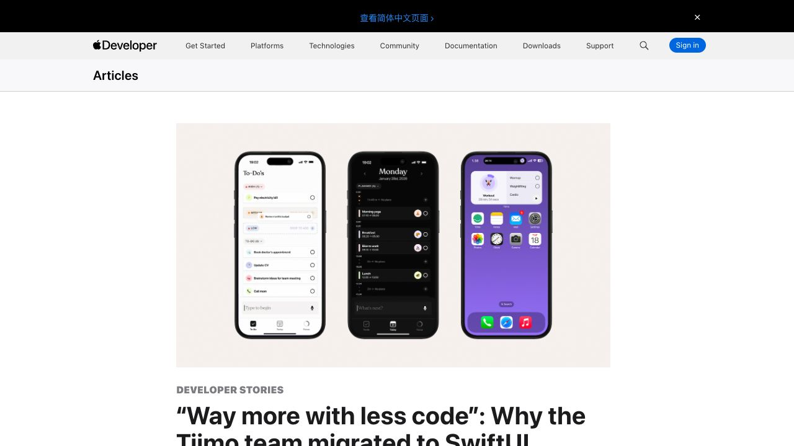
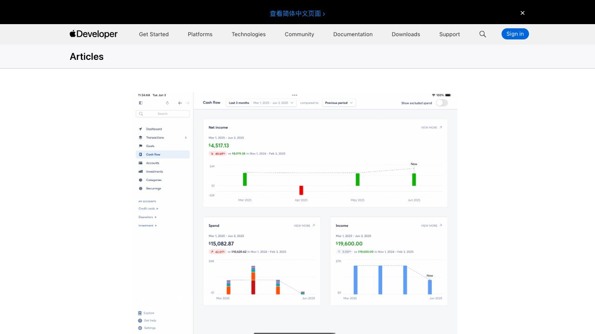

# Eine native iOS-App mit SwiftUI bauen

Swift ist Apples Programmiersprache, SwiftUI das moderne UI-Framework und Xcode die Entwicklungsumgebung für Projekt, Simulator, Signierung und Veröffentlichung. Native iOS-Entwicklung ist sinnvoll, wenn eine Anwendung Apples neueste APIs, systemtypisches Verhalten oder tiefe Geräteintegration braucht.

## Reale SwiftUI-Produkte

Tiimo zeigt, wie eine zugängliche Tagesplanung auf iPhone und Apple Watch aussehen kann. Copilot Money verwendet Swift Charts, um echte Finanzdaten lesbar zu machen.

## Das Projekt: Fridge Chef

Die App nimmt Zutaten entgegen, zeigt ein Rezept und speichert den Verlauf. Sie wird zuerst mit Beispieldaten gebaut und danach an ein echtes Backend angeschlossen.

## 1. Xcode vorbereiten

Installiere Xcode aus dem App Store, öffne es einmal und lasse die erforderlichen Komponenten installieren. Ein echtes iPhone benötigt Entwickler-Modus und Vertrauen in den Mac.

## 2. Leeres Projekt ausführen

Wähle **Create a new Xcode project → iOS App**, setze SwiftUI und Swift und verwende eine eigene Bundle ID.

Wähle einen Simulator und drücke Run. Erst wenn die leere App startet, wird sie geändert.

## 3. Erste Oberfläche

> Ersetze die Startansicht durch Fridge Chef. Füge ein Zutatenfeld, eine Schaltfläche und einen Bereich für das Rezept hinzu. Verwende zunächst Beispieldaten.

## 4. Backend und Verlauf

> Verbinde die vorhandene Rezept-API. Lege den Server-Schlüssel nicht in die iOS-App und zeige bei Fehlern eine verständliche Nachricht.

> Speichere erfolgreiche Rezepte lokal und stelle sie beim nächsten Start wieder her.

Servergeheimnisse bleiben im Backend. Lokale Daten brauchen stabile IDs und eine Migration, wenn sich das Modell ändert.

## 5. Symbol, Simulator und echtes Gerät

Lege alle geforderten Größen in Assets ab und prüfe, dass kein transparenter Rand oder Platzhalter bleibt.

Teste im Simulator leere Eingabe, Erfolg, Fehler, Verlauf, Dark Mode und verschiedene Größen. Danach installiere dieselbe Version auf einem echten iPhone und prüfe Tastatur, Netzwerk, Hintergrund und Neustart.

## 6. Veröffentlichung

Vor App Store Connect werden Bundle ID, Version, Build number, Datenschutz, Screenshots, Support, Signierung und TestFlight vorbereitet.

Eine erfolgreiche Simulator-Ausführung ist noch keine veröffentlichte App. Fertig ist die erste Version, wenn der Kernablauf auf einem echten iPhone funktioniert, der Verlauf nach Neustart bleibt und genau dieser Build über TestFlight geprüft wurde.
