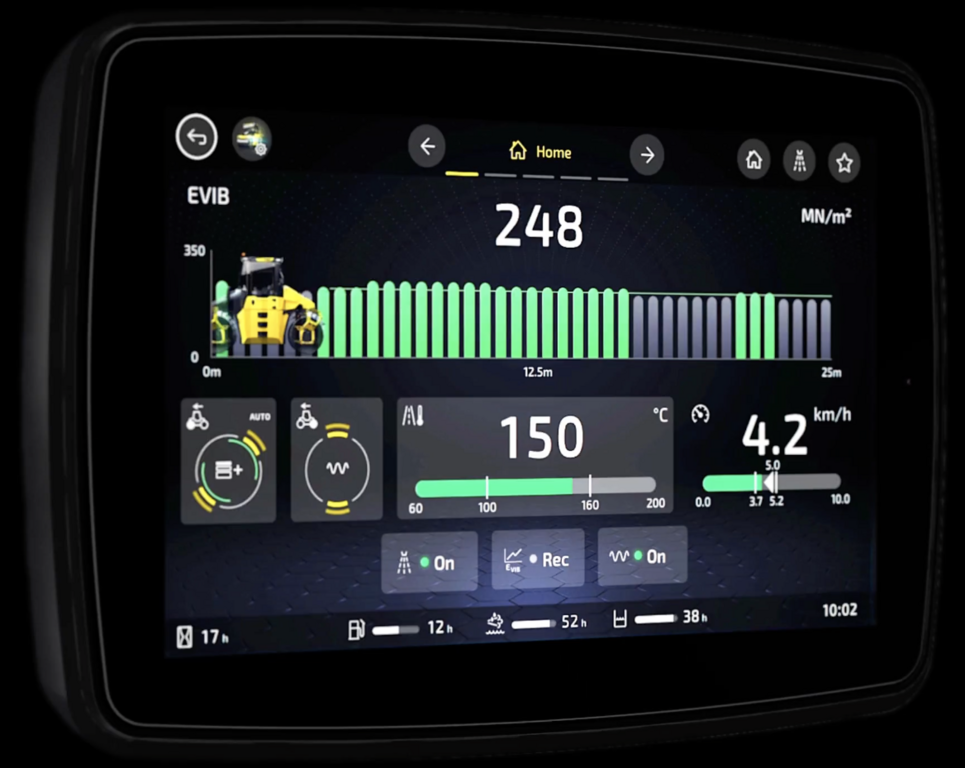
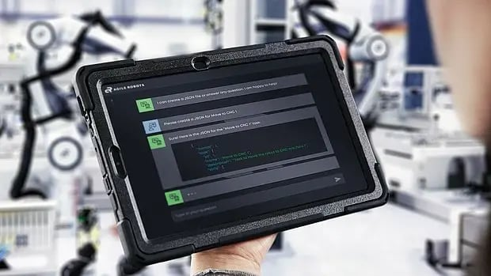
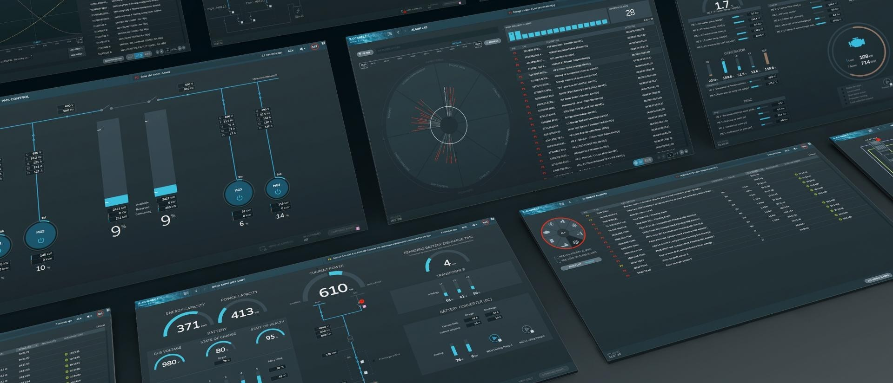
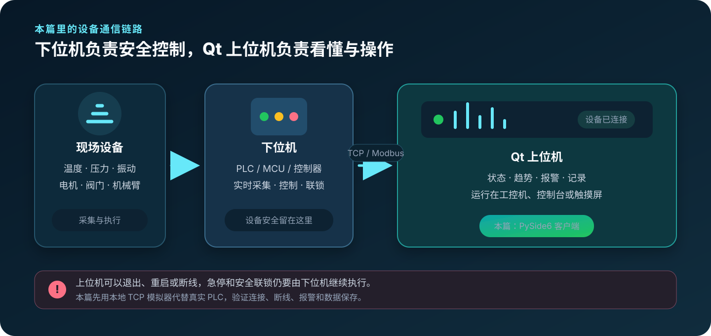
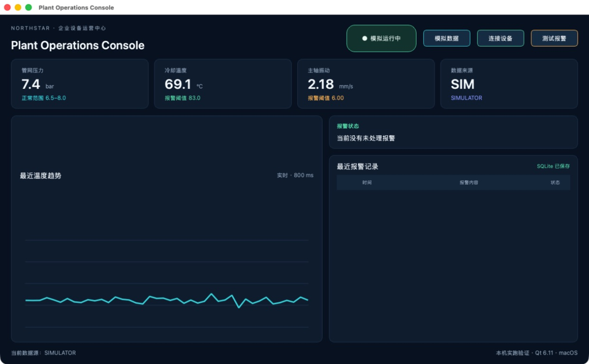
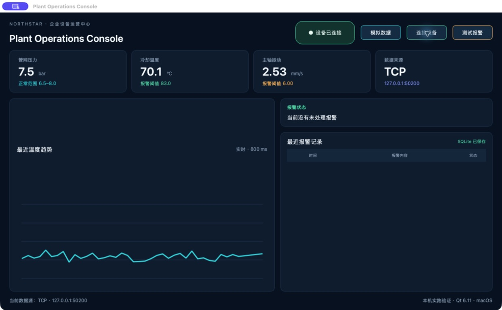
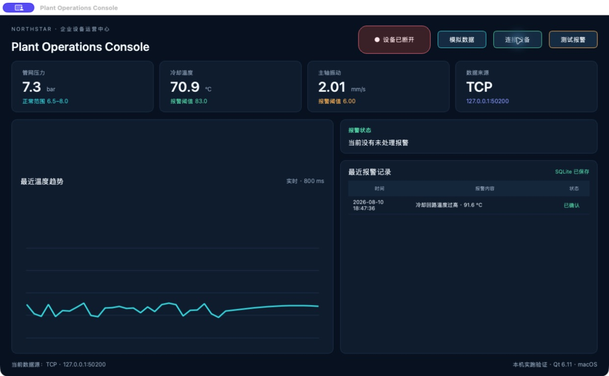
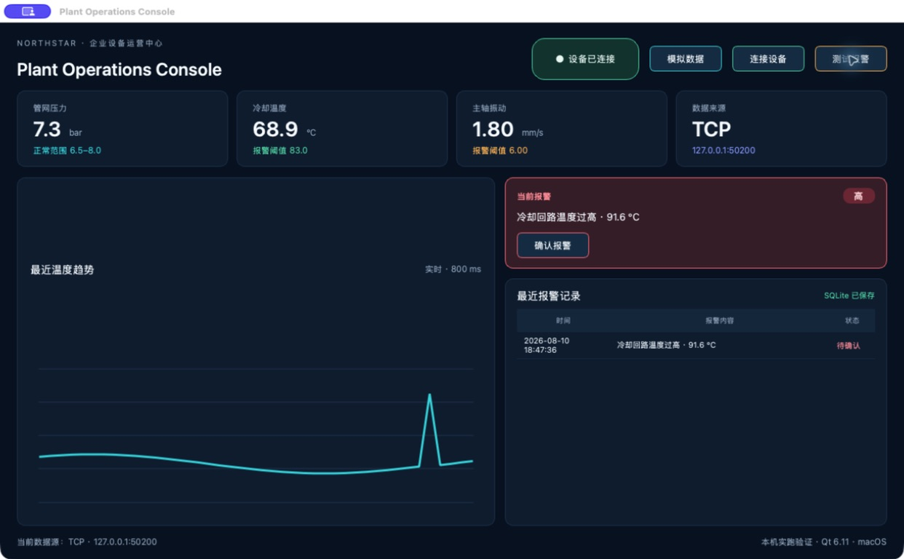
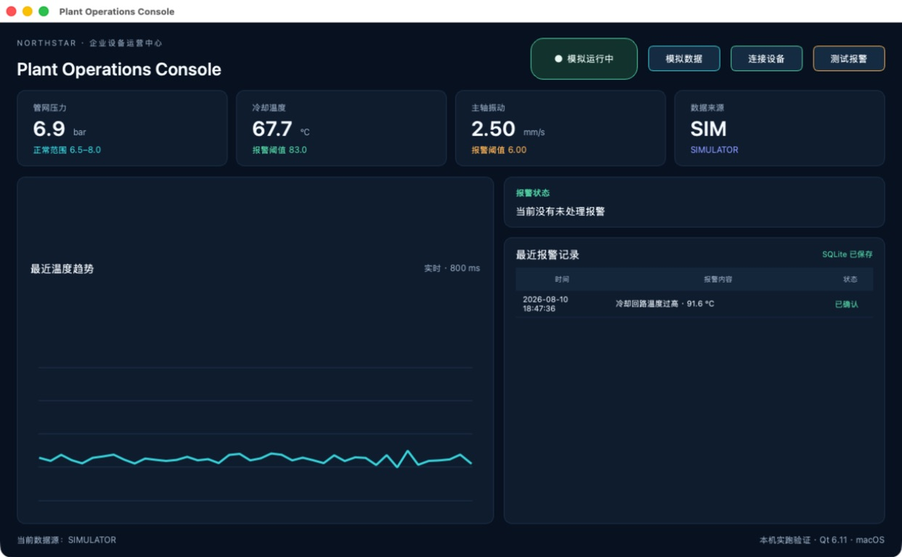
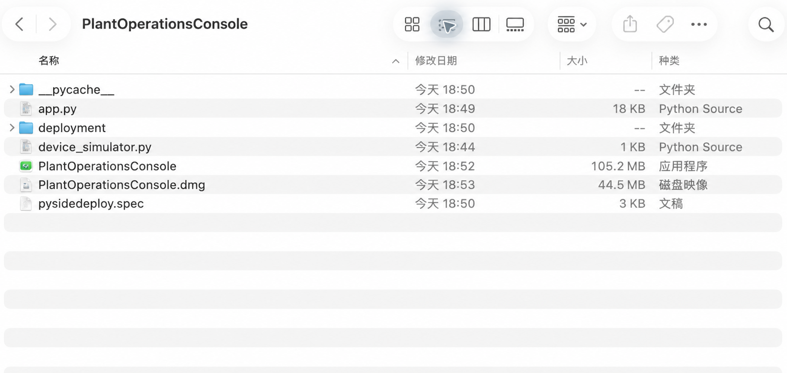

# Einen Qt-Geräteclient für Unternehmen entwickeln

Qt wird häufig für Maschinenbedienung, Prüfstände, Robotik, Fahrzeuganzeigen und Leitstände verwendet. Es läuft auf Windows, Linux und Embedded-Geräten, bietet reife C++-Bibliotheken und kann viele Jahre gepflegt werden.

## Wie echte Qt-Produkte aussehen

BOMAG myCOCKPIT ist eine HMI für Baumaschinen, Agile Robots verwendet Qt für Bedien- und Lehrgeräte, Blue Ctrl für Schiffsautomation und Precision Planting für landwirtschaftliche Echtzeitüberwachung.

## Ober- und Untersteuerung

Die Untersteuerung ist PLC, Mikrocontroller oder Gerät nahe an Sensoren und Aktoren. Sie liest Signale, führt zeitkritische Logik aus und steuert die Maschine. Der Oberrechner ist der Qt-Client: Er ordnet Daten zu Status, Trends, Alarmen und Bedienung.

Daten kommen häufig über Modbus TCP/RTU, OPC UA, CAN, seriell, MQTT, REST oder ein herstellerspezifisches Protokoll. Die Oberfläche darf niemals die letzte Sicherheitsinstanz der Maschine sein.

## Sprache und Zuverlässigkeit

Viele lang laufende Unternehmensprojekte verwenden Qt mit C++. QML dient modernen Bedienoberflächen. Python mit PySide6 eignet sich für Prototypen, interne Werkzeuge und weniger zeitkritische Clients; dieses Kapitel nutzt PySide6, um die komplette Kette schnell sichtbar zu machen.

Unternehmen trennen Kommunikation, Datenmodell und UI, prüfen Protokollgrenzen, speichern Alarme, begrenzen Rechte, signieren Pakete und testen auf echter Hardware.

## 1. Simulierte Daten anzeigen

> Erstelle mit PySide6 einen Geräteclient mit Druck, Temperatur, Vibration, Trend und Verbindungsstatus. Verwende zunächst simulierte Daten.

## 2. Einen lokalen Gerätesimulator verbinden

> Verbinde den Client per TCP mit `127.0.0.1:50200`. Zeige Verbunden, Getrennt und letzten gültigen Messwert.

## 3. Alarm und SQLite

> Erzeuge bei hoher Temperatur einen Alarm mit Zeit, Wert, Status und Bestätigung.

> Speichere Alarme in SQLite und stelle sie nach einem vollständigen Neustart wieder her.

## 4. Verpacken und auf Windows fortsetzen

Auf macOS wurde mit `pyside6-deploy` eine eigenständige App und anschließend ein geprüftes DMG erzeugt.

Windows-Pakete müssen auf Windows gebaut werden. Dort werden Start, Geräteverbindung, Alarm, SQLite und Deinstallation auf einem Rechner ohne Python erneut getestet.

Der macOS-Client, simulierte Daten, lokaler TCP-Test, Trennung/Wiederverbindung, Alarm, SQLite-Neustart, App-Paket und DMG wurden tatsächlich geprüft. Reales Modbus-/OPC-UA-Gerät, Windows-Paket, Codesignierung und Apple-Notarisierung werden nicht als abgeschlossen ausgegeben.
