# Design a Website with Design and Coding Agents

## Chapter Introduction

This chapter shows how AI can connect design and development. We will direct a **design Agent** to create a logo, color palette, and page layout, then ask a **coding Agent** to turn the design into a working website. The result is a reusable workflow from an initial idea to a running page.

---

# 1. Getting Started

## 1. Tutorial Introduction

We will use AI design Agents and coding Agents to build a complete website from scratch.

- **Design Agent:** creates logos, page layouts, color schemes, and other visual elements.
- **Coding Agent:** writes HTML, CSS, JavaScript, and other code from the requirements and design supplied in a prompt.

## 2. Design Agents and Coding Agents

- **Design Agent:** generates images, page mockups, or visual styles from prompts.
  - MasterGo
  - Lovart
  - Figma MCP
- **Coding Agent:** writes runnable code from the requested features and layout.
  - Z.AI
  - Trae
  - Cursor
  - Lovable

---

# 2. Create a Logo with a Design Agent

## 1. Key Elements of Logo Design

A logo strongly affects a website’s first impression. A design Agent needs a clear description of the desired result.

1. **Brand name or text**

- Text that must appear in the logo, such as the website title or brand name.

2. **Style or mood**

- The overall feeling the logo should convey.
- _Examples: minimalist, cute, simple, modern, vintage, or futuristic._

3. **Color scheme** (optional)

- The logo colors should fit the website’s overall tone.
- Specify exact hex values or a general palette such as warm or cool colors.
- _Examples: **`#171721`** (black) and **`#FF7130`** (orange)._

4. **Form or composition**

- State whether the logo needs a particular shape or arrangement.
- _Examples: text inside a circle, an icon with text, or an icon-led logo._

5. **Icon or symbol** (optional)

- Describe any graphic or symbol that should appear.
- _Examples: a book, lightning bolt, AI motif, or abstract geometric form._

## 2. Write a Logo Design Prompt

**Example prompts**

```
"Design a minimalist logo for the brand 'My First Website'.
Use black (#171721) and orange (#FF7130), and place the text inside a circle."
```

```
"Design a logo for the brand 'AIID'.
Use a futuristic, clean, and simple style with blue and white as the main colors.
Combine an abstract symbol of AI with the text, and export a transparent PNG."
```

## 3. Ask the Agent for Designs

- Enter the prompts above and compare several drafts from the Agent.

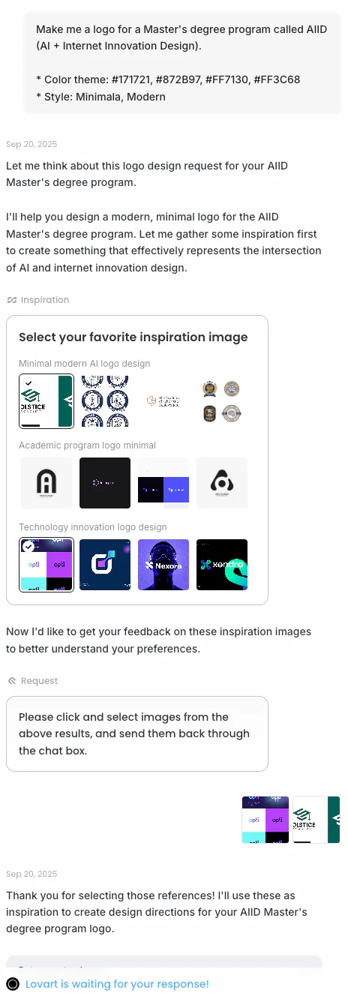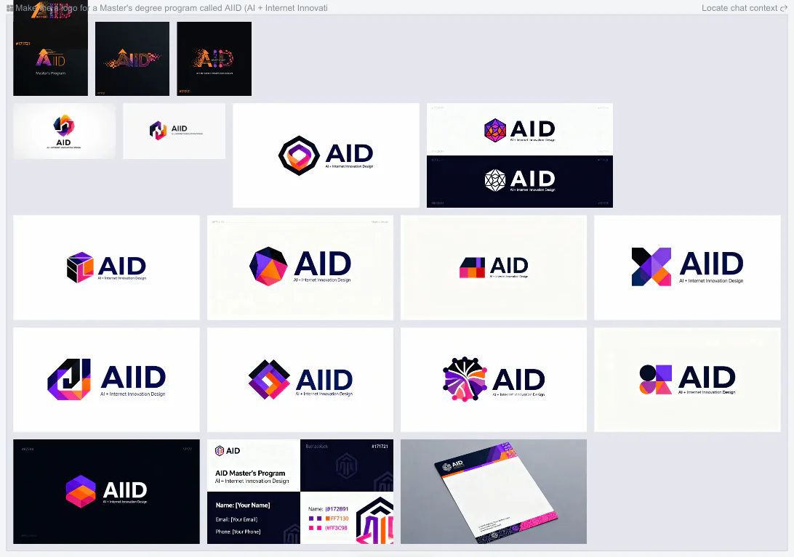

## 4. Choose the Final Logo

- Select the preferred draft and download it.

---

# 3. Plan the Website Structure

## 1. Understand the Basic Sections

Before building the website, decide which menu items or sections it needs. The structure depends on what visitors should see and what actions they should take. Most websites begin with sections such as **Home, About, and Contact**.

## 2. Sketch a Structure First (Optional)

Write a simple menu structure based on the website’s purpose.

### Basic Menu

1. **Home**
   1. The first page visitors see.
   2. Usually includes the logo, a hero area, and a short statement or introduction.
2. **About**
   1. Explains who we are or the purpose of the project or service.
   2. Portfolio: a short introduction and résumé.
   3. Service website: its vision, goals, and main capabilities.
3. **Contact**
   1. Email, telephone number, social links, or other contact details.
   2. May also include a simple contact form.

### Optional Menu

4. **Services / Projects**
   1. Presents services, projects, or portfolio work.
   2. Often displayed as a list or a set of cards.

5. **Gallery**
   1. Displays images, photographs, or design work.

6. **Blog / News**
   1. Publishes articles, updates, or logs.

7. **FAQ**
   1. Collects common visitor questions and answers.

## 3. Choose a Color Scheme (Optional)

If a logo already exists, or the website should use a particular palette, include the desired color codes in the prompt.

**Example:** `#171721, #872B97, #FF7130, #FF3C68`

When no palette comes to mind, use a color website or search by keyword.

- **Color references**
  - https://colorhunt.co/
  - https://coolors.co/

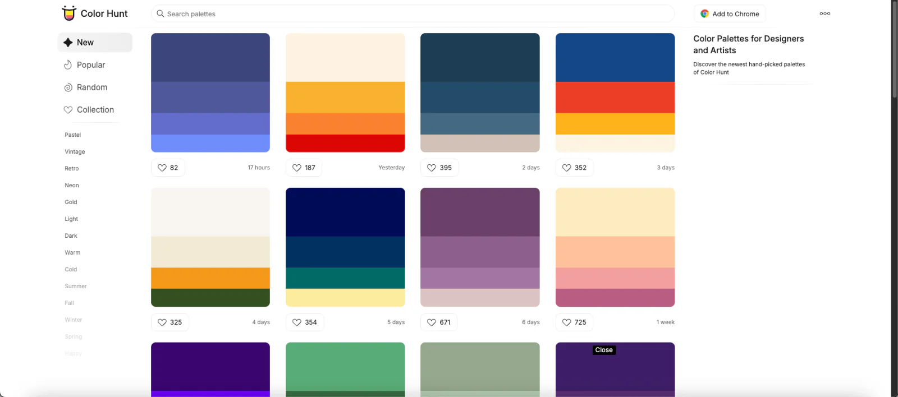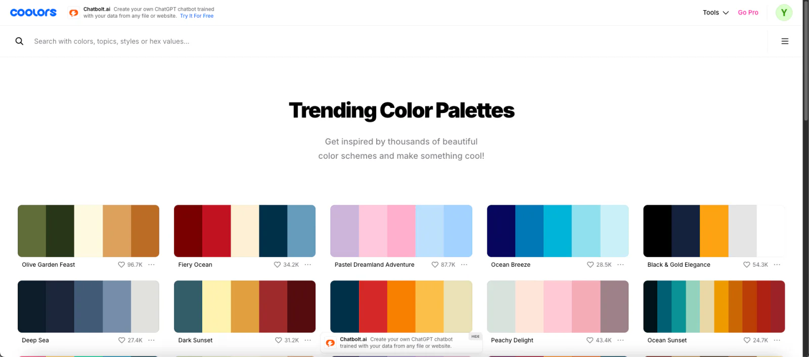

- **Search for palettes by keyword on Google**

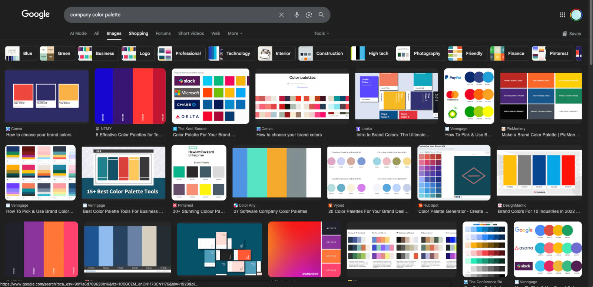

## 4. Write the Website Design Prompt

**Example prompt**

```
"Design a single-page website with Home, About, and Contact sections.
Use #171721, #FF7130, and #FF3C68.
Keep the overall style modern and clean."
```

---

# 4. Design the Website with a Design Agent

## 1. Enter the Prompt and Generate a Design

- Include the planned structure and chosen color scheme in the prompt.

**MasterGo prompt example**

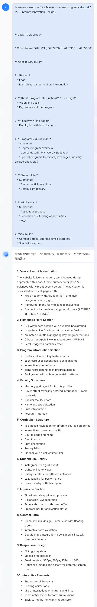

## 2. Review the Design and Request Changes

Give the Agent concrete feedback, for example:

- “This is too ornate. Make the overall style simpler.”
- “Use a different typeface.”
- “Adjust the color scheme.”
- “Remove this section.”

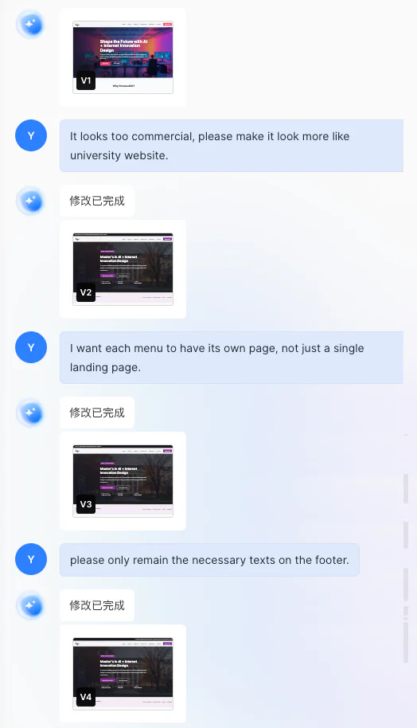

## 3. Finalize the Design

After several revisions, convert the approved design into a form that a coding Agent can understand. The exact method depends on the design platform and usually involves a plugin.

**MasterGo example**

1. Open the [MasterGo plugin site](https://mastergo.com/community/plugin) and search for **seal**.

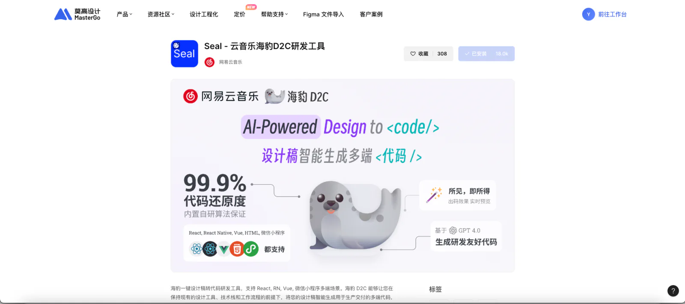

2. Return to the design page and click the **block icon (Plugins)**.

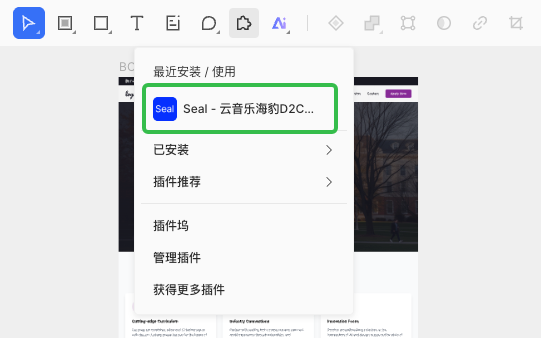

3. Select the area to convert and click **Generate** to produce code.

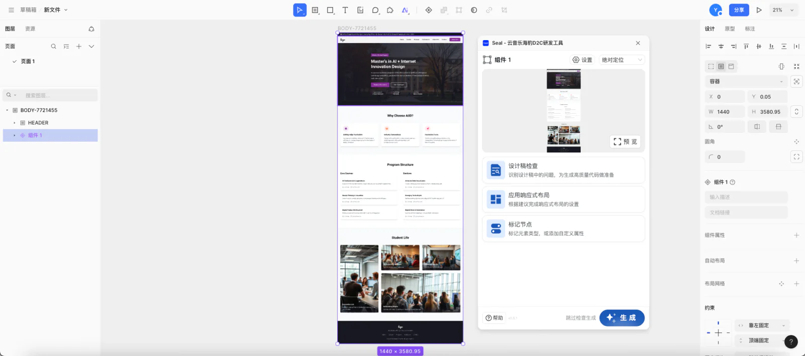

---

# 5. Build the Website with a Coding Agent

## 1. Understand the Basics of HTML, CSS, and JavaScript

A website is built from three main languages:

- **HTML (HyperText Markup Language)** → structure
- **CSS (Cascading Style Sheets)** → appearance
- **JavaScript (JS)** → behavior

Together, they form the web pages we use.

1. **🏗️ HTML (structure)**

- Defines what appears on the page.
- Places text, images, buttons, links, and other elements.
- Acts like the walls and frame of a building.

**Example**

```html
<h1>Hello!</h1>
<p>This is my first website.</p>
<a href="contact.html">Contact</a>
```

2. **🎨 CSS (appearance)**

- Defines how the content is displayed.
- Controls text size, color, spacing, backgrounds, and button shape.
- Gives the HTML its visual clothing and style.

**Example**

```css
h1 {
  color: #FF7130;   /* Text color */
  font-size: 36px;  /* Font size */
  text-align: center; /* Center alignment */
}

body {
  background-color: #171721; /* Background color */
  color: white; /* Default text color */
}
```

3. **⚙️ JavaScript (behavior)**

- Lets the page respond to the user.
- Supports button clicks, menus, carousels, form submission, and other interactions.
- If HTML and CSS provide the body and appearance, JavaScript is the brain that makes the page act.

**Example**

```javascript
function showAlert() {
  alert("The button has been clicked!");
}
```

```html
<button onclick="showAlert()">Click me</button>
```

## 2. Ask the Coding Agent to Generate Code

**Example prompt**

```
"Write the HTML and CSS for a single-page website with Home, About, and Contact sections.
Use #171721, #FF7130, and #FF3C68.
Use a black background and white text."
```

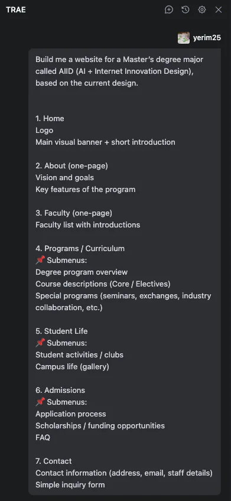

## 3. Run the Website

After generating the draft, the Agent usually starts the project and displays the website automatically.

If the Agent has restarted or the preview is missing, enter a prompt such as:

```
"Please activate the project"
```

The Agent will restart the project and open the preview.

## 4. Make Simple Changes

Continue refining the draft in natural language:

- “Make the button larger.”
- “Use a heavier font weight.”


## 5. Replace the Website Copy

The initial website often contains generated placeholder text. Prepare the real content and ask the Agent to replace it.

**Example:** update the About page of the AIID website.

1. Write the desired About content. Markdown makes the structure easier for the Agent to understand.

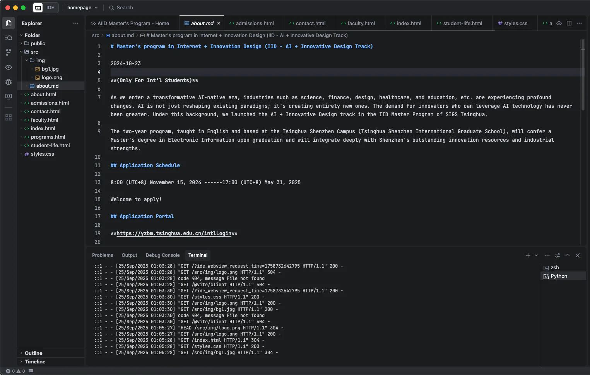

2. Ask the Agent to apply that file to the target page.

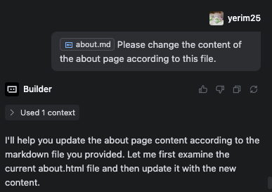

3. Review the updated page.

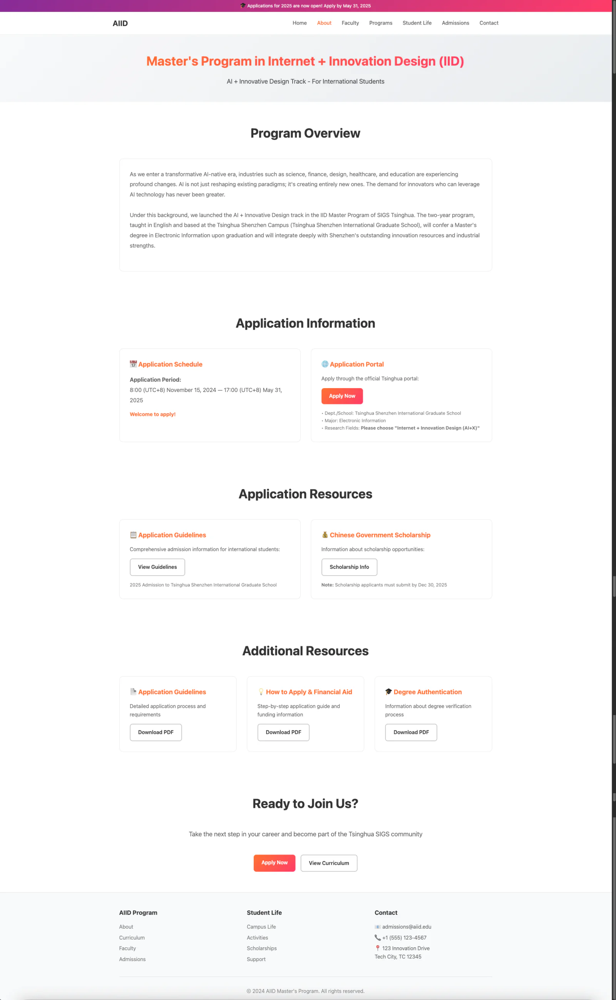

## 6. Insert Images

To add a logo, background, or other specific image, upload it to the project folder and tell the Agent where it should appear.

- **Example:**

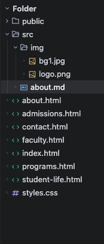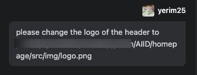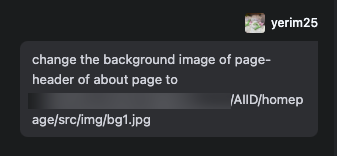

- **Result:**

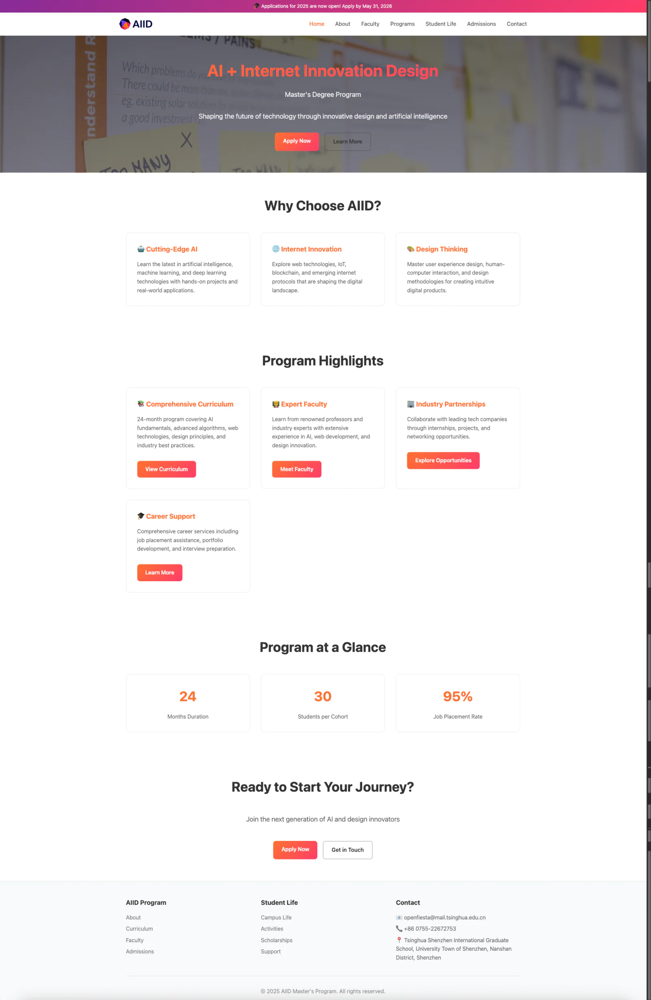

---

# 6. Integrate Design and Code

## 1. Integrate Design Files with the Website Code (Optional)

After downloading code from the design Agent, move it into the current project and ask the coding Agent to merge it with the existing implementation.

- **Example:**

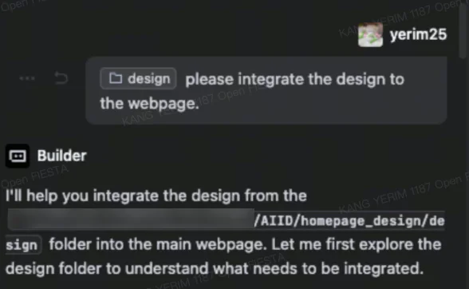

- **Result:**

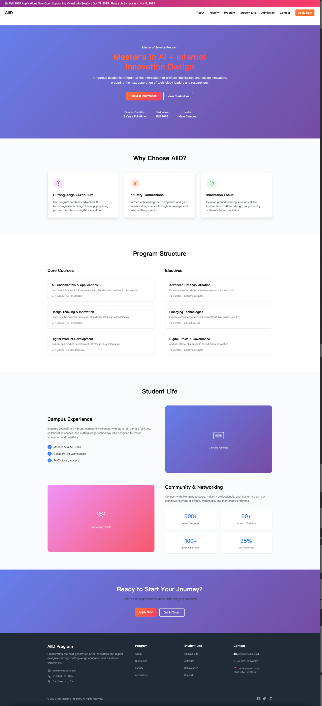
