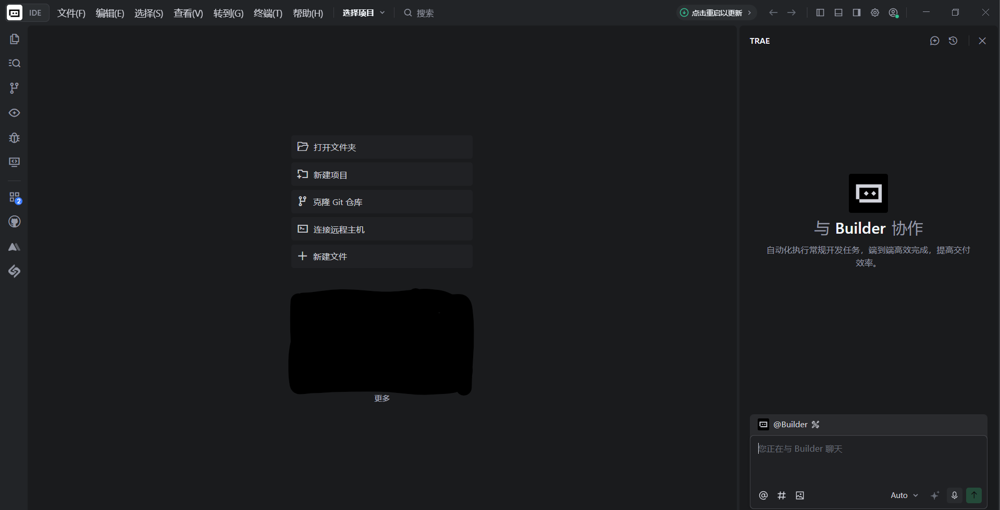
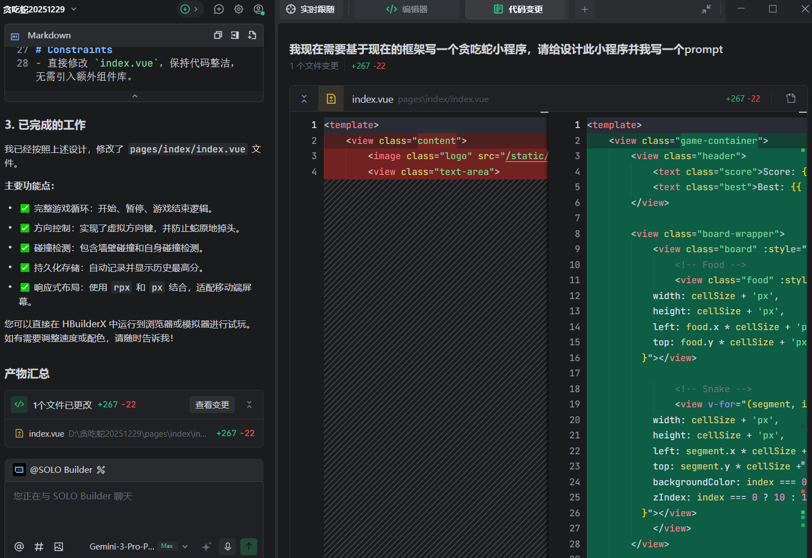
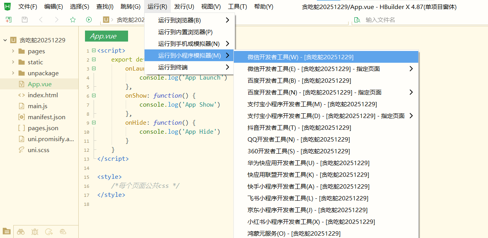
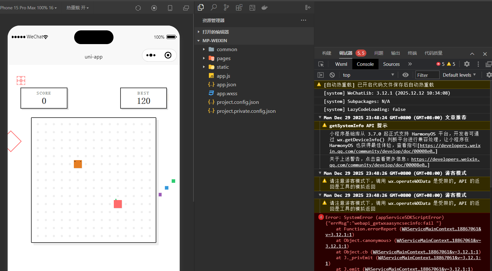
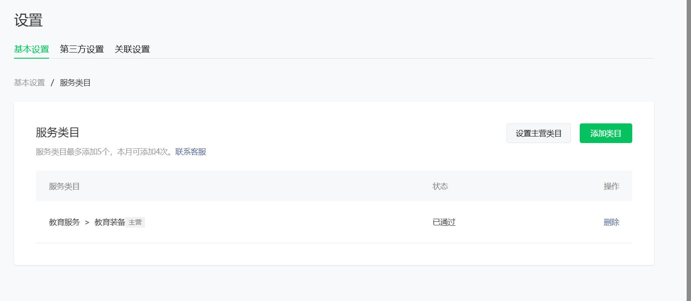
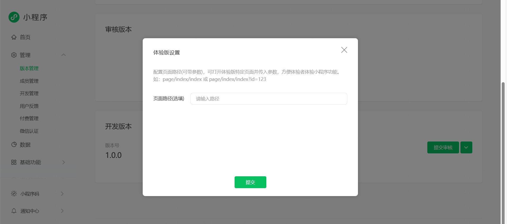

# How to Build a WeChat Mini Program with a Backend

The previous chapter built a Mini Program whose pages run on the user's phone. This chapter adds the part that a company service needs behind those pages: trusted identity, shared records, permissions, files, and logs.

We will turn the existing project into **Northstar Service Hub**. A member opens the Mini Program, creates an after-sales ticket, and later sees the same ticket on another device. Staff can process it from a company system without placing company secrets in the Mini Program.

That is the role of a backend in many company Mini Programs: the Mini Program is the convenient entrance; the backend owns orders, membership, tickets, permissions, and integrations.

## 1. Understand the two sides

The **frontend** is what runs in WeChat: pages, buttons, forms, and visible status. The **backend** runs in a trusted cloud or company environment: identity checks, business rules, database writes, file storage, and calls to internal systems.

A user can alter requests sent by the frontend. The backend must therefore decide who the caller is and what that caller may do.

For a first project, use the shortest official path:

> WeChat Cloud Development → cloud functions → document database and cloud storage

CloudBase hosting and an existing company backend are valid later choices. PostgreSQL is useful for complex SQL relationships and transactions, but it adds setup and migration work. We will not need it for the first ticket workflow.

## 2. Prepare the tools and project

Reuse the account, AppID, WeChat DevTools project, and AI coding tool from the previous chapter.

CloudBase's current AI plugin can connect supported coding tools to MCP, Skills, and Hooks. Use the one-click plugin when your tool supports it.

Trae's current guide still explains the CloudBase MCP setup directly. Follow the current steps there and let the tool read the Mini Program, WeChat authentication, and cloud-function guidance before it edits the project.

## 3. Create a Cloud Development environment

Open Cloud Development in WeChat DevTools and create an environment. The console may offer paid plans; pricing and free quotas change, so read the current purchase page before continuing. A backend is not required merely because the product is a Mini Program—you need it only when users must share accounts, records, files, payments, or company data.

If CloudBase is unsuitable, a company can use its existing HTTPS backend or another managed backend. The identity and permission rules in this chapter still apply.

Copy the environment ID into the project's central configuration. The environment ID is not a secret, but using one configuration location prevents the development and production IDs from being mixed later.

## 4. Ask AI for the first screen

Confirm the original Mini Program still runs before adding backend work.

Give AI one clear product request:

> Turn the current project into a customer service Mini Program. Add a member home page, a Create Ticket page, and a My Tickets page. Use sample data first and keep the current project runnable.

Let AI explain its planned changes before approving them.

If the change is wrong, revert before adding more requirements.

Run the project in HBuilderX or directly in WeChat DevTools, following the setup used in the previous chapter.

## 5. Create the first cloud function

A **cloud function** is backend code that CloudBase runs when the Mini Program calls it. Start with one small function so deployment and logs are easy to understand.

> Add one cloud function that returns the current server time. Add a page button that calls it and displays the result. Then tell me exactly where to deploy the function in WeChat DevTools.

Deploy the function, click the button, and confirm the returned time changes. If the call fails, read the DevTools error and function log before editing more code.

## 6. Let the backend identify the current user

The frontend must not be allowed to say “I am this user” or “I am an administrator.” In the native WeChat cloud path, the cloud function can read the caller from WeChat's trusted call context.

> Add “Get current user” to the working cloud function. Identify the caller from WeChat's trusted context, not from an ID or role sent by the page. Show only the member information needed by the page.

Do not display a full OpenID in the interface or write full identity and contact data into ordinary logs.

## 7. Save the first ticket

Create a document collection for tickets. A first ticket can contain a subject, description, status, creation time, and trusted owner.

> Save the ticket form through a cloud function. Check required fields on the server, add the trusted current user as the owner, and return a readable ticket number.

After deployment, submit one ticket. Success must be visible in two places: the page shows the ticket number and the database console contains one matching record.

Records written by cloud functions or the management API do not automatically receive `_openid`. If ownership rules need it, the function must write ownership based on the trusted context rather than a value chosen by the frontend.

## 8. Prevent duplicate submissions

One page click test proves only that the button may be disabled. A network retry can still create a second ticket unless the backend recognizes the same request.

> Give each submission a stable `clientRequestId`. If the same ID is sent again, return the original ticket instead of creating another one.

Test by sending the same `clientRequestId` twice independently. Both calls should return the same ticket number and the database should contain one ticket. A new ID should create a new ticket.

## 9. Show only the current user's tickets

> Load My Tickets through a cloud function. Return only tickets owned by the trusted current user. The page must not be able to request another user's tickets by changing an ID.

Test with two WeChat accounts. Each account should see only its own data. Then deliberately alter a request and confirm the backend rejects it.

Database rules are a second layer of protection, especially if the client reads a collection directly. For a beginner project, routing sensitive writes through cloud functions often makes the permission boundary easier to review.

## 10. Add photo attachments

Do not add uploads until ordinary tickets work.

> Let the user attach up to three ticket photos. Limit type and size, show upload progress, and save only controlled cloud file IDs with the ticket.

Use temporary download links or checked backend access rather than making every file permanently public. Before serving real users, add the appropriate content moderation flow for text and uploaded media.

## 11. Read logs when something fails

Common problems include the wrong environment ID, an undeployed function, a missing collection, denied database rules, and a record that was never written.

Give AI the exact evidence:

> The page shows this error: 【paste it】. The cloud-function log shows: 【paste it】. Find the first failing step and change only that part.

After the fix, repeat the same operation and keep both the page result and the backend log as evidence.

## 12. Separate development and production

One environment is enough while you learn. Before real users arrive, create separate development, test, and production environments and keep their IDs in central configuration.

Deploy cloud functions and security rules to the intended environment before uploading the Mini Program. Never distribute company-wide API keys inside the client. Calls to existing internal systems should go through a company-controlled backend or gateway.

Modern HTTP cloud functions support more than short request/response calls, including current WebSocket and SSE scenarios. Consider CloudBase hosting when the project genuinely needs a complete framework, custom runtime, or container. Consider PostgreSQL when relationships, SQL, and stronger transaction requirements justify it.

## 13. Upload an experience version

The Mini Program upload steps remain the same as in the previous chapter, but the backend needs its own release check:

- production environment selected;
- cloud functions deployed;
- collections and indexes present;
- access rules reviewed;
- logs and alerts available;
- review account and test records prepared;
- two-account isolation repeated in the release build.

## 14. The finish line for this chapter

The workflow is complete when one user can create a ticket, see a ticket number, find the matching database record, reopen the Mini Program on another device, and still see the same ticket—while a second account cannot read it.

The screenshots of CloudBase documentation and console entry points above are real references, but they do not claim that a paid environment was created on the reader's behalf. Pricing, account verification, production rules, and company integrations must be completed in the account that will own the application.

Once this small path is dependable, the same pattern can support appointments, repair requests, membership records, internal approvals, and order after-sales service: the page collects intent, the backend identifies the caller, rules protect the data, and logs show what happened.
