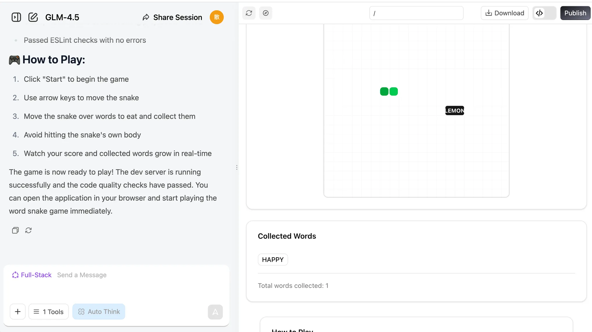
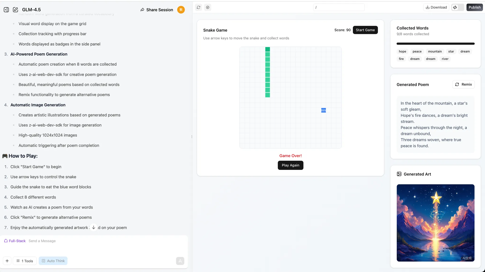
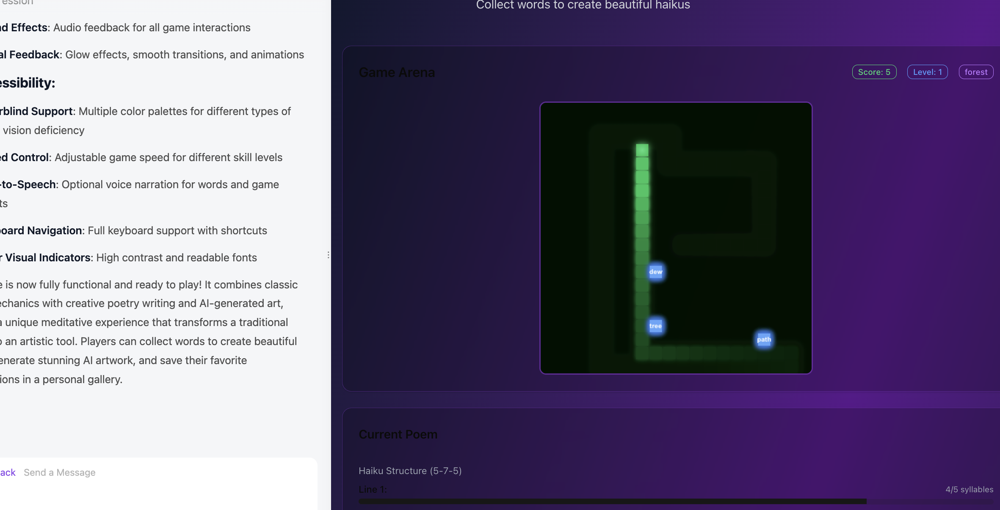
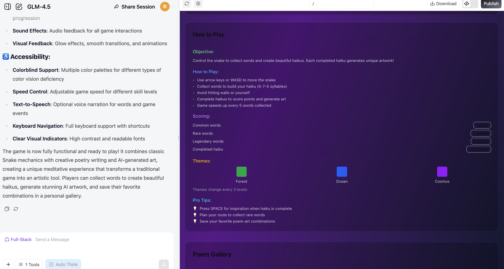
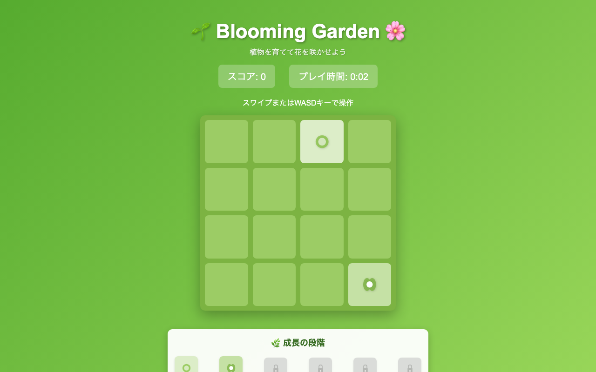
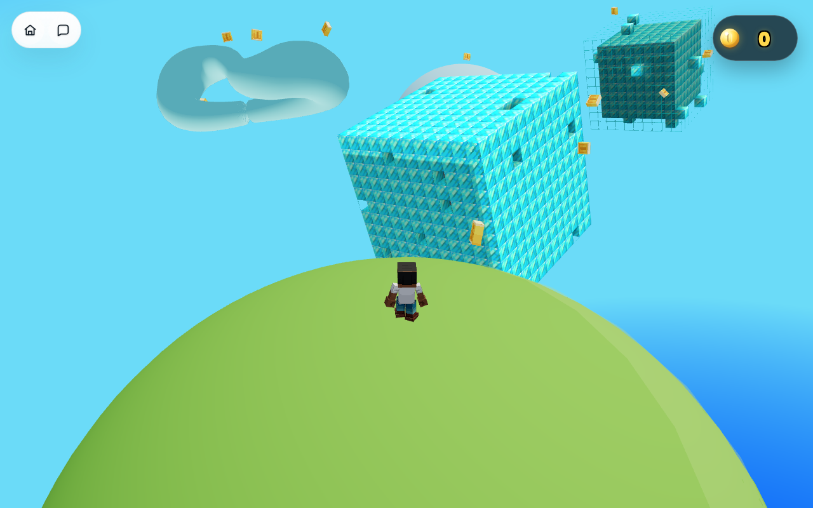
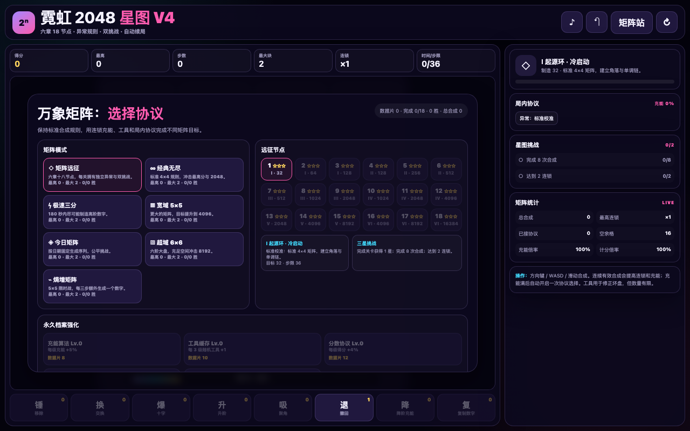
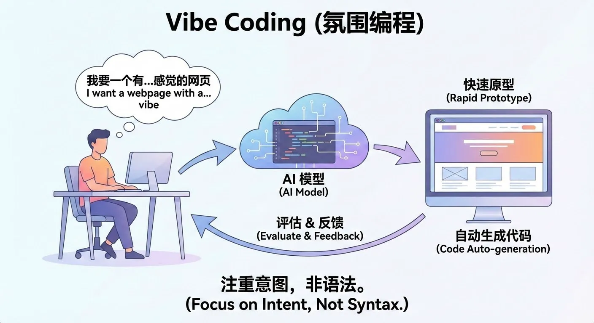

# Nivel Basico 1: En la era de la IA, saber hablar es saber programar

Este es un tutorial de aprendizaje **basado en proyectos**. Te recomendamos seguir los pasos uno por uno y tratar de reproducir los resultados.
No tengas miedo de equivocarte o de cambiar cosas. Recuerda:

<div style="text-align: center;">
<div style="display: inline-block; padding: 8px 20px; border-radius: 8px; border: 1px dashed #FFB6C1; background: linear-gradient(135deg, #FFF0F5 0%, #FFE4EC 100%); margin: 12px 0;">
  <span style="font-size: 15px; font-weight: 500; color: #666;">Terminar es mas importante que ser perfecto 🐣</span>
</div>
</div>

<script setup>
import StageAssignmentCard from '@theme/components/StageAssignmentCard.vue'
import { relatedArticlesMap } from '@theme/data/relatedArticles'

const duration = 'aprox. <strong>4 horas</strong> (puede hacerse en varias sesiones)'
const relatedArticles =
  relatedArticlesMap['es-es/stage-1/ai-capabilities-through-games'] ?? []
</script>

## Introduccion del capitulo

<ChapterIntroduction :duration="duration" :tags="['Programacion conversacional', 'Mini-juegos nativos de IA', 'Practica con Snake']" coreOutput="Snake nativo de IA + un mini-juego propio" expectedOutput="1 Snake nativo de IA ejecutable + (opcional) 1 mini-juego o demo propio">

Si <strong>no sabes programar</strong> o solo conoces lo minimo, este capitulo es para ti. Empezamos desde cero: vas a usar <strong>conversacion</strong> para que la IA te ayude a escribir codigo. Sin memorizar sintaxis ni configurar entornos, en muchos casos puedes ejecutarlo directamente en una pagina web.

Construiras tu <strong>primer programa que corre</strong>: una version de Snake que puede "comerse palabras", "escribir poemas" o "dibujar". Veras como se siente programar con IA: no es que la IA piense por ti; tu expresas tu intencion y la IA la implementa.

Toda creacion empieza de 0 a 1. Nos alegra transmitirte cada pizca de confianza y profesionalidad. Para ti, <strong>la ejecucion es todo lo que necesitas</strong>.

</ChapterIntroduction>

<div style="margin: 50px 0;">
  <ClientOnly>
    <StepBar :active="0" :items="[
      { title: 'Nivel 1: Hablar = Programar', description: 'Aprende programacion con IA a traves de juegos. De Snake a tus propios mini-juegos nativos de IA.' },
      { title: 'Exploracion rapida', description: 'Experiencia de 60 segundos' },
      { title: 'Practica nativa', description: 'Construir Snake nativo de IA' },
      { title: 'Extender y crear', description: 'Crear un juego propio' }
    ]" />
  </ClientOnly>
</div>

## 1. La dificultad de la gente comun y la oportunidad

Mucha gente tiene ideas: una herramienta para gastos, una pagina para registrar el crecimiento de un hijo, o incluso un mini-juego. Pero al pensar en "escribir codigo" o "buscar programadores", se desanima.

Con la IA aparece una posibilidad real: no necesitas saber programar para empezar; necesitas aprender a decirle a la IA con claridad que quieres. Los [datos de GitHub Copilot](https://www.wearetenet.com/blog/github-copilot-usage-data-statistics) muestran que mas de 15 millones de desarrolladores usan programacion asistida por IA, y en promedio el 46% del codigo es generado por IA. En proyectos Java, esta proporcion puede llegar al 61%.

<el-card shadow="hover" style="margin: 20px 0; border-radius: 12px;">
  <template #header>
    <div style="display: flex; align-items: center; gap: 8px;">
      <span style="font-size: 20px;">🚀</span>
      <span style="font-weight: bold; font-size: 16px;">El salto en eficiencia y adopcion</span>
    </div>
  </template>

  <el-row :gutter="20" style="margin-bottom: 24px;">
    <el-col :span="6" :xs="12">
      <div style="text-align: center; padding: 10px;">
        <div style="color: #409EFF; font-size: 24px; font-weight: bold;">55%</div>
        <div style="color: #909399; font-size: 12px; margin-top: 4px;">Mejora de velocidad</div>
      </div>
    </el-col>
    <el-col :span="6" :xs="12">
      <div style="text-align: center; padding: 10px;">
        <div style="color: #67C23A; font-size: 24px; font-weight: bold;">2.4 <span style="font-size: 14px;">dias</span></div>
        <div style="color: #909399; font-size: 12px; margin-top: 4px;">Tiempo de tarea (antes 9.6)</div>
      </div>
    </el-col>
    <el-col :span="6" :xs="12">
      <div style="text-align: center; padding: 10px;">
        <div style="color: #E6A23C; font-size: 24px; font-weight: bold;">81%</div>
        <div style="color: #909399; font-size: 12px; margin-top: 4px;">Instalacion el primer dia</div>
      </div>
    </el-col>
    <el-col :span="6" :xs="12">
      <div style="text-align: center; padding: 10px;">
        <div style="color: #F56C6C; font-size: 24px; font-weight: bold;">96%</div>
        <div style="color: #909399; font-size: 12px; margin-top: 4px;">Adopcion de sugerencias</div>
      </div>
    </el-col>
  </el-row>

  <div style="line-height: 1.8; color: #606266;">
    Lo realmente emocionante es el salto en eficiencia: la velocidad para completar tareas de los desarrolladores aumento un <b>55%</b>. El codigo que antes necesitaba 9.6 dias para entregarse ahora se puede hacer en solo <b>2.4 dias</b>. Esta mejora visible demuestra que la IA ya no es solo una "herramienta opcional", sino que se esta convirtiendo en un asistente de programacion indispensable en el flujo de desarrollo. Los datos de adopcion lo confirman: el mismo dia en que obtuvieron acceso, el <b>81%</b> de los desarrolladores lo instalo y empezo a usarlo de inmediato; de ellos, el <b>96%</b> empezo a adoptar las sugerencias de codigo de la IA ese mismo dia. En otras palabras, los desarrolladores integraron casi al instante la IA en su trabajo diario.
  </div>
</el-card>

Para la gente comun, esta tendencia es aun mas significativa: si los programadores profesionales dependen en gran medida de la IA para escribir codigo, **por que quienes no sabemos programar no podriamos conversar directamente con la IA para hacer realidad nuestras ideas**?

Esta parte del curso busca que desarrolles una nueva capacidad: <strong>crear aplicaciones describiendo requisitos en lenguaje natural</strong>. Aprenderas a comunicarte con la IA "como una computadora": objetivos claros, pasos, entradas y salidas, y como depurar cuando algo no sale bien. Tambien aprenderas a usar el lenguaje de la computadora para dialogar con la IA y a hacer que convierta las ideas de tu cabeza en productos reales y utilizables.

<div style="margin: 50px 0;">
  <ClientOnly>
    <StepBar :active="1" :items="[
      { title: 'Dificultad y oportunidad', description: 'Una nueva forma de crear con IA' },
      { title: 'Exploracion rapida', description: 'Experiencia de 60 segundos' },
      { title: 'Practica nativa', description: 'Construir Snake nativo de IA' },
      { title: 'Extender y crear', description: 'Crear un juego propio' }
    ]" />
  </ClientOnly>
</div>

## 2. Hasta donde puede llegar la IA hoy

En esta seccion solo discutimos una pregunta: si no sabes escribir codigo en absoluto, hasta donde puede ayudarte la IA actual?

En terminos generales, puedes entender las capacidades actuales de los grandes modelos como: capaces de desarrollar **herramientas internas simples**, **tableros de visualizacion de datos** y algunos **mini-juegos ligeros**. Estas capacidades suelen ser suficientes para hacer **herramientas de uso personal** o validar requisitos desde la **perspectiva de un gerente de producto**. Pero para generar con un clic un **producto maduro listo para comercializar**, normalmente se sigue necesitando que una persona optimice continuamente el **diseno de procesos** y **el pulido de detalles**.

A continuacion, tomemos Snake como ejemplo para ver concretamente hasta donde puede llegar la programacion con IA.

### 2.1 Construye Snake en 60 segundos (con z.ai)

Primero, abre la pagina experimental del curso, [z.ai](https://chat.z.ai/). `z.ai` es una plataforma de IA desarrollada por Zhipu AI (una de las principales empresas chinas de grandes modelos de lenguaje), impulsada por sus modelos propios de la serie GLM. La plataforma integra varias funciones de IA, como generacion de diapositivas, diseno de posters y desarrollo full-stack. En este tutorial nos centraremos en el uso de su modulo de desarrollo full-stack.

::: details 💡 Que significa "programar desde el navegador"

Antes, para desarrollar una aplicacion web se necesitaba:
- Instalar entornos de programacion (Node.js, Python, etc.)
- Configurar editores de codigo
- Aprender lenguajes como HTML/CSS/JavaScript
- Lidiar con dependencias y errores

Ahora, con las plataformas de programacion con IA, solo necesitas:
- Abrir el navegador y visitar el sitio
- Describir la funcionalidad que quieres en lenguaje natural
- Que la IA genere el codigo y muestre una vista previa en tiempo real

Este estilo de "conversar es programar" hace que la programacion pase de "escribir codigo" a "describir requisitos". No necesitas preocuparte por los detalles tecnicos de bajo nivel; solo tienes que decirle claramente a la IA lo que quieres, y ella convertira tu idea en un programa ejecutable. Este es el nuevo paradigma de programacion de la era de la IA: **Vibe Coding**.

:::


Introduce nuestro requisito simple y haz clic en el boton **Desarrollo full-stack**. Puedes ver como se construye la pagina web en tiempo real. Normalmente solo tarda el tiempo de preparar una taza de cafe!

```txt
Haz un juego de Snake:
1. Control con flechas
2. Al comer, la serpiente crece y sube la puntuacion
3. Chocar con la pared o contigo mismo termina el juego
4. Boton de iniciar y reiniciar
5. Interfaz simple y agradable
```


Una vez generado, veras a la derecha una interfaz web navegable. Puedes desplazarte para explorar el contenido o hacer clic en el boton 🧭 de la parte superior para verlo en pantalla completa.

> Los botones de la parte superior, de izquierda a derecha, son: el boton de flecha despliega el historial de conversacion lateral, el boton de lapiz inicia una nueva conversacion, el icono de flecha circular actualiza la pagina, el boton de brujula cambia al modo de pantalla completa, el boton Descargar descarga el proyecto, el boton <> cambia a la vista de codigo y el boton Publicar publica el proyecto.


Si quieres consultar el codigo fuente de la pagina, haz clic en el icono de codigo de la esquina superior derecha para ver todo el codigo.


::: tip 🌐 Explora mas herramientas de programacion con IA

Ademas de z.ai, tambien te recomendamos probar estas excelentes plataformas de programacion con IA:

| Herramienta | Enlace | Caracteristicas |
|------|------|----------|
| **Kimi Code** | [kimi.com/code/console](https://kimi.com/code/console) | Asistente de programacion IA de Moonshot AI, con CLI de Kimi Code para terminal y extension de VS Code, basado en el modelo especializado en codigo Kimi K2.7 Code, compatible con Claude Code, Roo Code, etc. |
| **Google AI Studio** (Recomendado) | [aistudio.google.com/apps](https://aistudio.google.com/apps) | Herramienta oficial de Google, impulsada por Gemini, ideal para prototipado rapido |
| **Figma Make** | [figma.com/make](https://www.figma.com/make) | Profundamente integrado con herramientas de diseno, ideal para prototipos interactivos |
| **Coze** | [coze.com](https://www.coze.cn) | Plataforma de bots de IA de ByteDance, construccion visual sin codigo |
| **v0.dev** | [v0.dev](https://v0.dev) | Generacion de componentes React con IA de Vercel |
| **Bolt.new** | [bolt.new](https://bolt.new) | Desarrollo full-stack con IA capaz de generar aplicaciones desplegables |
| **Lovable** | [lovable.dev](https://lovable.dev) | Generacion de aplicaciones React de alta calidad |
| **Replit Agent** | [replit.com](https://replit.com) | IDE en linea integrado con IA |

Para mas comparaciones y tutoriales, consulta nuestra lectura complementaria: [Comparacion de 7 herramientas de programacion con IA](../../stage-1/appendix-articles/example0-1/vibe-coding-tools-snake-game-tutorial.md)
:::

### 2.2 Que puede y que no puede hacer la programacion conversacional

Esta seccion se centra en una pregunta concreta: cuando dependes unicamente de la IA conversacional y no escribes ningun codigo, hasta donde puede llegar un proyecto?
En terminos de experiencia, una conclusion bastante estable es: puede ayudarte a completar algo "pequeno pero completo", pero decidir "cuanto es suficiente" sigue requiriendo tu decision personal en cada paso detallado.

#### Destaca en aplicaciones "pequenas y claras"

En el ejemplo de Snake anterior ya viste un patron tipico:
mientras puedas describir con claridad la interfaz y las interacciones, la IA normalmente puede ensamblar en pocas rondas de conversacion una pagina web completa que se abre, se hace clic y se juega.

Estas tareas suelen compartir varias caracteristicas:

- Alcance claro: una pagina, una herramienta interna simple, una mecanica de juego pequena.
- Resultado visible: puedes verificar de inmediato en el navegador si funciona como se espera.
- Correccion directa: al detectar un problema, puedes senalar el fenomeno concreto en las siguientes rondas y pedir la correccion (copiando el error directamente, o pegando una captura de pantalla para que la IA lo modifique).

Dentro de este limite, puedes ver a la IA conversacional como un "desarrollador asistente" con buena capacidad de ejecucion. Solo necesitas refinar y corregir los requisitos en lenguaje natural en cada ronda para obtener rapidamente un prototipo utilizable.

**Tasa de exito de la IA en tareas de pequena escala:**
<el-progress :percentage="90" :stroke-width="15" status="success" striped striped-flow />

#### Los proyectos grandes requieren una "perspectiva de proceso"

Una vez que se supera el alcance pequeno y claro, esperar que unas pocas rondas de conversacion hagan que la IA complete de extremo a extremo un sistema complejo choca rapidamente con un limite. Los proyectos grandes suelen necesitar conectar backend, bases de datos e integrar servicios de terceros, ademas de implicar permisos, seguridad, concurrencia y muchas reglas de negocio; el objetivo es entregar un sistema completo profundamente integrado con el negocio existente, no una pagina web.

En este caso, lo mas razonable no es lanzarle todos los requisitos de golpe a la IA, sino primero ordenar un proceso general claro: cuales son los pasos clave, cuales son las entradas, salidas y cambios de estado de cada paso, y que nodos son mas sensibles al rendimiento y a la seguridad. Con base en ese diagrama de flujo, divide los segmentos relativamente independientes y entregalos a la IA conversacional para que genere interfaces, modulos, scripts y pruebas.

Con las capacidades actuales, la IA es mejor acelerando pequenos pasos individuales; tu (o tu equipo) decides como dividir los pasos y conectarlos, y eres responsable del diseno de arquitectura final, la integracion de sistemas y la operacion y mantenimiento.

#### La diferencia entre generar y validar

A primera vista, la IA parece poder escribir de todo, pero estas cosas realmente se pueden usar y hasta que punto? Como deberiamos dividirlo?

Una referencia de experiencia:

::: warning ⚠️ Guia de escenarios de uso

- **Prototipos / Demos / Herramientas internas de uso personal**: muy adecuados para que la IA haga la primera version y luego tu iteres los detalles.
- **Productos grandes orientados a usuarios reales**: normalmente requieren una inversion sostenida de ingenieros en arquitectura, abstraccion, rendimiento y mantenimiento.
- **Sistemas de alta seguridad / alta regulacion (pagos, control de riesgos, salud, etc.)**: en la etapa actual, no conviene "generar y publicar directamente"; se deben introducir procesos estrictos de revision y pruebas.
:::

Hoy por hoy, puedes considerar con relativa tranquilidad a la IA como una companera eficiente para demos y herramientas de uso personal: mientras estes dispuesto a probar e iterar mucho, y a preguntar varias rondas de "esto no esta bien, ayudame a corregirlo y explicame el motivo", en el nivel de prototipos y herramientas internas la calidad general suele ser suficiente y practica.

<div style="margin: 50px 0;">
  <ClientOnly>
    <StepBar :active="2" :items="[
      { title: 'Dificultad y oportunidad', description: 'Una nueva forma de crear con IA' },
      { title: 'Exploracion rapida', description: 'Experiencia de 60 segundos' },
      { title: 'Practica nativa', description: 'Construir Snake nativo de IA' },
      { title: 'Extender y crear', description: 'Crear un juego propio' }
    ]" />
  </ClientOnly>
</div>

## 3. Manos a la obra: tu primera aplicacion nativa de IA

Volvamos a la parte practica. En la seccion anterior ya hicimos rapidamente con IA un prototipo de Snake jugable y supimos mas o menos que puede y que no puede hacer la IA. A continuacion aprenderemos a usar las tecnicas mas basicas de **vibe coding** para crear una version **moderna** del juego de Snake nativo de IA. Haremos que la serpiente coma caracteres de texto en lugar de puntos. Finalmente, el juego generara un poema a partir de los caracteres de texto comidos y dibujara una imagen.

Con este caso practico podras comprender la idea central del nuevo paradigma de programacion: como aprender a expresar requisitos con claridad en lenguaje natural.

### 3.1 Snake nativo de IA

Para empezar, podemos dialogar con el gran modelo de la forma mas simple, lo que nos ayudara a obtener rapidamente un prototipo del producto. Podemos escribir directamente en el cuadro de chat:

> **💡 Ejemplo de prompt:** Hazme un juego de Snake.
>
> 

> **💡 Ejemplo de prompt:** Hazme un juego de Snake que admita:
>
> 1. Comer diferentes palabras, que se recogen en una caja.
>    

> **💡 Ejemplo de prompt:** Hazme un juego de Snake que admita:
>
> 1. Comer diferentes palabras, que se recogen en una caja.
> 2. Cuando la serpiente coma 8 palabras, el LLM debe crear un poema con esas palabras, que podamos remezclar segun sea necesario.
> 3. Cuando el poema este completo, el siguiente paso creara automaticamente una imagen a partir del poema.
>
> 

Ten en cuenta que durante el desarrollo podemos encontrarnos con problemas que no son ideales: por ejemplo, hacer clic en un boton no tiene ningun efecto, aparece un error al usar una funcion, la funcion no funciona como se esperaba, o la pagina no coincide con el diseno previsto.

En este caso, necesitamos seguir preguntando al modelo para que nos ayude a corregir estos problemas inesperados.


### 3.2 Anade nuevas funciones al juego

Despues de completar las funciones basicas, podemos intentar anadirle nuevos giros a nuestro programa! Si te parece un poco aburrido el proceso de que la serpiente coma palabras o caracteres, puedes hacer que coma palabras de diferentes colores y que cambie el color de la serpiente en consecuencia.

Tambien puedes anadir efectos especiales al proceso de "comer", o introducir palabras magicas que activen efectos especiales: por ejemplo, aumentar la velocidad o el tamano de la serpiente. Otra idea es hacer que el modelo genere un poema y una imagen cada vez que la serpiente coma una palabra, en lugar de esperar a que coma ocho palabras.

Si te parecen desafiantes estas ideas, puedes pedir ayuda directamente al modelo de lenguaje! Puede ofrecerte sugerencias creativas para que tu juego sea mas divertido. Pruebalo!

```
1. Mecanica "La palabra desbloquea el mundo"
   Funcion: despues de que la serpiente coma una palabra, el modelo de imagenes genera al instante una pequena obra de arte para esa palabra, formando poco a poco un panorama unico creado por el jugador: "pintar" y "escribir poemas" mientras juegas.

2. Gameplay "Puzzle poetico"
   Funcion: cada palabra que come la serpiente hace que el LLM genere un verso y el modelo de imagenes una ilustracion, que al final de la partida se combinan como piezas de un rompecabezas en un poema y un cuadro co-creados por la IA.

3. "Palabras magicas" y ramas de la historia
   Funcion: al comer palabras magicas como "viento", "noche" o "sueno", el LLM cambia el tema de la escena y alterna el estilo de las imagenes a atmosferas nocturnas, tormentosas o oniricas; las distintas palabras que come el jugador mantienen en evolucion la historia generada por la IA.

4. "Generacion interactiva en tiempo real"
   Funcion: cada palabra comida hace que el LLM genere una linea de dialogo o descripcion, para que los NPC del juego "hablen" y el entorno cambie en consecuencia; la apariencia de la serpiente o los obstaculos tambien cambian segun las palabras comidas.

5. Desafio "Serpiente de frases"
   Funcion: modo inverso: el LLM propone un verso o una adivinanza, y el jugador guia a la serpiente para que coma las palabras en orden y reconstruya la frase; comer la palabra equivocada dispara la generacion de consecuencias artisticas divertidas por parte del modelo de imagenes.

6. "Niveles tematicos" y seleccion de estilo
   Funcion: al empezar la partida, el jugador elige un tema (p. ej., "cuento de hadas", "ciencia ficcion", "poesia Tang") y el LLM y el modelo de imagenes ajustan las palabras, el estilo poetico y las imagenes para que cada partida se sienta renovada.

7. "Co-creacion en vivo"
   Funcion: al comer una palabra especial, el LLM invita al jugador a escribir una frase o elegir un estilo y luego genera versos e ilustraciones a juego, logrando una verdadera co-creacion humano-IA.

8. "Una historia que crece"
   Funcion: mientras la serpiente sigue creciendo, el LLM continua escribiendo el poema-historia y el modelo de imagenes genera un largo rollo panoramico, permitiendo al jugador experimentar "escribir, pintar y jugar" a la vez.
```

Ademas, tambien podemos pedirle al LLM que genere directamente por ti un prompt a nivel de proyecto. En la seccion anterior solo escribimos nosotros mismos el prompt del juego de Snake. Ahora intentemos que el gran modelo genere un prompt con un marco general y una ruta de implementacion (puedes generarlo directamente con z.ai).

Si quieres aprender a escribir mejores prompts, consulta el [Apendice de ingenieria de prompts](/es-es/appendix/8-artificial-intelligence/prompt-engineering).

> Quiero que la IA genere un juego de Snake para web y necesito un prompt mas completo para que el resultado sea mas impresionante y divertido. Por favor, genera el prompt correspondiente. El objetivo actual es: generar un juego de Snake que implemente la funcion de comer diferentes palabras para generar poemas, y que ademas incluya un modulo de generacion de imagenes.

La respuesta de z.ai sera asi:


Podemos usar este prompt para regenerar el proyecto en modo de desarrollo full-stack:





<div style="margin: 50px 0;">
  <ClientOnly>
    <StepBar :active="3" :items="[
      { title: 'Dificultad y oportunidad', description: 'Una nueva forma de crear con IA' },
      { title: 'Exploracion rapida', description: 'Experiencia de 60 segundos' },
      { title: 'Practica nativa', description: 'Construir Snake nativo de IA' },
      { title: 'Extender y crear', description: 'Crear un juego propio' }
    ]" />
  </ClientOnly>
</div>

### 3.3 Intenta hacer otros mini-juegos

Ademas de Snake, podemos dejar volar la imaginacion.

Crea cualquier cosa que quieras crear, e incluso intenta estropearlo todo! Y luego empieza de nuevo!

1. Plataforma de galeria de arte con IA: ayudame a construir una galeria en linea donde los usuarios puedan subir, navegar, dar me gusta y comentar obras de arte generadas por IA, con navegacion por categorias.
2. Archivo de juegos retro: ayudame a construir un sitio web que rinda homenaje a los juegos clasicos, con historia de los juegos, guias de jugabilidad y algunos mini-juegos retro clasicos que se puedan jugar directamente en linea.
3. Rastreador de vida sostenible: ayudame a construir un rastreador de huella de carbono donde los usuarios registren sus actividades diarias para obtener una estimacion automatica de emisiones, junto con consejos ecologicos y desafios semanales.
4. Asistente de cocina virtual: ayudame a construir un asistente de cocina con IA donde los usuarios ingresen los ingredientes que tienen en casa y obtengan recomendaciones de recetas con instrucciones de cocina paso a paso.
5. Plataforma de descubrimiento musical underground: ayudame a construir un sitio web de musica en streaming que destaque a artistas independientes y emergentes, con soporte para crear listas de reproduccion y comentarios de la comunidad.
6. Sistema de gestion de tareas minimalista: ayudame a construir una herramienta de gestion de tareas de estilo minimalista que admita crear tareas, establecer prioridades, ordenar arrastrando y soltando, y ver el progreso de finalizacion.
7. Taller de escritura de ciencia ficcion: ayudame a construir una plataforma de escritura de ciencia ficcion que proporcione plantillas de construccion de mundos, tarjetas de perfil de personajes y herramientas de esquema de historias para ayudar a los autores a construir sus escenarios.
8. Grafo de conocimiento personal: ayudame a construir una herramienta de notas visuales que convierta ideas dispersas en nodos y conecte contenidos relacionados en una red de conocimiento.
9. Jardin botanico virtual: ayudame a construir un sitio web de enciclopedia de plantas con fichas ilustradas de diversas plantas, donde los usuarios tambien puedan plantar sus propias plantas virtuales y verlas crecer.
10. Arena de desafios de programacion: ayudame a construir una plataforma en linea de concursos de programacion con problemas de algoritmos de diferentes niveles de dificultad, editor de codigo en linea, evaluacion automatica y tablas de clasificacion.

Y... si te gusta jugar, intentemos crear juegos juntos!

1. RPG de mundo abierto 3D: ayudame a construir un juego de mundo abierto 3D libremente explorable, con ciclo dia-noche, clima dinamico, sistema de misiones y crecimiento de personajes.
2. Arena de disparos en primera persona (FPS): ayudame a construir un FPS multijugador de ritmo rapido que admita combate por equipos, captura de bandera, varios modos de juego y varios mapas.
3. Ajedrez con IA y multijugador: ayudame a construir una plataforma de ajedrez donde pueda jugar contra la IA en diferentes niveles de dificultad y tambien emparejarme con jugadores reales en linea.
4. Mahjong multijugador en linea: ayudame a construir un juego de Mahjong tradicional que admita varios conjuntos de reglas, salas privadas y puntuacion automatica.
5. Juego de estrategia por turnos: ayudame a construir un juego de estrategia por turnos en un mapa de cuadricula, con movimiento de unidades, ataque, mejora y niebla de guerra.
6. Juego de carreras contrarreloj: ayudame a construir un juego de carreras 3D centrado en el modo contrarreloj, con soporte para multiples pistas, personalizacion de coches y repeticiones fantasma.
7. Juego de cartas coleccionables (construccion de mazos): ayudame a construir un juego de batallas de cartas donde los jugadores puedan coleccionar cartas, construir mazos libremente y competir en partidas clasificatorias.
8. Battle Royale (2D en vista superior): ayudame a construir un juego battle royale 2D en vista superior con zona que se encoge, botin aleatorio y modos solo/escuadron.
9. Juego de supervivencia de terror (primera persona): ayudame a construir un juego de supervivencia de terror en primera persona centrado en la gestion de recursos, esquivar enemigos sigilosamente y encontrar una salida.
10. Juego de ritmo musical (3D): ayudame a construir un juego de ritmo musical 3D donde las notas vuelen desde la distancia al ritmo de la musica y los jugadores las golpeen en el momento adecuado para sumar puntos.

### 3.4 Casos destacados de la web: lo que otros han construido con IA

Al ver esto, puede que sigas pensando: Snake es solo un ejemplo de introduccion, puede la IA hacer juegos mas complejos?

La respuesta es si. A continuacion hemos seleccionado **8** casos reales publicos de toda la web: desde colecciones de juegos arcade clasicos y puzles estilo 2048, hasta recreaciones de *Minecraft* y *Super Mario*, e incluso un juego 3D y una plataforma oficial de juegos hechos por el gran modelo chino Kimi. Entre estos desarrolladores hay programadores profesionales y tambien personas completamente novatas, pero todos tienen algo en comun: **usaron la conversacion para que la IA completara la mayor parte del codigo**.

#### 🕹️ Caso 1: Recrearon 10 juegos arcade clasicos en una tarde (WotAI Games)

[WotAI Games](https://games.wotai.co/) es una coleccion de juegos de navegador desarrollada desde cero con Claude Code (Vibe Coding), **sin usar ningun motor de juegos**. Mediante conversaciones, la IA recreo de una sola vez 10 juegos arcade clasicos: Pac-Man, Tetris, Space Invaders, Snake, Flappy Bird, Breakout, Galaxian, Frogger, Doodle Jump y Sudoku. Cada uno se puede jugar directamente en linea y ademas incluye un sistema de tablas de clasificacion integrado.


> 🔗 Juega en linea: [games.wotai.co](https://games.wotai.co/) ｜ Retrospectiva del desarrollo: [We vibe coded 10 classic arcade games with Claude Code](https://wotai.co/blog/wotai-games-vibe-coded-arcade-classics)

#### 🌸 Caso 2: Una persona sin conocimientos previos hizo un juego estilo 2048 en 2 horas (Blooming Garden)

El desarrollador japones [in0ho1no](https://github.com/in0ho1no), que no sabia absolutamente nada de programacion, uso Claude mediante conversacion pura (Vibe Coding) para construir en **unas 2 horas** el juego estilo 2048 de "jardin de flores" [Blooming Garden](https://in0ho1no.github.io/2025-adhoc-blooming-garden/): fusionar plantas iguales para mejorarlas, espectaculares efectos de floracion, animaciones de particulas, tablas de clasificacion, efectos de sonido, adaptacion movil... Todas estas funciones se completaron mediante conversacion en lenguaje natural, sin escribir una sola linea de codigo a mano.



> 🔗 Juega en linea: [in0ho1no.github.io/2025-adhoc-blooming-garden](https://in0ho1no.github.io/2025-adhoc-blooming-garden/) ｜ Codigo fuente: [github.com/in0ho1no/2025-adhoc-blooming-garden](https://github.com/in0ho1no/2025-adhoc-blooming-garden)

#### 🌍 Caso 3: Un disenador uso IA para crear un juego 3D multijugador en linea (Planet Jumper)

El disenador [Ricardo de Zoete (Hammy)](https://x.com/RicardoDeZoete) uso la IA de OpenAI mediante conversacion pura (Vibe Coding) sobre three.js para crear [Planet Jumper](https://gamesbyhammy.cloud/play/planetjumper): un **plataformas 3D multijugador**: corre, deslizate y salta por la superficie de un pequeno planeta esferico, compitiendo en linea contra desconocidos en la misma arena. Sistemas que no son nada simples (gravedad esferica, sincronizacion en red y sensacion de salto) se "conversaron" con prompts.



> 🔗 Juega en linea: [gamesbyhammy.cloud/play/planetjumper](https://gamesbyhammy.cloud/play/planetjumper) ｜ Informe detallado: [Planet Jumper: A Vibe-Coded Three.js Multiplayer Platformer](https://www.webgpu.com/showcase/planet-jumper-threejs-multiplayer/)

#### 🎮 Caso 4: Una persona hizo 100 juegos de navegador con Vibe Coding (2026)

En julio de 2026, el desarrollador de la comunidad china [wangzifan396-wzf](https://github.com/wangzifan396-wzf) publico como codigo abierto [mini-browser-games](https://github.com/wangzifan396-wzf/mini-browser-games): **100 mini-juegos de navegador construidos y pulidos continuamente por una sola persona con Vibe Coding**, todos como archivos HTML individuales sin dependencias que se ejecutan con doble clic. Los juegos abarcan generos de accion, estrategia, torres, gestion, cartas, fisica, deduccion, carreras, ritmo, mesa y puzles, y varios ya han alcanzado una profundidad de nivel de producto completa con campanas de multiples capitulos, sistemas de progresion y sincronizacion entre dispositivos mediante codigos de guardado. Todo el proyecto esta bajo licencia MIT y el catalogo en linea permite empezar a jugar de inmediato.




> 🔗 Catalogo en linea: [wangzifan396-wzf.github.io/mini-browser-games](https://wangzifan396-wzf.github.io/mini-browser-games/) ｜ Codigo fuente: [github.com/wangzifan396-wzf/mini-browser-games](https://github.com/wangzifan396-wzf/mini-browser-games) ｜ Retrospectiva de creacion: [I Built 100 Browser Games with Vibe Coding and Open-Sourced All of Them](https://blog.csdn.net/m0_74023007/article/details/162945755)

#### ⛏️ Caso 5: Un clon de Minecraft hecho para los sobrinos del creador (CraftMine, 2026)

En febrero de 2026, el desarrollador [Trent Sterling](https://tront.xyz/blog/posts/craftmine/) queria que sus sobrinos jugaran a *Minecraft*, pero no tenian el juego oficial, asi que simplemente abrio un archivo HTML en blanco y uso Claude Code mediante conversacion pura para construir [CraftMine](https://tront.xyz/craftmine/): un clon web de *Minecraft* de **6,820 lineas en un solo archivo**: 46 tipos de bloques (mas 21 bloques tematicos infernales de DOOM), 36 criaturas (desde pollos hasta un jefe Titan con 300 HP), 19 armas (incluida la BFG 9000), 5 biomas, ciclo dia-noche e incluso **multijugador P2P**. No hay ningun paso de compilacion: abre la pagina web y juega.


> 🔗 Juega en linea: [tront.xyz/craftmine](https://tront.xyz/craftmine/) ｜ Retrospectiva del desarrollo: [CraftMine: A 6,820-line vibe-coded Minecraft clone in one HTML file](https://tront.xyz/blog/posts/craftmine/)

#### 🍄 Caso 6: Un Super Mario con niveles infinitos generados por IA en tiempo real (2026)

En marzo de 2026, un desarrollador combino una version de codigo abierto de *Super Mario* con los modelos de OpenAI para crear [AI Super Mario](https://supermario.leanmcp.live/): puedes jugar los niveles originales clasicos o dejar que la IA **genere nuevos niveles en tiempo real**: en el "modo infinito", la IA genera dinamicamente escenas y enemigos nuevos mientras avanzas, y en las pruebas se pudo jugar de forma continua durante 45 minutos. Incluso puedes escribir texto directamente en el juego para pedirle a la IA que anada enemigos, coloque plataformas o cambie el tema.


> 🔗 Juega en linea: [supermario.leanmcp.live](https://supermario.leanmcp.live/) ｜ Informe detallado: [OpenAI and Idiomorph Power Infinite Mario Level Generation in Browser](https://www.thenextgentechinsider.com/pulse/openai-and-idiomorph-power-infinite-mario-level-generation-in-browser)

#### 🇨🇳 Caso 7: Un solo prompt hizo que el gran modelo chino Kimi K3 construyera un juego 3D (2026)

En julio de 2026, el desarrollador [Dr. Josh Simmons](https://www.drjoshcsimmons.com/writing/kimi-k3-built-the-game-i-still-had-to-play-it) envio un unico prompt al gran modelo chino **Kimi K3**, y este construyo un juego 3D en primera persona jugable: recoge nucleos de datos en una instalacion de servidores generada proceduralmente, esquiva drones patrullando y baja tres pisos en un montacargas. Todo el juego se pudo jugar en una sola generacion, y tras dos rondas de conversacion para corregir dos errores se podia completar sin problemas, por unos **2 dolares** en total.


> 🔗 Juega en linea: [kimi-test-theta.vercel.app](https://kimi-test-theta.vercel.app/) ｜ Codigo fuente: [github.com/jcpsimmons/kimi-test](https://github.com/jcpsimmons/kimi-test) ｜ Retrospectiva del desarrollador: [Kimi K3 Built the Game. I Still Had to Play It.](https://www.drjoshcsimmons.com/writing/kimi-k3-built-the-game-i-still-had-to-play-it)

#### 🎯 Caso 8: K399, la plataforma oficial de juegos de Kimi: decenas de juegos de IA para jugar en linea (2026)

El 17 de julio de 2026, Moonshot AI lanzo el modelo Kimi K3 y, al mismo tiempo, la plataforma de juegos de navegador [K399](https://www.k399.games/), donde decenas de juegos fueron hechos con el modelo K3 y se pueden jugar con un clic. Los generos abarcan disparos 3D, juegos de ritmo, accion lateral, AVG de intriga palaciega, puzles 3D e incluso mundos abiertos: junto a obras que recrean juegos clasicos como *The Legend of Zelda*, *Black Myth: Wukong*, *Bubble Land* y *Vampire Survivors*, tambien hay juegos originales con un nivel de completitud muy superior al de una demo, como *Pioneer Practice Ground* (un FPS 3D con movimiento, salto, deslizamiento, punteria y disparo), el mundo abierto *SpiderPunk* y el AVG de intriga palaciega *Fengque Shen Gong* con una historia principal de cinco capitulos, ocho misiones secundarias y 32 eventos aleatorios.


> 🔗 Juega en linea: [k399.games](https://www.k399.games/) (K3 Game Arcade, juega con un clic) ｜ Informe detallado: [A Former miHoYo Executive Joined, and the Hottest AI Company Suddenly Made Dozens of Games](https://eu.36kr.com/zh/p/3906895998178441) ｜ [Kimi K3: Who's Getting Nervous?](https://36kr.com/p/3905392402748801)

Despues de ver estos casos te daras cuenta: **Snake es solo la punta del iceberg de lo que la IA puede hacer programando**. Ya sean juegos arcade clasicos, puzles 2048, juegos 3D, recreaciones de *Minecraft* y *Super Mario*, colecciones de cientos de juegos, o incluso la plataforma oficial de juegos de un gran modelo chino, mientras puedas describir tus ideas con claridad y estes dispuesto a pulirlas con varias rondas de conversacion, la IA puede ayudarte a construirlos de 0 a 1. Ahora te toca a ti!

## 📚 Tarea

<StageAssignmentCard title="Completa tus primeros minijuegos nativos de IA">

<p>
    En esta seccion, has seguido los pasos para experimentar el proceso completo, desde "generar Snake conversacionalmente" hasta "comprender el pensamiento de diseno de los mini-juegos nativos de IA". Las siguientes tareas te ayudaran a convertir esa comprension en habilidades reales.
  </p>

  <ol>
    <li>
      <strong>Reproduce por completo el juego de Snake nativo de IA</strong>
      <ul>
        <li>Como minimo, implementa: que la serpiente pueda moverse, que al comer "comida" cambien su longitud y su puntuacion, y que chocar contra una pared o contra si misma termine el juego.</li>
        <li>Durante la reproduccion, practica enviar de una sola vez a la IA la descripcion del error + el mensaje de error + los fragmentos de codigo clave, pidiendole que lo arregle en "modo principiante".</li>
      </ul>
    </li>
    <li>
      <strong>(Opcional) Crea 1 mini-juego o demo original nativo de IA</strong>
      <ul>
        <li>Puede ser cualquier juego ligero en torno a texto, imagenes, musica, ritmo, etc., como "comer palabras para escribir poemas", "clic ritmico", "runner generativo", etc.</li>
        <li>La clave no es que los graficos sean llamativos, sino que puedas decir con claridad: que hizo exactamente la IA aqui, y que parte "dificil de hacer a mano o tediosa" resolvio.</li>
      </ul>
    </li>
  </ol>

  <p>
    Ese es el tutorial completo! Puede que necesites unas <strong>4 horas</strong> para completar todo el contenido y construir tu propio juego de Snake. No tengas prisa: explora, experimenta y disfruta del proceso. Si encuentras conceptos que no entiendes del todo en el camino, te recomendamos consultar las secciones correspondientes del apendice a continuacion.
  </p>

</StageAssignmentCard>

## Apendice

<el-card id="appendix-nav" shadow="hover" style="margin-top: 24px; margin-bottom: 24px; border-left: 5px solid #67C23A;">
  <div style="font-weight: bold; margin-bottom: 8px;">Navegacion del apendice</div>
  <div style="color: #606266; font-size: 14px; line-height: 1.6; margin-bottom: 12px;">
    Aqui hemos recopilado algunos conceptos basicos relacionados con este capitulo: si durante el aprendizaje te encuentras con preguntas como "que es el frontend?" o "que significa exactamente Vibe Coding?", puedes volver aqui siempre que quieras para consultarlas.
  </div>
  <el-row :gutter="16">
    <el-col :span="12">
      <a href="#appendix-1" style="text-decoration: none; color: inherit;"><b>Apendice 1: Necesitamos conocimientos de frontend?</b></a><br/>
      <span style="font-size: 12px; color: #909399">Entiende donde encaja el frontend en la aplicacion y cuales son las partes "visibles".</span>
    </el-col>
    <el-col :span="12">
      <a href="#appendix-2" style="text-decoration: none; color: inherit;"><b>Apendice 2: Que es exactamente Vibe Coding?</b></a><br/>
      <span style="font-size: 12px; color: #909399">Entiende la idea central del "desarrollo conversacional" y como colaborar con la IA.</span>
    </el-col>
  </el-row>
  <el-row :gutter="16" style="margin-top: 10px;">
    <el-col :span="12">
      <a href="#appendix-3" style="text-decoration: none; color: inherit;"><b>Apendice 3: Contexto del modelo</b></a><br/>
      <span style="font-size: 12px; color: #909399">Entiende conceptos que se oyen mucho pero se confunden facilmente, como "longitud de contexto".</span>
    </el-col>
    <el-col :span="12">
      <a href="#appendix-4" style="text-decoration: none; color: inherit;"><b>Apendice 4: Capacidad de seguir instrucciones</b></a><br/>
      <span style="font-size: 12px; color: #909399">Aprende por que a veces los modelos "no entienden" y como escribir instrucciones mas claras.</span>
    </el-col>
  </el-row>
  <div style="margin-top: 12px; font-size: 12px; color: #909399;">
    Consejo: puedes pulsar Ctrl/⌘+F para buscar palabras clave, o copiar el parrafo que no entiendas a la IA y pedirle que lo explique de nuevo "de una forma que un completo principiante pueda entender".
  </div>
</el-card>

## <span id="appendix-1">[Apendice 1: Necesitamos conocimientos de frontend?](#appendix-nav)</span>

::: tip 💡 Resumen en una frase
No necesitas escribir codigo, pero comprender los conceptos basicos te ayuda a describir tus requisitos a la IA con mas eficacia.
:::

<el-row :gutter="16" style="margin: 20px 0;">
  <el-col :span="12" :xs="24" style="margin-bottom: 16px;">
    <el-card shadow="hover" style="border-radius: 12px; height: 100%;">
      <template #header>
        <div style="display: flex; align-items: center; gap: 8px;">
          <span style="font-size: 20px;">👁️</span>
          <span style="font-weight: bold;">Frontend</span>
          <el-tag type="success" size="small">Visible</el-tag>
        </div>
      </template>
      <div style="color: #606266; line-height: 1.8;">
        Todo lo que el usuario puede <strong>ver y hacer clic</strong>
        <ul style="margin: 12px 0; padding-left: 20px;">
          <li>Titulos, textos e imagenes de la pagina</li>
          <li>Botones, campos de entrada, menus desplegables</li>
          <li>Interfaces de juego, efectos de animacion</li>
        </ul>
      </div>
    </el-card>
  </el-col>
  <el-col :span="12" :xs="24" style="margin-bottom: 16px;">
    <el-card shadow="hover" style="border-radius: 12px; height: 100%;">
      <template #header>
        <div style="display: flex; align-items: center; gap: 8px;">
          <span style="font-size: 20px;">⚙️</span>
          <span style="font-weight: bold;">Backend</span>
          <el-tag type="info" size="small">Invisible</el-tag>
        </div>
      </template>
      <div style="color: #606266; line-height: 1.8;">
        Procesamiento de datos que se ejecuta en el servidor
        <ul style="margin: 12px 0; padding-left: 20px;">
          <li>Almacenamiento de puntuaciones de usuarios</li>
          <li>Verificacion de cuentas de inicio de sesion</li>
          <li>Distribucion del contenido de niveles</li>
        </ul>
      </div>
    </el-card>
  </el-col>
</el-row>

### El trio del frontend

Piensa en una pagina web como una casa. Tres tipos de "codigo" se encargan cada uno de una cosa:

- **HTML**: decide **que hay** en la pagina — como dibujar el plano de la casa primero
- **CSS**: decide **como se ve** — como pintar las paredes y colocar los muebles
- **JavaScript**: decide **como reacciona** — como un interruptor de luz: lo pulsas y se enciende

### Como se convierte el codigo en una pagina?

El navegador **arma la estructura con HTML, decora con CSS y enciende la corriente con JavaScript** — tres pasos y ahi tienes la pagina.

### Entonces, que son React y Vue?

Son **"herramientas prefabricadas" para construir paginas complejas** — mas rapido y mas fiable. No necesitas aprenderlas, solo saber que son ayudantes.

### En Vibe Coding

**Sin escribir codigo, solo describir.** Habla con la IA con normalidad, por ejemplo:

> "Usa React para hacer una pagina de clasificaciones, con una lista de puntuaciones a la derecha. Al hacer clic en una fila, muestra los detalles del jugador debajo. Estilo limpio y moderno."

Para saber mas: [Apendice de fundamentos web](/es-es/appendix/3-browser-and-frontend/javascript-deep-dive) y [Apendice de evolucion del frontend](/es-es/appendix/3-browser-and-frontend/frontend-frameworks).

## <span id="appendix-2">[Apendice 2: Que es exactamente Vibe Coding?](#appendix-nav)</span>

> Que es Vibe Coding? El cientifico de computacion [Andrej Karpathy](https://karpathy.ai/) (cofundador de OpenAI, ex responsable de IA en Tesla) acuno el termino **vibe coding** en febrero de 2025. El concepto se refiere a un metodo de codificacion que depende de los LLM, **que permite a los programadores generar codigo funcional proporcionando descripciones en lenguaje natural en lugar de escribirlo manualmente.**



Literalmente, Vibe Coding puede entenderse como una forma de "desarrollar hablando". El cambio central es: ya no necesitas escribir codigo linea por linea, consultar sintaxis o depurar tu mismo. En su lugar, describes directamente en lenguaje natural lo que quieres, por ejemplo:

"Necesito una pagina de inicio de sesion con un campo de numero de telefono y un campo de codigo de verificacion."
"Despues de iniciar sesion con exito, redirige a la pagina principal y muestra el nombre de usuario en la esquina superior derecha."
"Dame un mini-juego de Snake simple que se pueda controlar con las flechas del teclado."

El gran modelo de lenguaje (LLM) traducira automaticamente estas descripciones a codigo real y ejecutable, y generara las paginas, logica y estructuras de datos correspondientes. Despues de ver el resultado, puedes proponer modificaciones en lenguaje natural, como "haz el boton mas grande", "cambia el fondo a oscuro", "guarda las puntuaciones y muestra una tabla de clasificaciones", y la IA seguira ajustando la implementacion segun tus requisitos.

En este modo, no necesitas aprender primero un lenguaje de programacion para luego escribir codigo; en cambio, centras tu energia principal en: decir con claridad que quieres hacer, juzgar "que esta mal" despues de ver el resultado, y luego proponer nuevas modificaciones. La IA se encarga de convertir estas ideas de alto nivel en implementaciones concretas, reduciendo significativamente el trabajo de codificacion mecanico y repetitivo.

Puedes hacer clic aqui para ver mas detalles sobre vibe coding: [https://www.ibm.com/think/topics/vibe-coding](https://www.ibm.com/think/topics/vibe-coding)

Puedes hacer clic aqui para ver mas contenido compartido por Karpathy: [https://karpathy.bearblog.dev/blog/](https://karpathy.bearblog.dev/blog/)

### Como fingir que eres un maestro del Vibe Coding

En la practica, durante un vibe coding real, normalmente no usamos muchos prompts complejos. Quizas al principio necesitemos un prompt especifico y moderadamente complejo para todo el programa, pero despues de eso, en cada paso, es posible que solo necesites prompts como estos:

```
"Hay un bug en el codigo, por favor arreglalo."
"No quiero codigo parcial, dame el codigo completo modificado."
"Tu codigo sigue teniendo problemas."
"Por favor vuelve a modificar y dame el codigo corregido completo."
"Antes funcionaba, por que ahora no funciona?"
"No entendiste lo que quise decir? No cambies mi codigo original."
"No agregues ninguna funcion de depuracion."
"No hagas cosas que no te pedi."
"Donde esta la funcion que te pedi implementar?"
"No puedes entender lo que digo?"
"Solo quiero una funcion."
"Te dije que te refieras a mi codigo anterior."
"Por favor no agregues comentarios innecesarios."
"Por favor no modifiques la logica basica de mi codigo original."
"Ayudame a modificar el codigo."
"Modifica basandote en mi codigo..."
"No cambies los nombres de mis variables!!!"
"No cambies los nombres de las funciones originales!"
"No toques mis variables."
"No agregues funciones extra."
"No generes solo un esqueleto, genera el codigo completo."
```

Esto puede sonar un poco exagerado, pero en realidad, estos son los prompts que podriamos usar en el trabajo diario. Debido a las **limitaciones de longitud de contexto** de los grandes modelos de lenguaje, o a veces porque su **capacidad para seguir instrucciones** no es muy fuerte, los modelos pueden olvidar contenido discutido antes en la conversacion. En vibe coding, tendemos a usar modelos de contexto largo y con fuerte capacidad para seguir instrucciones. Podemos juzgar si un modelo es bueno a traves de los rankings o metricas de estos dos aspectos.

Alternativamente, debido al estilo de los datasets de entrenamiento, los grandes modelos tienden a responder en el estilo de sus datos de entrenamiento. Por ejemplo, algunos hablan muy seriamente, a otros les gusta agregar muchos adornos, y algunos modelos prefieren agregar muchos comentarios o modulos innecesarios al codigo.

## <span id="appendix-3">[Apendice 3: Contexto del modelo](#appendix-nav)</span>

El contexto del modelo puede entenderse como la memoria a corto plazo de la IA. Se refiere a todo el contenido textual que el modelo puede "ver" y "recordar" durante una conversacion o tarea, incluyendo tus preguntas anteriores, las instrucciones proporcionadas por el sistema, materiales relevantes, etc.

Gracias al contexto, la IA puede entender que estas continuando con el contenido anterior, permitiendo rondas tras rondas de conversacion coherente y natural. Sin contexto, cada frase que digas apareceria ante el modelo como una pregunta completamente nueva: no sabria lo que dijiste antes, y no habria forma de continuar la conversacion.

Cada modelo tiene su propia longitud de contexto efectiva (ventana de contexto). Esta longitud se mide normalmente en tokens (que pueden entenderse aproximadamente como unidades de "fragmentos de palabras"), y la mayoria de los modelos principales actuales van de 32k a 128k tokens. Cuanto mas largo sea el contexto, mas contenido puede "leer" el modelo de una vez, por ejemplo:

- Leer de una vez un articulo o informe largo y extenso
- Referenciar multiples materiales y casos en la misma conversacion
- Hacer que el modelo recuerde conclusiones de discusiones complejas de varias rondas atras

Cuando tu entrada se acerca o supera el limite de contexto del modelo, suelen aparecer algunos fenomenos comunes:

- El modelo empieza a olvidar detalles o informacion clave del texto largo anterior
- A medida que avanza la conversacion, el tema se desvia gradualmente del objetivo original
- Entre diferentes preguntas y respuestas sobre el mismo material, el contenido referenciado se vuelve inconsistente

Estos fenomenos no significan que el modelo se haya vuelto de repente "mas tonto"; son resultados naturales de que la capacidad de contexto se haya agotado o este cerca de agotarse.

En el uso practico, queremos que el contexto sea lo mas largo posible, pero tambien debemos ser conscientes de que:

- Cuanto mas largo sea el contexto, mas recursos computacionales consume
- Los costos de llamada (tarifas) correspondientes tambien aumentan

Por lo tanto, al disenar aplicaciones de IA, debes equilibrar entre dejar que el modelo vea suficiente informacion y controlar costos y mejorar la eficiencia. Por ejemplo:

- Destilar la informacion que realmente necesita retencion a largo plazo antes de entregarla al modelo
- Evitar meter repetidamente en el contexto informacion de detalle que ya no se necesita
- Usar bases de conocimiento externas y enfoques similares para entregar la "memoria a largo plazo" al sistema, en lugar de forzarla en el contexto del modelo

## <span id="appendix-4">[Apendice 4: Capacidad de seguir instrucciones](#appendix-nav)</span>

La capacidad de seguir instrucciones se refiere a: despues de que el modelo entienda tus instrucciones, si puede ejecutarlas con precision y completitud segun tus requisitos. No solo incluye responder preguntas, sino tambien completar tareas en el formato, estilo y pasos especificados.

Por ejemplo, las siguientes son todas instrucciones con requisitos claros para el modelo:

- Resume este articulo en tres puntos clave
- Escribe un correo de respuesta en tono formal y cortes
- Traduce esta palabra al ingles y crea una oracion de ejemplo para cada una
- Extrae del articulo el autor, la fecha y los eventos principales

Un modelo con fuerte capacidad de seguir instrucciones suele tener estas caracteristicas:

- Produce contenido en la cantidad solicitada
  Por ejemplo, si se le pide resumir tres puntos clave, no dara cinco.
- Cubre todos los elementos especificados
  Por ejemplo, si se le pide extraer autor, fecha y eventos, no omitira ninguno.
- Sigue el formato y tono especificados
  Por ejemplo, si se le pide usar un tono formal, no dara respuestas demasiado coloquiales.
- No hace extensiones adicionales innecesarias
  Por ejemplo, si solo se le pide traducir y crear oraciones, no emitira un gran parrafo de explicaciones no relacionadas.

En las aplicaciones practicas, una fuerte capacidad de seguir instrucciones es muy importante por estas razones:

- Mayor estabilidad: la misma instruccion produce estructuras de salida y patrones de comportamiento mas consistentes en diferentes momentos y multiples ejecuciones, con menos probabilidad de desviarse
- Mayor reproducibilidad: cuando configuras un prompt en un producto o flujo de trabajo, puedes predecir aproximadamente como respondera el modelo, facilitando las pruebas y la iteracion
- Integracion de sistemas mas facil: cuando la salida del modelo cumple con los formatos esperados, es mas facil conectarla automaticamente con programas backend, flujos de trabajo u otras herramientas

Por lo tanto, al seleccionar y evaluar un gran modelo de lenguaje, ademas de fijarte en si es inteligente y tiene amplia cobertura de conocimiento, tambien debes prestar especial atencion a su capacidad de seguir instrucciones. Para aplicaciones de nivel industrial, poder ejecutar instrucciones de manera estable y precisa suele ser mas importante que ocasionalmente dar una respuesta impresionante.

<RelatedArticles :articles="relatedArticles" />