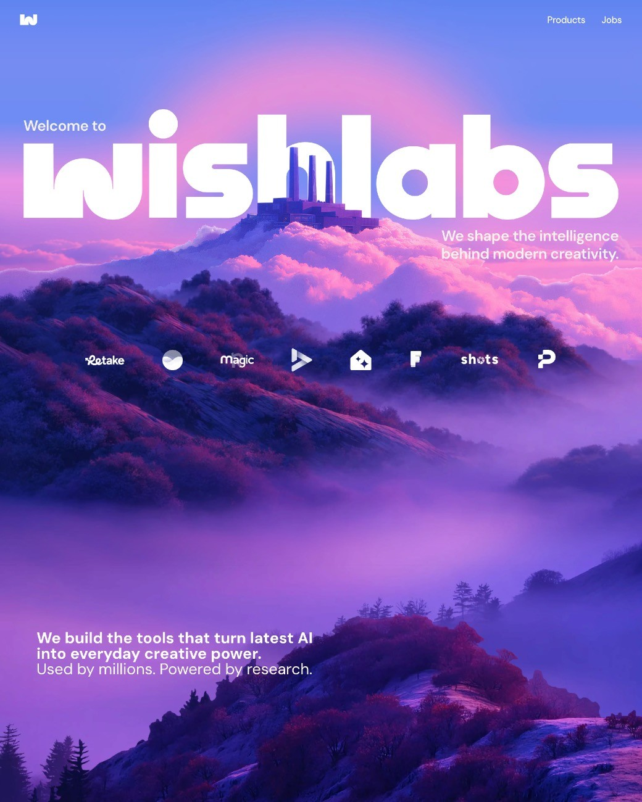
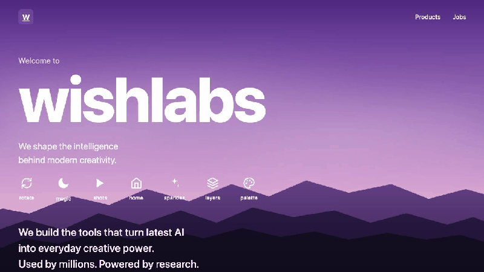
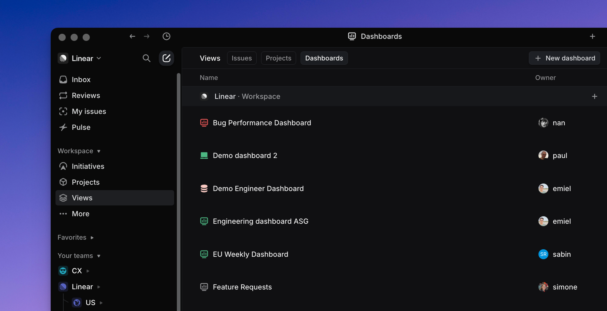
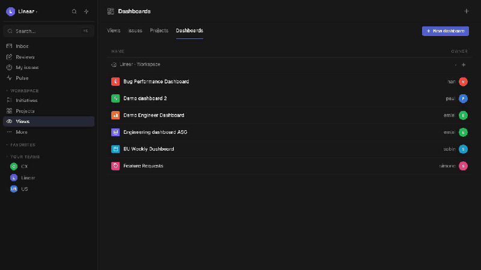
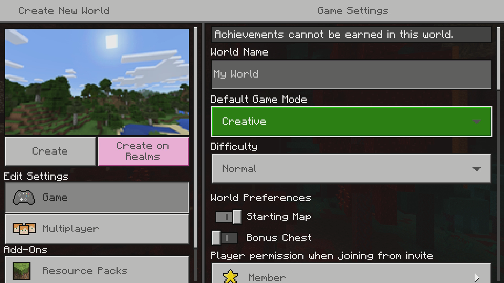
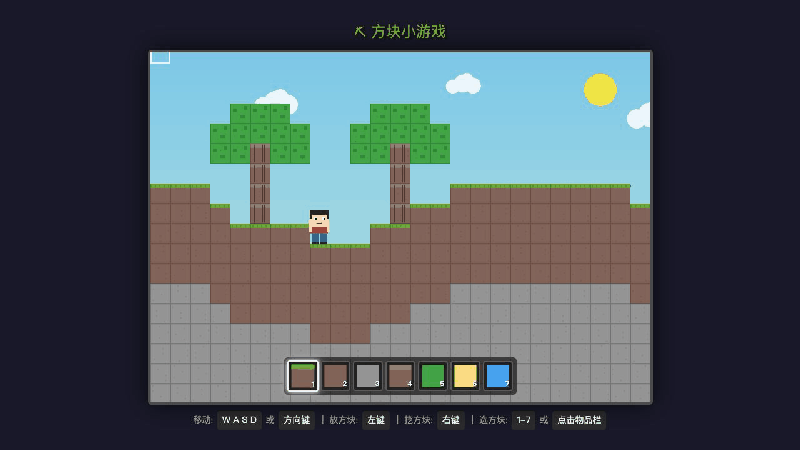
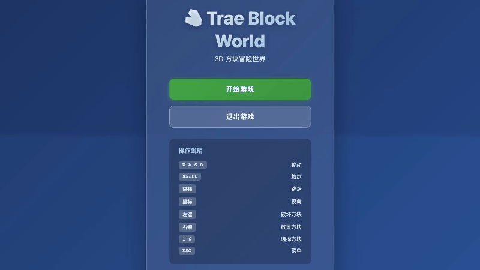

# Clonar desde una captura: primer ejercicio de imitación

En la lección anterior pedimos a la IA que escribiera un programa a partir de una frase. Ahora partiremos de algo más fácil de observar: **elige una captura que te guste y pide a la IA que construya a partir de ella**.

La imagen ya muestra colores, espacios, botones y distribución. Tú decides en qué producto interactivo debe convertirse.

## 1. Elige un objetivo pequeño

Para el primer ejercicio basta una pantalla: una portada de producto, un panel SaaS o un minijuego con una sola acción. Guarda la captura original para compararla con el resultado.

## 2. Construye el primer ejemplo

En clase usamos esta pantalla de Framer. La navegación, el título, el paisaje morado y los controles se distinguen en una sola imagen.



_Referencia: [Framer Website Builder](https://www.framer.com/solutions/website-builder/)_

Crea una carpeta vacía, ábrela en Trae y arrastra la imagen al chat. Escribe:

```text
Crea una página web parecida a esta imagen. Cuando termines, ábrela para que pueda verla.
```

Espera a que Trae cree y ejecute los archivos. Este fue el resultado real de la clase:



Todavía no hace falta leer el código. Comprueba que la página abre, que aparece el contenido principal y que la estructura recuerda a la referencia.

Si el título es pequeño, cambia una sola cosa:

```text
Haz un poco más grande el título del centro.
```

## 3. Repite con tu propia imagen

Abre otra carpeta vacía, añade tu captura y di:

```text
Crea una página web basada en esta imagen y ábrela cuando esté lista.
```

Si solo quieres conservar el estilo:

```text
Usa el estilo de la imagen, pero cambia el nombre y el contenido.
```

Cuando aparezca la primera versión, pulsa el botón principal y estrecha la ventana para comprobar el diseño.

## 4. Prueba un panel o un juego

El panel de Linear tiene navegación a la izquierda y tarjetas y gráficos a la derecha.



_Referencia: [Linear Dashboards](https://linear.app/docs/dashboards)_

```text
Crea un panel como este. Por ahora puedes usar datos de ejemplo.
```



También puedes partir de una escena de Minecraft.



_Referencia: [Ejemplo de Minecraft en Microsoft Learn](https://learn.microsoft.com/en-us/xbox/accessibility/xbox-accessibility-guidelines/108)_

```text
Crea un juego de bloques como este. El personaje debe moverse y colocar bloques.
```



Para una vista en primera persona, indica “3D” claramente:

```text
Crea un juego de bloques 3D como este. Quiero caminar, girar la vista y colocar bloques.
```



## 5. Corrige un problema cada vez

La primera versión no tiene que ser perfecta. Describe el problema más visible con palabras normales:

```text
La tarjeta de arriba es demasiado alta. Hazla más baja.
```

```text
Este botón no responde. Arréglalo.
```

Después de cada cambio, vuelve a abrir y probar la página. No mezcles cinco cambios sin relación en el mismo mensaje.

## 6. Comprueba antes de entregar

- la página abre después de actualizar;
- otra persona entiende si es una web, un panel o un juego;
- el botón o control principal funciona;
- el texto y las imágenes no se superponen al estrechar la ventana.

Al final, coloca la referencia y tu resultado juntos y explica un cambio que hayas pedido. El proceso es sencillo: elegir imagen, entregarla a la IA, pedir el primer resultado y corregir una diferencia cada vez.
