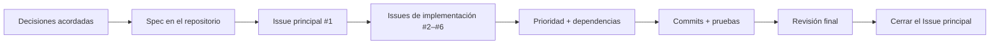

# Desarrollo integral con IA y GitHub Issues: de la conversación de requisitos a una app macOS terminada

Este tutorial recorre un ciclo completo de desarrollo guiado por especificaciones: aclarar una idea imprecisa con la IA, convertir el acuerdo en un Spec, crear GitHub Issues con prioridad y dependencias, e implementar, probar y revisar el producto.

::: info ¿En qué se diferencia del capítulo anterior?

[De Vibe Coding a Spec Coding](/es-es/stage-3/core-skills/spec-coding/) explica por qué las especificaciones se vuelven centrales en el desarrollo con IA. Este capítulo es la práctica: un repositorio público real muestra cómo un Spec se convierte en Issues, commits, pruebas y software funcional.

:::

El punto de partida fue una sola frase:

> Quiero crear un CRM para macOS que gestione contactos importados y me ayude a ordenar mis relaciones. Podemos comenzar con datos de ejemplo.

El resultado es **Relationship Compass**, una aplicación nativa de macOS que busca y filtra contactos, edita perfiles de relación, importa CSV, registra interacciones y calcula el próximo seguimiento.


El [repositorio público de ejemplo](https://github.com/sanbuphy/relationship-compass-macos) solo usa datos ficticios y conserva el Spec, los Issues, el historial de commits, el código y las pruebas.

## 1. Qué significa desarrollar guiándose por un Spec

Un ciclo habitual de programación con IA es:

```text
Describir una idea → la IA escribe código → encontrar un problema → añadir una instrucción → volver a modificar
```

Puede servir para una página pequeña. Cuando el proyecto crece, los requisitos anteriores desaparecen de la conversación, el progreso se vuelve difícil de rastrear y una función puede ejecutarse sin cumplir la intención original.

Las Skills de Matt Pocock dan a la IA un proceso repetible. Una Skill define qué aclarar, qué artefacto producir y cuándo detenerse para recibir confirmación, no solo qué código escribir.

| Implementación desde el chat | Implementación guiada por Spec |
| --- | --- |
| La conversación actual es la fuente principal | Un Spec versionado es la fuente de verdad |
| Los requisitos se añaden de forma improvisada | Primero se actualizan Spec y tareas |
| El progreso vive en resúmenes de la IA | El progreso vive en Issues y commits |
| «Funciona» se considera terminado | Se revisa cada criterio de aceptación |

### 1.1 Los tres papeles de GitHub

1. **Archivo del proyecto** para Spec, vocabulario y decisiones de arquitectura.
2. **Tablero de trabajo** para Issues, prioridades y dependencias.
3. **Registro de finalización** mediante commits, resultados de pruebas e Issues cerrados.

| Artefacto | Significado | Ejemplo |
| --- | --- | --- |
| Spec | Qué debe hacer el software terminado | `specs/relationship-compass-mvp.md` |
| Issue | Una tarea que puede completarse de forma independiente | `#2 Browse sample Contacts` |
| Dependencia | Qué tarea debe terminar antes | `#3` está bloqueado por `#2` |
| Commit | Qué cambió en un paso | `feat: browse sample contacts` |
| Tests | Evidencia de que el comportamiento sigue correcto | `swift test` |
| ADR | Por qué se tomó una decisión técnica | `docs/adr/0002-native-swiftui-macos.md` |



### 1.2 El flujo principal

```text
grill-with-docs → to-spec → to-tickets → implement → code-review
```

- `grill-with-docs` aclara alcance y límites técnicos.
- `to-spec` convierte el acuerdo en una especificación formal.
- `to-tickets` crea Issues priorizados y dependientes.
- `implement` resuelve uno por uno los Issues disponibles.
- `code-review` revisa por separado la salud del código y la cobertura del Spec.

## 2. Preparación

Necesitas una cuenta de GitHub, GitHub CLI autenticado, Node.js 18 o superior y una herramienta de programación con IA capaz de leer Skills del proyecto. Para ejecutar la app también necesitas un Mac con Xcode.

```bash
npx skills@latest add mattpocock/skills -y
gh auth status
gh repo create relationship-compass-macos \
  --public \
  --source . \
  --remote origin \
  --push
```

El ejemplo es público porque todos los contactos son ficticios. Para datos reales usa `--private` y revisa ejemplos, registros e historial de Git antes de hacer push. Las etiquetas principales son `ready-for-agent`, `priority:P0/P1/P2` y `completed-by-agent`.

## 3. Producto y límites del MVP

La primera versión incluye:

- seis contactos ficticios fijos;
- búsqueda por nombre, organización, rol, correo y círculo;
- filtros combinados por intensidad de relación y círculo;
- edición de perfil, notas y ritmo de seguimiento;
- importación CSV UTF-8 validada y sin duplicados;
- historial de interacciones y cálculo de la próxima fecha;
- persistencia JSON local y restauración al iniciar.

No incluye sincronización en la nube, puntuación de relaciones con IA, cuentas, backend ni acceso a Contactos de macOS.

## 4. Aclarar requisitos con `grill-with-docs`

<div class="workflow-chat">
  <div class="workflow-message workflow-message--user">
    <div class="workflow-message__speaker">🙋 Tú</div>
    <div class="workflow-message__command">/grill-with-docs</div>
    <p>Quiero crear un CRM para macOS que gestione contactos importados y me ayude a ordenar mis relaciones. Podemos empezar con datos de ejemplo.</p>
  </div>
  <div class="workflow-message workflow-message--agent">
    <div class="workflow-message__speaker">✨ Agente</div>
    <p>Antes de escribir código, acordaremos qué incluye y excluye la primera versión, dónde vive la información, qué tecnología usar y cómo verificar el resultado. Cuando haya que elegir, explicaré las diferencias y recomendaré una opción.</p>
  </div>
</div>

La conversación fija SwiftUI nativo para macOS 14+, JSON local, CSV UTF-8, seis muestras y ausencia de red y permiso de Contactos. `CONTEXT.md` define `Contact`, `Interaction` y `Follow-up`; dos ADR documentan el enfoque local-first y la elección de SwiftUI.

::: info GitHub en esta fase

El contexto confirmado se guarda en commits de `CONTEXT.md` y `docs/adr/*`. Todavía no se crean Issues de implementación.

:::

## 5. Escribir el Spec con `to-spec`

<div class="workflow-chat">
  <div class="workflow-message workflow-message--user">
    <div class="workflow-message__speaker">🙋 Tú</div>
    <div class="workflow-message__command">/to-spec</div>
    <p>Convierte nuestra conversación confirmada en un Spec completo, guárdalo en el repositorio y publícalo como Issue principal con la etiqueta ready-for-agent.</p>
  </div>
</div>

[`specs/relationship-compass-mvp.md`](https://github.com/sanbuphy/relationship-compass-macos/blob/main/specs/relationship-compass-mvp.md) contiene el problema, el MVP, 24 historias de usuario, decisiones técnicas, estrategia de verificación y exclusiones explícitas. [Issue #1](https://github.com/sanbuphy/relationship-compass-macos/issues/1) es el punto de entrada visible.

Un buen Spec describe comportamiento, no nombres de archivo. «Los contactos sin interacciones aparecen en Follow-ups» sigue siendo válido después de refactorizar la estructura interna.

## 6. Crear Issues ordenados con `to-tickets`

<div class="workflow-chat">
  <div class="workflow-message workflow-message--user">
    <div class="workflow-message__speaker">🙋 Tú</div>
    <div class="workflow-message__command">/to-tickets</div>
    <p>Divide el Spec en GitHub Issues. Cada ticket debe entregar una porción vertical demostrable e indicar prioridad, criterios de finalización y requisitos previos. Enséñame la lista y las dependencias antes de publicar.</p>
  </div>
</div>

| Issue | Prioridad | Resultado visible | Bloqueado por |
| --- | --- | --- | --- |
| [#2 Browse sample Contacts](https://github.com/sanbuphy/relationship-compass-macos/issues/2) | P0 | Inicio, muestras, búsqueda, detalle | Nada |
| [#3 Import and persist](https://github.com/sanbuphy/relationship-compass-macos/issues/3) | P0 | CSV sin duplicados y JSON | #2 |
| [#4 Organize Profiles](https://github.com/sanbuphy/relationship-compass-macos/issues/4) | P1 | Perfiles, intensidad, círculos | #2 |
| [#5 Interactions and Follow-ups](https://github.com/sanbuphy/relationship-compass-macos/issues/5) | P1 | Historial y seguimientos | #4 |
| [#6 Polish and verify](https://github.com/sanbuphy/relationship-compass-macos/issues/6) | P2 | Errores, documentación, paquete, verificación | #3, #5 |

No se separan horizontalmente todos los modelos, Stores, interfaces y pruebas. Cada **porción vertical** conecta lo mínimo necesario para mostrar un nuevo resultado al cerrar el Issue.

## 7. Implementar un Issue disponible cada vez

<div class="workflow-chat">
  <div class="workflow-message workflow-message--user">
    <div class="workflow-message__speaker">🙋 Tú</div>
    <div class="workflow-message__command">/implement</div>
    <p>Implementa todos los Issues ready-for-agent según prioridad y dependencias. Trabaja solo en un ticket no bloqueado, escribe primero una prueba de comportamiento que falle, ejecuta build y pruebas y crea un commit separado por ticket.</p>
  </div>
</div>

Para el ticket CSV se escribe primero una prueba que demuestra que importar el mismo archivo dos veces no duplica contactos. Después se añade otra que garantiza que una cabecera incorrecta no corrompe los datos existentes.

```bash
swift test --filter RelationshipStoreTests
swift build
swift test
```

El proyecto final supera las 13 pruebas de comportamiento público.


Al terminar, el agente comenta el commit y el resultado de pruebas, elimina `ready-for-agent`, añade `completed-by-agent` y cierra el Issue.

## 8. Dos revisiones con `code-review`

La primera revisa nombres, duplicación, vistas demasiado grandes, acoplamiento y las reglas de `AGENTS.md`. La segunda relee el Spec y todos los Issues para verificar cada comportamiento requerido.

La revisión real detectó cabeceras CSV duplicadas, deduplicación de contactos sin correo, filtros ausentes en Follow-ups, falta de restauración automática al iniciar y falta de la próxima fecha en la vista de detalle. Se añadieron pruebas antes de corregir y se repitieron ambas revisiones.

Las pruebas verdes solo demuestran el comportamiento descrito por esas pruebas; no demuestran automáticamente que cada requisito original estuviera cubierto.

## 9. La aplicación terminada

| Entrega | Resultado |
| --- | --- |
| Gestión en GitHub | Un Issue principal y cinco de implementación, todos cerrados |
| Historial | Nueve commits pequeños en orden de dependencias |
| Verificación | 13/13 pruebas y build completo correctos |
| Revisión final | Salud del código y cobertura del Spec aprobadas |
| Producto ejecutable | Se puede generar `Relationship Compass.app` |
| Privacidad | Datos locales, sin Contactos ni carga de relaciones |

### 9.1 Búsqueda y filtros combinados

Buscar `Founder` deja únicamente a Maya Chen; intensidad y círculo pueden combinarse.


### 9.2 Editar el perfil de relación

Se pueden editar organización, rol, correo, intensidad, círculos, ritmo y notas.


### 9.3 Registrar una interacción y calcular el próximo seguimiento

Una interacción del 9 de agosto de 2026 y un ritmo de 30 días producen el 8 de septiembre de 2026 como próxima fecha.


```bash
git clone https://github.com/sanbuphy/relationship-compass-macos.git
cd relationship-compass-macos
swift build
swift test
./scripts/package-app.sh
open "dist/Relationship Compass.app"
```

## 10. Flujo listo para copiar

```text
/grill-with-docs
Aclara conmigo alcance, exclusiones, datos, tecnología y verificación. No escribas código hasta que confirme el acuerdo.

/to-spec
Convierte el acuerdo en un Spec con comportamiento, criterios de aceptación y exclusiones, y crea un Issue principal en GitHub.

/to-tickets
Divide el Spec en Issues verticales con prioridad, criterios de finalización y dependencias.

/implement
Implementa cada Issue no bloqueado por prioridad usando TDD, verificación y un commit separado.
Después revisa salud del código y cobertura del Spec, corrige todos los hallazgos y repite las pruebas.
```

## 11. Cuándo conviene la ejecución continua por IA

Este flujo encaja con MVPs delimitados, sitios, apps y backends con comportamiento observable y comandos fiables de test o build. No encaja cuando los requisitos cambian cada hora, no hay forma de verificar o la tarea modifica directamente datos de producción.

La persona sigue confirmando alcance, cobertura y orden de Issues, operaciones de pago, despliegue, borrado, permisos y privacidad, además de la interfaz y el producto final. La persona conserva objetivos, límites y aceptación; la IA ejecuta de forma consistente el trabajo acordado.

## Resumen

```text
Idea imprecisa
  ↓ grill-with-docs
Alcance, vocabulario y decisiones técnicas acordadas
  ↓ to-spec
Requisitos versionados y verificables
  ↓ to-tickets
GitHub Issues priorizados y con dependencias
  ↓ implement
Prueba, implementación y commit por ticket
  ↓ code-review
Salud del código + cobertura del Spec
  ↓
Software compilable y verificable
```

Cuando termina el chat, Spec, Issues, dependencias, commits y pruebas permanecen en GitHub. La próxima sesión puede continuar desde el estado registrado en vez de volver a adivinar la intención.

## Referencias

- [Skills to Spec](https://www.aihero.dev/skills-to-spec)
- [AI Skills for Real Engineers](https://www.aihero.dev/skills)
- [Cambios de Skills v1.1](https://www.aihero.dev/skills/skills-changelog-v1-1-wayfinder-to-spec-to-tickets-grilling-improvements)
- [OpenAI: guardar flujos repetibles como Skills](https://learn.chatgpt.com/codex/use-cases/reusable-codex-skills)
- [Ejemplo público Relationship Compass](https://github.com/sanbuphy/relationship-compass-macos)
