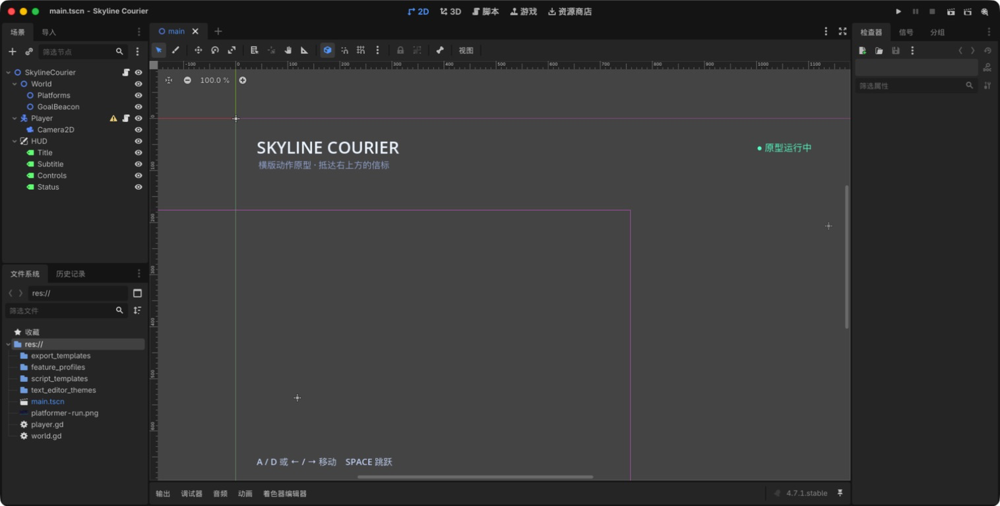
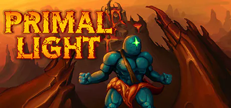
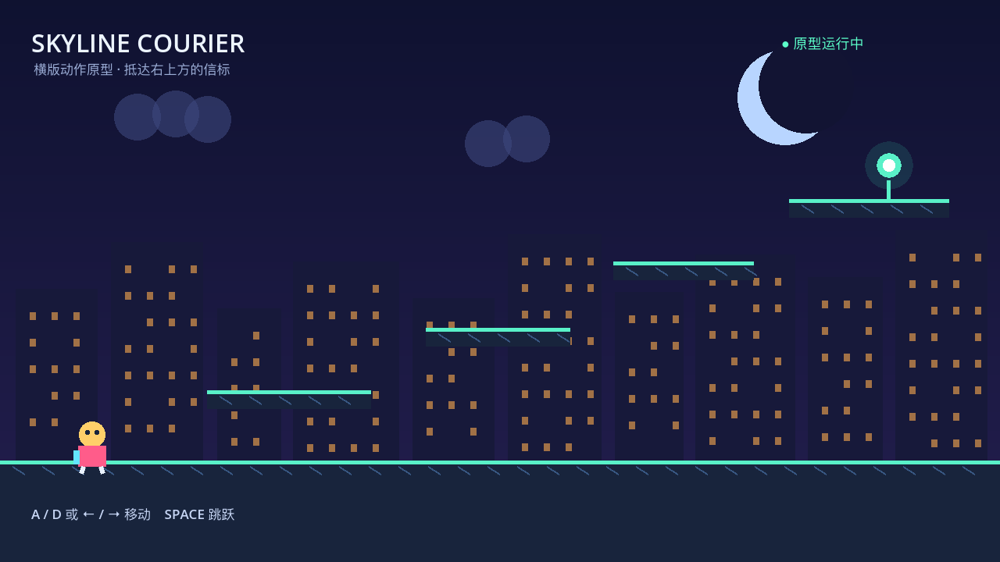
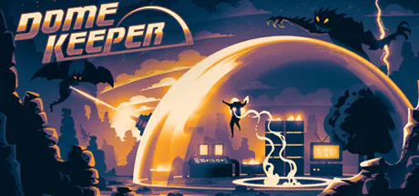
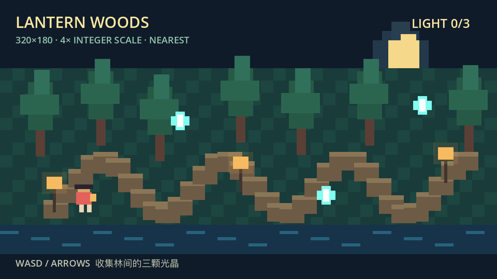
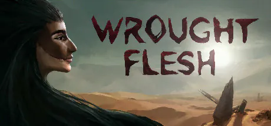
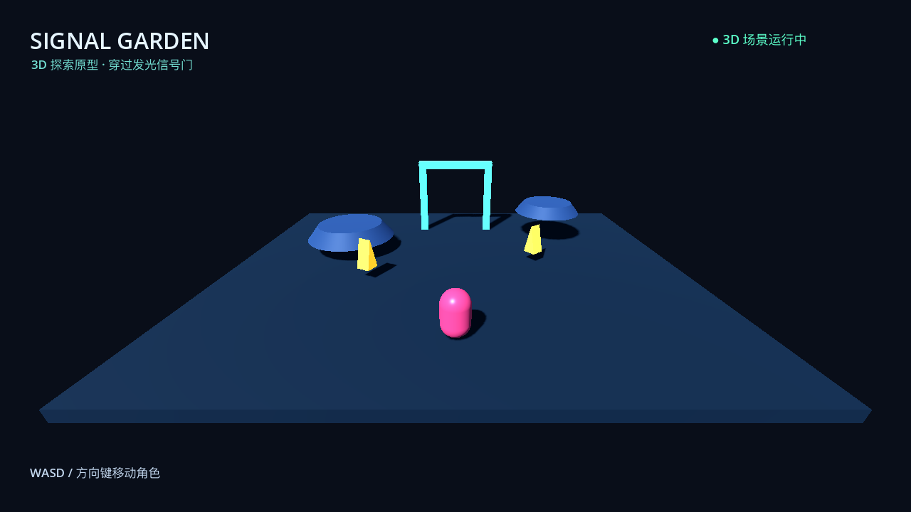

# Cómo crear juegos de plataformas, pixel art y 3D con Godot

Godot es un motor de juegos libre y de código abierto. Reúne escenas, física, animación, sonido, entrada, scripts y exportación. Aquí no fingimos terminar tres juegos: ejecutamos un plataformas 2D, una recogida pixel art y un greybox 3D.

## 1. Cuatro conceptos básicos

Un nodo tiene una función; una escena es un árbol reutilizable de nodos; un script da comportamiento; GDScript es el lenguaje principal de Godot.

## 2. Plataformas 2D

Primal Light es una referencia publicada con plataformas, peligro y objetivo fáciles de leer.

> Crea un nivel 2D con jugador, suelo, tres plataformas y una meta visible usando formas sencillas.

> Añade movimiento lateral y salto, sin un segundo salto en el aire.

## 3. Bucle de pixel art

Dome Keeper muestra bien recursos y objetivos en una pantalla pequeña.

> Crea una escena de 320 × 180 con jugador, bosque, tres objetos y contador.

Usa escalado entero para evitar píxeles borrosos.

## 4. Greybox 3D

Wrought Flesh sirve para observar silueta espacial, luz y dirección. Un greybox prueba escala y movimiento con cajas antes de los modelos finales.

> Crea un greybox 3D con suelo, paredes, jugador, cámara y salida luminosa.

## 5. Cambia una sola cosa cada vez

> Añade solo el movimiento. No cambies el nivel.

> Corrige únicamente este error: 【pega el error】 y explica cómo repetir la prueba.

## 6. Exportar es otra fase

Instala Export Templates de la misma versión y crea un preset. Prueba escritorio en un equipo sin Godot, Web mediante servidor o HTTPS, y Android/iOS con SDK, firma y dispositivo.

Los tres prototipos se ejecutaron con Godot 4.7.1 en macOS. No se declaran completas las exportaciones Windows, Linux, Web, Android, iOS o consola.
