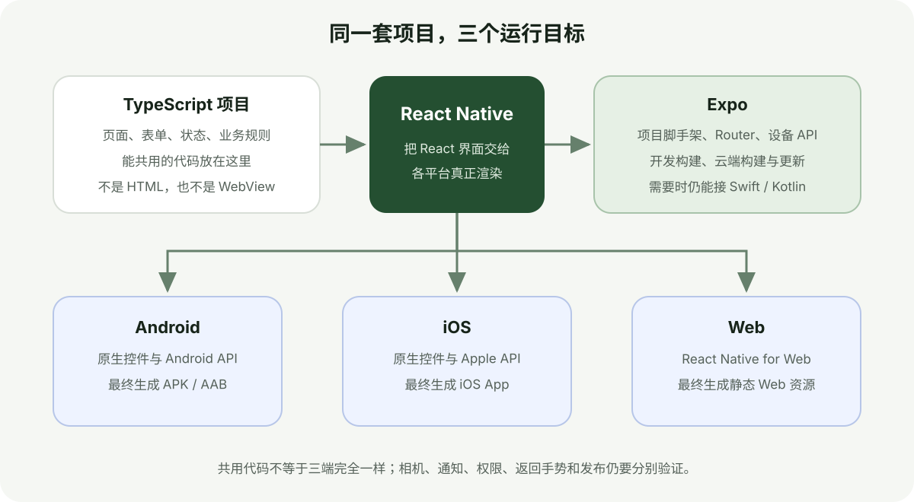
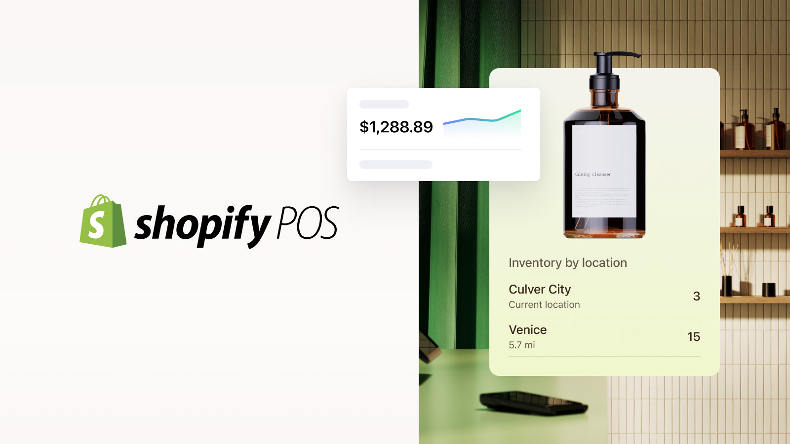
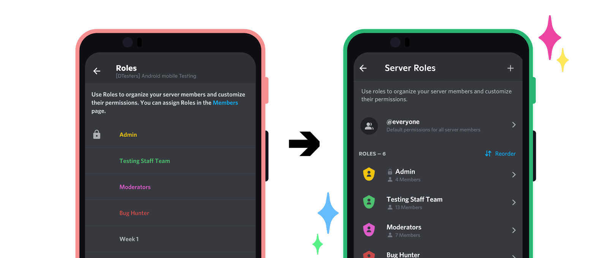
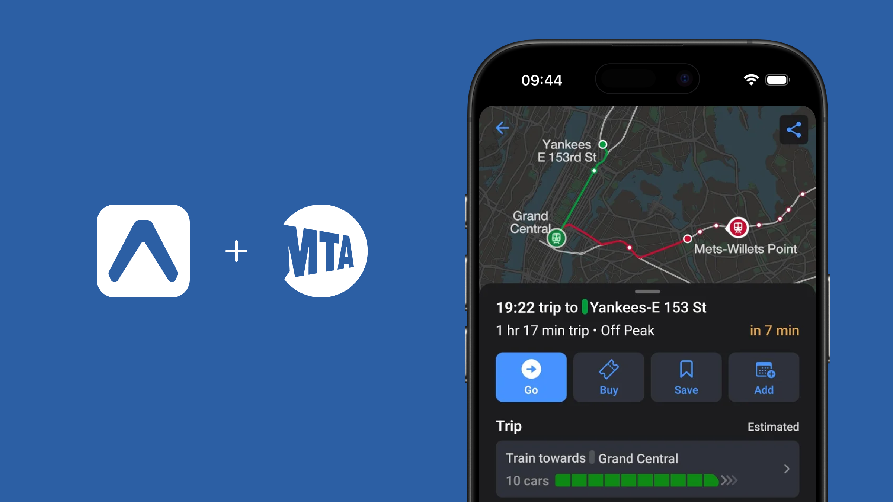
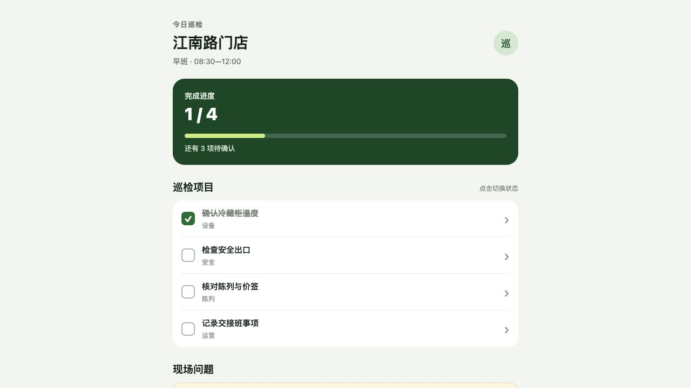
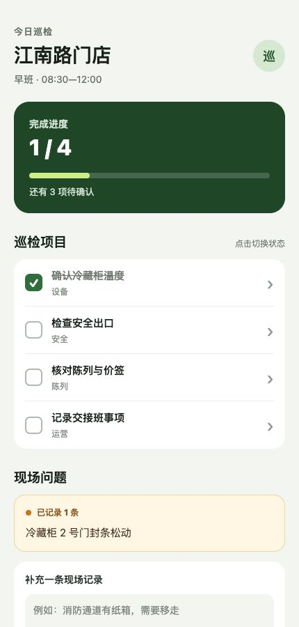
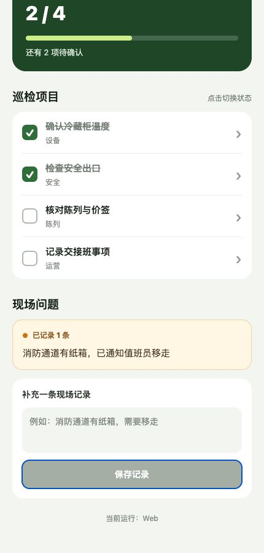

# Crear una app de inspección de tiendas con React Native y Expo

Una cadena de tiendas revisa iluminación, precios, pasillos y salidas de emergencia cada día. El personal marca los puntos en el móvil, escribe una nota y guarda el resultado. Este flujo de formularios y datos compartidos encaja bien con React Native y Expo.

## 1. Qué aporta cada herramienta

React Native crea interfaces nativas de Android e iOS con React y TypeScript. Expo añade la creación del proyecto, el servidor de desarrollo, APIs habituales del dispositivo, compilaciones y actualizaciones.



## 2. Tres productos reales

Shopify POS es una plataforma de venta e inventario para tiendas físicas; Discord comparte producto entre Android e iOS; MTA TrainTime muestra que Expo también se usa en una aplicación oficial de transporte.







## 3. Crea el proyecto y la lista

```bash
npx create-expo-app@latest store-inspection
cd store-inspection
npm run web
```

> Convierte el ejemplo en una pantalla de inspección. Muestra la tienda, el progreso de hoy y un botón para empezar.

> Añade iluminación, etiquetas de precio, pasillos y salidas. Al tocar un punto, cambia su estado y actualiza el progreso.





## 4. Guarda un registro

> Añade una nota y Guardar. Después muestra la hora, la cantidad completada y la nota en una tarjeta.



> Guarda el progreso y los registros en el dispositivo y recupéralos al abrir. Todavía no conectes un servidor.

`AsyncStorage` sirve para pocos valores; `expo-sqlite` es mejor cuando aparecen relaciones entre inspecciones, detalles y trabajos pendientes.

## 5. Añade foto y backend después

> Permite adjuntar una foto a un punto incompleto, con vista previa y eliminación.

> Conecta el inicio de sesión existente y muestra solo las tiendas que asigne el servidor.

Guarda el token móvil en `SecureStore`. Nunca pongas un secreto de empresa en la app o en variables `EXPO_PUBLIC_`. Añade sincronización sin conexión solo cuando el guardado local y la API funcionen bien.

## 6. Termina en dispositivos reales

Expo Go es útil al principio; las funciones nativas propias requieren un development build. Antes de publicar, prueba teclado, permisos, fotos, reinicio, mala red, reintentos, cierre de sesión y actualización en Android e iPhone.

El prototipo se verificó con Expo SDK 57, TypeScript y una exportación Web real. No había emulador Android ni runtime de iOS Simulator, por lo que no se afirma que la compilación móvil y la firma estén terminadas.
