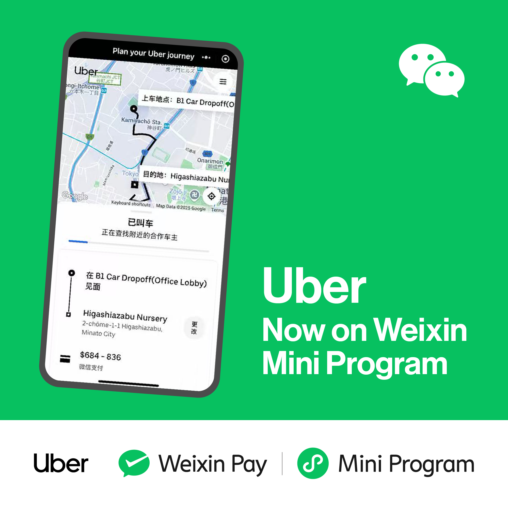
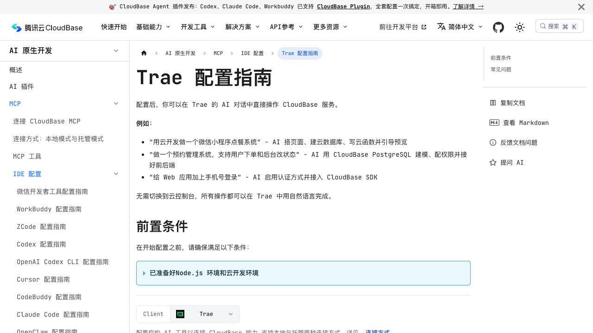
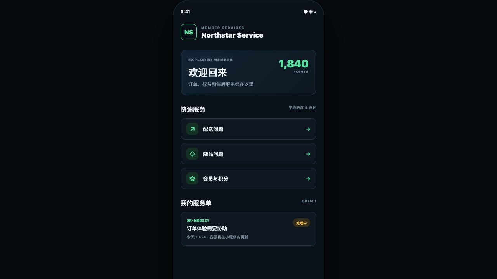
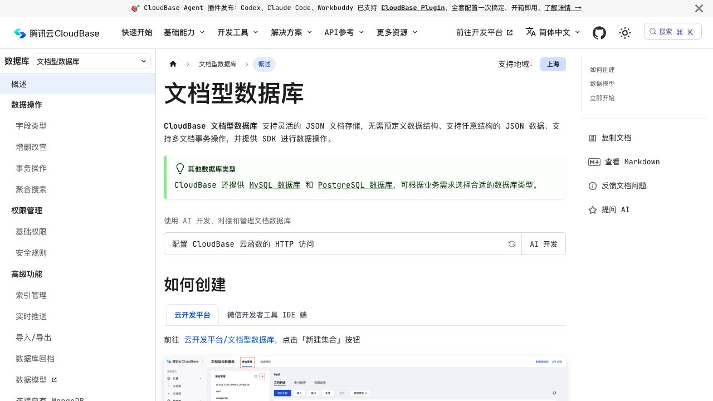
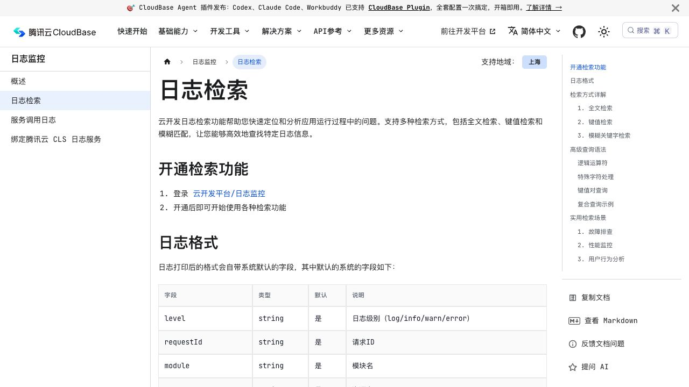

# Cómo crear un Mini Programa WeChat con backend

El capítulo anterior creó la interfaz que corre en el teléfono. Ahora añadimos identidad, datos compartidos, permisos, archivos y logs para un servicio de empresa.

## 1. El frontend es la entrada; el backend decide

El frontend contiene páginas y formularios. El backend identifica al usuario, comprueba permisos y escribe en la base. No debe confiar en un ID o rol enviado por la página.

La ruta más corta es WeChat Cloud Development, funciones cloud, base documental y almacenamiento. Si la empresa ya tiene una API HTTPS, puede usarla; un Mini Programa con backend no obliga a comprar CloudBase.

## 2. Prepara el entorno

Comprueba precios y cuota actuales, crea el entorno y guarda su ID en un único lugar.

> Añade inicio de miembro, Crear ticket y Mis tickets al proyecto. Usa datos de ejemplo primero.

## 3. Primera función e identidad fiable

> Añade una función cloud que devuelva la hora del servidor y un botón que la llame. Indica dónde desplegarla.

> Obtén el usuario actual del contexto fiable de WeChat. No confíes en el ID ni el rol enviados por la página.

## 4. Guarda un ticket

> Valida los campos en el servidor, guarda al usuario fiable como propietario y devuelve un número de ticket.

El número de la página debe coincidir con un registro de la base.

Las escrituras desde función cloud o API administrativa no crean `_openid` automáticamente. La función debe guardar la propiedad desde el contexto fiable.

## 5. Evita duplicados y accesos indebidos

> Si se repite el mismo `clientRequestId`, devuelve el ticket original y no crees otro.

> Mis tickets solo devuelve registros del usuario fiable actual, aunque la página cambie un ID.

Comprueba con dos cuentas WeChat. Ocultar un botón no es control de permisos.

## 6. Fotos, logs y publicación

> Permite tres fotos por ticket, limita tipo y tamaño, muestra progreso y reintento.

Antes de publicar revisa entorno de producción, funciones, colecciones, índices, reglas, logs y alertas. El flujo termina cuando A crea un ticket y lo ve en otro dispositivo, la base tiene un registro y B no puede leerlo.
