# Niveau 1 : À l'ère de l'IA, savoir parler, c'est savoir programmer

Ceci est un tutoriel basé sur l'<strong>apprentissage par projet</strong>. Nous vous encourageons à suivre les étapes une par une et à essayer de reproduire les résultats.
Ne craignez pas de faire des erreurs ou de modifier le contenu, nous croyons toujours que vous pouvez y arriver. N'oubliez jamais :

<div style="text-align: center;">
<div style="display: inline-block; padding: 8px 20px; border-radius: 8px; border: 1px dashed #FFB6C1; background: linear-gradient(135deg, #FFF0F5 0%, #FFE4EC 100%); margin: 12px 0;">
  <span style="font-size: 15px; font-weight: 500; color: #666;">Terminer vaut mieux que parfait 🐣</span>
</div>
</div>

<script setup>
import StageAssignmentCard from '@theme/components/StageAssignmentCard.vue'
import { relatedArticlesMap } from '@theme/data/relatedArticles'

const duration = 'Environ <strong>4 heures</strong>, réalisables en plusieurs sessions'
const relatedArticles =
  relatedArticlesMap['fr-fr/stage-1/ai-capabilities-through-games'] ?? []
</script>

## Introduction du chapitre

<ChapterIntroduction :duration="duration" :tags="['Programmation conversationnelle par IA', 'Mini-jeu IA-native', 'Projet pratique : Snake']" coreOutput="Snake IA-native + mini-jeu original" expectedOutput="1 Snake IA-native fonctionnel + (optionnel) 1 mini-jeu ou démo IA-native de votre création">

Si vous <strong>ne savez absolument pas programmer</strong>, ou que vous ne connaissez que les bases, ce chapitre est fait pour vous. Nous commencerons par les fondamentaux : utiliser la <strong>conversation</strong> pour demander à l'IA d'écrire du code, sans avoir besoin de mémoriser la syntaxe, de configurer un environnement, et en faisant tourner le tout directement dans le navigateur.

Vous créerez de vos propres mains <strong>votre premier programme fonctionnel</strong> — un jeu de Snake qui « mange des mots, écrit des poèmes et dessine ». À travers ce projet pratique, vous découvrirez ce que signifie vraiment la programmation par IA : ce n'est pas l'IA qui pense à votre place, c'est vous qui exprimez vos idées et l'IA qui les réalise.

Toute création commence par un passage de 0 à 1, et nous sommes ravis de transmettre confiance et expertise à chaque étape. Pour vous, <strong>l'exécution is all you need</strong>.

</ChapterIntroduction>

<div style="margin: 50px 0;">
  <ClientOnly>
    <StepBar :active="0" :items="[
      { title: 'Défis et opportunités', description: 'Les nouvelles possibilités pour tous' },
      { title: 'Premier contact', description: 'Développement express en 60 secondes' },
      { title: 'Projet pratique', description: 'Créer un Snake IA-native' },
      { title: 'Explorer et créer', description: 'Réinventer le jeu' }
    ]" />
  </ClientOnly>
</div>

## 1. Le défi et l'opportunité pour les non-programmeurs

Beaucoup de gens ont la tête pleine d'idées de produits : un petit outil pour gérer ses comptes, une page web pour suivre la croissance de leur enfant, voire un mini-jeu. Mais dès qu'ils pensent au code à écrire, au développeur à trouver, ils abandonnent tout de suite.

Depuis l'apparition de l'IA, une toute nouvelle possibilité s'est offerte pour la première fois aux non-techniciens : vous n'avez pas besoin de savoir coder, il vous suffit de savoir exprimer clairement à l'IA ce que vous voulez. Les [données de GitHub Copilot](https://www.wearetenet.com/blog/github-copilot-usage-data-statistics) montrent que plus de 15 millions de développeurs utilisent déjà l'IA pour les aider à coder, et qu'en moyenne 46 % du code est généré par l'IA ! Sur les projets Java, cette proportion atteint 61 %.

<el-card shadow="hover" style="margin: 20px 0; border-radius: 12px;">
  <template #header>
    <div style="display: flex; align-items: center; gap: 8px;">
      <span style="font-size: 20px;">🚀</span>
      <span style="font-weight: bold; font-size: 16px;">Bond en efficacité et taux d'adoption</span>
    </div>
  </template>
  
  <el-row :gutter="20" style="margin-bottom: 24px;">
    <el-col :span="6" :xs="12">
      <div style="text-align: center; padding: 10px;">
        <div style="color: #409EFF; font-size: 24px; font-weight: bold;">55 %</div>
        <div style="color: #909399; font-size: 12px; margin-top: 4px;">Gain de vitesse</div>
      </div>
    </el-col>
    <el-col :span="6" :xs="12">
      <div style="text-align: center; padding: 10px;">
        <div style="color: #67C23A; font-size: 24px; font-weight: bold;">2,4 <span style="font-size: 14px;">jours</span></div>
        <div style="color: #909399; font-size: 12px; margin-top: 4px;">Durée des tâches (contre 9,6 jours)</div>
      </div>
    </el-col>
    <el-col :span="6" :xs="12">
      <div style="text-align: center; padding: 10px;">
        <div style="color: #E6A23C; font-size: 24px; font-weight: bold;">81 %</div>
        <div style="color: #909399; font-size: 12px; margin-top: 4px;">Taux d'installation dès le premier jour</div>
      </div>
    </el-col>
    <el-col :span="6" :xs="12">
      <div style="text-align: center; padding: 10px;">
        <div style="color: #F56C6C; font-size: 24px; font-weight: bold;">96 %</div>
        <div style="color: #909399; font-size: 12px; margin-top: 4px;">Taux d'adoption des suggestions</div>
      </div>
    </el-col>
  </el-row>

  <div style="line-height: 1.8; color: #606266;">
    Ce qui est vraiment excitant, c'est le bond en efficacité : la vitesse à laquelle les développeurs accomplissent leurs tâches a augmenté de <b>55 %</b>. Ce qui prenait 9,6 jours à livrer ne nécessite plus que <b>2,4 jours</b>. Cette amélioration visible montre que l'IA n'est plus un « outil optionnel », mais un assistant de programmation devenu indispensable dans le flux de développement. Les chiffres d'adoption le confirment : le jour même où ils ont obtenu l'accès, <b>81 %</b> des développeurs l'ont installé et commencé à l'utiliser immédiatement ; parmi eux, <b>96 %</b> ont adopté les suggestions de code dès le premier jour. En d'autres termes, les développeurs ont quasi instantanément intégré l'IA dans leur travail quotidien.
  </div>
</el-card>

Pour les non-programmeurs, cette tendance est encore plus significative : si les développeurs professionnels s'appuient massivement sur l'IA pour coder, <strong>pourquoi ne pas simplement discuter avec l'IA pour concrétiser nos propres idées ?</strong>

L'objectif de ce cours est de vous former à une nouvelle compétence : créer des applications grâce au dialogue en langage naturel. Nous vous apprendrons à communiquer avec l'IA dans le langage des ordinateurs, et comment la laisser transformer vos idées en produits réels et utilisables.

<div style="margin: 50px 0;">
  <ClientOnly>
    <StepBar :active="1" :items="[
      { title: 'Défis et opportunités', description: 'Les nouvelles possibilités pour tous' },
      { title: 'Premier contact', description: 'Développement express en 60 secondes' },
      { title: 'Projet pratique', description: 'Créer un Snake IA-native' },
      { title: 'Explorer et créer', description: 'Réinventer le jeu' }
    ]" />
  </ClientOnly>
</div>

## 2. Jusqu'où l'IA peut-elle vous aider ?

Dans cette section, nous n'aborderons qu'une seule question : si vous ne savez pas coder du tout, jusqu'où l'IA actuelle peut-elle vous aider ?

Globalement, vous pouvez comprendre les capacités des modèles actuels comme suit : ils sont capables de développer des <strong>outils internes simples</strong>, des <strong>tableaux de bord de data visualisation</strong>, ainsi que quelques <strong>mini-jeux légers</strong>. Ces capacités suffisent pour créer des <strong>outils personnels</strong> et <strong>valider des besoins du point de vue produit</strong>. Mais si vous espérez générer en un clic un <strong>produit commercial mature</strong>, il faudra généralement encore un travail humain pour <strong>la conception du flux</strong>, <strong>le polissage des détails</strong>.

Voyons concrètement, avec l'exemple du jeu de Snake, ce que la programmation par IA peut accomplir aujourd'hui.

### 2.1 Créer un Snake en 60 secondes

Commencez par ouvrir la page expérimentale utilisée dans ce cours : [z.ai](https://chat.z.ai/). `z.ai` est une plateforme IA développée par Zhipu AI (l'une des principales entreprises chinoises de grands modèles de langage), dont les capacités sont fournies par la série de modèles GLM développée en interne. La plateforme intègre plusieurs fonctionnalités IA, notamment la génération de diapositives, la conception d'affiches et le développement full-stack. Dans ce tutoriel, nous nous concentrerons sur l'utilisation du module de développement full-stack.

::: details 💡 Qu'est-ce que le nouveau mode « coder dans le navigateur » ?

Autrefois, développer une application web nécessitait :
- Installer un environnement de programmation (Python, Node.js, etc.)
- Configurer un éditeur de code
- Apprendre HTML/CSS/JavaScript
- Gérer les dépendances et les erreurs

Maintenant, grâce aux plateformes de programmation par IA, il vous suffit de :
- Ouvrir votre navigateur et accéder à la page
- Décrire ce que vous voulez en langage naturel
- L'IA génère le code et affiche un aperçu en temps réel

Ce mode « dialoguer pour coder » transforme la programmation : au lieu « d'écrire du code », vous « décrivez vos besoins ». Vous n'avez pas besoin de comprendre les détails techniques, il vous suffit d'expliquer clairement à l'IA ce que vous souhaitez, et elle transforme vos idées en un programme fonctionnel. C'est le nouveau paradigme de la programmation à l'ère de l'IA — le <strong>Vibe Coding</strong>.
:::


Après avoir saisi vos besoins et cliqué sur le bouton **Développement full-stack**, vous pouvez observer en temps réel le processus complet de création de la page. En général, le temps de préparer un café suffit pour que la page soit générée automatiquement !

```
Crée-moi un jeu de Snake :
1. Contrôler le serpent avec les flèches directionnelles
2. Le serpent grandit et le score augmente quand il mange la nourriture
3. Le jeu se termine si le serpent heurte un mur ou son propre corps
4. Il faut des boutons Démarrer et Recommencer
5. L'interface doit être simple et élégante
```


Une fois la génération terminée, vous verrez apparaître à droite une interface navigable. Vous pouvez faire défiler la page ou cliquer sur le bouton 🧭 en haut à droite pour passer en mode plein écran.

> Les boutons de gauche à droite ont les fonctions suivantes : le bouton flèche ouvre la barre latérale de l'historique des conversations, le bouton crayon crée une nouvelle conversation, le bouton flèche circulaire rafraîchit la page, le bouton boussole bascule en mode plein écran, le bouton Download télécharge le projet, le bouton <> bascule vers la vue code, et le bouton Publish publie le projet.

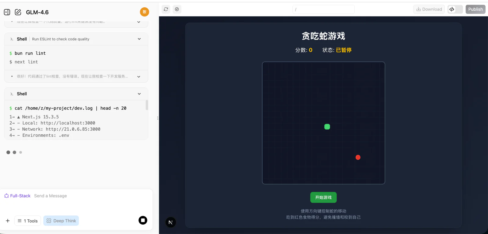

Si vous souhaitez consulter le code source de la page, cliquez sur l'icône de code en haut à droite pour voir le code complet.


::: tip 🌐 Explorer d'autres outils de programmation par IA

Outre z.ai, nous vous recommandons également d'essayer les plateformes suivantes :

| Outil | Adresse | Caractéristiques |
|------|---------|-----------------|
| **Kimi Code** | [kimi.com/code/console](https://kimi.com/code/console) | Assistant de programmation IA de Moonshot AI, avec le CLI Kimi Code pour le terminal et l'extension VS Code, basé sur le modèle dédié au code Kimi K2.7 Code, et compatible avec Claude Code, Roo Code, etc. |
| **Google AI Studio** (recommandé) | [aistudio.google.com/apps](https://aistudio.google.com/apps) | Proposé par Google, avec le modèle Gemini, idéal pour le prototypage rapide |
| **Figma Make** | [figma.com/make](https://www.figma.com/make) | Intégré à l'outil de design, adapté aux designers pour des prototypes interactifs |
| **Coze** | [coze.com](https://www.coze.cn) | Plateforme de création de bots IA par ByteDance, développement sans code, intégration avec Doubao, Kimi et d'autres modèles chinois |
| **v0.dev** | [v0.dev](https://v0.dev) | Outil de génération d'UI par Vercel, génère des composants React fonctionnels à partir d'une description |
| **Bolt.new** | [bolt.new](https://bolt.new) | Plateforme de développement full-stack par StackBlitz, génère et déploie des applications web complètes |
| **Lovable** | [lovable.dev](https://lovable.dev) | Spécialisé dans les applications React de haute qualité, avec intégration GitHub et déploiement en un clic |
| **Replit Agent** | [replit.com](https://replit.com) | IDE en ligne avec assistant de programmation IA, supporte plusieurs langages et collaboration en temps réel |

Pour en savoir plus sur la comparaison détaillée des outils de programmation en ligne, consultez notre lecture complémentaire : [Comparaison de 7 plateformes Vibe Coding](../../stage-1/appendix-articles/example0-1/vibe-coding-tools-snake-game-tutorial.md)
:::

### 2.2 Ce que la programmation conversationnelle peut et ne peut pas faire

Cette section se concentre sur une question précise : lorsque vous dépendez uniquement d'une IA conversationnelle, sans écrire aucune ligne de code, jusqu'où pouvez-vous réellement aller ?

En pratique, une conclusion relativement stable est la suivante : elle peut vous aider à réaliser quelque chose de « petit mais complet », mais la notion de « suffisant » reste à votre appréciation à chaque étape.

#### Plus performant pour les applications « petites et claires »

À partir de l'exemple du Snake ci-dessus, vous avez déjà observé un schéma typique : tant que vous pouvez décrire clairement l'interface et les interactions, l'IA peut généralement, en quelques tours de conversation, assembler une page web complète, navigable et jouable.

Ce type de tâche présente souvent plusieurs caractéristiques communes :

- Périmètre clair : une page web, un outil interne simple, un petit jeu
- Résultat visible : vous pouvez immédiatement vérifier dans le navigateur si cela fonctionne comme prévu
- Correction directe : en cas de problème, vous pouvez le signaler dans la conversation suivante et demander une correction (en copiant l'erreur ou en envoyant une capture d'écran à l'IA)

Dans ces limites, vous pouvez considérer l'IA conversationnelle comme un « développeur assistant » efficace. Il vous suffit d'affiner et de corriger les besoins à chaque tour en langage naturel pour obtenir rapidement un prototype utilisable.

**Taux de réussite de l'IA pour les petits projets :**
<el-progress :percentage="90" :stroke-width="15" status="success" striped striped-flow />

#### Les grands projets nécessitent une « vision de flux »

Dès que vous dépassez le cadre des applications petites et claires, espérer qu'une IA termine un système complexe de bout en bout en quelques conversations atteint vite ses limites. Les grands projets impliquent souvent un backend, une base de données, l'intégration de services tiers, ainsi que des questions de permissions, de sécurité, de concurrence et de nombreuses règles métier, avec pour objectif de livrer un système complet intégré aux opérations existantes, et non une simple page web.

Dans ce cas, l'approche la plus raisonnable n'est pas de tout jeter à l'IA d'un coup, mais de commencer par cartographier clairement le flux global : quelles sont les étapes clés, quelles sont les entrées/sorties et les changements d'état à chaque étape, quels nœuds sont les plus sensibles en termes de performance et de sécurité. Ensuite, sur la base de ce diagramme de flux, séparer les étapes relativement indépendantes et les confier à l'IA conversationnelle pour générer des interfaces, des modules, des scripts et des tests.

Avec les capacités actuelles, l'IA est plus performante pour accélérer une série de petites étapes, tandis que vous (ou votre équipe) décidez comment les découper, les enchaîner, et vous chargez de l'architecture, de l'intégration système et de la maintenance.

#### La différence entre « écrire » et « utiliser »

À première vue, l'IA semble capable de tout faire, mais dans la pratique, jusqu'où ces résultats sont-ils réellement utilisables ?

Une référence utile est la suivante :

::: warning ⚠️ Guide des scénarios d'utilisation

- **Prototype / Démo / Outil interne** : très adapté pour confier à l'IA la première version, puis itérer les détails vous-même.
- **Produit grand public** : nécessite généralement un investissement continu de la part d'ingénieurs sur l'architecture, l'abstraction, les performances et la maintenance.
- **Systèmes critiques / fortement réglementés (paiement, contrôle des risques, santé, etc.)** : à ce stade, il ne faut pas « déployer directement après génération » ; un processus strict de revue et de test est indispensable.
  :::

À l'heure actuelle, vous pouvez relativement sereinement considérer l'IA comme un partenaire efficace pour les démos et les outils internes : tant que vous êtes prêt à tester, itérer et poser des questions supplémentaires (« c'est faux ici, corrige et explique pourquoi »), la qualité globale au niveau prototype et outil interne est généralement suffisante et pertinente.

<div style="margin: 50px 0;">
  <ClientOnly>
    <StepBar :active="2" :items="[
      { title: 'Défis et opportunités', description: 'Les nouvelles possibilités pour tous' },
      { title: 'Premier contact', description: 'Développement express en 60 secondes' },
      { title: 'Projet pratique', description: 'Créer un Snake IA-native' },
      { title: 'Explorer et créer', description: 'Réinventer le jeu' }
    ]" />
  </ClientOnly>
</div>

## 3. Pratique : votre première application IA-native

Revenons à la pratique. Dans la partie précédente, nous avons rapidement créé un prototype jouable de Snake avec l'IA, et nous avons compris ce que l'IA peut et ne peut pas faire. Nous allons maintenant apprendre à utiliser les techniques de base du <strong>vibe coding</strong> pour créer un jeu de Snake <strong>moderne</strong> version IA-native. Nous allons faire en sorte que le serpent mange des caractères textuels au lieu de haricots. Enfin, le jeu générera un poème d'après les mots mangés, puis dessinera une image.
À travers ce cas concret, vous comprendrez le concept fondamental de ce nouveau mode de programmation : comment exprimer clairement vos besoins en langage naturel.

### 3.1 Snake IA-native

Au début, nous pouvons dialoguer avec le modèle de la manière la plus simple possible, ce qui nous aidera à obtenir rapidement un prototype de produit. Nous pouvons saisir directement dans la boîte de dialogue :

> **💡 Exemple de prompt :** Crée-moi un jeu de Snake
>
> 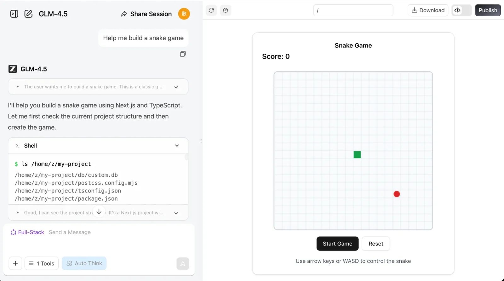

> **💡 Exemple de prompt :** Crée-moi un jeu de Snake qui supporte :
>
> 1. Je peux manger différents mots, ils seront collectés dans une boîte
>    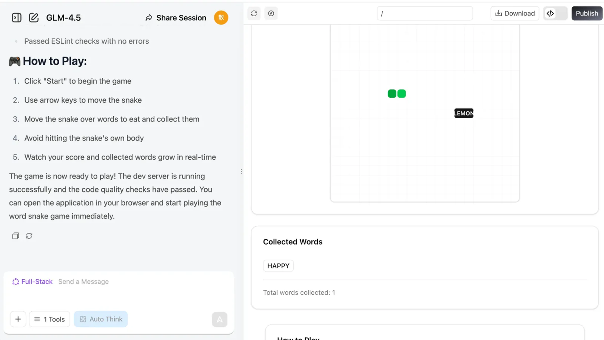

> **💡 Exemple de prompt :** Crée-moi un jeu de Snake qui supporte :
>
> 1. Je peux manger différents mots, ils seront collectés dans une boîte
> 2. Quand le serpent a mangé 8 mots, le LLM doit créer un poème à partir de ces mots, et nous pouvons le remixer selon nos besoins.
> 3. Une fois le poème terminé, l'étape suivante créera automatiquement une image basée sur ce poème.
>
> 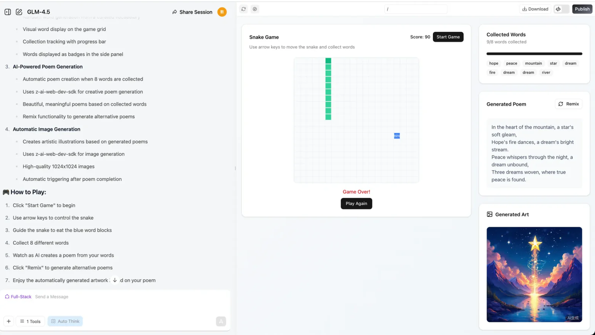

Notez que pendant le développement, vous pouvez rencontrer des problèmes : boutons sans réaction, erreurs lors de l'utilisation de fonctionnalités, comportement inattendu, ou interface qui ne correspond pas au design attendu.

Dans ce cas, vous devez poser des questions supplémentaires au modèle pour l'aider à résoudre ces problèmes imprévus.

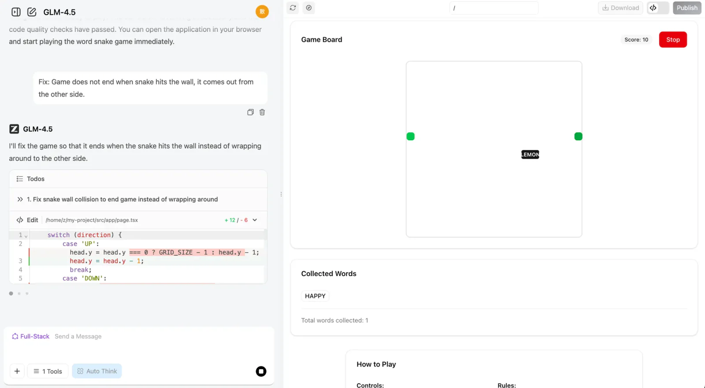

### 3.2 Ajouter de nouvelles fonctionnalités au jeu

Une fois les fonctionnalités de base terminées, vous pouvez essayer d'ajouter des nouveautés à votre programme ! Si vous trouvez que le fait que le serpent mange des mots ou des caractères est un peu ennuyeux, vous pouvez faire manger des mots de différentes couleurs au serpent et changer sa couleur en conséquence.

Vous pouvez également ajouter des effets spéciaux au processus de « mangeage », ou introduire des « mots magiques » qui déclenchent des effets — par exemple en augmentant la vitesse ou la taille du serpent. Une autre idée est de faire générer un poème et une image par le modèle à chaque fois que le serpent mange un mot, plutôt que d'attendre qu'il en mange huit.

Si cela vous semble trop difficile, vous pouvez demander directement au modèle de langage de l'aide ! Il peut fournir des suggestions créatives pour rendre votre jeu plus amusant. Essayez !

```
1. Mécanisme « Les mots débloquent des mondes »
   Fonction : après que le serpent a mangé un mot, le modèle d'image génère instantanément une petite œuvre d'art pour ce mot ; ces œuvres s'assemblent peu à peu en un panorama unique créé par le joueur — on « peint » tout en jouant.

2. Jouabilité « Puzzle poétique »
   Fonction : chaque mot mangé par le serpent déclenche la génération d'un vers par le LLM et d'une illustration par le modèle d'image ; à la fin de la manche, le tout se combine en un poème et un tableau créés en collaboration avec l'IA.

3. « Mots magiques » et embranchements narratifs
   Fonction : en mangeant des mots magiques comme « vent », « nuit » ou « rêve », le LLM change le thème de la scène et bascule le style de l'image vers une ambiance nocturne, orageuse ou onirique ; les différents mots mangés par le joueur font aussi évoluer en continu l'histoire générée par l'IA.

4. « Génération interactive en temps réel »
   Fonction : à chaque mot mangé, le LLM génère une phrase de dialogue ou une description, faisant « parler » les PNJ du jeu et modifiant l'environnement ; l'apparence du serpent ou les obstacles changent également selon les mots mangés.

5. Défi « Snake par phrase »
   Fonction : mode inversé — le LLM donne un vers ou une énigme, et le joueur guide le serpent pour manger les mots dans l'ordre afin de reconstituer la phrase ; manger un mauvais mot déclenche des conséquences artistiques amusantes générées par le modèle d'image.

6. « Niveaux thématiques » et sélection de style
   Fonction : au début de la partie, choisissez un thème comme « conte de fées », « science-fiction » ou « poésie Tang » ; le LLM et le modèle d'image adaptent les mots, le style poétique et le style visuel pour que chaque partie soit totalement renouvelée.

7. « Co-création en direct »
   Fonction : en mangeant un mot spécial, le LLM invite le joueur à saisir une phrase ou à choisir un style, puis génère les vers et illustrations correspondants — une véritable co-création homme-machine.

8. « L'histoire qui grandit »
   Fonction : au fur et à mesure que le serpent grandit, le LLM poursuit en continu le poème narratif et le modèle d'image génère un long panorama en rouleau, pour que le joueur vive en même temps « l'écriture, le dessin et le jeu ».

```

De plus, nous pouvons demander au LLM de générer directement un prompt de niveau projet. Dans la section précédente, nous n'avons écrit nous-mêmes que le prompt du Snake. Maintenant, essayons de demander au modèle de générer un prompt avec un cadre d'ensemble et un chemin de réalisation (vous pouvez utiliser z.ai directement).

Si vous souhaitez apprendre à écrire de meilleurs prompts, consultez [l'annexe sur le Prompt Engineering](/zh-cn/appendix/8-artificial-intelligence/prompt-engineering).

> Je veux que l'IA génère un jeu de Snake en page web, avec un prompt plus complet pour un résultat plus impressionnant et amusant. Génère le prompt correspondant. L'objectif actuel : créer un jeu de Snake avec la fonctionnalité de génération de poèmes à partir de mots mangés, incluant un module de génération d'images.

La réponse de z.ai ressemblera à ceci :

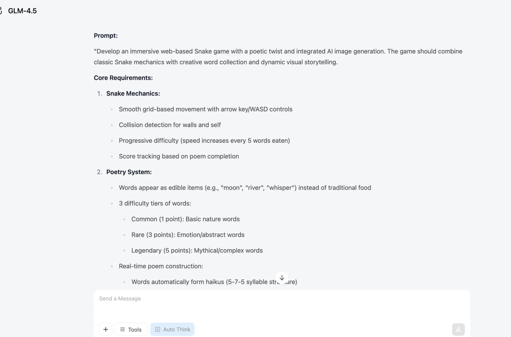

Nous pouvons utiliser ce prompt en mode développement full-stack pour régénérer le projet :

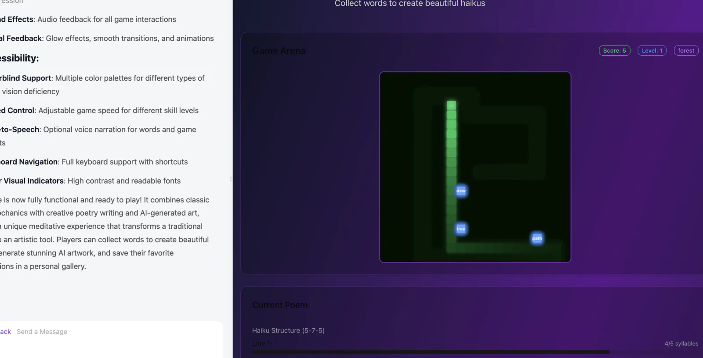

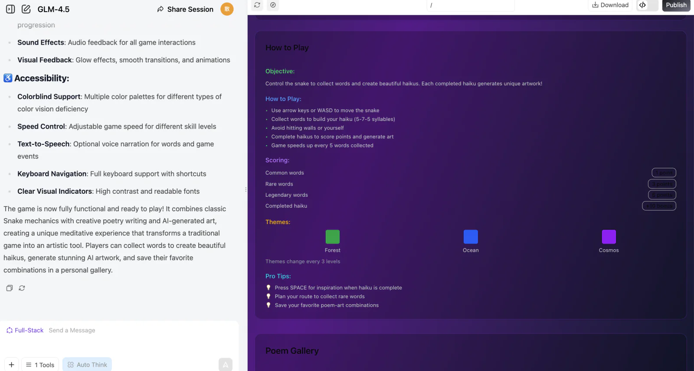

<div style="margin: 50px 0;">
  <ClientOnly>
    <StepBar :active="3" :items="[
      { title: 'Défis et opportunités', description: 'Les nouvelles possibilités pour tous' },
      { title: 'Premier contact', description: 'Développement express en 60 secondes' },
      { title: 'Projet pratique', description: 'Créer un Snake IA-native' },
      { title: 'Explorer et créer', description: 'Réinventer le jeu' }
    ]" />
  </ClientOnly>
</div>

### 3.3 Essayer de créer d'autres mini-jeux

Outre le Snake, nous pouvons laisser libre cours à notre imagination.

Créer tout ce que nous voulons, même essayer de tout casser ! Puis recommencer à zéro !

1. Plateforme de galerie d'art IA : Aide-moi à créer une galerie en ligne où les utilisateurs peuvent télécharger, parcourir, liker et commenter des œuvres d'art générées par IA, avec un affichage classé par style.
2. Archives de jeux rétro : Aide-moi à créer un site rendant hommage aux jeux classiques, qui recense l'histoire des jeux et des guides de jeu, avec plusieurs mini-jeux rétro jouables directement en ligne.
3. Suivi de vie durable : Aide-moi à créer un outil de suivi de l'empreinte carbone : l'utilisateur renseigne ses habitudes quotidiennes, l'outil estime automatiquement ses émissions de carbone et propose des conseils écologiques ainsi que des défis hebdomadaires.
4. Assistant culinaire virtuel : Aide-moi à créer un assistant de cuisine IA : l'utilisateur saisit les ingrédients disponibles chez lui, et il recommande des recettes avec des instructions de cuisson étape par étape.
5. Plateforme de découverte musicale underground : Aide-moi à créer un site de streaming musical qui met en avant les œuvres d'artistes indépendants et émergents, avec création de playlists et interactions par commentaires.
6. Gestionnaire de tâches minimaliste : Aide-moi à créer un outil de gestion de tâches au style épuré, avec création de tâches, définition des priorités, tri par glisser-déposer et suivi de la progression.
7. Atelier d'écriture science-fiction : Aide-moi à créer une plateforme d'écriture de SF proposant des modèles de construction d'univers, des fiches de personnages et des outils de synopsis, pour aider les auteurs à bâtir leur univers.
8. Graphe de connaissances personnel : Aide-moi à créer un outil de prise de notes visuel qui transforme les idées éparses en nœuds reliés par des lignes pour former une carte de connaissances.
9. Jardin botanique virtuel : Aide-moi à créer un site encyclopédique sur les plantes avec des fiches illustrées, où les utilisateurs peuvent aussi cultiver leurs propres plantes virtuelles et observer leur croissance.
10. Arène de défis de programmation : Aide-moi à créer une plateforme de compétition de programmation en ligne, avec des problèmes d'algorithmes de différents niveaux, un éditeur de code en ligne, une évaluation automatique et un classement.

Et aussi... si vous aimez les jeux, essayons ensemble d'en créer !

1. RPG 3D en monde ouvert : Aide-moi à créer un jeu 3D en monde ouvert librement explorable, avec cycle jour/nuit, météo, système de quêtes et croissance des personnages.
2. Arène FPS (tir à la première personne) : Aide-moi à créer un FPS multijoueur rapide, avec plusieurs modes comme le match à mort par équipe et la capture de drapeau, ainsi que plusieurs cartes.
3. Échecs IA et multijoueur : Aide-moi à créer une plateforme d'échecs où l'on peut jouer contre une IA de différents niveaux, mais aussi s'apparier en ligne avec de vrais joueurs.
4. Mahjong en ligne multijoueur : Aide-moi à créer un jeu de mahjong traditionnel prenant en charge plusieurs règles, la création de salons privés et le comptage automatique des points.
5. Jeu de stratégie au tour par tour : Aide-moi à créer un jeu de stratégie au tour par tour sur carte quadrillée, avec déplacement des unités, attaques, améliorations et brouillard de guerre.
6. Jeu de course contre la montre : Aide-moi à créer un jeu de course 3D axé sur le contre-la-montre, avec plusieurs circuits, personnalisation des véhicules et fantômes de replay.
7. Jeu de cartes à collectionner (construction de deck) : Aide-moi à créer un jeu de cartes où les joueurs peuvent collectionner des cartes, construire librement leur deck et participer à des matchs classés.
8. Battle royale (vue 2D de dessus) : Aide-moi à créer un battle royale 2D en vue de dessus, avec zone qui se rétrécit, butin aléatoire et modes solo/équipe.
9. Jeu d'horreur survival (première personne) : Aide-moi à créer un jeu d'horreur survival à la première personne, centré sur la gestion des ressources, l'esquive furtive des ennemis et la recherche d'une sortie.
10. Jeu de rythme musical (3D) : Aide-moi à créer un jeu de rythme musical 3D où les notes arrivent de loin au rythme de la musique et où le joueur doit les frapper au bon moment pour marquer des points.

### 3.4 Sélection de cas d'école du web : ce que d'autres ont créé avec l'IA

À ce stade, vous vous demandez peut-être encore : le Snake n'est qu'un exemple d'introduction, l'IA peut-elle vraiment créer des jeux plus complexes ?

La réponse est oui. Voici une sélection de **8 cas réels** publics sur le web — des compilations de jeux d'arcade classiques, des puzzles de type 2048, des répliques de *Minecraft* et de *Super Mario*, jusqu'à un jeu 3D et une plateforme officielle de jeux créés par le grand modèle chinois Kimi. Parmi les développeurs de ces projets, certains sont des programmeurs, d'autres des débutants complets sans aucune base, mais ils ont tous un point commun : **ils ont laissé l'IA écrire l'essentiel du code par la conversation**.

#### 🕹️ Cas n° 1 : répliquer 10 jeux d'arcade classiques en un après-midi (WotAI Games)

[WotAI Games](https://games.wotai.co/) est une collection de jeux web développée entièrement de zéro avec Claude Code (Vibe Coding), **sans utiliser aucun moteur de jeu**. Grâce au dialogue, l'IA a répliqué d'un coup 10 jeux d'arcade classiques : Pac-Man, Tetris, Space Invaders, Snake, Flappy Bird, Breakout, Galaga, Frogger, Doodle Jump et Sudoku. Chacun est jouable directement en ligne et dispose de son propre système de classement.

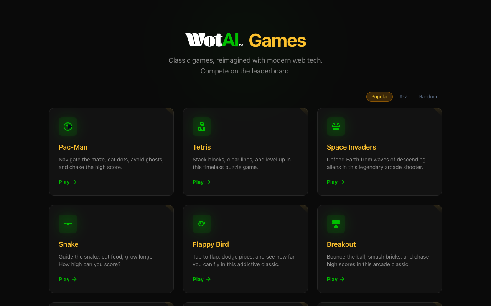

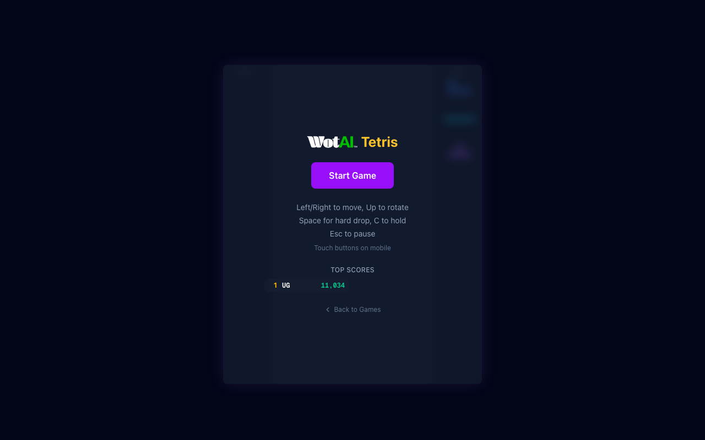

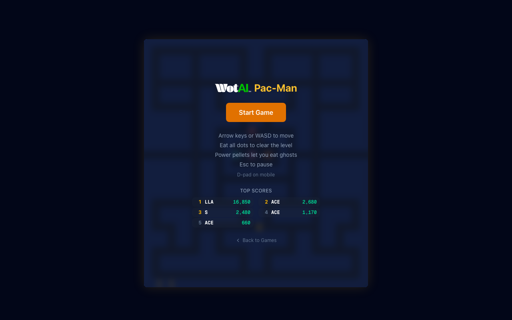

> 🔗 Jouer en ligne : [games.wotai.co](https://games.wotai.co/) ｜ Rétrospective : [We vibe coded 10 classic arcade games with Claude Code](https://wotai.co/blog/wotai-games-vibe-coded-arcade-classics)

#### 🌸 Cas n° 2 : un débutant complet crée un jeu de type 2048 en 2 heures (Blooming Garden)

Un développeur japonais qui ne savait absolument pas programmer, [in0ho1no](https://github.com/in0ho1no), a créé avec Claude, par simple dialogue (Vibe Coding) et en **environ 2 heures**, le jeu « jardin de plantes » de type 2048 [Blooming Garden](https://in0ho1no.github.io/2025-adhoc-blooming-garden/) : fusion et amélioration de plantes identiques, effets de floraison somptueux, animations de particules, classement, effets sonores, adaptation mobile… Toutes ces fonctionnalités ont été réalisées par dialogue en langage naturel, sans écrire une seule ligne de code à la main.

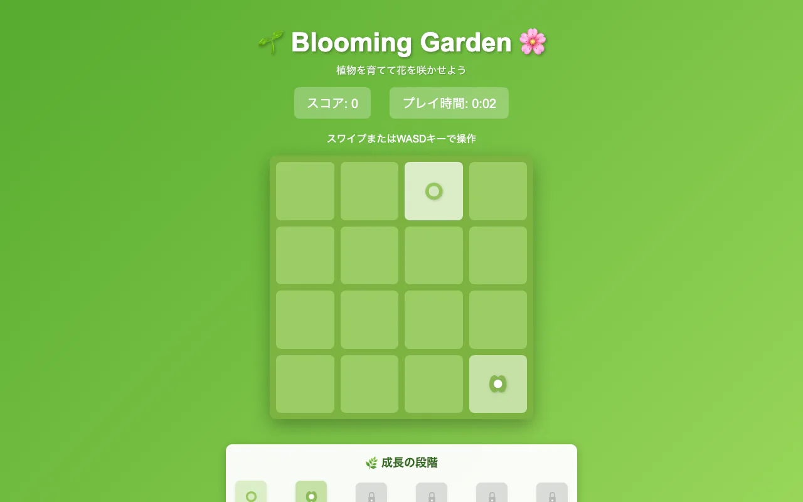

> 🔗 Jouer en ligne : [in0ho1no.github.io/2025-adhoc-blooming-garden](https://in0ho1no.github.io/2025-adhoc-blooming-garden/) ｜ Code source : [github.com/in0ho1no/2025-adhoc-blooming-garden](https://github.com/in0ho1no/2025-adhoc-blooming-garden)

#### 🌍 Cas n° 3 : un designer crée avec l'IA un jeu 3D multijoueur en ligne (Planet Jumper)

Le designer [Ricardo de Zoete (Hammy)](https://x.com/RicardoDeZoete) a créé avec l'IA d'OpenAI, par simple dialogue (Vibe Coding), [Planet Jumper](https://gamesbyhammy.cloud/play/planetjumper) sur la base de three.js — un **jeu de plateforme 3D multijoueur** : courir, sprinter et sauter à la surface d'une petite planète sphérique, tout en affrontant en ligne des inconnus. La gravité sphérique, la synchronisation réseau et la sensation de saut — des systèmes loin d'être simples — ont toutes été « discutées » à coups de prompts.

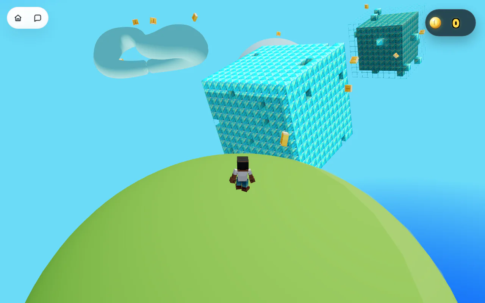

> 🔗 Jouer en ligne : [gamesbyhammy.cloud/play/planetjumper](https://gamesbyhammy.cloud/play/planetjumper) ｜ En détail : [Planet Jumper: A Vibe-Coded Three.js Multiplayer Platformer](https://www.webgpu.com/showcase/planet-jumper-threejs-multiplayer/)

#### 🎮 Cas n° 4 : une personne a créé 100 jeux navigateur avec le Vibe Coding (2026)

En juillet 2026, le développeur de la communauté chinoise [wangzifan396-wzf](https://github.com/wangzifan396-wzf) a open-sourcé [mini-browser-games](https://github.com/wangzifan396-wzf/mini-browser-games) — **100 mini-jeux navigateur créés et peaufinés en continu par une seule personne avec le Vibe Coding**, tous en un seul fichier HTML sans aucune dépendance, lancés d'un simple double-clic. Les genres couvrent l'action, la stratégie, la défense de tour, la gestion, les cartes, la physique, le raisonnement, la course, le rythme, les jeux de plateau et les casse-tête ; certains atteignent déjà une profondeur digne d'un vrai produit : campagnes multi-chapitres, système d'évolution, codes de sauvegarde synchronisés entre appareils. L'ensemble du projet est open source sous licence MIT, et le catalogue en ligne permet de jouer directement.


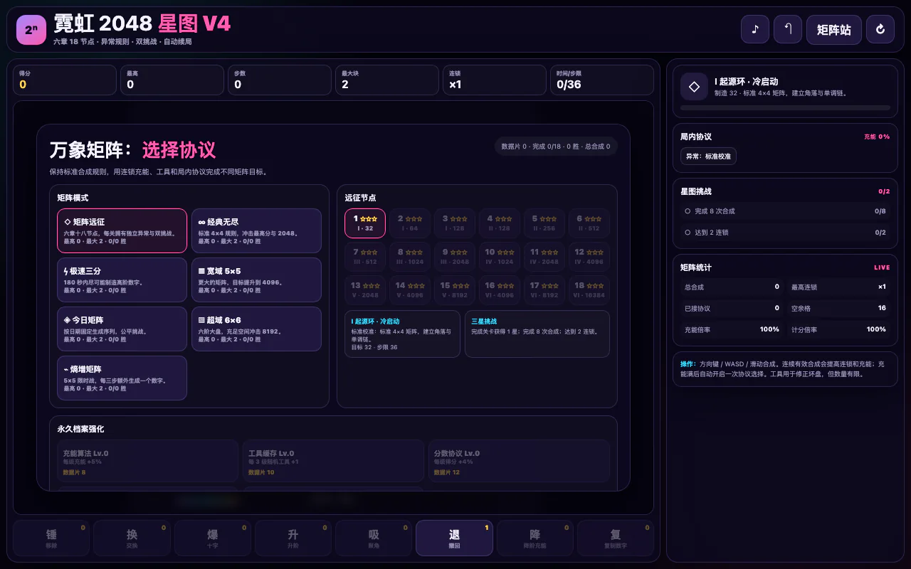

> 🔗 Catalogue en ligne : [wangzifan396-wzf.github.io/mini-browser-games](https://wangzifan396-wzf.github.io/mini-browser-games/) ｜ Code source : [github.com/wangzifan396-wzf/mini-browser-games](https://github.com/wangzifan396-wzf/mini-browser-games) ｜ Rétrospective : [J'ai créé 100 jeux navigateur avec le Vibe Coding et je les ai tous open-sourcés](https://blog.csdn.net/m0_74023007/article/details/162945755)

#### ⛏️ Cas n° 5 : une réplique de Minecraft pour ses neveux (CraftMine, 2026)

En février 2026, le développeur [Trent Sterling](https://tront.xyz/blog/posts/craftmine/) a ouvert un fichier HTML vierge parce que ses neveux voulaient jouer à Minecraft sans en avoir la version officielle, et a créé [CraftMine](https://tront.xyz/craftmine/) avec Claude Code par simple dialogue — une réplique de Minecraft en version web **de 6 820 lignes dans un seul fichier** : 46 blocs (dont 21 blocs sur le thème de l'enfer de DOOM), 36 créatures (du poulet au boss titan de 300 PV), 19 armes (dont la BFG 9000), 5 biomes, un cycle jour/nuit, et même le **multijoueur P2P**. Aucune étape de compilation : il suffit d'ouvrir la page web pour jouer.

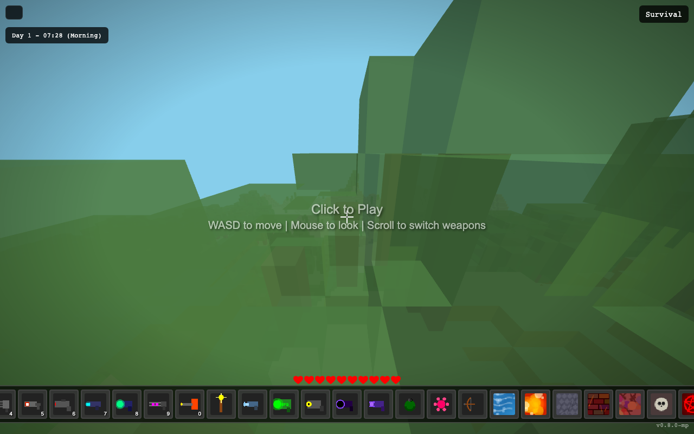

> 🔗 Jouer en ligne : [tront.xyz/craftmine](https://tront.xyz/craftmine/) ｜ Rétrospective : [CraftMine: A 6,820-line vibe-coded Minecraft clone in one HTML file](https://tront.xyz/blog/posts/craftmine/)

#### 🍄 Cas n° 6 : Super Mario aux niveaux infinis générés en temps réel par l'IA (2026)

En mars 2026, un développeur a combiné la version open source de Super Mario avec les modèles d'OpenAI pour créer [Super Mario version IA](https://supermario.leanmcp.live/) : on peut jouer aux niveaux classiques d'origine, mais aussi laisser l'IA **générer de nouveaux niveaux en temps réel** — dans le « mode infini », l'IA crée dynamiquement des décors et des ennemis inédits au fil de votre progression, et l'on peut enchaîner jusqu'à 45 minutes de jeu. On peut même, directement dans le jeu, demander par écrit à l'IA d'ajouter des ennemis, de placer des plateformes ou de changer le thème.

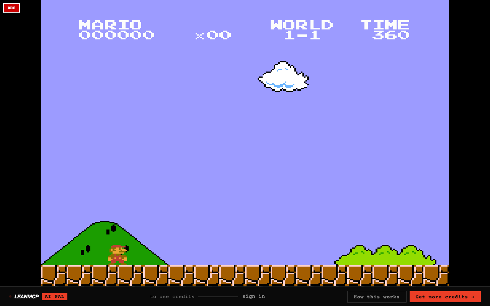


> 🔗 Jouer en ligne : [supermario.leanmcp.live](https://supermario.leanmcp.live/) ｜ En détail : [OpenAI and Idiomorph Power Infinite Mario Level Generation in Browser](https://www.thenextgentechinsider.com/pulse/openai-and-idiomorph-power-infinite-mario-level-generation-in-browser)

#### 🇨🇳 Cas n° 7 : le grand modèle chinois Kimi K3 crée un jeu 3D avec un seul prompt (2026)

En juillet 2026, le développeur [Dr. Josh Simmons](https://www.drjoshcsimmons.com/writing/kimi-k3-built-the-game-i-still-had-to-play-it) n'a envoyé qu'un seul prompt au grand modèle chinois **Kimi K3** pour qu'il crée un jeu 3D jouable à la première personne : collecter des noyaux de données dans une installation de serveurs générée par procédure, esquiver des drones de patrouille, et descendre trois étages en monte-charge. Le jeu entier est jouable dès sa première génération ; deux tours de conversation suffisent pour corriger deux bugs et terminer le jeu en douceur, pour un coût total d'environ **2 dollars**.

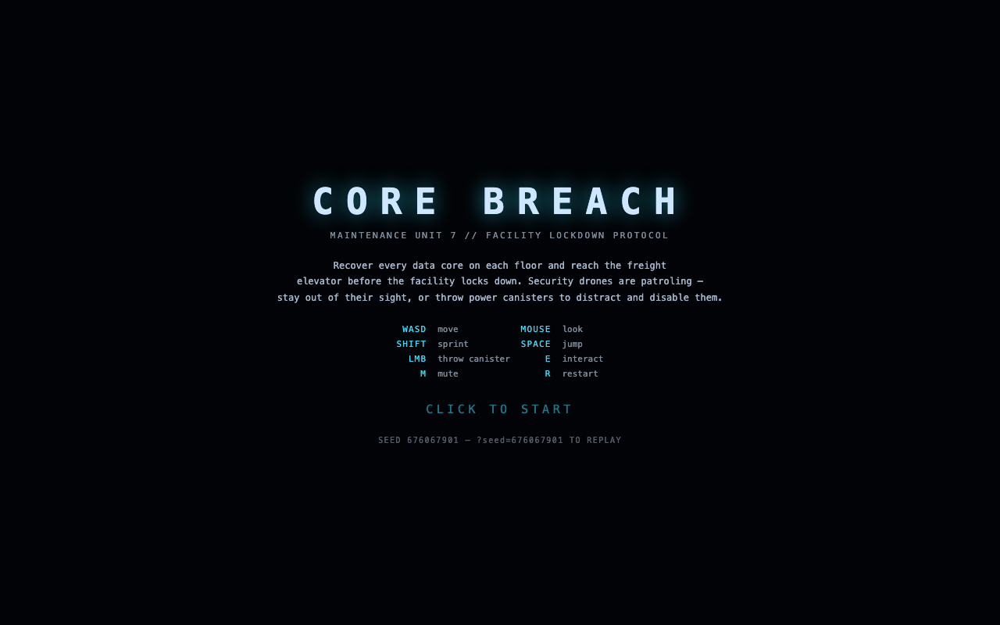

> 🔗 Jouer en ligne : [kimi-test-theta.vercel.app](https://kimi-test-theta.vercel.app/) ｜ Code source : [github.com/jcpsimmons/kimi-test](https://github.com/jcpsimmons/kimi-test) ｜ Rétrospective du développeur : [Kimi K3 Built the Game. I Still Had to Play It.](https://www.drjoshcsimmons.com/writing/kimi-k3-built-the-game-i-still-had-to-play-it)

#### 🎯 Cas n° 8 : K399, la plateforme officielle de jeux de Kimi — des dizaines de jeux IA jouables en ligne (2026)

Le 17 juillet 2026, après la sortie du modèle Kimi K3 par Moonshot AI, la plateforme de jeux web [K399](https://www.k399.games/) a été lancée en parallèle — des dizaines de jeux tous créés avec la participation du modèle K3, jouables d'un clic. Les genres couvrent le tir 3D, les jeux de rythme, l'action en défilement horizontal, les AVG de drame de palais, les puzzles 3D et même les mondes ouverts : on y trouve aussi bien des répliques de classiques comme *The Legend of Zelda*, *Black Myth: Wukong*, *Bubble Land* et *Vampire Survivors*, que des jeux originaux bien plus aboutis qu'une simple démo, comme *Pioneer Practice Ground* (un FPS 3D avec déplacement, saut, glissade et tir à la visée), le monde ouvert *SpiderPunk*, ou encore *Fengque Shen Gong*, un AVG de drame de palais avec cinq chapitres d'intrigue principale, huit intrigues secondaires et 32 événements aléatoires.

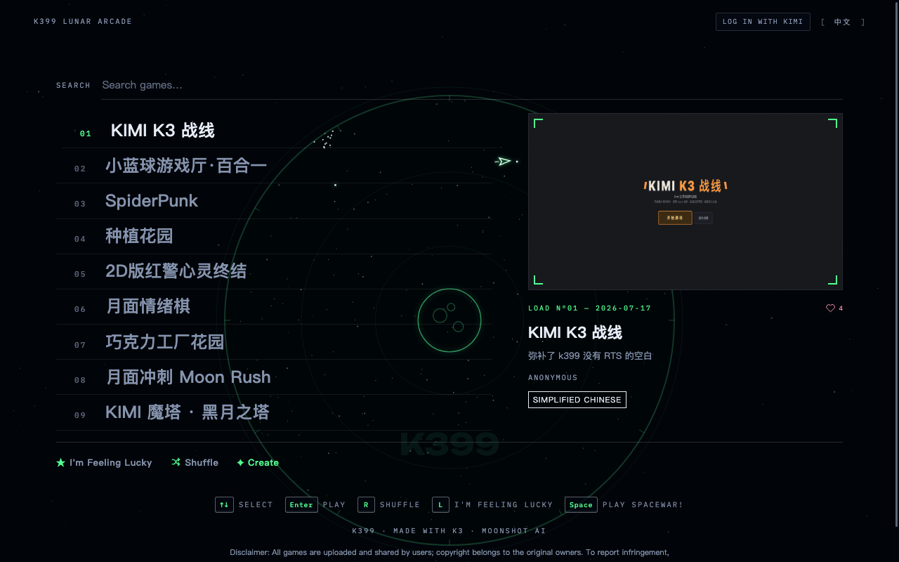


> 🔗 Jouer en ligne : [k399.games](https://www.k399.games/) (K3 Game Arcade, jouable d'un clic) ｜ En détail : [Un ancien dirigeant de miHoYo rejoint l'entreprise ; la société IA la plus en vogue du moment a soudainement créé des dizaines de jeux](https://eu.36kr.com/zh/p/3906895998178441) ｜ [Kimi K3, qui s'inquiète ?](https://36kr.com/p/3905392402748801)

En découvrant ces cas, vous vous rendrez compte que **le Snake n'est que la partie émergée de l'iceberg des capacités de programmation de l'IA**. Qu'il s'agisse de jeux d'arcade classiques, de puzzles 2048, de jeux 3D, de répliques de *Minecraft* et de *Super Mario*, de collections de centaines de jeux, ou même de la plateforme officielle de jeux d'un grand modèle chinois, tant que vous savez exprimer clairement vos idées et que vous êtes prêt à itérer au fil des conversations, l'IA peut vous aider à les réaliser de 0 à 1. Et maintenant, à vous de jouer !

## 📚 Devoir

<StageAssignmentCard title="Terminer vos premiers mini-jeux natifs de l’IA">

<p>
    Dans cette section, vous avez suivi les étapes du processus complet : de la « génération conversationnelle d'un Snake » à la « compréhension des principes de conception d'un mini-jeu IA-native ». Le devoir ci-dessous vous aide à transformer cette compréhension en compétence réelle.
  </p>

  <ol>
    <li>
      <strong>Reproduire intégralement le jeu de Snake IA-native</strong>
      <ul>
        <li>Au minimum : le serpent peut se déplacer, sa longueur et son score changent quand il mange de la « nourriture », et le jeu se termine s'il heurte un mur ou son propre corps.</li>
        <li>Lors de la reproduction, pratiquez en envoyant à l'IA le phénomène erroné + le message d'erreur + l'extrait de code clé, en demandant une correction en « mode débutant ».</li>
      </ul>
    </li>
    <li>
      <strong>(Optionnel) Créer 1 mini-jeu ou démo IA-native original</strong>
      <ul>
        <li>Il peut s'agir de n'importe quel gameplay léger autour de texte, images, musique, rythme, etc.</li>
        <li>L'important n'est pas la qualité visuelle, mais de pouvoir expliquer clairement : en quoi l'IA vous a concrètement aidé, et ce qu'elle a résolu de « difficile ou fastidieux à faire manuellement ».</li>
      </ul>
    </li>
  </ol>

  <p>
    Voilà pour le tutoriel complet ! Il vous faudra peut-être <strong>4 heures</strong> pour terminer tout le contenu et construire votre propre jeu de Snake. Ne vous pressez pas — explorez, expérimentez et profitez du processus. Si vous rencontrez des concepts difficiles à comprendre, n'hésitez pas à consulter les annexes ci-dessous.
  </p>

</StageAssignmentCard>

## Annexes

<el-card id="appendix-nav" shadow="hover" style="margin-top: 24px; margin-bottom: 24px; border-left: 5px solid #67C23A;">
  <div style="font-weight: bold; margin-bottom: 8px;">Navigation des annexes</div>
  <div style="color: #606266; font-size: 14px; line-height: 1.6; margin-bottom: 12px;">
    Voici quelques concepts de base liés à ce chapitre : si vous rencontrez des questions comme « qu'est-ce que le frontend ? » ou « qu'est-ce que le Vibe Coding ? », vous pouvez revenir ici à tout moment.
  </div>
  <el-row :gutter="16">
    <el-col :span="12">
      <a href="#appendix-1" style="text-decoration: none; color: inherit;"><b>Annexe 1 : Avons-nous besoin de connaissances en développement frontend ?</b></a><br/>
      <span style="font-size: 12px; color: #909399">Comprendre la place du frontend dans une application, savoir ce qui est « visible ».</span>
    </el-col>
    <el-col :span="12">
      <a href="#appendix-2" style="text-decoration: none; color: inherit;"><b>Annexe 2 : Qu'est-ce que le Vibe Coding exactement ?</b></a><br/>
      <span style="font-size: 12px; color: #909399">Comprendre les principes du « développement conversationnel » et comment collaborer avec l'IA.</span>
    </el-col>
  </el-row>
  <el-row :gutter="16" style="margin-top: 10px;">
    <el-col :span="12">
      <a href="#appendix-3" style="text-decoration: none; color: inherit;"><b>Annexe 3 : Contexte des modèles</b></a><br/>
      <span style="font-size: 12px; color: #909399">Clarifier les concepts souvent entendus mais facilement confondus comme la « longueur de contexte ».</span>
    </el-col>
    <el-col :span="12">
      <a href="#appendix-4" style="text-decoration: none; color: inherit;"><b>Annexe 4 : Capacité de suivi des instructions</b></a><br/>
      <span style="font-size: 12px; color: #909399">Comprendre pourquoi le modèle « ne comprend pas » parfois, et comment écrire plus clairement.</span>
    </el-col>
  </el-row>
  <div style="margin-top: 12px; font-size: 12px; color: #909399;">
    Astuce : vous pouvez utiliser Ctrl/⌘+F pour rechercher des mots-clés, ou copier les passages que vous ne comprenez pas et les donner à l'IA en lui demandant de les réexpliquer « de façon compréhensible pour un vrai débutant ».
  </div>
</el-card>

## <span id="appendix-1">[Annexe 1 : Avons-nous besoin de connaissances en développement frontend ?](#appendix-nav)</span>

::: tip 💡 En résumé
Vous n'avez pas besoin de savoir coder, mais connaître les concepts de base vous aidera à mieux décrire vos besoins à l'IA.
:::

<el-row :gutter="16" style="margin: 20px 0;">
  <el-col :span="12" :xs="24" style="margin-bottom: 16px;">
    <el-card shadow="hover" style="border-radius: 12px; height: 100%;">
      <template #header>
        <div style="display: flex; align-items: center; gap: 8px;">
          <span style="font-size: 20px;">👁️</span>
          <span style="font-weight: bold;">Frontend</span>
          <el-tag type="success" size="small">Visible</el-tag>
        </div>
      </template>
      <div style="color: #606266; line-height: 1.8;">
        Tout ce que l'utilisateur peut <strong>voir et cliquer</strong>
        <ul style="margin: 12px 0; padding-left: 20px;">
          <li>Titres, textes, images de la page</li>
          <li>Boutons, champs de saisie, menus déroulants</li>
          <li>Interface de jeu, animations</li>
        </ul>
      </div>
    </el-card>
  </el-col>
  <el-col :span="12" :xs="24" style="margin-bottom: 16px;">
    <el-card shadow="hover" style="border-radius: 12px; height: 100%;">
      <template #header>
        <div style="display: flex; align-items: center; gap: 8px;">
          <span style="font-size: 20px;">⚙️</span>
          <span style="font-weight: bold;">Backend</span>
          <el-tag type="info" size="small">Invisible</el-tag>
        </div>
      </template>
      <div style="color: #606266; line-height: 1.8;">
        Traitement des données sur le serveur
        <ul style="margin: 12px 0; padding-left: 20px;">
          <li>Stockage des scores</li>
          <li>Vérification de connexion</li>
          <li>Attribution des niveaux</li>
        </ul>
      </div>
    </el-card>
  </el-col>
</el-row>

### La trinité du frontend

Pensez à une page web comme à une maison. Trois types de « code » s'occupent chacun d'une chose :

- **HTML** : décide **ce qu'il y a** sur la page — comme dessiner le plan de la maison d'abord
- **CSS** : décide **de l'apparence** — comme peindre les murs et disposer les meubles
- **JavaScript** : décide **de la réaction** — comme un interrupteur : on appuie, la lumière s'allume

### Comment le code devient-il une page ?

Le navigateur **monte la structure avec HTML, décore avec CSS et met le courant avec JavaScript** — trois étapes, et voilà la page.

### Alors, React et Vue, c'est quoi ?

Ce sont des **« outils préfabriqués » pour construire des pages complexes** — plus vite et plus fiablement. Pas besoin de les apprendre, juste de savoir que ce sont des aides.

### Dans le Vibe Coding

**Pas de code, juste de la description.** Parlez simplement à l'IA, par exemple :

> « Crée une page de classement avec React, avec la liste des scores à droite, et en cliquant sur une ligne, affiche les détails du joueur en dessous, dans un style épuré et moderne. »

Pour aller plus loin : [l'annexe sur les fondamentaux du Web](/zh-cn/appendix/3-browser-and-frontend/javascript-deep-dive) et [l'annexe sur l'évolution des frameworks frontend](/zh-cn/appendix/3-browser-and-frontend/frontend-frameworks).

## <span id="appendix-2">[Annexe 2 : Qu'est-ce que le Vibe Coding exactement](#appendix-nav)</span>

> 💡 Qu'est-ce que le Vibe Coding ? L'informaticien [Andrej Karpathy](https://karpathy.ai/) (co-fondateur d'OpenAI, ancien responsable IA chez Tesla) a introduit le terme **vibe coding** en février 2025. Ce concept désigne une méthode de programmation reposant sur les LLM, <strong>permettant aux développeurs de générer du code fonctionnel en fournissant des descriptions en langage naturel plutôt qu'en écrivant manuellement du code.</strong>

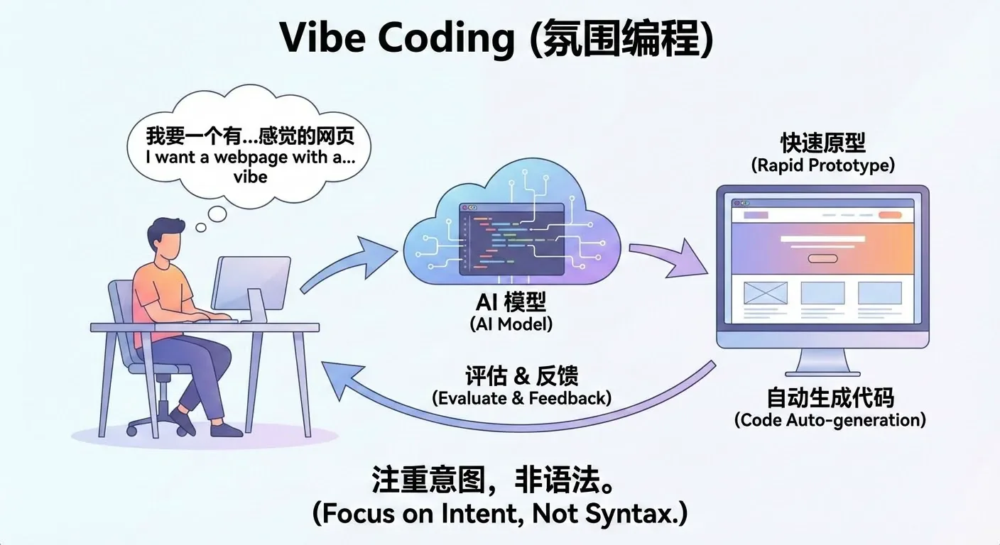

Littéralement, le Vibe Coding peut être compris comme une façon de « développer en parlant ». Son changement fondamental est le suivant : vous n'avez plus besoin d'écrire du code ligne par ligne, de vérifier la syntaxe, de déboguer ; vous décrivez simplement ce que vous voulez en langage naturel, par exemple :

« J'ai besoin d'une page de connexion, avec un champ pour le numéro de téléphone et un champ pour le code de vérification. »
« Après une connexion réussie, rediriger vers la page d'accueil et afficher le nom d'utilisateur en haut à droite. »
« Donne-moi un simple jeu de Snake contrôlable au clavier avec les flèches directionnelles. »
Les grands modèles de langage (LLM) traduisent automatiquement ces descriptions en code réellement exécutable et génèrent les pages, la logique et les structures de données correspondantes. Après avoir vu le résultat, vous exprimez vos modifications en langage naturel : « rends le bouton plus grand », « change le fond en sombre », « enregistre le score et affiche un classement », et l'IA continue à ajuster l'implémentation selon vos demandes.

Dans ce mode, vous n'avez pas besoin d'apprendre un langage de programmation avant de coder ; vous concentrez votre énergie sur : décrire clairement ce que vous voulez faire, évaluer le résultat « est-ce que ça correspond ? », puis proposer de nouvelles modifications. L'IA se charge de traduire ces idées de haut niveau en implémentation concrète, réduisant ainsi considérablement le travail de codage mécanique et répétitif.

Pour plus de détails sur le Vibe Coding : [https://www.ibm.com/think/topics/vibe-coding](https://www.ibm.com/think/topics/vibe-coding)

Pour plus de contenu de Karpathy : [https://karpathy.bearblog.dev/blog/](https://karpathy.bearblog.dev/blog/)

### Comment faire semblant d'être un maître du Vibe Coding

En réalité, dans un vrai processus de vibe coding, on n'utilise généralement pas de prompts très complexes. Peut-être qu'au début on doit fournir un prompt global précis et modérément complexe pour l'ensemble du programme, mais ensuite, à chaque étape, vous n'aurez probablement besoin que de ce type de prompts :

```
"Il y a un bug dans le code, corrige-le."
"Je ne veux pas un bout de code, donne-moi le code corrigé complet."
"Ton code a toujours des problèmes."
"Corrige à nouveau et donne-moi le code corrigé complet."
"Ça marchait tout à l'heure, pourquoi ça ne marche plus ?"
"Tu n'as pas compris ce que je voulais ? Ne modifie pas mon code d'origine."
"N'ajoute pas de fonctionnalités de débogage."
"Ne fais pas ce que je ne t'ai pas demandé."
"Où est la fonctionnalité que je t'ai demandée ?"
"Tu ne me comprends pas ?"
"Je veux juste une fonction."
"Je t'ai dit de te référer à mon code précédent."
"N'ajoute pas de commentaires inutiles."
"Ne modifie pas la logique de base de mon code."
"Aide-moi à modifier le code."
"Modifie en te basant sur mon code..."
"Ne change pas mes noms de variables !!!"
"Ne change pas les noms de fonctions originaux !"
"Ne touche pas à mes variables."
"N'ajoute pas de fonctionnalités supplémentaires."
"Ne génère pas juste un squelette, génère le code complet."
```

Cela peut paraître exagéré, mais en réalité, ce sont les types de prompts que nous utilisons couramment dans notre travail quotidien. En raison de la <strong>limite de longueur de contexte</strong> des grands modèles de langage, ou parfois de leur <strong>capacité de suivi des instructions</strong> qui n'est pas très forte, le modèle peut oublier des contenus discutés plus tôt dans la conversation. En vibe coding, nous préférons les modèles à contexte long et ceux avec une forte capacité de suivi des instructions.

## <span id="appendix-3">[Annexe 3 : Contexte des modèles](#appendix-nav)</span>

Le contexte d'un modèle peut être compris comme la mémoire à court terme de l'IA. Il désigne tout le contenu textuel que le modèle peut « voir » et « retenir » au cours d'une conversation ou d'une tâche, y compris vos questions précédentes, les instructions système, les documents de référence, etc.

C'est précisément grâce au contexte que l'IA peut comprendre que vous poursuivez sur le sujet précédent, et mener des conversations tour par tour qui semblent cohérentes et naturelles. Sans contexte, chaque phrase serait pour le modèle une question entièrement nouvelle, incapable de savoir ce que vous avez dit avant.

Chaque modèle a sa propre longueur de contexte effective (context window), généralement mesurée en tokens (une unité correspondant approximativement à des « fragments de mots »). Les modèles actuels se situent généralement entre 32k et 128k tokens. Plus le contexte est long, plus le modèle peut « lire » de contenu en une seule fois.

Quand le contenu que vous saisissez approche ou dépasse la limite de contexte du modèle, plusieurs phénomènes courants peuvent apparaître :

- Le modèle commence à oublier des détails ou des informations clés dans les longs textes
- La conversation dévie progressivement de l'objectif initial
- Les contenus cités deviennent incohérents entre différentes questions

Ces phénomènes ne signifient pas que le modèle est soudainement « devenu bête », mais résultent naturellement lorsque la capacité de contexte est saturée ou presque saturée.

Dans la pratique, nous souhaitons un contexte aussi long que possible, tout en étant conscients que :

- Plus le contexte est long, plus les ressources de calcul sont importantes
- Le coût d'appel augmente en conséquence

Il faut donc trouver un équilibre entre laisser le modèle voir suffisamment de contenu et maîtriser les coûts et l'efficacité.

## <span id="appendix-4">[Annexe 4 : Capacité de suivi des instructions](#appendix-nav)</span>

La capacité de suivi des instructions désigne la capacité du modèle, après avoir compris vos instructions, à les exécuter de manière précise et complète. Cela inclut non seulement la capacité à répondre à des questions, mais aussi à accomplir des tâches selon un format, un style et des étapes spécifiés.

Un modèle avec une forte capacité de suivi des instructions présente généralement les caractéristiques suivantes :

- Il produit le contenu dans la quantité demandée
- Il couvre tous les éléments spécifiés
- Il respecte le format et le ton spécifiés
- Il ne fait pas d'extensions inutiles

En pratique, une forte capacité de suivi des instructions est très importante car elle améliore la stabilité, la reproductibilité et facilite l'intégration système.

<RelatedArticlesSection
  title="Continuer l'apprentissage"
  description="À partir de l'« expérience ludique », nous vous recommandons de poursuivre vers le développement local et la pratique produit."
  :items="relatedArticles"
/>
---
title: 'Debutant 1 : A l ere de l IA, parler c est programmer'
description: 'Creer un jeu du serpent AI-native par conversation, puis reutiliser la methode pour construire ton propre mini jeu ou demo.'
---
