# Trouver des usages de l’IA dans de vrais flux de travail

Les listes d’« usages de l’IA par secteur » semblent riches : finance, santé, éducation, industrie, puis une douzaine d’idées. Mais elles n’indiquent pas qui interroger, quelles données relier, quelle étape remplacer ni qui paierait le résultat.

Le problème est qu’**un secteur n’est pas un usage**. « IA + santé » définit un territoire. « Après la consultation, le médecin consacre dix minutes à compléter le dossier ; le système prépare une note depuis la conversation et le médecin la valide » décrit un flux que l’on peut étudier, concevoir et tester.

Cette annexe s’appuie sur plus de soixante rapports de conseil, études sectorielles et cas produit de première main. Elle ne cherche pas l’exhaustivité, mais retient des flux d’entreprise et des moments grand public déjà utilisés et dont la valeur est visible. C’est une carte pour trouver des questions d’entretien, pas une idée de start-up prête à l’emploi.

  

    Retenez cette phrase
    <strong>En entreprise, cherchez le blocage d’un flux. Pour le grand public, cherchez un moment qui revient dans la journée.</strong>
  

  
Le premier exige un rôle, des systèmes, des passages de relais et un responsable. Le second exige une raison de revenir et une étape que l’IA supprime par rapport à la recherche, au modèle ou au service humain.

## Distinguer d’abord entreprise et grand public

### Entreprise : elle paie un résultat

Une entreprise achète rarement le simple fait de « discuter ». Elle achète un temps de traitement plus court, moins de reprises, une conformité plus stable ou davantage de ventes. Un cas étudiable précise qui le fait chaque jour, d’où vient le matériel, dans quel système le résultat revient et qui répond d’une erreur.

Dans l’enquête Deloitte auprès de 2 773 dirigeants, peu d’expériences d’IA générative atteignaient l’échelle. L’examen par Accenture de plus de 2 000 projets trouve également peu d’organisations créant une valeur générale. La difficulté vient souvent de l’intégration au flux complet, pas de la capacité du modèle à répondre. [Deloitte: State of Generative AI in the Enterprise](https://www2.deloitte.com/us/en/pages/about-deloitte/articles/press-releases/state-of-generative-ai.html) · [Accenture: Making Reinvention Real with Gen AI](https://www.accenture.com/us-en/insights/consulting/making-reinvention-real-with-gen-ai)

### Grand public : la personne paie pour un moment plus simple

Un produit grand public ne relie pas dix systèmes internes, mais la personne peut fermer l’application à tout instant. Les bons usages apparaissent lors d’un voyage, d’un achat, d’un exercice oral, d’une affiche ou du tri des factures. Ils terminent d’abord une tâche, puis apprennent progressivement les préférences.

Dans l’enquête Capgemini auprès de 12 000 personnes, l’IA générative entrait déjà dans la découverte et la comparaison de produits. QuestMobile observe aussi en Chine un déplacement du chat autonome vers la recherche, le travail, l’image et la musique. L’occasion consiste à relier la conversation à l’action suivante. [Capgemini: What Matters to Today's Consumer 2025](https://www.capgemini.com/insights/research-library/top-consumer-trends-in-2025/) · [QuestMobile : rapport mobile du printemps 2025](https://www.questmobile.cn/research/report/1919961024158601218/)

## Entreprise : huit travaux déjà en cours

Chaque section commence par un rôle concret. Avant de copier un produit, observez pourquoi l’ancien travail était lent, quelle étape l’IA prend et ce qui reste à la personne.

### 1. Le service client ne répond pas seulement : il termine le dossier

<figure class="product-shot">
  <a href="https://www.klarna.com/international/press/klarna-ai-assistant-handles-two-thirds-of-customer-service-chats-in-its-first-month/" target="_blank" rel="noreferrer">
    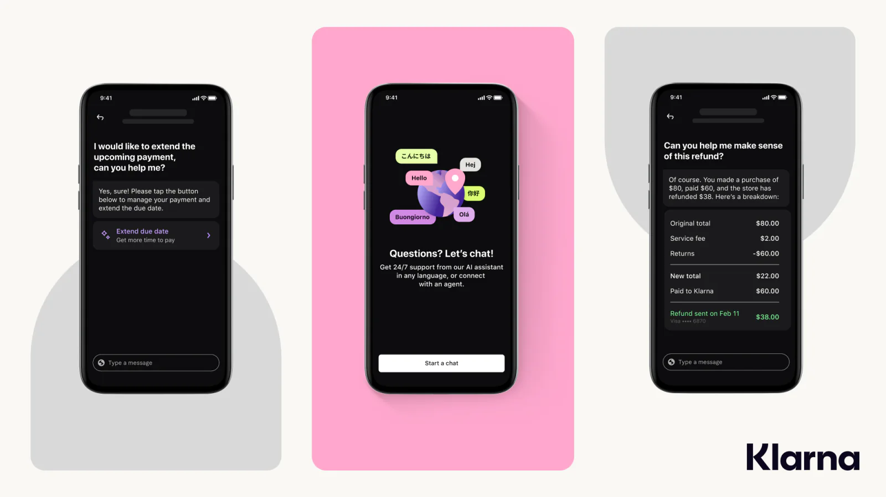
  </a>
  <figcaption><strong>Klarna AI Assistant :</strong> il ne dit pas seulement « contactez un agent » ; il ouvre le report de paiement et détaille le remboursement. Une IA utile retrouve la commande et poursuit l’action.</figcaption>
</figure>

**Qui travaille :** agents de première ligne, responsables d’équipe et opérations après-vente.

À la question « pourquoi mon remboursement n’arrive-t-il pas ? », l’agent vérifie l’identité, la commande, le paiement et la livraison, explique la règle et crée parfois un ticket. Le temps ne part pas dans une phrase polie, mais dans le contexte à réunir entre plusieurs systèmes.

Klarna traite remboursements, retours et langues ; ResultsCX relie routage vocal, compte et API internes. La valeur suit **état → règle → trace → transfert humain**, pas une FAQ. [Cas Klarna](https://openai.com/index/klarna/) · [Cas ResultsCX](https://aws.amazon.com/solutions/case-studies/resultscx/) · [Salesforce: State of Service 2025](https://www.salesforce.com/news/stories/state-of-service-report-announcement-2025/)

Une première version peut intervenir après la conversation humaine : résumé, intention, règle et prochaine action, puis validation par l’agent avant l’écriture du ticket. On mesure le temps gagné sans donner au modèle le droit de rembourser.

  Questions à poser
  
Entre quels écrans les agents passent-ils le plus ? Quelles questions répétées changent selon l’état de la commande ? Après un transfert, faut-il tout redemander ?

### 2. Les ventes ne manquent pas de texte, mais de la prochaine bonne conversation

<figure class="product-shot">
  <a href="https://openai.com/index/morgan-stanley/" target="_blank" rel="noreferrer">
    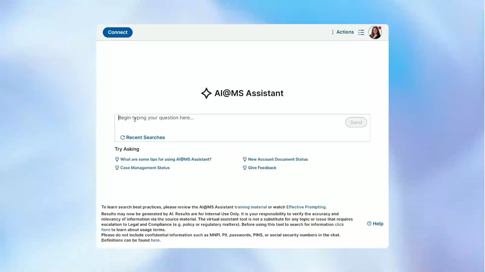
  </a>
  <figcaption><strong>Morgan Stanley AI@MS Assistant :</strong> les conseillers recherchent documents et état des cas. « Usage interne uniquement » et vérification humaine sont affichés. C’est une recherche dans le poste de travail, pas un chat qui décide.</figcaption>
</figure>

**Qui travaille :** ventes B2B, responsables de comptes, avant-vente et direction commerciale.

Après une réunion, il faut compléter le CRM, identifier décideurs et objections, retrouver un cas, écrire le suivi et choisir quand rappeler. Les preuves sont dispersées entre enregistrement, chat, courrier et notes, et le CRM vieillit vite.

McKinsey couvre prospection, préparation, communication, proposition, signature et renouvellement. Morgan Stanley ne remplace pas la décision d’investissement : il retrouve les connaissances internes et transforme les réunions en notes et tâches. [McKinsey: Unlocking Gen AI in B2B Sales](https://www.mckinsey.com/capabilities/growth-marketing-and-sales/our-insights/unlocking-profitable-b2b-growth-through-gen-ai) · [Cas Morgan Stanley](https://openai.com/index/morgan-stanley/)

La première version peut traiter les quinze minutes après la réunion : objectifs, objections, engagements, prochaines étapes, courrier modifiable et champs CRM. Mesurez la qualité du CRM et la vitesse du suivi, pas le nombre de mots.

### 3. Le savoir interne doit dire quelle règle appliquer cette fois

<figure class="product-shot">
  <a href="https://www.notion.com/help/guides/find-answers-and-generate-reports-with-enterprise-search" target="_blank" rel="noreferrer">
    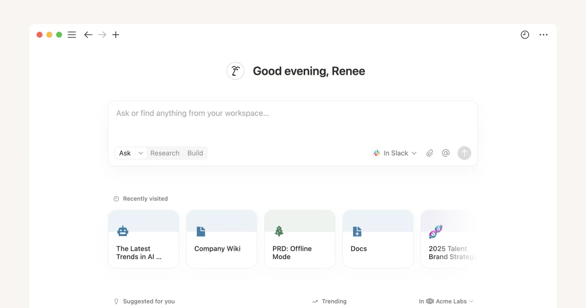
  </a>
  <figcaption><strong>Notion Enterprise Search :</strong> une question cherche dans Notion et Slack, avec Ask, Research et Build. L’essentiel tient aux sources existantes et aux droits, pas à un seul PDF importé.</figcaption>
</figure>

**Qui travaille :** conseil, opérations, RH, finance, support informatique et nouveaux employés.

Les réponses existent mais sont dispersées entre règles, manuels, anciens courriels, vidéos et projets. « Ce client peut-il être remboursé ? » demande la règle actuelle, ses conditions et sa source, pas tout document contenant le mot remboursement.

Sun Life traite plus de dix mille questions internes par semaine ; Morgan Stanley a étendu sa recherche à environ cent mille documents. Notion réunit recherche, réunions et action. Le cœur est permission, version, citation et retour. [Sun Life Asks](https://aws.amazon.com/solutions/case-studies/sun-life-case-study/) · [Présentation de Notion AI](https://www.notion.com/help/notion-ai-faqs)

Ne reliez pas toute l’entreprise. Choisissez les retours ou le support informatique, avec beaucoup de questions et un périmètre clair. Chaque réponse cite l’original ; si elle ne trouve rien, elle le dit et alimente la liste des documents manquants.

### 4. Finance, droit et conformité : lire et rédiger, sans signer

<figure class="product-shot">
  <a href="https://mena.thomsonreuters.com/en/products-services/legal/cocounsel.html" target="_blank" rel="noreferrer">
    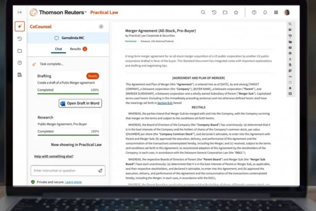
  </a>
  <figcaption><strong>Thomson Reuters CoCounsel :</strong> la progression de la rédaction et de la recherche apparaît avant l’ouverture dans Word. L’IA lit, trouve des fondements et rédige ; le professionnel contrôle et finalise.</figcaption>
</figure>

**Qui travaille :** analyse financière, fiscalité, droit, achats et conformité.

Contrats, factures, états, politiques, audits et diligences se ressemblent sans être identiques. L’IA extrait, compare, classe, cherche et rédige, mais la décision doit revenir au texte original et à une personne responsable.

L’enquête Thomson Reuters 2025 voit progresser recherche, résumés, contrats et préparation des déclarations. Moderna résume les contrats ; OpenAI et PwC abordent rapprochement, alerte et agents financiers entre systèmes. [Thomson Reuters: 2025 Generative AI in Professional Services](https://www.thomsonreuters.com/en-us/posts/technology/genai-professional-services-report-2025/) · [Cas Moderna](https://openai.com/index/moderna/) · [OpenAI × PwC : flux du CFO](https://openai.com/index/openai-pwc-finance-collaboration/)

Une petite équipe peut vérifier paiement, renouvellement, indemnité et données dans les contrats fournisseurs, avec citations et risques. Prouvez omissions, temps et précision avant de promettre un « service juridique IA ».

### 5. Développement logiciel : la valeur apparaît dans le dépôt

<figure class="product-shot">
  <a href="https://github.blog/changelog/2024-10-29-github-copilot-code-review-in-github-com-private-preview/" target="_blank" rel="noreferrer">
    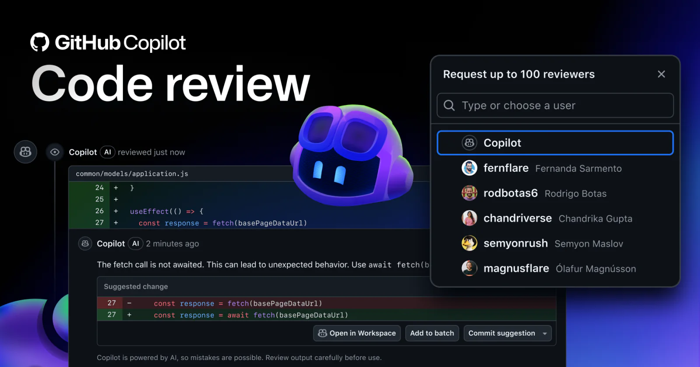
  </a>
  <figcaption><strong>GitHub Copilot Code Review :</strong> le commentaire s’attache à la ligne et peut proposer une modification. Le développeur inspecte, regroupe ou refuse. La valeur est dans la Pull Request, pas dans un autre chat.</figcaption>
</figure>

**Qui travaille :** développement, test, opérations et sécurité.

Le temps part dans la compréhension de l’ancien code, les tests, les journaux, les revues et les dépôts inconnus. Dans l’expérience contrôlée de GitHub, Copilot accélérait une tâche ; en équipe réelle, contexte, règles et tests comptent davantage que la génération. [Étude de productivité GitHub Copilot](https://github.blog/news-insights/research/research-quantifying-github-copilots-impact-on-developer-productivity-and-happiness/) · [Rapport suivant de GitHub](https://github.blog/wp-content/uploads/2023/06/Sea-Change-in-Software-Dev.pdf)

Un outil interne peut partir d’une CI en échec : lire l’erreur et les changements, trouver les causes, proposer une correction et préparer un patch à revoir. Il doit exécuter les tests, montrer le diff et accepter la revue, sans pousser en production.

### 6. Industrie et service de terrain : réunir équipement, manuel et intervention

<figure class="product-shot">
  <a href="https://blog.siemens.com/2026/02/the-digital-enterprise-and-the-synthesis-of-industrial-ai-digital-twin-and-data/" target="_blank" rel="noreferrer">
    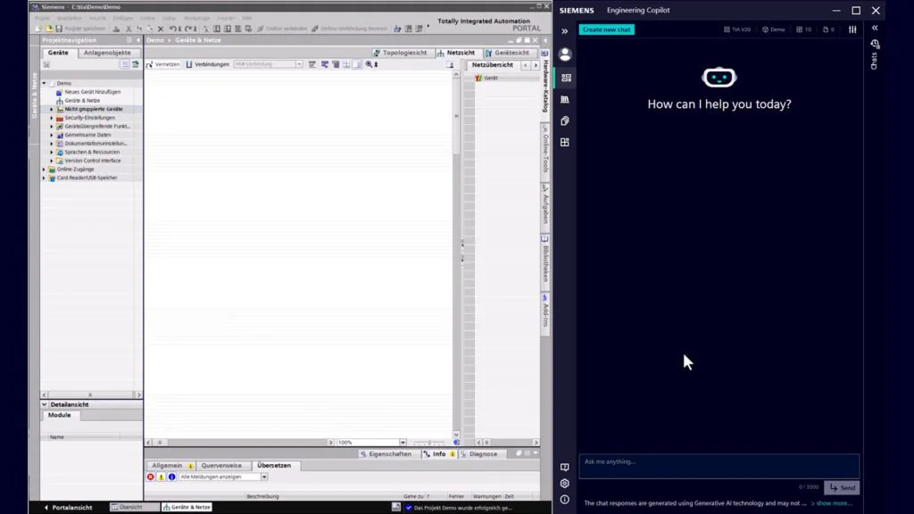
  </a>
  <figcaption><strong>Siemens Engineering Copilot :</strong> Copilot et TIA Portal sont ouverts ensemble. L’assistant voit le projet, l’équipement et les documents actuels au lieu de répondre sans contexte à « pourquoi la machine est-elle en panne ? »</figcaption>
</figure>

**Qui travaille :** opérateurs, maintenance, service de terrain et procédés.

Quand une machine s’arrête, l’opérateur ne voit parfois qu’un code. La réponse se trouve dans des centaines de pages, des pièces et l’historique, tandis que la perte augmente à la minute. Après réparation, il reste un rapport lisible et archivable à écrire.

Siemens Industrial Copilot explique l’équipement, retrouve des sources de maintenance et aide à programmer l’automatisation. Un autre essai transforme les notes de plus de 1,4 million d’interventions annuelles en rapports cohérents. Deloitte relève aussi le contexte et la qualité des données. [Siemens Industrial Copilot](https://news.microsoft.com/source/emea/features/how-ai-is-helping-siemens-and-thyssenkrupp-bridge-skilling-gaps-in-manufacturing/) · [Cas des rapports Siemens](https://www.microsoft.com/en/customers/story/19736-siemens-ag-germany-dynamics-365-field-service) · [Deloitte: 2025 Smart Manufacturing Survey](https://www2.deloitte.com/us/en/insights/industry/manufacturing/2025-smart-manufacturing-survey.html)

Commencez par un équipement, pas « prévoir toute l’usine » : identifier le code, retrouver manuel et interventions, proposer un ordre de diagnostic puis rédiger le rapport. Chaque suggestion montre sa source et peut être marquée inutile.

### 7. En santé, commencer par le dossier et la coordination, pas par une démo de diagnostic

<figure class="product-shot">
  <a href="https://www.abridge.com/product" target="_blank" rel="noreferrer">
    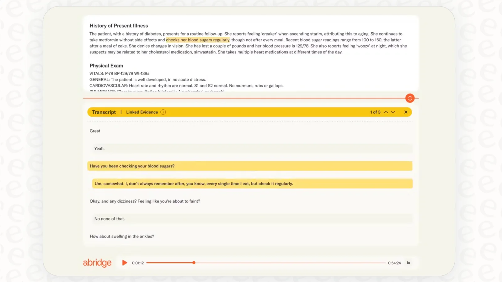
  </a>
  <figcaption><strong>Abridge :</strong> la note générée renvoie à la conversation correspondante. L’essentiel n’est pas la vitesse, mais la possibilité pour le médecin de tracer, modifier et valider chaque entrée.</figcaption>
</figure>

**Qui travaille :** médecins, infirmiers, dossiers, assurance et service patient.

Une grande charge se trouve hors diagnostic : dossier, orientation, autorisation, remboursement et communication. Les usages proches de McKinsey portent sur résumé, droits, refus, sortie et opérations, pas sur le diagnostic autonome. [McKinsey: Tackling Healthcare's Biggest Burdens with Generative AI](https://www.mckinsey.com/industries/healthcare/our-insights/tackling-healthcares-biggest-burdens-with-generative-ai)

Abridge crée un brouillon structuré depuis la conversation et le médecin le valide. La limite brouillon–revue–dossier réduit l’écriture sans changer la responsabilité clinique. [Cas Abridge](https://www.abridge.com/press-release/abridge-hartford-healthcare) · [McKinsey: Generative AI in Healthcare](https://www.mckinsey.com/industries/healthcare/our-insights/generative-ai-in-healthcare-current-trends-and-future-outlook)

Sans partenaire clinique, données et conformité, ne commencez pas par le diagnostic. Étudiez un service moins risqué : transformer la préparation en étapes ou aider à classer les appels, toujours avec validation de l’établissement.

### 8. Commerce et contenu : une ressource doit parcourir plusieurs canaux

<figure class="product-shot">
  <a href="https://www.canva.com/newsroom/news/magic-studio/" target="_blank" rel="noreferrer">
    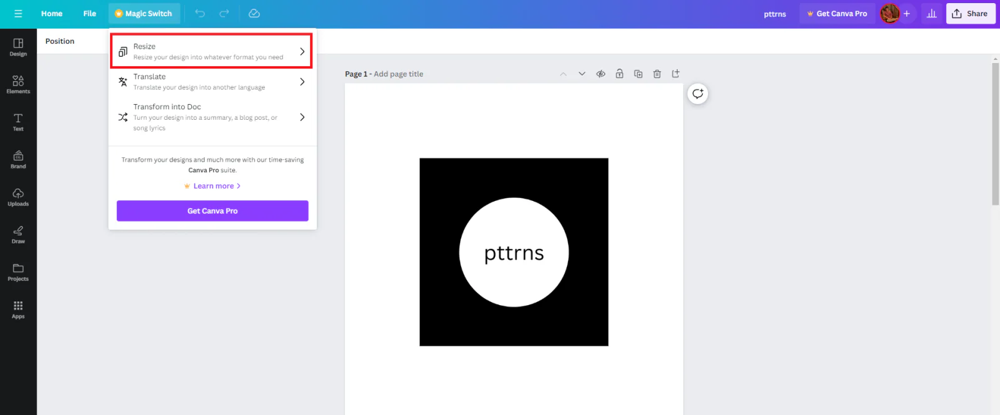
  </a>
  <figcaption><strong>Canva Magic Switch :</strong> un design validé change de taille, de langue ou devient un document. C’est le travail fréquent consistant à créer plusieurs versions d’une même ressource.</figcaption>
</figure>

**Qui travaille :** e-commerce, marque, design, produit et localisation.

Un lancement exige de comprendre les données, écrire par canal, traiter les images, adapter les tailles, traduire, vérifier les expressions et mettre à jour. Une grande partie du temps part dans le déplacement et la cohérence.

Deloitte cite personnalisation, opérations, chaîne logistique et marketing. Canva adapte taille et langue, Firefly réunit génération, édition et ressources. L’IA ne remplace pas le jugement de marque ; elle réduit les versions mécaniques. [Deloitte: 2025 Retail Industry Outlook](https://www.deloitte.com/us/en/insights/industry/retail-distribution/retail-distribution-industry-outlook-2025.html) · [Canva Magic Studio](https://www.canva.com/newsroom/news/magic-studio/) · [Adobe Firefly](https://news.adobe.com/news/2025/04/adobe-revolutionizes-ai-assisted-creativity-firefly)

La première version sert un canal et un type de produit : brouillon depuis des données, vérification des champs, tailles et expressions, publication par l’opérateur. Elle recueille de meilleurs retours qu’un « assistant universel ».

## Grand public : sept moments où la personne ouvre elle-même le produit

L’erreur la plus simple consiste à placer sept prompts dans le même chat. Ces produits fonctionnent car derrière la conversation se trouvent produits, cours, voyages, toile, musique ou données financières permettant de poursuivre.

### 1. « Réduis mes choix » : recherche, comparaison et achat

<figure class="product-shot product-shot--mobile">
  <a href="https://www.aboutamazon.com/news/retail/amazon-rufus" target="_blank" rel="noreferrer">
    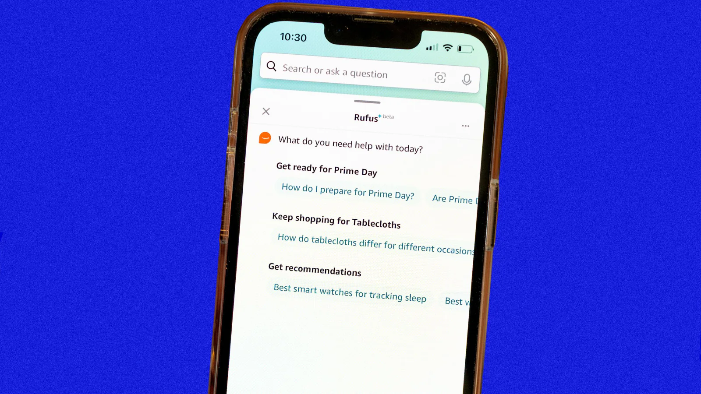
  </a>
  <figcaption><strong>Amazon Rufus :</strong> placé sous la recherche, il traite comparaisons, Prime Day et montres de sommeil. Il mène à de vrais produits, pas à un conseil général.</figcaption>
</figure>

Pour un appareil photo, une poussette ou des chaussures de pluie, les fiches ne manquent pas ; il faut convertir des contraintes floues en choix comparables. Rufus combine catalogue, avis et Q&R ; Capgemini et Adobe observent aussi découverte et conseil d’achat par IA. [Amazon Rufus](https://www.aboutamazon.com/news/retail/amazon-rufus) · [Adobe: 2025 AI and Digital Trends](https://business.adobe.com/content/dam/dx/us/en/resources/digital-trends-report-2025/2025_Digital_Trends_Report.pdf)

Étudiez une catégorie difficile, pas « l’achat par IA ». Pour un projecteur en location, il faut distance, lumière, bruit et budget. Montrez fondements, inconnues et vrais produits plutôt qu’une conclusion inventée.

### 2. « Je ne veux pas vingt onglets » : voyage et changements sur place

<figure class="product-shot">
  <a href="https://www.expedia.com/newsroom/expedia-launches-conversational-trip-planning-powered-by-chatgpt-to-inspire-members-to-dream-about-travel-in-new-ways/" target="_blank" rel="noreferrer">
    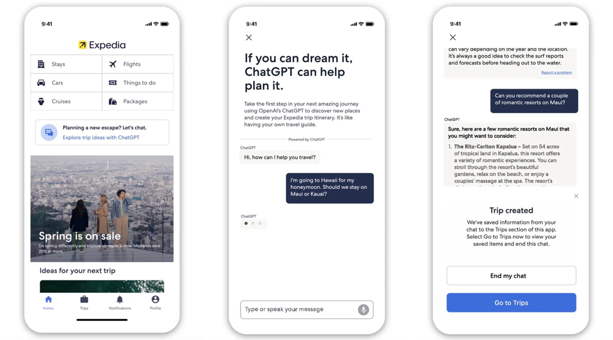
  </a>
  <figcaption><strong>Planification Expedia :</strong> une lune de miel compare Maui et Kauai puis enregistre les hôtels dans Trips. La boucle se ferme quand le chat arrive à la sauvegarde, à l’itinéraire et à la réservation.</figcaption>
</figure>

Le voyage combine destination, date, transport, horaires, budget et préférences. Expedia relie conversation, hôtels, prix et réservation. La valeur n’est pas un beau récit, mais un itinéraire sauvegardable, vérifiable et achetable. [Planification Expedia](https://www.expedia.com/newsroom/expedia-launches-conversational-trip-planning-powered-by-chatgpt-to-inspire-members-to-dream-about-travel-in-new-ways/) · [Cas de service Expedia](https://www.expedia.com/newsroom/expedia-group-sets-the-standard-with-ai-powered-service-agent/)

Commencez plus petit : « demi-journée avec des enfants » ou « trajet de nuit après un spectacle ». Météo, prix et horaires exigent des API fiables et une date de mise à jour.

### 3. « Je veux pratiquer, pas seulement écouter » : apprentissage et retour

<figure class="product-shot product-shot--portrait">
  <a href="https://blog.duolingo.com/duolingo-max/" target="_blank" rel="noreferrer">
    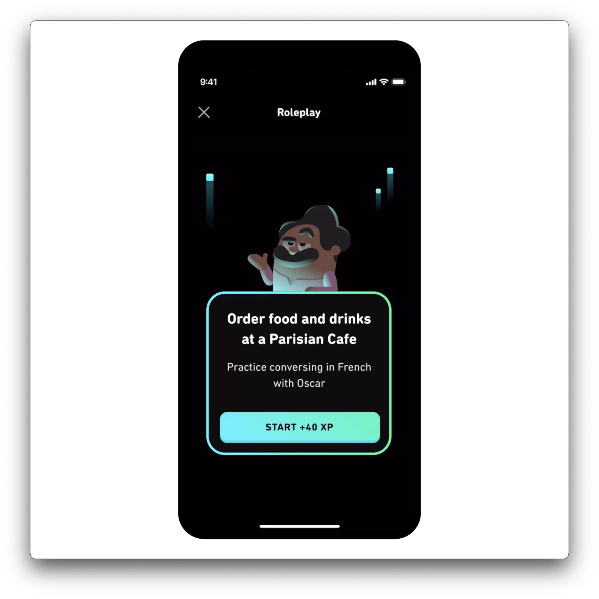
  </a>
  <figcaption><strong>Duolingo Max Roleplay :</strong> non pas « parle français », mais « commande dans un café parisien ». Scène, rôle, objectif et récompense permettent une pratique immédiate.</figcaption>
</figure>

L’IA rend disponible une étape auparavant chère : pratiquer quand on veut et recevoir un retour sur cet essai. Duolingo emploie jeu de rôle et vidéo ; Khanmigo guide par questions et indices au lieu de donner la réponse. [Duolingo Max](https://blog.duolingo.com/duolingo-max/) · [Khan Academy: Khanmigo](https://2023-2024.annualreport.khanacademy.org/khanmigo)

Un produit peut servir un geste : entretien, oral, objection commerciale ou soutenance. Le retour cite la phrase et propose une amélioration exécutable au prochain essai.

### 4. « Donne-moi un brouillon modifiable » : création personnelle

<figure class="product-shot">
  <a href="https://firefly.adobe.com/" target="_blank" rel="noreferrer">
    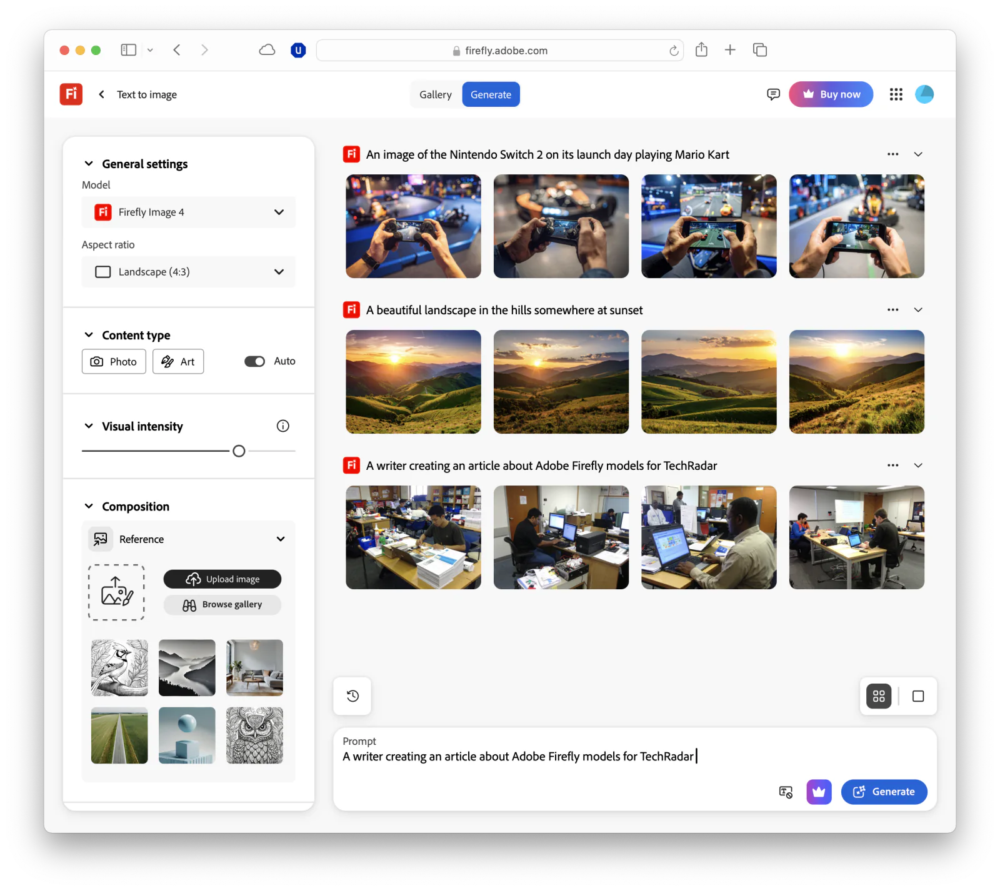
  </a>
  <figcaption><strong>Adobe Firefly :</strong> modèle, ratio, type, intensité, référence et plusieurs résultats entourent le prompt. Un produit créatif donne des contrôles pour continuer.</figcaption>
</figure>

Invitation, photo d’occasion, miniature ou affiche se heurtent à la toile vide et au logiciel complexe. Canva réunit génération, détourage, extension, taille et traduction ; Firefly continue entre image, vidéo, audio et vecteur. [Canva Magic Studio](https://www.canva.com/newsroom/news/magic-studio/) · [Annonce Adobe Firefly](https://news.adobe.com/news/2025/04/adobe-revolutionizes-ai-assisted-creativity-firefly)

Donnez du contrôle, pas seulement « générer à nouveau ». Définissez l’objet —photos immobilières, couverture de podcast, affiche en trois tailles— et verrouillez texte, personnes et couleurs.

### 5. « Qu’est-ce qui était faux cette fois ? » : explication personnalisée

<figure class="product-shot">
  <a href="https://blog.duolingo.com/duolingo-max/" target="_blank" rel="noreferrer">
    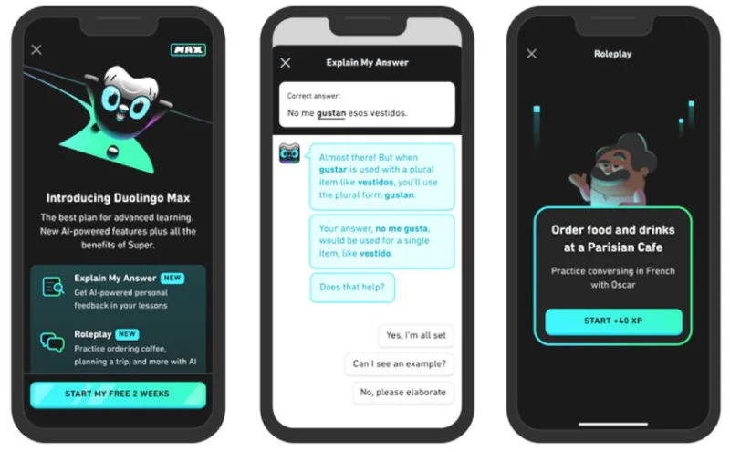
  </a>
  <figcaption><strong>Explain My Answer :</strong> la réponse est citée, la règle de gustan avec vestidos expliquée et d’autres exemples restent disponibles. Le produit répond au moment précis de l’erreur.</figcaption>
</figure>

Une même réponse demande une explication différente selon le niveau. Explain My Answer part de l’erreur qui vient d’être faite et connaît déjà question, réponse et progression. [Duolingo: Explain My Answer](https://blog.duolingo.com/explain-my-answer-now-free/)

Le principe vaut pour le sport, l’appareil photo, les échecs ou la musique : partir d’une performance réelle et choisir une amélioration. Sans donnée personnelle, le « conseil personnalisé » reste général.

### 6. « Ne recommande pas seulement, souviens-toi » : musique et expérience continue

<figure class="product-shot product-shot--mobile">
  <a href="https://newsroom.spotify.com/2023-02-22/spotify-debuts-a-new-ai-dj-right-in-your-pocket/" target="_blank" rel="noreferrer">
    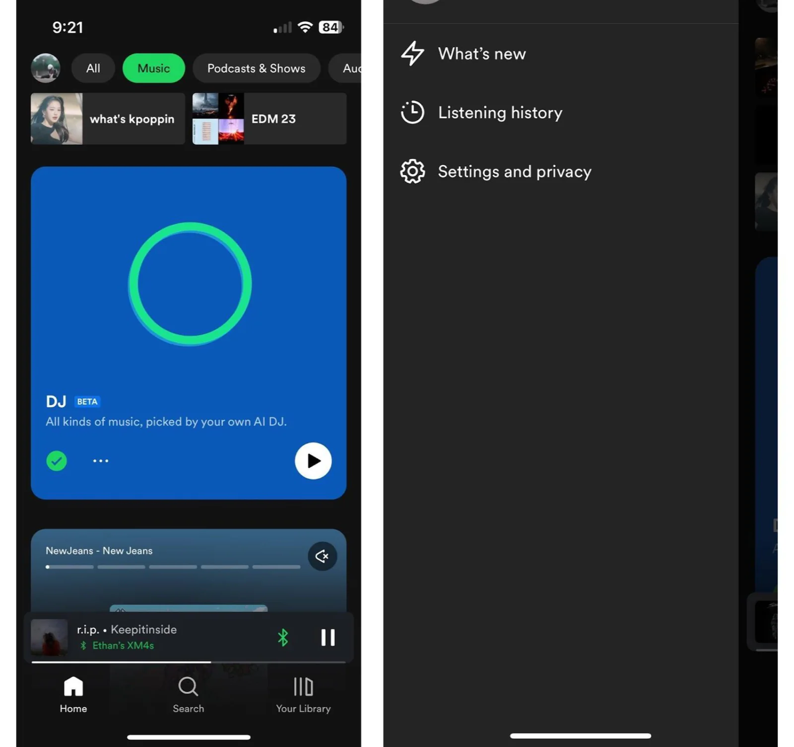
  </a>
  <figcaption><strong>Spotify AI DJ :</strong> une entrée persistante en accueil mène aux morceaux et contrôles. Elle dépend de l’historique, du catalogue et de l’action de lecture, pas seulement d’une voix.</figcaption>
</figure>

AI DJ choisit depuis l’historique et relie l’expérience par une voix continue. Les préférences, les droits et l’action de lecture sont plus difficiles à copier que le ton. [Spotify AI DJ](https://newsroom.spotify.com/2023-02-22/spotify-debuts-a-new-ai-dj-right-in-your-pocket/) · [Deloitte: 2025 Digital Media Trends](https://www.deloitte.com/us/en/insights/industry/technology/digital-media-trends-consumption-habits-survey/2025.html)

La course, la cuisine ou la lecture du soir sont aussi continues. Adaptez la prochaine séance aux choix passés et rendez la correction facile sans prétendre mieux connaître la personne.

### 7. « Transforme une règle complexe en prochaine étape » : finances et démarches

<figure class="product-shot product-shot--portrait">
  <a href="https://turbotax.intuit.com/personal-taxes/mobile-apps/turbotax/" target="_blank" rel="noreferrer">
    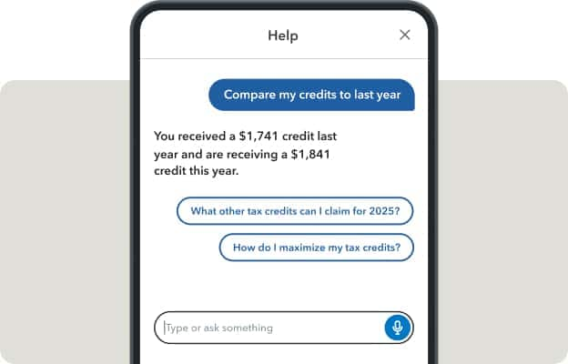
  </a>
  <figcaption><strong>Intuit Assist dans TurboTax :</strong> il compare les crédits de cette année et de la précédente puis propose « quels autres crédits ? ». La base est la donnée personnelle et la tâche actuelle.</figcaption>
</figure>

Impôts, crédit, assurance et factures ont des règles complexes, des documents dispersés et des étapes différentes. Intuit Assist relie les données de TurboTax, Credit Karma et QuickBooks à une explication et une action. [Intuit Assist](https://www.intuit.com/intuitassist/)

Le risque est plus élevé. La première version convient aux listes, explications, classements et rappels, en séparant faits, estimations et conseils. Déclaration, investissement ou assurance exigent confirmation et accès à un professionnel.

## Où trouver sa propre direction d’entreprise ou grand public

Les cas enseignent une forme ; ils ne demandent pas de changer le nom du secteur. Votre direction se cache parmi les personnes, documents et habitudes accessibles. Les deux recherches commencent différemment.

### Entreprise : suivre un rôle jusqu’au bout

Un document professionnel n’annonce pas « occasion de start-up ». Il apparaît dans les offres d’emploi, achats, manuels, avis et projets. Choisissez un rôle concret —commerce extérieur, accueil immobilier, réception médicale, maintenance— et suivez son travail.

  

    Où chercher les flux professionnels
    <ul>
      <li><strong>Emploi :</strong> responsabilités, systèmes, tableaux et rapports quotidiens.</li>
      <li><strong>Appels d’offres :</strong> problèmes payés, critères d’acceptation et limites du système.</li>
      <li><strong>Avis logiciel :</strong> sur G2, Capterra, boutiques et forums, cherchez « exporter vers Excel » et « compléter à la main ».</li>
      <li><strong>Cas et rapports annuels :</strong> combinez le nom de l’entreprise avec transformation, efficacité ou service.</li>
      <li><strong>Vrais documents :</strong> tickets, devis, contrôles, messages et formation sont plus proches du produit qu’un rapport.</li>
    </ul>
  

  

    Requêtes directes
    
<code>flux quotidien technicien maintenance</code>

    
<code>service immobilier appel offres automatisation filetype:pdf</code>

    
<code>site:g2.com field service software reviews</code>

    
<code>customer support workflow pain points report</code>

    
<code>secteur transformation numérique cas rapport annuel</code>

  

Pour le commerce extérieur, ne cherchez pas seulement « IA + export ». Relevez dans les offres réponse, devis, spécification, délai et douane, puis étudiez un vrai devis et de mauvais avis. « Préparer un devis à confirmer depuis prix et paramètres historiques » peut valoir davantage qu’un assistant universel.

### Grand public : parcourir une journée et chercher les frictions répétées

La recherche commence quand quelqu’un prend son téléphone. Parmi recherche, comparaison, note, exercice, attente et partage, qu’est-ce qui revient chaque semaine ? Que termine-t-on mal avec captures, notes, favoris ou groupe ?

  

    Où chercher les moments grand public
    <ul>
      <li><strong>App Store et Android :</strong> avis d’une à trois étoiles, fonctions absentes, paiement et abandon.</li>
      <li><strong>Réseaux et Reddit :</strong> cherchez « comment », « existe-t-il un outil » et « recommandation » ; les commentaires donnent les contraintes.</li>
      <li><strong>Product Hunt et classements :</strong> petite action résolue et prochaine demande.</li>
      <li><strong>Tendances et trafic :</strong> Google Trends, QuestMobile, iResearch et rapports confirment une habitude durable.</li>
      <li><strong>Vos photos et favoris :</strong> captures répétées, guides jamais rouverts et textes copiés sont des flux inachevés.</li>
    </ul>
  

  

    Requêtes directes
    
<code>site:reddit.com "I wish there was an app"</code>

    
<code>voyager enfants planification trop difficile</code>

    
<code>application budget difficile avis</code>

    
<code>Product Hunt AI language learning</code>

    
<code>croissance utilisateurs applications IA rapport</code>

  

Si vous voyagez souvent, ne construisez pas immédiatement un « itinéraire IA ». Découvrez pourquoi dix guides sont enregistrés : fermeture, personne âgée, retour sûr après un concert. Choisissez un moment récurrent pour obtenir un outil ouvert, pas un article généré.

### Ne pas écrire de code dès que les documents sont trouvés

Conservez trois preuves : un document qui montre le flux, la même difficulté citée par trois personnes et une solution de remplacement qui coûte déjà du temps ou de l’argent. Puis consacrez soixante minutes à la préciser.

  
<b>01</b>Nommer une personne
En entreprise, un rôle ; au grand public, une situation de vie. « Utilisateur d’entreprise » et « jeune » sont insuffisants.

  
<b>02</b>Observer une occurrence
Obtenir tableau, enregistrement, mauvais avis ou action réelle et localiser le blocage.

  
<b>03</b>Le trouver trois fois
Le problème doit venir de trois personnes ou sources, pas d’une plainte amusante.

  
<b>04</b>Prendre une seule étape
Définir entrée, sortie, validateur et mesure avant de choisir l’IA.

Enfin, écrivez une phrase qu’une autre personne peut imaginer :

> Quand **qui** rencontre **quel moment**, il utilise aujourd’hui **quels documents ou astuces** pour accomplir **quelle tâche**. Je confie d’abord **une étape** à l’IA, fais valider par **qui** et mesure **quel changement**.

Exemple d’entreprise :

> Quand l’opérateur de ligne voit l’erreur E37, il consulte le manuel papier et les anciennes interventions. Le système retrouve la section et trois contrôles pour le modèle ; un technicien les valide. L’essai mesure le temps d’arrêt moyen.

Exemple grand public :

> Quand un parent visite un musée avec son enfant, il assemble publications, cartes et avis. Le produit prépare trois heures selon l’âge et le temps, cite horaires et prix et ajoute au calendrier après validation.

À ce niveau de précision, l’idée peut faire l’objet d’entretiens, d’un prototype et d’un petit essai.

## Sources

La liste réunit **67 sources**. Le texte privilégie les méthodes claires et les cas directs ; les rapports boursiers chinois servent à observer des thèmes commerciaux, pas à prendre une opinion d’investissement pour une demande. Les cas fournisseurs doivent être recoupés avec entretiens et données réelles.

1. Adoption générale et valeur en entreprise (15)

1. [McKinsey：The Economic Potential of Generative AI](https://www.mckinsey.com/capabilities/mckinsey-digital/our-insights/the-economic-potential-of-generative-ai-the-next-productivity-frontier)
2. [McKinsey：The State of AI 2025](https://www.mckinsey.com/capabilities/quantumblack/our-insights/the-state-of-ai)
3. [PwC：2025 Global AI Jobs Barometer](https://www.pwc.com/gx/en/issues/c-suite-insights/the-leadership-agenda/AI-jobs-barometer.html)
4. [PwC：Global Workforce Hopes and Fears Survey 2025](https://www.pwc.com/gr/en/publications/specific-to-all-industries-index/hopes-and-fears-2025.html)
5. [Deloitte：State of Generative AI in the Enterprise](https://www2.deloitte.com/us/en/pages/about-deloitte/articles/press-releases/state-of-generative-ai.html)
6. [Microsoft：2025 Work Trend Index](https://www.microsoft.com/en-us/worklab/work-trend-index/2025-the-year-the-frontier-firm-is-born)
7. [IBM：5 Trends for 2025](https://www.ibm.com/thought-leadership/institute-business-value/en-us/report/business-trends-2025)
8. [IBM：2025 CDO Study](https://www.ibm.com/thought-leadership/institute-business-value/en-us/report/2025-cdo)
9. [Cisco：2025 AI Readiness Index](https://www.cisco.com/c/m/en_us/solutions/ai/readiness-index/realizing-the-value-of-ai.html)
10. [EY：2025 AI Pulse Survey](https://www.ey.com/en_us/insights/emerging-technologies/pulse-ai-survey)
11. [Accenture：Reinventing Enterprise Models in the Age of Gen AI](https://www.accenture.com/us-en/insights/artificial-intelligence/ai-investments)
12. [Accenture：Making Reinvention Real with Gen AI](https://www.accenture.com/us-en/insights/consulting/making-reinvention-real-with-gen-ai)
13. [OpenAI：The State of Enterprise AI 2025](https://openai.com/business/guides-and-resources/the-state-of-enterprise-ai-2025-report/)
14. [中国信通院：《人工智能发展报告（2024 年）》](https://hrssit.cn/Uploads/file/20241217/1734400434600250.pdf)
15. [CNNIC：《生成式人工智能应用发展报告（2025）》](https://www3.cnnic.cn/n4/2025/1021/c88-11391.html)

2. Secteurs, rôles et flux professionnels (24)

16. [McKinsey：Unlocking Profitable B2B Growth Through Gen AI](https://www.mckinsey.com/capabilities/growth-marketing-and-sales/our-insights/unlocking-profitable-b2b-growth-through-gen-ai)
17. [McKinsey：Capturing the Full Value of Generative AI in Banking](https://www.mckinsey.com/industries/financial-services/our-insights/capturing-the-full-value-of-generative-ai-in-banking)
18. [McKinsey：The AI-powered Bank—Customer Care](https://www.mckinsey.com/industries/financial-services/our-insights/the-ai-powered-bank-rewiring-for-excellence-in-customer-care)
19. [McKinsey：The Future of AI in Insurance](https://www.mckinsey.com/industries/financial-services/our-insights/the-future-of-ai-in-the-insurance-industry)
20. [McKinsey：Tackling Healthcare’s Biggest Burdens with Generative AI](https://www.mckinsey.com/industries/healthcare/our-insights/tackling-healthcares-biggest-burdens-with-generative-ai)
21. [McKinsey：Generative AI in Healthcare](https://www.mckinsey.com/industries/healthcare/our-insights/generative-ai-in-healthcare-current-trends-and-future-outlook)
22. [Deloitte：2025 Manufacturing Industry Outlook](https://www.deloitte.com/us/en/insights/industry/manufacturing-industrial-products/manufacturing-industry-outlook/2025.html)
23. [Deloitte：2025 Smart Manufacturing Survey](https://www2.deloitte.com/us/en/insights/industry/manufacturing/2025-smart-manufacturing-survey.html)
24. [Deloitte：2025 Retail Industry Outlook](https://www.deloitte.com/us/en/insights/industry/retail-distribution/retail-distribution-industry-outlook-2025.html)
25. [Deloitte：2025 Global Health Care Outlook](https://www.deloitte.com/content/dam/assets-zone1/tw/en/docs/industries/life-sciences-health-care/2025/2025-healthcare-outlook-en.pdf)
26. [Accenture：Commercial Banking Trends 2024](https://www.accenture.com/content/dam/accenture/final/accenture-com/document-2/Accenture-Commercial-Banking-Trends-2024.pdf)
27. [Accenture：Banking Trends 2026](https://www.accenture.com/us-en/insights/banking/accenture-banking-trends-2026)
28. [Thomson Reuters：2025 Generative AI in Professional Services](https://www.thomsonreuters.com/en-us/posts/technology/genai-professional-services-report-2025/)
29. [Salesforce：State of Service 2025](https://www.salesforce.com/news/stories/state-of-service-report-announcement-2025/)
30. [Salesforce：State of Sales 2026](https://www.salesforce.com/en/wp-content/uploads/sites/4/documents/reports/sales/salesforce-state-of-sales-report-2026.pdf)
31. [Adobe：2025 AI and Digital Trends](https://business.adobe.com/content/dam/dx/us/en/resources/digital-trends-report-2025/2025_Digital_Trends_Report.pdf)
32. [Adobe：2025 Content Creation and Management](https://business.adobe.com/content/dam/dx/us/en/resources/reports/content-management-digital-trends/2025-ai-and-digital-trends-content-creation-and-management.pdf)
33. [艾瑞咨询：《2025 年中国企业级 AI 应用行业研究报告》](https://www.bsia.org.cn/site/content/31686.html)
34. [GitHub：Quantifying Copilot’s Impact on Developer Productivity](https://github.blog/news-insights/research/research-quantifying-github-copilots-impact-on-developer-productivity-and-happiness/)
35. [Siemens × Microsoft：Industrial Copilot](https://news.microsoft.com/source/2024/10/24/siemens-and-microsoft-scale-industrial-ai/)
36. [Abridge：Hartford HealthCare Ambient AI 案例](https://www.abridge.com/press-release/abridge-hartford-healthcare)
37. [AWS：Sun Life 内部知识助手](https://aws.amazon.com/solutions/case-studies/sun-life-case-study/)
38. [AWS：ResultsCX 客服自动化](https://aws.amazon.com/solutions/case-studies/resultscx/)
39. [AWS：Sanofi 企业 AI 助手](https://aws.amazon.com/solutions/case-studies/sanofi-bedrock-case-study/)

3. Produits déployés et cas d’entreprise (10)

40. [OpenAI：Morgan Stanley](https://openai.com/index/morgan-stanley/)
41. [OpenAI：Klarna](https://openai.com/index/klarna/)
42. [OpenAI：Moderna](https://openai.com/index/moderna/)
43. [OpenAI：BBVA](https://openai.com/index/bbva-2025/)
44. [OpenAI × PwC：Reimagining the Office of the CFO](https://openai.com/index/openai-pwc-finance-collaboration/)
45. [Microsoft：Siemens 现场服务报告](https://www.microsoft.com/en/customers/story/19736-siemens-ag-germany-dynamics-365-field-service)
46. [AWS：Legal & General 文档处理](https://aws.amazon.com/solutions/case-studies/aws-innovator-legal-and-general/)
47. [AWS × Infosys：医疗保险客服助手](https://aws.amazon.com/blogs/apn/how-infosys-built-aws-generative-ai-based-assistant-for-a-healthcare-payer-company/)
48. [Notion：Notion AI 功能说明](https://www.notion.com/help/notion-ai-faqs)
49. [Canva：Magic Studio](https://www.canva.com/newsroom/news/magic-studio/)

4. Grand public et produits (13)

50. [Capgemini：What Matters to Today’s Consumer 2025](https://www.capgemini.com/insights/research-library/top-consumer-trends-in-2025/)
51. [Accenture：Me, My Brand and AI](https://www.accenture.com/us-en/insights/consulting/me-my-brand-ai-new-world-consumer-engagement)
52. [Deloitte：2025 Digital Media Trends](https://www.deloitte.com/us/en/insights/industry/technology/digital-media-trends-consumption-habits-survey/2025.html)
53. [QuestMobile：2025 中国移动互联网春季报告](https://www.questmobile.cn/research/report/1919961024158601218/)
54. [QuestMobile：2025 年 8 月 AI 应用行业报告](https://www.questmobile.com.cn/research/report/1967853261412208641/)
55. [艾瑞咨询：《2025 年中国 AI 类 App 流量分析报告》](https://www.etc.org.cn/UserFiles/Article/file/6388341575962762472758248.pdf)
56. [Amazon：Rufus 购物助手](https://www.aboutamazon.com/news/retail/amazon-rufus)
57. [Expedia：对话式旅行规划](https://www.expedia.com/newsroom/expedia-launches-conversational-trip-planning-powered-by-chatgpt-to-inspire-members-to-dream-about-travel-in-new-ways/)
58. [Duolingo：Duolingo Max](https://blog.duolingo.com/duolingo-max/)
59. [Khan Academy：Khanmigo](https://2023-2024.annualreport.khanacademy.org/khanmigo)
60. [Spotify：AI DJ](https://newsroom.spotify.com/2023-02-22/spotify-debuts-a-new-ai-dj-right-in-your-pocket/)
61. [Intuit：Intuit Assist](https://www.intuit.com/intuitassist/)
62. [Adobe：Firefly](https://news.adobe.com/news/2025/04/adobe-revolutionizes-ai-assisted-creativity-firefly)

5. Point de vue des sociétés de courtage chinoises (5)

63. [华鑫证券：WAIC 大会强供给，AI 应用商业化如何解](https://pdf.dfcfw.com/pdf/H3_AP202507291717868704_1.pdf)
64. [国信证券：人工智能专题——AI Agent](https://pdf.dfcfw.com/pdf/H3_AP202503121644302597_1.pdf)
65. [东吴证券：2025 年 AI 应用渗透趋势](https://pdf.dfcfw.com/pdf/H301_AP202501021641518997_1.pdf)
66. [中银证券：“人工智能+”应用与平台](https://pdf.dfcfw.com/pdf/H3_AP202510201765533690_1.pdf)
67. [AIGC 行业深度：算力、模型与应用的创新融合](https://pdf.dfcfw.com/pdf/H3_AP202411151640914780_1.pdf)

Sources recherchées et organisées en août 2026. Les pourcentages dépendent de l’échantillon, de la région et de la définition du fournisseur ; ils ne remplacent pas les entretiens et essais auprès du public visé.

