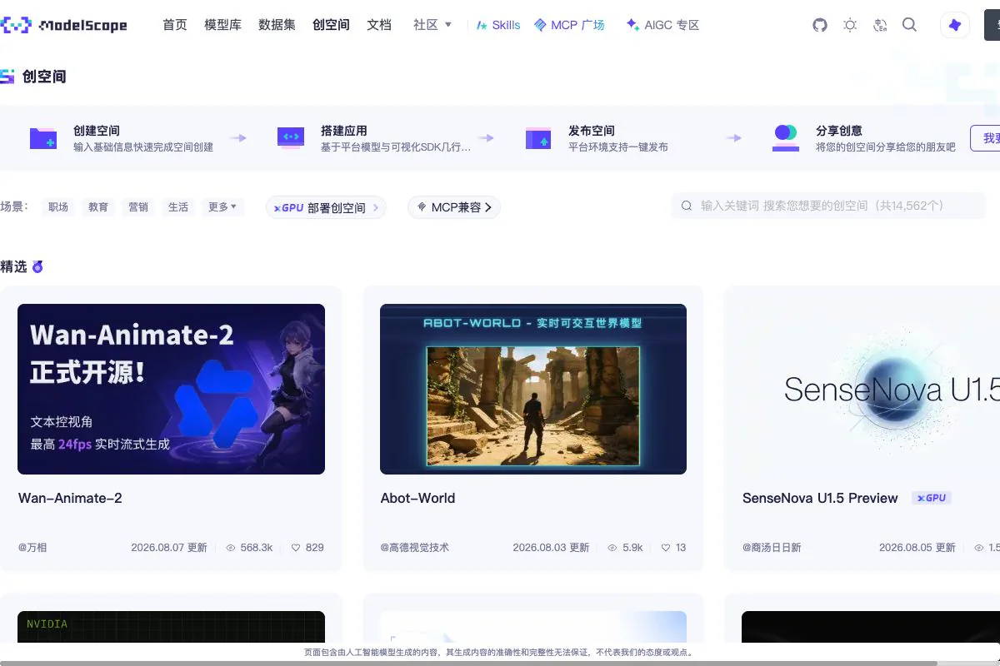
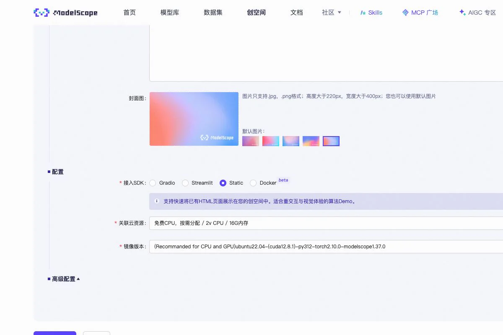

# Publier votre projet Vibe Coding sur ModelScope

Lorsque votre page fonctionne en local, il faut une adresse que vos amis, vos camarades ou de vrais utilisateurs puissent ouvrir.

Vous pourriez louer un serveur et configurer le domaine, HTTPS et le déploiement. Dans cette leçon, nous réduisons ce travail et publions le site sur **ModelScope Studio**.

ModelScope est une communauté open source lancée par Alibaba avec le comité CCF chargé du développement open source. Outre plus de 200 000 modèles open source et 30 000 jeux de données, elle propose des **Studios** pour présenter des applications. Un Studio permet d’obtenir gratuitement une adresse partageable sans devoir apprendre d’abord l’administration de serveurs.

> Ce guide a été vérifié avec l’interface actuelle, les Skills officiels et la documentation en ligne de commande le **11 août 2026**. Les boutons peuvent changer de place, mais le parcours reste : créer un Static Studio, importer le résultat compilé, déployer et tester le lien.

En plus de Gradio, Streamlit et Docker, Studio prend en charge le type `static` pour les sites déjà compilés. Si le résultat final contient `index.html`, du CSS, du JavaScript et des images, choisissez ce type.

L’adresse publiée ressemble à ceci :

```text
https://modelscope.cn/studios/votre-nom/votre-studio
```

## Choisir la bonne méthode de publication

| Projet | Type de Studio | Préparation |
| --- | --- | --- |
| HTML, CSS et JavaScript | **Static** | Préparer les fichiers, sans compilation |
| Vue, React, Vite ou Svelte | **Static** | Compiler en local et publier uniquement le contenu de `dist` ou `build` |
| Gradio | Gradio | Préparer `app.py` et `requirements.txt` |
| Streamlit | Streamlit | Préparer le fichier d’entrée et les dépendances |
| Backend ou paquets système particuliers | Docker | Écrire un Dockerfile et écouter le port demandé |

Ce chapitre traite les deux premières lignes. **N’importez pas le code source Vue ou React comme site Static.** Le navigateur d’un visiteur ne lancera pas `npm install` ni `npm run build`.

## Méthode recommandée : le Skill officiel

ModelScope maintient des [Skills officiels](https://github.com/modelscope/modelscope-skills).

| Skill | Rôle | Quand l’utiliser |
| --- | --- | --- |
| `ms-hub` | Entrée commune pour dépôts, modèles, données, Studios, MCP et Skills Center | Première connexion et opérations générales |
| `ms-studio-deploy` | Détection du projet, création du Studio, synchronisation Git, déploiement, journaux et diagnostic | **Choix prioritaire pour publier ou mettre à jour un site local** |

`ms-studio-deploy` reconnaît le type `static` lorsque `index.html` se trouve à la racine. Un Static Studio n’exécute pas `npm run build` : compilez donc les projets de framework sur votre machine.

### Installer les Skills

```bash
python -m pip install -U modelscope
modelscope skills add @ModelScope/ms-hub @ModelScope/ms-studio-deploy
```

Si la commande ne contient pas le sous-commande `skills`, utilisez le programme officiel :

```bash
curl -fsSL https://modelscope.cn/skills/install.sh | bash -s -- @ModelScope/ms-hub
curl -fsSL https://modelscope.cn/skills/install.sh | bash -s -- @ModelScope/ms-studio-deploy
```

Les Skills sont généralement installés dans `~/.agents/skills/`. Ouvrez ensuite une nouvelle session de Codex, Cursor, Claude Code ou d’un autre outil compatible afin d’actualiser la liste.

### Publier avec le Skill

Selon le [guide officiel de `ms-studio-deploy`](https://github.com/modelscope/modelscope-skills/blob/main/skills/ms-studio-deploy/SKILL.md), préparez trois éléments :

1. Le Skill installé et une nouvelle session de l’agent.
2. Le dossier à publier, avec `index.html` directement à la racine.
3. Un Access Token ModelScope configuré sur la machine.

Obtenez le jeton sur la page [Access Tokens](https://modelscope.cn/my/myaccesstoken) et configurez-le dans le terminal :

```bash
export MODELSCOPE_API_KEY="votre-jeton"
```

Pour du HTML simple, ouvrez directement le dossier. Pour Vue, React ou Vite, compilez puis entrez dans la sortie :

```bash
npm run build
cd dist
```

Vite crée généralement `dist`. Si votre outil crée `build`, ouvrez ce dossier. Ouvrez-le ensuite dans l’outil compatible Agent Skills.

#### La demande la plus courte

```text
Utilise le Skill ms-studio-deploy pour publier ce site dans un Static Studio ModelScope. Envoie-moi l’adresse lorsqu’il fonctionne.
```

Le Skill vérifie `index.html` et la connexion. S’il doit créer un Studio, il demande son nom et sa visibilité. Commencez en privé.

Vous pouvez aussi donner toutes les conditions :

```text
Utilise le Skill ms-studio-deploy pour publier ce dossier dans un Static Studio du site chinois de ModelScope.
Nomme le Studio my-portfolio et garde-le privé au début. Vérifie ensuite son état et ses journaux.
En cas d’échec, corrige la cause indiquée par les journaux, redéploie et renvoie l’adresse fonctionnelle.
```

#### Ce que l’IA fera ensuite

```text
détecter le projet → choisir le site chinois ou international → obtenir le compte
→ créer ou réutiliser un Studio → vérifier les fichiers sensibles → synchroniser vers master
→ lancer le déploiement → vérifier état et journaux → diagnostiquer et corriger → renvoyer l’adresse
```

Vérifiez d’abord en privé, puis rendez le Studio public. Un site Static ne demande pas de matériel payant. Pour toute ressource payante d’un autre type, le Skill doit obtenir votre accord explicite.

Le jeton sert à l’API et au Git push. Ne l’insérez pas dans le frontend, le README, une demande ou une capture partagée.

## Parcours manuel : Étape 0 — préparer le site

Le Skill est plus pratique, mais le parcours manuel aide à comprendre Studio et reste utile lorsque l’agent n’est pas disponible.

### Cas A : HTML simple

`index.html` doit se trouver à la racine du contenu publié :

```text
my-site/
├── index.html
├── styles.css
├── app.js
└── images/
    └── cover.jpg
```

Testez par HTTP avant la publication :

```bash
cd my-site
python3 -m http.server 8000
```

Ouvrez `http://localhost:8000`. Un double-clic sur `index.html` ne suffit pas : `file://` et HTTP traitent différemment les modules, CORS et les chemins.

### Cas B : Vue, React, Vite et autres

```bash
npm install
npm run build
```

| Outil | Sortie habituelle |
| --- | --- |
| Vite / Vue + Vite / React + Vite | `dist/` |
| Create React App | `build/` |
| Vue CLI | `dist/` |

Publiez le **contenu** du dossier de sortie afin que `index.html` apparaisse à la racine du Studio.

```text
Correct : index.html
Incorrect : dist/index.html
```

Si le CSS, le JavaScript ou les images renvoient 404, essayez une base relative dans Vite :

```js
// vite.config.js / vite.config.ts
export default {
  base: './'
}
```

Compilez de nouveau. Un hébergeur statique ne redirige pas toujours toutes les routes vers `index.html`; une SPA peut utiliser un routeur avec hash comme `/#/about`.

## Parcours manuel : Étape 1 — ouvrir Studio et se connecter

Ouvrez [ModelScope Studio](https://modelscope.cn/studios). Le haut de la page présente les étapes de création, construction, publication et partage.



Choisissez créer ou ouvrez [Créer un Studio](https://modelscope.cn/studios/create). Le site chinois `modelscope.cn` et le site international `modelscope.ai` ne partagent ni compte, ni jeton, ni contenu.

## Parcours manuel : Étape 2 — renseigner les informations de base


1. **Propriétaire ou organisation :** détermine la partie propriétaire de l’adresse.
2. **Nom :** utilisez minuscules, chiffres et tirets, par exemple `my-portfolio`.
3. **Nom affiché et description :** écrivez pour le visiteur.
4. **Visibilité :** commencez en privé, puis rendez public après vérification.
5. **Licence :** choisissez selon le projet.

Confirmez et attendez l’ouverture du Studio.

## Parcours manuel : Étape 3 — importer les fichiers

Dans un Static Studio actif, `index.html` et `README.md` apparaissent directement à la racine.


Importez `index.html`, le CSS, le JavaScript et les images depuis **Files**. Ne les placez pas dans un dossier `dist`, `build` ou projet supplémentaire.

L’import manuel convient à peu de fichiers. Pour de nombreux fichiers ou des mises à jour fréquentes, utilisez `ms-studio-deploy` et la synchronisation Git.

## Parcours manuel : Étape 4 — sélectionner Static dans les paramètres de déploiement

Après l’import des fichiers, ouvrez les paramètres de déploiement du Studio et choisissez **Static** comme type de SDK. Static convient à un site HTML déjà préparé ; Gradio, Streamlit et Docker sont également proposés dans cette zone.



Vérifiez de nouveau que `index.html` se trouve à la racine du dépôt, puis enregistrez les paramètres de déploiement.

> Si le site exige une base de données, une clé secrète ou du calcul serveur, il n’est pas purement statique. Utilisez Gradio, Streamlit, Docker ou un backend séparé. Une clé placée dans le JavaScript frontend ne reste pas secrète.

## Parcours manuel : Étape 5 — attendre le déploiement et vérifier

L’enregistrement des paramètres lance généralement le déploiement. Sinon, utilisez déployer, redémarrer ou réexécuter. Quand le Studio fonctionne, ouvrez :

```text
https://modelscope.cn/studios/votre-nom/votre-studio
```

- La page d’accueil s’ouvre-t-elle ?
- Le CSS, le JavaScript et les images se chargent-ils ?
- La console contient-elle des erreurs 404, CORS ou JavaScript ?
- Le site fonctionne-t-il en largeur mobile ?
- Un Studio public s’ouvre-t-il dans une fenêtre déconnectée ?

Vérifiez d’abord le Studio privé, puis rendez-le public et répétez le test sans session.

## Parcours manuel : Étape 6 — mettre à jour le site

Après une modification, testez en local et recompilez. Dans **Files**, remplacez les anciens fichiers par le nouveau contenu de `dist` ou `build`, puis redéployez.

```text
modifier le code → tester en local → recompiler → remplacer les fichiers du Studio
→ redéployer → vérifier l’adresse finale
```

N’importez pas `node_modules`, la configuration de développement ni le projet source complet. Si les mises à jour deviennent fréquentes, revenez au Skill.

## Utiliser aussi le Skill pour le dépannage

<ModelScopeTroubleshooter />

## Sources

- [ModelScope Studio](https://modelscope.cn/studios) (interface et images vérifiées le 11-08-2026)
- [Rencontre de développeurs ModelScope](https://community.modelscope.cn/683562c6870cef7360622f7f.html)
- [Instructions officielles de `ms-hub`](https://github.com/modelscope/modelscope-skills/blob/main/skills/ms-hub/SKILL.md)
- [Skill officiel `ms-studio-deploy`](https://github.com/modelscope/modelscope-skills/blob/main/skills/ms-studio-deploy/SKILL.md)
- [Client ModelScope Hub](https://github.com/modelscope/modelscope_hub)
- [Exemple public de Static Studio](https://modelscope.cn/studios/studio-demo-station/funasr-demo-static-multiple/summary)
