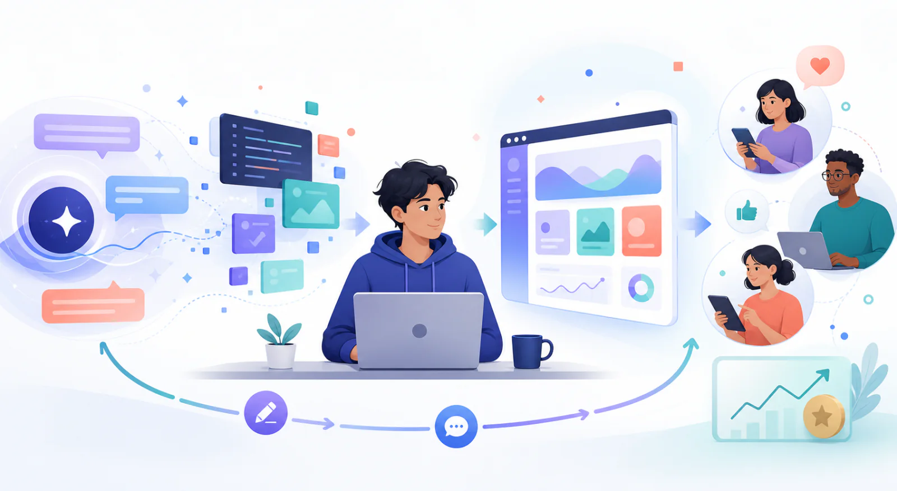

# Comment suivre ce cours

::: info Remerciements
Les principaux contributeurs et testeurs de ce cours viennent de la **Tsinghua University Shenzhen International Graduate School**. Merci aux étudiants qui ont continuellement signalé les difficultés, proposé des améliorations et participé aux corrections pendant leur apprentissage. Leur travail a rendu le cours plus clair, plus fiable et plus proche des besoins réels des débutants. [**👉 Voir la liste complète des contributeurs**](https://github.com/datawhalechina/easy-vibe#-contributing--contributors)
:::

Créer un logiciel demandait autrefois beaucoup de préparation. Il fallait apprendre des langages, des outils et de nombreuses connaissances techniques avant de transformer une idée en programme. Les grands modèles de langage et les outils de programmation par IA ont changé la situation : une personne peut décrire son intention en langage naturel et demander à l’IA de générer du code, construire une interface et modifier des fonctions.

## De Vibe Coding à la construction d’un produit

**L’expression [Vibe Coding](https://www.merriam-webster.com/dictionary/vibe%20coding) est apparue le 2 février 2025.** Andrej Karpathy l’a utilisée pour décrire une nouvelle manière de programmer : expliquer à l’IA ce que l’on veut, observer le résultat, puis poursuivre la conversation et les modifications sans écrire, comprendre et gérer chaque ligne dès le début.

> **Qu’est-ce que Vibe Coding ?**
> En bref, c’est « programmer en parlant » : décrire une idée, laisser l’IA produire le programme, l’exécuter et l’ajuster par la conversation.

Sa première avancée a été d’aider davantage de personnes à franchir la barrière « je ne sais pas coder, donc je ne peux pas commencer ». Sans expérience, on peut créer en quelques minutes un petit jeu, une page ou un prototype à présenter.

<figure class="concept-illustration">
  
  <figcaption>Vibe Coding aide à franchir la barrière du « faire » ; construire un produit exige de poursuivre vers de vrais utilisateurs, des retours et de la valeur.</figcaption>
</figure>

C’est un changement majeur : **la communication avec l’ordinateur s’étend de la syntaxe stricte au langage naturel.**

Mais lorsque la création d’une démonstration devient facile, de nouvelles questions apparaissent :

- Que faut-il construire, et pas seulement que peut-on construire ?
- À qui cela rend-il service, et cette personne en a-t-elle réellement besoin ?
- Comment transformer une première version générée par l’IA en produit stable, clair et maintenable ?
- Comment le livrer aux utilisateurs au lieu de l’exécuter uniquement sur son ordinateur ?
- Comment l’usage, les retours et le paiement prouvent-ils une valeur réelle ?

Vibe Coding ne supprime pas l’apprentissage : il **change et élève ce qui est demandé**.

Si l’on regarde seulement le code, le but est de le faire fonctionner. Construire un produit signifie assumer tout le chemin du problème au résultat :

> **Coding : puis-je le construire ?** 
> **Build Product : vaut-il la peine, qui l’utilisera, comment le livrer et comment savoir qu’il fonctionne ?**

Vibe Coding est le point de départ du cours, pas son terme. Nous allons d’abord créer rapidement, puis apprendre à choisir un problème, valider le besoin, concevoir, construire, rencontrer les utilisateurs et itérer selon les résultats.

::: tip Que cherche vraiment à développer ce cours ?
Il n’enseigne pas seulement les outils de programmation par IA. Il vise à faire de vous un premier **Product Engineer** : une personne qui découvre les problèmes, vérifie les besoins, construit le produit, le livre à de vrais utilisateurs et l’améliore à partir des résultats.
:::

## Pourquoi avons-nous besoin d’ingénieurs produit maintenant ?

L’ingénierie produit n’est pas apparue soudainement en 2026.

Dès 2018, Intercom utilisait Product Engineer pour décrire un ingénieur qui possède son produit : il ne se contente pas d’implémenter une fonction conçue par quelqu’un d’autre, mais comprend les clients, participe aux décisions et améliore ce qu’il livre.

L’IA a fortement réduit le coût de « faire » et permet à un ingénieur d’assumer des tâches autrefois réparties entre plusieurs métiers. Avec de grands modèles et des agents de programmation, une personne peut traverser prototype, interface, frontend, backend, intégration IA, tests et déploiement. Le rôle dépasse alors « terminer le code » : comprendre directement les utilisateurs, valider les solutions, favoriser l’adoption et assumer les résultats de l’entreprise.

### De la participation au produit à la responsabilité du résultat

Voici quelques étapes réelles de cette évolution :

| Date | Entreprise et poste | Ce que le poste indique |
| --- | --- | --- |
| Mai 2018 | [Intercom: Product Engineer](https://www.intercom.com/blog/making-the-transition-from-consultant-to-product-engineer/) | L’ingénieur est aussi une personne produit, comprend le client et participe aux décisions |
| Février 2026 | [Hamilton AI: Product Engineer](https://jobs.ashbyhq.com/hamilton-ai/78c69fe9-828d-44b3-abe6-af56a2badf76/) | Parler aux clients, transformer une conversation en produit utilisable et le valider |
| Juin 2026 | [Alma: Product Engineer - AI](https://jobs.ashbyhq.com/tryalma/8021fb35-fc1e-4950-a078-afc0e89d9856) | La même personne conçoit les agents, le backend, l’interface et observe les avocats et clients |
| Juillet 2026 | [Harper: Product Engineer](https://jobs.ashbyhq.com/harperinsure/7d678dba-885a-4432-94c7-a9c20852db35) | Entrer dans la vente, le support et l’assurance et répondre d’indicateurs comme la conversion |
| Août 2026 | [Paradigm: Product Engineer, Applied AI](https://jobs.ashbyhq.com/Paradigm/b85b9094-2467-4f49-9a36-ca93da34a3f5) | Trouver les problèmes des équipes d’investissement, de recherche et d’opérations et créer des produits |
| En août 2026 | [OpenAI: Forward Deployed Engineer](https://openai.com/careers/forward-deployed-engineer-%28fde%29-seattle-seattle/) | Assumer découverte, planification, construction et production ; mesurer par l’adoption et l’impact |

<strong>Voir davantage de postes réels dans plusieurs secteurs</strong>

Ces exemples couvrent l’aviation, le droit, l’assurance, la conformité financière, la biologie, l’industrie, les services aux entreprises et l’infrastructure IA.

| Publication | Entreprise et poste | Boucle à accomplir |
| --- | --- | --- |
| Février 2026 | [Sphinx: Product Engineer](https://jobs.ashbyhq.com/Sphinx/08bdb9eb-4b6c-44ab-9615-3bb6b908d008) | Choisir des possibilités dans les échanges clients, prototyper, tester et influencer la feuille de route |
| Mars 2026 | [Hyperscale: Founding Forward Deployed Engineer](https://jobs.ashbyhq.com/hyperscale/950c982f-5fb9-481b-a6ad-808feba76757) | Participer à la recherche, au PoC, à la mise en place et à la vente entreprise |
| Avril 2026 | [Sphere: Founding Forward Deployed Engineer](https://jobs.ashbyhq.com/sphere/7b5f39b0-6f3f-4bc4-9469-74ae9722d85a) | Aller de la découverte au déploiement et transformer les besoins en capacités générales |
| Mai 2026 | [Avent: Founding Forward Deployed Engineer](https://jobs.ashbyhq.com/avent-industrial-inc/bf8337c2-00cf-4ca7-aa43-b4c29e4b8083) | Comprendre l’activité, coder, intégrer les systèmes et répondre du lancement client |
| Mai 2026 | [Tamarind Bio: Founding Forward Deployed Engineer](https://jobs.ashbyhq.com/tamarindbio/be678c9b-984e-4a0a-aedc-a87187e18748/) | Couvrir premier échange, pilote, production, extension, démonstration et cycle de vente |
| Juin 2026 | [Protege: Forward Deployed Engineer, New Verticals](https://jobs.ashbyhq.com/protege/b62ebf3e-e07f-4f67-bc9c-4787f23fe449/) | Créer des activités depuis les premiers besoins et transformer les réussites en plateforme |
| Juin 2026 | [Dataleap: Founding Forward Deployed Engineer](https://jobs.ashbyhq.com/dataleap/6afe756f-fea9-42fc-82ed-621c72a99387/) | Trouver les processus importants, construire des agents, intégrer et former le client |
| Juin 2026 | [Collinear AI: Product Engineer](https://jobs.ashbyhq.com/collinear-ai/4d4af6b1-bfc7-4a28-9d86-5bab73e6e396) | Travailler entre backend, frontend, API, expérience, tests et qualité en production |
| Juillet 2026 | [Restate: Forward Deployed Engineer](https://jobs.ashbyhq.com/restate/c9419551-7f51-4691-8ba9-d80a27f1e284) | Assumer PoC, préparation et déploiement et transformer une livraison unique en modèle reproductible |
| En août 2026 | [Scale AI: Forward Deployed Engineer, GenAI](https://scale.com/careers/4593571005) | Travailler directement avec les clients techniques, développer et expérimenter de bout en bout |

::: details Période de recherche
Cette page a été compilée le **9 août 2026**. Les dates des offres Ashby viennent du champ `publishedAt` de leurs données publiques ; lorsqu’une page n’affiche pas de date, nous utilisons la date de vérification. Une offre peut disparaître après sa fermeture.

Ces exemples sont des observations de postes réels, pas une statistique de tout le marché du travail. Ils montrent une direction dans les entreprises natives de l’IA et les petites équipes, et non la disparition de toutes les spécialisations en produit, design, ingénierie et vente.
:::

### Que signifient ces changements ?

Il ne s’agit pas seulement d’exiger davantage des ingénieurs. Le rôle de ceux qui codent déjà évolue, tandis qu’une nouvelle voie s’ouvre à ceux qui ne codent pas encore.

#### Pour ceux qui codent déjà : le rôle de l’ingénieur est redéfini

- **Le point de départ change :** ne plus attendre un cahier des charges, mais entrer dans le contexte utilisateur et métier pour découvrir le problème.
- **Le rôle du prototype change :** non plus seulement montrer la technique, mais le livrer rapidement et tester une décision.
- **La frontière de l’ingénierie change :** passer d’un module à l’interface, au backend, à l’IA, au déploiement et à l’expérience.
- **La mesure du succès change :** passer de « la fonction est sortie » à l’adoption, au gain de temps, à la conversion, au revenu et à l’impact.
- **La relation avec la vente change :** certains ingénieurs rejoignent démonstrations, PoC et lancements pour prouver la valeur.

« Savoir vendre » ne signifie pas que chacun doit devenir commercial. Pour l’ingénieur produit, cela veut d’abord dire trouver les personnes qui pourraient avoir besoin du produit, comprendre leur problème, montrer la solution, les inviter à l’utiliser et vérifier si elles continueront ou paieront.

#### Pour les débutants qui ne codent pas : une nouvelle porte s’ouvre

L’IA a aussi fortement abaissé la barrière de création d’un produit.

- **Il n’est plus nécessaire d’étudier la programmation pendant des années avant de commencer.** On peut demander à l’IA de produire du code et des interfaces, puis résoudre les erreurs en construisant un résultat fonctionnel.
- **La connaissance d’un métier peut être plus rare que la capacité à coder.** Enseignants, médecins, juristes, commerciaux et opérateurs comprennent les utilisateurs et les processus réels, une base essentielle pour un bon produit.
- **La distance entre l’idée et le produit peut se réduire à quelques semaines, voire quelques jours.** Un problème familier peut devenir un petit outil testé auprès de vrais utilisateurs.

Le cours s’adresse donc aux ingénieurs qui veulent élargir leur champ d’action comme aux débutants qui possèdent une idée ou une expertise métier.

### Quel lien entre Product Engineer, FDE et OPC ?

Les trois concepts se situent sur la même chaîne de capacités, mais ne désignent pas la même chose.

| Concept | Ce que c’est | Contexte principal | Étendue de la responsabilité |
| --- | --- | --- | --- |
| **Product Engineer** | Un poste qui fusionne produit et ingénierie | Dans une équipe produit | Du problème et de la solution jusqu’au lancement, aux retours et aux indicateurs |
| **FDE (Forward Deployed Engineer)** | L’ingénierie produit étendue au terrain client | Entreprises, opérations réelles et production | Découverte, PoC, intégration, déploiement, adoption, extension et parfois vente |
| **OPC (One-Person Company)** | Une entreprise dirigée par une personne, pas un intitulé de poste | Une personne utilise agents, automatisation et services externes | Marché, produit, marketing, vente, livraison, support et trésorerie |

  

    <strong>Product Engineer</strong>
    Construire le bon produit
  

  

  

    <strong>FDE</strong>
    Amener le produit chez le client
  

  

  

    <strong>OPC</strong>
    Faire fonctionner une entreprise complète
  

Il ne s’agit pas d’une échelle obligatoire, mais des différents périmètres que les mêmes capacités peuvent couvrir.

On peut les voir comme trois cercles qui s’agrandissent :

> **Product Engineer : construire correctement le bon produit** 
> **FDE : l’amener chez le client et produire des résultats** 
> **OPC : exploiter ces capacités pour gérer une entreprise entière**

#### FDE : l’ingénieur entre sur le terrain client

Un FDE n’est ni une personne qui installe seulement le logiciel ni un ingénieur avant-vente qui fait seulement une démonstration. Dans une entreprise IA, il accomplit généralement quatre tâches :

1. Trouver avec le client le problème qui vaut le plus la peine d’être résolu.
2. Construire rapidement un prototype ou PoC pour démontrer la valeur technique et métier.
3. Écrire du code de production et connecter la solution aux données et processus réels.
4. Observer l’adoption et transformer les besoins répétés en capacités générales.

En août 2026, OpenAI recrutait des FDE dans plusieurs pays et villes et définissait le succès par l’adoption en production, l’impact mesurable et les retours de terrain capables de changer les feuilles de route. Le FDE s’étend d’une pratique particulière de quelques éditeurs à une forme importante de mise en œuvre de l’IA.

#### OPC : une personne peut disposer d’une « équipe numérique »

Ici, OPC ne désigne pas seulement une forme juridique. C’est une **One-Person Company : une entreprise pilotée par une personne qui utilise logiciels, agents IA et infrastructure externe pour accomplir un travail qui exigeait autrefois une équipe.**

Ce n’est pas non plus une « entreprise sans humain » entièrement automatisée. Le fondateur doit toujours juger le marché, assumer la responsabilité, rencontrer les utilisateurs et prendre les décisions. L’IA ressemble davantage à une équipe numérique à laquelle on distribue des tâches.

Cette tendance n’a pas commencé avec l’IA. Le développeur indépendant Pieter Levels explique qu’il construit et exploite seul Nomads.com, Remote OK, Photo AI, Interior AI et d’autres produits. L’IA étend cette façon de faire au design, au code, au contenu, à l’analyse et au support, mais le marché réel valide toujours la valeur. [Voir ses projets](https://levels.io/projects/)

En 2025, le Work Trend Index de Microsoft a appelé **Agent Boss** les personnes qui créent, délèguent et gèrent des agents IA. L’étude de 31 000 personnes dans 31 pays indique que 81 % des dirigeants prévoyaient d’intégrer modérément ou profondément les agents à leur stratégie dans les 12 à 18 mois. [Voir Microsoft 2025 Work Trend Index](https://www.microsoft.com/en-us/worklab/work-trend-index/2025-the-year-the-frontier-firm-is-born)

En juin 2025, Wix a acquis la plateforme de création d’applications en langage naturel Base44 pour environ 80 millions de dollars. Base44 n’est pas strictement une OPC, mais montre une condition importante : base de données, authentification et déploiement, qui nécessitaient plusieurs métiers, sont regroupés et automatisés dans des produits conversationnels. [Voir l’annonce de Wix](https://www.wix.com/press-room/home/post/wix-further-expands-into-vibe-coding-with-acquisition-of-base44-a-hyper-growth-startup-that-simplif)

La date de la première licorne d’une seule personne reste une prédiction, pas un fait. Pour un débutant, la réalité utile est que **l’on peut déjà valider plus vite avec moins d’argent et d’équipe et exploiter une petite activité réellement rentable.**

::: tip Pourquoi présenter les trois voies ?
Que vous rejoigniez une équipe, deveniez FDE ou essayiez une OPC, le départ est identique : trouver un vrai problème, construire le plus petit produit, le livrer, expliquer sa valeur et itérer selon l’usage et le paiement.
:::

Le cours entraîne donc un cycle produit complet plutôt que des métiers séparés :

> **Trouver un problème → Valider le besoin → Concevoir → Construire → Livrer → Expliquer la valeur → Observer → Continuer à améliorer**

Faire écrire du code par l’IA n’est que la première étape. Un produit utilisable pose encore d’autres questions :

- Comment obtenir du code propre et maintenable ?
- Comment réunir du code dispersé dans une application qui fonctionne ?
- Comment publier l’application pour qu’elle soit réellement utilisée ?
- Comment intégrer la génération de texte, la compréhension d’image et d’autres capacités ?
- Comment savoir si les utilisateurs en ont besoin et pourraient payer ?

Le cours répond progressivement à ces questions.

Étudiant, enseignant, médecin, ouvrier ou personne sans aucune connaissance technique : vous n’avez pas besoin d’étudier la programmation pendant des années avant de commencer votre premier prototype.

| Votre situation | Ce que le cours apporte |
| --- | --- |
| Étudiant | Réaliser seul travaux, concours et projets entrepreneuriaux |
| Professionnel | Automatiser les tâches, gagner en efficacité et essayer une activité secondaire |
| Product manager / Designer | Transformer les idées en démonstrations et les mettre devant des utilisateurs |
| Entrepreneur / Petite entreprise | Valider à faible coût avant de constituer une équipe complète |
| Enseignant / Formateur | Créer outils pédagogiques, supports et exercices automatiques |
| Médecin / Juriste / Spécialiste | Automatiser des processus professionnels et créer ses propres outils |
| Toute personne | Résoudre avec l’IA un problème concret de la vie ou du travail |

L’IA réduit le coût de mise en œuvre, mais la valeur dépend toujours de la découverte d’un vrai problème et de la livraison de la solution.

## Parcours de progression : de l’usage de l’IA à l’ingénierie produit

  

    
🎮

    <h3>Première expérience</h3>
    
Découvrir la programmation par IA

    

      Jeu Snake
      Départ sans prérequis
      Première expérience Vibe Coding
      Générer en quelques minutes
    

  

  

    
🛠️

    <h3>Stage 1</h3>
    
Fondamentaux de l’ingénierie produit

    

      AI IDE (Cursor/Claude)
      Validation & prototype
      Intégration de capacités IA
      Livraison à de vrais utilisateurs
    

  

  

    
💻

    <h3>Stage 2</h3>
    
Product Engineer full stack

    

      De Figma au code
      Base de données Supabase
      Paiements Stripe
      Base de connaissances Dify
    

  

  

    
🚀

    <h3>Stage 3</h3>
    
Ingénieur produit IA / Responsable technique

    

      Web / Mini-programmes / Multiplateforme
      Outils MCP avancés
      RAG & LangGraph
      Pensée d’ingénierie avancée
    

  

À l’issue de ce parcours, vous disposerez de :

- **Capacités Vibe Coding :** utiliser les outils IA avec aisance et les guider pour obtenir du bon code sans mémoriser toute la syntaxe.
- **Développement full stack :** aller de l’interface et du frontend aux bases de données, API, développement local et déploiement.
- **Intégration IA :** connecter des API multimodales de texte, image et audio puis construire avec des méthodes comme RAG.
- **Pensée produit et exploitation :** recherche utilisateur, décomposition du besoin, MVP, itération, paiements et gestion des utilisateurs.

# Que pourrez-vous faire après le cours ?

## Stage 1 : construire votre premier prototype

Cette étape convient aux débutants complets et aux personnes qui connaissent un peu le code sans être encore à l’aise. Vous n’apprendrez pas d’abord une masse de théorie : vous demanderez à l’IA d’écrire et de corriger du code pendant la construction.

**Après cette étape, vous pourrez :**

- terminer seul une application web avec un outil de programmation IA ;
- transformer une idée en prototype cliquable et interactif ;
- ajouter des fonctions comme génération d’images ou conversation intelligente ;
- rechercher et résoudre une erreur au lieu de vous arrêter au premier échec.

En bref, vous pourrez créer quelque chose qui fonctionne et se présente à une autre personne.

Nous commencerons par un petit jeu, apprendrons à écrire et corriger avec l’IA, passerons d’une page simple à une application interactive, ajouterons des capacités IA et terminerons un projet indépendant.

# Pourquoi apprendre par projets ?

> **La difficulté du travail réel**
>
> Au travail, on vous donne souvent un objectif, mais ni documentation complète, ni cadre prêt, ni exigences détaillées.

> Responsable ou client : nous devons construire xxx et obtenir yyy.
>
> Documentation ? Cadre existant ? Spécification ? Souvent rien.

Une grande partie du travail consiste à résoudre des problèmes inconnus dans l’incertitude. Les exigences sont vagues, les limites changent et personne ne fournit la réponse. Il faut chercher, expérimenter, prototyper, itérer et livrer une solution qui fonctionne, se utilise et se publie.

Le cours offre une simulation sûre :

- les projets difficiles obligent à décomposer, concevoir et chercher l’information ;
- un code pas trop simplifié apprend à lire et modifier une base de taille moyenne ;
- le chemin de l’idée à la publication fait vivre un produit de zéro à un.

À court terme, l’exercice peut être dur ; à long terme, il développe votre capacité à prendre des responsabilités, avancer dans l’incertitude et transformer l’IA en produit réel plutôt qu’en démonstration.

# L’art de poser des questions : une compétence de base à l’ère de l’IA

Questionner est une compétence fondamentale. Avec le même code et la même erreur, **la manière de demander détermine presque la réponse** : discours vague ou étapes applicables.

**Prenez l’habitude :** considérer la question à l’IA comme une partie du développement. Dès que vous ne comprenez pas ou êtes bloqué, demandez.

## Pourquoi est-ce indispensable ?

- **La réalité offre rarement une documentation complète :** besoins flous, code inachevé et erreurs dispersées.
- **L’IA peut devenir professeur et collègue :** une bonne question crée une programmation en binôme de qualité.
- **La communication fixe la limite :** meilleur contexte et contraintes produisent une réponse plus utile.

**Erreur fréquente :** « Pourquoi cette erreur ? » entraîne des suppositions. Ajoutez le contexte pour obtenir un plan exécutable.

## Donner des informations à l’IA : capture ou copier-coller

Les deux sont utiles, dans des situations différentes :

| Méthode | Adaptée à | Exigence principale |
| --- | --- | --- |
| **Copier-coller** | Piles d’erreurs, journaux, code, configuration, réponse API | Donner le contenu pertinent complet, pas une seule ligne |
| **Capture** | Mise en page, interaction ou bouton introuvable dans un outil | Montrer le contexte, marquer la zone et ajouter une phrase |

::: danger ⚠️ Condition importante
**Toutes les IA n’acceptent pas les images.** Une capture exige un modèle multimodal, comme Claude, GPT-4V/GPT-4o, Gemini, Qwen ou ERNIE Bot.

**Si votre IA ne reçoit pas d’image**, elle ne comprendra pas la capture. Copiez-collez le texte.
:::

## Prompts pour obtenir une bonne explication

Si vous voulez apprendre et non seulement recevoir une réponse, essayez :

> **Exemples d’apprentissage**
>
> - « Explique d’abord ce concept en cinq phrases, puis pose-moi des questions pour vérifier ma compréhension. »
> - « Explique cette erreur en détail ; je ne comprends pas pourquoi elle se produit. »

# J’essaie depuis longtemps et j’ai envie d’abandonner

La méthode, et non votre persévérance, doit peut-être changer. Ne restez pas seul : parlez aux auteurs et assistants, décrivez ce que vous avez essayé, le blocage exact et votre état. Un petit changement de direction ou une notion manquante suffit souvent pour repartir.

# Certaines décisions du cours me paraissent mauvaises

Contactez les auteurs, ouvrez une issue ou donnez votre avis en classe ou dans la communauté. Indiquez précisément ce qui n’est pas clair, ce qui fonctionne mal et où vous avez perdu du temps. Les retours honnêtes aident les prochains apprenants.

# Référence

- [Travaux pratiques de systèmes informatiques de l’Université de Nankin](https://nju-projectn.github.io/ics-pa-gitbook/ics2025/)

<RelatedArticlesSection
  title="Que poursuivre ensuite"
  description="Continuez de l’usage de l’IA vers la construction de produits."
  :items="relatedArticles"
/>
