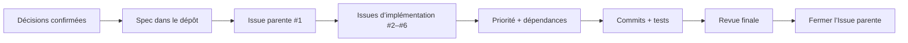
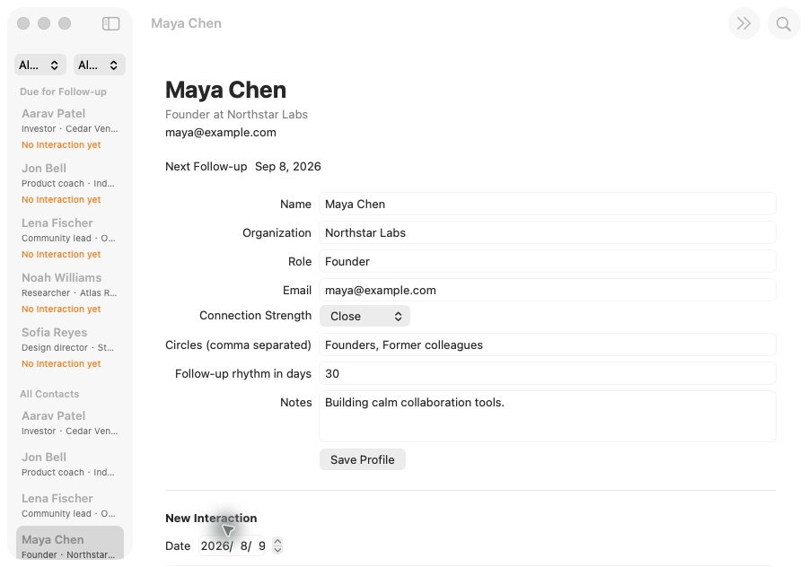

# Développer un logiciel de bout en bout avec GitHub Issues : du dialogue produit à l’app macOS terminée

Ce tutoriel suit un cycle complet de développement piloté par une spécification : clarifier une idée imprécise avec l’IA, consigner l’accord dans une Spec, créer des GitHub Issues avec priorités et dépendances, puis implémenter, tester et relire le produit.

::: info Quelle différence avec le chapitre précédent ?

[Du Vibe Coding au Spec Coding](/fr-fr/stage-3/core-skills/spec-coding/) explique pourquoi les spécifications deviennent centrales dans le développement avec l’IA. Ce chapitre est la mise en pratique : un vrai dépôt public montre comment une Spec devient des Issues, des commits, des tests et un produit fonctionnel.

:::

Le point de départ tenait en une phrase :

> Je veux créer un CRM pour macOS afin de gérer des contacts importés et de mieux organiser mes relations. Nous pouvons commencer avec de fausses données.

Le résultat est **Relationship Compass**, une application macOS native capable de rechercher et filtrer les contacts, modifier les profils de relation, importer un CSV, enregistrer les interactions et calculer la prochaine date de suivi.


Le [dépôt d’exemple public](https://github.com/sanbuphy/relationship-compass-macos) ne contient que des données fictives et conserve la Spec, les Issues, l’historique des commits, le code et les tests.

## 1. Comprendre le développement piloté par une Spec

Une boucle courante de programmation avec l’IA ressemble à ceci :

```text
Décrire une idée → l’IA écrit le code → repérer un problème → ajouter une consigne → modifier encore
```

Cela peut suffire pour une petite page. Quand le projet grandit, d’anciennes exigences disparaissent de la conversation, l’avancement devient difficile à suivre et une fonction peut s’exécuter sans satisfaire l’intention initiale.

Les Skills de Matt Pocock donnent à l’IA un processus reproductible. Une Skill définit ce qu’il faut clarifier, quel artefact produire et quand attendre une confirmation, pas seulement quel code écrire.

| Implémentation depuis le chat | Implémentation pilotée par la Spec |
| --- | --- |
| Le chat courant est la source principale | Une Spec versionnée est la référence |
| Les exigences s’ajoutent au fil de l’eau | La Spec et les tâches sont mises à jour d’abord |
| L’avancement vit dans les résumés de l’IA | Il vit dans les Issues et les commits |
| « Cela fonctionne » signifie terminé | Chaque critère d’acceptation est contrôlé |

### 1.1 Les trois rôles de GitHub

1. **Archive du projet** pour la Spec, le vocabulaire et les décisions d’architecture.
2. **Tableau de travail** pour les Issues, priorités et dépendances.
3. **Preuve d’achèvement** grâce aux commits, tests et Issues fermées.

| Artefact GitHub | Signification | Exemple |
| --- | --- | --- |
| Spec | Ce que le logiciel final doit faire | `specs/relationship-compass-mvp.md` |
| Issue | Une tâche livrable indépendamment | `#2 Browse sample Contacts` |
| Dépendance | Ce qui doit être terminé avant | `#3` est bloquée par `#2` |
| Commit | Ce qui change dans une étape | `feat: browse sample contacts` |
| Tests | Preuve que le comportement reste correct | `swift test` |
| ADR | Raison d’un choix technique important | `docs/adr/0002-native-swiftui-macos.md` |



### 1.2 Le flux principal

```text
grill-with-docs → to-spec → to-tickets → implement → code-review
```

- `grill-with-docs` clarifie le périmètre et les limites techniques.
- `to-spec` transforme l’accord en spécification formelle.
- `to-tickets` crée des Issues priorisées avec dépendances.
- `implement` traite une Issue disponible à la fois.
- `code-review` contrôle séparément la santé du code et la couverture des exigences.

## 2. Préparation

Il faut un compte GitHub, GitHub CLI authentifié, Node.js 18 ou plus récent et un outil de programmation avec IA capable de lire les Skills du projet. Pour exécuter l’app, il faut aussi un Mac avec Xcode.

```bash
npx skills@latest add mattpocock/skills -y
gh auth status
gh repo create relationship-compass-macos \
  --public \
  --source . \
  --remote origin \
  --push
```

L’exemple est public car les contacts sont fictifs. Pour de vraies données, utilisez `--private` et inspectez exemples, journaux et historique Git avant de pousser. Les labels essentiels sont `ready-for-agent`, `priority:P0/P1/P2` et `completed-by-agent`.

## 3. Produit et limites du MVP

La première version propose :

- six contacts fictifs déterministes ;
- recherche par nom, organisation, rôle, e-mail et cercle ;
- filtres combinés par intensité de relation et cercle ;
- modification du profil, des notes et du rythme de suivi ;
- import CSV UTF-8 validé avec déduplication sûre ;
- historique des interactions et calcul du prochain suivi ;
- persistance JSON locale et restauration au démarrage.

La synchronisation cloud, le score relationnel par IA, les comptes, un backend et l’accès aux Contacts macOS sont exclus du MVP.

## 4. Clarifier avec `grill-with-docs`

<div class="workflow-chat">
  <div class="workflow-message workflow-message--user">
    <div class="workflow-message__speaker">🙋 Vous</div>
    <div class="workflow-message__command">/grill-with-docs</div>
    <p>Je veux créer un CRM macOS pour gérer des contacts importés et organiser mes relations. Nous pouvons commencer avec de fausses données.</p>
  </div>
  <div class="workflow-message workflow-message--agent">
    <div class="workflow-message__speaker">✨ Agent</div>
    <p>Avant d’écrire du code, nous allons confirmer ce que la première version inclut et exclut, où résident les données, quelle technologie employer et comment vérifier l’achèvement. Pour chaque choix, j’expliquerai les différences et proposerai une recommandation.</p>
  </div>
</div>

La discussion confirme SwiftUI natif pour macOS 14+, JSON local, CSV UTF-8, six échantillons, aucun réseau et aucune permission Contacts. `CONTEXT.md` fixe le sens de `Contact`, `Interaction` et `Follow-up` ; deux ADR documentent le local-first et le choix de SwiftUI.

::: info GitHub à cette étape

Le contexte confirmé est committé dans `CONTEXT.md` et `docs/adr/*`. Les Issues d’implémentation ne sont pas encore créées.

:::

## 5. Rédiger la Spec avec `to-spec`

<div class="workflow-chat">
  <div class="workflow-message workflow-message--user">
    <div class="workflow-message__speaker">🙋 Vous</div>
    <div class="workflow-message__command">/to-spec</div>
    <p>Transforme notre discussion confirmée en une Spec complète, enregistre-la dans le dépôt et publie-la comme Issue parente avec le label ready-for-agent.</p>
  </div>
</div>

[`specs/relationship-compass-mvp.md`](https://github.com/sanbuphy/relationship-compass-macos/blob/main/specs/relationship-compass-mvp.md) contient le problème, le MVP, 24 user stories, les décisions techniques, la stratégie de vérification et les exclusions explicites. [Issue #1](https://github.com/sanbuphy/relationship-compass-macos/issues/1) est l’entrée visible du projet.

Une bonne Spec décrit un comportement plutôt qu’un nom de fichier. « Les contacts sans interaction apparaissent aussi dans Follow-ups » reste valable après une refactorisation interne.

## 6. Créer des Issues ordonnées avec `to-tickets`

<div class="workflow-chat">
  <div class="workflow-message workflow-message--user">
    <div class="workflow-message__speaker">🙋 Vous</div>
    <div class="workflow-message__command">/to-tickets</div>
    <p>Découpe la Spec en GitHub Issues. Chaque ticket doit livrer une tranche verticale démontrable et préciser priorité, critères de fin et prérequis. Montre-moi la liste et les dépendances avant publication.</p>
  </div>
</div>

| Issue | Priorité | Résultat visible | Bloquée par |
| --- | --- | --- | --- |
| [#2 Browse sample Contacts](https://github.com/sanbuphy/relationship-compass-macos/issues/2) | P0 | Lancement, exemples, recherche, détail | Rien |
| [#3 Import and persist](https://github.com/sanbuphy/relationship-compass-macos/issues/3) | P0 | CSV dédupliqué et JSON | #2 |
| [#4 Organize Profiles](https://github.com/sanbuphy/relationship-compass-macos/issues/4) | P1 | Profils, intensité, cercles | #2 |
| [#5 Interactions and Follow-ups](https://github.com/sanbuphy/relationship-compass-macos/issues/5) | P1 | Historique et suivis | #4 |
| [#6 Polish and verify](https://github.com/sanbuphy/relationship-compass-macos/issues/6) | P2 | Erreurs, documentation, paquet, validation | #3, #5 |

On ne sépare pas horizontalement tous les modèles, Stores, écrans puis tests. Chaque **tranche verticale** relie juste assez de données, d’interface et de tests pour rendre un nouveau résultat démontrable.

## 7. Implémenter une Issue disponible à la fois

<div class="workflow-chat">
  <div class="workflow-message workflow-message--user">
    <div class="workflow-message__speaker">🙋 Vous</div>
    <div class="workflow-message__command">/implement</div>
    <p>Implémente toutes les Issues ready-for-agent selon leur priorité et leurs dépendances. Ne traite qu’un ticket non bloqué, écris d’abord un test de comportement qui échoue, exécute build et tests, puis crée un commit séparé par ticket.</p>
  </div>
</div>

Pour le ticket CSV, un test prouve d’abord que l’import du même fichier deux fois ne doit pas dupliquer les contacts. Après l’implémentation, un autre test garantit qu’un en-tête invalide ne corrompt pas les données existantes.

```bash
swift test --filter RelationshipStoreTests
swift build
swift test
```

Le projet final réussit les 13 tests de comportement public.


À la fin, l’Agent publie commit et résultat des tests, retire `ready-for-agent`, ajoute `completed-by-agent` et ferme l’Issue.

## 8. Deux revues avec `code-review`

La première examine nommage, duplication, vues trop grandes, couplage et règles de `AGENTS.md`. La seconde relit la Spec et chaque Issue pour vérifier les comportements attendus.

La revue réelle a découvert les en-têtes CSV dupliqués, la déduplication des contacts sans e-mail, les filtres Follow-ups, la restauration au démarrage et l’affichage de la prochaine date. Des tests ont été ajoutés avant les corrections, puis les deux revues ont été relancées.

Des tests verts prouvent uniquement les comportements écrits dans ces tests ; ils ne prouvent pas automatiquement que chaque exigence d’origine a été couverte.

## 9. L’application terminée

| Livraison | Résultat |
| --- | --- |
| Gestion GitHub | Une Issue parente et cinq Issues d’implémentation fermées |
| Historique | Neuf petits commits dans l’ordre des dépendances |
| Vérification | 13/13 tests et build complet réussis |
| Revue finale | Santé du code et couverture de la Spec validées |
| Produit exécutable | Génération de `Relationship Compass.app` |
| Confidentialité | Données locales, aucun accès Contacts ni upload |

### 9.1 Recherche et filtres combinés

La recherche `Founder` ne laisse que Maya Chen ; intensité et cercle peuvent être combinés.


### 9.2 Modifier un profil de relation

Organisation, rôle, e-mail, intensité, cercles, rythme et notes sont modifiables.


### 9.3 Enregistrer une interaction et calculer le prochain suivi

Une interaction le 9 août 2026 avec un rythme de 30 jours produit le 8 septembre 2026 comme prochaine date.




```bash
git clone https://github.com/sanbuphy/relationship-compass-macos.git
cd relationship-compass-macos
swift build
swift test
./scripts/package-app.sh
open "dist/Relationship Compass.app"
```

## 10. Flux prêt à copier

```text
/grill-with-docs
Clarifie avec moi le périmètre, les exclusions, les données, la technologie et la vérification. N’écris pas de code avant ma confirmation explicite.

/to-spec
Transforme l’accord en Spec avec comportements, critères d’acceptation et exclusions, puis crée une Issue GitHub parente.

/to-tickets
Découpe la Spec en Issues verticales avec priorité, critères de fin et dépendances.

/implement
Implémente chaque Issue non bloquée par priorité avec TDD, validation et commit séparé.
Ensuite, revois la santé du code et la couverture de la Spec, corrige tout et relance les tests.
```

## 11. Quand laisser l’IA enchaîner les tâches

Ce flux convient aux MVP délimités, sites, apps et backends dotés de comportements observables et de commandes de test ou de build fiables. Il ne convient pas à des exigences changeant chaque heure, des résultats invérifiables ou des modifications directes de données de production.

L’humain confirme toujours le périmètre, la couverture et l’ordre des Issues, les opérations de paiement, déploiement, suppression, permissions et confidentialité, ainsi que l’interface et le produit final. Il conserve objectifs, limites et acceptation ; l’IA exécute régulièrement le travail convenu.

## Résumé

```text
Idée imprécise
  ↓ grill-with-docs
Périmètre, vocabulaire et décisions techniques confirmés
  ↓ to-spec
Exigences versionnées et vérifiables
  ↓ to-tickets
GitHub Issues priorisées avec dépendances
  ↓ implement
Test, implémentation et commit par ticket
  ↓ code-review
Santé du code + couverture de la Spec
  ↓
Logiciel compilable et vérifiable
```

Une fois le chat terminé, Spec, Issues, dépendances, commits et preuves de test restent sur GitHub. La session suivante reprend l’état enregistré au lieu de deviner à nouveau l’intention.

## Références

- [Skills to Spec](https://www.aihero.dev/skills-to-spec)
- [AI Skills for Real Engineers](https://www.aihero.dev/skills)
- [Changements de Skills v1.1](https://www.aihero.dev/skills/skills-changelog-v1-1-wayfinder-to-spec-to-tickets-grilling-improvements)
- [OpenAI : enregistrer des workflows répétables comme Skills](https://learn.chatgpt.com/codex/use-cases/reusable-codex-skills)
- [Exemple public Relationship Compass](https://github.com/sanbuphy/relationship-compass-macos)
