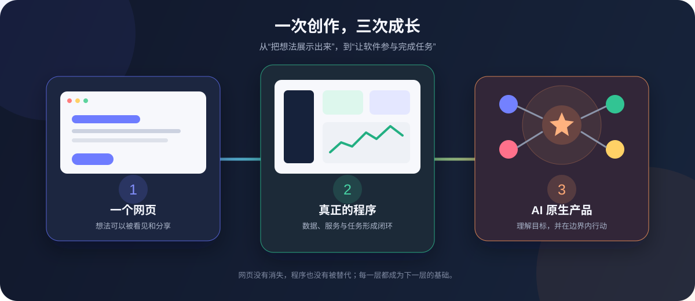

# De la page web au vrai logiciel, puis au produit natif IA

Le Vibe Coding commence souvent par « fais-moi une page web ». Une fois la page visible, il ne faut pas seulement ajouter des boutons : elle doit enregistrer des données, rendre un vrai service, puis laisser l'IA participer à une tâche.

## 1. Commencer par une page partageable

Transformez une idée floue en structure claire, corrigez-la avec votre propre jugement et publiez-la à une URL. La première étape est terminée lorsqu'une nouvelle personne comprend le but, peut l'utiliser sur mobile et que tous les boutons visibles fonctionnent.

## 2. Transformer la page en logiciel

Un logiciel utile possède des données modifiables, un backend qui protège comptes et secrets, des erreurs compréhensibles et une publication indépendante de l'ordinateur du développeur.

Site, mini-programme, application de bureau ou extension : la plateforme importe moins que la capacité à terminer une tâche réelle de façon fiable.

## 3. Passer au produit natif IA

Un champ de discussion ne suffit pas. Le produit doit comprendre le but, lire le contexte nécessaire, utiliser des outils contrôlés et demander confirmation avant une action importante.

- Le code classique gère règles, données et autorisations.
- L'IA traite langage, génération et informations incomplètes.
- L'humain garde les objectifs, les décisions risquées et l'approbation finale.

## 4. N'avancer que d'une étape

Sans page publique, publiez-en une. Avec plusieurs belles démos, choisissez-en une et ajoutez données, backend et erreurs. Si vous livrez déjà des logiciels complets, appliquez l'IA à une seule étape qui demandait auparavant une interprétation humaine.

**La page rend l'idée visible. Le logiciel permet de finir une tâche. Le produit natif IA fait du logiciel un participant à cette tâche.**
