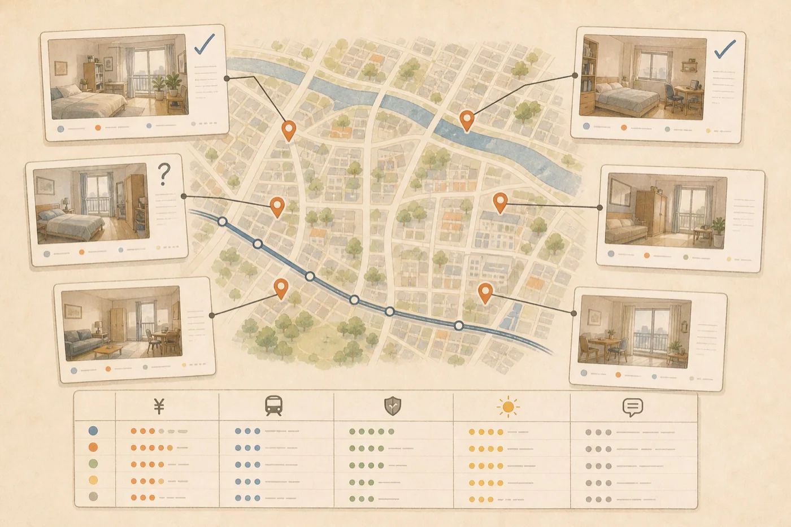
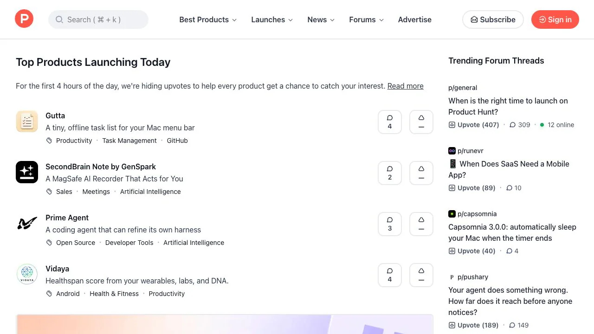
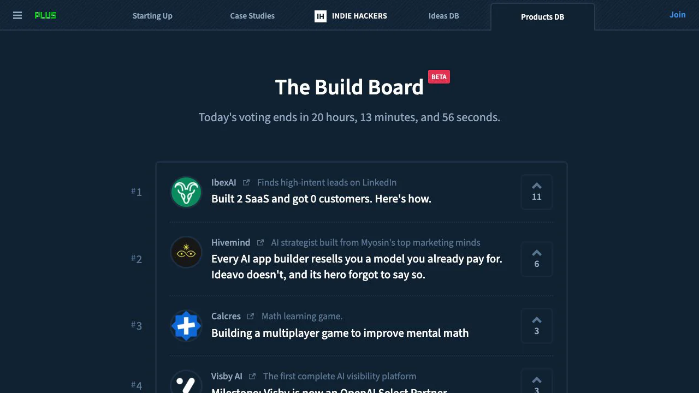
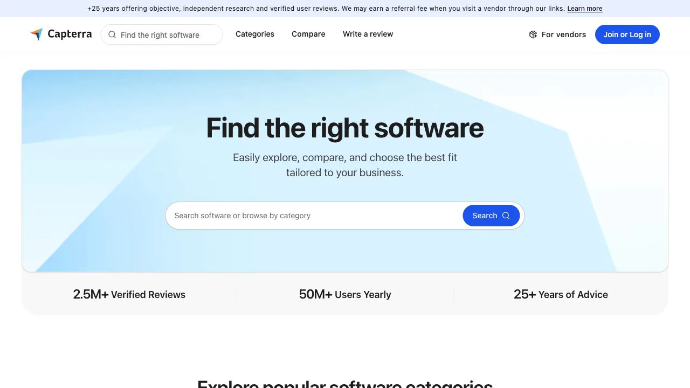
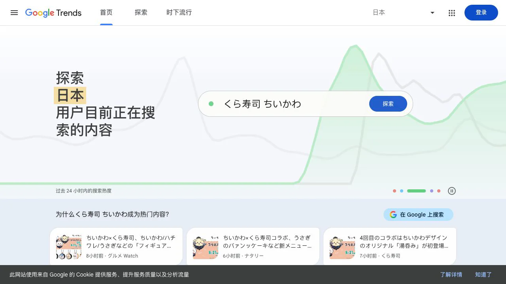

<script setup>
const duration = '約 <strong>20分</strong>'
</script>

# アイデアの種はどこから来るのか


## この章で行うこと

<ChapterIntroduction
  :duration="duration"
  :tags="['アイデアの出所', '手がかり集め']"
  coreOutput="出典付きのアイデアメモ1ページ"
  expectedOutput="探す場所が分かり、元の言葉・場面・リンクを残せる"
>

この章では「本当のニーズ」かどうかをまだ判断せず、製品の方向も選びません。その前の段階として、現実の生活から材料を集めます。

誰かが不満を口にしたり、助けを求めたり、面倒な作業を繰り返していたら、その場面を残します。次の章で、どの問題をさらに調べる価値があるかを分析します。

</ChapterIntroduction>

## 1. 自分の生活から始める

この1週間を振り返ってください。何度もコピー＆ペーストしたこと、複数のアプリを行き来したこと、「次はもっと良い方法を探そう」と思ったことはありませんか。

たとえば部屋探しでは、三つのサイトを同時に開き、家賃と通勤時間を表に書き写すことがあります。内見から戻ると、スマートフォンの写真がどの物件だったか分からなくなることもあります。



_まず体験を記録します。すぐに製品へ変える必要はありません。_

その時に起きたことを一、二文で書き、関連する画像やファイルを添えるだけで、使える手がかりになります。

## 2. 身近で繰り返される相談に気づく

職場、学校、趣味のグループにある普通の会話にも、アイデアの種が隠れています。

> 「前回のテンプレートはどこ？」「このサイズでどう書き出すの？」「公開したらまた切れてしまったのはなぜ？」

イベント公開前には、一枚のポスターをWebの横長画像、縦長投稿、動画の表紙に作り直すことがあります。サイズが変わるたび、デザイナーは見出し、主役、安全領域を並べ直します。


_数日後に同じ相談が出たら、保存する価値があります。_

元の言葉と、それが出た場面を記録します。一度きりの不便か、取り組む価値のある方向かは次の章で判断します。

## 3. これらの場所を一つ見て回る

まだ思いつかない場合は、下のマップから一つ選びます。人が何を欲しがっているかを見るならアイデアコミュニティ、小さな製品の始まりを見るなら個人開発者の事例、現実の商売に近づくならソフトウェアの低評価、調達情報、代行サービスを見ます。興味のある分野が見えてから、トレンドや投資家の記事を読んでも遅くありません。

一度に全部を見る必要はありません。20個のトップページを開くより、具体的な投稿を数件丁寧に読む方が役立ちます。

<ClientOnly>
  <IdeaSourceMap />
</ClientOnly>

### 海外の利用者向けにも作れる

インターネット製品の利用者を国内だけに限定する必要はありません。一人でも英語のWebサイト、ブラウザー拡張、Shopifyアプリ、Figmaプラグイン、小さなSaaSを作り、Product HuntやRedditなどで最初の利用者を探せます。

海外の利用者がすでに何にお金を払っているか観察しましょう。越境販売者の商品情報整理、不動産担当者の内見メモから物件紹介への変換、個人開発者の問い合わせメールや購読収入の管理などがあります。日本語で検索した後、`vendor quote comparison`、`real estate listing generator`、`Shopify product description`も試します。

海外向け製品は、画面を英語に翻訳するだけではありません。習慣、よく使うサービス、支払い方法、法律が違う場合があります。自分が理解できる小さな場面を選び、実際の利用者と話してから始める場所を決めます。

フォーラムやレビューでは、現場の人が使う表現で検索します。

```text
見積もり Excel 面倒
教師 授業準備 時間がない
小さな店 在庫が合わない
site:reddit.com is there a tool for
```

役立つ内容を見つけたら、元の文、ページURL、日付を保存します。トップページだけをお気に入りにせず、すぐに相手の言葉を製品機能へ書き換えないでください。

## 4. よく使う四つのサイトを知る

資料マップには多くの入口があります。次の四つは、製品公開、個人開発、ソフトウェア評価、検索トレンドを代表します。

### [Product Hunt](https://www.producthunt.com/)：新製品が公開される場所

Product Huntは、テクノロジー製品が公開され、注目を集める場所です。開発者は説明、画像、デモを準備し、公開日に投票とコメントを集めます。



製品は毎日変わります。製品を開いたら、一文でどう説明しているか、最初の画像が何を強調しているか、コメントで何を質問されているかを見ます。1位だけでなく数日続けて見ると、繰り返し登場する分野が分かります。

### [Indie Hackers](https://www.indiehackers.com/products)：小さな製品の経営を見る

Product Huntが公開日の舞台なら、Indie Hackersは個人開発者が長期的に事業を語るコミュニティです。進捗、売上、顧客獲得、失敗も共有されます。



売上が最大の製品だけを探す必要はありません。一人で運営し、毎月小さく安定して稼ぐ製品の方が、最初に解いた小さな問題と最初の顧客の見つけ方を理解しやすいことがあります。

### [Capterra](https://www.capterra.com/)：ソフトウェアを分類から探し、評価を読む

Capterraは業務ソフトウェアの一覧と評価サイトです。CRM、プロジェクト管理、顧客対応、勤務表などを分類から比較できます。



気になる分野があれば、代表的な製品を数件開き、低い評価を読みます。モバイル版が使いにくい、書き出し形式が違う、設定が複雑すぎる、といった繰り返し出る不満は、公式機能一覧より保存する価値があります。

### [Google Trends](https://trends.google.com/)：検索関心の変化を比べる

Google Trendsは、キーワードへの相対的な検索関心を時間と地域ごとに示し、関連検索や急上昇語も表示します。



候補の言葉がいくつかできてから使います。たとえば「AI meeting notes」「AI transcription」「voice notes」を比べ、どの表現がよく検索されるか確認します。線が上がっても市場の存在は証明できません。関心の変化が分かるだけです。

## 5. 20分で手がかりを1ページ作る

<ClientOnly>
  <IdeaSprint />
</ClientOnly>

## 6. 材料を持って次の章へ進む

ここでは、出典をもう一度見つけられる生の材料が1ページあれば十分です。まとまっていなくても、完成した製品案に見えなくても構いません。

次に[良いアイデアを見極める方法](../finding-great-idea/)を読み、手がかりの背後に本当のニーズがあるか、影響はどれほどか、どれをさらに検証するかを考えます。
