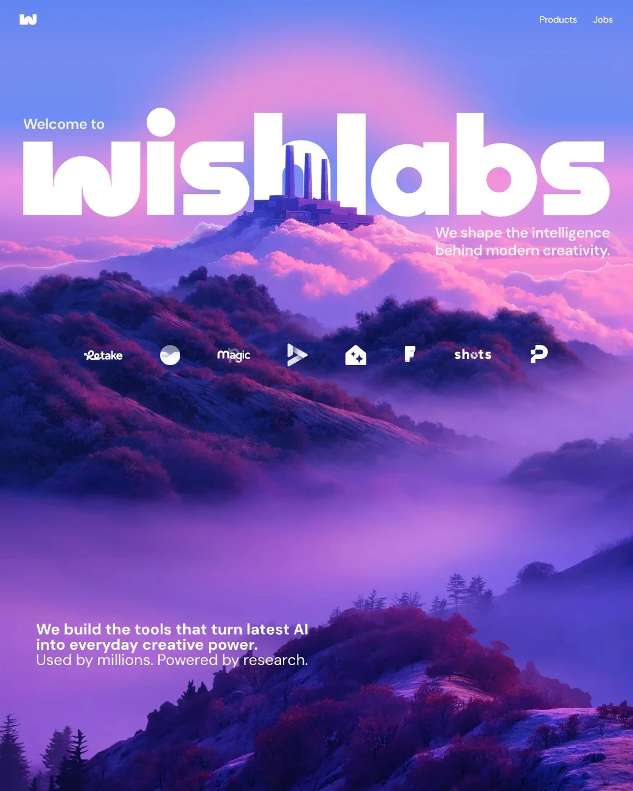
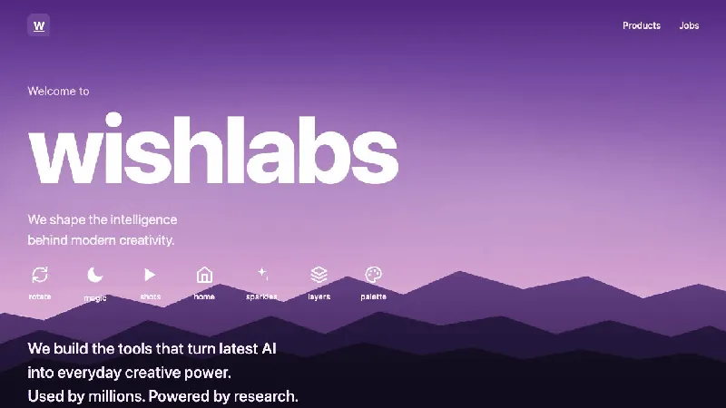
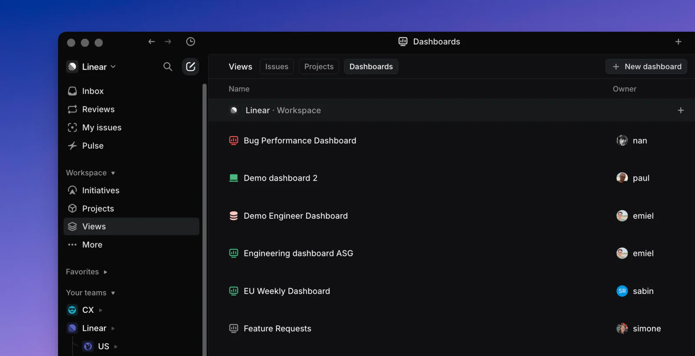
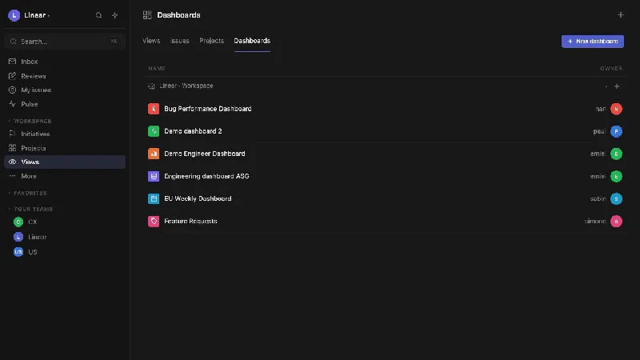
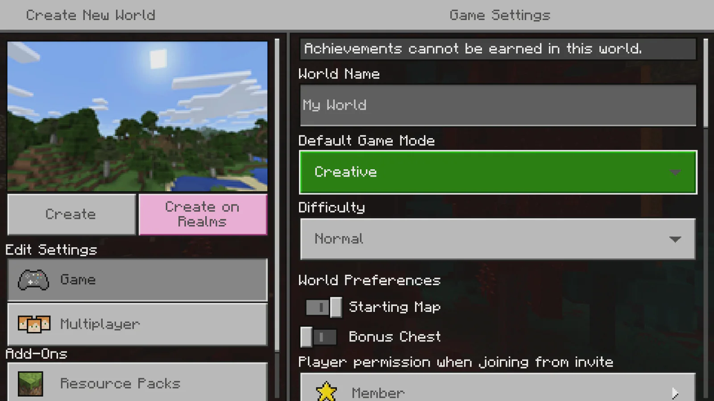
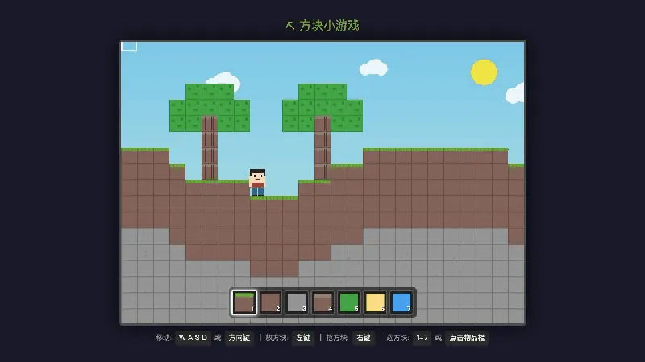
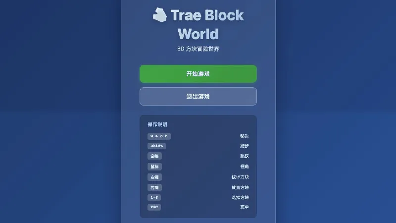

<script setup>
import StageAssignmentCard from '@theme/components/StageAssignmentCard.vue'

const duration = '約 <strong>2時間</strong>'
</script>

# スクリーンショットから複製：初めての模倣練習

前の授業では、一文でAIにプログラムを書かせました。今回はもっと目で追いやすい方法です。<strong>好きなスクリーンショットを選び、AIに見せながら作ってもらいます。</strong>

これは画像を見ながら積み木を組み立てることに似ています。色、余白、ボタンの位置を先に全部説明しなくても、画像が多くの情報を伝えてくれます。

<div style="text-align: center;">
<div style="display: inline-block; padding: 8px 20px; border-radius: 8px; border: 1px dashed #FFB6C1; background: linear-gradient(135deg, #FFF0F5 0%, #FFE4EC 100%); margin: 12px 0;">
  <span style="font-size: 15px; font-weight: 500; color: #666;">まず見本どおりに作り、少しずつ自分の作品へ変えよう 🧱</span>
</div>
</div>

## この章で行うこと

<ChapterIntroduction :duration="duration" :tags="['画面の複製', 'AIプログラミング', '初心者練習']" coreOutput="小さなプロジェクト1個" expectedOutput="開いてクリックできるWebページまたはミニゲーム">

実在する製品のスクリーンショットから、ブラウザーで動く小さなプロジェクトを作ります。製品サイト、データダッシュボード、簡単なゲームから選べます。

練習することは一つです。<strong>好きな画像を見つけ、AIへ渡し、自分の言葉で何を作りたいか一文で伝えます。</strong>

コードを書けなくても、完全な要件書がなくても構いません。最初の版を作ってもらい、表示された結果を見て、直したい場所を伝えます。

</ChapterIntroduction>

<div style="margin: 50px 0;">
  <ClientOnly>
    <StepBar :active="0" :items="[
      { title: '画像を選ぶ', description: '好きな画面を一つ探す' },
      { title: 'AIに渡す', description: 'チャットへドラッグする' },
      { title: '一文で頼む', description: '画像どおりに作ってもらう' },
      { title: '続けて直す', description: '違う場所を一つずつ直す' }
    ]" />
  </ClientOnly>
</div>

## 1. 作りたい作品を一つ選ぶ

作業を始める前に、今日は何を作りたいか決めます。

目標は機能がそろった大きな製品ではなく、<strong>開いて内容が分かり、簡単に操作できる一画面</strong>です。範囲が小さいほど、最初の成功に近づきます。

次の三つから選べます。

- <strong>製品サイト：</strong>見出し、説明、画像、ボタンがある
- <strong>SaaSダッシュボード：</strong>サイドバー、データカード、グラフがある
- <strong>簡単なゲーム：</strong>移動、クリック、または小さな目標がある

参考画像は次の三点で選びます。

1. 一枚で主要な内容が分かるか。
2. 本当に好きな部分があるか。
3. 完成後、似ているかをすぐ判断できるか。

大きな見出しと色が好きならトップ画面を保存します。ブロックの世界が好きなら、そのゲームらしさが一番分かる画像を選びます。

::: tip どこまで似せられるか
結果が近いほど、画面の細部をよく観察し、違いをAIへ伝えられたということです。完成後に画像を並べ、5割、7割、9割のどこまで近づいたか見てください。
:::

::: tip まず一画面だけ
最初からログイン、決済、チャット、管理画面、スマートフォンアプリを全部作りません。今見ている一枚を完成させます。
:::

## 2. 先生と一緒にWebページを作る

まず一連の手順を見てください。流れが分かったら、自分の画像で同じ操作を行います。

先生は空のフォルダーを作り、Traeで開きました。名前は`trae-screenshot-demo`で、最初はWebページもコードもありません。

### 2.1 参考画像をTraeへ渡す

参考にしたのはFramerの紹介画面です。大きな見出し、ナビゲーション、紫の山、操作ボタンが一枚に見えます。



_画像出典：[Framer Website Builder](https://www.framer.com/solutions/website-builder/)_

画像をTraeのチャットへドラッグし、短く伝えます。

```text
この画像を参考にWebページを作ってください。完成したら開いて見せてください。
```

画像が見た目を伝え、文章が「Webページへ変える」という目的を伝えます。

送信後はTraeがファイルを作り終えるまで待ちます。最初の処理中に新しい依頼を続けて送らないでください。

### 2.2 最初の版を見る

Traeは`index.html`、`styles.css`、`script.js`を作り、ブラウザーでページを開きました。授業で実際に生成した結果です。



まだコードは読みません。参考画像と比べて画面を見ます。

- 紫の空と山の雰囲気が残っている
- 中央に大きな見出しがある
- 上部にナビゲーション、下部に操作入口がある
- 文字、ボタン、画像が一つの画面を作っている

完全な複製ではありませんが、目立つ構造と雰囲気を捉えています。これで最初の版としては合格です。

### 2.3 最初は「見える」状態まで

フォントやボタン位置が少し違うだけで全部やり直さないでください。ページが開くことを確認し、一番分かりやすい問題を選びます。

見出しが小さければ、次のように頼みます。

```text
中央の見出しをもう少し大きくしてください。
```

変更後に再び開きます。前より自分の考えに近づけば、その修正には意味があります。

::: tip 普段の言葉でよい
Traeと一緒に作品を作っているのであり、プロンプトの試験を受けているのではありません。見たことを普段の言葉で伝えます。
:::

## 3. 自分で同じ手順を試す

Traeを開き、空のフォルダーを作って開きます。`my-first-page`のような簡単な名前で十分です。

次の順で操作します。

1. 好きなWebページまたはゲーム画像を探す。
2. チャット横の画像ボタンから画像を選ぶ。
3. 入力欄に画像が表示されたか確認する。
4. 短い依頼を入力して送る。

```text
この画像を参考にWebページを作ってください。
完成したら開いて見せてください。
```

最初の練習では、フレームワーク、フォルダー構成、ファイル名まで指定する必要はありません。Traeに任せます。

見た目だけ参考にし、元の名前と文章を使いたくない場合は、次を加えます。

```text
デザインは画像を参考にし、名前と内容は新しいものへ変えてください。
```

Traeが完了するまで待ちます。ファイル作成や実行の確認が出たら許可します。自動で開かない場合は次のように頼みます。

```text
このプロジェクトを起動してください。画面を確認したいです。
```

表示されたら10秒で、ページが開くか、主要内容があるか、ボタンが押せるかを確認します。一度に五、六か所を直し始めないでください。

## 4. 別の種類の作品でも使える

同じ方法は製品サイトだけのものではありません。先生はデータダッシュボードとブロックゲームも空のフォルダーから作りました。

### 例1：SaaSダッシュボード

SaaSでは進捗、売上、利用者データをダッシュボードで表示します。Linearの画面は左がナビゲーション、右が内容で、構造が明確です。



_授業の参考：[Linear Dashboards](https://linear.app/docs/dashboards)_

画像をTraeへ入れ、次のように頼みました。

```text
このようなデータダッシュボードを作ってください。
データは仮のもので構いません。
```

Traeはサイドバー、データカード、グラフを作りました。実際の動作画面です。



データは本物の業務データではありません。最初の目的は構造を作ることです。安定してからタイトルや数字を自分の内容へ置き換えます。

### 例2：ブロックゲーム

普通のWebページに興味がなければ、ゲーム画像で練習できます。先生はMinecraftのブロック世界を選びました。



_授業の参考：[Microsoft LearnのMinecraft例](https://learn.microsoft.com/en-us/xbox/accessibility/xbox-accessibility-guidelines/108)_

今回も依頼は短いままです。

```text
このようなブロックゲームを作ってください。
キャラクターを動かし、ブロックを置けるようにしてください。
```

Traeは、キャラクターを動かし、ブロックを置いたり壊したりできるブラウザーゲームを作りました。



これは<strong>2D横視点ゲーム</strong>です。キャラクターは平面で動き、前後の奥行きはありません。「ブロックゲーム」とだけ頼み、3Dとは言わなかったため、Traeは簡単な方法を選びました。

方向キーで歩き、画面をクリックしてブロックを置けるか試します。歩けて置ければ、2Dの最初の版は完成です。

### もう一つ3D版を作る

Minecraftに近い一人称画面が欲しい場合は、依頼に「3D」と入れます。新しい空プロジェクトへ同じ画像を入れ、次のように頼みました。

```text
このような3Dブロックゲームを作ってください。
歩く、視点を回す、ブロックを置く操作を入れてください。
```

今度は本当の3Dブロック世界が生成されました。



「ゲーム開始」を押した後、`WASD`で歩き、マウスで視点を回します。左クリックで壊し、右クリックで置き、数字キーで種類を変えます。

2Dと3Dのどちらが常に良いわけではありません。最初のゲームは2Dの方が完成しやすいです。世界の中を前後に歩くことが重要なら、「3Dが欲しい」と明確に伝えます。

::: tip 違う作品にする
参考画像は出発点です。色、テーマ、文章、画像、遊び方を変え、自分の作品へ育ててください。
:::

## 5. 最初の版が良くないとき

最初は似ていなかったり、ボタンが反応しなかったりしても普通です。プロジェクトは一文で終わらず、見て、少し直し、また見ます。

初心者がよくする失敗は、全問題を一つのメッセージに入れることです。変更が多すぎると、どれが結果へ影響したか分かりません。

簡単な規則を使います。<strong>一回につき一番目立つ問題を一つ選びます。</strong>

### 見た目が違う

カードが高すぎる場合：

```text
上のカードが高すぎます。少し低くしてください。
```

中央画像が小さい場合：

```text
中央の画像が小さすぎます。大きくしてください。
```

背景が暗い場合：

```text
背景が暗すぎます。明るい色へ変えてください。
```

### 操作が正しくない

ボタンが反応しない場合：

```text
このボタンを押しても反応しません。直してください。
```

ゲームで動けない場合：

```text
方向キーを押しても動きません。移動を直してください。
```

### 問題を言葉にできない

現在の画面を撮り、次のように伝えます。

```text
これが現在の結果です。参考画像と比べ、一番大きな違いを先に直してください。
```

「margin」や「responsive layout」という専門語を知らなくても構いません。「詰まりすぎ」「文字が読みにくい」「スマートフォンで崩れる」で伝わります。一つ直してから次へ進みます。

## 6. 授業の確認

静止画像を見るだけでなく、本当にページを開き、自分でクリックまたはプレイします。

次の四点を確認します。

- <strong>開ける：</strong>再読み込みしても空白やエラーにならない
- <strong>理解できる：</strong>製品サイト、ダッシュボード、ゲームのどれか分かる
- <strong>操作できる：</strong>主要ボタンまたは基本操作が使える
- <strong>崩れない：</strong>画面を狭くしても文字と画像が大きく重ならない

一つ失敗したら、見えた現象をTraeへ伝え、その問題だけを直してもらいます。四つ通れば授業の作品は完成です。

::: tip 小さな作品を一つ完成させる
ログイン、決済、グループチャット、オンライン対戦は今日の内容ではありません。十個を始めて一つも終わらないより、小さな一画面を完成させる方が大切です。
:::

## 📚 課題

<StageAssignmentCard title="スクリーンショット1枚から自分のページを作る">

  <p>好きなWebページまたはゲーム画像をAIへ渡し、一画面だけを複製します。</p>

  <ol>
    <li>参考にした画像を保存します。</li>
    <li>最初の版を作り、気になる場所を一つ修正します。</li>
    <li>修正後の作品画像を保存します。</li>
  </ol>

  <p>発表では参考画像と作品を並べ、自分が直した一か所を説明します。</p>
</StageAssignmentCard>

## この章のまとめ

今日はコードではなく画像から始めました。手順は四つです。

1. 画像を保存する
2. AIへ渡す
3. 一文で依頼する
4. 違う場所を一つずつ直す

画像は「どう見えるか」をAIへ伝え、あなたの言葉は「何をするか」を伝えます。最初の版が出たら、クリック、観察、スクリーンショットを使って次の問題を少しずつ説明します。

依頼は技術仕様書のように書く必要はありません。簡単な一文で動かし、目の前の結果から会話を続けます。プロジェクト作りが少しずつ身近になります。
