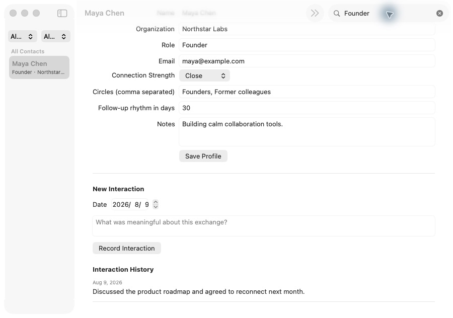

# GitHub Issues で AI 開発を最後まで進める：要件対話から macOS アプリ完成まで

このチュートリアルでは、曖昧なアイデアを AI と整理し、仕様書（Spec）に固定し、優先度と依存関係を持つ GitHub Issues に分解して、実装・テスト・レビューまで完了する一連の流れを実践します。

::: info 前の記事との違い

[Vibe Coding から Spec Coding へ](/ja-jp/stage-3/core-skills/spec-coding/)は、なぜ仕様が AI 開発の中心になるのかを説明します。本記事はその実践編です。実在する公開リポジトリを使い、Spec が Issues、コミット、テスト、完成品へ変わる過程を追います。

:::

出発点は次の一文だけでした。

> インポートした連絡先を管理し、人間関係を整理できる macOS 向け CRM を作りたい。最初はダミーデータでよい。

完成した **Relationship Compass** は、連絡先の検索・絞り込み、関係プロフィールの編集、CSV インポート、交流履歴、次回フォロー日の計算に対応するネイティブ macOS アプリです。


[公開サンプルリポジトリ](https://github.com/sanbuphy/relationship-compass-macos)には、Spec、Issues、コミット履歴、コード、テストがすべて残っています。データは架空です。

## 1. Spec 駆動開発とは

よくある AI 開発は次のループです。

```text
やりたいことを伝える → AI が実装 → 違いに気づく → 指示を追加 → 再修正
```

小さな画面なら十分ですが、規模が大きくなると、過去の要件が会話から抜け、進捗が見えにくくなり、「動くが要件を満たしていない」状態が起こります。

Matt Pocock の Skills は、AI に再現可能な作業手順を与えます。Skill はコードだけでなく、各段階で何を確認し、何を成果物として残し、いつ人の確認を待つかを定めます。

| 会話だけで実装 | Spec 駆動開発 |
| --- | --- |
| 現在のチャットが主な情報源 | バージョン管理された Spec が基準 |
| 要件を思いつくたび追加 | 先に Spec とタスクを更新 |
| 進捗は AI の要約に存在 | 進捗は Issues とコミットに存在 |
| 「動いた」で完了判断 | 受け入れ条件を一つずつ確認 |

### 1.1 GitHub が担う三つの役割

1. **プロジェクトの記録庫**：Spec、用語、重要な設計判断を保存する。
2. **タスクボード**：Issues、優先度、依存関係で実行順を示す。
3. **完了の証拠**：コミット、テスト結果、Issue の状態を残す。

| GitHub 上の成果物 | 意味 | 例 |
| --- | --- | --- |
| Spec | 完成時に実現すべきこと | `specs/relationship-compass-mvp.md` |
| Issue | 独立して完了できる作業 | `#2 Browse sample Contacts` |
| 依存関係 | 先に終える必要がある作業 | `#3` は `#2` に依存 |
| Commit | その回で変更した内容 | `feat: browse sample contacts` |
| Tests | 振る舞いが壊れていない証拠 | `swift test` |
| ADR | 重要な技術選択の理由 | `docs/adr/0002-native-swiftui-macos.md` |


### 1.2 使用するメインフロー

```text
grill-with-docs → to-spec → to-tickets → implement → code-review
```

- `grill-with-docs`：要件と技術上の境界を対話で確定する。
- `to-spec`：合意を正式な仕様書にする。
- `to-tickets`：優先度と依存関係を持つ Issues に分解する。
- `implement`：着手可能な Issue を一件ずつ実装する。
- `code-review`：コード品質と要件の抜けを別々に検査する。

## 2. 準備

GitHub アカウント、認証済みの GitHub CLI、Node.js 18 以上、Skills を読める AI コーディングツールを用意します。アプリを動かす場合は Mac と Xcode も必要です。

```bash
npx skills@latest add mattpocock/skills -y
gh auth status
gh repo create relationship-compass-macos \
  --public \
  --source . \
  --remote origin \
  --push
```

公開例では `--public` を使いますが、実際の連絡先を扱う場合は `--private` にし、サンプル、ログ、Git 履歴に個人情報がないことを確認してください。

タスクには `ready-for-agent`、`priority:P0/P1/P2`、`completed-by-agent` を使います。

## 3. 作る製品と MVP の境界

初版は次の機能に絞ります。

- 六人の固定ダミー連絡先。
- 名前・組織・役職・メール・サークルの検索。
- 関係の強さとサークルによる複合絞り込み。
- プロフィール、メモ、フォロー周期の編集。
- UTF-8 CSV の検証・重複排除インポート。
- 交流記録と次回フォロー日の計算。
- ローカル JSON への保存と起動時の復元。

クラウド同期、AI による関係スコア、アカウント、バックエンド、macOS 連絡先へのアクセスは対象外です。

## 4. `grill-with-docs` で要件を収束させる

<div class="workflow-chat">
  <div class="workflow-message workflow-message--user">
    <div class="workflow-message__speaker">🙋 あなた</div>
    <div class="workflow-message__command">/grill-with-docs</div>
    <p>インポートした連絡先を管理し、人間関係を整理できる macOS 向け CRM を作りたいです。最初はダミーデータで構いません。</p>
  </div>
  <div class="workflow-message workflow-message--agent">
    <div class="workflow-message__speaker">✨ Agent</div>
    <p>コードを書く前に、初版で行うこと・行わないこと、データの保存先、技術、検証方法を決めましょう。選択が必要なときは違いを説明し、推奨案を示します。</p>
  </div>
</div>

対話の結果、macOS 14+ のネイティブ SwiftUI、ローカル JSON、UTF-8 CSV、六人のダミーデータ、外部通信なしという境界を確認しました。`CONTEXT.md` には `Contact`、`Interaction`、`Follow-up` の意味を固定し、次の ADR を残しました。

- `0001-local-first-private-data.md`
- `0002-native-swiftui-macos.md`

::: info この段階の GitHub

会話で決めた内容を `CONTEXT.md` と `docs/adr/` にコミットします。GitHub は「確認済みの文脈」を保存しますが、まだ実装 Issue は作りません。

:::

## 5. `to-spec` で正式な仕様書を作る

<div class="workflow-chat">
  <div class="workflow-message workflow-message--user">
    <div class="workflow-message__speaker">🙋 あなた</div>
    <div class="workflow-message__command">/to-spec</div>
    <p>合意した内容を完全な仕様書にまとめ、リポジトリへ保存し、ready-for-agent ラベル付きの GitHub 親 Issue として公開してください。</p>
  </div>
</div>

生成された [`specs/relationship-compass-mvp.md`](https://github.com/sanbuphy/relationship-compass-macos/blob/main/specs/relationship-compass-mvp.md)には、問題、MVP、24 のユーザーストーリー、技術判断、検証方法、明確な非対象が含まれます。同じ内容への入口が [Issue #1](https://github.com/sanbuphy/relationship-compass-macos/issues/1)です。

良い Spec はファイル名ではなく振る舞いを書きます。たとえば「交流履歴がない連絡先もフォロー対象に表示する」は、内部構造を変えても有効な受け入れ条件です。

::: info この段階の GitHub

Markdown は差分とレビューに向き、親 Issue は進捗の入口になります。要件変更はチャットだけで済ませず、Spec を更新して履歴を残します。

:::

## 6. `to-tickets` で縦割りの Issues にする

<div class="workflow-chat">
  <div class="workflow-message workflow-message--user">
    <div class="workflow-message__speaker">🙋 あなた</div>
    <div class="workflow-message__command">/to-tickets</div>
    <p>各チケットが単独でデモできる小さな機能になるように Issues を分解し、優先度、完了条件、前提タスクを書いてください。公開前に一覧と依存関係を見せてください。</p>
  </div>
</div>

| Issue | 優先度 | 完了後に確認できること | 依存 |
| --- | --- | --- | --- |
| [#2 Browse sample Contacts](https://github.com/sanbuphy/relationship-compass-macos/issues/2) | P0 | 起動、サンプル、検索、詳細 | なし |
| [#3 Import and persist](https://github.com/sanbuphy/relationship-compass-macos/issues/3) | P0 | CSV 重複排除と JSON 保存 | #2 |
| [#4 Organize Profiles](https://github.com/sanbuphy/relationship-compass-macos/issues/4) | P1 | 編集、関係の強さ、サークル | #2 |
| [#5 Interactions and Follow-ups](https://github.com/sanbuphy/relationship-compass-macos/issues/5) | P1 | 履歴とフォロー一覧 | #4 |
| [#6 Polish and verify](https://github.com/sanbuphy/relationship-compass-macos/issues/6) | P2 | エラー、文書、パッケージ、検証 | #3、#5 |

モデル、Store、UI、テストを横に分けるのではなく、一枚閉じるたびに利用者が新しい結果を確認できる**縦のスライス**にします。

## 7. `implement` で着手可能な Issue から実装する

<div class="workflow-chat">
  <div class="workflow-message workflow-message--user">
    <div class="workflow-message__speaker">🙋 あなた</div>
    <div class="workflow-message__command">/implement</div>
    <p>優先度と依存関係に従い、ready-for-agent Issues をすべて実装してください。着手可能な一件だけを扱い、先に失敗する振る舞いテストを書き、ビルドとテストを通してから個別にコミットしてください。</p>
  </div>
</div>

CSV タスクでは「同じ CSV を二回入れても人数が増えない」テストを先に失敗させ、読込と重複排除を実装しました。続いて、不正なヘッダーでも既存データを壊さないテストを追加しました。

```bash
swift test --filter RelationshipStoreTests
swift build
swift test
```

最終的に 13 件の振る舞いテストが通ります。


完了時、Agent はコミットとテスト結果を Issue に書き、`ready-for-agent` を外して `completed-by-agent` を付け、Issue を閉じます。

## 8. `code-review` で二種類の漏れを探す

第一のレビューは命名、重複、巨大な画面、結合度、`AGENTS.md` への適合などコードの健康状態を確認します。第二のレビューは Spec と全 Issues を読み直し、要件が本当に完了したかを確認します。

実際のレビューでは、重複 CSV ヘッダー、メールなし連絡先の重複判定、Follow-ups 側の絞り込み、起動時の自動復元、次回フォロー日の表示に不足が見つかりました。先にテストを追加して修正し、二つのレビューを再実行しました。

テスト成功は「テストに書かれた振る舞い」の証拠であり、「Spec の全項目がテストされた」証拠ではありません。だから最後の仕様照合が必要です。

## 9. 完成したソフトウェア

| 成果物 | 結果 |
| --- | --- |
| GitHub 管理 | 親 Issue 1 件と実装 Issues 5 件をすべて完了 |
| 実装履歴 | 依存順に九つの小さなコミット |
| 自動検証 | 13/13 テスト成功、全体ビルド成功 |
| 最終レビュー | コード品質と要件完成度の両方が合格 |
| 実行物 | `Relationship Compass.app` を生成可能 |
| プライバシー | ローカル保存のみ、連絡先権限とアップロードなし |

### 9.1 検索と複合絞り込み

`Founder` を検索すると Maya Chen だけが残り、関係の強さとサークルも組み合わせられます。



### 9.2 関係プロフィールの編集

組織、役職、メール、関係の強さ、サークル、周期、メモを編集できます。


### 9.3 交流記録と次回フォロー

2026 年 8 月 9 日の交流と 30 日周期から、次回日は 2026 年 9 月 8 日になります。


```bash
git clone https://github.com/sanbuphy/relationship-compass-macos.git
cd relationship-compass-macos
swift build
swift test
./scripts/package-app.sh
open "dist/Relationship Compass.app"
```

## 10. そのまま使える入力

```text
/grill-with-docs
初版で行うこと・行わないこと、データ保存、技術、検証方法を一緒に決めてください。
選択肢の違いと推奨を示し、私が合意するまでコードを書かないでください。

/to-spec
合意内容を受け入れ条件と非対象を含む Spec にし、リポジトリと親 GitHub Issue に保存してください。

/to-tickets
Spec を、優先度・完了条件・依存関係を持つ縦割りの GitHub Issues にしてください。

/implement
着手可能な Issue を優先順に一件ずつ TDD で実装し、個別に検証・コミットしてください。
最後にコード品質と Spec 完成度をレビューし、すべての指摘を修正してください。
```

## 11. AI に連続実装を任せてよい場面

範囲が収束した MVP、観察可能な受け入れ条件を持つサイト・アプリ・バックエンド、テストやビルドで検証できるリポジトリに適します。要件が頻繁に変わる、検証手段がない、本番データを直接変更する仕事には向きません。

人は、要件範囲、Issues 公開前の漏れと順序、課金・デプロイ・削除・権限・個人情報を伴う操作、最終画面と成果物を確認します。目標と境界と受け入れは人が持ち、AI は合意済みの作業を安定して実行します。

## まとめ

```text
曖昧なアイデア
  ↓ grill-with-docs
合意した範囲・用語・重要な技術判断
  ↓ to-spec
バージョン管理された検証可能な要件
  ↓ to-tickets
優先度と依存関係を持つ GitHub Issues
  ↓ implement
一件ずつテスト・実装・コミット
  ↓ code-review
コード品質 + Spec 完成度
  ↓
ビルド・検証できるソフトウェア
```

会話が終わっても、Spec、Issues、依存関係、コミット、テストは GitHub に残ります。次のセッションは推測ではなく、記録された状態から再開できます。

## 参考資料

- [Skills to Spec](https://www.aihero.dev/skills-to-spec)
- [AI Skills for Real Engineers](https://www.aihero.dev/skills)
- [Skills v1.1 更新履歴](https://www.aihero.dev/skills/skills-changelog-v1-1-wayfinder-to-spec-to-tickets-grilling-improvements)
- [OpenAI：反復可能なワークフローを Skills として保存する](https://learn.chatgpt.com/codex/use-cases/reusable-codex-skills)
- [Relationship Compass 公開サンプル](https://github.com/sanbuphy/relationship-compass-macos)
