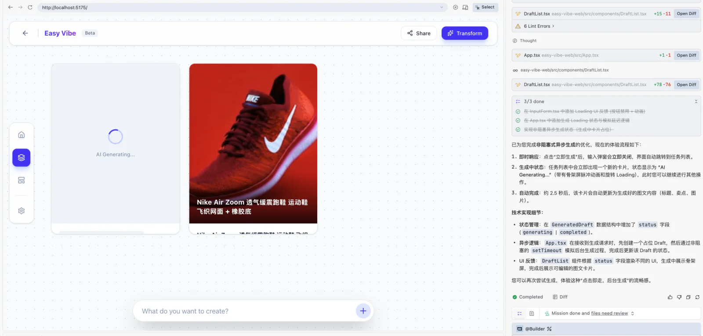

<script setup>
import { relatedArticlesMap } from '@theme/data/relatedArticles'
import StageAssignmentCard from '@theme/components/StageAssignmentCard.vue'
import ProductFinishMap from '../../../zh-cn/stage-1/complete-project-practice/ProductFinishMap.vue'
import StageOneCompletion from '../../../zh-cn/stage-1/complete-project-practice/StageOneCompletion.vue'

const duration = '약 <strong>2~3일</strong>'
const relatedArticles =
  relatedArticlesMap['ko-kr/stage-1/complete-project-practice'] ?? []
</script>

# 완성 프로젝트 실습: 아이디어를 작품으로 만들기


## 이번 장에서 할 일

<ChapterIntroduction :duration="duration" :tags="['전체 사용', '제품 경험', '사용자 테스트', '작품 소개']" coreOutput="설명 없이도 다른 사람이 사용할 수 있는 AI 제품 1개" expectedOutput="실제 사용과 수정을 거친 웹 작품">

앞 장들에서는 하나의 아이디어에서 출발해 조작 가능한 프로토타입을 만들고, 페이지 안의 AI 기능도 실제로 작동하게 했습니다.

만든 사람은 무엇을 입력하고 어디를 눌러야 하는지 압니다. 하지만 페이지를 처음 연 사람은 첫 단계조차 찾지 못할 수 있습니다. 버튼을 누른 뒤 바로 결과가 나타나지 않으면 고장 났다고 생각할 수도 있습니다.

이번 장에서는 새 기능을 더하지 않습니다. 제품을 처음부터 끝까지 사용하면서 막히기 쉬운 부분을 고치고, 다른 사람에게도 맡겨 봅니다. 마지막에는 안심하고 공유할 수 있는 작품을 갖게 됩니다.

</ChapterIntroduction>

<div style="margin: 50px 0;">
  <ClientOnly>
    <StepBar :active="0" :items="[
      { title: '직접 사용하기', description: '처음부터 결과까지 진행' },
      { title: '막히는 곳 고치기', description: '대기, 결과, 실패' },
      { title: '다른 사람에게 맡기기', description: '먼저 관찰하고 대신 조작하지 않기' },
      { title: '정리하고 공유하기', description: '다른 사람이 작품을 이해하도록 준비' }
    ]" />
  </ClientOnly>
</div>

<ProductFinishMap />

## 1. 제품을 처음부터 끝까지 한 번 사용하기

로그인, 팀 협업, 데이터 대시보드를 서둘러 추가하지 마세요. 지금 제품을 열고 사용자처럼 첫 화면부터 결과를 얻는 순간까지 사용합니다. 옆에서 설명해야만 넘어갈 수 있는 단계가 다음에 고칠 곳입니다.

이 과정에서 만든 쇼핑몰 콘텐츠 작업대의 전체 사용 흐름은 다음과 같습니다.

> 쇼핑몰 운영자가 상품 이미지를 올리고 필요한 정보를 보충한 뒤, 이미지와 문구 초안을 생성한다. 결과를 확인하고 복사하거나 저장해 이후 수정과 상품 등록에 사용한다.

우선 이 짧은 흐름만 잘 작동하면 됩니다. 로그인, 팀 권한, 정식 배포는 제품에 정말 필요해진 뒤 추가해도 늦지 않습니다.

### 1.1 실제 사용 순서대로 진행하기

코드와 컴포넌트는 잠시 보지 말고, 사용자가 할 일을 순서대로 진행합니다.

1. 페이지를 열고 이 도구가 무엇을 도와주는지 이해한다.
2. 상품 이미지를 올리고 이름, 재질 같은 필수 정보를 입력한다.
3. “문구 생성”을 누르고 페이지가 처리 중임을 확인한다.
4. AI가 돌려준 제목과 장점을 확인하고, 문제가 있으면 수정하거나 다시 생성한다.
5. 결과를 복사, 다운로드 또는 임시 저장해 이번 작업을 마친다.

끝까지 진행한 뒤 물어보세요. “내가 옆에 없어도 상대가 계속할 수 있을까?” 팀원 관리나 복잡한 대시보드처럼 이번 사용에 영향을 주지 않는 기능은 메모만 하고 지금 만들지 않습니다.

::: tip 이번 버전은 어느 정도면 될까요?
상대에게 한 문장으로 할 일을 알려 주었을 때 몇 분 안에 직접 시작할 수 있다면, 보통 적절한 범위입니다.
:::

### 1.2 빈 화면에서 다시 해 보기

오랫동안 개발한 페이지에는 테스트 데이터와 지난 결과가 남아 있기 쉽습니다. 그래서 처음 연 사람에게 아무것도 없다는 사실을 잊곤 합니다. 시크릿 창을 열거나 로컬 데이터를 지우고 처음부터 다시 해 보세요.

아래 세 가지만 확인하면 됩니다.

1. **빈 상태로 열기:** 아무것도 입력하지 않고 눌러서 필요한 항목을 알려 주는지 확인합니다.
2. **정상 생성하기:** 이미지를 올리고 콘텐츠를 생성해 대기 안내와 결과 뒤의 다음 행동을 확인합니다.
3. **한 번 실패시키기:** 지원하지 않는 파일을 올리거나 요청을 실패시켜 입력이 남고 재시도할 수 있는지 확인합니다.

막힌 곳을 적어 두고 다음 절에서 하나씩 고칩니다.

AI IDE가 코드를 점검하도록 할 수 있지만, 실제 조작을 대신할 수는 없습니다.

```text
아직 코드는 수정하지 마세요.

현재 프로젝트를 다음 사용자 작업에 따라 확인하세요.
사용자가 상품 이미지를 올리고 필요한 정보를 입력한 뒤 문구를 생성하고,
결과를 확인해 복사하거나 저장합니다.

이 흐름과 관련된 페이지와 파일,
현재 중단될 가능성이 있는 곳을 알려 주세요.
```

AI IDE는 문제가 생길 만한 코드를 찾을 수 있습니다. 페이지가 쓰기 좋은지는 직접 눌러 봐야 알 수 있습니다.

## 2. 사용자가 막히기 쉬운 곳 고치기

처음부터 한 번 사용하면 문제는 보통 네 순간에 나타납니다. 첫 화면, AI를 기다리는 동안, 결과를 받은 뒤, 요청이 실패했을 때입니다. 복잡한 디자인은 필요 없습니다. 무슨 일이 일어났고 다음에 무엇을 할 수 있는지만 알면 됩니다.

### 2.1 처음 열어도 무엇을 해야 하는지 아는가?

빈 페이지에 입력 칸만 두지 마세요. 짧은 설명, 예시 내용, 또는 지원하는 이미지 형식과 크기를 업로드 영역 가까이에 보여 줍니다.

입력 항목이 많다면 유용한 결과에 꼭 필요한 것만 남깁니다. 상품명, 이미지, 핵심 특징은 필수로 하고, 브랜드, 참고 링크, 세부 스타일은 “추가 설정”에 둘 수 있습니다. 처음 쓰는 사람에게 긴 신청서를 먼저 채우게 하지 마세요.

### 2.2 버튼을 누른 뒤 반응이 보이는가?

AI 요청은 몇 초 이상 걸릴 수 있습니다. 누른 뒤에는 버튼에 “생성 중”을 표시하고 중복 제출을 잠시 막습니다. 입력한 내용을 갑자기 지우거나 빈 결과 영역으로 바로 이동시키지 마세요.



*대기 상태에 복잡한 애니메이션은 필요 없습니다. 작업이 시작되었음을 보여 주고 기존 입력과 화면 위치를 유지하는 것만으로도 대부분의 혼란을 줄일 수 있습니다.*

이미지나 동영상 작업이 대기열을 거친다면 “대기 중”, “생성 중” 같은 단계를 표시할 수 있습니다. API가 실제 진행률을 제공하지 않는다면 정확해 보이는 퍼센트를 꾸며 내지 마세요.

### 2.3 결과가 나온 뒤 다음 행동이 있는가?

AI 응답은 흐름의 끝이 아닙니다. 사용자는 사실을 확인하고 표현을 고친 뒤 결과를 다음 작업으로 가져가야 합니다. 결과 영역에는 편집, 복사, 다운로드, 다시 생성 가운데 적어도 하나를 제공해야 합니다.


*업로드한 상품 이미지를 남겨 두고 그 아래에 인식과 생성 결과를 보여 줍니다. 사용자는 모델의 한 번 답변을 그대로 받지 않고 원본과 비교할 수 있습니다.*

모델이 확인할 수 없는 정보는 표시하고 사용자가 보충하거나 삭제하도록 합니다. 한 문단을 “최종 답”처럼 보이는 것보다 실제 업무에 잘 맞습니다.

### 2.4 실패한 뒤에도 계속할 수 있는가?

네트워크 끊김, 사용량 한도, 파일 형식 때문에 요청이 실패할 수 있습니다. 일반 사용자에게 기술 오류 전체를 보여 줄 필요는 없지만, 이번 작업이 완료되지 않았고 다시 시도하거나 입력을 바꿀 수 있다는 점은 알려야 합니다.

예를 들면 다음과 같습니다.

- **지원하지 않는 이미지 형식:** 가능한 형식을 알려 주고 파일을 다시 고르게 합니다.
- **필수 정보 누락:** “매개변수 오류”만 띄우지 말고 해당 입력 칸 가까이에 설명합니다.
- **AI 서비스를 잠시 사용할 수 없음:** 입력을 보존하고 “다시 생성”을 제공합니다.
- **결과가 기대와 다름:** 처음부터 다시 하지 않고 입력을 수정해 재시도하게 합니다.

새로 고침 때문에 긴 입력을 잃는다면 LocalStorage에 폼 초안을 임시 저장할 수 있습니다. 작업을 이어 가는 데 필요한 일반 데이터만 보관하고, API Key, 실제 고객 정보, 민감한 파일은 브라우저 저장소에 넣지 마세요.

발견한 문제를 AI IDE에 한 번에 전달합니다.

```text
“상품 이미지를 올리고 문구를 생성하는” 흐름을
시작, 대기, 성공, 실패 네 순간으로 확인하세요.

사용자가 계속하지 못하게 하는 문제부터 고쳐 주세요.
- 필수 항목 안내가 없습니다.
- 요청 중에도 버튼을 여러 번 누를 수 있습니다.
- 실패하면 입력이 사라집니다.
- 결과에 편집, 복사, 다시 생성 기능이 없습니다.

수정 전에 바꿀 파일을 알려 주세요.
완료한 뒤에는 수동 테스트 절차를 적어 주세요.
```

## 3. 다른 사람에게 한 번 맡겨 보기

직접 만든 페이지는 오래 볼수록 모든 조작이 자연스럽게 느껴집니다. 개발에 참여하지 않은 사람은 몇 분 만에 우리가 놓친 문제를 찾아냅니다.

가능하면 실제로 사용할 만한 사람을 찾으세요. 쇼핑몰 콘텐츠 도구라면 쇼핑몰 운영이나 상품 콘텐츠 제작 경험이 있는 사람이 좋습니다. 없다면 이 페이지를 본 적 없는 친구도 괜찮습니다.

### 3.1 해야 할 일만 알려 주기

테스트를 시작할 때는 목표만 말합니다.

> 이 도구로 상품 이미지에서 제목과 장점을 만들어 주세요. 내용을 확인한 뒤 계속 수정할 만한 버전을 복사하세요.

어디를 누를지 바로 알려 주지 말고 먼저 관찰합니다. 멈춤, 뒤로 가기, 반복 클릭, 질문이 나온 위치를 기록합니다. 곧바로 설명하면 페이지가 해결해야 할 문제를 가리게 됩니다.

한두 명만으로도 명확한 문제를 많이 찾을 수 있습니다. 정식 보고서는 필요 없고 멈춘 곳을 적으면 됩니다.

페이지를 연 뒤 움직이지 않으면 용도 설명을 보탭니다. “생성”을 반복해서 누르면 대기 상태를 더 뚜렷하게 만듭니다. 결과 뒤에 할 일을 모르면 편집이나 복사를 추가합니다. 실패 뒤 모든 내용을 다시 써야 한다면 입력을 남기고 재시도 버튼을 제공합니다.

### 3.2 사용이 끝난 뒤 이야기하기

사용자가 작업을 완료하거나 포기한 뒤 묻습니다.

1. 어느 단계가 가장 확실하지 않았나요?
2. 생성 결과 중 바로 쓸 내용과 꼭 고칠 내용은 무엇인가요?
3. 다음에 같은 일이 생기면 다시 사용하고 싶나요? 왜 그런가요?

“쓰기 좋았나요?”만 묻지 마세요. 예의상 하는 “괜찮았어요”는 수정 방향을 주기 어렵습니다. 구체적인 행동과 사례가 더 중요합니다.

::: warning 실제 자료를 사용할 때
테스트 참가자가 올리는 상품, 녹음, 문서에는 실제 업무 정보가 포함될 수 있습니다. 어떤 종류의 AI 서비스로 자료가 전송되는지 미리 설명하고, 허가받지 않은 고객 자료는 쓰지 않으며, 더 이상 필요하지 않은 파일은 테스트 뒤 삭제하세요.
:::

## 4. 막힌 곳을 고친 뒤 다시 사용하기

테스트 뒤 많은 문제가 생길 수 있습니다. 모두 고칠 필요는 없습니다. 작업을 끝내지 못하게 하거나 결과를 믿을 수 없게 만드는 문제부터 해결합니다.

다음 순서를 사용하세요.

1. **작업을 완료할 수 없음:** 버튼이 작동하지 않거나 요청이 실패하고 결과를 가져갈 수 없음.
2. **결과를 믿기 어려움:** 정보를 지어내거나 확인할 수 없고 필요한 출처가 없음.
3. **조작을 오해하기 쉬움:** 시작점이나 현재 상태가 명확하지 않음.
4. **사용 비용이 큼:** 단계가 반복되고 입력이 사라지며 대기 안내가 없음.
5. **스타일과 추가 기능:** 핵심 작업에 영향을 주지 않는 꾸미기와 희망 기능.

가장 중요한 한두 개에서 세 개를 고릅니다. 수정 후 직접 다시 해 보고, 가능하면 같은 사람에게 돌아와 확인해 달라고 합니다. 원래 막혔던 곳이 사라져야 유용한 수정입니다.

### 4.1 AI IDE에 구체적인 문제를 말하기

“최적화해 줘”라고만 하지 마세요. 관찰한 상황을 적어야 어디를 고칠지 알 수 있습니다.

```text
사용자 작업: 상품 이미지를 올리고 장점 세 개를 생성한다.

관찰한 문제:
두 명의 테스트 사용자가 “생성”을 연속으로 눌렀습니다.
요청이 시작되었다는 표시가 없어서 중복 작업이 만들어졌습니다.

현재 페이지를 수정하세요.
1. 요청이 시작되면 생성 버튼을 비활성화하고 “생성 중”을 표시합니다.
2. 성공하거나 실패하면 버튼을 복구합니다.
3. 사용자가 입력한 내용은 지우지 않습니다.
4. 연속 클릭과 실패를 수동으로 테스트하는 방법을 알려 주세요.
```

이렇게 쓰면 수정이 빗나가기 어렵고, 나중에 확인할 내용도 분명합니다.

### 4.2 수정 후 처음부터 다시 해 보기

한 곳을 고치면 다른 곳에 영향을 줄 수 있습니다. 공유하기 전에 아래 네 상황을 확인합니다.

- 필요한 정보가 모두 있는 정상 입력.
- 필수 항목 하나가 빠진 입력.
- API 요청 실패 또는 시간 초과.
- 결과를 받은 뒤 편집, 복사, 다시 생성.

초안을 저장하는 제품이라면 페이지를 새로 고친 뒤도 시험합니다. 새 기능뿐 아니라 원래의 핵심 흐름이 망가지지 않았는지도 확인하세요.

## 5. 작품을 공유할 수 있게 정리하기

이제 작품은 내 컴퓨터에서 “실행만 되는” 상태가 아닙니다. 다른 사람이 사용했고, 실제 문제에 따라 한 번 수정했습니다. 입구와 설명을 정리하면 더 많은 사람에게 보여 줄 수 있습니다.

### 5.1 1분 안에 설명하기

아래 순서로 소개할 수 있습니다.

1. **누가 어떤 문제를 겪는가:** 쇼핑몰 운영자는 첫 상품 문구를 준비할 때 이미지와 장점을 반복해서 정리한다.
2. **제품이 어떻게 돕는가:** 상품 이미지와 정보를 올려 계속 수정할 수 있는 초안을 생성한다.
3. **어떤 AI 기능을 쓰는가:** 이미지 이해와 텍스트 생성.
4. **사용자가 어떻게 완료하는가:** 업로드, 생성, 확인, 수정, 복사.
5. **테스트 뒤 무엇을 고쳤는가:** 대기 상태를 추가하고 실패 뒤에도 입력을 보존함.

프레임워크와 모델 이름을 나열하기 전에 무엇을 만들었는지 먼저 이해하게 하세요.

### 5.2 다른 사람에게 필요한 자료 준비하기

공유 전에 세 가지를 준비합니다.

1. **실행 가능한 앱:** 접근 링크를 제공합니다. 아직 배포하지 않았다면 시작 명령과 주소를 적습니다.
2. **30~60초 시연 영상:** 입력부터 결과까지 한 번의 핵심 작업을 보여 줍니다. 화면만 빠르게 바꾸지 마세요.
3. **한 페이지 설명:** 대상 사용자, 핵심 문제, 주요 흐름, AI 기능, 사용자 피드백 하나, 그에 따른 수정 내용을 씁니다.

원격 접근이 어렵다면 로컬 실행과 시연 영상도 Stage 1 결과가 됩니다. 다른 사람이 제품을 이해하고 핵심 흐름이 실제로 완료됨을 보는 것이 중요합니다.

### 5.3 이 작품을 계속할까, 다른 작품을 만들까?

이번 장의 쇼핑몰 콘텐츠 작업대를 이어 가도 되고, 같은 방법을 회의 정리, 오디오 콘텐츠, 학습 지원, 업무 도구에 적용해도 됩니다. [AI 활용 장면 참고](../appendix-industry-scenarios/index.md)에서 방향을 넓힐 수 있습니다.

독창적으로 보이려고 낯선 주제를 새로 만들 필요는 없습니다. 공부, 일, 생활에서 나온 작은 문제라도 실제 사람이 써 보고 수정한 작품은, 기능은 많지만 아무도 사용하지 않은 페이지보다 설득력이 있습니다.

### 공유하기 전에

마지막으로 공유 링크를 열고 처음부터 사용합니다. 다른 사람이 열 수 있고 AI가 결과를 반환하며 페이지와 스크린샷에 API Key가 없는지 확인합니다. 다른 사람의 이미지, 음성, 문서를 썼다면 사용 허가도 확인하세요.

## 6. 📚 과제

<StageAssignmentCard title="Stage 1 작품을 완성하고 공개하기">

  <p>새 기능을 더하지 마세요. 현재 작품을 정리하고 실제 한 사람에게 맡겨 보세요.</p>

  <ol>
    <li>
      <strong>처음부터 끝까지 한 번 사용하기</strong>
      <ul>
        <li>페이지를 여는 순간부터 결과를 얻고 편집하거나 저장할 때까지 진행합니다.</li>
      </ul>
    </li>
    <li>
      <strong>한 사람에게 맡겨 보기</strong>
      <ul>
        <li>조작법을 먼저 가르치지 말고 멈추는 곳을 관찰해 문제 하나를 고칩니다.</li>
      </ul>
    </li>
    <li>
      <strong>작품 공유하기</strong>
      <ul>
        <li>접근 링크나 시작 방법, 30~60초 영상, 짧은 소개를 준비합니다.</li>
      </ul>
    </li>
  </ol>

  <p>다른 사람이 작품을 열고 한 번의 사용을 스스로 완료하면 Stage 1이 정말 끝난 것입니다.</p>
</StageAssignmentCard>

## 다음 단계

이제 실제 문제에서 출발해 첫 버전을 좁히고, 조작 가능한 프로토타입을 만들고, AI를 연결하고, 사용자에게 맡겨 수정하는 전체 경로를 지나왔습니다.

Stage 2에서는 데이터베이스, 사용자 시스템, 결제, 배포, 더 완전한 프런트엔드와 백엔드 엔지니어링을 배웁니다. 더 많은 사용자와 실제 데이터를 다룰 수 있게 하는 기술이지만, 출발점은 이번 단계와 같습니다. 가치 있는 사용자 작업 하나를 먼저 끝까지 완성하세요.

<RelatedArticlesSection
  title="다음 학습으로"
  description="Stage 1을 마쳤다면 아래의 엔지니어링 내용을 계속 학습하세요."
  :items="relatedArticles"
/>

<StageOneCompletion />
