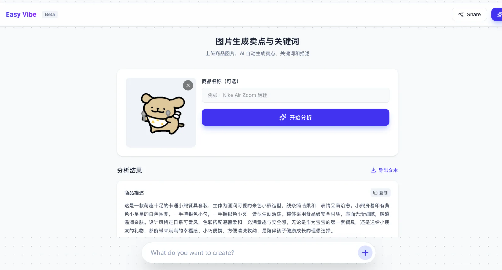
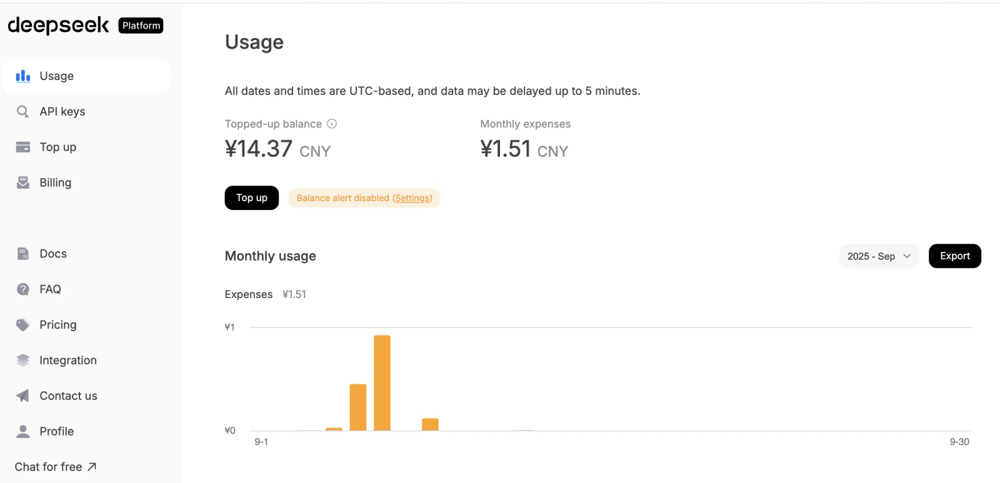
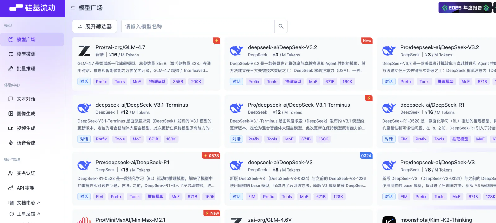
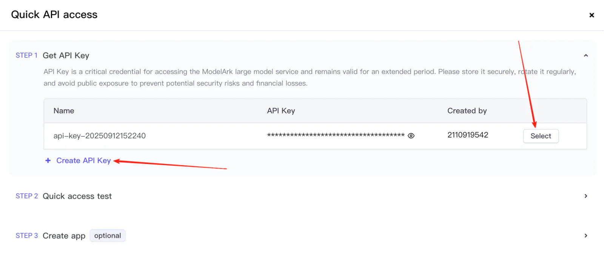
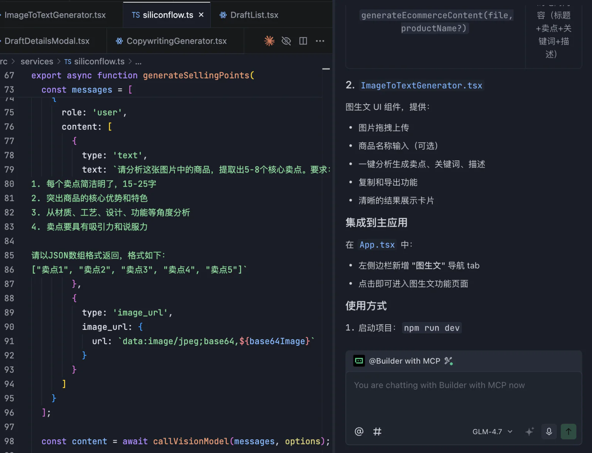
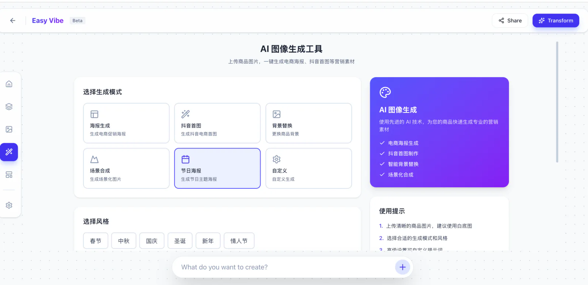

<script setup>
import { relatedArticlesMap } from '@theme/data/relatedArticles'
import AiCapabilityGuide from '../../../zh-cn/stage-1/integrating-ai-capabilities/AiCapabilityGuide.vue'
import StageAssignmentCard from '@theme/components/StageAssignmentCard.vue'

const duration = '약 <strong>1~2일</strong>'
const relatedArticles =
  relatedArticlesMap['ko-kr/stage-1/integrating-ai-capabilities'] ?? []
</script>

# 프로토타입에 AI 기능 연결하기


## 이 장에서 배울 내용

<ChapterIntroduction :duration="duration" :tags="['프롬프트', 'API 문서', '서비스 콘솔', '멀티모달']" coreOutput="프로토타입에 실제 AI 기능 1~2개 연결하기" expectedOutput="텍스트·이미지·음성·영상 서비스를 호출하는 웹 프로토타입">

앞 장에서 만든 프로토타입은 화면 구조와 조작 흐름을 확인할 수 있지만, 생성 결과는 아직 모의 데이터입니다. 이번에는 그중 핵심 동작 하나를 실제 AI 서비스에 연결합니다.

AI 연결은 API 코드를 복사하는 일로 끝나지 않습니다. **할 일을 어떻게 설명할지, 공식 문서를 어떻게 읽을지, 호출을 제품 흐름 안에 어떻게 안전하게 둘지**를 함께 다뤄야 합니다.

먼저 공통 방법을 익힌 뒤 텍스트, 이미지 이해, 이미지 생성, 음성, 영상을 차례로 살펴봅니다. 모델 이름과 콘솔 화면은 계속 바뀌므로 예시는 구조를 이해하는 용도입니다. 실제 연결 때는 해당 서비스의 최신 공식 문서에서 모델 ID와 매개변수를 복사하세요.

</ChapterIntroduction>

<div style="margin: 50px 0;">
  <ClientOnly>
    <StepBar :active="0" :items="[
      { title: '할 일 정리', description: '업무 프롬프트 준비' },
      { title: '문서 읽기', description: 'API와 매개변수 찾기' },
      { title: '연결 완료', description: '안전한 호출 실행' },
      { title: '형식 확장', description: '이미지·음성·영상' }
    ]" />
  </ClientOnly>
</div>

## 1. 어떤 기능을 연결할지 정하기

앞 장의 전자상거래 콘텐츠 작업 화면에는 상품 정보와 ‘문구 생성’ 버튼이 있습니다. 결과가 아직 모의 데이터이므로 먼저 이 버튼을 실제로 작동시킵니다.

사용자가 상품명, 소재, 특징을 입력하고 버튼을 누르면 상품 문구가 돌아옵니다. 입력과 결과가 모두 글이므로 텍스트 생성 모델이 필요합니다.

화면 기능이 다르면 필요한 능력도 달라집니다.

- 상품 사진에서 색과 형태를 읽으려면 이미지 이해가 필요합니다.
- 상품 정보로 포스터를 만들려면 이미지 생성이 필요합니다.
- 녹음을 회의록으로 만들려면 음성을 글로 바꾼 뒤 텍스트 모델로 정리합니다.
- 글을 들을 수 있는 오디오로 만들려면 텍스트 음성 변환이 필요합니다.
- 상품 사진을 움직이게 하려면 이미지 기반 영상 생성이 필요합니다.

연결 전에 사용자가 무엇을 제출하고 마지막에 무엇을 보길 원하는지 확인하세요. 이 두 가지가 분명하면 텍스트, 이미지, 음성, 영상 가운데 무엇을 찾아야 할지 판단할 수 있습니다.

<AiCapabilityGuide />

### 1.1 한 기능을 여러 단계로 나눌 때도 있다

모든 기능을 한 모델이 한 번에 끝내지는 못합니다. ‘상품 사진을 올리고 특징 생성’은 먼저 사진 속 상품을 이해하고 그 결과로 글을 씁니다. ‘회사 자료를 바탕으로 답변’도 관련 내용을 먼저 찾은 뒤 답을 구성합니다.

모델 이름부터 고르지 말고 사용자의 조작을 따라가세요. 기존 내용을 이해하는 단계, 새 내용을 만드는 단계, 자료를 찾는 단계로 나누고 필요하면 두세 가지 능력을 순서대로 연결합니다.

로그인, 결제, 파일 저장, 화면 이동처럼 규칙이 분명한 일은 일반 프로그램이 맡고, AI는 잘할 수 있는 부분에만 사용합니다.



*이 프로토타입은 상품 이미지를 읽어 정보를 보여 주고, 사용자가 확인한 뒤 편집 가능한 설명과 특징을 생성합니다.*

### 1.2 서비스 콘솔에서 찾을 것

텍스트 생성을 쓰기로 했다면 DeepSeek, SiliconFlow, 화산방주, MiniMax 같은 서비스 플랫폼을 엽니다. 플랫폼은 계정, 과금, 호출 입구를 제공하고 선택한 모델이 요청을 처리합니다.

첫 연결에서는 다음 네 가지만 찾으면 됩니다.

1. API 호출에 사용할 **API Key**를 만듭니다.
2. 사용할 **Model ID**를 기록합니다.
3. 공식 문서에서 가장 작은 curl 또는 JavaScript 예제를 찾습니다.
4. 할당량, 가격, 호출 제한을 확인합니다.

앱은 **API**로 상품 정보를 모델에 보냅니다. JavaScript나 Python **SDK**가 있다면 써도 됩니다. SDK는 요청 코드를 편리하게 감싼 도구입니다. 요청 안의 ‘상품 정보로 제목과 특징을 써 달라’는 문장이 모델에 전달되는 프롬프트입니다.

플랫폼 이름, Model ID, API 주소는 서로 다릅니다. 공식 예제의 주소와 ID를 사용하고 온라인 체험 화면의 URL을 코드에 넣지 마세요.

### 1.3 아직 모르는 API는 나중에 보기

Embedding, Rerank, Function Calling, OCR, 콘텐츠 검수 같은 항목도 보일 수 있습니다. Embedding과 Rerank는 지식 베이스, OCR은 PDF나 영수증 읽기, Function Calling은 검색이나 데이터베이스 같은 외부 도구 사용에 쓰입니다.

지금 전부 배울 필요는 없습니다. 화면 기능에 직접 필요한 API 하나를 먼저 연결하고, 제품에 새 능력이 필요할 때 해당 문서로 돌아옵니다.

## 2. 먼저 생성 결과 시험하기

API 코드를 쓰기 전에 서비스의 온라인 체험 화면에서 시험합니다. 모델이 글을 쓸 수 있는지가 아니라, 페이지가 요구하는 형식으로 결과를 돌려주는지 확인하는 단계입니다.

### 2.1 사용자는 원하는 것만 자연스럽게 말하면 된다

온라인 화면에 실제 사용자처럼 입력합니다.

```text
가벼운 출퇴근용 배낭을 판매하려고 합니다. 검은색 나일론 소재이고
일상 출퇴근에 주로 사용합니다.
짧은 상품 제목과 특징 세 가지를 써 주세요.
```

페이지로 만들면 사용자가 이 문장을 매번 구성할 필요가 없습니다. 상품명, 소재, 색을 적고 버튼을 누르면 프로그램이 가격과 판매량을 지어내지 말 것, 제목을 짧게 쓸 것, 정해진 형식으로 돌려줄 것 같은 고정 규칙을 덧붙입니다.

제목, 요약, 특징을 따로 표시한다면 `title`, `summary`, `selling_points` JSON 필드를 요청할 수 있습니다. 사용자 입력은 자연스럽고, 페이지는 결과를 안정적으로 읽습니다.

여러 상품으로 시험하고 일부러 한 필드를 비워 모델이 없는 정보를 지어내는지 보세요. 형식이 흔들리면 사용자에게 프롬프트 작성법을 가르치기보다 프로그램의 고정 지시를 고칩니다.

### 2.2 API를 페이지에 연결하기

공식 문서의 curl, JavaScript, Python 예제와 구현할 기능을 함께 AI IDE에 줍니다.

```text
상품 상세 페이지에 ‘문구 생성’ 버튼을 추가해 주세요.

버튼을 누르면 현재 상품 정보를 아래 API로 보내고,
생성된 문구를 페이지에 보여 주세요.

API Key는 브라우저에 넣지 말고, 기다리는 중과 실패했을 때도 안내해 주세요.
완료 후 필요한 설정과 실행·확인 방법을 알려 주세요.

공식 API 예제:
<실제 키가 없는 curl 또는 SDK 예제 붙여넣기>
```

페이지 위치와 공식 예제가 있으면 AI IDE가 API 형식을 추측하지 않아도 됩니다. 요청 한 번이 정상적으로 돌아오는지 먼저 확인하고, 이미지·음성·영상은 기능 설명과 공식 예제를 바꿔 같은 방식으로 진행합니다.

## 3. 공식 예제로 첫 요청 보내기

프롬프트를 시험한 뒤 공식 문서의 Quick Start 또는 API Reference를 엽니다. 첫 호출에는 요청 주소, API Key 위치, `model` 값, 최소 예제 네 가지가 필요합니다.

공식 curl, JavaScript, Python 예제에서 Model ID와 시험 내용만 바꿔 터미널에서 정상 응답을 한 번 얻으세요. 그 뒤 프로젝트에 넣으면 화면 연결 실패 시에도 계정, 키, 모델이 정상인지 구분할 수 있습니다.

응답도 살펴봅니다. 텍스트는 JSON 필드, 이미지는 URL, 음성은 바이너리, 영상은 먼저 작업 번호를 돌려줄 수 있습니다. 페이지 구현은 실제 응답에 맞춰야 합니다.

### 3.1 긴 문서는 AI와 함께 읽기

긴 문서를 처음부터 끝까지 읽지 않아도 됩니다. 현재 문서 링크를 AI IDE에 주고 첫 호출에 필요한 내용만 찾게 합니다.

```text
이 API 문서를 읽어 주세요: <문서 링크>

JavaScript로 호출하고 싶습니다. 가장 간단한 예제와
API Key와 model을 넣는 위치, 생성 결과를 읽는 방법을 알려 주세요.
이 문서에 명시된 매개변수만 사용해 주세요.
```

## 4. 처음 서비스 콘솔 열기

Key 생성, 모델 선택, 사용량 확인은 보통 콘솔에서 합니다. 메뉴 이름은 달라도 해야 할 일은 비슷합니다.

### 4.1 Key를 만들고 요청이 도착했는지 확인하기

API Key는 앱이 모델을 부르는 인증 정보입니다. 로컬 환경 변수에 저장하고 스크린샷, 채팅, 프런트엔드 코드에 넣지 마세요. 유출이 의심되면 즉시 폐기하고 다시 만듭니다.

첫 요청 뒤 Usage 또는 Billing에서 새 기록을 찾습니다. 잔액과 Quota도 여기서 확인합니다. 실패했다면 코드가 보내지 못했는지, 플랫폼이 거부했는지, 할당량이 없는지 나눠 확인하세요.



*DeepSeek Usage 화면에서 호출량, 비용, 잔액을 확인할 수 있습니다.*

오류에 Request ID나 Trace ID가 있으면 기록합니다. 같은 시간의 여러 요청 중 실패한 한 건을 로그에서 찾는 번호입니다.

### 4.2 모델을 고르고 정확한 호출 이름 복사하기

Models 화면에서 현재 제공되는 텍스트, 이미지, 음성, 영상 모델을 확인하고, 상세 페이지에서 코드용 Model ID를 복사합니다. 화면 표시명과 다를 수 있습니다.



*SiliconFlow 모델 목록은 기능 유형별로 필터링할 수 있습니다.*

Region을 고르거나 Deployment를 만든 뒤 Base URL과 Endpoint를 받는 플랫폼도 있습니다. 이때는 빠른 시작 안내를 따르고 콘솔 화면 URL을 API 주소로 쓰지 않습니다.



*화산방주는 Key 생성, 모델 선택, 실행 예제를 한 흐름으로 보여 줍니다.*

### 4.3 사용량 제한과 오래 걸리는 작업

RPM과 TPM은 1분당 허용 요청 수와 토큰 수입니다. 이미지·음성·영상은 동시에 실행할 수 있는 작업 수인 Concurrency도 제한할 수 있습니다. 한도를 넘으면 보통 `429`가 돌아오므로 연속 클릭하지 말고 기다렸다 재시도합니다.

영상 같은 긴 작업은 파일 대신 Task ID를 먼저 줍니다. 앱이 진행 상태를 조회하거나 Callback/Webhook으로 완료를 서버에 알릴 수 있습니다. File ID나 임시 URL은 만료될 수 있으므로 운영할 때 자체 저장소로 옮길지 결정합니다.

`max_tokens`, `temperature`, `stream` 등은 첫 버전에서 공식 기본값을 씁니다. 출력이 잘릴 때 `max_tokens`, 실시간 표시가 필요할 때 `stream`을 바꾸고, 필요하지 않은 값까지 한꺼번에 손대지 않습니다.

## 5. 공식 예제를 페이지로 옮기기

터미널 예제가 동작하면 다음 순서로 연결합니다.

1. Key를 Git에 올라가지 않는 `.env.local` 같은 환경 파일에 둡니다.
2. 서버 또는 Serverless Function에서 모델을 호출합니다.
3. 페이지는 제3자 Key 대신 자체 `/api/...`를 호출합니다.
4. 버튼에 대기, 성공, 실패 상태를 넣습니다.
5. Usage 화면에서 실제 호출 기록을 확인합니다.

```text
브라우저 페이지
    │ 업무 입력만 전송
    ▼
자체 /api ── 서버 환경 변수에서 API Key 읽기
    │
    ▼
AI 서비스 ── 텍스트, JSON, 파일 또는 task_id 반환
```

::: warning API Key 보안
Vue, React, 일반 HTML의 프런트엔드 코드에 API Key를 쓰지 마세요. `VITE_`, `NEXT_PUBLIC_` 접두사가 있어도 브라우저 번들에 들어갈 수 있습니다. 공개 배포에서는 백엔드, Serverless Function, 보호된 게이트웨이가 모델을 호출해야 합니다.
:::

### 5.1 바로 결과를 주지 않는 API도 있다

짧은 텍스트, 이미지 이해, 짧은 음성 인식은 한 요청에서 바로 결과를 주는 경우가 많습니다. 대화나 실시간 음성은 조각을 스트리밍해 페이지가 받는 대로 보여 줄 수 있습니다.

이미지·영상 생성은 첫 요청에서 `task_id`만 주고 이후 대기, 처리, 성공, 실패 상태를 조회하는 경우가 많습니다. 수십 초가 걸릴 수 있으므로 변화 없는 ‘로딩 중’ 화면만 보여 주지 않습니다.

## 6. 텍스트 생성부터 연결하기

[DeepSeek API 문서](https://api-docs.deepseek.com/)에는 널리 쓰이는 SDK와 호환되는 텍스트 API가 있습니다. 모델은 바뀌므로 연결 전 [모델 목록](https://api-docs.deepseek.com/api/list-models)에서 현재 ID를 복사합니다.

온라인 체험과 같은 상품 정보로 curl 요청을 보내 두 결과를 비교합니다.

```bash
curl https://api.deepseek.com/chat/completions \
  -H "Content-Type: application/json" \
  -H "Authorization: Bearer ${DEEPSEEK_API_KEY}" \
  -d '{
    "model": "deepseek-v4-flash",
    "messages": [
      {"role": "system", "content": "title, summary, selling_points 필드가 있는 JSON을 반환하세요. selling_points는 세 개이며 가격, 판매량, 효능을 지어내지 마세요."},
      {"role": "user", "content": "검은색 나일론 출퇴근용 배낭을 판매합니다. 짧은 제목, 소개 한 문단, 특징 세 가지를 써 주세요."}
    ],
    "stream": false
  }'
```

환경 변수에 Key를 설정하고 터미널에서 실행합니다. 정상 결과가 나오면 같은 공식 예제와 2절의 요청을 AI IDE에 줍니다. 첫 버전은 버튼 하나와 고정 상품 정보만 두고 결과가 보인 뒤 전체 입력 폼을 연결합니다.

### 두 가지 상품 정보로 시험하기

상품명, 소재, 색을 바꿔 두 결과가 각각 입력과 맞는지 봅니다. 한 필드를 지워 모델이 가격이나 효능을 지어내는지 보고, 틀린 Key로 실패 안내도 시험합니다.

마지막으로 Usage에 호출 기록이 있는지 확인합니다. 페이지에 글이 보인다는 사실만으로 API 호출을 증명할 수는 없습니다. 남아 있던 모의 데이터도 같은 화면을 만들 수 있습니다.

## 7. 이미지 이해: Qwen3-VL 예제

비전 모델에는 이미지와 질문을 보냅니다. ‘이 사진에 무엇이 있나요?’보다 페이지에 필요한 항목을 직접 묻습니다.

```text
이 상품 사진에서 상품 종류, 주된 색, 보이는 소재와 구조,
사진 속 글자를 알려 주세요.

잘 안 보이는 것은 모른다고 하고 브랜드, 가격, 판매량은 추측하지 마세요.
페이지에 표시할 수 있도록 JSON으로 반환해 주세요.
```

[SiliconFlow 모델 목록](https://cloud.siliconflow.cn/models)에서 현재 비전 모델을 찾을 수 있습니다. 여기서는 입력 구조를 설명하기 위해 `Qwen/Qwen3-VL-8B-Instruct`를 사용하며 실행 전 현재 Model ID를 확인합니다.

```python
import base64
import os
from openai import OpenAI

client = OpenAI(
    api_key=os.environ["SILICONFLOW_API_KEY"],
    base_url="https://api.siliconflow.cn/v1"
)

with open("product.jpg", "rb") as image_file:
    image_data = base64.b64encode(image_file.read()).decode("utf-8")

response = client.chat.completions.create(
    model="Qwen/Qwen3-VL-8B-Instruct",
    messages=[{
        "role": "user",
        "content": [
            {"type": "text", "text": "상품 종류, 색, 보이는 소재와 구조, 이미지 속 글자를 JSON으로 반환하세요. 모르는 것은 추측하지 마세요."},
            {"type": "image_url", "image_url": {
                "url": f"data:image/jpeg;base64,{image_data}"
            }}
        ]
    }]
)
```



*사진에서 바로 최종 문구를 만들기보다 사용자가 인식 결과를 확인한 뒤 생성하면 오류를 발견하기 쉽습니다.*

## 8. 상품 이미지 생성하고 수정하기

[Seedream](https://seed.bytedance.com/en/blog/deeper-thinking-more-accurate-generation-introducing-seedream-5-0-lite)은 글로 이미지를 만들거나 참고 이미지를 수정할 수 있습니다. 상품 이미지에서는 배경과 조명뿐 아니라 바뀌면 안 되는 구조를 명확히 적습니다.

```text
참고 사진의 검은 배낭을 세로형 상품 포스터로 만들어 주세요.
연한 회색 받침대 중앙에 놓고 부드러운 조명을 쓰며 위쪽에 제목 여백을 둡니다.
글자, Logo, 가격을 추가하지 말고 지퍼, 끈, 주머니를 바꾸지 마세요.
```

첫 결과에서는 배경보다 상품이 변형되지 않았는지 먼저 봅니다. 처음부터 많은 스타일 단어를 넣지 않습니다.

[화산방주 콘솔](https://www.volcengine.com/experience/ark?launch=seedream)에서 현재 이미지 Model ID와 최소 요청을 복사하고 오래된 튜토리얼의 버전 번호를 그대로 쓰지 마세요.

```bash
curl -X POST https://ark.cn-beijing.volces.com/api/v3/images/generations \
  -H "Content-Type: application/json" \
  -H "Authorization: Bearer ${ARK_API_KEY}" \
  -d '{
    "model": "<콘솔에서 현재 이미지 Model ID 복사>",
    "prompt": "참고 사진의 검은 배낭을 깔끔한 세로형 상품 포스터로 만드세요. 글자, Logo, 가격을 추가하지 말고 배낭 구조를 바꾸지 마세요.",
    "image": ["https://example.com/product-reference.png"],
    "response_format": "url",
    "stream": false,
    "watermark": false
  }'
```



이미지 URL은 만료될 수 있습니다. 프로토타입에서는 바로 보여 줄 수 있지만 운영할 때는 서비스 약관에 따라 자체 저장 여부를 정하고 프롬프트, 모델 버전, 생성 시각을 기록합니다.

## 9. 음성 인식과 합성은 서로 다른 API다

- **ASR / STT**는 말이나 오디오 파일을 글로 바꿉니다.
- **TTS**는 글을 재생 가능한 음성으로 바꿉니다.

입력과 출력, 화면 조작이 다르므로 하나의 모호한 ‘음성 API’ 버튼으로 합치지 않습니다.

### 9.1 음성을 글로: 파일 업로드 후 텍스트 받기

[SiliconFlow 음성 인식 문서](https://docs.siliconflow.cn/cn/api-reference/audio/create-audio-transcriptions)는 JSON이 아니라 `multipart/form-data`로 파일을 보냅니다.

```bash
curl --request POST \
  --url https://api.siliconflow.cn/v1/audio/transcriptions \
  -H "Authorization: Bearer ${SILICONFLOW_API_KEY}" \
  -F "file=@meeting.mp3" \
  -F "model=FunAudioLLM/SenseVoiceSmall"
```

```text
현재 페이지에 ‘녹음 업로드 후 받아쓰기’ 버튼을 추가해 주세요.

사용자가 mp3, m4a, wav 파일을 올리면 서버에서 아래 API를 호출하고,
반환된 글을 편집 가능한 입력 칸에 넣어 주세요.
API Key는 환경 변수에 두고 업로드나 인식 실패 후 다시 시도할 수 있게 해 주세요.

공식 예제:
<위 curl 예제 붙여넣기>
```

### 9.2 글을 음성으로 바꾸면 JSON이 아닌 오디오가 올 수 있다

[MiniMax T2A HTTP 문서](https://platform.minimax.io/docs/api-reference/speech-t2a-http)는 동기 음성 합성 API를 제공합니다. 현재 예제의 `speech-2.8-hd`와 음색은 실제 플랫폼에서 다시 확인합니다.

숫자, 영문 약자, 쉼을 듣기 좋게 고친 뒤 음색, 속도, 음량, 감정, 출력 형식을 고릅니다. Markdown, URL, 버튼 글자가 섞인 페이지 전체를 그대로 읽히지 않습니다.

```bash
curl --request POST \
  --url https://api.minimax.io/v1/t2a_v2 \
  --header "Authorization: Bearer ${MINIMAX_API_KEY}" \
  --header "Content-Type: application/json" \
  --data '{
    "model": "speech-2.8-hd",
    "text": "상품 소개를 미리 들어 보는 음성입니다.",
    "stream": false,
    "output_format": "hex",
    "language_boost": "auto",
    "voice_setting": {
      "voice_id": "<음색 목록에서 voice_id 복사>",
      "speed": 1,
      "vol": 1,
      "pitch": 0
    },
    "audio_setting": {
      "sample_rate": 32000,
      "bitrate": 128000,
      "format": "mp3",
      "channel": 1
    }
  }'
```

음성 화면에는 미리 듣기, 중지, 다시 생성, 다운로드도 필요합니다. 스트리밍 TTS는 WebSocket이나 스트리밍 HTTP로 조각을 받는 대로 재생합니다.

::: warning 음성과 개인정보
녹음을 올리기 전에 용도, 보관 기간, 삭제 방법을 알려야 합니다. 음성 복제에는 목소리 소유자의 명확한 허락이 필요하며 출처가 불분명한 유명인이나 다른 사람의 녹음을 사용하지 않습니다.
:::

## 10. 영상 생성: 작업을 만들고 결과 기다리기

영상 생성은 보통 비동기 API입니다. [MiniMax 영상 생성 문서](https://platform.minimax.io/docs/guides/video-generation)는 작업 생성으로 `task_id` 받기, 상태 조회로 `file_id` 받기, 다운로드 주소 받기의 세 단계로 설명합니다.

### 10.1 화면이 어떻게 변하는지도 설명하기

영상 프롬프트에는 상품의 시작 위치, 움직임 순서, 카메라 방향, 길이를 씁니다.

```text
검은 배낭을 연한 회색 전시대 위에서 6초 동안 보여 주세요.
카메라는 정면에서 오른쪽으로 천천히 돌고 마지막에 조금 다가갑니다. 세로 화면을 유지합니다.
배낭 모양을 바꾸거나 사람, 글자, Logo를 추가하지 마세요.
```

동작이 많다면 한 장면과 한 가지 움직임부터 시작합니다. 짧은 영상에 회전, 여닫기, 확대, 장면 전환을 함께 넣으면 상품 모양을 유지하기 어렵습니다.

### 10.2 생성과 상태 조회는 두 요청이다

```bash
# 1단계: 작업 생성
curl --request POST \
  --url https://api.minimax.io/v1/video_generation \
  --header "Authorization: Bearer ${MINIMAX_API_KEY}" \
  --header "Content-Type: application/json" \
  --data '{
    "model": "MiniMax-Hailuo-2.3",
    "prompt": "검은 배낭을 연한 회색 전시대에서 보여 줍니다. 카메라는 정면에서 오른쪽으로 천천히 돌고 조금 다가갑니다. 배낭 모양을 바꾸거나 사람, 글자, Logo를 추가하지 마세요.",
    "duration": 6,
    "resolution": "1080P"
  }'

# 2단계: 반환된 task_id로 상태 조회
curl --request GET \
  --url "https://api.minimax.io/v1/query/video_generation?task_id=<TASK_ID>" \
  --header "Authorization: Bearer ${MINIMAX_API_KEY}"
```

페이지에는 `Preparing`, `Queueing`, `Processing`, `Success`, `Fail`을 표시합니다. 조회 간격과 중지 조건을 정하고, 운영 환경에서는 `callback_url`로 상태 변경을 서버에 알릴 수 있습니다.

::: warning 영상과 실제 인물 자료
실제 인물의 사진·목소리, 상표, 저작권 자료로 영상을 만들 때는 허가 범위와 플랫폼 규칙을 확인합니다. 얼굴 인증, 자산 등록, 콘텐츠 검수가 필요한 서비스도 있으며 브라우저에서 우회할 절차가 아닙니다.
:::

## 11. 자주 생기는 문제 판단하기

| 현상 | 먼저 확인할 것 |
| --- | --- |
| `401 / 403` | Key가 정확한지, 권한이 있는지, 올바른 헤더에 있는지 |
| `404` | Base URL, Endpoint, Model ID가 바뀌었는지 |
| `429` | RPM, TPM, 동시 실행 수, 계정 사용 등급 |
| `400` | 필수 매개변수, 파일 형식, JSON 구조, 크기 제한 |
| `5xx / timeout` | 플랫폼 상태, 시간 제한, 재시도 방식 |
| 계속 대기 중 | 동시 실행 수, 작업 상태 조회, 할당량, 서비스 혼잡 |
| 성공이지만 내용 없음 | 응답 필드 경로, 바이너리 처리, 임시 URL 만료 |
| 로컬 성공, 배포 실패 | 환경 변수, CORS, Serverless 제한 시간, 지역 네트워크 |

디버깅할 때 발생 시각, 요청 종류, HTTP 상태, Request ID/Trace ID를 남깁니다. API Key, 사용자의 전체 음성, 민감한 업무 데이터는 로그에 쓰지 않습니다.

## 12. 📚 이 장의 과제

<StageAssignmentCard title="프로토타입에 AI 기능 하나 연결하기">

  <p>페이지에서 실제로 AI가 필요한 버튼 하나를 고릅니다. 첫 버전은 한 가지 기능이면 충분하며 텍스트, 이미지, 음성, 영상을 모두 만들 필요는 없습니다.</p>

  <ol>
    <li>공식 문서에서 현재 Model ID와 최소 예제를 찾습니다.</li>
    <li>예제를 AI IDE에 주고 페이지 버튼에 연결합니다.</li>
    <li>API Key를 서버 환경 변수에 두고 대기와 실패 안내를 추가합니다.</li>
    <li>실제 호출한 뒤 Usage 또는 로그에서 서비스 도착을 확인합니다.</li>
  </ol>

  <p>완료하면 실행 화면 한 장을 저장하고 AI가 이 페이지에서 사용자를 어떻게 돕는지 한 문장으로 설명하세요. 다른 사람의 이미지, 목소리, 실제 인물 자료는 사용 허가를 먼저 확인합니다.</p>
</StageAssignmentCard>

## 다음 단계

다음 장에서는 이 기능들을 완전한 제품 흐름으로 되돌립니다. 데이터, 상태, 사용자 피드백을 더해 한 번의 API 호출을 반복해서 사용할 수 있는 제품 프로토타입으로 만듭니다.

<RelatedArticlesSection
  title="관련 글"
  description="하나의 AI 기능에서 완전한 제품 흐름으로 나아갑니다."
  :items="relatedArticles"
/>
