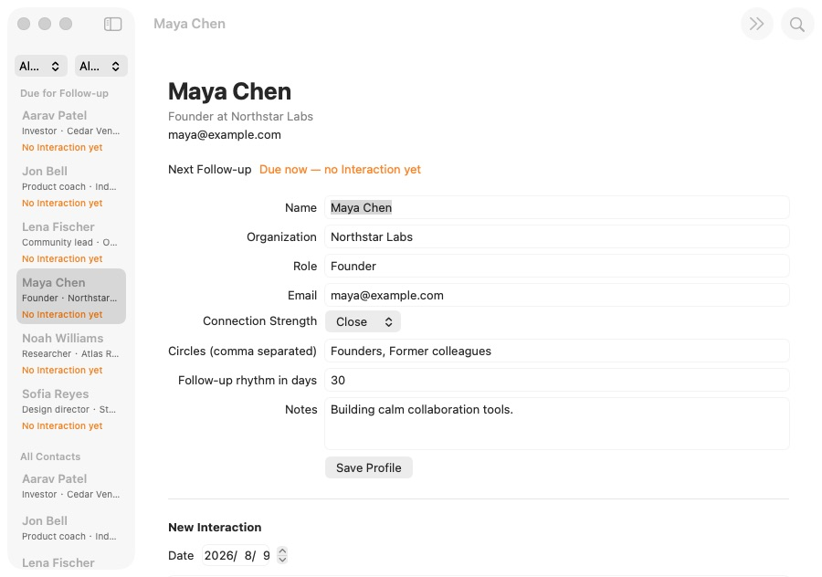
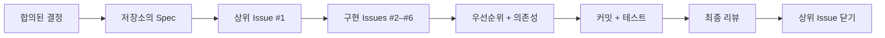
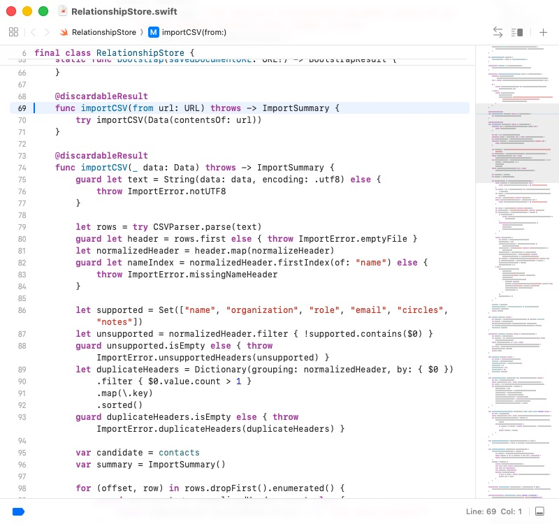

# GitHub Issues로 AI 개발을 끝까지 진행하기: 요구사항 대화에서 macOS 완성품까지

이 튜토리얼은 모호한 아이디어를 AI와 정리하고, Spec으로 고정하고, 우선순위와 의존성이 있는 GitHub Issues로 나눈 뒤 구현·테스트·리뷰까지 완료하는 전 과정을 다룹니다.

::: info 앞 글과 무엇이 다른가요?

[Vibe Coding에서 Spec Coding으로](/ko-kr/stage-3/core-skills/spec-coding/)는 왜 명세가 AI 개발의 중심이 되는지 설명합니다. 이 글은 실제 공개 저장소를 통해 Spec이 Issues, 커밋, 테스트, 완성된 제품으로 바뀌는 과정을 보여주는 실전편입니다.

:::

시작은 한 문장이었습니다.

> 가져온 연락처를 관리하고 인간관계를 정리할 수 있는 macOS CRM을 만들고 싶습니다. 처음에는 샘플 데이터를 써도 됩니다.

완성된 **Relationship Compass**는 연락처 검색과 필터, 관계 프로필 편집, CSV 가져오기, 상호작용 기록, 다음 연락일 계산을 지원하는 네이티브 macOS 앱입니다.



[공개 예제 저장소](https://github.com/sanbuphy/relationship-compass-macos)에는 가짜 데이터만 있으며 Spec, Issues, 커밋 기록, 코드, 테스트가 모두 남아 있습니다.

## 1. Spec 주도 개발이란 무엇인가

일반적인 AI 코딩은 다음처럼 진행됩니다.

```text
아이디어 설명 → AI가 코드 작성 → 문제 발견 → 지시 추가 → 다시 수정
```

작은 화면에는 충분하지만 프로젝트가 커지면 과거 요구사항이 대화에서 빠지고, 진행 상황이 불투명해지며, 실행은 되지만 원래 요구를 만족하지 못하는 일이 생깁니다.

Matt Pocock의 Skills는 AI에게 반복 가능한 작업 절차를 제공합니다. Skill은 무엇을 확인하고, 어떤 산출물을 만들며, 언제 사람의 확인을 기다릴지 규정합니다.

| 대화 중심 구현 | Spec 주도 구현 |
| --- | --- |
| 현재 채팅이 주요 정보원 | 버전 관리되는 Spec이 기준 |
| 요구를 즉석에서 추가 | Spec과 작업을 먼저 갱신 |
| 진행 상황이 AI 요약에 존재 | Issues와 커밋에 존재 |
| 실행되면 완료로 판단 | 수용 기준을 항목별 확인 |

### 1.1 GitHub의 세 가지 역할

1. **프로젝트 기록 보관소**: Spec, 공통 용어, 중요한 설계 결정을 저장합니다.
2. **작업 보드**: Issues, 우선순위, 의존성으로 작업 순서를 표현합니다.
3. **완료 증거**: 커밋, 테스트 결과, 닫힌 Issue로 구현 과정을 남깁니다.

| GitHub 산출물 | 의미 | 예시 |
| --- | --- | --- |
| Spec | 완성된 소프트웨어가 해야 할 일 | `specs/relationship-compass-mvp.md` |
| Issue | 독립적으로 완료할 수 있는 작업 | `#2 Browse sample Contacts` |
| 의존성 | 먼저 끝나야 하는 작업 | `#3`은 `#2`에 의해 차단 |
| Commit | 한 단계에서 바뀐 내용 | `feat: browse sample contacts` |
| Tests | 동작이 유지된다는 증거 | `swift test` |
| ADR | 중요한 기술 선택의 이유 | `docs/adr/0002-native-swiftui-macos.md` |



### 1.2 전체 흐름

```text
grill-with-docs → to-spec → to-tickets → implement → code-review
```

- `grill-with-docs`: 제품 범위와 기술 경계를 합의합니다.
- `to-spec`: 합의를 공식 요구사항 문서로 만듭니다.
- `to-tickets`: 우선순위와 의존성이 있는 Issues를 만듭니다.
- `implement`: 지금 시작할 수 있는 Issue를 하나씩 구현합니다.
- `code-review`: 코드 상태와 요구사항 누락을 따로 검사합니다.

## 2. 준비

GitHub 계정, 로그인된 GitHub CLI, Node.js 18 이상, 프로젝트 Skills를 읽을 수 있는 AI 코딩 도구가 필요합니다. 앱을 실행하려면 Mac과 Xcode도 필요합니다.

```bash
npx skills@latest add mattpocock/skills -y
gh auth status
gh repo create relationship-compass-macos \
  --public \
  --source . \
  --remote origin \
  --push
```

실제 연락처를 다루는 저장소는 `--private`로 만들고, 샘플·로그·Git 기록에 개인정보가 없는지 확인하세요. 작업 라벨은 `ready-for-agent`, `priority:P0/P1/P2`, `completed-by-agent`를 사용합니다.

## 3. 만들 제품과 MVP 경계

첫 버전은 다음을 제공합니다.

- 고정된 가짜 연락처 6명;
- 이름, 조직, 역할, 이메일, 서클 검색;
- 관계 강도와 서클의 조합 필터;
- 프로필, 메모, 연락 주기 편집;
- UTF-8 CSV 검증과 안전한 중복 제거;
- 상호작용 기록과 다음 연락일 계산;
- 로컬 JSON 저장과 시작 시 복원.

클라우드 동기화, AI 관계 점수, 계정, 백엔드, macOS 연락처 권한은 제외합니다.

## 4. `grill-with-docs`로 요구사항 확정하기

<div class="workflow-chat">
  <div class="workflow-message workflow-message--user">
    <div class="workflow-message__speaker">🙋 사용자</div>
    <div class="workflow-message__command">/grill-with-docs</div>
    <p>가져온 연락처를 관리하고 인간관계를 정리할 수 있는 macOS CRM을 만들고 싶습니다. 처음에는 샘플 데이터를 사용해도 됩니다.</p>
  </div>
  <div class="workflow-message workflow-message--agent">
    <div class="workflow-message__speaker">✨ Agent</div>
    <p>코드를 쓰기 전에 첫 버전의 포함·제외 범위, 데이터 위치, 기술, 검증 방식을 합의하겠습니다. 선택이 필요하면 차이를 설명하고 권장안을 제시하겠습니다.</p>
  </div>
</div>

대화를 통해 macOS 14+ 네이티브 SwiftUI, 로컬 JSON, UTF-8 CSV, 샘플 6명, 네트워크와 연락처 권한 없음에 합의했습니다. `CONTEXT.md`는 `Contact`, `Interaction`, `Follow-up`의 뜻을 고정하고, 두 ADR은 로컬 우선 데이터와 네이티브 SwiftUI 선택 이유를 기록합니다.

::: info 이 단계의 GitHub

확인된 문맥을 `CONTEXT.md`와 `docs/adr/`에 커밋합니다. 아직 구현 Issue를 만들지는 않습니다.

:::

## 5. `to-spec`으로 요구사항 문서 만들기

<div class="workflow-chat">
  <div class="workflow-message workflow-message--user">
    <div class="workflow-message__speaker">🙋 사용자</div>
    <div class="workflow-message__command">/to-spec</div>
    <p>합의한 내용을 완전한 Spec으로 정리해 저장소에 저장하고, ready-for-agent 라벨이 있는 GitHub 상위 Issue로 게시하세요.</p>
  </div>
</div>

[`specs/relationship-compass-mvp.md`](https://github.com/sanbuphy/relationship-compass-macos/blob/main/specs/relationship-compass-mvp.md)는 문제, MVP, 24개 사용자 스토리, 기술 결정, 검증 전략, 명확한 제외 항목을 담습니다. [Issue #1](https://github.com/sanbuphy/relationship-compass-macos/issues/1)은 프로젝트의 공개 진입점입니다.

좋은 Spec은 파일명이 아니라 사용자 동작을 설명합니다. 예를 들어 “상호작용 기록이 없는 연락처도 Follow-ups에 표시한다”는 요구는 코드 구조를 바꿔도 유효합니다.

## 6. `to-tickets`로 순서가 있는 Issues 만들기

<div class="workflow-chat">
  <div class="workflow-message workflow-message--user">
    <div class="workflow-message__speaker">🙋 사용자</div>
    <div class="workflow-message__command">/to-tickets</div>
    <p>각 티켓이 독립적으로 시연 가능한 작은 기능을 제공하도록 Issues를 나누고 우선순위, 완료 기준, 선행 작업을 적으세요. 게시 전에 목록과 의존성 그래프를 보여주세요.</p>
  </div>
</div>

| Issue | 우선순위 | 확인 가능한 결과 | 선행 작업 |
| --- | --- | --- | --- |
| [#2 Browse sample Contacts](https://github.com/sanbuphy/relationship-compass-macos/issues/2) | P0 | 실행, 샘플, 검색, 상세 | 없음 |
| [#3 Import and persist](https://github.com/sanbuphy/relationship-compass-macos/issues/3) | P0 | CSV 중복 제거, JSON 저장 | #2 |
| [#4 Organize Profiles](https://github.com/sanbuphy/relationship-compass-macos/issues/4) | P1 | 프로필, 관계 강도, 서클 | #2 |
| [#5 Interactions and Follow-ups](https://github.com/sanbuphy/relationship-compass-macos/issues/5) | P1 | 기록과 연락 목록 | #4 |
| [#6 Polish and verify](https://github.com/sanbuphy/relationship-compass-macos/issues/6) | P2 | 오류, 문서, 패키징, 검증 | #3, #5 |

모델·Store·UI·테스트를 따로 나누는 수평 작업 대신, Issue 하나를 닫을 때마다 사용자가 새로운 결과를 볼 수 있는 **수직 슬라이스**로 나눕니다.

## 7. `implement`로 한 번에 한 Issue 구현하기

<div class="workflow-chat">
  <div class="workflow-message workflow-message--user">
    <div class="workflow-message__speaker">🙋 사용자</div>
    <div class="workflow-message__command">/implement</div>
    <p>우선순위와 의존성에 따라 모든 ready-for-agent Issues를 구현하세요. 차단되지 않은 한 건만 처리하고, 먼저 실패하는 동작 테스트를 작성한 뒤 빌드와 테스트를 실행하고 티켓별로 커밋하세요.</p>
  </div>
</div>

CSV 작업에서는 같은 파일을 두 번 가져와도 연락처가 늘지 않는 실패 테스트를 먼저 작성했습니다. 구현 후 잘못된 헤더가 기존 데이터를 손상시키지 않는 테스트도 추가했습니다.

```bash
swift test --filter RelationshipStoreTests
swift build
swift test
```

최종 프로젝트는 13개의 공개 동작 테스트를 모두 통과합니다.




완료하면 Agent는 커밋과 테스트 결과를 Issue에 남기고, `ready-for-agent`를 제거하고, `completed-by-agent`를 추가한 뒤 Issue를 닫습니다.

## 8. `code-review`로 두 종류의 누락 검사하기

첫 번째 검사는 이름, 중복, 지나치게 큰 뷰, 결합도, `AGENTS.md` 준수 등 코드 건강을 봅니다. 두 번째 검사는 Spec과 모든 Issues를 다시 읽고 요구가 실제로 완성되었는지 확인합니다.

실제 리뷰에서는 중복 CSV 헤더, 이메일 없는 연락처의 중복 판정, Follow-ups 필터, 시작 시 자동 복원, 계산된 다음 연락일 표시가 빠진 것을 발견했습니다. 먼저 테스트를 추가하고 수정한 뒤 두 검사를 다시 실행했습니다.

초록색 테스트는 테스트에 적힌 동작만 증명합니다. 원래 Spec의 모든 항목이 테스트되었다는 뜻은 아니므로 최종 요구사항 대조가 필요합니다.

## 9. 완성된 소프트웨어

| 산출물 | 결과 |
| --- | --- |
| GitHub 관리 | 상위 Issue 1개와 구현 Issues 5개 모두 완료 |
| 구현 기록 | 의존 순서에 따른 9개의 작은 커밋 |
| 자동 검증 | 13/13 테스트와 전체 빌드 통과 |
| 최종 리뷰 | 코드 건강과 Spec 완성도 모두 통과 |
| 실행 결과 | `Relationship Compass.app` 생성 가능 |
| 개인정보 경계 | 로컬 저장만 사용, 연락처 권한과 업로드 없음 |

### 9.1 검색과 조합 필터

`Founder`를 검색하면 Maya Chen만 남고, 관계 강도와 서클 필터를 함께 적용할 수 있습니다.


### 9.2 관계 프로필 편집

조직, 역할, 이메일, 관계 강도, 서클, 연락 주기, 메모를 편집할 수 있습니다.


### 9.3 상호작용과 다음 연락일

2026년 8월 9일 상호작용과 30일 주기를 기록하면 다음 날짜는 2026년 9월 8일이 됩니다.


```bash
git clone https://github.com/sanbuphy/relationship-compass-macos.git
cd relationship-compass-macos
swift build
swift test
./scripts/package-app.sh
open "dist/Relationship Compass.app"
```

## 10. 바로 복사할 수 있는 흐름

```text
/grill-with-docs
첫 버전의 포함·제외 범위, 데이터 위치, 기술, 검증 방식을 함께 정하세요. 합의 전에는 코드를 쓰지 마세요.

/to-spec
합의 내용을 사용자 동작, 수용 기준, 제외 범위가 있는 Spec과 상위 GitHub Issue로 만드세요.

/to-tickets
Spec을 우선순위, 완료 기준, 의존성이 있는 수직 슬라이스 Issues로 나누세요.

/implement
차단되지 않은 Issue를 우선순위대로 하나씩 TDD로 구현하고 개별 검증·커밋하세요.
마지막에 코드 건강과 Spec 완성도를 검토하고 모든 문제를 수정하세요.
```

## 11. 연속 자동 구현이 적합한 경우

범위가 수렴된 MVP, 관찰 가능한 수용 기준이 있는 사이트·앱·백엔드, 테스트나 빌드로 검증 가능한 저장소에 적합합니다. 요구가 매시간 바뀌거나 검증 수단이 없거나 운영 데이터를 직접 변경하는 작업에는 적합하지 않습니다.

사람은 최종 범위, Issues의 누락과 순서, 결제·배포·삭제·권한·개인정보 작업, 실제 화면과 산출물을 확인합니다. 목표와 경계와 수용은 사람이 소유하고, AI는 합의된 작업을 안정적으로 실행합니다.

## 요약

```text
모호한 아이디어
  ↓ grill-with-docs
합의된 범위·용어·기술 결정
  ↓ to-spec
버전 관리되는 검증 가능한 요구사항
  ↓ to-tickets
우선순위와 의존성이 있는 GitHub Issues
  ↓ implement
티켓별 테스트·구현·커밋
  ↓ code-review
코드 건강 + Spec 완성도
  ↓
빌드하고 검증할 수 있는 소프트웨어
```

대화가 끝나도 Spec, Issues, 의존성, 커밋, 테스트는 GitHub에 남습니다. 다음 세션은 추측이 아니라 기록된 프로젝트 상태에서 시작할 수 있습니다.

## 참고 자료

- [Skills to Spec](https://www.aihero.dev/skills-to-spec)
- [AI Skills for Real Engineers](https://www.aihero.dev/skills)
- [Skills v1.1 변경 기록](https://www.aihero.dev/skills/skills-changelog-v1-1-wayfinder-to-spec-to-tickets-grilling-improvements)
- [OpenAI: 반복 가능한 워크플로우를 Skills로 저장하기](https://learn.chatgpt.com/codex/use-cases/reusable-codex-skills)
- [Relationship Compass 공개 예제](https://github.com/sanbuphy/relationship-compass-macos)
