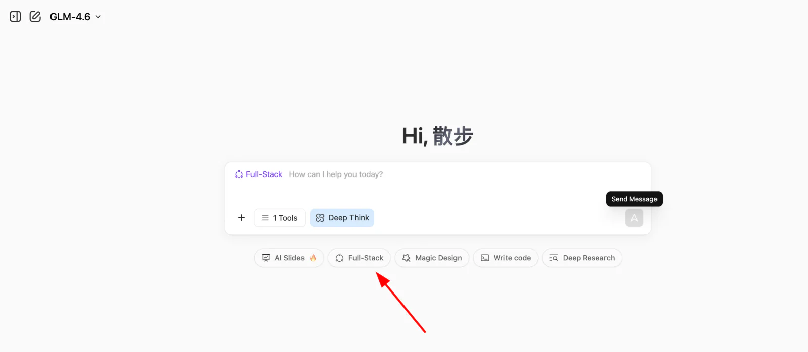
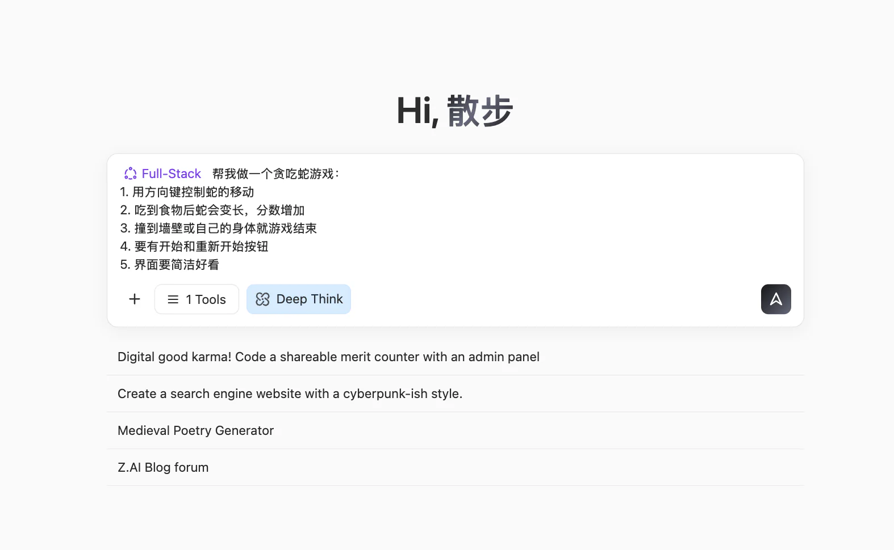
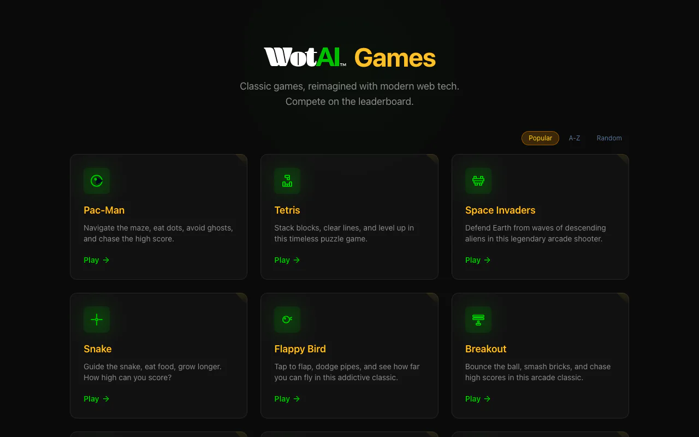
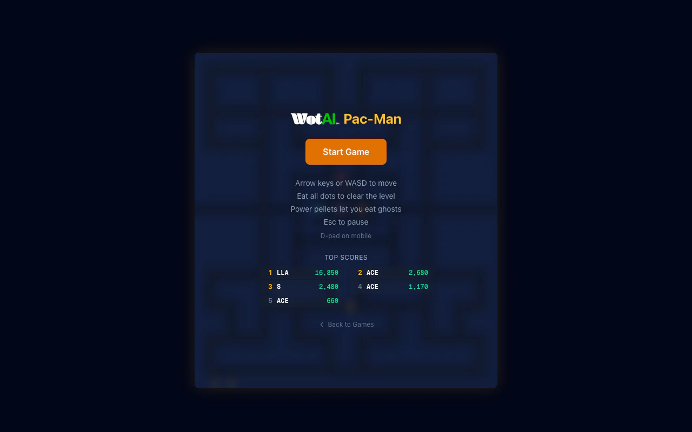
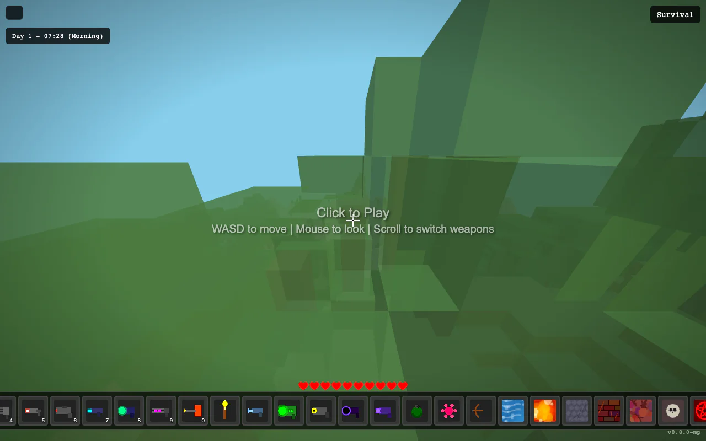
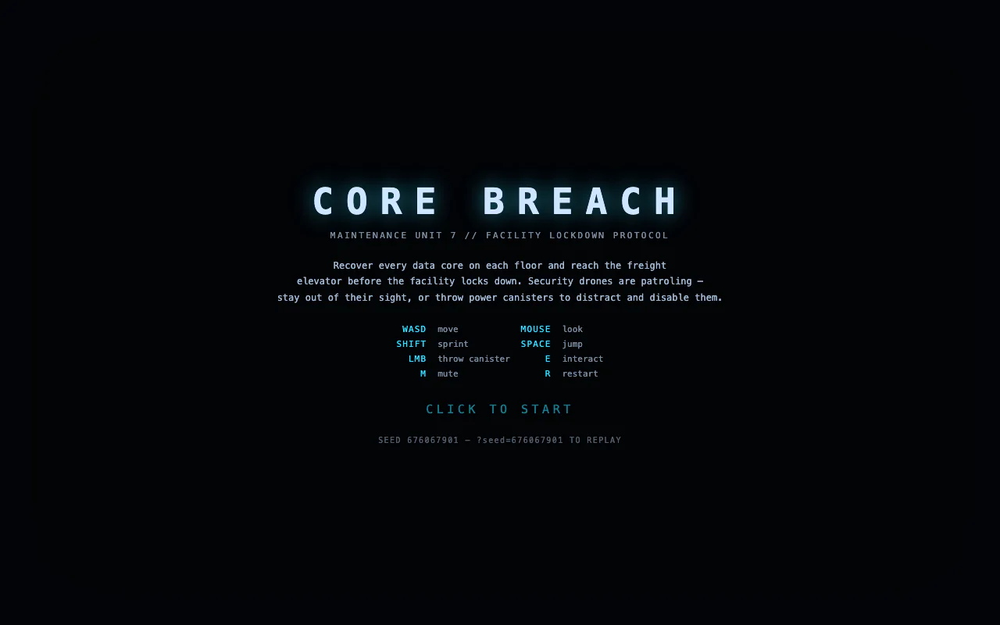
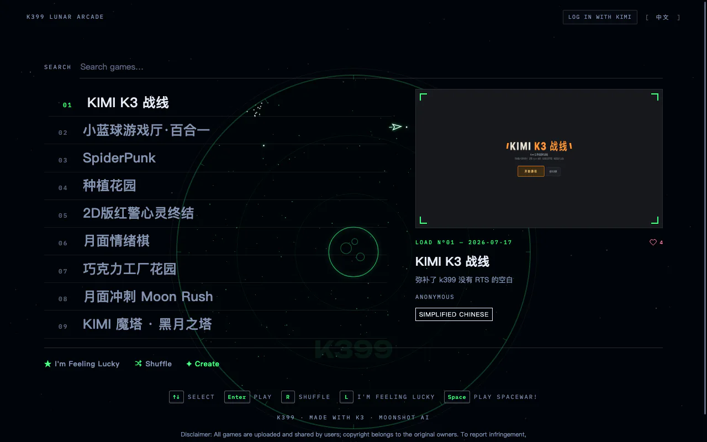

# Sơ cấp 1: Thời đại AI, biết nói là biết lập trình

Đây là một bài học **học theo dự án**. Bạn hãy làm theo từng bước và cố gắng tái hiện kết quả.
Đừng lo sai hay sửa. Hãy nhớ:

<div style="text-align: center;">
<div style="display: inline-block; padding: 8px 20px; border-radius: 8px; border: 1px dashed #FFB6C1; background: linear-gradient(135deg, #FFF0F5 0%, #FFE4EC 100%); margin: 12px 0;">
  <span style="font-size: 15px; font-weight: 500; color: #666;">Hoàn thành quan trọng hơn hoàn hảo 🐣</span>
</div>
</div>

<script setup>
import StageAssignmentCard from '@theme/components/StageAssignmentCard.vue'
import { relatedArticlesMap } from '@theme/data/relatedArticles'

const duration = 'khoảng <strong>4 giờ</strong> (có thể chia nhiều lần)'
const relatedArticles =
  relatedArticlesMap['vi-vn/stage-1/ai-capabilities-through-games'] ?? []
</script>

## Dẫn nhập chương

<ChapterIntroduction :duration="duration" :tags="['Lập trình đối thoại', 'Mini game AI-native', 'Thực hành Snake']" coreOutput="Snake AI-native + mini game tự tạo" expectedOutput="1 Snake AI-native chạy được + (tùy chọn) 1 mini game/demo tự tạo">

Nếu bạn <strong>hoàn toàn không biết lập trình</strong> hoặc chỉ biết một chút, chương này dành cho bạn. Ta sẽ bắt đầu từ cơ bản: dùng <strong>đối thoại</strong> để AI giúp bạn viết code. Không cần nhớ cú pháp, không cần cấu hình phức tạp, nhiều trường hợp có thể chạy ngay trên web.

Bạn sẽ tự tay làm ra <strong>chương trình đầu tiên chạy được</strong>: một phiên bản Snake có thể "ăn từ", "viết thơ", "vẽ vẽ". Bạn sẽ cảm nhận lập trình với AI là gì: không phải AI nghĩ thay bạn, mà bạn nói rõ ý muốn, AI giúp bạn hiện thực.

Mọi sáng tạo đều bắt đầu từ 0 đến 1. Rất vui được truyền cho bạn từng chút tự tin và chuyên nghiệp. Với bạn, <strong>thực thi là tất cả những gì bạn cần</strong>.

</ChapterIntroduction>

<div style="margin: 50px 0;">
  <ClientOnly>
    <StepBar :active="0" :items="[
      { title: 'Khởi động', description: 'Thời đại AI: biết nói là biết lập trình' },
      { title: 'Khám phá nhanh', description: 'Trải nghiệm 60 giây' },
      { title: 'Thực hành AI-native', description: 'Xây Snake AI-native' },
      { title: 'Mở rộng sáng tạo', description: 'Tự làm một game khác' }
    ]" />
  </ClientOnly>
</div>

## 1. Khó khăn của người bình thường và cơ hội mới

Rất nhiều người có ý tưởng sản phẩm: công cụ ghi chép chi tiêu, một trang web ghi lại quá trình lớn lên của con, hoặc một mini game. Nhưng chỉ cần nghĩ tới "viết code" và "tìm lập trình viên" là thấy mệt.

Sau khi AI xuất hiện, lần đầu tiên người bình thường có một khả năng hoàn toàn mới: bạn không cần biết viết code, chỉ cần học cách nói rõ với AI điều bạn muốn. [Dữ liệu từ GitHub Copilot](https://www.wearetenet.com/blog/github-copilot-usage-data-statistics) cho thấy hơn 15 triệu lập trình viên đang dùng AI hỗ trợ lập trình, trung bình 46% mã nguồn được tạo bởi AI! Trong các dự án Java, tỷ lệ này có thể lên tới 61%.

<el-card shadow="hover" style="margin: 20px 0; border-radius: 12px;">
  <template #header>
    <div style="display: flex; align-items: center; gap: 8px;">
      <span style="font-size: 20px;">🚀</span>
      <span style="font-weight: bold; font-size: 16px;">Bước nhảy vọt về hiệu suất và tỷ lệ áp dụng</span>
    </div>
  </template>

  <el-row :gutter="20" style="margin-bottom: 24px;">
    <el-col :span="6" :xs="12">
      <div style="text-align: center; padding: 10px;">
        <div style="color: #409EFF; font-size: 24px; font-weight: bold;">55%</div>
        <div style="color: #909399; font-size: 12px; margin-top: 4px;">Tăng tốc độ</div>
      </div>
    </el-col>
    <el-col :span="6" :xs="12">
      <div style="text-align: center; padding: 10px;">
        <div style="color: #67C23A; font-size: 24px; font-weight: bold;">2.4 <span style="font-size: 14px;">ngày</span></div>
        <div style="color: #909399; font-size: 12px; margin-top: 4px;">Thời gian làm nhiệm vụ (trước 9.6 ngày)</div>
      </div>
    </el-col>
    <el-col :span="6" :xs="12">
      <div style="text-align: center; padding: 10px;">
        <div style="color: #E6A23C; font-size: 24px; font-weight: bold;">81%</div>
        <div style="color: #909399; font-size: 12px; margin-top: 4px;">Tỷ lệ cài đặt ngay ngày đầu</div>
      </div>
    </el-col>
    <el-col :span="6" :xs="12">
      <div style="text-align: center; padding: 10px;">
        <div style="color: #F56C6C; font-size: 24px; font-weight: bold;">96%</div>
        <div style="color: #909399; font-size: 12px; margin-top: 4px;">Tỷ lệ áp dụng gợi ý</div>
      </div>
    </el-col>
  </el-row>

  <div style="line-height: 1.8; color: #606266;">
    Điều thực sự khiến người ta phấn khích là bước nhảy vọt về hiệu suất: tốc độ hoàn thành nhiệm vụ của lập trình viên tăng <b>55%</b>. Đoạn code trước đây phải mất 9.6 ngày mới giao được, giờ chỉ cần <b>2.4 ngày</b>. Sự cải thiện hiệu suất thấy rõ bằng mắt này cho thấy AI không còn chỉ là một "công cụ tùy chọn", mà đang trở thành trợ lý lập trình không thể thiếu trong quy trình phát triển. Số liệu áp dụng cũng xác nhận điều đó: ngay trong ngày được cấp quyền truy cập, <b>81%</b> lập trình viên đã cài đặt và bắt đầu sử dụng; trong đó <b>96%</b> ngay hôm đó đã bắt đầu áp dụng các gợi ý code của AI. Nói cách khác, lập trình viên gần như lập tức đưa AI vào công việc viết code hằng ngày.
  </div>
</el-card>

Đối với người bình thường, xu hướng này còn ý nghĩa hơn: nếu cả lập trình viên chuyên nghiệp đều đang dựa nhiều vào AI để viết code, thì tại sao những người **không biết lập trình như chúng ta lại không thể trò chuyện trực tiếp với AI để hiện thực hóa ý tưởng của mình**?

Mục tiêu của bài học là giúp bạn hình thành kỹ năng mới: <strong>dùng ngôn ngữ tự nhiên để làm ứng dụng</strong>. Chúng tôi sẽ dạy bạn cách giao tiếp với AI bằng ngôn ngữ của máy tính, cách để AI biến ý tưởng trong đầu bạn thành sản phẩm thực tế dùng được. Bạn sẽ học cách mô tả mục tiêu, chia bước, xác định đầu vào/đầu ra, và sửa lỗi khi kết quả chưa đúng ý.

<div style="margin: 50px 0;">
  <ClientOnly>
    <StepBar :active="1" :items="[
      { title: 'Khó khăn và cơ hội', description: 'Một cách mới để tạo sản phẩm' },
      { title: 'Khám phá nhanh', description: 'Trải nghiệm 60 giây' },
      { title: 'Thực hành AI-native', description: 'Xây Snake AI-native' },
      { title: 'Mở rộng sáng tạo', description: 'Tự làm một game khác' }
    ]" />
  </ClientOnly>
</div>

## 2. AI có thể làm được tới mức nào hiện nay

Trong phần này, chúng ta chỉ bàn một câu hỏi: nếu bạn hoàn toàn không biết viết code, AI hiện nay có thể giúp bạn tới mức nào?

Nói một cách đại khái, bạn có thể hiểu năng lực của các mô hình lớn hiện nay như sau: đủ sức đảm nhận **công cụ nội bộ nhỏ**, **bảng điều khiển/trực quan dữ liệu**, và một số **mini game nhẹ**. Những năng lực này để làm **công cụ tự dùng** hoặc xác thực nhu cầu từ **góc nhìn sản phẩm** về cơ bản là đủ. Nhưng nếu muốn một cú nhấp chuột tạo ra **sản phẩm trưởng thành dùng thương mại được**, thông thường vẫn cần con người liên tục đầu tư cải thiện **thiết kế luồng** và **trau chuốt chi tiết**.

Tiếp theo, chúng ta hãy lấy Snake làm ví dụ để xem cụ thể lập trình AI hiện nay làm được tới đâu.

### 2.1 Làm Snake trong 60 giây (với z.ai)

Trước tiên, hãy mở trang web thực hành của khóa học: [z.ai](https://chat.z.ai/). `z.ai` là nền tảng AI do Zhipu AI (một trong những công ty mô hình ngôn ngữ lớn hàng đầu Trung Quốc) phát triển, năng lực cốt lõi được cung cấp bởi dòng mô hình lớn GLM do Zhipu tự nghiên cứu. Nền tảng này tích hợp nhiều tính năng AI, bao gồm tạo slide, thiết kế poster và phát triển full-stack. Trong bài học này, chúng ta sẽ tập trung vào module phát triển full-stack.

::: details Lập trình ngay trên web là gì?

Trước đây, làm một app web thường cần:

- cài môi trường (Node.js, Python),
- cấu hình editor,
- học HTML/CSS/JavaScript,
- xử lý dependency và lỗi.

Giờ đây, với nền tảng lập trình AI:

- mở trình duyệt,
- mô tả tính năng bằng ngôn ngữ tự nhiên,
- AI tự động sinh code và xem trước.

Nó chuyển trọng tâm từ "viết cú pháp" sang "mô tả yêu cầu". Bạn không cần quan tâm chi tiết kỹ thuật bên dưới, chỉ cần nói rõ với AI điều bạn muốn, nó sẽ giúp bạn biến ý tưởng thành chương trình chạy được. Đây chính là mô hình lập trình mới của thời đại AI: **Vibe Coding (lập trình theo cảm hứng)**.

:::



Nhập yêu cầu đơn giản của chúng ta rồi bấm nút **Phát triển full-stack**, bạn có thể xem trực tiếp toàn bộ quá trình tạo trang web. Thông thường chỉ cần thời gian pha một tách cà phê, trang web sẽ tự động được tạo xong!

```txt
Làm giúp tôi game Snake:
1. Điều khiển bằng phím mũi tên
2. Ăn thức ăn thì dài ra và tăng điểm
3. Chạm tường hoặc chạm thân thì Game Over
4. Có nút bắt đầu và chơi lại
5. Giao diện gọn và đẹp
```



Khi xong, bạn sẽ thấy trang web ở bên phải. Bạn có thể cuộn lên xuống để xem nội dung, hoặc bấm nút 🧭 ở phía trên để chuyển sang chế độ toàn màn hình.

> Tác dụng của các nút ở phía trên từ trái sang phải lần lượt là: nút mũi tên mở thanh lịch sử hội thoại bên cạnh, nút bút chì để tạo hội thoại mới, nút mũi tên vòng để làm mới trang, nút la bàn để chuyển sang chế độ toàn màn hình, nút Download để tải dự án, nút <> để chuyển sang chế độ xem code, nút Publish để xuất bản dự án.


Để xem mã nguồn của trang web này, bấm vào biểu tượng code ở góc trên bên phải để xem toàn bộ code.


::: tip 🌐 Khám phá thêm các công cụ lập trình AI

Ngoài z.ai, chúng tôi cũng khuyên bạn thử các nền tảng lập trình AI xuất sắc sau:

| Công cụ | Địa chỉ | Đặc điểm |
|------|------|----------|
| **Kimi Code** (khuyên dùng) | [kimi.com/code/console](https://kimi.com/code/console) | Trợ lý lập trình AI của Moonshot AI, cung cấp Kimi Code CLI bản terminal và extension VS Code, nền tảng là mô hình chuyên lập trình Kimi K2.7 Code, còn hỗ trợ kết nối Claude Code, Roo Code và các công cụ khác |
| **Google AI Studio** (khuyên dùng) | [aistudio.google.com/apps](https://aistudio.google.com/apps) | Do Google chính hãng phát hành, hỗ trợ mô hình Gemini, phù hợp để phát triển prototype nhanh |
| **Figma Make** | [figma.com/make](https://www.figma.com/make) | Tích hợp sâu với công cụ thiết kế, phù hợp để designer nhanh chóng hiện thực prototype tương tác |
| **Coze** | [coze.com](https://www.coze.cn) | Nền tảng phát triển AI Bot của ByteDance, cung cấp khả năng xây dựng trực quan không cần code. Tích hợp sâu với các mô hình lớn nội địa như Doubao, Kimi, hỗ trợ chợ plugin, tác vụ định kỳ và phát hành đa kênh (Feishu, WeChat...), phù hợp để xây dựng ứng dụng hội thoại hướng tới người dùng hoặc trợ lý thông minh nội bộ doanh nghiệp |
| **v0.dev** | [v0.dev](https://v0.dev) | Công cụ tạo UI bằng AI của Vercel, nhập mô tả là ra code component React chạy được |
| **Bolt.new** | [bolt.new](https://bolt.new) | Nền tảng phát triển full-stack AI của StackBlitz, có thể trực tiếp tạo và triển khai ứng dụng web hoàn chỉnh |
| **Lovable** | [lovable.dev](https://lovable.dev) | Tập trung tạo ứng dụng React chất lượng cao, hỗ trợ tích hợp GitHub và triển khai một chạm |
| **Replit Agent** | [replit.com](https://replit.com) | IDE trực tuyến tích hợp trợ lý lập trình AI, hỗ trợ nhiều ngôn ngữ và cộng tác thời gian thực |

Muốn so sánh chi tiết và hướng dẫn sử dụng thêm về các công cụ lập trình web, bạn có thể tham khảo bài đọc mở rộng của chúng tôi: [So sánh thực tế 7 nền tảng Vibe Coding trực tuyến phổ biến](../../stage-1/appendix-articles/example0-1/vibe-coding-tools-snake-game-tutorial.md)

:::

### 2.2 Lập trình đối thoại làm được gì và không làm được gì

Phần này tập trung vào một câu hỏi cụ thể: khi bạn chỉ dựa vào AI đối thoại mà không viết bất kỳ dòng code nào, nó thực sự có thể đưa công việc đi tới đâu.
Xét theo kinh nghiệm, một kết luận khá ổn định là: nó có thể giúp bạn hoàn thành một thứ "nhỏ nhưng trọn vẹn", nhưng "làm tới mức nào là đủ" vẫn cần chính bạn quyết định từng bước chi tiết.

#### Giỏi hơn với ứng dụng "nhỏ và rõ ràng"

Từ ví dụ Snake ở trên, bạn đã thấy một mô hình điển hình:
chỉ cần bạn mô tả rõ giao diện và tương tác, AI thường có thể trong vài vòng đối thoại ghép ra một trang web hoàn chỉnh mở được, bấm được, chơi được.

Loại nhiệm vụ này thường có vài đặc điểm chung:

- Phạm vi rõ ràng: một trang web, một công cụ nội bộ đơn giản, một cơ chế chơi nhỏ.
- Kết quả thấy được: bạn có thể lập tức kiểm chứng trong trình duyệt xem nó có chạy đúng như kỳ vọng không.
- Sửa lỗi trực tiếp: phát hiện vấn đề thì có thể chỉ rõ hiện tượng cụ thể trong các vòng tiếp theo và yêu cầu sửa (bằng cách copy lỗi dán thẳng vào, hoặc dán ảnh chụp màn hình để AI chỉnh sửa).

Trong phạm vi này, bạn có thể coi AI đối thoại như một "trợ lý phát triển" có năng lực thực thi tốt. Bạn chỉ cần mỗi vòng dùng ngôn ngữ tự nhiên làm rõ và sửa yêu cầu, là nhanh chóng có được prototype dùng được.

**Tỷ lệ thành công khi AI độc lập hoàn thành dự án nhỏ:**
<el-progress :percentage="90" :stroke-width="15" status="success" striped striped-flow />

#### Dự án lớn cần "góc nhìn theo quy trình"

Một khi vượt ra khỏi phạm vi nhỏ và rõ ràng, chỉ trông chờ vài vòng đối thoại để AI end-to-end hoàn thành hệ thống phức tạp, thì sẽ nhanh chóng chạm trần. Dự án lớn thường phải nối backend, kết nối database, tích hợp dịch vụ bên thứ ba, còn liên quan tới quyền hạn, bảo mật, xử lý đồng thời và rất nhiều quy tắc nghiệp vụ; mục tiêu là giao một hệ thống hoàn chỉnh kết nối sâu với nghiệp vụ hiện có, chứ không phải một trang web.

Trong trường hợp này, cách hợp lý hơn không phải ném hết yêu cầu vào AI, mà là trước tiên rà soát ra một luồng tổng thể rõ ràng: các bước then chốt là gì, đầu vào/đầu ra và trạng thái của mỗi bước là gì, nút nào nhạy cảm nhất về hiệu năng và bảo mật. Rồi dựa trên sơ đồ luồng đó, tách các đoạn tương đối độc lập ra, giao cho AI đối thoại sinh ra interface, module, script và test.

Với năng lực hiện tại, AI giỏi hơn trong việc tăng tốc từng bước nhỏ; bạn (hoặc đội của bạn) quyết định cách tách bước, cách nối chuỗi, và chịu trách nhiệm thiết kế kiến trúc cuối cùng, tích hợp hệ thống và vận hành.

#### Khác biệt giữa "viết được" và "dùng được"

Thoạt nhìn, AI có vẻ viết được gì cũng được, nhưng những thứ này rốt cuộc có dùng được không, dùng được tới mức nào, chúng ta nên phân chia ra sao?

Một kinh nghiệm tham khảo:

::: warning ⚠️ Hướng dẫn theo tình huống

- **Prototype / Demo / công cụ nội bộ tự dùng**: rất hợp để AI làm bản đầu, rồi bạn iter tiếp chi tiết.
- **Sản phẩm lớn hướng tới người dùng thật**: thường cần kỹ sư đầu tư dài hạn về kiến trúc, trừu tượng hóa, hiệu năng và bảo trì.
- **Hệ thống yêu cầu bảo mật/tuân thủ cao (thanh toán, quản trị rủi ro, y tế...)**: ở giai đoạn hiện tại, không nên "sinh xong là lên sóng", phải đưa vào quy trình kiểm tra và test nghiêm ngặt.

:::

Hiện tại, bạn có thể tương đối yên tâm coi AI như một người bạn đồng hành hiệu quả cho Demo và công cụ tự dùng: chỉ cần bạn chịu test nhiều, iter nhiều, hỏi thêm vài vòng "chỗ này sai, sửa giúp tôi và giải thích lý do", thì ở cấp độ prototype và công cụ nội bộ, chất lượng tổng thể thường là đủ và có giá trị thực dụng.

<div style="margin: 50px 0;">
  <ClientOnly>
    <StepBar :active="2" :items="[
      { title: 'Khó khăn và cơ hội', description: 'Một cách mới để tạo sản phẩm' },
      { title: 'Khám phá nhanh', description: 'Trải nghiệm 60 giây' },
      { title: 'Thực hành AI-native', description: 'Xây Snake AI-native' },
      { title: 'Mở rộng sáng tạo', description: 'Tự làm một game khác' }
    ]" />
  </ClientOnly>
</div>

## 3. Thực hành: làm một Snake "AI-native"

Hãy quay lại phần thực hành. Ở phần trước, chúng ta đã dùng AI làm nhanh một prototype Snake chơi được, và cũng đại khái biết AI làm được gì, không làm được gì. Tiếp theo chúng ta sẽ học cách dùng kỹ thuật **vibe coding** cơ bản nhất để tạo một phiên bản **hiện đại** của game Snake AI-native. Chúng ta sẽ để con rắn ăn các ký tự chữ thay vì hạt đậu. Cuối cùng, game sẽ dựa trên các ký tự chữ đã ăn để sáng tác một bài thơ, rồi vẽ một bức tranh.
Qua ví dụ thực tế này, bạn có thể hiểu ý tưởng cốt lõi của cách lập trình hoàn toàn mới: làm sao học được cách dùng ngôn ngữ tự nhiên để diễn đạt yêu cầu một cách rõ ràng.

"AI-native" ở đây nghĩa là: game không chỉ là Snake cơ bản, mà có thêm một khả năng AI gắn vào gameplay. Ví dụ:

- ăn một từ thì dịch và tạo ví dụ câu,
- ăn một chủ đề thì sinh ra một câu/nội dung ngắn,
- ăn một prompt thì sinh ra một hình.

Quan trọng nhất là tập quy trình: mô tả rõ -> để AI làm -> thử chạy -> sửa theo kết quả.

> Mẹo khi yêu cầu sửa:
>
> 1. mô tả hiện tượng quan sát được,
> 2. nói rõ hành vi kỳ vọng,
> 3. nếu có lỗi, copy đầy đủ log/stack,
> 4. yêu cầu sửa tối thiểu cần thiết.

### 3.1 Snake AI-native

Ban đầu, chúng ta có thể đối thoại với mô hình lớn theo cách đơn giản nhất, điều này sẽ giúp chúng ta nhanh chóng có được prototype sản phẩm. Chúng ta có thể nhập trực tiếp vào ô chat:

> **💡 Ví dụ prompt:** Làm giúp tôi một game Snake.
>
> 

> **💡 Ví dụ prompt:** Làm giúp tôi một game Snake, nó nên hỗ trợ:
>
> 1. Có thể ăn các từ khác nhau, chúng sẽ được thu thập trong một cái hộp.
>    

> **💡 Ví dụ prompt:** Làm giúp tôi một game Snake, nó nên hỗ trợ:
>
> 1. Có thể ăn các từ khác nhau, chúng sẽ được thu thập trong một cái hộp.
> 2. Khi rắn ăn được 8 từ, LLM nên dựa trên những từ này sáng tác một bài thơ, chúng ta có thể phối lại bài thơ tùy theo nhu cầu.
> 3. Khi bài thơ hoàn thành, bước tiếp theo sẽ tự động tạo một hình ảnh dựa trên bài thơ này.
>
> 

Lưu ý, trong quá trình phát triển, chúng ta có thể gặp những vấn đề không như ý: chẳng hạn bấm nút không có phản ứng gì, dùng tính năng bị báo lỗi, tính năng không hoạt động như kỳ vọng, hoặc giao diện không khớp với thiết kế dự kiến.

Trong trường hợp này, chúng ta cần tiếp tục hỏi mô hình để giúp sửa những sự cố ngoài ý muốn này.


### 3.2 Thêm tính năng mới cho game

Sau khi hoàn thành chức năng cơ bản, chúng ta có thể thử thêm vào chương trình vài điểm nhấn mới! Nếu bạn thấy quá trình rắn ăn từ hoặc ký tự hơi nhàm chán, bạn có thể để rắn ăn các từ có màu sắc khác nhau, và đổi màu con rắn theo tương ứng.

Bạn còn có thể thêm hiệu ứng đặc biệt cho quá trình "ăn", hoặc đưa vào những từ thần kỳ kích hoạt hiệu ứng — chẳng hạn tăng tốc độ hoặc kích thước của rắn. Một ý tưởng khác là mỗi lần rắn ăn một từ thì để mô hình sinh ra một bài thơ và một hình ảnh, thay vì chờ tới khi nó ăn đủ tám từ.

Nếu thấy những ý tưởng này có thử thách, bạn có thể trực tiếp nhờ mô hình ngôn ngữ giúp! Nó có thể đưa ra các gợi ý sáng tạo để game của bạn thú vị hơn. Hãy thử xem!

```
1. Cơ chế "Từ khóa mở khóa thế giới"
   Chức năng: sau khi rắn ăn một từ, mô hình hình ảnh lập tức tạo ra một tác phẩm nghệ thuật nhỏ cho từ đó, dần dần ghép thành một bức tranh toàn cảnh độc đáo do người chơi tạo ra — vừa chơi vừa "vẽ tranh".

2. Gameplay "Ghép thơ"
   Chức năng: mỗi từ rắn ăn được kích hoạt LLM tạo một câu thơ, mô hình hình ảnh tạo một bức minh họa, khi kết thúc lượt chơi kết hợp thành một bài thơ và bức tranh do AI hợp tác tạo nên.

3. "Từ thần kỳ" & nhánh câu chuyện
   Chức năng: khi ăn các từ thần kỳ như "gió, đêm, mơ", LLM thay đổi chủ đề bối cảnh, chuyển phong cách hình ảnh sang bầu không khí ban đêm, bão tố hoặc mộng mơ; những từ khác nhau người chơi ăn được còn khiến câu chuyện do AI tạo ra không ngừng phát triển.

4. "Tạo sinh tương tác thời gian thực"
   Chức năng: mỗi lần ăn một từ, LLM tạo ra một câu hội thoại hoặc mô tả, giúp NPC trong game "lên tiếng", môi trường thay đổi theo; ngoại hình của rắn hoặc chướng ngại vật cũng biến đổi dựa trên các từ đã ăn.

5. Thử thách "Rắn ăn theo câu"
   Chức năng: chế độ ngược lại — LLM đưa ra một câu thơ hoặc câu đố, người chơi điều khiển rắn ăn các từ theo thứ tự để tái tạo lại câu; ăn nhầm từ sẽ kích hoạt mô hình hình ảnh tạo ra những hậu quả nghệ thuật thú vị.

6. "Cấp độ theo chủ đề" & chọn phong cách
   Chức năng: khi bắt đầu chọn chủ đề như "cổ tích, khoa học viễn tưởng, thơ Đường", LLM và mô hình hình ảnh sẽ điều chỉnh từ ngữ, phong cách thơ và hình ảnh, khiến mỗi lần chơi đều mới mẻ.

7. "Đồng sáng tạo trực tiếp"
   Chức năng: khi ăn từ đặc biệt, LLM nhắc người chơi nhập cụm từ hoặc chọn phong cách, rồi tạo ra câu thơ và minh họa tương ứng, hiện thực hóa sự đồng sáng tạo người-máy thực thụ.

8. "Câu chuyện lớn lên"
   Chức năng: rắn không ngừng lớn lên, LLM đồng thời tiếp tục viết bài thơ câu chuyện, mô hình hình ảnh tạo ra bức tranh toàn cảnh dạng cuộn dài, giúp người chơi cùng lúc trải nghiệm "viết, vẽ và chơi".
```

Ngoài ra, chúng ta còn có thể nhờ LLM trực tiếp sinh ra prompt cấp dự án. Ở phần trước, chúng ta chỉ tự viết prompt cho game Snake. Giờ hãy thử để mô hình lớn sinh ra một prompt có khung tổng thể và lộ trình hiện thực (bạn có thể dùng trực tiếp z.ai để tạo).

Nếu muốn học cách viết prompt tốt hơn, bạn có thể xem [Phụ lục Kỹ thuật Prompt](/vi-vn/appendix/8-artificial-intelligence/prompt-engineering).

> Tôi muốn AI tạo ra một game Snake chạy trên web, cần một prompt hoàn chỉnh hơn để kết quả ấn tượng và thú vị hơn. Hãy tạo prompt tương ứng. Mục tiêu hiện tại: tạo một game Snake thực hiện chức năng ăn các từ khác nhau để sinh ra bài thơ, và nên bao gồm module tạo hình ảnh.

Câu trả lời của z.ai sẽ như thế này:


Chúng ta có thể dùng prompt này để tạo lại dự án ở chế độ phát triển full-stack:


<div style="margin: 50px 0;">
  <ClientOnly>
    <StepBar :active="3" :items="[
      { title: 'Khó khăn và cơ hội', description: 'Một cách mới để tạo sản phẩm' },
      { title: 'Khám phá nhanh', description: 'Trải nghiệm 60 giây' },
      { title: 'Thực hành AI-native', description: 'Xây Snake AI-native' },
      { title: 'Mở rộng sáng tạo', description: 'Tự làm một game khác' }
    ]" />
  </ClientOnly>
</div>

### 3.3 Thử làm các mini game khác

Khi Snake đã chạy, mục tiêu không phải nhớ hết code, mà là tạo biến thể. Ngoài Snake ra, hãy để trí tưởng tượng bay xa: tạo ra bất cứ thứ gì bạn muốn, thậm chí thử làm hỏng mọi thứ rồi làm lại từ đầu!

Gợi ý một số biến thể:

- game phản xạ (bấm đúng thời điểm),
- quiz từ vựng,
- đồng hồ đếm ngược với phần thưởng,
- tạo thẻ (card) với điểm số.

Bước quan trọng: định nghĩa vòng lặp của game (input -> state -> output) rồi mới nhờ AI implement.

1. Nền tảng phòng trưng bày nghệ thuật AI: giúp tôi làm một phòng trưng bày trực tuyến, người dùng có thể tải lên, duyệt, thích và bình luận các tác phẩm nghệ thuật do AI tạo, còn có thể phân loại hiển thị theo phong cách.
2. Kho lưu trữ game hoài cổ: giúp tôi làm một trang web tri ân các game kinh điển, lưu trữ lịch sử game và hướng dẫn chơi, đồng thời tích hợp vài game hoài cổ chơi trực tiếp trên web.
3. Công cụ theo dõi lối sống bền vững: giúp tôi làm một công cụ theo dõi dấu chân carbon, người dùng khai báo hành vi hằng ngày là hệ thống tự ước tính lượng khí thải carbon, kèm gợi ý bảo vệ môi trường và thử thách hằng tuần.
4. Trợ lý bếp ảo: giúp tôi làm một trợ lý nấu ăn AI, người dùng nhập nguyên liệu có ở nhà là nó gợi ý công thức và hướng dẫn nấu từng bước.
5. Nền tảng khám phá nhạc underground: giúp tôi làm một trang web nghe nhạc trực tuyến, tập trung giới thiệu tác phẩm của nghệ sĩ indie và mới nổi, hỗ trợ tạo playlist và tương tác bình luận.
6. Hệ thống quản lý tác vụ tối giản: giúp tôi làm một công cụ quản lý tác vụ phong cách tối giản, hỗ trợ tạo tác vụ, đặt mức ưu tiên, kéo thả sắp xếp và xem tiến độ hoàn thành.
7. Xưởng viết khoa học viễn tưởng: giúp tôi làm một nền tảng viết khoa học viễn tưởng, cung cấp mẫu thiết lập thế giới quan, thẻ thông tin nhân vật và công cụ dàn ý câu chuyện, giúp tác giả xây dựng bối cảnh.
8. Đồ thị tri thức cá nhân: giúp tôi làm một công cụ ghi chú trực quan, biến các ý tưởng rời rạc thành các nút, dùng đường nối kết nối các nội dung liên quan thành một mạng tri thức.
9. Vườn thực vật ảo: giúp tôi làm một trang web bách khoa thực vật, lưu trữ tư liệu hình ảnh của nhiều loài cây, người dùng còn có thể tự trồng cây ảo của mình và quan sát quá trình lớn lên.
10. Đấu trường thử thách lập trình: giúp tôi làm một nền tảng thi lập trình trực tuyến, cung cấp các bài toán thuật toán nhiều độ khó, trình soạn thảo code trực tuyến, chấm điểm tự động và bảng xếp hạng.

Và... nếu bạn thích chơi game, hãy cùng nhau thử tạo game!

1. RPG thế giới mở 3D: giúp tôi làm một game thế giới mở 3D tự do khám phá, có chu kỳ ngày đêm, thời tiết thay đổi, hệ thống nhiệm vụ và nhân vật trưởng thành.
2. Đấu trường bắn súng góc nhìn thứ nhất (FPS): giúp tôi làm một game FPS nhiều người chơi nhịp độ nhanh, hỗ trợ đấu đội, cướp cờ, nhiều chế độ và nhiều bản đồ.
3. Cờ vua AI và nhiều người chơi: giúp tôi làm một nền tảng cờ vua, vừa đấu được với AI nhiều độ khó, vừa ghép trận trực tuyến với người chơi thật.
4. Game mạt chược trực tuyến nhiều người chơi: giúp tôi làm một game mạt chược truyền thống, hỗ trợ nhiều bộ luật, tạo phòng riêng và tự động tính điểm.
5. Game chiến thuật theo lượt: giúp tôi làm một game chiến thuật theo lượt trên bản đồ lưới, gồm di chuyển đơn vị, tấn công, thăng cấp và sương mù chiến tranh.
6. Game đua xe tính giờ: giúp tôi làm một game đua xe 3D tập trung vào chế độ đua tính giờ, hỗ trợ nhiều đường đua, tùy biến xe và xem lại bóng ma.
7. Game đấu bài (xây dựng bộ bài): giúp tôi làm một game đấu bài, người chơi có thể thu thập thẻ, tự do xây bộ bài và tham gia thi đấu xếp hạng.
8. Battle Royale (2D nhìn từ trên xuống): giúp tôi làm một game Battle Royale 2D nhìn từ trên xuống, gồm cơ chế thu hẹp vòng, chiến lợi phẩm ngẫu nhiên và chế độ chơi đơn/đội.
9. Game sinh tồn kinh dị (góc nhìn thứ nhất): giúp tôi làm một game sinh tồn kinh dị góc nhìn thứ nhất, trọng tâm là quản lý tài nguyên, lén lút né tránh kẻ địch và tìm lối thoát.
10. Game âm nhạc nhịp điệu (3D): giúp tôi làm một game nhịp điệu 3D, các nốt nhạc bay tới từ xa theo nhịp, người chơi đánh đúng thời điểm để ghi điểm.

### 3.4 Case study chọn lọc từ khắp nơi trên web: xem người khác đã dùng AI làm ra gì

Xem tới đây có thể bạn vẫn nghĩ: Snake chỉ là một ví dụ nhập môn, AI thật sự làm được những game phức tạp hơn không?

Câu trả lời là có. Dưới đây là **8** case study thực tế công khai được chọn lọc từ khắp nơi trên web — từ bộ sưu tập game arcade kinh điển, trò ghép hình phong cách 2048, đến bản làm lại *Minecraft* và *Super Mario*, thậm chí là game 3D và nền tảng game chính thức do mô hình lớn nội địa Kimi tạo ra. Trong số các tác giả này, có người là lập trình viên chuyên nghiệp, cũng có người hoàn toàn không biết gì về lập trình, nhưng điểm chung là: **đều dùng đối thoại để AI hoàn thành phần lớn code**.

#### 🕹️ Case 1: Một buổi chiều làm lại 10 game arcade kinh điển (WotAI Games)

[WotAI Games](https://games.wotai.co/) là bộ sưu tập game trình duyệt được phát triển từ con số 0 hoàn toàn bằng Claude Code (Vibe Coding), **không dùng bất kỳ engine game nào**. Qua đối thoại, AI làm lại một mạch 10 game arcade kinh điển: Pac-Man, Tetris, Space Invaders, Snake, Flappy Bird, Breakout, Galaxian, Frogger, Doodle Jump và Sudoku. Game nào cũng chơi trực tiếp trên web được, còn kèm hệ thống bảng xếp hạng.






> 🔗 Chơi thử trực tuyến: [games.wotai.co](https://games.wotai.co/) ｜ Bài viết tổng kết: [We vibe coded 10 classic arcade games with Claude Code](https://wotai.co/blog/wotai-games-vibe-coded-arcade-classics)

#### 🌸 Case 2: Người không biết gì làm game phong cách 2048 trong 2 giờ (Blooming Garden)

Một lập trình viên người Nhật [in0ho1no](https://github.com/in0ho1no) hoàn toàn không biết lập trình, dùng Claude qua đối thoại thuần túy (Vibe Coding) trong **khoảng 2 giờ** làm ra game "vườn cây" phong cách 2048 [Blooming Garden](https://in0ho1no.github.io/2025-adhoc-blooming-garden/): cùng loài cây hợp thành thăng cấp, hiệu ứng nở hoa lộng lẫy, hoạt ảnh hạt, bảng xếp hạng, âm thanh, tương thích điện thoại... Tất cả tính năng này đều hoàn thành qua đối thoại ngôn ngữ tự nhiên, không viết một dòng code tay nào.


> 🔗 Chơi thử trực tuyến: [in0ho1no.github.io/2025-adhoc-blooming-garden](https://in0ho1no.github.io/2025-adhoc-blooming-garden/) ｜ Mã nguồn: [github.com/in0ho1no/2025-adhoc-blooming-garden](https://github.com/in0ho1no/2025-adhoc-blooming-garden)

#### 🌍 Case 3: Nhà thiết kế dùng AI làm game 3D chơi online nhiều người (Planet Jumper)

Nhà thiết kế [Ricardo de Zoete (Hammy)](https://x.com/RicardoDeZoete) dùng AI của OpenAI qua đối thoại thuần túy (Vibe Coding) trên nền three.js làm ra [Planet Jumper](https://gamesbyhammy.cloud/play/planetjumper) — một **game nhảy nền tảng 3D nhiều người chơi**: chạy, bứt tốc, nhảy trên bề mặt một hành tinh nhỏ hình cầu, còn có thể thi đấu online cùng lúc với người lạ. Những hệ thống không hề đơn giản như trọng lực hình cầu, đồng bộ mạng, cảm giác nhảy, đều được "trò chuyện" ra bằng prompt.


> 🔗 Chơi thử trực tuyến: [gamesbyhammy.cloud/play/planetjumper](https://gamesbyhammy.cloud/play/planetjumper) ｜ Giới thiệu chi tiết: [Planet Jumper: A Vibe-Coded Three.js Multiplayer Platformer](https://www.webgpu.com/showcase/planet-jumper-threejs-multiplayer/)

#### 🎮 Case 4: Một người dùng Vibe Coding làm 100 game trình duyệt (2026)

Tháng 7/2026, lập trình viên cộng đồng Trung Quốc [wangzifan396-wzf](https://github.com/wangzifan396-wzf) mở mã nguồn [mini-browser-games](https://github.com/wangzifan396-wzf/mini-browser-games) — **100 game trình duyệt do một người dùng Vibe Coding làm ra và liên tục trau chuốt**, tất cả đều là file HTML đơn lẻ không phụ thuộc thư viện nào, bấm đúp là chạy. Thể loại trải khắp hành động, chiến thuật, phòng thủ tháp, kinh doanh, bài, vật lý, suy luận, đua tốc độ, nhịp điệu, cờ và giải đố; nhiều game trong số đó đã đạt độ sâu cấp sản phẩm hoàn chỉnh: chiến dịch nhiều chương, hệ thống nuôi dưỡng, mã lưu đồng bộ giữa các thiết bị. Toàn bộ dự án mở mã nguồn theo giấy phép MIT, danh mục trực tuyến có thể chơi ngay.


> 🔗 Danh mục trực tuyến: [wangzifan396-wzf.github.io/mini-browser-games](https://wangzifan396-wzf.github.io/mini-browser-games/) ｜ Mã nguồn: [github.com/wangzifan396-wzf/mini-browser-games](https://github.com/wangzifan396-wzf/mini-browser-games) ｜ Bài tổng kết sáng tạo: [Tôi dùng Vibe Coding làm 100 game trình duyệt và mở mã nguồn toàn bộ](https://blog.csdn.net/m0_74023007/article/details/162945755)

#### ⛏️ Case 5: Làm bản làm lại *Minecraft* tặng các cháu trai (CraftMine, 2026)

Tháng 2/2026, lập trình viên [Trent Sterling](https://tront.xyz/blog/posts/craftmine/) vì các cháu muốn chơi *Minecraft* nhưng không có bản chính hãng, bèn mở một file HTML trống, dùng Claude Code qua đối thoại thuần túy làm ra [CraftMine](https://tront.xyz/craftmine/) — một bản làm lại *Minecraft* chạy trên web **6.820 dòng, đơn file**: 46 loại khối (còn thêm 21 loại khối chủ đề địa ngục DOOM), 36 loại sinh vật (từ gà con đến boss Titan 300 máu), 19 loại vũ khí (gồm cả BFG 9000), 5 quần xã sinh thái, chu kỳ ngày đêm, thậm chí hỗ trợ **chơi nhiều người P2P**. Không cần bất kỳ bước build nào, mở trang web là chơi được.



> 🔗 Chơi thử trực tuyến: [tront.xyz/craftmine](https://tront.xyz/craftmine/) ｜ Bài tổng kết phát triển: [CraftMine: A 6,820-line vibe-coded Minecraft clone in one HTML file](https://tront.xyz/blog/posts/craftmine/)

#### 🍄 Case 6: *Super Mario* với vô hạn màn chơi do AI tạo trực tiếp (2026)

Tháng 3/2026, một lập trình viên kết hợp bản *Super Mario* mã nguồn mở với mô hình OpenAI làm ra [AI Super Mario](https://supermario.leanmcp.live/): vừa chơi được màn kinh điển nguyên bản, vừa để AI **tạo màn chơi mới theo thời gian thực** — ở "chế độ vô hạn", AI sẽ khi bạn tiến lên mà tạo động các bối cảnh và kẻ địch hoàn toàn mới, đo thực tế chơi liên tục được 45 phút. Bạn thậm chí có thể ngay trong game gõ chữ để AI thêm kẻ địch, đặt nền tảng, đổi chủ đề.


> 🔗 Chơi thử trực tuyến: [supermario.leanmcp.live](https://supermario.leanmcp.live/) ｜ Giới thiệu chi tiết: [OpenAI and Idiomorph Power Infinite Mario Level Generation in Browser](https://www.thenextgentechinsider.com/pulse/openai-and-idiomorph-power-infinite-mario-level-generation-in-browser)

#### 🇨🇳 Case 7: Mô hình lớn nội địa Kimi K3 một prompt làm ra game 3D (2026)

Tháng 7/2026, lập trình viên [Dr. Josh Simmons](https://www.drjoshcsimmons.com/writing/kimi-k3-built-the-game-i-still-had-to-play-it) chỉ gửi **Kimi K3** — mô hình lớn nội địa Trung Quốc — một prompt duy nhất, là nó làm ra một game 3D góc nhìn thứ nhất chơi được: thu thập lõi dữ liệu trong cơ sở máy chủ được sinh theo thủ tục, né tránh drone tuần tra, đi thang máy chở hàng xuống ba tầng. Cả game sinh một lần là chơi được, rồi chỉ cần hai vòng đối thoại sửa hai bug là thông quan suôn sẻ, tổng chi phí khoảng **2 đô la**.



> 🔗 Chơi thử trực tuyến: [kimi-test-theta.vercel.app](https://kimi-test-theta.vercel.app/) ｜ Mã nguồn: [github.com/jcpsimmons/kimi-test](https://github.com/jcpsimmons/kimi-test) ｜ Bài tổng kết của tác giả: [Kimi K3 Built the Game. I Still Had to Play It.](https://www.drjoshcsimmons.com/writing/kimi-k3-built-the-game-i-still-had-to-play-it)

#### 🎯 Case 8: K399, nền tảng game chính thức của Kimi — hàng chục game AI chơi trực tuyến (2026)

Ngày 17/7/2026, Moonshot AI phát hành mô hình Kimi K3, đồng thời ra mắt nền tảng game trình duyệt [K399](https://www.k399.games/) — trong đó hàng chục game đều do mô hình K3 tham gia làm ra, nhấn vào là chơi. Thể loại trải khắp bắn súng 3D, game âm nhạc, hành động ngang màn hình, AVG cung đấu, giải đố 3D, thậm chí cả thế giới mở: vừa có tác phẩm làm lại lối chơi kinh điển như *The Legend of Zelda*, *Black Myth: Wukong*, *Bubble Land*, *Vampire Survivors*, vừa có những game gốc độ hoàn thiện vượt xa Demo như *Pioneer Practice Ground* (FPS 3D di chuyển, nhảy, trượt, ngắm bắn), thế giới mở *SpiderPunk*, AVG cung đấu *Fengque Shen Gong* với năm chương chính tuyến tám nhánh phụ 32 sự kiện ngẫu nhiên.




> 🔗 Chơi thử trực tuyến: [k399.games](https://www.k399.games/) (K3 Game Arcade, nhấn vào là chơi) ｜ Giới thiệu chi tiết: [Cựu lãnh đạo miHoYo gia nhập, công ty AI hot nhất hiện nay bỗng làm hàng chục game](https://eu.36kr.com/zh/p/3906895998178441) ｜ [Kimi K3, khiến ai lo lắng?](https://36kr.com/p/3905392402748801)

Xem xong những case này bạn sẽ nhận ra: **Snake chỉ là phần nổi của tảng băng chìm trong năng lực lập trình AI**. Dù là game arcade kinh điển, ghép hình 2048, game 3D, bản làm lại *Minecraft* và *Super Mario*, bộ sưu tập hàng trăm game, hay thậm chí nền tảng game chính thức của một mô hình lớn nội địa, chỉ cần bạn nói rõ ý tưởng và sẵn sàng trau chuốt qua nhiều vòng đối thoại, AI đều có thể giúp bạn làm ra từ 0 đến 1. Tiếp theo, đến lượt bạn!

## 📚 Bài tập

<StageAssignmentCard title="Hoàn thành những trò chơi nhỏ AI-native đầu tiên">

<p>
    Ở phần này, bạn đã theo các bước trải nghiệm trọn vẹn quy trình từ "đối thoại sinh ra Snake" đến "hiểu tư duy thiết kế mini game AI-native". Bài tập dưới đây giúp bạn biến những hiểu biết đó thành năng lực thực sự của mình.
  </p>

  <ol>
    <li>
      <strong>Tái hiện trọn vẹn game Snake AI-native</strong>
      <ul>
        <li>Tối thiểu phải làm được: rắn di chuyển được, ăn "thức ăn" thì độ dài và điểm số thay đổi, đâm tường hoặc đâm vào thân thì kết thúc.</li>
        <li>Trong quá trình tái hiện, luyện tập đưa một lần cho AI hiện tượng lỗi + thông tin báo lỗi + đoạn code then chốt, nhờ nó sửa theo "chế độ người mới".</li>
      </ul>
    </li>
    <li>
      <strong>(Tùy chọn) Tự sáng tạo 1 mini game hoặc Demo AI-native</strong>
      <ul>
        <li>Có thể là bất kỳ lối chơi nhẹ nhàng nào xoay quanh chữ, hình ảnh, nhạc, nhịp điệu... chẳng hạn "ăn từ viết thơ", "bấm theo nhịp", "runner sinh tạo" v.v.</li>
        <li>Trọng tâm không phải đồ họa hoành tráng, mà là bạn nói rõ được: AI ở đây cụ thể đã giúp gì, nó giải quyết phần nào "khó làm tay hoặc rất phiền phức".</li>
      </ul>
    </li>
  </ol>

  <p>
    Đây chính là bài học hoàn chỉnh! Bạn có thể cần <strong>4 giờ</strong> để hoàn thành tất cả nội dung và dựng game Snake của riêng mình. Đừng vội — hãy khám phá, thử nghiệm và tận hưởng quá trình. Nếu gặp khái niệm nào chưa hiểu rõ, khuyên bạn tiện tay xem phần liên quan trong phụ lục bên dưới.
  </p>

</StageAssignmentCard>

## Phụ lục

<el-card id="appendix-nav" shadow="hover" style="margin-top: 24px; margin-bottom: 24px; border-left: 5px solid #67C23A;">
  <div style="font-weight: bold; margin-bottom: 8px;">Điều hướng phụ lục</div>
  <div style="color: #606266; font-size: 14px; line-height: 1.6; margin-bottom: 12px;">
    Dưới đây tổng hợp một số khái niệm cơ bản liên quan tới chương này: nếu trong lúc học bạn gặp câu hỏi như "frontend là gì", "Vibe Coding rốt cuộc là gì", bạn có thể quay lại đây tra cứu bất cứ lúc nào.
  </div>
  <el-row :gutter="16">
    <el-col :span="12">
      <a href="#appendix-1" style="text-decoration: none; color: inherit;"><b>Phụ lục 1: Chúng ta có cần kiến thức frontend không?</b></a><br/>
      <span style="font-size: 12px; color: #909399">Hiểu frontend nằm ở vị trí nào trong ứng dụng, biết đâu là phần "nhìn thấy được".</span>
    </el-col>
    <el-col :span="12">
      <a href="#appendix-2" style="text-decoration: none; color: inherit;"><b>Phụ lục 2: Vibe Coding rốt cuộc là gì</b></a><br/>
      <span style="font-size: 12px; color: #909399">Hiểu tư tưởng cốt lõi của "phát triển bằng đối thoại" và cách phối hợp với AI.</span>
    </el-col>
  </el-row>
  <el-row :gutter="16" style="margin-top: 10px;">
    <el-col :span="12">
      <a href="#appendix-3" style="text-decoration: none; color: inherit;"><b>Phụ lục 3: Ngữ cảnh của mô hình</b></a><br/>
      <span style="font-size: 12px; color: #909399">Hiểu các khái niệm hay nghe nhưng dễ nhầm lẫn như "độ dài ngữ cảnh".</span>
    </el-col>
    <el-col :span="12">
      <a href="#appendix-4" style="text-decoration: none; color: inherit;"><b>Phụ lục 4: Khả năng tuân theo chỉ dẫn</b></a><br/>
      <span style="font-size: 12px; color: #909399">Hiểu vì sao đôi khi mô hình "nghe không hiểu" và cách viết rõ ràng hơn.</span>
    </el-col>
  </el-row>
  <div style="margin-top: 12px; font-size: 12px; color: #909399;">
    Mẹo nhỏ: bạn có thể nhấn Ctrl/⌘+F để tìm từ khóa, hoặc copy đoạn chưa hiểu dán cho AI nhờ giải thích lại "theo cách người hoàn toàn mới xem là hiểu".
  </div>
</el-card>

## <span id="appendix-1">[Phụ lục 1: Chúng ta có cần kiến thức frontend không?](#appendix-nav)</span>

::: tip 💡 Tóm tắt một câu
Bạn không cần biết viết code, nhưng hiểu các khái niệm cơ bản giúp bạn mô tả yêu cầu cho AI tốt hơn.
:::

<el-row :gutter="16" style="margin: 20px 0;">
  <el-col :span="12" :xs="24" style="margin-bottom: 16px;">
    <el-card shadow="hover" style="border-radius: 12px; height: 100%;">
      <template #header>
        <div style="display: flex; align-items: center; gap: 8px;">
          <span style="font-size: 20px;">👁️</span>
          <span style="font-weight: bold;">Frontend</span>
          <el-tag type="success" size="small">Nhìn thấy được</el-tag>
        </div>
      </template>
      <div style="color: #606266; line-height: 1.8;">
        Mọi thứ người dùng có thể <strong>nhìn thấy, bấm vào</strong>
        <ul style="margin: 12px 0; padding-left: 20px;">
          <li>Tiêu đề trang, chữ, hình ảnh</li>
          <li>Nút bấm, ô nhập liệu, menu thả xuống</li>
          <li>Giao diện game, hiệu ứng hoạt ảnh</li>
        </ul>
      </div>
    </el-card>
  </el-col>
  <el-col :span="12" :xs="24" style="margin-bottom: 16px;">
    <el-card shadow="hover" style="border-radius: 12px; height: 100%;">
      <template #header>
        <div style="display: flex; align-items: center; gap: 8px;">
          <span style="font-size: 20px;">⚙️</span>
          <span style="font-weight: bold;">Backend</span>
          <el-tag type="info" size="small">Không nhìn thấy được</el-tag>
        </div>
      </template>
      <div style="color: #606266; line-height: 1.8;">
        Xử lý dữ liệu chạy trên máy chủ
        <ul style="margin: 12px 0; padding-left: 20px;">
          <li>Lưu điểm số người dùng</li>
          <li>Xác thực tài khoản đăng nhập</li>
          <li>Phân phối nội dung màn chơi</li>
        </ul>
      </div>
    </el-card>
  </el-col>
</el-row>

### Bộ ba frontend

Cứ coi trang web như một ngôi nhà. Ba loại "code" mỗi loại lo một việc:

- **HTML**: quyết định trang có **những gì** — như vẽ bản thiết kế nhà trước
- **CSS**: quyết định **trông như thế nào** — như sơn tường, xếp đồ đạc
- **JavaScript**: quyết định **phản ứng ra sao** — như công tắc đèn: bấm là sáng

### Code thành trang web thế nào?

Trình duyệt **dựng khung bằng HTML, trang trí bằng CSS, đấu điện bằng JavaScript** — ba bước là xong trang web.

### Vậy React, Vue là gì?

Chúng là **"công cụ lắp ghép sẵn" để dựng trang phức tạp** — nhanh hơn, ổn định hơn. Bạn không cần học, chỉ cần biết chúng là người trợ giúp.

### Trong Vibe Coding

**Không viết code, chỉ cần mô tả.** Cứ nói bằng ngôn ngữ bình thường, ví dụ:

> "Dùng React làm trang bảng xếp hạng, bên phải danh sách điểm số, bấm một dòng thì phía dưới hiện chi tiết người chơi, phong cách gọn gàng hiện đại."

Xem thêm: [Phụ lục Web cơ bản](/vi-vn/appendix/3-browser-and-frontend/javascript-deep-dive) và [Phụ lục Lịch sử tiến hóa frontend](/vi-vn/appendix/3-browser-and-frontend/frontend-frameworks).

## <span id="appendix-2">[Phụ lục 2: Vibe Coding rốt cuộc là gì](#appendix-nav)</span>

> 💡 Vibe Coding là gì? Nhà khoa học máy tính [Andrej Karpathy](https://karpathy.ai/) (một trong những người đồng sáng lập OpenAI, cựu lãnh đạo AI của Tesla) đã đề xuất thuật ngữ **vibe coding** vào tháng 2/2025. Khái niệm này chỉ một phương pháp viết code dựa trên LLM, **cho phép lập trình viên tạo ra code chạy được bằng cách đưa ra mô tả ngôn ngữ tự nhiên thay vì tự tay viết code.**


Theo nghĩa đen, Vibe Coding có thể hiểu là cách "phát triển bằng cách nói". Thay đổi cốt lõi nằm ở chỗ: bạn không cần tự viết từng dòng code, tra cú pháp, sửa Bug, mà dùng ngôn ngữ tự nhiên mô tả trực tiếp thứ bạn muốn, ví dụ:

"Tôi cần một trang đăng nhập, có ô nhập số điện thoại và ô nhập mã xác thực."
"Đăng nhập thành công thì chuyển tới trang chủ, ở góc trên bên phải hiển thị tên người dùng."
"Cho tôi một mini game Snake đơn giản, có thể điều khiển bằng phím mũi tên."
Mô hình ngôn ngữ lớn (LLM) sẽ tự động dịch những mô tả này thành code thật sự chạy được, đồng thời tạo ra trang, logic và cấu trúc dữ liệu tương ứng. Bạn xem kết quả rồi dùng ngôn ngữ tự nhiên đề xuất sửa đổi, như "nút to hơn một chút", "đổi nền sang màu tối", "ghi điểm và hiển thị bảng xếp hạng", AI sẽ tiếp tục điều chỉnh theo yêu cầu của bạn.

Trong mô hình này, bạn không cần học trước ngôn ngữ lập trình rồi mới viết code; mà dồn sức chính vào: nói rõ muốn làm gì, xem kết quả rồi phán đoán "chỗ nào sai", rồi đề xuất sửa đổi mới. AI đảm nhận việc biến những ý tưởng cấp cao này thành hiện thực cụ thể, từ đó giảm rõ rệt lượng công việc viết code máy móc, lặp lại.

Bạn có thể bấm vào đây để xem thêm chi tiết về vibe coding: [https://www.ibm.com/think/topics/vibe-coding](https://www.ibm.com/think/topics/vibe-coding)

Bạn có thể bấm vào đây để xem thêm nội dung chia sẻ của Karpathy: [https://karpathy.bearblog.dev/blog/](https://karpathy.bearblog.dev/blog/)

### Cách giả vờ thành cao thủ Vibe Coding

Thực tế, trong quá trình vibe coding thật sự, chúng ta thường không dùng nhiều prompt phức tạp. Có lẽ lúc bắt đầu cần một prompt cụ thể và phức tạp vừa phải cho toàn bộ chương trình, nhưng sau đó, ở mỗi bước, bạn có thể chỉ cần những prompt kiểu như sau:

```
"Code có bug, hãy sửa nó."
"Tôi không cần code từng phần, đưa tôi toàn bộ code đã sửa."
"Code của bạn vẫn có vấn đề."
"Hãy sửa lại lần nữa và đưa tôi toàn bộ code đã sửa."
"Lúc nãy còn chạy được, sao giờ không chạy nữa?"
"Bạn không hiểu ý tôi à? Đừng sửa code gốc của tôi."
"Đừng thêm bất kỳ tính năng gỡ lỗi nào."
"Đừng làm những gì tôi không yêu cầu."
"Tính năng tôi yêu cầu nằm ở đâu?"
"Bạn nghe không hiểu tôi nói gì à?"
"Tôi chỉ cần một hàm."
"Tôi đã bảo bạn tham khảo code trước đó của tôi."
"Đừng thêm comment không cần thiết."
"Đừng sửa logic cơ bản của code gốc."
"Giúp tôi sửa code."
"Sửa dựa trên code của tôi..."
"Đừng đổi tên biến của tôi!!!"
"Đừng đổi tên hàm gốc!"
"Đừng đụng vào biến của tôi."
"Đừng thêm tính năng phụ."
"Đừng chỉ tạo khung, hãy tạo code hoàn chỉnh."
```

Nghe có vẻ hơi quá đà, nhưng thực ra, đây chính là những prompt chúng ta có thể dùng trong công việc hằng ngày. Do **giới hạn độ dài ngữ cảnh** của mô hình ngôn ngữ lớn, hoặc đôi khi vì **khả năng tuân theo chỉ dẫn** không mạnh, mô hình có thể quên nội dung đã thảo luận lúc đầu hội thoại. Trong vibe coding, chúng ta có xu hướng dùng mô hình ngữ cảnh dài, và dùng mô hình có khả năng tuân theo chỉ dẫn mạnh; ta có thể dựa vào bảng xếp hạng hoặc chỉ số của hai yếu tố này để đánh giá nó có phải mô hình tốt không.

Hoặc, do phong cách của tập dữ liệu huấn luyện, mô hình lớn có xu hướng trả lời theo phong cách dữ liệu huấn luyện của nó. Ví dụ, có người nói rất nghiêm túc, có người thích thêm nhiều tô điểm, còn một số mô hình lớn thích thêm nhiều comment hoặc module không cần thiết vào code.

## <span id="appendix-3">[Phụ lục 3: Ngữ cảnh của mô hình](#appendix-nav)</span>

Ngữ cảnh của mô hình có thể hiểu là trí nhớ ngắn hạn của AI. Nó chỉ toàn bộ nội dung văn bản mà mô hình có thể "nhìn thấy" và "ghi nhớ" trong một lần hội thoại hoặc một nhiệm vụ hiện tại, bao gồm câu hỏi bạn nhập trước đó, hướng dẫn hệ thống cung cấp, tài liệu liên quan, v.v.

Chính nhờ có ngữ cảnh, AI mới hiểu bạn đang tiếp tục hỏi dựa trên nội dung phía trước, mới có thể trò chuyện từng vòng, trông liền mạch và tự nhiên. Nếu không có ngữ cảnh, mỗi câu bạn nói với mô hình đều giống một câu hỏi hoàn toàn mới, nó không biết bạn đã nói gì trước đó, cũng không thể nói tiếp hội thoại.

Mỗi mô hình có độ dài ngữ cảnh hiệu dụng riêng (context window). Độ dài này thường được đo bằng token (có thể hiểu đại khái là đơn vị "mảnh từ ngữ"), hiện nay các mô hình chủ đạo đa số nằm trong khoảng 32k~128k token. Ngữ cảnh càng dài, lượng nội dung mô hình "đọc" được trong một lần càng nhiều, ví dụ:

- đọc xong một bài báo hoặc báo cáo dài trong một lần,
- trong cùng một vòng hội thoại trích dẫn nhiều tài liệu, nhiều case,
- để mô hình ghi nhớ kết luận thảo luận phức tạp của vài vòng trước.

Khi nội dung bạn nhập gần hoặc vượt quá giới hạn ngữ cảnh của mô hình, thường xuất hiện một số hiện tượng quen thuộc:

- mô hình bắt đầu quên chi tiết hoặc thông tin then chốt trong đoạn văn dài phía trước,
- hội thoại càng về sau, chủ đề càng lệch khỏi mục tiêu ban đầu,
- giữa các lần hỏi đáp khác nhau về cùng một tài liệu, nội dung trích dẫn không nhất quán.

Những hiện tượng này không phải mô hình đột nhiên "ngu đi", mà là kết quả tự nhiên khi dung lượng ngữ cảnh bị dùng đầy hoặc gần đầy.

Trong thực tế sử dụng, chúng ta vừa muốn ngữ cảnh càng dài càng tốt, vừa phải ý thức được:

- ngữ cảnh càng dài, tài nguyên tính toán chiếm dụng càng nhiều,
- chi phí gọi (phí) tương ứng cũng tăng theo.

Vì vậy, khi thiết kế ứng dụng AI, cần cân bằng giữa việc để mô hình nhìn đủ nhiều với việc kiểm soát chi phí, nâng cao hiệu quả. Ví dụ:

- chưng cất thông tin thật sự cần lưu giữ lâu dài rồi mới giao cho mô hình,
- với thông tin chi tiết không còn cần thiết, tránh nhồi nguyên vẹn vào ngữ cảnh hết lần này đến lần khác,
- dùng kho tri thức bên ngoài và các cách khác, giao "trí nhớ dài hạn" cho hệ thống, thay vì cố nhét vào ngữ cảnh mô hình.

## <span id="appendix-4">[Phụ lục 4: Khả năng tuân theo chỉ dẫn](#appendix-nav)</span>

Khả năng tuân theo chỉ dẫn nghĩa là: sau khi hiểu chỉ dẫn của bạn, mô hình có thể chính xác, đầy đủ làm theo yêu cầu hay không. Nó không chỉ bao gồm trả lời được câu hỏi, mà còn bao gồm hoàn thành nhiệm vụ theo đúng định dạng, phong cách, các bước được chỉ định.

Ví dụ, dưới đây đều là những chỉ dẫn có yêu cầu rõ ràng với mô hình:

- tóm tắt bài viết này thành ba ý chính,
- viết một email trả lời bằng giọng văn trang trọng, lịch sự,
- dịch từ này sang tiếng Anh, và đặt một câu ví dụ cho mỗi nghĩa,
- trích xuất tác giả, thời gian và sự kiện chính từ bài viết.

Một mô hình có khả năng tuân theo chỉ dẫn mạnh thường có các đặc điểm sau:

- Xuất ra đúng số lượng yêu cầu
  Ví dụ yêu cầu tóm tắt ba ý chính, thì không đưa ra năm ý.
- Bao phủ đầy đủ các yếu tố được chỉ định
  Ví dụ yêu cầu trích xuất tác giả, thời gian và sự kiện, thì không sót bất kỳ mục nào.
- Tuân theo định dạng và giọng văn được chỉ định
  Ví dụ yêu cầu dùng giọng văn trang trọng, thì không xuất ra câu trả lời quá khẩu ngữ.
- Không lan man thêm không cần thiết
  Ví dụ chỉ yêu cầu dịch và đặt câu, thì không thêm ra một đoạn giải thích dài không liên quan.

Trong ứng dụng thực tế, khả năng tuân theo chỉ dẫn mạnh rất quan trọng, vì:

- Nâng cao tính ổn định: cùng một chỉ dẫn ở những thời điểm khác nhau, chạy nhiều lần, cấu trúc đầu ra và mô hình hành vi nhất quán hơn, không dễ tự phát tùy hứng
- Nâng cao khả năng tái hiện: khi bạn đưa một đoạn prompt vào sản phẩm hoặc quy trình, có thể dự đoán đại khái mô hình sẽ phản hồi thế nào, thuận tiện cho việc test và iter
- Dễ tích hợp hệ thống: khi đầu ra của mô hình khớp định dạng kỳ vọng, dễ dàng tự động kết nối với chương trình backend, workflow hoặc công cụ khác

Vì vậy, khi chọn và đánh giá một mô hình ngôn ngữ lớn, ngoài việc chú ý nó có thông minh không, phạm vi kiến thức có rộng không, còn cần đặc biệt chú ý tới khả năng tuân theo chỉ dẫn của nó. Với ứng dụng cấp công nghiệp, có thể ổn định và chính xác thực thi chỉ dẫn, thường quan trọng hơn việc thỉnh thoảng cho ra một câu trả lời ấn tượng.

<RelatedArticles :articles="relatedArticles" />