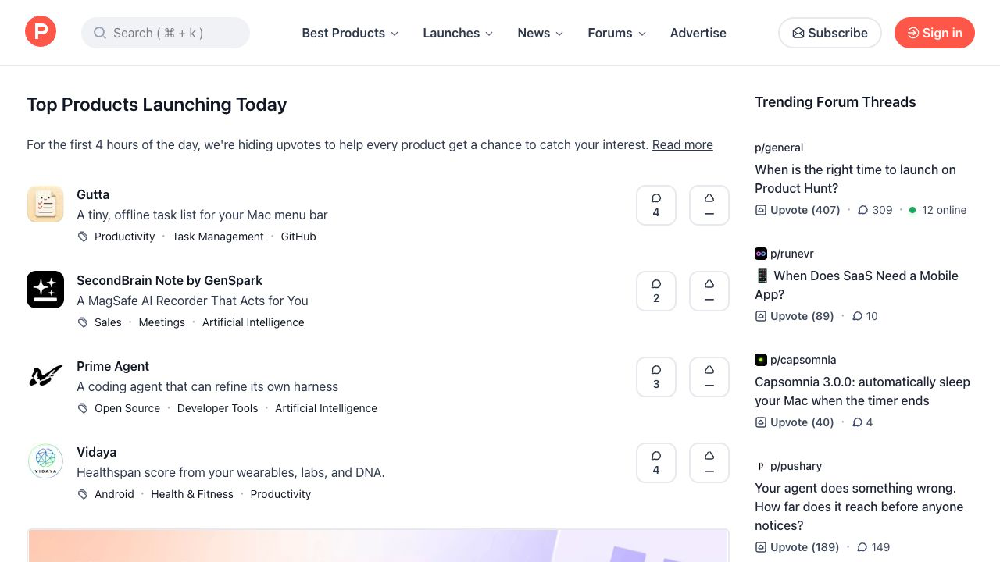
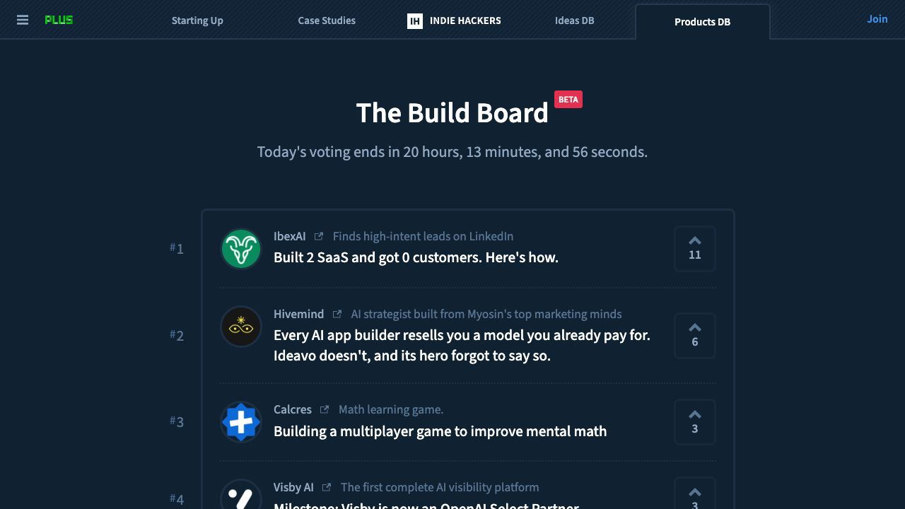
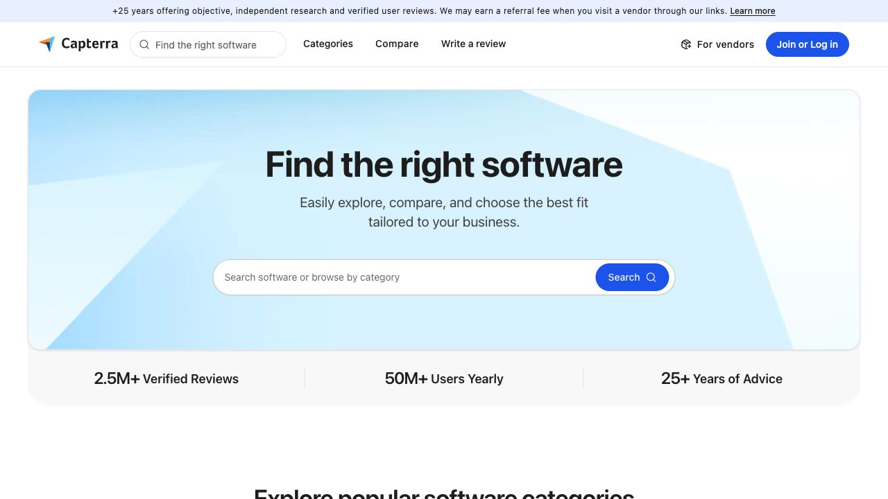
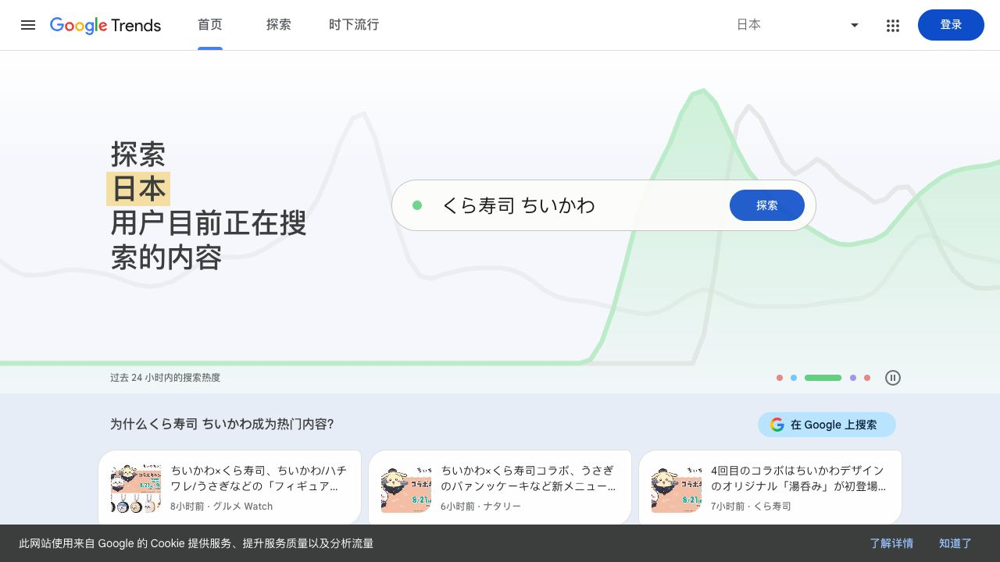

<script setup>
const duration = 'Khoảng <strong>20 phút</strong>'
</script>

# Ý tưởng sáng tạo đến từ đâu


## Nội dung của chương

<ChapterIntroduction
  :duration="duration"
  :tags="['Nguồn ý tưởng', 'Thu thập manh mối']"
  coreOutput="Một trang manh mối có ghi nguồn"
  expectedOutput="Biết tìm ở đâu và giữ lại lời gốc, bối cảnh cùng liên kết"
>

Chương này chưa đánh giá điều gì là “nhu cầu thật”, cũng chưa chọn hướng sản phẩm. Chúng ta chỉ làm bước trước đó: thu thập vật liệu trong đời sống thật.

Khi thấy ai đó than phiền, nhờ giúp đỡ hoặc lặp lại một việc rắc rối, hãy lưu lại tình huống. Sang chương sau, ta sẽ dùng chúng để xem vấn đề nào đáng tìm hiểu thêm.

</ChapterIntroduction>

## 1. Bắt đầu từ cuộc sống của bạn

Hãy nhớ lại tuần vừa qua. Việc nào khiến bạn liên tục sao chép, chuyển qua lại giữa nhiều ứng dụng hoặc nghĩ “lần sau phải tìm cách tốt hơn”?

Ví dụ khi tìm nhà, bạn có thể mở ba nền tảng và tự chép tiền thuê cùng thời gian đi lại vào bảng. Sau khi xem nhà, ảnh trong điện thoại đôi khi không còn khớp với tin đăng.


_Trước hết hãy ghi lại trải nghiệm, chưa cần biến nó thành sản phẩm ngay._

Một hoặc hai câu về điều đã xảy ra, kèm ảnh chụp hay tệp liên quan, đã là một manh mối dùng được.

## 2. Chú ý những lời nhờ lặp lại quanh bạn

Manh mối thường nằm trong những cuộc trò chuyện rất bình thường ở chỗ làm, lớp học hoặc cộng đồng sở thích:

> “Ai còn mẫu lần trước không?” “Xuất kích thước này thế nào?” “Sao đăng lên lại bị cắt nữa?”

Trước một sự kiện, một áp phích có thể phải đổi thành ảnh ngang, bài dọc và bìa video. Mỗi lần đổi kích thước, người thiết kế lại sắp xếp tiêu đề, chủ thể và vùng an toàn.


_Nếu cùng một lời nhờ xuất hiện lại sau vài ngày, hãy lưu nó._

Ghi nguyên văn và hoàn cảnh xuất hiện. Sang chương sau ta mới quyết định đây là phiền toái nhất thời hay một hướng đáng làm.

## 3. Ghé một trong những nơi sau

Nếu chưa có ý tưởng, hãy chọn một nhóm trong bản đồ. Muốn biết người khác thiếu gì thì xem cộng đồng ý tưởng; muốn hiểu sản phẩm nhỏ khởi đầu thế nào thì đọc câu chuyện của nhà phát triển độc lập; muốn gần việc kinh doanh thật hơn thì đọc đánh giá phần mềm thấp, thông tin mua sắm và dịch vụ làm thuê. Khi đã có mối quan tâm sơ bộ, hãy xem thêm xu hướng và bài viết của quỹ đầu tư.

Không cần mở tất cả cùng lúc. Đọc kỹ vài bài cụ thể hữu ích hơn mở hai mươi trang chủ.

<ClientOnly>
  <IdeaSourceMap />
</ClientOnly>

### Bạn cũng có thể làm sản phẩm cho người dùng nước ngoài

Sản phẩm Internet không nhất thiết chỉ phục vụ thị trường trong nước. Một người có thể làm trang tiếng Anh, tiện ích trình duyệt, ứng dụng Shopify, plugin Figma hoặc SaaS nhỏ rồi tìm người dùng đầu tiên trên Product Hunt, Reddit và các cộng đồng khác.

Quan sát những việc người ở thị trường khác đã trả tiền để giải quyết. Người bán xuyên biên giới sắp xếp thông tin hàng hóa, môi giới bất động sản biến ghi chú xem nhà thành tin đăng, còn nhà phát triển độc lập xử lý thư hỗ trợ và doanh thu thuê bao. Sau khi tìm bằng tiếng Việt, thử thêm `vendor quote comparison`, `real estate listing generator` hoặc `Shopify product description`.

Làm cho thị trường khác không chỉ là dịch giao diện. Thói quen, nền tảng, thanh toán và quy định có thể khác. Hãy chọn một tình huống nhỏ bạn hiểu và nói chuyện với người dùng thật trước.

Tìm trên diễn đàn và đánh giá bằng cách nói của người trong tình huống:

```text
so sánh báo giá Excel quá mất thời gian
giáo viên không kịp chuẩn bị bài
cửa hàng nhỏ tồn kho không khớp
site:reddit.com is there a tool for
```

Khi thấy nội dung hữu ích, lưu câu gốc, liên kết và ngày. Đừng chỉ lưu trang chủ, cũng đừng lập tức đổi lời than phiền thành chức năng.

## 4. Làm quen với bốn trang thường dùng

Bản đồ có nhiều nguồn. Bốn trang sau đại diện cho ra mắt sản phẩm, kinh doanh độc lập, đánh giá phần mềm và xu hướng tìm kiếm.

### [Product Hunt](https://www.producthunt.com/): nơi sản phẩm mới ra mắt

Product Hunt tập trung các đợt ra mắt sản phẩm công nghệ. Nhà phát triển chuẩn bị mô tả, ảnh và bản trình diễn rồi nhận phiếu bầu cùng bình luận trong ngày ra mắt.



Sản phẩm thay đổi mỗi ngày. Mở một sản phẩm rồi xem nó tự giới thiệu bằng một câu thế nào, ảnh đầu nhấn mạnh điều gì và mọi người hỏi gì trong bình luận. Đừng chỉ nhìn hạng nhất; theo dõi vài ngày sẽ thấy nhóm sản phẩm lặp lại.

### [Indie Hackers](https://www.indiehackers.com/products): xem cách vận hành sản phẩm nhỏ

Product Hunt giống sân khấu ngày ra mắt. Indie Hackers là cộng đồng dài hạn nơi nhà phát triển chia sẻ tiến độ, doanh thu, cách tìm khách hàng và cả thất bại.



Không cần chỉ tìm dự án có doanh thu cao nhất. Một sản phẩm do một người duy trì với thu nhập nhỏ nhưng đều thường cho thấy rõ hơn vấn đề ban đầu và nguồn khách hàng đầu tiên.

### [Capterra](https://www.capterra.com/): tìm phần mềm theo nhóm và đọc đánh giá

Capterra là danh mục và trang đánh giá phần mềm doanh nghiệp. Có thể so sánh CRM, quản lý dự án, hỗ trợ khách hàng, xếp lịch và nhiều công cụ khác.



Nếu quan tâm một nhóm sản phẩm, hãy mở vài công cụ quen thuộc và đọc đánh giá thấp. Những lời phàn nàn lặp lại như bản di động khó dùng, định dạng xuất sai hoặc cài đặt quá phức tạp thường đáng lưu hơn danh sách chức năng chính thức.

### [Google Trends](https://trends.google.com/): so sánh thay đổi tìm kiếm

Google Trends cho thấy mức quan tâm tìm kiếm tương đối theo thời gian và khu vực, kèm truy vấn liên quan và tăng nhanh.



Hãy dùng khi đã có vài cách gọi. So sánh “AI meeting notes”, “AI transcription” và “voice notes” để xem người dùng tìm cách nói nào nhiều hơn. Đường tăng không chứng minh có thị trường; nó chỉ cho thấy sự chú ý đang thay đổi.

## 5. Tạo một trang manh mối trong 20 phút

<ClientOnly>
  <IdeaSprint />
</ClientOnly>

## 6. Mang vật liệu sang chương sau

Đến đây, bạn chỉ cần một trang vật liệu gốc có thể tìm lại nguồn. Chúng có thể rời rạc và chưa cần giống một hướng sản phẩm hoàn chỉnh.

Tiếp theo, hãy đọc [Cách xác định một ý tưởng hay](../finding-great-idea/) để phân tích xem các manh mối có chứa nhu cầu thật không, ảnh hưởng lớn đến đâu và điều nào đáng kiểm chứng tiếp.
