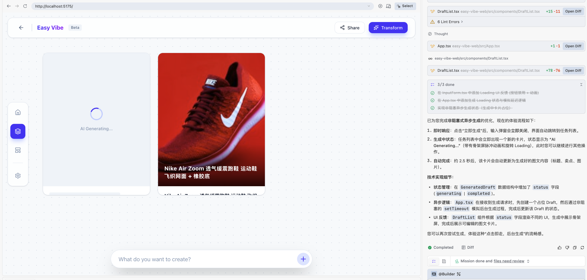

<script setup>
import { relatedArticlesMap } from '@theme/data/relatedArticles'
import StageAssignmentCard from '@theme/components/StageAssignmentCard.vue'
import ProductFinishMap from '../../../zh-cn/stage-1/complete-project-practice/ProductFinishMap.vue'
import StageOneCompletion from '../../../zh-cn/stage-1/complete-project-practice/StageOneCompletion.vue'

const duration = 'Khoảng <strong>2–3 ngày</strong>'
const relatedArticles =
  relatedArticlesMap['vi-vn/stage-1/complete-project-practice'] ?? []
</script>

# Thực hành dự án hoàn chỉnh: từ ý tưởng đến sản phẩm


## Bài này sẽ làm gì?

<ChapterIntroduction :duration="duration" :tags="['Dùng trọn quy trình', 'Trải nghiệm sản phẩm', 'Người dùng thử', 'Giới thiệu sản phẩm']" coreOutput="Một sản phẩm AI người khác có thể dùng mà không cần hướng dẫn" expectedOutput="Một ứng dụng web đã được người thật dùng thử và chỉnh sửa">

Trong các bài trước, chúng ta bắt đầu từ một ý tưởng, làm nguyên mẫu có thể tương tác và đưa tính năng AI trên trang vào hoạt động.

Bạn biết cần điền gì và nhấn ở đâu. Nhưng người mở trang lần đầu có thể không tìm thấy bước đầu tiên. Nếu nhấn nút mà chưa thấy kết quả ngay, họ cũng có thể nghĩ trang đã hỏng.

Bài này không thêm tính năng mới. Ta sẽ dùng sản phẩm từ đầu đến cuối, sửa những chỗ dễ mắc kẹt rồi nhờ người khác thử. Sau cùng, bạn sẽ có một sản phẩm có thể yên tâm gửi cho người khác.

</ChapterIntroduction>

<div style="margin: 50px 0;">
  <ClientOnly>
    <StepBar :active="0" :items="[
      { title: 'Tự dùng một lượt', description: 'Đi từ đầu đến kết quả' },
      { title: 'Sửa chỗ mắc kẹt', description: 'Chờ, kết quả và lỗi' },
      { title: 'Nhờ người khác thử', description: 'Quan sát trước khi giúp' },
      { title: 'Sắp xếp và chia sẻ', description: 'Để người khác hiểu sản phẩm' }
    ]" />
  </ClientOnly>
</div>

<ProductFinishMap />

## 1. Dùng sản phẩm một lần từ đầu đến cuối

Đừng vội thêm đăng nhập, làm việc nhóm và bảng dữ liệu. Hãy mở sản phẩm hiện tại và dùng như một người mới, từ trang đầu đến khi nhận được kết quả. Bước nào vẫn cần bạn đứng bên cạnh giải thích thì bước đó cần được sửa.

Với bàn làm việc nội dung thương mại điện tử trong khóa học, một lượt dùng đầy đủ sẽ như sau:

> Nhân viên vận hành tải ảnh sản phẩm lên, bổ sung thông tin cần thiết, tạo bản nháp hình và chữ, kiểm tra rồi sao chép hoặc lưu để tiếp tục sửa và đăng bán.

Trước mắt chỉ cần làm tốt hành trình ngắn này. Đăng nhập, quyền nhóm và phát hành chính thức có thể chờ đến khi sản phẩm thật sự cần.

### 1.1 Đi theo đúng thứ tự sử dụng

Tạm thời đừng nhìn mã và component. Hãy làm theo việc người dùng sẽ làm:

1. Mở trang và hiểu công cụ có thể giúp gì.
2. Tải ảnh sản phẩm lên và điền thông tin cần thiết như tên và chất liệu.
3. Nhấn “Tạo nội dung” và thấy trang đang xử lý.
4. Kiểm tra tiêu đề và điểm bán hàng AI trả về; sửa hoặc tạo lại khi cần.
5. Sao chép, tải xuống hoặc tạm lưu kết quả rồi hoàn tất công việc.

Khi đi hết, hãy hỏi: nếu mình không đứng cạnh thì họ có bị kẹt không? Ghi lại quản lý thành viên hoặc bảng dữ liệu phức tạp, nhưng chưa cần làm nếu chúng không ảnh hưởng lần sử dụng này.

::: tip Phiên bản này nên lớn đến đâu?
Nếu bạn có thể nói nhiệm vụ trong một câu và người kia bắt đầu trong vài phút, phạm vi thường đã vừa phải.
:::

### 1.2 Thử lại từ một trang trống

Sau khi phát triển một thời gian, trang thường còn dữ liệu thử và kết quả cũ. Ta dễ quên người mới sẽ không có gì. Hãy mở cửa sổ riêng tư hoặc xóa dữ liệu cục bộ rồi bắt đầu lại.

Chỉ cần thử ba tình huống:

1. **Mở khi trống:** không nhập gì mà nhấn, xem trang có nói rõ còn thiếu gì không.
2. **Tạo bình thường:** tải ảnh và tạo nội dung; kiểm tra trạng thái chờ và bước tiếp theo sau kết quả.
3. **Cố ý gây lỗi:** tải tệp không hỗ trợ hoặc làm yêu cầu thất bại; thông tin đã nhập phải còn và có thể thử lại.

Ghi lại chỗ bị kẹt. Phần tiếp theo sẽ sửa từng điểm.

Bạn có thể nhờ AI IDE kiểm tra mã, nhưng nó không thay cho thao tác thực tế:

```text
Chưa sửa mã.

Hãy kiểm tra dự án theo nhiệm vụ này:
người dùng tải ảnh sản phẩm, nhập thông tin cần thiết,
tạo nội dung, kiểm tra rồi sao chép hoặc lưu kết quả.

Cho tôi biết các trang và tệp liên quan,
cùng những chỗ hành trình hiện có thể bị ngắt.
```

AI IDE có thể tìm đoạn mã đáng ngờ. Trang có dễ dùng không thì bạn vẫn phải tự nhấn mới biết.

## 2. Sửa những chỗ người dùng dễ mắc kẹt

Sau một lượt đầy đủ, vấn đề thường xuất hiện ở bốn thời điểm: lần đầu mở trang, lúc chờ AI, sau khi có kết quả và khi yêu cầu thất bại. Không cần thiết kế phức tạp. Người dùng chỉ cần biết đang xảy ra gì và tiếp theo có thể làm gì.

### 2.1 Lần đầu mở có biết làm gì không?

Trang trống không nên chỉ có một ô nhập. Hãy thêm lời giải thích ngắn, nội dung mẫu hoặc ghi chú về định dạng và kích thước ảnh gần vùng tải lên.

Nếu biểu mẫu có nhiều trường, giữ lại phần kết quả thật sự cần. Tên, ảnh và đặc điểm chính có thể bắt buộc; thương hiệu, liên kết tham khảo và lựa chọn phong cách có thể nằm trong “Cài đặt thêm”. Người mới không nên phải điền một biểu mẫu dài trước khi thử sản phẩm.

### 2.2 Trang có phản hồi sau khi nhấn không?

Yêu cầu AI có thể mất vài giây hoặc lâu hơn. Sau khi nhấn, nút nên hiển thị “Đang tạo” và tạm ngăn gửi nhiều lần. Nội dung đã nhập không được biến mất và trang không nên nhảy sang vùng kết quả trống.



*Không cần hiệu ứng phức tạp. Chỉ cần cho thấy công việc đã bắt đầu, đồng thời giữ nội dung và vị trí trang, đã tránh được phần lớn nhầm lẫn.*

Nếu ảnh hoặc video phải xếp hàng, có thể hiển thị “Đang xếp hàng”, “Đang tạo”. Đừng tự đặt phần trăm chính xác nếu API không thật sự cung cấp tiến độ.

### 2.3 Có kết quả rồi thì làm gì tiếp?

Kết quả AI không phải điểm cuối. Người dùng thường phải kiểm tra sự thật, sửa cách viết và đưa nội dung sang bước khác. Vùng kết quả phải có ít nhất một thao tác: sửa, sao chép, tải xuống hoặc tạo lại.


*Ảnh sản phẩm đã tải vẫn nằm trên kết quả. Người dùng có thể đối chiếu nội dung với ảnh gốc thay vì chỉ chấp nhận một câu trả lời của mô hình.*

Nếu mô hình không thể xác nhận thông tin, hãy đánh dấu để người dùng bổ sung hoặc xóa. Cách này gần với công việc thật hơn việc coi một đoạn văn là “đáp án cuối”.

### 2.4 Sau khi lỗi có thể tiếp tục không?

Mạng ngắt, hết hạn mức hoặc tệp không hỗ trợ đều có thể làm yêu cầu thất bại. Không cần cho người dùng phổ thông xem toàn bộ lỗi kỹ thuật, nhưng phải nói thao tác chưa hoàn tất và cho phép thử lại hoặc sửa đầu vào.

Ví dụ:

- **Định dạng ảnh không hỗ trợ:** nói rõ định dạng được chấp nhận và cho chọn lại.
- **Thiếu thông tin bắt buộc:** báo gần trường liên quan, không chỉ hiện “Tham số sai”.
- **Dịch vụ AI tạm không dùng được:** giữ nội dung và đưa nút “Tạo lại”.
- **Kết quả chưa phù hợp:** cho sửa đầu vào và thử lại mà không phải bắt đầu từ đầu.

Nếu tải lại trang làm mất biểu mẫu dài, có thể tạm lưu bản nháp bằng LocalStorage. Chỉ lưu dữ liệu thông thường cần để tiếp tục; không lưu API Key, dữ liệu khách hàng thật hay tệp nhạy cảm trong trình duyệt.

Đưa các vấn đề cho AI IDE bằng một yêu cầu tập trung:

```text
Kiểm tra hành trình “tải ảnh sản phẩm và tạo nội dung”
tại bốn thời điểm: bắt đầu, chờ, thành công và thất bại.

Ưu tiên sửa phần khiến người dùng không thể tiếp tục:
- trường bắt buộc không có lời nhắc;
- có thể nhấn nút nhiều lần khi đang yêu cầu;
- thất bại làm mất nội dung đã nhập;
- kết quả không có sửa, sao chép hoặc tạo lại.

Trước khi sửa, cho tôi biết sẽ thay đổi tệp nào.
Sau khi xong, đưa ra các bước kiểm tra thủ công.
```

## 3. Nhờ người khác dùng thử

Nhìn trang của mình lâu ngày, ta thấy mọi thao tác đều rõ. Người không tham gia phát triển thường chỉ mất vài phút để tìm ra điều ta đã bỏ sót.

Nếu có thể, hãy chọn người thật sự có khả năng sử dụng. Với công cụ này, người từng vận hành cửa hàng hoặc làm nội dung sản phẩm sẽ phù hợp. Nếu chưa tìm được, một người bạn chưa từng thấy trang cũng hữu ích.

### 3.1 Chỉ nói nhiệm vụ cần hoàn thành

Khi bắt đầu, chỉ nói mục tiêu:

> Dùng công cụ này để tạo tiêu đề và điểm bán hàng từ ảnh sản phẩm. Kiểm tra nội dung rồi sao chép phiên bản bạn muốn tiếp tục chỉnh sửa.

Hãy quan sát trước, đừng lập tức chỉ nơi cần nhấn. Ghi lại lúc họ dừng, quay lại, nhấn lặp và đặt câu hỏi. Nếu bạn giải thích ngay, vấn đề lẽ ra trang phải giải quyết sẽ bị che đi.

Chỉ một hoặc hai người cũng tìm được nhiều vấn đề rõ. Không cần báo cáo chính thức, chỉ cần ghi nơi họ dừng.

Nếu họ mở trang rồi không làm gì, thêm một câu nói rõ mục đích. Nếu liên tục nhấn “Tạo”, làm trạng thái chờ rõ hơn. Nếu không biết làm gì với kết quả, thêm sửa hoặc sao chép. Nếu sau lỗi phải nhập lại toàn bộ, giữ nội dung và thêm thử lại.

### 3.2 Trao đổi sau khi dùng xong

Khi họ hoàn thành hoặc bỏ cuộc, hãy hỏi:

1. Bước nào làm bạn không chắc nhất?
2. Phần nào trong kết quả bạn dùng ngay, phần nào luôn phải sửa?
3. Lần sau có cùng công việc, bạn có dùng lại không? Vì sao?

Đừng chỉ hỏi “Có dễ dùng không?”. Một câu “cũng ổn” vì lịch sự rất khó định hướng. Hành vi và ví dụ cụ thể có giá trị hơn.

::: warning Khi dùng tài liệu thật
Ảnh sản phẩm, bản ghi âm hoặc tài liệu của người thử có thể chứa thông tin kinh doanh. Trước khi bắt đầu, hãy giải thích loại dịch vụ AI sẽ nhận dữ liệu, tránh tài liệu khách hàng chưa được phép và xóa tệp không còn cần sau buổi thử.
:::

## 4. Sửa chỗ mắc kẹt rồi thử lại

Buổi thử có thể cho một danh sách dài. Không cần sửa hết. Bắt đầu từ vấn đề khiến nhiệm vụ không hoàn thành hoặc kết quả không đáng tin.

Theo thứ tự này:

1. **Không thể hoàn thành:** nút không hoạt động, yêu cầu thất bại hoặc không lấy được kết quả.
2. **Kết quả rõ ràng không đáng tin:** bịa thông tin, không kiểm tra được hoặc thiếu nguồn cần thiết.
3. **Thao tác dễ hiểu nhầm:** không rõ bắt đầu ở đâu hay đang ở trạng thái nào.
4. **Tốn quá nhiều công:** bước lặp, mất nội dung hoặc chờ không có phản hồi.
5. **Kiểu dáng và tính năng mới:** làm đẹp và mong muốn không cản nhiệm vụ chính.

Chọn một đến ba điểm quan trọng. Sau khi sửa, tự dùng lại; nếu có thể, nhờ người vừa thử quay lại. Chỉ khi chỗ mắc kẹt cũ thật sự biến mất thì thay đổi mới có ích.

### 4.1 Nói vấn đề cụ thể với AI IDE

Đừng chỉ nói “hãy tối ưu”. Hãy ghi điều đã quan sát:

```text
Nhiệm vụ: tải ảnh sản phẩm và tạo ba điểm bán hàng.

Vấn đề quan sát được:
Hai người thử đã nhấn “Tạo” nhiều lần vì trang không cho thấy rõ
yêu cầu đã bắt đầu. Kết quả là có các tác vụ trùng lặp.

Hãy sửa trang hiện tại:
1. Khi bắt đầu, vô hiệu hóa nút và hiển thị “Đang tạo”.
2. Khôi phục nút sau khi thành công hoặc thất bại.
3. Không xóa nội dung người dùng đã nhập.
4. Cho tôi cách kiểm tra thủ công nhấn lặp và lỗi.
```

Yêu cầu cụ thể giúp tránh thay đổi lạc đề và cho bạn biết phải kiểm tra gì sau đó.

### 4.2 Sửa xong hãy làm lại từ đầu

Sửa một chỗ có thể ảnh hưởng chỗ khác. Trước khi chia sẻ, thử bốn trường hợp:

- đầu vào bình thường với đủ thông tin;
- thiếu một trường bắt buộc;
- yêu cầu API thất bại hoặc hết thời gian;
- sửa, sao chép hoặc tạo lại sau khi có kết quả.

Nếu sản phẩm lưu bản nháp, hãy thử cả sau khi tải lại trang. Xác nhận tính năng mới và hành trình cũ đều hoạt động.

## 5. Sắp xếp sản phẩm để chia sẻ

Sản phẩm giờ không chỉ “chạy trên máy bạn”. Người khác đã dùng và bạn đã sửa theo một vấn đề thật. Hãy chuẩn bị lối vào và lời giải thích để nhiều người có thể hiểu.

### 5.1 Giải thích trong một phút

Có thể theo thứ tự:

1. **Ai gặp vấn đề gì:** nhân viên thương mại điện tử phải sắp xếp ảnh và điểm bán hàng mỗi lần làm bản nháp.
2. **Sản phẩm giúp thế nào:** tải ảnh và thông tin để có bản nháp tiếp tục chỉnh sửa.
3. **Dùng khả năng AI nào:** hiểu hình ảnh và tạo văn bản.
4. **Hoàn thành ra sao:** tải lên, tạo, kiểm tra, sửa, sao chép.
5. **Đã sửa gì sau khi thử:** trạng thái chờ rõ và giữ nội dung sau lỗi.

Hãy để người khác hiểu sản phẩm trước khi liệt kê framework và tên mô hình.

### 5.2 Chuẩn bị thứ người khác cần

Trước khi chia sẻ, chuẩn bị ba thứ:

1. **Ứng dụng chạy được:** đưa liên kết; nếu chưa triển khai, ghi lệnh khởi động và địa chỉ.
2. **Video 30–60 giây:** trình bày một nhiệm vụ từ đầu vào đến kết quả, không chỉ đổi nhanh giữa các trang.
3. **Một trang giới thiệu:** người dùng mục tiêu, vấn đề, hành trình, khả năng AI, một phản hồi và thay đổi từ phản hồi đó.

Nếu chưa thể truy cập từ xa, chạy cục bộ và video cũng là kết quả Stage 1. Quan trọng là người khác hiểu sản phẩm và thấy hành trình chính hoàn tất.

### 5.3 Tiếp tục sản phẩm này hay làm sản phẩm khác?

Bạn có thể tiếp tục bàn làm việc thương mại điện tử hoặc áp dụng cùng cách cho ghi chép cuộc họp, âm thanh, hỗ trợ học tập hay công cụ chuyên môn. [Tài liệu về các tình huống AI](../appendix-industry-scenarios/index.md) giúp bạn mở rộng hướng.

Đừng đổi sang chủ đề xa lạ chỉ để trông mới. Một vấn đề nhỏ trong học tập, công việc hoặc cuộc sống, đã được người thật dùng và chỉnh sửa, thuyết phục hơn một trang nhiều tính năng chưa ai thử.

### Trước khi gửi

Mở liên kết một lần cuối và làm trọn hành trình. Xác nhận người khác mở được, AI trả kết quả và trang hoặc ảnh chụp không lộ API Key. Nếu dùng ảnh, âm thanh hoặc tài liệu của người khác, hãy xác nhận quyền sử dụng.

## 6. 📚 Bài tập

<StageAssignmentCard title="Hoàn thiện và công bố sản phẩm Stage 1">

  <p>Không thêm tính năng mới. Hãy chuẩn bị sản phẩm hiện tại và thật sự đưa cho một người sử dụng.</p>

  <ol>
    <li>
      <strong>Dùng trọn một lần</strong>
      <ul>
        <li>Bắt đầu từ khi mở trang, tiếp tục đến lúc nhận, sửa hoặc lưu kết quả.</li>
      </ul>
    </li>
    <li>
      <strong>Nhờ một người thử</strong>
      <ul>
        <li>Đừng dạy giao diện trước; quan sát nơi họ dừng và sửa một vấn đề.</li>
      </ul>
    </li>
    <li>
      <strong>Chia sẻ sản phẩm</strong>
      <ul>
        <li>Chuẩn bị liên kết hoặc hướng dẫn, video 30–60 giây và lời giới thiệu ngắn.</li>
      </ul>
    </li>
  </ol>

  <p>Stage 1 thật sự hoàn tất khi người khác có thể mở sản phẩm và tự mình hoàn thành một lượt dùng.</p>
</StageAssignmentCard>

## Bước tiếp theo

Bạn đã đi trọn một con đường: bắt đầu từ vấn đề thật, thu hẹp phiên bản đầu, làm nguyên mẫu tương tác, kết nối AI rồi cải thiện sau khi người dùng thử.

Trong Stage 2, ta sẽ học cơ sở dữ liệu, tài khoản, thanh toán, triển khai và kỹ thuật frontend/backend hoàn chỉnh hơn. Chúng giúp phục vụ nhiều người và dữ liệu thật, nhưng điểm bắt đầu vẫn vậy: trước hết hoàn thành một nhiệm vụ có giá trị.

<RelatedArticlesSection
  title="Tiếp tục học"
  description="Sau Stage 1, hãy tiếp tục với các nội dung kỹ thuật bên dưới."
  :items="relatedArticles"
/>

<StageOneCompletion />
