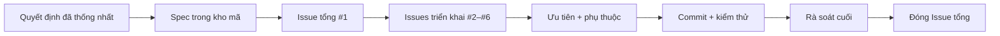
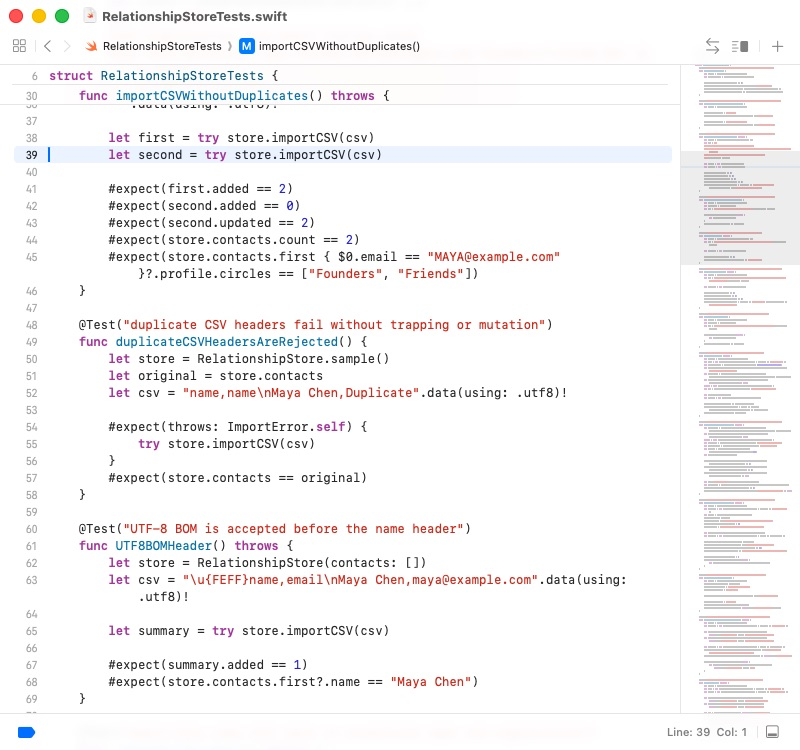

# Phát triển phần mềm trọn quy trình với GitHub Issues: từ trao đổi yêu cầu đến ứng dụng macOS hoàn chỉnh

Hướng dẫn này đi qua một chu trình phát triển theo Spec hoàn chỉnh: làm rõ một ý tưởng còn mơ hồ với AI, ghi thỏa thuận thành đặc tả, tạo GitHub Issues có ưu tiên và phụ thuộc, rồi triển khai, kiểm thử và rà soát sản phẩm.

::: info Khác gì với bài trước?

[Từ Vibe Coding đến Spec Coding](/vi-vn/stage-3/core-skills/spec-coding/) giải thích vì sao đặc tả trở thành trung tâm của phát triển bằng AI. Bài này là phần thực hành: một kho mã công khai cho thấy Spec biến thành Issues, commit, kiểm thử và sản phẩm chạy được như thế nào.

:::

Điểm xuất phát chỉ là một câu:

> Tôi muốn làm một CRM trên macOS để quản lý các liên hệ đã nhập và giúp tôi sắp xếp các mối quan hệ. Trước mắt có thể dùng dữ liệu mẫu.

Kết quả là **Relationship Compass**, ứng dụng macOS native có thể tìm kiếm và lọc liên hệ, sửa hồ sơ quan hệ, nhập CSV, ghi tương tác và tính ngày nên liên hệ tiếp theo.


[Kho mã ví dụ công khai](https://github.com/sanbuphy/relationship-compass-macos) chỉ chứa dữ liệu giả và lưu đầy đủ Spec, Issues, lịch sử commit, mã nguồn và kiểm thử.

## 1. Phát triển theo Spec là gì?

Một vòng lặp AI coding thường gặp:

```text
Mô tả ý tưởng → AI viết mã → phát hiện sai → bổ sung yêu cầu → sửa tiếp
```

Cách này ổn với một trang nhỏ. Khi dự án lớn lên, yêu cầu cũ dễ biến mất khỏi hội thoại, tiến độ khó theo dõi, và tính năng có thể chạy nhưng không đáp ứng ý định ban đầu.

Skills của Matt Pocock cung cấp cho AI một quy trình lặp lại được. Skill quy định phải xác nhận điều gì, tạo ra hiện vật nào và dừng ở đâu để người dùng duyệt, chứ không chỉ nói phải viết đoạn mã nào.

| Triển khai từ hội thoại | Triển khai theo Spec |
| --- | --- |
| Chat hiện tại là nguồn chính | Spec có phiên bản là nguồn chuẩn |
| Bổ sung yêu cầu tùy hứng | Cập nhật Spec và nhiệm vụ trước |
| Tiến độ nằm trong bản tóm tắt của AI | Tiến độ nằm trong Issues và commit |
| Chạy được là coi như xong | Kiểm tra từng tiêu chí chấp nhận |

### 1.1 Ba vai trò của GitHub

1. **Kho lưu hồ sơ dự án**: lưu Spec, thuật ngữ và quyết định kiến trúc.
2. **Bảng công việc**: Issues, độ ưu tiên và phụ thuộc thể hiện thứ tự làm.
3. **Bằng chứng hoàn thành**: commit, kết quả test và Issue đã đóng cho thấy công việc thực tế.

| Hiện vật GitHub | Ý nghĩa | Ví dụ |
| --- | --- | --- |
| Spec | Phần mềm hoàn chỉnh phải làm gì | `specs/relationship-compass-mvp.md` |
| Issue | Một nhiệm vụ có thể hoàn thành độc lập | `#2 Browse sample Contacts` |
| Phụ thuộc | Nhiệm vụ nào phải xong trước | `#3` bị chặn bởi `#2` |
| Commit | Thay đổi trong một bước triển khai | `feat: browse sample contacts` |
| Tests | Bằng chứng hành vi vẫn đúng | `swift test` |
| ADR | Lý do cho một lựa chọn kỹ thuật quan trọng | `docs/adr/0002-native-swiftui-macos.md` |



### 1.2 Luồng chính

```text
grill-with-docs → to-spec → to-tickets → implement → code-review
```

- `grill-with-docs`: làm rõ phạm vi sản phẩm và ranh giới kỹ thuật.
- `to-spec`: biến thỏa thuận thành đặc tả chính thức.
- `to-tickets`: tạo Issues có ưu tiên và phụ thuộc.
- `implement`: triển khai từng Issue đang sẵn sàng.
- `code-review`: kiểm tra riêng sức khỏe mã và độ phủ yêu cầu.

## 2. Chuẩn bị

Bạn cần tài khoản GitHub, GitHub CLI đã đăng nhập, Node.js 18 trở lên và công cụ AI coding đọc được Skills của dự án. Muốn chạy ứng dụng thì cần thêm Mac và Xcode.

```bash
npx skills@latest add mattpocock/skills -y
gh auth status
gh repo create relationship-compass-macos \
  --public \
  --source . \
  --remote origin \
  --push
```

Kho ví dụ dùng `--public` vì toàn bộ dữ liệu là giả. Với liên hệ thật, hãy dùng `--private` và kiểm tra mẫu, log cùng lịch sử Git trước khi push. Các nhãn chính là `ready-for-agent`, `priority:P0/P1/P2` và `completed-by-agent`.

## 3. Sản phẩm và ranh giới MVP

Phiên bản đầu tiên cung cấp:

- sáu liên hệ mẫu cố định;
- tìm theo tên, tổ chức, vai trò, email và nhóm;
- lọc kết hợp theo độ thân thiết và nhóm;
- sửa hồ sơ, ghi chú và chu kỳ liên hệ;
- nhập CSV UTF-8 có kiểm tra và loại trùng an toàn;
- ghi tương tác và tính ngày liên hệ tiếp theo;
- lưu JSON cục bộ và tự khôi phục khi khởi động.

Cloud sync, điểm quan hệ bằng AI, tài khoản, backend và quyền đọc Contacts của macOS đều nằm ngoài MVP.

## 4. Chốt yêu cầu bằng `grill-with-docs`

<div class="workflow-chat">
  <div class="workflow-message workflow-message--user">
    <div class="workflow-message__speaker">🙋 Bạn</div>
    <div class="workflow-message__command">/grill-with-docs</div>
    <p>Tôi muốn làm một CRM trên macOS để quản lý các liên hệ đã nhập và sắp xếp các mối quan hệ. Ban đầu có thể dùng dữ liệu mẫu.</p>
  </div>
  <div class="workflow-message workflow-message--agent">
    <div class="workflow-message__speaker">✨ Agent</div>
    <p>Trước khi viết mã, chúng ta sẽ thống nhất phiên bản đầu làm gì, không làm gì, dữ liệu nằm ở đâu, dùng công nghệ nào và xác minh hoàn thành ra sao. Khi cần chọn, tôi sẽ giải thích khác biệt và đưa ra khuyến nghị.</p>
  </div>
</div>

Cuộc trao đổi chốt SwiftUI native cho macOS 14+, JSON cục bộ, CSV UTF-8, sáu liên hệ giả, không mạng và không quyền Contacts. `CONTEXT.md` cố định nghĩa của `Contact`, `Interaction`, `Follow-up`; hai ADR ghi lý do chọn dữ liệu local-first và SwiftUI native.

::: info GitHub ở giai đoạn này

Ngữ cảnh đã xác nhận được commit trong `CONTEXT.md` và `docs/adr/`. Chưa tạo Issue triển khai.

:::

## 5. Viết đặc tả bằng `to-spec`

<div class="workflow-chat">
  <div class="workflow-message workflow-message--user">
    <div class="workflow-message__speaker">🙋 Bạn</div>
    <div class="workflow-message__command">/to-spec</div>
    <p>Hãy chuyển nội dung đã thống nhất thành một Spec hoàn chỉnh, lưu vào kho mã và đăng thành Issue tổng trên GitHub với nhãn ready-for-agent.</p>
  </div>
</div>

[`specs/relationship-compass-mvp.md`](https://github.com/sanbuphy/relationship-compass-macos/blob/main/specs/relationship-compass-mvp.md) chứa vấn đề, MVP, 24 user stories, quyết định kỹ thuật, chiến lược kiểm thử và các mục rõ ràng không làm. [Issue #1](https://github.com/sanbuphy/relationship-compass-macos/issues/1) là điểm vào công khai của dự án.

Spec tốt mô tả hành vi chứ không đóng cứng tên tệp. Ví dụ, “liên hệ chưa có tương tác vẫn xuất hiện trong Follow-ups” vẫn đúng sau khi tái cấu trúc mã.

## 6. Tạo Issues có thứ tự bằng `to-tickets`

<div class="workflow-chat">
  <div class="workflow-message workflow-message--user">
    <div class="workflow-message__speaker">🙋 Bạn</div>
    <div class="workflow-message__command">/to-tickets</div>
    <p>Chia Spec thành GitHub Issues sao cho mỗi vé tạo ra một lát cắt có thể trình diễn độc lập. Ghi ưu tiên, tiêu chí hoàn thành và nhiệm vụ tiền đề; cho tôi xem danh sách và sơ đồ phụ thuộc trước khi đăng.</p>
  </div>
</div>

| Issue | Ưu tiên | Kết quả có thể thấy | Phụ thuộc |
| --- | --- | --- | --- |
| [#2 Browse sample Contacts](https://github.com/sanbuphy/relationship-compass-macos/issues/2) | P0 | Khởi chạy, mẫu, tìm kiếm, chi tiết | Không |
| [#3 Import and persist](https://github.com/sanbuphy/relationship-compass-macos/issues/3) | P0 | Loại trùng CSV, lưu JSON | #2 |
| [#4 Organize Profiles](https://github.com/sanbuphy/relationship-compass-macos/issues/4) | P1 | Hồ sơ, độ thân thiết, nhóm | #2 |
| [#5 Interactions and Follow-ups](https://github.com/sanbuphy/relationship-compass-macos/issues/5) | P1 | Lịch sử và danh sách theo dõi | #4 |
| [#6 Polish and verify](https://github.com/sanbuphy/relationship-compass-macos/issues/6) | P2 | Lỗi, tài liệu, đóng gói, xác minh | #3, #5 |

Không chia ngang thành toàn bộ model, toàn bộ Store, toàn bộ UI rồi cuối cùng mới test. Mỗi **lát cắt dọc** nối đủ dữ liệu, giao diện và test để người dùng thấy một kết quả mới khi Issue đóng.

## 7. Triển khai từng Issue bằng `implement`

<div class="workflow-chat">
  <div class="workflow-message workflow-message--user">
    <div class="workflow-message__speaker">🙋 Bạn</div>
    <div class="workflow-message__command">/implement</div>
    <p>Triển khai mọi Issue ready-for-agent theo ưu tiên và phụ thuộc. Mỗi lần chỉ làm một vé không bị chặn, viết test hành vi đang thất bại trước, chạy build và test, rồi commit riêng cho từng vé.</p>
  </div>
</div>

Với nhiệm vụ CSV, Agent viết trước test chứng minh nhập cùng tệp hai lần không được nhân đôi số liên hệ. Sau khi triển khai, một test khác bảo đảm header sai không làm hỏng dữ liệu hiện có.

```bash
swift test --filter RelationshipStoreTests
swift build
swift test
```

Dự án cuối cùng vượt qua cả 13 kiểm thử hành vi công khai.




Khi xong, Agent ghi commit và kết quả test vào Issue, bỏ `ready-for-agent`, thêm `completed-by-agent`, rồi đóng Issue.

## 8. Hai lượt kiểm tra với `code-review`

Lượt đầu kiểm tra tên, mã trùng, view quá lớn, coupling và quy ước trong `AGENTS.md`. Lượt hai đọc lại Spec cùng mọi Issue để xác minh yêu cầu thật sự hoàn thành.

Rà soát thực tế đã tìm ra header CSV trùng, nhận diện liên hệ không có email, bộ lọc Follow-ups, tự khôi phục lúc mở ứng dụng và hiển thị ngày liên hệ tiếp theo còn thiếu. Nhóm bổ sung test trước, sửa mã rồi chạy lại cả hai lượt.

Test xanh chỉ chứng minh những hành vi đã được viết thành test; nó không tự chứng minh mọi yêu cầu ban đầu đã được kiểm tra. Vì vậy vẫn cần đối chiếu Spec cuối cùng.

## 9. Phần mềm hoàn chỉnh

| Thành phần | Kết quả |
| --- | --- |
| Quản lý GitHub | Một Issue tổng và năm Issues triển khai đều đã đóng |
| Lịch sử triển khai | Chín commit nhỏ theo thứ tự phụ thuộc |
| Xác minh tự động | 13/13 test và toàn bộ build thành công |
| Rà soát cuối | Sức khỏe mã và độ hoàn thành Spec đều đạt |
| Sản phẩm chạy được | Có thể tạo `Relationship Compass.app` |
| Ranh giới dữ liệu | Chỉ lưu cục bộ, không đọc Contacts hay tải quan hệ lên mạng |

### 9.1 Tìm kiếm và bộ lọc kết hợp

Tìm `Founder` chỉ giữ lại Maya Chen; bộ lọc độ thân thiết và nhóm có thể dùng cùng nhau.


### 9.2 Sửa hồ sơ quan hệ

Người dùng có thể sửa tổ chức, vai trò, email, độ thân thiết, nhóm, chu kỳ và ghi chú.


### 9.3 Ghi tương tác và tính ngày tiếp theo

Một tương tác ngày 9 tháng 8 năm 2026 với chu kỳ 30 ngày cho ra ngày liên hệ tiếp theo là 8 tháng 9 năm 2026.


```bash
git clone https://github.com/sanbuphy/relationship-compass-macos.git
cd relationship-compass-macos
swift build
swift test
./scripts/package-app.sh
open "dist/Relationship Compass.app"
```

## 10. Luồng có thể sao chép

```text
/grill-with-docs
Hãy cùng tôi chốt phạm vi làm và không làm, nơi lưu dữ liệu, công nghệ và cách xác minh. Không viết mã trước khi tôi xác nhận.

/to-spec
Biến nội dung đã thống nhất thành Spec có hành vi người dùng, tiêu chí chấp nhận, mục không làm và một Issue tổng trên GitHub.

/to-tickets
Chia Spec thành các Issues lát cắt dọc có ưu tiên, tiêu chí hoàn thành và phụ thuộc.

/implement
Triển khai từng Issue không bị chặn theo ưu tiên bằng TDD, xác minh và commit riêng.
Cuối cùng rà soát sức khỏe mã và độ hoàn thành Spec, sửa mọi phát hiện và chạy lại kiểm thử.
```

## 11. Khi nào nên giao cho AI chạy liên tục?

Quy trình phù hợp với MVP đã thu hẹp phạm vi, website, ứng dụng hoặc backend có hành vi quan sát được và có lệnh test/build đáng tin cậy. Nó không phù hợp khi yêu cầu đổi liên tục, không thể xác minh hoặc tác vụ trực tiếp sửa dữ liệu production.

Con người vẫn xác nhận ranh giới MVP, độ phủ và thứ tự Issues, mọi thao tác thanh toán·triển khai·xóa·quyền riêng tư, và giao diện cùng sản phẩm cuối. Con người sở hữu mục tiêu, ranh giới và nghiệm thu; AI thực hiện ổn định phần việc đã thống nhất.

## Tổng kết

```text
Ý tưởng mơ hồ
  ↓ grill-with-docs
Phạm vi, thuật ngữ và quyết định kỹ thuật đã thống nhất
  ↓ to-spec
Yêu cầu có phiên bản và kiểm chứng được
  ↓ to-tickets
GitHub Issues có ưu tiên và phụ thuộc
  ↓ implement
Test, triển khai và commit từng vé
  ↓ code-review
Sức khỏe mã + độ hoàn thành Spec
  ↓
Phần mềm build và xác minh được
```

Khi cuộc trò chuyện kết thúc, Spec, Issues, phụ thuộc, commit và bằng chứng kiểm thử vẫn ở lại trên GitHub. Phiên tiếp theo có thể bắt đầu từ trạng thái đã ghi thay vì đoán lại ý định.

## Tài liệu tham khảo

- [Skills to Spec](https://www.aihero.dev/skills-to-spec)
- [AI Skills for Real Engineers](https://www.aihero.dev/skills)
- [Nhật ký thay đổi Skills v1.1](https://www.aihero.dev/skills/skills-changelog-v1-1-wayfinder-to-spec-to-tickets-grilling-improvements)
- [OpenAI: lưu quy trình lặp lại thành Skills](https://learn.chatgpt.com/codex/use-cases/reusable-codex-skills)
- [Kho ví dụ Relationship Compass](https://github.com/sanbuphy/relationship-compass-macos)
