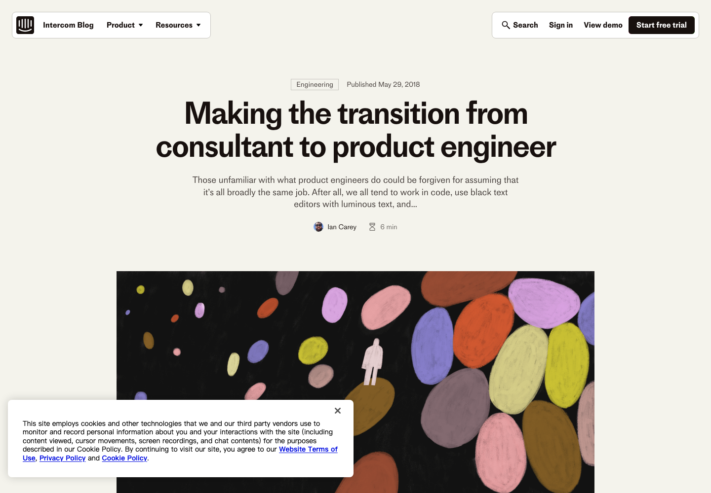
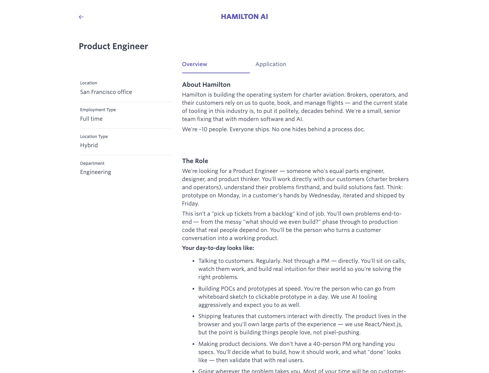
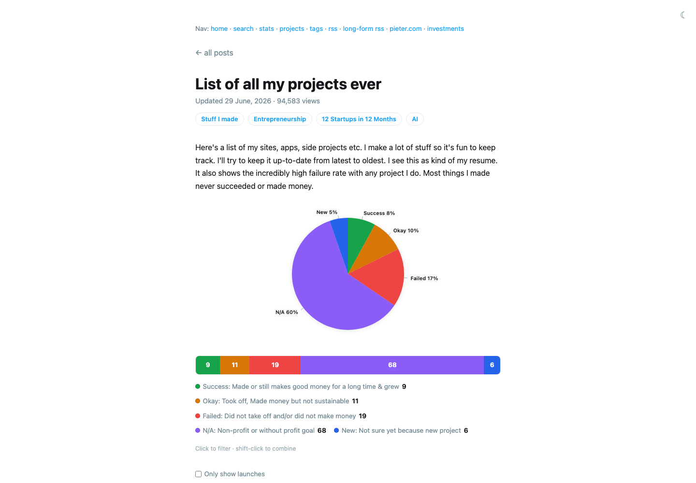
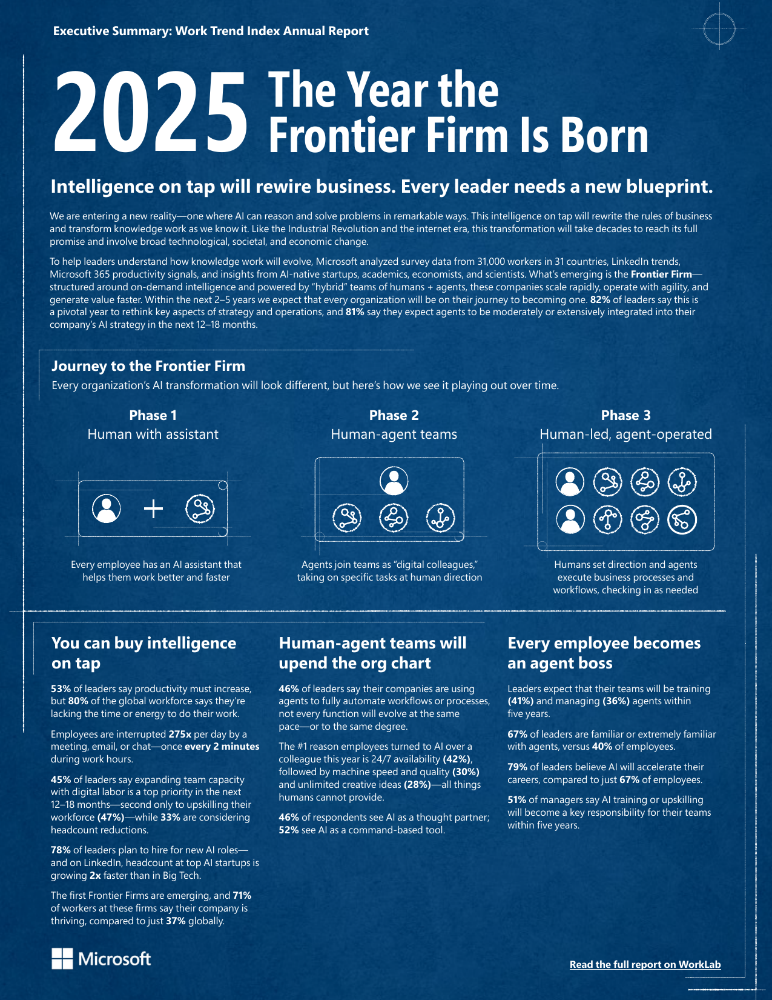

# 如何学习本课程

::: info 特别感谢
本教程的[核心贡献者与测试者](https://github.com/datawhalechina/easy-vibe#-contributing--contributors)来自 **清华大学深圳国际研究生院**。感谢同学们在实际学习和操作中不断指出问题、提出建议并参与修改，让教程更清晰、更可靠，也更贴近初学者的真实需要。

同时感谢 OpenAI 为本教程开发提供的算力支持。
:::

以前想做软件，要先学编程语言和各种开发工具。现在不一样了。你可以直接告诉 AI 想做什么，让它帮你写代码、做界面、改功能。

## 从 Vibe Coding 到 Build Product

**[Vibe Coding](https://www.merriam-webster.com/dictionary/vibe%20coding) 这个说法出现于 2025 年 2 月 2 日。** AI 研究者 Andrej Karpathy 用它来形容一种新的编程方式：你告诉 AI 想做什么，运行看看，再继续和它对话、修改。很多代码不需要自己一行一行写。

> **什么是 Vibe Coding？**
> 简单说，就是“用说话来编程”：描述想法，让 AI 生成程序，运行看看，再通过对话不断调整。

它最大的变化是：不会写代码的人，也可以开始做东西。几分钟内，你就可能做出一个小游戏、网页或者简单原型。

<figure class="concept-illustration">
  
  <figcaption>Vibe Coding 帮你先做出来；Build Product 还要把它交给用户，看它是不是真的有用。</figcaption>
</figure>

简单说，以前主要靠代码和计算机沟通，现在也可以直接和 AI 说话。

不过，能做出 Demo，不等于能做出真正的产品。你还要想清楚：

- 应该做什么，而不只是能做什么？
- 它为谁解决问题，用户真的需要吗？
- AI 生成的第一版，怎样变成稳定、清楚、可以持续修改的产品？
- 怎样把产品交给用户，而不只是在自己的电脑上运行？
- 怎样通过使用、反馈和付费，证明它确实创造了价值？

所以，会让 AI 写代码只是开始。

Coding 是把东西做出来。Build Product 还要继续往后走：

> **Coding：我能不能把它做出来？** 
> **Build Product：它值不值得做，谁会使用，我怎样把它交付出去，又怎样知道它真的有效？**

Vibe Coding 是这门课的起点，但不是终点。我们会先做出东西，再去找用户、听反馈，一步一步把 Demo 变成真正能用的产品。

::: tip 这门课想带你做什么？
这门课不只教你怎么使用 AI 编程工具。我们更希望你能成为一名 **AI 原生时代的软件创作者**：从自己的想法和真实问题出发，借助 AI 做出软件，交给别人使用，再根据反馈把它慢慢变好。

你不一定要先成为程序员，也不需要把自己限制在某个岗位里。重要的是，你能把脑中的想法变成真正可以运行、可以分享、可以帮助别人的东西。
:::

## AI 让更多人可以成为软件创作者

这种变化也在影响公司里的岗位。比如，一些团队把既理解用户、又亲手做产品的人称为产品工程师。早在 2018 年，Intercom 就提出：工程师不应该只等别人写好需求，再照着做功能。他也要了解用户，参与产品判断，并继续改进自己做出来的东西。

<figure class="source-evidence">
  <a href="https://www.intercom.com/blog/making-the-transition-from-consultant-to-product-engineer/" target="_blank" rel="noopener noreferrer">
    

      
    

  </a>
  <figcaption>Intercom 在 2018 年发布的 Product Engineer 文章。</figcaption>
</figure>

AI 让做产品变快了。现在，一个人借助大模型和编程 Agent，就可以做原型、界面、前后端、测试和部署。因此，很多公司开始希望工程师多走一步：不只把功能做完，还要了解用户为什么需要它，以及做完以后有没有效果。

下面这些真实岗位，也能看出这种变化：

| 时间 | 公司与岗位 | 主要在做什么 |
| --- | --- | --- |
| 2018 年 5 月 | [Intercom：Product Engineer](https://www.intercom.com/blog/making-the-transition-from-consultant-to-product-engineer/) | 工程师同时也是产品人，要理解客户并参与决定产品应该怎样发展 |
| 2026 年 2 月 | [Hamilton AI：Product Engineer](https://jobs.ashbyhq.com/hamilton-ai/78c69fe9-828d-44b3-abe6-af56a2badf76/) | 直接与客户交流，把一次客户对话变成可以使用的产品，再交给真实用户验证 |
| 2026 年 6 月 | [Alma：Product Engineer - AI](https://jobs.ashbyhq.com/tryalma/8021fb35-fc1e-4950-a078-afc0e89d9856) | 同一个人设计 Agent、编写后端、完成界面，并观察律师和客户怎样使用产品 |
| 2026 年 7 月 | [Harper：Product Engineer](https://jobs.ashbyhq.com/harperinsure/7d678dba-885a-4432-94c7-a9c20852db35) | 深入销售、客服和承保现场，对转化率等业务指标负责，而不只对功能上线负责 |
| 2026 年 8 月 | [Paradigm：Product Engineer, Applied AI](https://jobs.ashbyhq.com/Paradigm/b85b9094-2467-4f49-9a36-ca93da34a3f5) | 进入投资、研究和业务团队发现问题，构建内部与开源产品，并用实践寻找新机会 |
| 截至 2026 年 8 月 | [OpenAI：Forward Deployed Engineer](https://openai.com/careers/forward-deployed-engineer-%28fde%29-seattle-seattle/) | 从问题发现、技术规划、系统构建到生产部署全程负责，用采用率和工作流影响衡量成功 |

<figure id="real-job-screenshots" class="source-evidence">
  
  <figcaption><strong>Hamilton AI：</strong>直接和客户交流，把客户对话变成可以使用的产品。</figcaption>
</figure>

<strong>查看更多不同行业的真实岗位</strong>

这些案例来自航空、法律、保险、金融合规、生物医药、工业、企业服务和 AI 基础设施等不同领域。

| 发布时间 | 公司与岗位 | 需要完成的闭环 |
| --- | --- | --- |
| 2026 年 2 月 | [Sphinx：Product Engineer](https://jobs.ashbyhq.com/Sphinx/08bdb9eb-4b6c-44ab-9615-3bb6b908d008) | 从客户交流中选择机会，快速做原型、测试，再用结果影响产品路线图 |
| 2026 年 3 月 | [Hyperscale：Founding Forward Deployed Engineer](https://jobs.ashbyhq.com/hyperscale/950c982f-5fb9-481b-a6ad-808feba76757) | 参与技术调研、PoC、现场实施和企业销售，用技术工作帮助赢得客户 |
| 2026 年 4 月 | [Sphere：Founding Forward Deployed Engineer](https://jobs.ashbyhq.com/sphere/7b5f39b0-6f3f-4bc4-9469-74ae9722d85a) | 从客户发现做到部署，并把客户需求转化成通用产品能力 |
| 2026 年 5 月 | [Avent：Founding Forward Deployed Engineer](https://jobs.ashbyhq.com/avent-industrial-inc/bf8337c2-00cf-4ca7-aa43-b4c29e4b8083) | 理解客户业务、编写代码、集成系统，对客户成功上线负责 |
| 2026 年 5 月 | [Tamarind Bio：Founding Forward Deployed Engineer](https://jobs.ashbyhq.com/tamarindbio/be678c9b-984e-4a0a-aedc-a87187e18748/) | 覆盖第一次技术沟通、试点、生产部署和扩展，参与 Demo 与销售周期 |
| 2026 年 6 月 | [Protege：Forward Deployed Engineer, New Verticals](https://jobs.ashbyhq.com/protege/b62ebf3e-e07f-4f67-bc9c-4787f23fe449/) | 从早期客户需求中建立新业务方向，把有效做法沉淀进平台 |
| 2026 年 6 月 | [Dataleap：Founding Forward Deployed Engineer](https://jobs.ashbyhq.com/dataleap/6afe756f-fea9-42fc-82ed-621c72a99387/) | 进入企业现场寻找重要工作流、构建 Agent、完成集成并教会客户使用 |
| 2026 年 6 月 | [Collinear AI：Product Engineer](https://jobs.ashbyhq.com/collinear-ai/4d4af6b1-bfc7-4a28-9d86-5bab73e6e396) | 横跨后端、前端、API、用户体验、测试和线上质量，把复杂 AI 变成可用产品 |
| 2026 年 7 月 | [Restate：Forward Deployed Engineer](https://jobs.ashbyhq.com/restate/c9419551-7f51-4691-8ba9-d80a27f1e284) | 负责 PoC、生产就绪和部署，把一次性交付沉淀为可重复模式 |
| 截至 2026 年 8 月 | [Scale AI：Forward Deployed Engineer, GenAI](https://scale.com/careers/4593571005) | 直接面对技术客户，完成端到端开发和快速实验，并影响产品路线图 |

虽然岗位名字不同，但做事的方法很像：

- 不再等别人把需求写好，而是自己去了解用户的问题
- 不只做一个好看的 Demo，而是尽快拿给用户试
- 不只写某一部分代码，还要关心界面、后端、AI、部署和使用体验
- 不只看功能有没有上线，还要看有没有人用、有没有带来效果

有些产品工程师还会参与 Demo、PoC 和客户上线。他们需要让客户看懂这个产品有什么用，也要确认客户是不是真的愿意用。

这里说的“销售”，不是让每个人都去当销售员。它只是说：你要找到需要这个产品的人，听懂他的问题，把产品演示给他看，再确认他愿不愿意继续使用或付费。

当工程师开始直接进入客户的工作现场，这类岗位常被叫作 FDE。他们不会停在演示和安装软件这一步，而是先和客户一起找到问题，做出原型或 PoC，再把方案接入真实的数据和工作流程。很多客户反复遇到的问题，还会被带回产品，做成大家都能使用的功能。

OpenAI 也在多个国家和城市招聘 FDE。这个岗位不只看产品有没有部署，还会看客户是不是真的在用、工作有没有因此变好。客户现场的反馈，也会继续影响产品和模型。

当一个人不只负责做产品，还要自己找市场、做营销、销售和客服时，就很接近这里说的 OPC，也就是由一个人主导经营的公司。它不是完全由 AI 自动运行的“无人公司”。人仍然要联系用户、判断方向，并承担最后的责任；AI Agent 和各种在线服务，则像一支可以随时安排工作的数字团队。

一个人做产品，并不是 AI 出现以后才有的。独立开发者 [Pieter Levels](https://levels.io/projects/) 就长期独自经营 Nomads.com、Remote OK、Photo AI 和 Interior AI 等产品。现在，AI 又能帮忙做设计、编程、内容、分析和客服，但产品有没有价值，最后还是要交给市场验证。

<figure class="source-evidence">
  
  <figcaption>Pieter Levels 公开记录了自己做过的项目，也保留了失败项目。</figcaption>
</figure>

这种“一个人带着一支数字团队工作”的方式，也开始进入更多公司。2025 年，Microsoft 的 [Work Trend Index](https://www.microsoft.com/en-us/worklab/work-trend-index/2025-the-year-the-frontier-firm-is-born) 用 **Agent Boss** 来称呼那些会创建和管理 AI Agent 的人。报告调查了 31 个国家的 31,000 名工作者，其中 81% 的领导者认为，未来 12～18 个月会在工作中更多地使用 Agent。

<figure class="source-evidence source-evidence--report">
  
  <figcaption>Microsoft 2025 Work Trend Index 官方摘要：从 AI 助手、人机团队，到由人安排 Agent 工作。</figcaption>
</figure>

2025 年 6 月，[Wix 以约 8,000 万美元收购了自然语言应用开发平台 Base44](https://www.wix.com/press-room/home/post/wix-further-expands-into-vibe-coding-with-acquisition-of-base44-a-hyper-growth-startup-that-simplif)。它让数据库、登录和部署这些原本需要多人完成的工作，变得更简单，也更容易自动完成。

这些变化不是在说每个人都要成为 FDE，或者马上去开一家公司。它们只是让我们看到：一个人已经可以负责更多事情，但做事的顺序没有变。还是要先找到真实问题，做出产品，交给用户，再根据结果继续修改。

这也是这门课会带你走完的过程：

> **发现问题 → 验证需求 → 设计方案 → 构建产品 → 交付用户 → 说明价值 → 观察结果 → 持续迭代**

让 AI 写出代码只是第一步。后面你还会遇到很多问题：

- 怎么让 AI 写出干净、能维护的代码？
- 怎么把零散的代码拼成一个能跑的应用？
- 怎么让应用真正上线、被人用到？
- 怎么把文本生成、图像识别这些 AI 能力装进你的产品？
- 怎么判断用户是否真的需要它，甚至愿意为它付费？

这门课会带你一个一个解决。

不管你是学生、老师、医生、工人，还是完全不懂技术的普通人，都可以先开始做。你不需要学几年编程，才有资格做自己的第一个产品。

| 你的身份 | 这门课能帮你 |
|---------|-------------|
| 学生 | 作业、比赛、创业，自己动手做项目，不再求人 |
| 职场人 | 把重复工作自动化，提升效率，甚至开发副业 |
| 产品经理 / 设计师 | 想法不再停留在纸面，能快速做出 Demo 并交给用户验证 |
| 创业者 / 中小企业主 | 低成本验证想法，不用先组建完整团队也能做出 MVP |
| 老师 / 教育工作者 | 制作教学工具、课件、自动化出题，提升教学效率 |
| 医生 / 律师 / 专业工作者 | 把专业流程自动化，打造自己的效率工具 |
| 任何人 | 用 AI 解决生活/工作中的具体问题，让不可能变成可能 |

AI 能帮你更快地做出来。但产品有没有价值，还是要看它能不能解决真实问题，有没有人愿意用。

## 学习路径：从体验 AI 编程到交付真实产品

<LearningPathCompact locale="zh-cn" />

## 为什么要用项目制来训练？

> **现实世界的挑战**
>
> 原因其实很简单：按照大多数同学现在的状态，直接走入职场，很可能会在真实项目和老板 / 客户的“社会毒打”下寸步难行。现实世界更常见的场景是：

> 你的导师 / 老板：我们要做一个 xxx，目标是达到 yyy 的效果。
>
> 文档？现成框架？详细的需求说明？很多时候都不存在。

真实工作中的许多任务，本质上就是在高度不确定的环境下解决从未见过的问题：需求是模糊的，边界是变化的，没人告诉你标准答案，你需要自己查资料、做实验、搭原型、不断迭代，最后给出一个“能跑、能用、能上线”的解决方案。

这门课想做的，就是在一个相对安全的环境里，提前给你一次“模拟社会毒打”：

- 通过看似有一定难度的项目任务，迫使你练习拆解问题、设计方案、自己寻找资料
- 通过不那么“傻瓜化”的脚手架和代码，让你学会阅读、理解和改造一份中大型代码库
- 通过从创意到上线的完整闭环，让你体验真实产品从 0 到 1 的完整过程

短期来看，这种训练确实比较折磨人；但从长期来看，它会极大提高你在求职和职业发展中的竞争力：你会更能扛事儿，更能在不确定环境中找到突破口，也更有能力把 AI 变成真正落地的产品，而不是停留在“玩玩 Demo”阶段。

# 提问的艺术：AI 时代的必备技能

在 AI 时代，提问也属于一种 “基本功”。同一份代码、同一个报错，**你怎么提问，几乎决定了 AI 能给出怎样的答案**：是泛泛而谈，还是一步一步给出可落地的改法。

**养成好习惯**：把“向 AI 提问”当成日常开发流程的一部分：遇到不懂、卡住的问题就立刻问。

## 为什么这是必备技能？

- **现实很少有完整文档**：更多时候你面对的是不清晰的需求、半成品代码、零散的错误信息
- **AI 是你随身的导师 + 同事**：会提问的人，能把它变成“高质量的结对编程”
- **能力上限由沟通决定**：你越能提供关键信息、越能约束输出格式，答案越可用

**常见误区**：只问一句“为啥报错？”通常只能得到一堆猜测。把上下文补齐，才会得到可执行的方案。

## 如何把信息"喂给"AI：截图 vs 复制粘贴

两种方式都可以，但用途不同：

| 方式         | 适用场景                                  | 关键要求                                  |
| ------------ | ----------------------------------------- | ----------------------------------------- |
| **复制粘贴** | 报错堆栈、日志、代码、配置、API 返回      | 尽量完整，不要只截一行关键字              |
| **截图**     | UI 布局问题、交互异常、工具界面找不到按钮 | 截全屏 + 标注重点区域，最好配一句文字说明 |

::: danger ⚠️ 重要前提
**并非所有 AI 都支持图片输入。** 截图沟通需要 AI 具备多模态能力（即能够理解和分析图片）。目前支持图片输入的 AI 包括：Claude (Anthropic)、GPT-4V/GPT-4o (OpenAI)、Gemini (Google)、以及部分国产大模型如通义千问、文心一言等。

**如果你使用的 AI 不支持图片输入**，截图将无法被识别，此时请改用复制粘贴文字的方式沟通。
:::

## 让 AI “解释得很好”的提示词技巧

如果你不是只要答案，而是要“学会”答案。使用类似下面指令能显著提升解释质量：

> **学习型提问示例**
>
> - “请先用 5 句话讲清楚这个概念，再给几个问题提问我验证我理解对了没。”
> - ”请你详细解释一下这个报错信息，我不理解为什么会报错。”

# 坚持了好久还是搞不定，我想放弃了

也许是你坚持的方法不对。不要一个人在黑暗中硬撑，可以来跟作者和助教们聊聊：把你已经尝试过的方法、遇到的具体卡点、和你目前的心理状态，坦诚地说出来。很多时候，只要稍微调整一下方向、补上一个关键知识点，你就能继续往前走。

# 我觉得教程有的设计不合理

欢迎随时联系作者、提交 issue，或者在群里 / 课堂上直接反馈。我们非常希望和你一起把这套教程打磨得越来越好：哪里不清晰、哪里体验不好、哪里让你白费力气，都可以坦诚指出来。越真实、越具体的反馈，越能帮助后来者少踩坑。

# Reference

- [南京大学 计算机科学与技术系 计算机系统基础 课程实验](https://nju-projectn.github.io/ics-pa-gitbook/ics2025/)

<RelatedArticlesSection
  title="接下来可以学什么"
  description="按“从会用 AI 到会做产品”的路线，继续向前推进。"
  :items="relatedArticles"
/>
