# 用 AI 做一个 Android 原生 App

这一篇做一个可以在模拟器和真机运行的 Android 应用：**电子木鱼**。

它会记录点击次数、播放音效、显示动画，并把数据保存在本机。这个案例简单，但会走完企业 Android 项目也必须经历的流程：创建项目、AI 修改、模拟器验证、真机测试、签名打包和发布前检查。

## 1. 准备 Android Studio

从 [Android Studio 官网](https://developer.android.com/studio) 下载当前稳定版。第一次启动时，让安装向导配置 Android SDK、Platform Tools 和模拟器。

安装完成后，在欢迎页选择 **New Project**，使用一个带 Jetpack Compose 的空白 Activity 模板。

项目名填写 `ElectronicWoodenFish`，语言选择 Kotlin，最低系统版本保持模板推荐值即可。

等待 Gradle 同步完成。右下角不再显示下载任务，Build 窗口没有红色错误，才继续下一步。

如果这里失败：

> Android 项目第一次同步失败，错误是【粘贴错误】。请只检查 JDK、SDK 和 Gradle 配置。

## 2. 先运行空白项目

在右侧打开 Device Manager，创建一台普通 Phone 模拟器。系统镜像不必追求最新，选择已经下载且与项目兼容的版本。

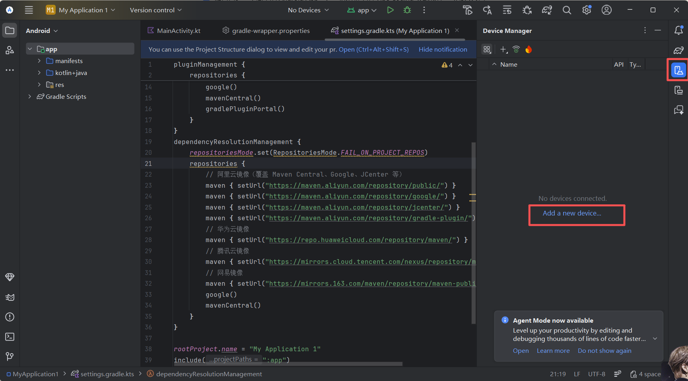

启动模拟器，再点击工具栏运行按钮。

看到空白应用，说明 SDK、Gradle、模拟器和项目已经连通。不要在空白项目都无法运行时让 AI 同时增加业务功能。

## 3. 让 AI 做第一版

用 Trae 或 Cursor 打开当前项目目录：

> 请把当前 Compose 首页改成电子木鱼。黑色背景，中间一个木鱼按钮，上方显示次数；点击后次数加一并有轻微缩放。完成后告诉我重新运行的位置。

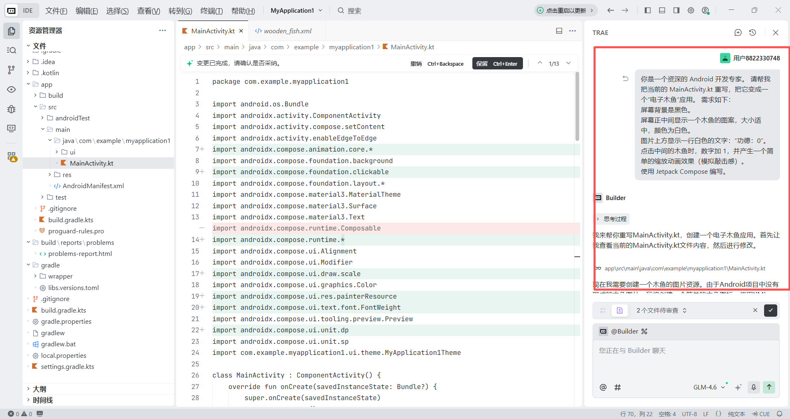

回到 Android Studio，等待 Gradle 同步，再重新运行。

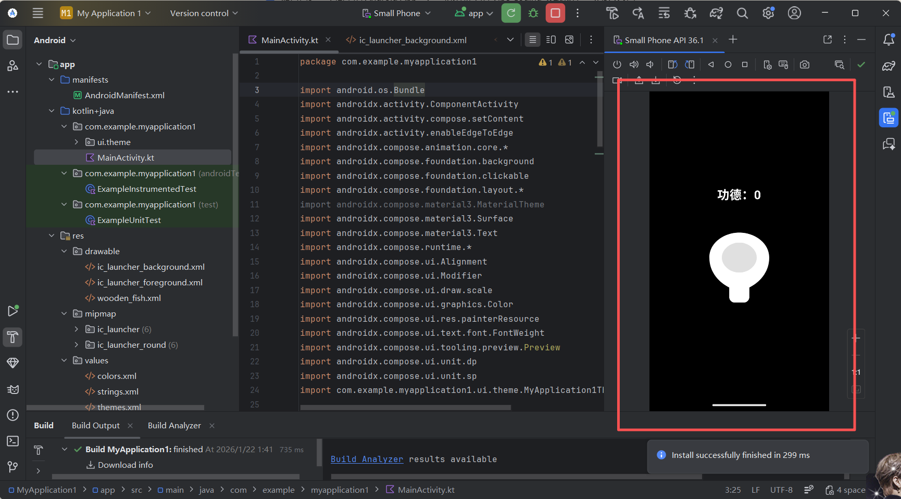

这一轮只验证：按钮能点、数字每次加一、快速点击不会漏掉大量操作、旋转屏幕后应用不崩溃。

界面不满意时只改一件事：

> 请把木鱼按钮放大，并让次数在小屏幕上也完整显示。不要增加新功能。

## 4. 增加图片和音效

把确认有使用权的木鱼图片放到 `res/drawable`，音效放到 `res/raw`。资源文件名只用小写字母、数字和下划线。

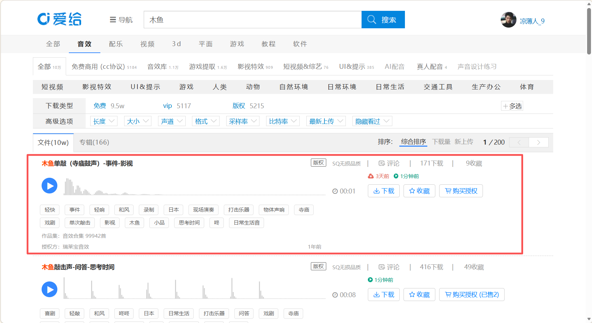

> 请使用 drawable 里的木鱼图片和 raw 里的敲击音效。点击时播放一次，页面离开后释放音频资源。

重新运行，连续点击十几次。声音不能明显延迟，也不能在切到后台后继续播放。

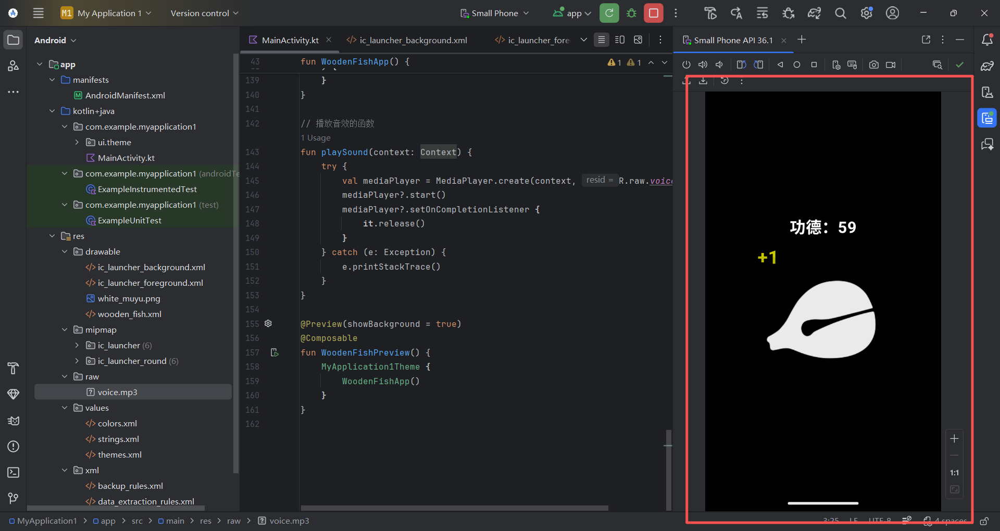

## 5. 增加点击动画

> 请给每次点击增加独立的“+1”上浮动画。快速点击时允许多个动画同时存在，结束后自动清理。

不要在提示词里指定复杂状态容器。先描述结果，让 AI 根据当前代码选择实现；只有出现性能或状态问题时，再讨论具体技术。

## 6. 保存次数

> 请把点击次数保存在本机。应用关闭再打开后继续显示原来的数值，并增加“重置”按钮和确认弹窗。

按这个顺序验证：

1. 点击到一个容易识别的数字。
2. 从最近任务中关闭应用。
3. 重新打开，确认数字还在。
4. 点击重置后取消，数字不能变化。
5. 再次重置并确认，数字回到零。

## 7. 处理错误

运行失败时，在 Android Studio 底部打开 Build 或 Logcat，复制第一条与当前应用相关的错误。

> 我点击【操作】后应用退出。Logcat 最相关的错误是【内容】。请只修复这个问题，并告诉我怎样复测。

不要一次粘贴几千行日志，也不要把账号、Token、设备标识和个人数据发给 AI。

## 8. 真机测试

模拟器通过后，再用一台 Android 手机测试触摸、音量、震动和后台恢复。

在手机“开发者选项”中打开 USB 调试，用数据线连接电脑；首次连接时，在手机上确认这台电脑的调试授权。

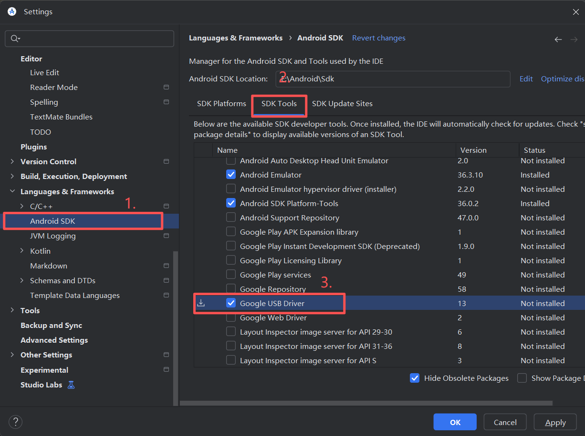

Android Studio 顶部设备列表出现手机后，选择它并运行。

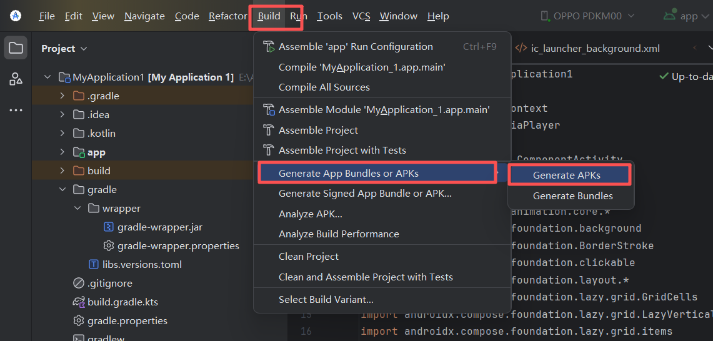

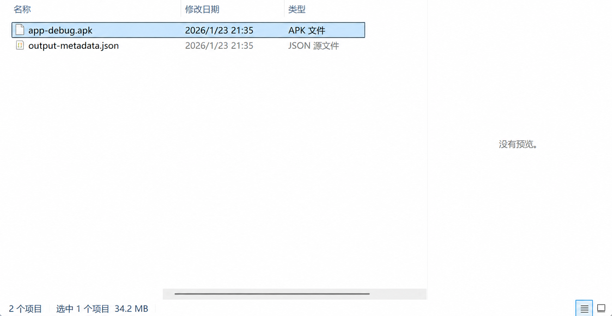

真机至少测试：

- 快速连续点击；
- 静音和不同音量；
- 切到后台再回来；
- 锁屏再解锁；
- 关闭并重启应用；
- 小屏幕和系统大字体。

## 9. 生成测试 APK

给同事内部体验时，可以先生成 Debug APK。它适合测试，不适合正式发布。

在 Android Studio 中选择 **Build APK**，完成后通过通知中的链接打开输出目录。

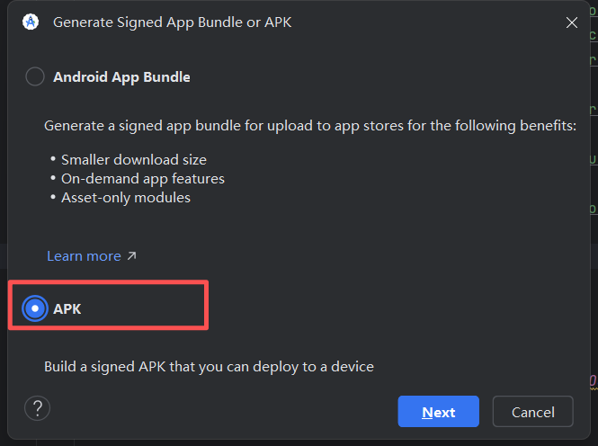

把 APK 安装到另一台没有开发环境的手机，重新完成点击、音效、保存和重置测试。

## 10. 生成签名版本

正式分发需要签名。选择 **Generate Signed Bundle / APK**，优先为应用商店生成 Android App Bundle；直接分发时再根据需要生成 APK。

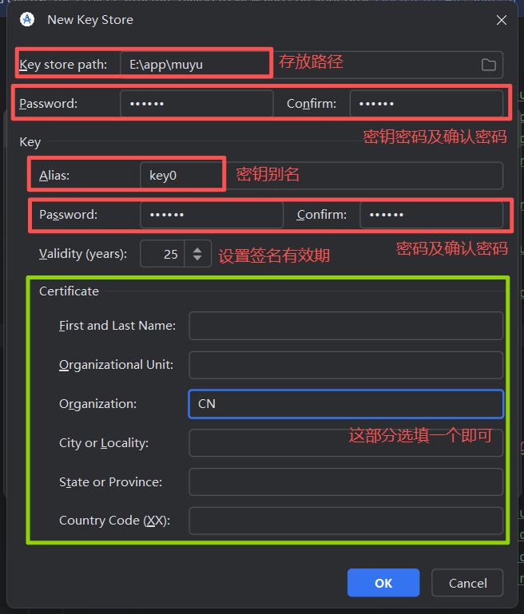

签名文件和密码不能提交到公开仓库，也不要发给 AI。丢失正式签名材料可能影响后续版本更新，应放进团队的受控密钥管理流程并做好备份。

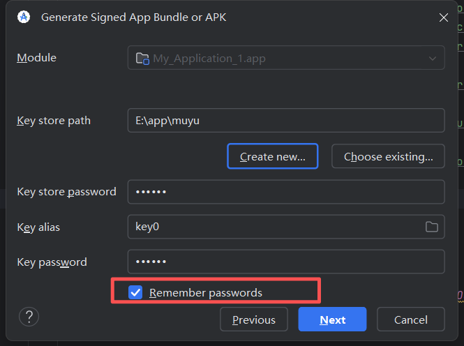

## 11. 发布前检查

应用商店的账号、测试和资料要求会变化，提交时以对应市场后台的当前提示为准。

发布前至少准备：

- 应用名称、图标、截图和说明；
- 隐私政策与数据安全说明；
- 正确的版本号和包名；
- Release 签名构建；
- 不同系统版本和真机测试结果；
- 图片、字体和音效的商业授权。

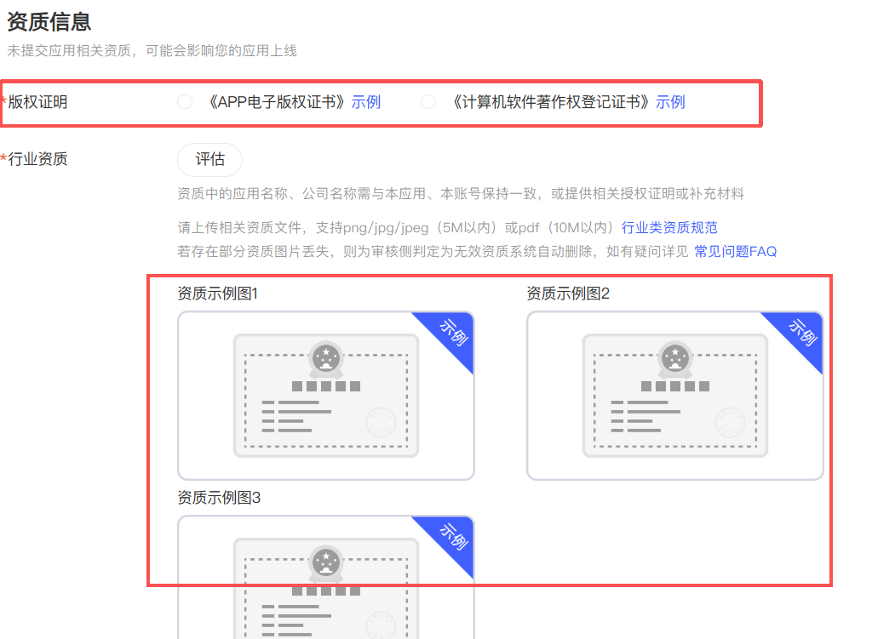

## 12. 最后检查

- 空白 Compose 项目能运行；
- 电子木鱼在模拟器和真机都能使用；
- 快速点击不会卡死或丢失大量操作；
- 音频资源会正确释放；
- 点击次数在重启后仍然存在；
- Debug APK 在另一台手机验证；
- Release 签名材料没有进入源码；
- 商用素材已经确认授权。

## 参考资料

- [Android Studio](https://developer.android.com/studio)
- [Jetpack Compose](https://developer.android.com/compose)
- [在硬件设备上运行应用](https://developer.android.com/studio/run/device)
- [准备和发布 Android 应用](https://developer.android.com/studio/publish)
