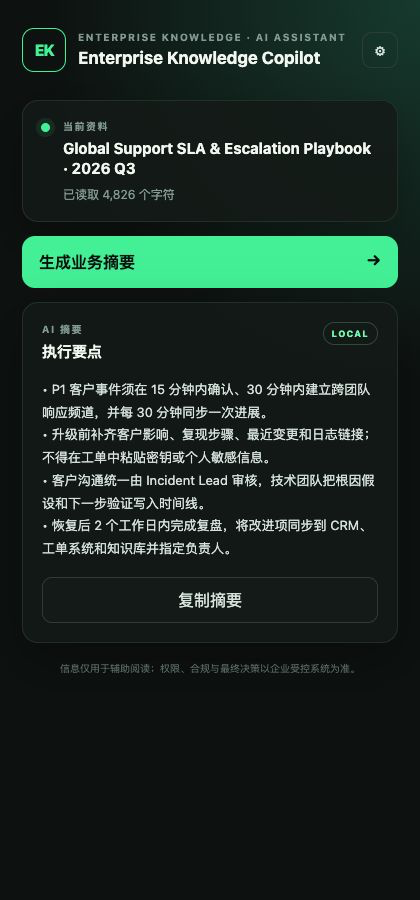
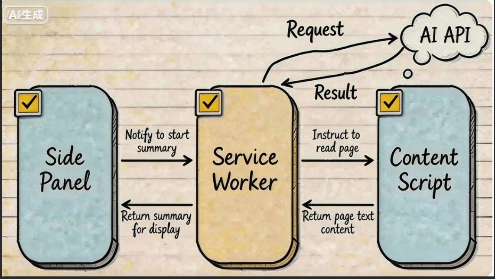
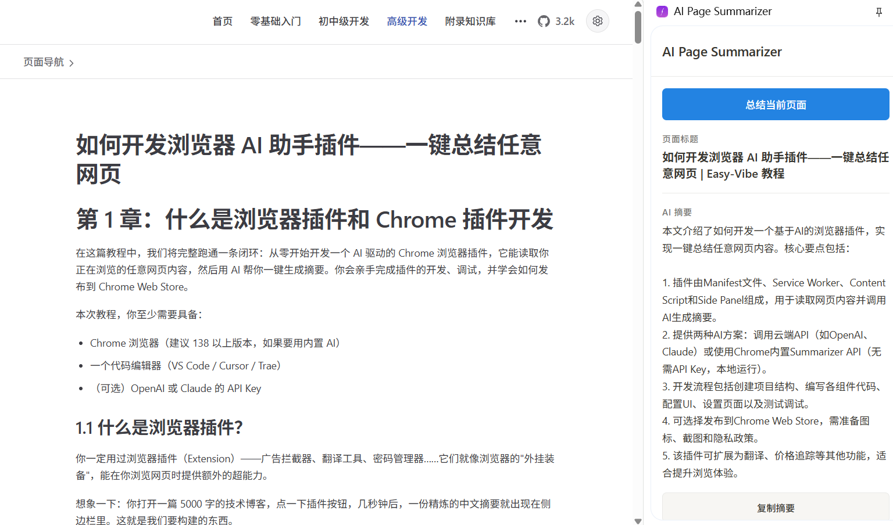

# 做一个浏览器侧边栏知识助手

这一篇做一个 Chrome 扩展：打开制度、帮助中心或项目文档时，点击一次就能在侧边栏看到标题、关键规则、风险和下一步动作。

企业常把这类扩展做成客服坐席助手、内部知识检索、销售情报侧栏、合规提醒和流程录制工具。浏览器扩展离员工正在处理的网页最近，适合提供“看完当前页面，马上给出下一步”的能力。

这次先完成不联网的本地版本，再按需要接 Chrome 内置 AI 或企业后端。

## 1. 先看懂扩展的结构

这个扩展只有三个核心部分：

- Content Script 读取当前页面可见文字；
- Service Worker 负责接收事件和组织处理流程；
- Side Panel 展示按钮、加载状态和摘要结果。

Service Worker 会在需要时启动，空闲后可能被浏览器回收，所以不能把必须保留的状态只放在内存里。

## 2. 创建第一版

新建空文件夹 `enterprise-knowledge-copilot`，用 Trae 或 Cursor 打开，然后说：

> 请在当前文件夹创建一个 Chrome Manifest V3 扩展。点击扩展图标后打开侧边栏，侧边栏先显示“读取当前页面”按钮。完成后告诉我怎样加载到 Chrome。

AI 完成后，项目里至少应有 manifest、service worker、content script 和 side panel 页面。不要手工复制一整套陌生代码，先让它解释每个文件负责什么。

## 3. 加载到 Chrome

在地址栏打开 `chrome://extensions`，打开右上角“开发者模式”，点击“加载已解压的扩展程序”，选择刚才的项目文件夹。

成功时，卡片上能看到扩展名称和版本，没有红色错误。把扩展固定到工具栏，点击图标，确认右侧能打开空白侧边栏。

如果加载失败，把卡片上的第一条错误交给 AI：

> Chrome 加载扩展失败，错误是【粘贴错误】。请只修复这一项，并告诉我重新加载的位置。

## 4. 读取当前页面

现在只做页面读取：

> 请让“读取当前页面”按钮取得当前标签页的标题、网址和正文可见文字，并显示在侧边栏。不要读取密码框、表单输入和隐藏内容。

修改完成后，在扩展管理页点击该扩展的“重新加载”，再打开一篇普通文章测试。

成功标准：

- 标题与当前网页一致；
- 正文不是整页 HTML；
- 切换标签页以后读取的是新页面；
- `chrome://` 页面或无权限页面会显示清楚的提示。

## 5. 做一个不联网的摘要

第一版不接模型。用固定规则提取页面标题、前几段和列表项，这样任何电脑都能验证消息链路。

> 请把读取结果整理成“页面主题、关键要点、数字与时间、下一步”四部分。先使用本地规则，不调用网络 API。

摘要不需要像模型一样聪明，但必须稳定。找一篇有标题、列表和日期的页面，确认每个区域都有内容；再打开空白页，确认不会一直显示加载中。

## 6. 加上复制和错误状态

> 请增加复制摘要按钮，并补齐加载中、空内容和失败三种状态。重复点击时只处理最后一次请求。

验证时连续点击两次，侧边栏不能出现两份结果。故意在 `chrome://extensions` 页面点击读取，应该显示“当前页面不能读取”，而不是控制台异常。

## 7. 选择真正的 AI 方式

本地规则跑通以后，再从下面两条里选一条。

### 7.1 Chrome 内置 Summarizer

Chrome 的 Summarizer API 需要先做功能检测，模型也可能处于待下载状态。不要只根据版本号假定它一定可用。

> 请增加 Chrome Summarizer 模式。先检测是否支持并显示模型下载进度；不可用或语言不支持时自动回到本地摘要。

Chrome 官方目前要求由用户操作触发模型创建。首次下载需要网络，下载完成后的处理在本机进行。不同语言的支持范围会变化，实际结果以运行时检测为准。

### 7.2 企业后端

团队共用时，不要把共享密钥放进扩展或 `chrome.storage.local`。让扩展把经过限制和脱敏的正文发给企业后端，由后端完成身份、配额和模型调用。

> 请增加企业后端模式。扩展只发送当前页面标题和用户确认过的正文；密钥留在服务端，失败时保留本地摘要。

如果只是个人本机实验，也可以允许用户填写自己的密钥，但设置页必须明确说明风险，不能把它当成组织部署方案。

## 8. 检查权限

回到 manifest，确认只申请当前功能需要的权限。能用 `activeTab` 完成的事情，不要直接申请读取所有网站。

> 请检查 manifest 权限，只保留当前功能需要的项目，并解释每一项为什么存在。

发布前至少检查：

- 没有把密钥写进源码或安装包；
- 不读取密码框、表单输入和隐藏内容；
- 用户点击后才读取页面；
- 日志不记录完整网页正文；
- 企业模式经过登录和文档权限校验。

## 9. 调试三个位置

浏览器扩展有三个不同的调试位置：

1. 侧边栏界面：在侧边栏中打开开发者工具。
2. Service Worker：在扩展管理页点击“Service Worker”。
3. Content Script：在当前网页的开发者工具里查看。

报错时先确认错误来自哪一层，再交给 AI：

> 点击摘要后没有结果。侧边栏错误是【内容】，Service Worker 错误是【内容】。请只修复消息没有返回的问题。

## 10. 完整验收

按下面顺序操作一次：

1. 在扩展管理页重新加载项目。
2. 打开一篇有标题、列表和日期的文章。
3. 打开侧边栏并生成本地摘要。
4. 复制结果，确认格式完整。
5. 切换到另一篇文章，再生成一次。
6. 打开无权限页面，确认错误提示清楚。
7. 重启浏览器，确认非敏感设置仍在。

一项失败时，不要让 AI 重写项目：

> 验收第【几】步失败，现象是【描述】。请只修复这一项，不改已经通过的功能。

## 11. 打包和发布

本地使用时，在项目文件夹外复制一份干净版本，删除日志、测试数据和本地配置，再压缩为 ZIP。

发布到 Chrome Web Store 前，准备图标、说明、隐私政策、权限用途和真实截图。商店规则会更新，提交时以 Chrome Web Store 后台的当前要求为准。

发布前再做一次隐私检查：

> 请检查当前扩展是否上传网页内容、保存密钥或申请了多余权限。只列风险和必须修改项。

## 12. 最后检查

- 扩展能在开发者模式下加载；
- 侧边栏可以读取当前页面；
- 本地摘要不联网也能工作；
- 加载、成功、空内容和失败状态齐全；
- Chrome 内置 AI 不可用时有回退；
- 企业密钥不进入浏览器客户端；
- 三个调试位置都知道从哪里打开；
- ZIP 中没有密钥、日志和测试数据。

## 参考资料

- [Chrome Extensions 文档](https://developer.chrome.com/docs/extensions/)
- [Manifest V3 Service Worker](https://developer.chrome.com/docs/extensions/develop/concepts/service-workers)
- [Chrome Summarizer API](https://developer.chrome.com/docs/ai/summarizer-api)
- [Chrome Web Store 发布文档](https://developer.chrome.com/docs/webstore/publish/)
