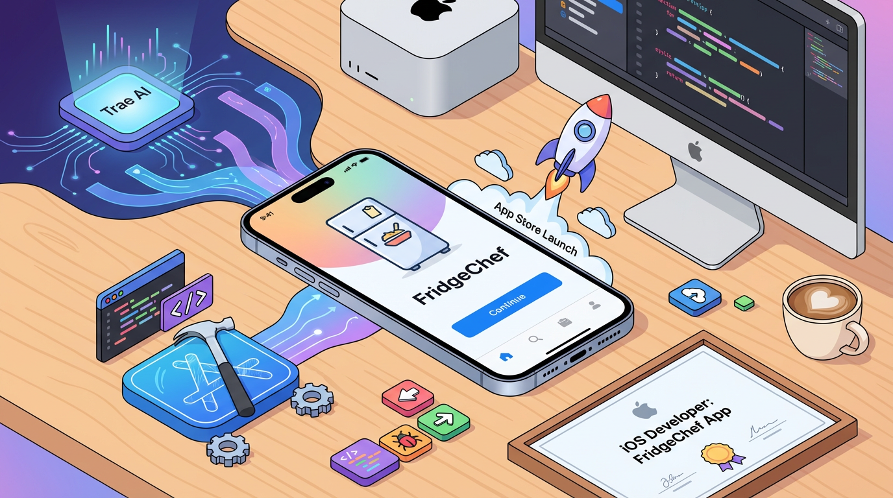
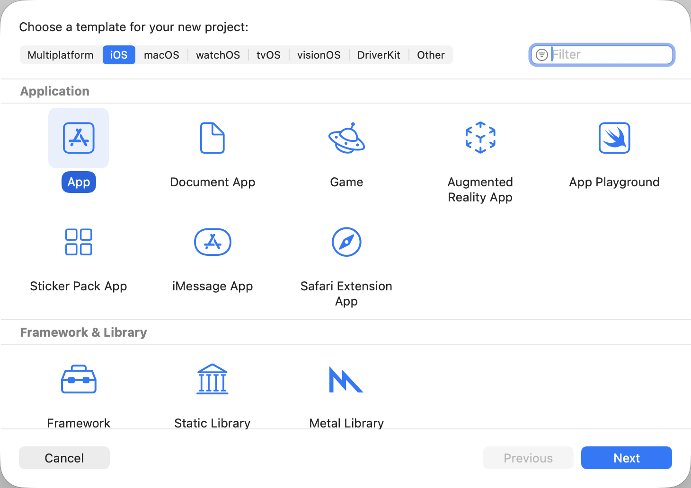
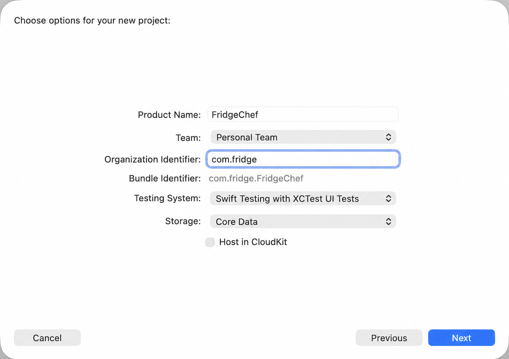
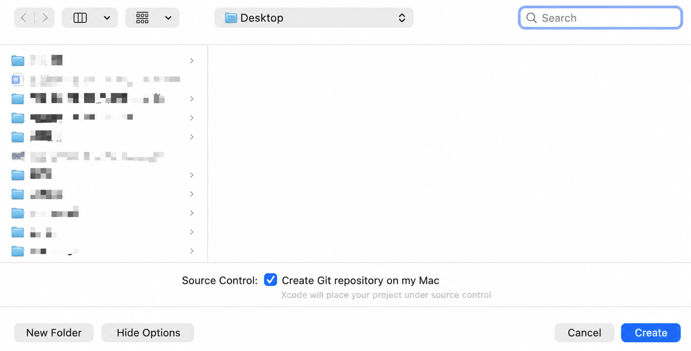
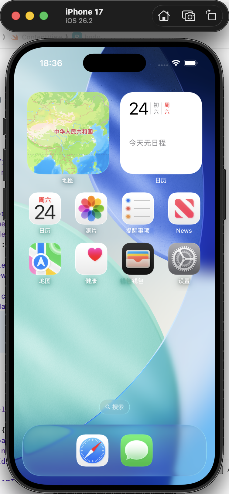
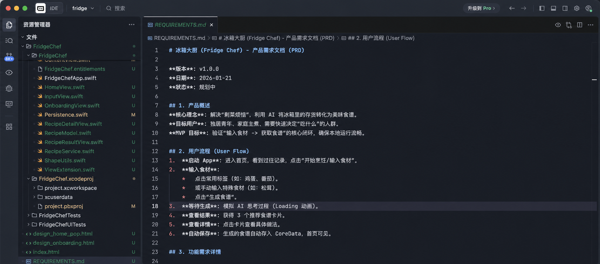
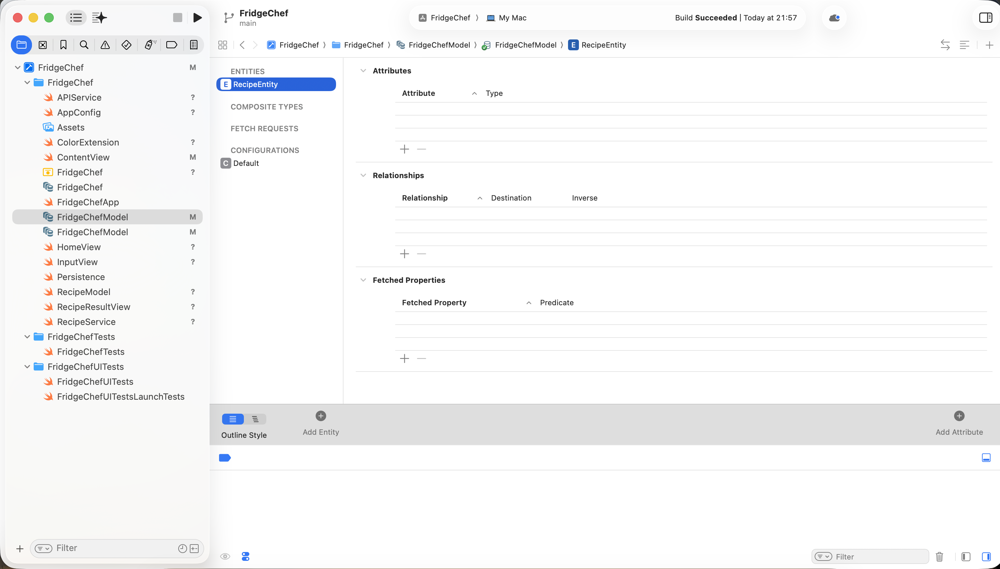
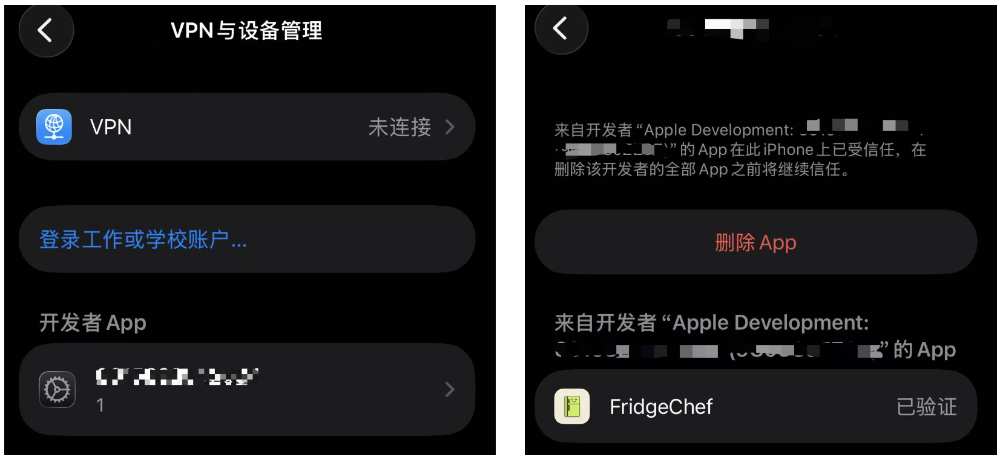

# 用 AI 做一个 SwiftUI iOS App

这一篇做一个原生 iPhone 应用：**冰箱大厨 FridgeChef**。

用户输入现有食材，应用生成一份菜谱，并把确认过的结果保存在本机。我们会走完 Xcode 项目、模拟器、AI 修改、后端接口、本地存储、真机测试和 App Store 发布准备。

## 1. 准备设备和工具

iOS 应用需要一台能运行当前 Xcode 的 Mac。真机测试还需要 iPhone 和 Apple ID；只有模拟器测试时，可以暂时不接手机。

从 Mac App Store 安装 Xcode，第一次启动时等待开发组件安装完成。

如果后面要连接 iPhone，在手机“隐私与安全”里开启开发者模式。菜单位置可能随 iOS 版本变化，以手机当前提示为准。

## 2. 创建并运行空白项目

在 Xcode 欢迎页选择 **Create New Project**。

模板选择 iOS App，界面使用 SwiftUI，语言使用 Swift。

项目名填写 `FridgeChef`，Organization Identifier 使用自己的反向域名。需要本地历史记录时，可以选择 SwiftData；如果模板提供的选项不同，也可以稍后再增加。

选择保存位置并创建项目。

先不要改代码。顶部选择一台 iPhone 模拟器，点击 Run。

空白应用能启动，才说明 Xcode、SDK、签名和模拟器已经连通。

> 空白 SwiftUI 项目运行失败，错误是【粘贴错误】。请只修复环境或签名问题，不增加功能。

## 3. 做出第一版界面

用 Trae 或 Cursor 打开 Xcode 项目目录：

> 请把当前 SwiftUI 首页改成冰箱大厨。首页显示食材输入框、生成菜谱按钮和历史记录空状态，先使用演示数据。

回到 Xcode 重新运行。第一轮只看输入框、按钮和空状态，不接网络。

如果布局不适合小屏幕：

> 请让首页在小屏幕和大字体下也能完整滚动，保持现有配色，不增加新功能。

## 4. 增加演示菜谱

> 请让生成按钮先返回一份固定菜谱，包含名称、食材和步骤。生成中禁用按钮，失败状态也要有重新尝试入口。

验证：

1. 没输入食材时不能提交。
2. 点击后先显示处理中。
3. 完成后显示菜名、食材和步骤。
4. 连续点击不会产生多份重复结果。
5. 返回首页后还能看到刚才的菜谱。

## 5. 接入真实后端

正式应用不能把组织共享 API Key 写进 iOS 客户端。App 安装包可以被分析，写在 Swift 文件、配置文件或 Keychain 中的共享模型密钥都不能算服务器秘密。

正确做法是：iOS App 登录自己的业务后端，后端再调用模型服务。

> 请把演示菜谱替换为业务后端接口。App 只发送食材并接收结构化菜谱，不保存模型密钥；增加超时、取消和错误提示。

接口返回内容要经过校验。字段缺失或格式不正确时，页面显示可理解的错误，不能直接崩溃。

可以用后端测试地址先验证，但不要把内部地址和 Token 提交到公开仓库。

## 6. 保存历史记录

网络链路稳定以后，再保存用户确认过的菜谱。

在 Xcode 中创建 SwiftData 模型或当前项目使用的本地数据模型。

> 请把用户确认的菜谱保存到本机，并在首页按时间倒序显示。删除前需要确认，空数据库显示空状态。

按顺序测试：

1. 保存一份菜谱。
2. 关闭应用再打开。
3. 确认历史记录仍然存在。
4. 删除时先取消，记录不能消失。
5. 再次删除并确认，记录才被移除。

## 7. 准备 App 图标

图标应为自己创作或确认有权使用的素材。生成 1024×1024 原图后，拖入 Assets 中对应的 App Icon 资源。

重新运行，确认模拟器桌面和应用切换器里都显示新图标。

## 8. 做一次完整模拟器验收

至少检查：

- 空输入、正常输入和超长输入；
- 后端超时、断网和返回格式错误；
- 生成中取消；
- 保存、重启、删除；
- 深色模式；
- 系统大字体；
- 小屏幕模拟器。

出错时复制 Xcode 中最相关的一段：

> 我执行【操作】后出现【现象】。Xcode 错误是【内容】。请只修复这一项，并告诉我怎样复测。

日志里不要写完整菜谱输入、用户 Token、联系方式或服务器密钥。

## 9. 在真机运行

用数据线连接 iPhone，首次连接时在手机上选择信任。

回到 Xcode，在顶部设备列表选择自己的 iPhone，确认 Signing & Capabilities 中选择了正确团队，再点击 Run。

个人 Apple ID 可以用于开发调试，但签名有效期和能力有限。系统要求信任开发者时，根据手机当前提示操作。

真机重点测试键盘、网络切换、后台恢复、深色模式、动态字体和真实触摸区域。

## 10. 发布前准备

准备上架时，需要加入 Apple Developer Program，在 App Store Connect 创建 App 条目，并通过 Xcode 上传归档构建。

账号费用、SDK 要求、隐私清单和审核规则会变化，提交时以 Apple 当前后台和官方文档为准。

发布前至少准备：

- 稳定的 Bundle ID 和版本号；
- App 图标、真实截图和说明；
- 隐私政策、数据收集说明和账号删除流程；
- 后端生产环境和故障监控；
- Release 真机测试；
- 图片、字体和内容的授权证明。

## 11. 最后检查

- 空白项目能在模拟器运行；
- 首页、演示菜谱和历史记录有完整状态；
- 真实模型密钥不在 iOS 客户端；
- 后端超时、断网和异常返回有提示；
- 本地记录在重启后仍然存在；
- 深色模式、大字体和小屏幕通过测试；
- App 能安装到真实 iPhone；
- 发布资料和隐私说明已经准备。

## 参考资料

- [SwiftUI](https://developer.apple.com/xcode/swiftui/)
- [在 Xcode 中运行应用](https://developer.apple.com/documentation/xcode/running-your-app-in-simulator-or-on-a-device)
- [App Store Review Guidelines](https://developer.apple.com/app-store/review/guidelines/)
- [上传 App 构建](https://developer.apple.com/help/app-store-connect/manage-builds/upload-builds/)
