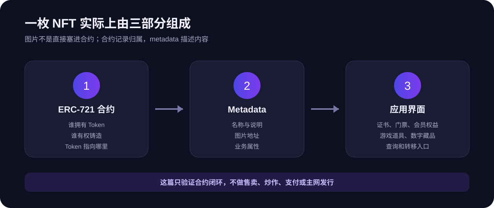
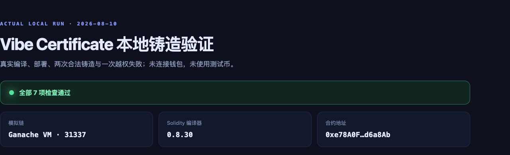
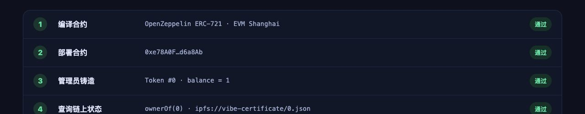
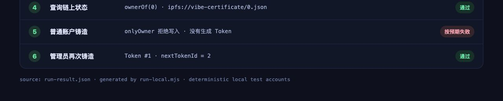
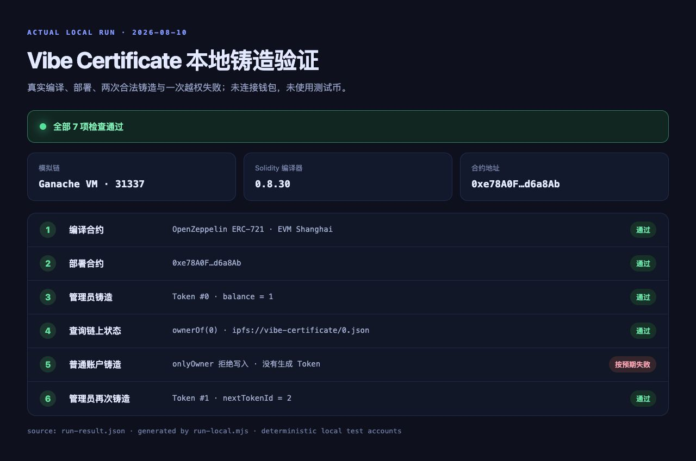

# 在本地模拟链上铸造一枚 NFT

这篇不装钱包，也不领测试币。我们直接在电脑上启动一条临时模拟链，跑完一次 ERC-721 合约的编译、部署、铸造和查询。

我在 2026 年 8 月 10 日重新做了一遍：第一次运行遇到了编译器与本地链不兼容的问题；修好以后，管理员成功铸造了 Token `0` 和 Token `1`，另一个测试账户的越权铸造也确实失败了。下面出现的运行结果，都是这次本地实操留下的截图。

整个过程不连接公共网络，不使用真实钱包，也不会碰到真实资产。

## 1. 这次要做什么

我们做一个 **Vibe Certificate**，可以理解成一张数字证书：

- 合约采用 ERC-721；
- 只有部署合约的管理员可以铸造；
- 每次铸造都会得到新的 Token 编号；
- 可以查询持有人、余额和 metadata 地址。

NFT 不是把整张图片塞进区块链。合约通常只保存 Token 编号、归属和 `tokenURI`，应用再根据这个地址读取名称、图片和属性。

企业里的 NFT 产品也不只是数字图片。活动门票、培训证书、会员凭证、游戏道具和商品溯源，都可能使用同一套思路。

## 2. 准备一个干净的本地实验

电脑需要先安装 Node.js 18 或更高版本。然后新建一个空目录，让 AI 只在这个目录里工作。

第一句话不用写很长：

> 请在一个新的临时目录里搭建最小 NFT 实验。使用 Solidity、OpenZeppelin ERC-721 和 Ganache 本地链，不连接钱包和公共网络。完成后直接运行一次。

AI 会安装本地依赖，并准备合约和运行脚本。依赖只放在临时目录，不要把整套示例工程提交到教程仓库。

这次实际运行使用的是 Ganache 本地链、链 ID `31337` 和 Solidity `0.8.30`：

看到模拟链、编译器和合约地址都出现，说明本地环境已经工作。

## 3. 让 AI 写最小合约

接着只说清楚功能：

> 请创建 Vibe Certificate 合约。只有管理员能铸造，Token 编号从 0 开始递增，并支持 tokenURI。不要加收费、白名单、批量铸造和升级功能。

AI 完成后，先让它检查一次：

> 请检查管理员权限和 Token 编号，不要增加新功能。

这一轮只做最小闭环。售卖、支付和盲盒都先不加，否则很难判断问题到底出在哪里。

## 4. 编译并部署到本地链

让 AI 直接运行：

> 请编译合约并部署到本地模拟链。成功后告诉我编译器版本、链 ID 和合约地址。

我第一次运行时，部署虽然完成了，但查询 `tokenURI` 报了 `invalid opcode`。原因是编译器生成的 EVM 指令比本地链支持的版本更新。

遇到这种错误，不用让 AI 重写合约：

> 本地链提示 invalid opcode。请只检查编译器和 EVM 版本是否兼容，然后重新运行。

固定到双方都支持的 EVM 版本以后，编译和部署通过，管理员也成功铸造了第一枚 Token：

## 5. 查询第一枚 Token

部署成功不代表功能正确，还要把写入结果读回来。

> 请用管理员账户铸造 Token 0，然后查询 ownerOf、balanceOf 和 tokenURI，把结果一起打印出来。

这次实际返回的是：

- `ownerOf(0)` 与管理员测试账户一致；
- 管理员余额为 `1`；
- `tokenURI(0)` 为 `ipfs://vibe-certificate/0.json`。

这三个结果同时正确，第一次铸造才算完成。

## 6. 换一个账户测试权限

代码里写了“只有管理员”还不够，必须真的换账户试一次。

> 请换第二个本地测试账户调用 mint。它应该失败，而且不能生成新 Token。然后换回管理员再铸造一次。

实际结果是：普通账户被 `onlyOwner` 拒绝，没有生成 Token；管理员再次铸造后得到 Token `1`，下一个编号变成 `2`。

这里的“失败”是测试通过，不是程序坏了。权限限制本来就应该拒绝普通账户。

## 7. 看完整运行结果

最后从头运行一次，不只看某一步。下面是这次完整本地验证：

页面里的合约地址和账户地址都是本地模拟链生成的测试地址，没有真实资产。重新启动本地链后，地址和链上状态都可以重置。

## 8. 准备一份测试 metadata

刚才的 `tokenURI` 只是测试地址。真正展示证书时，它通常会指向一份 JSON，里面再写名称、说明、图片地址和属性。

先让 AI 做一份最小内容：

> 请为 Vibe Certificate 写一份最小 metadata，只保留名称、说明和图片地址，并解释每个字段。

这一步只检查格式，不需要上传真实文件。身份证号、手机号、内部工单和其他隐私信息，不要写进公开链上的 metadata。

## 9. 想用 Remix 怎么办

如果不想在本地安装依赖，也可以在 [Remix IDE](https://remix.ethereum.org/) 里使用 Remix VM 重复同样的过程：新建合约、编译、部署、管理员铸造、查询，再换第二个测试账户验证失败。

提示词仍然可以很短：

> 我已经在本地模拟链跑通。请告诉我怎样在 Remix VM 重复这 6 个检查，不连接真实钱包。

Remix 界面会更新，所以这里不再拿旧版官方截图代替本次实操截图。认准文件、编译器和部署运行三个面板即可。

## 10. 什么时候再上公共测试网

先确认本地已经通过：

- 管理员能铸造；
- 普通账户不能铸造；
- Token 编号不重复；
- `ownerOf`、`balanceOf` 和 `tokenURI` 都正确；
- 全程没有真实私钥、助记词和资产。

这些都完成以后，再考虑 Sepolia 等公共测试网。

> 本地测试已经通过。请告诉我怎样部署到当前 Sepolia，只写步骤和安全提醒，不索要私钥或助记词。

测试网入口、水龙头和钱包界面经常变化，不要把某个网站或某个测试币额度写成固定承诺。助记词和私钥永远不要发给 AI、网站客服或其他人。

## 11. 常见问题

### 编译失败

> 编译失败，错误是【粘贴错误】。请只修当前错误，不增加功能。

### 部署后查询报 invalid opcode

> 部署后查询报 invalid opcode。请检查 Solidity、EVM 版本和本地链是否兼容。

### 普通账户居然也能铸造

> 第二个账户也能 mint。请只检查管理员权限，修好后重新做一次失败测试。

### Token 编号重复

> 连续铸造后 Token 编号重复。请只修编号递增，并重新查询 0 和 1。

## 12. 做完以后检查

这一篇完成时，你应该亲眼看到：

- 合约真实编译通过；
- 合约真实部署到本地链；
- 管理员真实铸造 Token `0`；
- 查询结果与写入内容一致；
- 普通账户真实失败，而且没有生成 Token；
- 管理员再次铸造得到 Token `1`；
- 没有连接真实钱包，也没有花钱。

这还是一个合约实验，不是可以直接运营的平台。企业产品还需要用户端、运营后台、内容存储、密钥托管、合约审计、监控和合规。

## 参考资料

- [OpenZeppelin Contracts 5.x：ERC-721](https://docs.openzeppelin.com/contracts/5.x/erc721)
- [OpenZeppelin Contracts 5.x：Access Control](https://docs.openzeppelin.com/contracts/5.x/access-control)
- [Ganache](https://github.com/trufflesuite/ganache)
- [Remix：创建并部署合约](https://remix-ide.readthedocs.io/en/latest/create_deploy.html)
- [ERC-721 标准](https://eips.ethereum.org/EIPS/eip-721)
