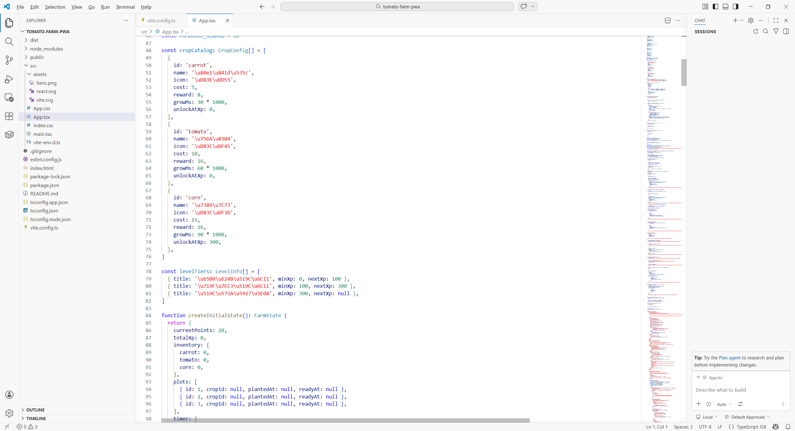
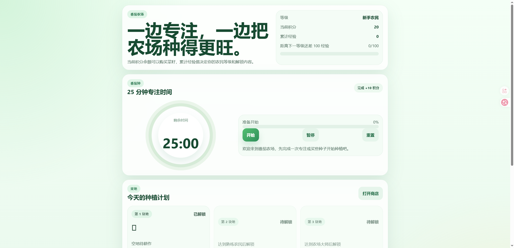
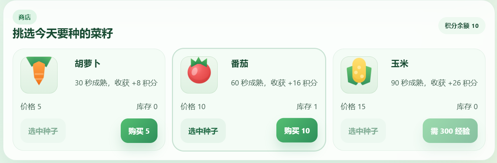
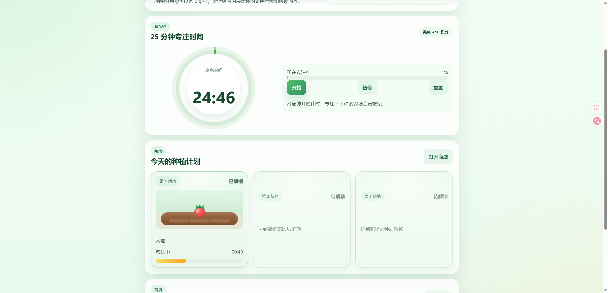
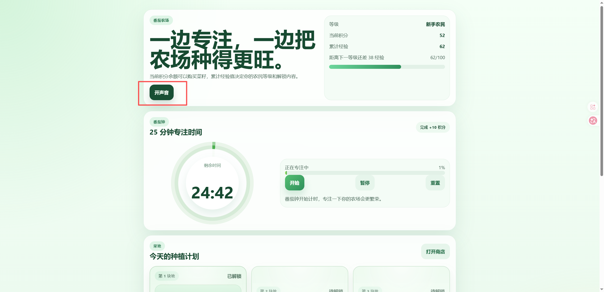
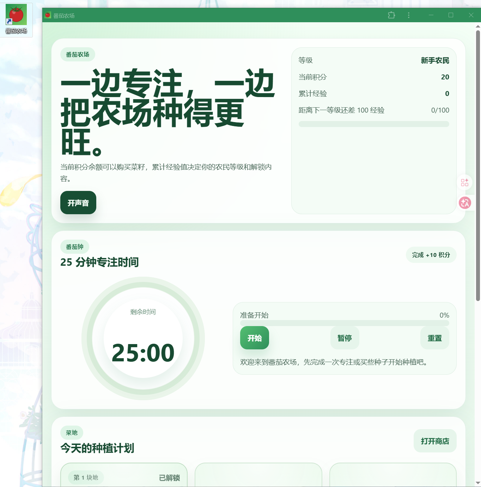
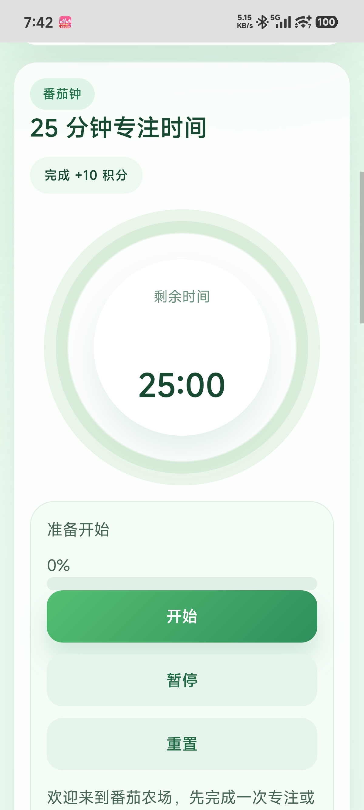

# 做一个可以安装和离线使用的 PWA

这一篇做一个 **番茄农场 PWA**：用户可以开始番茄钟、获得积分、种植作物，并把它安装到电脑或手机桌面。断网后，已经缓存的页面和本机数据仍然可以使用。

PWA 适合轻量工具、门店表单、活动应用、内部门户和离线采集页面。它仍然是网站，不等于所有系统能力都和原生 App 一样。


## 1. 先看懂 PWA 的结构

普通网页加上 Web App Manifest 和 Service Worker 后，才具备安装入口、图标和离线缓存能力。


- Manifest 描述名称、图标和启动方式；
- Service Worker 缓存应用外壳和必要资源；
- IndexedDB 或 localStorage 保存当前设备的数据；
- 后端负责账号和跨设备同步。

## 2. 创建 React 项目

确认已经安装当前 LTS 版本的 Node.js，再新建空目录：

> 请在当前目录创建 React、TypeScript 和 Vite 项目，名称 tomato-farm-pwa。完成后告诉我怎样启动空白页面。

安装依赖并启动开发服务器。看到 Vite 默认页，终端没有红色错误，说明基础环境正常。

## 3. 增加 PWA 配置

> 请给当前 Vite 项目增加 PWA。配置应用名称、主题色、192 和 512 图标，并让生产构建注册 Service Worker。

准备两张正方形图标，放进公开资源目录。




开发服务器里不一定能完整表现生产 Service Worker。先确认配置能编译，离线测试放到生产预览阶段。

## 4. 做出第一版番茄农场

> 请把首页改成番茄农场。包含 25 分钟计时器、积分、三块菜地和种子商店；先用本机数据，不做登录和云同步。



运行后应看到计时器、积分、菜地和商店。




不要为了测试等 25 分钟。增加仅在开发环境可见的“立即完成一次”按钮，生产构建不显示。

> 请增加开发测试按钮，让我立即完成一次番茄钟。它只在开发环境出现。

## 5. 增加作物状态

> 请给作物增加幼苗、生长和成熟三种状态。收获后增加积分，并阻止同一块地重复种植。



验证：积分不足不能购买；空地才能种植；未成熟不能收获；收获后积分只增加一次。

需要动效时只补一件事：

> 请给种植和收获增加轻微动画，并尊重系统的“减少动态效果”设置。



## 6. 保存本机数据

> 请把积分、菜地和计时状态保存在本机。刷新和关闭页面后可以恢复，并增加导出和导入备份。

先不要急着接云端。按顺序测试：

1. 修改积分和菜地状态。
2. 刷新页面，确认数据还在。
3. 关闭浏览器再打开，确认仍能恢复。
4. 导出备份。
5. 清空本机数据，再导入备份。

导入文件必须校验格式和版本，覆盖数据前要再次确认。

## 7. 构建并预览生产版本

执行：

```bash
npm run build
npm run preview
```

打开终端给出的本地预览地址。开发者工具的 Application 面板中应能看到 Manifest 和已注册的 Service Worker。

构建失败时：

> PWA 生产构建失败，错误是【粘贴错误】。请只修复 Manifest、图标或 Service Worker 配置。

## 8. 测试安装

支持安装的桌面浏览器可能在地址栏或菜单里显示“安装应用”。安装入口由浏览器、系统和站点状态共同决定，不要只检查某一个图标。



安装后从系统应用列表启动，确认它以独立窗口打开，名称和图标正确。

## 9. 测试离线

先在线打开一次生产预览，让 Service Worker 完成缓存。然后在开发者工具 Network 面板切换 Offline，再刷新。


成功标准：

- 页面能打开；
- 已缓存的图标和样式存在；
- 计时器和本机数据仍能使用；
- 需要网络的操作明确显示离线；
- 恢复网络后不会重复提交。

不要只关闭 Wi-Fi后看一眼首页。至少刷新、修改一条数据、关闭再打开一次。

## 10. 可选：增加账号和同步

如果要跨设备同步，需要后端账号、数据权限和冲突处理。把 localStorage 换成云数据库，并不会自动解决这些问题。

> 请为现有 PWA 设计登录和跨设备同步。先说明数据表、用户权限、离线队列和冲突规则，不要直接修改代码。

方案确认后，再逐步实现：

> 请先完成登录和“只读自己的数据”，不要做实时同步。完成后告诉我怎么用两个账号测试。

确认账号隔离以后，再增加离线队列和同步。服务端规则必须保证用户只能读写自己的农场。

本机数据、服务端数据和待同步队列要分别显示状态；不能声称“数据永不丢失”，而应提供备份、失败提示和恢复办法。

## 11. 部署到 HTTPS

Service Worker 在生产环境需要安全上下文，常见托管平台会提供 HTTPS。选择团队正在使用的平台，连接仓库并设置构建命令 `npm run build`、输出目录 `dist`。

部署完成后，用线上地址重新测试 Manifest、Service Worker、安装和离线模式。本地预览通过，不代表线上路径配置一定正确。

> 线上页面能打开，但 PWA 没有安装入口。请检查 HTTPS、Manifest、图标路径和 Service Worker 范围，只修复部署配置。

## 12. 在手机安装

在 Android 浏览器中打开 HTTPS 地址，从浏览器菜单选择“安装应用”或“添加到主屏幕”。不同品牌菜单文字可能不同。



在 iPhone 上打开页面，通过浏览器分享菜单选择“添加到主屏幕”。系统和浏览器版本会影响入口位置，以当前界面为准。

安装后测试锁屏、切后台、断网、重新联网和清理浏览器数据后的表现。

## 13. 使用 Lighthouse

打开 Chrome DevTools 的 Lighthouse，检查性能、可访问性和最佳实践。新版 Lighthouse 的分类可能调整，不要把“PWA 必须满分”当成验收条件。


重点修复会影响真实用户的问题：图标缺失、离线白屏、按钮不可访问、资源过大和首屏加载慢。

## 14. 最后检查

- 开发和生产构建都能运行；
- Manifest 名称、颜色和图标正确；
- Service Worker 在生产预览中注册；
- 安装后的独立窗口可以启动；
- 断网刷新不会白屏；
- 本机数据可以导出和恢复；
- 云同步启用时通过双账号隔离测试；
- 线上 HTTPS 地址重新完成安装和离线验证。

## 参考资料

- [Web App Manifest](https://developer.mozilla.org/docs/Web/Progressive_web_apps/Manifest)
- [Service Worker API](https://developer.mozilla.org/docs/Web/API/Service_Worker_API)
- [让 PWA 可以安装](https://developer.mozilla.org/docs/Web/Progressive_web_apps/Guides/Making_PWAs_installable)
- [Vite PWA](https://vite-pwa-org.netlify.app/)
