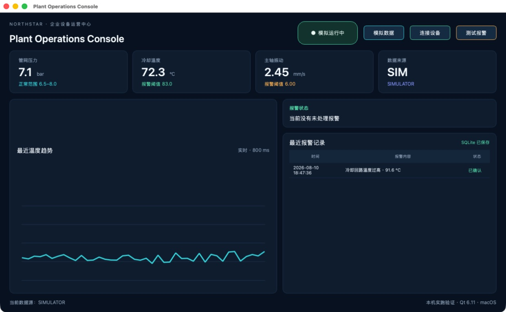
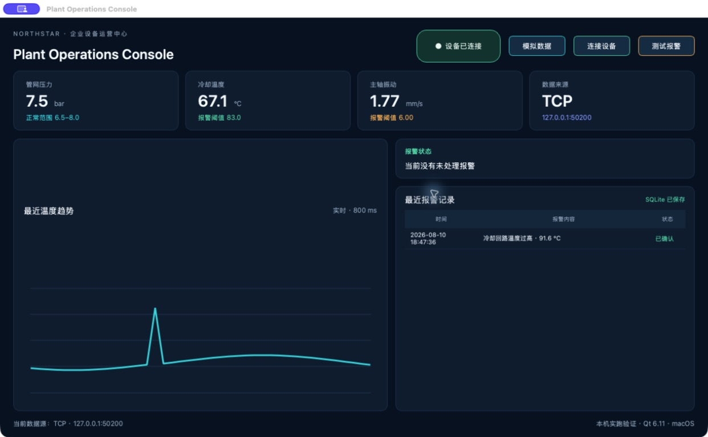

# 用 Qt 做一个企业设备运营客户端

这一篇做一个能在桌面上运行的设备运营客户端。它会显示压力、温度和振动，设备断线时给出提醒，出现异常时生成报警，并把报警记录保存在本机。

这一次没有先画效果图。我在一台 Mac 上把项目从安装 Qt、运行模拟数据、连接本地设备、触发报警、重启验证，一直做到生成独立应用和 DMG。下面的操作图都来自这次实际运行。

这是最后从打包目录启动的成品：

本篇使用 Qt 官方的 Python 绑定 **PySide6**。它仍然是 Qt 6，只是比第一次就配置 C++、CMake 和编译器更容易跟着做。等界面和数据链路稳定后，再根据团队情况决定要不要迁移到 C++。

## 1. 准备环境

电脑需要有 Python 3.11 或更高版本，再准备一个能读取当前文件夹的 AI 开发工具。本文继续使用 Trae，Cursor 或其他类似工具也可以。

先新建一个空文件夹，命名为 `PlantOperationsConsole`，然后用 Trae 打开。对 AI 说：

> 请为当前项目创建独立的 Python 环境，并安装 Qt 官方的 PySide6，完成后告诉我 Qt 版本。

我本机这次安装的是 Qt 6.11.1。安装完成以后，先不要做复杂功能，只检查能否打开一个 Qt 空窗口。

如果空窗口没有出现，把终端里的最后一段报错交给 AI：

> Qt 空窗口没有打开，报错是【粘贴报错】，请只修复这个问题。

## 2. 先把首页跑起来

环境正常后，让 AI 做第一版：

> 请用 PySide6 做一个设备运营客户端，显示压力、温度、振动、连接状态和最近趋势，数据先每秒自动变化。

AI 完成后，按它给出的方式启动程序。第一版不需要登录、数据库或真实设备，只确认窗口能打开，数字和曲线会持续变化。

我本机运行后的结果如下。右上角显示“模拟运行中”，底部数据源是 `SIMULATOR`：

如果文字被遮住或窗口缩放后布局错乱，只改布局：

> 窗口缩小时有内容被遮住，请只调整布局，不改功能和颜色。

## 3. 连接一个本地设备模拟器

现在的数字都在客户端内部生成，还不能验证连接和断线。先让 AI 增加一个单独运行的设备模拟器：

> 请增加一个本地 TCP 设备模拟器，每秒向 127.0.0.1:50200 发送压力、温度和振动。

先启动模拟器，确认它正在等待连接，再改客户端：

> 请让客户端连接 127.0.0.1:50200，并增加“模拟数据”和“连接设备”两个按钮。

客户端连接成功后，状态变成“设备已连接”，数据来源变成 `TCP`，页面数值也开始跟着模拟器变化：

接着直接关闭设备模拟器。客户端不能卡住，也不能继续假装在线。我本机关闭以后，状态立即变成了“设备已断开”：

重新启动模拟器，再点一次“连接设备”，连接也恢复成功。

如果断线后窗口卡住，可以这样问：

> 设备断开后窗口会卡住，请只修复断线检测和重新连接。

真实项目里可以把这个本地 TCP 模拟器换成 Modbus TCP、OPC UA 或企业已有接口。先把页面、报警和断线处理跑稳，再换协议会容易很多。

## 4. 增加报警

先只做报警，不急着做数据库：

> 请增加温度和振动报警，并放一个“测试报警”按钮让我立即验证。

点击“测试报警”后，温度升到测试值，趋势出现尖峰，右侧出现红色报警卡片：

报警至少要写清楚时间、内容和状态。只显示一句“温度过高”，以后很难追查什么时候发生、有没有处理。

如果点击按钮没有反应，不要重新描述整个项目：

> 点击“测试报警”没有出现报警，请只检查按钮和报警规则。

## 5. 用 SQLite 保存报警

报警能出现以后，再让 AI 保存记录：

> 请把报警保存到本地 SQLite，确认以后更新状态，应用重启后记录还要存在。

我先确认了刚才的报警，列表状态从“待确认”变成“已确认”：

然后关闭整个应用，再重新启动。刚才那条报警仍然在列表里，说明这不是只存在页面内存里的假数据：

如果重启以后记录消失，直接说：

> 应用重启后报警记录消失了，请只检查数据库保存位置和提交操作。

## 6. 打包成独立的 macOS 应用

开发环境里能运行还不够。接下来用 PySide6 自带的部署工具生成独立 `.app`：

> 请用 pyside6-deploy 把当前项目打包成 macOS 独立应用，先做 dry-run，确认没有错误再正式打包。

我第一次 dry-run 时遇到了一个真实问题：部署工具提示 macOS 打包不支持把 QtSql 作为额外模块加入。开发态虽然能运行，但继续打包会失败。

这时只处理这个问题：

> macOS 打包提示 QtSql 不受支持，请保留 SQLite，改用 Python 自带的 sqlite3，只修复打包问题。

修改后重新运行，部署工具成功生成了 `PlantOperationsConsole.app`。我没有停在“文件已经生成”，而是直接从这个 `.app` 的打包目录启动，模拟数据和 SQLite 历史都能正常显示。

最后使用 macOS 自带的磁盘映像工具生成 DMG，并完成完整性校验。Finder 里可以看到 105.2 MB 的独立应用和 44.5 MB 的磁盘映像：

本次生成的 DMG 校验结果是 `VALID`。它还没有做开发者证书签名和 Apple 公证，所以这里只适合本机和内部测试。准备公开发布时再补签名、公证和升级策略。

## 7. Windows 怎么处理

PySide6 项目代码可以继续在 Windows 上运行，但 Windows 安装包必须在 Windows 机器上打，不能拿 Mac 生成的 `.app` 当作跨平台安装包。

换到 Windows 后，先重新运行开发版，再说：

> 请在这台 Windows 电脑上用 pyside6-deploy 生成独立应用，并告诉我怎样在没有 Python 的环境验证。

至少要在一台没有安装 Python 和 PySide6 的 Windows 电脑或干净虚拟机中检查启动、设备连接、报警和 SQLite。没有做完这一步，就不要写“Windows 已通过”。

## 8. 这次实际通过了什么

这次在 macOS 上完成并验证了以下操作：

- Qt 6.11.1 客户端可以独立启动；
- 模拟数据会持续刷新；
- 本地 TCP 设备能连接、断开并重新连接；
- 测试报警会显示在页面并写入 SQLite；
- 确认报警后状态会更新；
- 完全关闭应用再启动，历史记录仍然存在；
- `pyside6-deploy` 成功生成独立 `.app`；
- 从打包目录启动 `.app`，核心功能仍然正常；
- DMG 成功生成，并通过完整性校验。

Windows 打包、真实 Modbus 或 OPC UA 设备、代码签名和 Apple 公证没有在这台 Mac 上冒充“已经完成”。这些要在对应环境里继续实测并补图。

## 参考资料

- [Qt for Python 官方文档](https://doc.qt.io/qtforpython-6/)
- [PySide6 部署工具](https://doc.qt.io/qtforpython-6/deployment/deployment-pyside6-deploy.html)
- [Qt Network](https://doc.qt.io/qtforpython-6/PySide6/QtNetwork/)
- [Qt for Python 打包说明](https://doc.qt.io/qtforpython-6/deployment/index.html)
