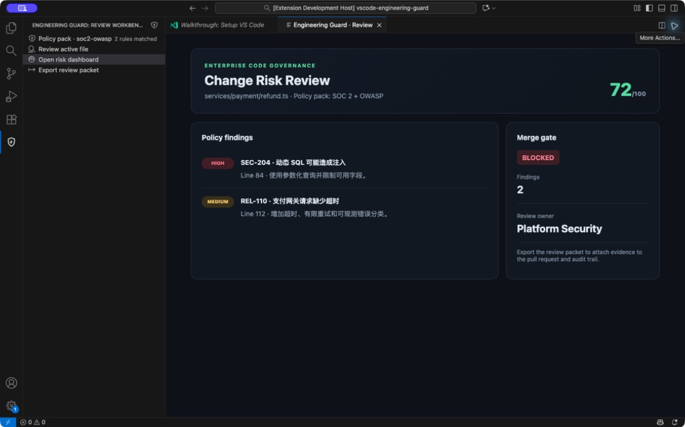
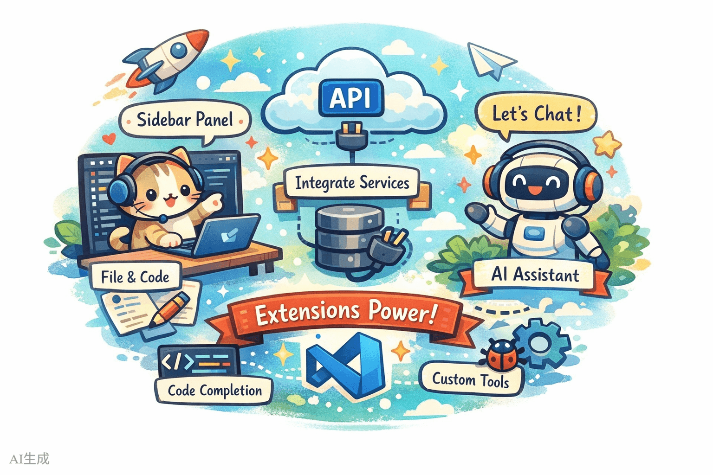
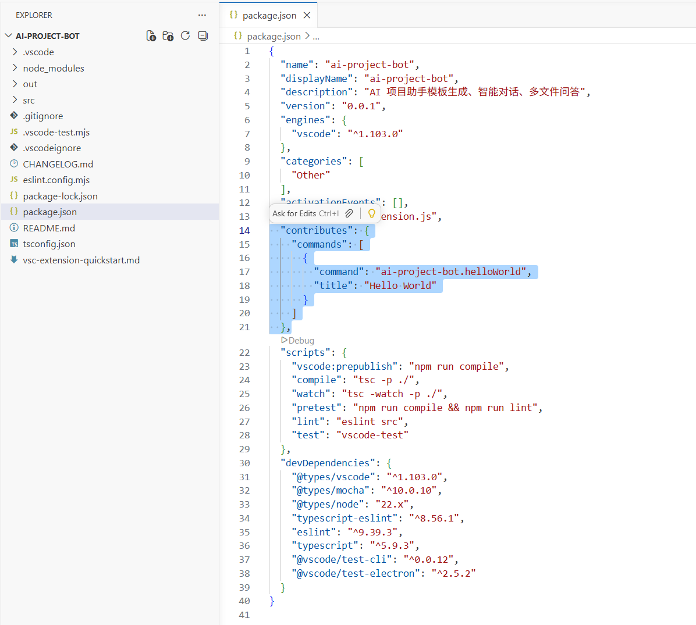
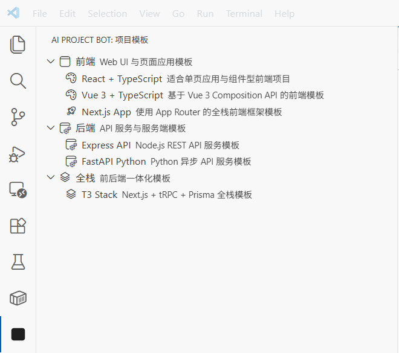
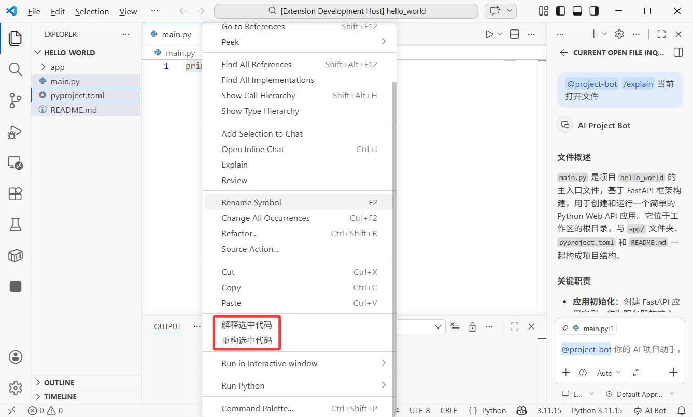
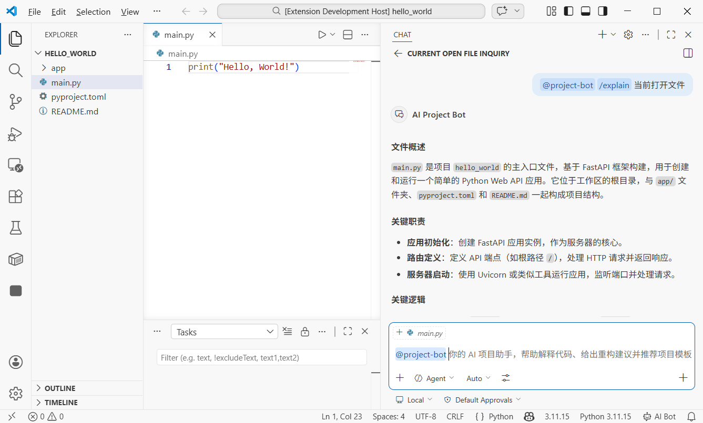

# 做一个 VS Code 代码检查插件

这一篇做一个可以在团队里继续扩展的 VS Code 插件：**Engineering Guard**。

用户打开文件后，可以运行一次本地检查，找出硬编码凭证、缺少超时的网络请求和动态 SQL，并在侧边栏查看问题。第一版不调用模型、不上传源码，也不需要 API Key。



企业常把 VS Code 插件做成内部脚手架、代码规范检查、仓库知识助手、安全门禁、工单入口和发布工具。插件最大的价值，是把组织能力放进开发者每天使用的编辑器。

## 1. 先看懂插件结构

插件运行在 Extension Host 中，不直接和编辑器主界面混在一起。




这次只用四个部分：

- `package.json` 声明命令、侧边栏和菜单；
- 入口文件在插件启动时注册功能；
- 本地扫描器读取当前文件并返回问题；
- Tree View 在侧边栏显示结果。

## 2. 创建项目

先安装当前 LTS 版本的 Node.js 和 VS Code。打开终端，让 AI 帮你创建官方 TypeScript 插件项目：

> 请用 VS Code 官方生成器创建 TypeScript 插件，名称 Engineering Guard。创建完成后告诉我怎样用 VS Code 打开并按 F5 调试。

进入项目目录，安装依赖，再用 VS Code 打开。



按 F5 后会打开一个 **Extension Development Host** 窗口。在新窗口中打开命令面板，运行默认的 Hello World 命令。


看到通知，说明插件已经被正确加载。失败时先处理环境：

> 按 F5 后插件没有启动，错误是【粘贴错误】。请只修复调试配置，不增加业务功能。

## 3. 增加第一条命令

先把默认命令改成“检查当前文件”：

> 请增加“Engineering Guard: 检查当前文件”命令。运行后先显示当前文件名，不做代码扫描。

重新按 F5，在 Development Host 中打开任意代码文件，再从命令面板执行。

成功时，通知里的文件名与当前编辑器一致；没有打开文件时，应提示“请先打开文件”。

## 4. 做本地规则检查

现在只增加三条容易验证的规则：

> 请让检查命令识别疑似硬编码密钥、没有超时的网络请求和字符串拼接 SQL。结果包含文件、行号、规则和建议，不要上传源码。

准备一个专门的测试文件，分别放入三种问题，再运行命令。修改文件后重新检查，已修复的问题应该消失。

不要让 AI 一次生成几十条规则。规则越多，误报越难判断。

## 5. 把结果放进侧边栏

> 请增加 Engineering Guard 侧边栏，按严重程度显示本次检查结果。点击一条结果时跳到对应文件和行号。



截图里的内容来自旧示例，但操作位置相同：活动栏出现独立图标，展开侧边栏后看到树形结果。

验证四种状态：

- 还没检查；
- 当前文件没有问题；
- 发现一条问题；
- 当前文件被关闭或删除。

## 6. 增加右键入口

> 请在编辑器右键菜单增加“检查选中代码”。只扫描用户选中的内容，没有选中时不显示。



再给资源管理器增加“检查这些文件”：

> 请在资源管理器右键菜单增加“检查这些文件”。限制文件数量，并跳过二进制文件、依赖目录和超大文件。


测试时选择一个文件、多个文件和一个文件夹。插件不能因为遇到图片或 `node_modules` 就卡死。

## 7. 增加状态栏

> 请在状态栏显示最近一次检查结果。点击后打开侧边栏，没有检查时显示“尚未检查”。


状态栏只显示简短结果，不要持续闪烁，也不要抢占编辑器的重要通知区域。

## 8. 可选：接入 VS Code Chat

本地规则完全跑通以后，才考虑 Chat Participant。它适合解释组织规则或生成修复建议，不应该成为本地检查能否工作的前提。



> 请为现有插件增加 Chat Participant，只解释当前检查结果。运行时选择用户可用的模型，不写死具体模型名称；没有模型权限时保留本地规则功能。

Chat Participant 需要在 manifest 注册，并实现请求处理。模型和权限由用户当前的 VS Code 环境决定，因此不能假定每个人都有同一个模型或订阅。

发送给模型之前，应让用户知道会包含哪些代码。企业版本还要遵守仓库权限、数据边界和组织策略。

## 9. 调试方法

插件调试主要看三个位置：

1. Development Host 中的界面状态；
2. 原 VS Code 窗口的 Debug Console；
3. Development Host 的 Extension Host 日志。

问题发生时，把操作和最相关错误一起交给 AI：

> 点击【命令】后没有反应。Debug Console 错误是【内容】。请只修复这条命令的注册或执行问题。

不要只说“插件坏了”，也不要让 AI 重建项目。

## 10. 完整验收

按下面顺序走一遍：

1. 按 F5 打开 Development Host。
2. 打开无问题文件，运行检查。
3. 打开测试文件，确认三条规则都能命中。
4. 点击侧边栏结果，确认跳到正确行。
5. 测试编辑器右键和资源管理器多选。
6. 修改问题并重新检查，确认结果消失。
7. 禁用模型能力，确认本地检查仍然可用。
8. 重新加载窗口，确认命令和侧边栏仍然存在。

> 验收第【几】步失败，现象是【描述】。请只修复这一项，不改已经通过的功能。

## 11. 打包 VSIX

先检查 manifest 中的名称、版本、发布者、图标、仓库和许可证，再安装官方发布工具并打包：

```bash
npx @vscode/vsce package
```

生成 `.vsix` 后，不要马上发布。先在另一个 VS Code 配置或另一台电脑中选择“Install from VSIX”，重新完成核心验收。

如果包里意外包含测试数据或大文件，增加 `.vscodeignore` 后重新打包。

## 12. 发布到 Marketplace

正式发布需要发布者身份和当前 Marketplace 要求的凭据。账号、权限和审核规则会更新，提交时以 VS Code 官方发布文档为准。

发布前确认：

- README 有真实截图和使用方法；
- 隐私说明写清楚是否读取或上传源码；
- 不包含 Token、测试凭据和内部地址；
- 本地规则在没有模型时也能工作；
- VSIX 已在干净环境安装验证。

## 13. 最后检查

- F5 能打开 Extension Development Host；
- 命令面板、侧边栏、右键菜单和状态栏都能工作；
- 三条本地规则有可重复的测试文件；
- 点击问题能定位到正确行；
- 没有默认上传源码；
- 模型不可用时不会影响本地检查；
- VSIX 在另一套 VS Code 环境通过验证。

## 参考资料

- [VS Code Extension API](https://code.visualstudio.com/api)
- [Tree View API](https://code.visualstudio.com/api/extension-guides/tree-view)
- [Chat Participant API](https://code.visualstudio.com/api/extension-guides/ai/chat)
- [发布 VS Code 插件](https://code.visualstudio.com/api/working-with-extensions/publishing-extension)
